This document explains how users can add filters to their data query graph within the interactive data exploration interface. The system determines the correct place to attach the filter—either to an existing node or by creating a new filter node—and updates the interface to reflect the change.

# Where is this flow used?

This flow is used multiple times in the codebase as represented in the following diagram:

```mermaid
graph TD;
      8f1719026d188d8a5a20eca06455d112a4d8ab6618a9b7b98abe7b6b7adaf1df(ui/…/dev.perfetto.ExplorePage/explore_page.ts::ExplorePage.view) --> d220e52f001fcf9ec76443b9c5969003249d45a8059e4eb7566f4143c1fffcea(ui/…/dev.perfetto.ExplorePage/explore_page.ts::ExplorePage.handleFilterAdd)

9293a901ea07afdff5fb1b1ff8fca8aee60a38890b153d4a8005a3a20575f953(ui/…/dev.perfetto.ExplorePage/explore_page.ts::onFilterAdd) --> d220e52f001fcf9ec76443b9c5969003249d45a8059e4eb7566f4143c1fffcea(ui/…/dev.perfetto.ExplorePage/explore_page.ts::ExplorePage.handleFilterAdd)

092c70573b8f2c648a7533e7a919d2cab065e2830addfa75ae6d635c9a9b7a63(ui/…/query_builder/builder.ts::onFilterAdd) --> 9293a901ea07afdff5fb1b1ff8fca8aee60a38890b153d4a8005a3a20575f953(ui/…/dev.perfetto.ExplorePage/explore_page.ts::onFilterAdd)

b509ccb45cc8e03f65f3168ab47121baa9de9ad7412e3aa7a1083bfd1c46be2f(ui/…/query_builder/builder.ts::Builder.view) --> 092c70573b8f2c648a7533e7a919d2cab065e2830addfa75ae6d635c9a9b7a63(ui/…/query_builder/builder.ts::onFilterAdd)


classDef mainFlowStyle color:#000000,fill:#7CB9F4
classDef rootsStyle color:#000000,fill:#00FFF4
classDef Style1 color:#000000,fill:#00FFAA
classDef Style2 color:#000000,fill:#FFFF00
classDef Style3 color:#000000,fill:#AA7CB9

%% Swimm:
%% graph TD;
%%       8f1719026d188d8a5a20eca06455d112a4d8ab6618a9b7b98abe7b6b7adaf1df(<SwmPath>[ui/…/dev.perfetto.ExplorePage/explore_page.ts](ui/src/plugins/dev.perfetto.ExplorePage/explore_page.ts)</SwmPath>::ExplorePage.view) --> d220e52f001fcf9ec76443b9c5969003249d45a8059e4eb7566f4143c1fffcea(<SwmPath>[ui/…/dev.perfetto.ExplorePage/explore_page.ts](ui/src/plugins/dev.perfetto.ExplorePage/explore_page.ts)</SwmPath>::ExplorePage.handleFilterAdd)
%% 
%% 9293a901ea07afdff5fb1b1ff8fca8aee60a38890b153d4a8005a3a20575f953(<SwmPath>[ui/…/dev.perfetto.ExplorePage/explore_page.ts](ui/src/plugins/dev.perfetto.ExplorePage/explore_page.ts)</SwmPath>::<SwmToken path="ui/src/plugins/dev.perfetto.ExplorePage/explore_page.ts" pos="818:1:1" line-data="        onFilterAdd: (node, filter) =&gt; {">`onFilterAdd`</SwmToken>) --> d220e52f001fcf9ec76443b9c5969003249d45a8059e4eb7566f4143c1fffcea(<SwmPath>[ui/…/dev.perfetto.ExplorePage/explore_page.ts](ui/src/plugins/dev.perfetto.ExplorePage/explore_page.ts)</SwmPath>::ExplorePage.handleFilterAdd)
%% 
%% 092c70573b8f2c648a7533e7a919d2cab065e2830addfa75ae6d635c9a9b7a63(<SwmPath>[ui/…/query_builder/builder.ts](ui/src/plugins/dev.perfetto.ExplorePage/query_builder/builder.ts)</SwmPath>::<SwmToken path="ui/src/plugins/dev.perfetto.ExplorePage/explore_page.ts" pos="818:1:1" line-data="        onFilterAdd: (node, filter) =&gt; {">`onFilterAdd`</SwmToken>) --> 9293a901ea07afdff5fb1b1ff8fca8aee60a38890b153d4a8005a3a20575f953(<SwmPath>[ui/…/dev.perfetto.ExplorePage/explore_page.ts](ui/src/plugins/dev.perfetto.ExplorePage/explore_page.ts)</SwmPath>::<SwmToken path="ui/src/plugins/dev.perfetto.ExplorePage/explore_page.ts" pos="818:1:1" line-data="        onFilterAdd: (node, filter) =&gt; {">`onFilterAdd`</SwmToken>)
%% 
%% b509ccb45cc8e03f65f3168ab47121baa9de9ad7412e3aa7a1083bfd1c46be2f(<SwmPath>[ui/…/query_builder/builder.ts](ui/src/plugins/dev.perfetto.ExplorePage/query_builder/builder.ts)</SwmPath>::Builder.view) --> 092c70573b8f2c648a7533e7a919d2cab065e2830addfa75ae6d635c9a9b7a63(<SwmPath>[ui/…/query_builder/builder.ts](ui/src/plugins/dev.perfetto.ExplorePage/query_builder/builder.ts)</SwmPath>::<SwmToken path="ui/src/plugins/dev.perfetto.ExplorePage/explore_page.ts" pos="818:1:1" line-data="        onFilterAdd: (node, filter) =&gt; {">`onFilterAdd`</SwmToken>)
%% 
%% 
%% classDef mainFlowStyle color:#000000,fill:#7CB9F4
%% classDef rootsStyle color:#000000,fill:#00FFF4
%% classDef Style1 color:#000000,fill:#00FFAA
%% classDef Style2 color:#000000,fill:#FFFF00
%% classDef Style3 color:#000000,fill:#AA7CB9
```



# Deciding How to Attach a Filter Node

<SwmSnippet path="/ui/src/plugins/dev.perfetto.ExplorePage/explore_page.ts" line="425">

---

In <SwmToken path="ui/src/plugins/dev.perfetto.ExplorePage/explore_page.ts" pos="425:3:3" line-data="  async handleFilterAdd(">`handleFilterAdd`</SwmToken>, we first check if the source node is a <SwmToken path="ui/src/plugins/dev.perfetto.ExplorePage/explore_page.ts" pos="430:17:17" line-data="    // If the source node is already a FilterNode, just add the filter to it">`FilterNode`</SwmToken> or has a single <SwmToken path="ui/src/plugins/dev.perfetto.ExplorePage/explore_page.ts" pos="430:17:17" line-data="    // If the source node is already a FilterNode, just add the filter to it">`FilterNode`</SwmToken> child. If so, we just append the filter to the existing filters and update the UI state. If neither is true, we need to create a new <SwmToken path="ui/src/plugins/dev.perfetto.ExplorePage/explore_page.ts" pos="430:17:17" line-data="    // If the source node is already a FilterNode, just add the filter to it">`FilterNode`</SwmToken> after the source node, which is why we call <SwmToken path="ui/src/plugins/dev.perfetto.ExplorePage/explore_page.ts" pos="459:11:11" line-data="    const newFilterNode = await this.handleAddOperationNode(">`handleAddOperationNode`</SwmToken> next. This call sets up the new node in the graph so we can attach the filter to it.

```typescript
  async handleFilterAdd(
    attrs: ExplorePageAttrs,
    sourceNode: QueryNode,
    filter: {column: string; op: string; value?: unknown},
  ) {
    // If the source node is already a FilterNode, just add the filter to it
    if (sourceNode.type === NodeType.kFilter) {
      sourceNode.state.filters = [
        ...(sourceNode.state.filters ?? []),
        filter as UIFilter,
      ];
      attrs.onStateUpdate((currentState) => ({...currentState}));
      return;
    }

    // If the source node has exactly one child and it's a FilterNode, add to that
    if (
      sourceNode.nextNodes.length === 1 &&
      sourceNode.nextNodes[0].type === NodeType.kFilter
    ) {
      const existingFilterNode = sourceNode.nextNodes[0];
      existingFilterNode.state.filters = [
        ...(existingFilterNode.state.filters ?? []),
        filter as UIFilter,
      ];
      attrs.onStateUpdate((currentState) => ({
        ...currentState,
        selectedNode: existingFilterNode,
      }));
      return;
    }

    // Otherwise, create a new FilterNode after the source node
    const filterNodeId = 'filter_node';
    const newFilterNode = await this.handleAddOperationNode(
      attrs,
      sourceNode,
      filterNodeId,
    );

```

---

</SwmSnippet>

## Creating and Inserting an Operation Node


<SwmSnippet path="/ui/src/plugins/dev.perfetto.ExplorePage/explore_page.ts" line="116">

---

In <SwmToken path="ui/src/plugins/dev.perfetto.ExplorePage/explore_page.ts" pos="116:3:3" line-data="  async handleAddOperationNode(">`handleAddOperationNode`</SwmToken>, we grab the node descriptor and optionally run its <SwmToken path="ui/src/plugins/dev.perfetto.ExplorePage/explore_page.ts" pos="125:6:6" line-data="      if (descriptor.preCreate) {">`preCreate`</SwmToken> hook to set up initial state. We use a <SwmToken path="ui/src/plugins/dev.perfetto.ExplorePage/explore_page.ts" pos="139:3:3" line-data="      const nodeRef: {current?: QueryNode} = {};">`nodeRef`</SwmToken> wrapper so the actions callbacks can reference the new node once it's created. If the node is a modification type, we need to call <SwmToken path="ui/src/plugins/dev.perfetto.ExplorePage/explore_page.ts" pos="164:3:3" line-data="              this.handleInsertModifyColumnsNode(">`handleInsertModifyColumnsNode`</SwmToken> next to insert it properly between nodes in the graph.

```typescript
  async handleAddOperationNode(
    attrs: ExplorePageAttrs,
    node: QueryNode,
    derivedNodeId: string,
  ): Promise<QueryNode | undefined> {
    const {state, onStateUpdate} = attrs;
    const descriptor = nodeRegistry.get(derivedNodeId);
    if (descriptor) {
      let initialState: Partial<QueryNodeState> | null = {};
      if (descriptor.preCreate) {
        const sqlModules = attrs.sqlModulesPlugin.getSqlModules();
        if (!sqlModules) return;
        initialState = await descriptor.preCreate({sqlModules});
      }

      if (initialState === null) {
        return;
      }

      const sqlModules = attrs.sqlModulesPlugin.getSqlModules();
      if (!sqlModules) return;

      // Use a wrapper object to hold the node reference (allows mutation without 'let')
      const nodeRef: {current?: QueryNode} = {};

      const isMultisource = descriptor.type === 'multisource';

      const nodeState: QueryNodeState = {
        ...initialState,
        // For modification nodes, set prevNode; multisource nodes will be connected via addConnection
        ...(isMultisource ? {} : {prevNode: node}),
        sqlModules,
        trace: attrs.trace,
        // Provide actions for nodes that need to interact with the graph
        // We use a closure pattern because the node doesn't exist yet
        actions: {
          onAddAndConnectTable: (tableName: string, portIndex: number) => {
            if (nodeRef.current !== undefined) {
              this.handleAddAndConnectTable(
                attrs,
                tableName,
                nodeRef.current,
                portIndex,
              );
            }
          },
          onInsertModifyColumnsNode: (portIndex: number) => {
            if (nodeRef.current !== undefined) {
              this.handleInsertModifyColumnsNode(
                attrs,
                nodeRef.current,
                portIndex,
              );
            }
          },
        },
      };

```

---

</SwmSnippet>

<SwmSnippet path="/ui/src/plugins/dev.perfetto.ExplorePage/explore_page.ts" line="298">

---

<SwmToken path="ui/src/plugins/dev.perfetto.ExplorePage/explore_page.ts" pos="298:5:5" line-data="  private async handleInsertModifyColumnsNode(">`handleInsertModifyColumnsNode`</SwmToken> figures out which input node to use based on <SwmToken path="ui/src/plugins/dev.perfetto.ExplorePage/explore_page.ts" pos="301:1:1" line-data="    portIndex: number,">`portIndex`</SwmToken>, creates a <SwmToken path="ui/src/plugins/dev.perfetto.ExplorePage/explore_page.ts" pos="306:7:7" line-data="    // Get the ModifyColumns descriptor">`ModifyColumns`</SwmToken> node, rewires the connections so the new node sits between the input and target, and updates the state to select the new node. If the input node isn't found, it just logs a warning and exits.

```typescript
  private async handleInsertModifyColumnsNode(
    attrs: ExplorePageAttrs,
    targetNode: QueryNode,
    portIndex: number,
  ) {
    const sqlModules = attrs.sqlModulesPlugin.getSqlModules();
    if (!sqlModules) return;

    // Get the ModifyColumns descriptor
    const descriptor = nodeRegistry.get('modify_columns');
    if (!descriptor) return;

    // Get the current input node at the specified port
    let inputNode: QueryNode | undefined;
    if ('inputNodes' in targetNode && targetNode.inputNodes) {
      inputNode = targetNode.inputNodes[portIndex];
    } else if (
      'prevNodes' in targetNode &&
      Array.isArray(targetNode.prevNodes)
    ) {
      inputNode = targetNode.prevNodes[portIndex];
    }

    if (!inputNode) {
      console.warn(`No input node found at port ${portIndex}`);
      return;
    }

    // Create the ModifyColumns node with the input node as prevNode
    const newNode = descriptor.factory(
      {
        prevNode: inputNode,
        sqlModules,
        trace: attrs.trace,
      },
      {allNodes: attrs.state.rootNodes},
    );

    // Remove the old connection from inputNode to targetNode
    removeConnection(inputNode, targetNode);

    // Add connection from inputNode to ModifyColumns node
    addConnection(inputNode, newNode);

    // Add connection from ModifyColumns node to targetNode at the same port
    addConnection(newNode, targetNode, portIndex);

    // Add the new node to root nodes (so it appears in the graph)
    attrs.onStateUpdate((currentState) => ({
      ...currentState,
      rootNodes: [...currentState.rootNodes, newNode],
      selectedNode: newNode,
    }));
  }
```

---

</SwmSnippet>

<SwmSnippet path="/ui/src/plugins/dev.perfetto.ExplorePage/explore_page.ts" line="174">

---

Back in <SwmToken path="ui/src/plugins/dev.perfetto.ExplorePage/explore_page.ts" pos="116:3:3" line-data="  async handleAddOperationNode(">`handleAddOperationNode`</SwmToken>, after returning from <SwmToken path="ui/src/plugins/dev.perfetto.ExplorePage/explore_page.ts" pos="164:3:3" line-data="              this.handleInsertModifyColumnsNode(">`handleInsertModifyColumnsNode`</SwmToken>, we use the <SwmToken path="ui/src/plugins/dev.perfetto.ExplorePage/explore_page.ts" pos="179:1:1" line-data="      nodeRef.current = newNode;">`nodeRef`</SwmToken> to finalize the new node's connections. For modification nodes, we clear the original node's <SwmToken path="ui/src/plugins/dev.perfetto.ExplorePage/explore_page.ts" pos="197:11:11" line-data="        const existingNextNodes = [...node.nextNodes];">`nextNodes`</SwmToken>, connect it to the new node, and then reconnect all its previous children through the new node. This keeps the graph structure correct.

```typescript
      const newNode = descriptor.factory(nodeState, {
        allNodes: state.rootNodes,
      });

      // Set the reference so the callback can use it
      nodeRef.current = newNode;

      // Mark this node as initialized
      this.initializedNodes.add(newNode.nodeId);

      if (isMultisource) {
        // For multisource nodes: just connect and add to root nodes
        // Don't insert in-between - the node combines multiple sources
        addConnection(node, newNode);

        onStateUpdate((currentState) => ({
          ...currentState,
          rootNodes: [...currentState.rootNodes, newNode],
          selectedNode: newNode,
        }));
      } else {
        // For modification nodes: insert between the target and its children
        // Store the existing next nodes
        const existingNextNodes = [...node.nextNodes];

        // Clear the node's next nodes (we'll reconnect through the new node)
        node.nextNodes = [];

        // Connect: node -> newNode
        addConnection(node, newNode);

        // Connect: newNode -> each existing next node
        for (const nextNode of existingNextNodes) {
          if (nextNode !== undefined) {
            // First remove the old connection from node to nextNode (if it still exists)
            removeConnection(node, nextNode);
            // Then add connection from newNode to nextNode
            addConnection(newNode, nextNode);
          }
        }
```

---

</SwmSnippet>

<SwmSnippet path="/ui/src/plugins/dev.perfetto.ExplorePage/explore_page.ts" line="215">

---

Finally, <SwmToken path="ui/src/plugins/dev.perfetto.ExplorePage/explore_page.ts" pos="116:3:3" line-data="  async handleAddOperationNode(">`handleAddOperationNode`</SwmToken> returns the new node if creation succeeded, or undefined if not. This lets the caller immediately use the new node for further updates, like adding filters or updating selection.

```typescript
        onStateUpdate((currentState) => ({
          ...currentState,
          selectedNode: newNode,
        }));
      }

      return newNode;
    }

    return undefined;
  }
```

---

</SwmSnippet>

## Attaching the Filter to the New Node

<SwmSnippet path="/ui/src/plugins/dev.perfetto.ExplorePage/explore_page.ts" line="465">

---

After returning from <SwmToken path="ui/src/plugins/dev.perfetto.ExplorePage/explore_page.ts" pos="116:3:3" line-data="  async handleAddOperationNode(">`handleAddOperationNode`</SwmToken> in <SwmToken path="ui/src/plugins/dev.perfetto.ExplorePage/explore_page.ts" pos="425:3:3" line-data="  async handleFilterAdd(">`handleFilterAdd`</SwmToken>, we attach the filter to the new node's filters array and update the UI state to select it. If node creation failed, we skip this step.

```typescript
    // Add the filter to the newly created FilterNode
    if (newFilterNode) {
      newFilterNode.state.filters = [filter as UIFilter];
      attrs.onStateUpdate((currentState) => ({
        ...currentState,
        selectedNode: newFilterNode,
      }));
    }
  }
```

---

</SwmSnippet>

&nbsp;

*This is an auto-generated document by Swimm 🌊 and has not yet been verified by a human*

<SwmMeta version="3.0.0" repo-id="Z2l0aHViJTNBJTNBY3BsdXNwbHVzLXBlcmZldHRvJTNBJTNBcmljYXJkb2xvcGV6Zw==" repo-name="cplusplus-perfetto"><sup>Powered by [Swimm](https://app.swimm.io/)</sup></SwmMeta>
