This document describes how a node is added as the last child of another node in a hierarchical structure. The process ensures the node is detached from any previous parent, prevents cycles, updates all parent-child relationships and indexes, and propagates these updates up the ancestor chain to maintain consistency.

# Appending a Child Node

<SwmSnippet path="/ui/src/public/workspace.ts" line="346">

---

In <SwmToken path="ui/src/public/workspace.ts" pos="346:1:1" line-data="  addChildLast(child: TrackNode): Result {">`addChildLast`</SwmToken>, we kick things off by trying to adopt the child node. This makes sure the child is detached from any previous parent and all references are updated before we actually add it to our children. If adopt fails, we bail out early.

```typescript
  addChildLast(child: TrackNode): Result {
    const result = this.adopt(child);
    if (!result.ok) return result;
```

---

</SwmSnippet>

## Reparenting and Cleanup

<SwmSnippet path="/ui/src/public/workspace.ts" line="495">

---

In <SwmToken path="ui/src/public/workspace.ts" pos="495:3:3" line-data="  private adopt(child: TrackNode): Result {">`adopt`</SwmToken>, we first check for cycles or self-parenting, then if the child already has a parent, we remove it from that parent. This keeps the tree structure clean and avoids duplicate references.

```typescript
  private adopt(child: TrackNode): Result {
    if (child === this || child.getTrackById(this.id)) {
      return errResult(
        'Cannot move track into itself or one of its descendants',
      );
    }

    if (child.parent) {
      child.parent.removeChild(child);
    }
```

---

</SwmSnippet>

<SwmSnippet path="/ui/src/public/workspace.ts" line="414">

---

<SwmToken path="ui/src/public/workspace.ts" pos="414:1:1" line-data="  removeChild(child: TrackNode): void {">`removeChild`</SwmToken> drops the child from the children array, clears its parent reference, and updates internal indices and state using <SwmToken path="ui/src/public/workspace.ts" pos="417:3:3" line-data="    this.removeFromIndex(child);">`removeFromIndex`</SwmToken> and <SwmToken path="ui/src/public/workspace.ts" pos="418:3:3" line-data="    this.propagateRemoval(child);">`propagateRemoval`</SwmToken>. It assumes the child is actually a child, so if that's not true, things could get weird.

```typescript
  removeChild(child: TrackNode): void {
    this._children = this.children.filter((x) => child !== x);
    child._parent = undefined;
    this.removeFromIndex(child);
    this.propagateRemoval(child);
  }
```

---

</SwmSnippet>

<SwmSnippet path="/ui/src/public/workspace.ts" line="505">

---

Back in <SwmToken path="ui/src/public/workspace.ts" pos="347:9:9" line-data="    const result = this.adopt(child);">`adopt`</SwmToken>, after removing the child from its old parent, we set its new parent and update the parent's indexes with <SwmToken path="ui/src/public/workspace.ts" pos="506:3:3" line-data="    this.addToIndex(child);">`addToIndex`</SwmToken>. This makes sure all lookups for the child and its descendants work from the new parent.

```typescript
    child._parent = this;
    this.addToIndex(child);
```

---

</SwmSnippet>

### Indexing Child and Descendants

```mermaid
%%{init: {"flowchart": {"defaultRenderer": "elk"}} }%%
flowchart TD
  node1["Add child track to index by ID"]
  click node1 openCode "ui/src/public/workspace.ts:513:513"
  subgraph loop1["For each nested track in child (by ID)"]
    node2["Add nested track to index by ID"]
    click node2 openCode "ui/src/public/workspace.ts:514:515"
    node1 --> node2
  end
  node2 --> node3{"Does child have a URI?"}
  click node3 openCode "ui/src/public/workspace.ts:518:518"
  node3 -->|"Yes"| node4["Add child track to index by URI"]
  click node4 openCode "ui/src/public/workspace.ts:518:518"
  subgraph loop2["For each nested track in child (by URI)"]
    node5["Add nested track to index by URI"]
    click node5 openCode "ui/src/public/workspace.ts:519:521"
    node4 --> node5
  end
  node3 -->|"No"| node6["Done"]
  click node6 openCode "ui/src/public/workspace.ts:521:521"

classDef HeadingStyle fill:#777777,stroke:#333,stroke-width:2px;

%% Swimm:
%% %%{init: {"flowchart": {"defaultRenderer": "elk"}} }%%
%% flowchart TD
%%   node1["Add child track to index by ID"]
%%   click node1 openCode "<SwmPath>[ui/…/public/workspace.ts](ui/src/public/workspace.ts)</SwmPath>:513:513"
%%   subgraph loop1["For each nested track in child (by ID)"]
%%     node2["Add nested track to index by ID"]
%%     click node2 openCode "<SwmPath>[ui/…/public/workspace.ts](ui/src/public/workspace.ts)</SwmPath>:514:515"
%%     node1 --> node2
%%   end
%%   node2 --> node3{"Does child have a URI?"}
%%   click node3 openCode "<SwmPath>[ui/…/public/workspace.ts](ui/src/public/workspace.ts)</SwmPath>:518:518"
%%   node3 -->|"Yes"| node4["Add child track to index by URI"]
%%   click node4 openCode "<SwmPath>[ui/…/public/workspace.ts](ui/src/public/workspace.ts)</SwmPath>:518:518"
%%   subgraph loop2["For each nested track in child (by URI)"]
%%     node5["Add nested track to index by URI"]
%%     click node5 openCode "<SwmPath>[ui/…/public/workspace.ts](ui/src/public/workspace.ts)</SwmPath>:519:521"
%%     node4 --> node5
%%   end
%%   node3 -->|"No"| node6["Done"]
%%   click node6 openCode "<SwmPath>[ui/…/public/workspace.ts](ui/src/public/workspace.ts)</SwmPath>:521:521"
%% 
%% classDef HeadingStyle fill:#777777,stroke:#333,stroke-width:2px;
```



<SwmSnippet path="/ui/src/public/workspace.ts" line="512">

---

In <SwmToken path="ui/src/public/workspace.ts" pos="512:3:3" line-data="  private addToIndex(child: TrackNode) {">`addToIndex`</SwmToken>, we add the child and all its descendants to the parent's id and uri maps. This way, any lookup by id or uri from the parent will find everything under this subtree.

```typescript
  private addToIndex(child: TrackNode) {
    this.tracksById.set(child.id, child);
    for (const [id, node] of child.tracksById) {
      this.tracksById.set(id, node);
    }
```

---

</SwmSnippet>

<SwmSnippet path="/ui/src/public/workspace.ts" line="518">

---

After adding by id, if the child has a uri, we add it to the parent's uri map, and do the same for all descendants. If there's no uri, we just skip that part.

```typescript
    child.uri && this.tracksByUri.set(child.uri, child);
    for (const [uri, node] of child.tracksByUri) {
      this.tracksByUri.set(uri, node);
    }
```

---

</SwmSnippet>

### Propagating Addition Upwards

<SwmSnippet path="/ui/src/public/workspace.ts" line="507">

---

Back in <SwmToken path="ui/src/public/workspace.ts" pos="347:9:9" line-data="    const result = this.adopt(child);">`adopt`</SwmToken>, after updating the direct parent's indexes, we call <SwmToken path="ui/src/public/workspace.ts" pos="507:3:3" line-data="    this.propagateAddition(child);">`propagateAddition`</SwmToken> to push these changes up the tree. This way, all ancestors know about the new node.

```typescript
    this.propagateAddition(child);

    return okResult();
  }
```

---

</SwmSnippet>

## Updating Ancestor Indexes

<SwmSnippet path="/ui/src/public/workspace.ts" line="536">

---

In <SwmToken path="ui/src/public/workspace.ts" pos="536:3:3" line-data="  private propagateAddition(node: TrackNode): void {">`propagateAddition`</SwmToken>, if there's a parent, we update its indexes with <SwmToken path="ui/src/public/workspace.ts" pos="538:5:5" line-data="      this.parent.addToIndex(node);">`addToIndex`</SwmToken> and then keep propagating up. This makes sure every ancestor is aware of the new node.

```typescript
  private propagateAddition(node: TrackNode): void {
    if (this.parent) {
      this.parent.addToIndex(node);
```

---

</SwmSnippet>

<SwmSnippet path="/ui/src/public/workspace.ts" line="539">

---

After updating the parent's indexes in <SwmToken path="ui/src/public/workspace.ts" pos="539:5:5" line-data="      this.parent.propagateAddition(node);">`propagateAddition`</SwmToken>, we call <SwmToken path="ui/src/public/workspace.ts" pos="539:5:5" line-data="      this.parent.propagateAddition(node);">`propagateAddition`</SwmToken> again on the parent, repeating until we reach the root. This way, every ancestor is updated.

```typescript
      this.parent.propagateAddition(node);
    }
  }
```

---

</SwmSnippet>

## Finalizing the Child Addition

<SwmSnippet path="/ui/src/public/workspace.ts" line="349">

---

Back in <SwmToken path="ui/src/public/workspace.ts" pos="346:1:1" line-data="  addChildLast(child: TrackNode): Result {">`addChildLast`</SwmToken>, after adopt has done all the heavy lifting (reparenting, updating indexes, propagating), we finally add the child to the \_children array and return the result. This keeps the visible structure in sync with all the internal state.

```typescript
    this._children.push(child);
    return result;
  }
```

---

</SwmSnippet>

&nbsp;

*This is an auto-generated document by Swimm 🌊 and has not yet been verified by a human*

<SwmMeta version="3.0.0" repo-id="Z2l0aHViJTNBJTNBY3BsdXNwbHVzLXBlcmZldHRvJTNBJTNBcmljYXJkb2xvcGV6Zw==" repo-name="cplusplus-perfetto"><sup>Powered by [Swimm](https://app.swimm.io/)</sup></SwmMeta>
