This document describes how users can add new operation nodes to the graph using the interactive interface. When a user requests to add an operation node, the system checks availability, initializes the node as needed, and updates the graph structure to include and select the new node.

# Triggering Operation Node Addition

<SwmSnippet path="/ui/src/plugins/dev.perfetto.ExplorePage/explore_page.ts" line="797">

---

OnAddOperationNode kicks off the node addition process by forwarding the id and node, plus an external <SwmToken path="ui/src/plugins/dev.perfetto.ExplorePage/explore_page.ts" pos="798:5:5" line-data="          this.handleAddOperationNode(wrappedAttrs, node, id);">`wrappedAttrs`</SwmToken> context, to <SwmToken path="ui/src/plugins/dev.perfetto.ExplorePage/explore_page.ts" pos="798:3:3" line-data="          this.handleAddOperationNode(wrappedAttrs, node, id);">`handleAddOperationNode`</SwmToken>. This extra context isn't obvious from the signature, but it's needed for downstream logic. We call <SwmToken path="ui/src/plugins/dev.perfetto.ExplorePage/explore_page.ts" pos="798:3:3" line-data="          this.handleAddOperationNode(wrappedAttrs, node, id);">`handleAddOperationNode`</SwmToken> next because that's where the actual node creation and graph update logic lives.

```typescript
        onAddOperationNode: (id, node) => {
          this.handleAddOperationNode(wrappedAttrs, node, id);
        },
```

---

</SwmSnippet>

# Preparing and Creating the Operation Node

```mermaid
%%{init: {"flowchart": {"defaultRenderer": "elk"}} }%%
flowchart TD
  node1["User requests to add operation node"]
  click node1 openCode "ui/src/plugins/dev.perfetto.ExplorePage/explore_page.ts:116:120"
  node1 --> node2{"Is operation available?"}
  click node2 openCode "ui/src/plugins/dev.perfetto.ExplorePage/explore_page.ts:122:123"
  node2 -->|"No"| node3["No node added"]
  click node3 openCode "ui/src/plugins/dev.perfetto.ExplorePage/explore_page.ts:224:225"
  node2 -->|"Yes"| node4{"Needs custom initialization?"}
  click node4 openCode "ui/src/plugins/dev.perfetto.ExplorePage/explore_page.ts:125:129"
  node4 -->|"Yes"| node5["Initialize node with custom logic"]
  click node5 openCode "ui/src/plugins/dev.perfetto.ExplorePage/explore_page.ts:128:129"
  node4 -->|"No"| node6["Initialize node"]
  click node6 openCode "ui/src/plugins/dev.perfetto.ExplorePage/explore_page.ts:124:124"
  node5 --> node7{"Node type: multisource or modification?"}
  node6 --> node7
  click node7 openCode "ui/src/plugins/dev.perfetto.ExplorePage/explore_page.ts:141:146"
  node7 -->|"Multisource"| node8["Connect node to sources and update graph"]
  click node8 openCode "ui/src/plugins/dev.perfetto.ExplorePage/explore_page.ts:184:193"
  node7 -->|"Modification"| node9["Insert node between target and children"]
  click node9 openCode "ui/src/plugins/dev.perfetto.ExplorePage/explore_page.ts:195:202"
  node9 --> node10["Reconnect child nodes"]
  click node10 openCode "ui/src/plugins/dev.perfetto.ExplorePage/explore_page.ts:206:213"
  subgraph loop1["For each child node"]
    node10 --> node11["Remove old connection"]
    click node11 openCode "ui/src/plugins/dev.perfetto.ExplorePage/explore_page.ts:209:209"
    node11 --> node12["Add new connection"]
    click node12 openCode "ui/src/plugins/dev.perfetto.ExplorePage/explore_page.ts:211:211"
    node12 --> node13{"More child nodes?"}
    node13 -->|"Yes"| node10
    node13 -->|"No"| node14["Update graph and select new node"]
    click node14 openCode "ui/src/plugins/dev.perfetto.ExplorePage/explore_page.ts:215:218"
  end
  node8 --> node14
  node14 --> node15["Return new node"]
  click node15 openCode "ui/src/plugins/dev.perfetto.ExplorePage/explore_page.ts:221:221"

classDef HeadingStyle fill:#777777,stroke:#333,stroke-width:2px;

%% Swimm:
%% %%{init: {"flowchart": {"defaultRenderer": "elk"}} }%%
%% flowchart TD
%%   node1["User requests to add operation node"]
%%   click node1 openCode "<SwmPath>[ui/…/dev.perfetto.ExplorePage/explore_page.ts](ui/src/plugins/dev.perfetto.ExplorePage/explore_page.ts)</SwmPath>:116:120"
%%   node1 --> node2{"Is operation available?"}
%%   click node2 openCode "<SwmPath>[ui/…/dev.perfetto.ExplorePage/explore_page.ts](ui/src/plugins/dev.perfetto.ExplorePage/explore_page.ts)</SwmPath>:122:123"
%%   node2 -->|"No"| node3["No node added"]
%%   click node3 openCode "<SwmPath>[ui/…/dev.perfetto.ExplorePage/explore_page.ts](ui/src/plugins/dev.perfetto.ExplorePage/explore_page.ts)</SwmPath>:224:225"
%%   node2 -->|"Yes"| node4{"Needs custom initialization?"}
%%   click node4 openCode "<SwmPath>[ui/…/dev.perfetto.ExplorePage/explore_page.ts](ui/src/plugins/dev.perfetto.ExplorePage/explore_page.ts)</SwmPath>:125:129"
%%   node4 -->|"Yes"| node5["Initialize node with custom logic"]
%%   click node5 openCode "<SwmPath>[ui/…/dev.perfetto.ExplorePage/explore_page.ts](ui/src/plugins/dev.perfetto.ExplorePage/explore_page.ts)</SwmPath>:128:129"
%%   node4 -->|"No"| node6["Initialize node"]
%%   click node6 openCode "<SwmPath>[ui/…/dev.perfetto.ExplorePage/explore_page.ts](ui/src/plugins/dev.perfetto.ExplorePage/explore_page.ts)</SwmPath>:124:124"
%%   node5 --> node7{"Node type: multisource or modification?"}
%%   node6 --> node7
%%   click node7 openCode "<SwmPath>[ui/…/dev.perfetto.ExplorePage/explore_page.ts](ui/src/plugins/dev.perfetto.ExplorePage/explore_page.ts)</SwmPath>:141:146"
%%   node7 -->|"Multisource"| node8["Connect node to sources and update graph"]
%%   click node8 openCode "<SwmPath>[ui/…/dev.perfetto.ExplorePage/explore_page.ts](ui/src/plugins/dev.perfetto.ExplorePage/explore_page.ts)</SwmPath>:184:193"
%%   node7 -->|"Modification"| node9["Insert node between target and children"]
%%   click node9 openCode "<SwmPath>[ui/…/dev.perfetto.ExplorePage/explore_page.ts](ui/src/plugins/dev.perfetto.ExplorePage/explore_page.ts)</SwmPath>:195:202"
%%   node9 --> node10["Reconnect child nodes"]
%%   click node10 openCode "<SwmPath>[ui/…/dev.perfetto.ExplorePage/explore_page.ts](ui/src/plugins/dev.perfetto.ExplorePage/explore_page.ts)</SwmPath>:206:213"
%%   subgraph loop1["For each child node"]
%%     node10 --> node11["Remove old connection"]
%%     click node11 openCode "<SwmPath>[ui/…/dev.perfetto.ExplorePage/explore_page.ts](ui/src/plugins/dev.perfetto.ExplorePage/explore_page.ts)</SwmPath>:209:209"
%%     node11 --> node12["Add new connection"]
%%     click node12 openCode "<SwmPath>[ui/…/dev.perfetto.ExplorePage/explore_page.ts](ui/src/plugins/dev.perfetto.ExplorePage/explore_page.ts)</SwmPath>:211:211"
%%     node12 --> node13{"More child nodes?"}
%%     node13 -->|"Yes"| node10
%%     node13 -->|"No"| node14["Update graph and select new node"]
%%     click node14 openCode "<SwmPath>[ui/…/dev.perfetto.ExplorePage/explore_page.ts](ui/src/plugins/dev.perfetto.ExplorePage/explore_page.ts)</SwmPath>:215:218"
%%   end
%%   node8 --> node14
%%   node14 --> node15["Return new node"]
%%   click node15 openCode "<SwmPath>[ui/…/dev.perfetto.ExplorePage/explore_page.ts](ui/src/plugins/dev.perfetto.ExplorePage/explore_page.ts)</SwmPath>:221:221"
%% 
%% classDef HeadingStyle fill:#777777,stroke:#333,stroke-width:2px;
```



<SwmSnippet path="/ui/src/plugins/dev.perfetto.ExplorePage/explore_page.ts" line="116">

---

In <SwmToken path="ui/src/plugins/dev.perfetto.ExplorePage/explore_page.ts" pos="116:3:3" line-data="  async handleAddOperationNode(">`handleAddOperationNode`</SwmToken>, we grab the node descriptor from <SwmToken path="ui/src/plugins/dev.perfetto.ExplorePage/explore_page.ts" pos="122:7:7" line-data="    const descriptor = nodeRegistry.get(derivedNodeId);">`nodeRegistry`</SwmToken>, run any <SwmToken path="ui/src/plugins/dev.perfetto.ExplorePage/explore_page.ts" pos="125:6:6" line-data="      if (descriptor.preCreate) {">`preCreate`</SwmToken> logic if present, and set up the initial state for the new node. We use <SwmToken path="ui/src/plugins/dev.perfetto.ExplorePage/explore_page.ts" pos="139:3:3" line-data="      const nodeRef: {current?: QueryNode} = {};">`nodeRef`</SwmToken> to allow callbacks to access the new node after it's created. The actions object lets the node trigger further graph changes, like inserting a <SwmToken path="ui/src/plugins/dev.perfetto.ExplorePage/explore_page.ts" pos="306:7:7" line-data="    // Get the ModifyColumns descriptor">`ModifyColumns`</SwmToken> node via <SwmToken path="ui/src/plugins/dev.perfetto.ExplorePage/explore_page.ts" pos="164:3:3" line-data="              this.handleInsertModifyColumnsNode(">`handleInsertModifyColumnsNode`</SwmToken>. We treat multisource nodes and modification nodes differently because they connect to the graph in distinct ways.

```typescript
  async handleAddOperationNode(
    attrs: ExplorePageAttrs,
    node: QueryNode,
    derivedNodeId: string,
  ): Promise<QueryNode | undefined> {
    const {state, onStateUpdate} = attrs;
    const descriptor = nodeRegistry.get(derivedNodeId);
    if (descriptor) {
      let initialState: Partial<QueryNodeState> | null = {};
      if (descriptor.preCreate) {
        const sqlModules = attrs.sqlModulesPlugin.getSqlModules();
        if (!sqlModules) return;
        initialState = await descriptor.preCreate({sqlModules});
      }

      if (initialState === null) {
        return;
      }

      const sqlModules = attrs.sqlModulesPlugin.getSqlModules();
      if (!sqlModules) return;

      // Use a wrapper object to hold the node reference (allows mutation without 'let')
      const nodeRef: {current?: QueryNode} = {};

      const isMultisource = descriptor.type === 'multisource';

      const nodeState: QueryNodeState = {
        ...initialState,
        // For modification nodes, set prevNode; multisource nodes will be connected via addConnection
        ...(isMultisource ? {} : {prevNode: node}),
        sqlModules,
        trace: attrs.trace,
        // Provide actions for nodes that need to interact with the graph
        // We use a closure pattern because the node doesn't exist yet
        actions: {
          onAddAndConnectTable: (tableName: string, portIndex: number) => {
            if (nodeRef.current !== undefined) {
              this.handleAddAndConnectTable(
                attrs,
                tableName,
                nodeRef.current,
                portIndex,
              );
            }
          },
          onInsertModifyColumnsNode: (portIndex: number) => {
            if (nodeRef.current !== undefined) {
              this.handleInsertModifyColumnsNode(
                attrs,
                nodeRef.current,
                portIndex,
              );
            }
          },
        },
      };

```

---

</SwmSnippet>

<SwmSnippet path="/ui/src/plugins/dev.perfetto.ExplorePage/explore_page.ts" line="298">

---

HandleInsertModifyColumnsNode finds the input node at the given <SwmToken path="ui/src/plugins/dev.perfetto.ExplorePage/explore_page.ts" pos="301:1:1" line-data="    portIndex: number,">`portIndex`</SwmToken> (from <SwmToken path="ui/src/plugins/dev.perfetto.ExplorePage/explore_page.ts" pos="312:5:5" line-data="    if (&#39;inputNodes&#39; in targetNode &amp;&amp; targetNode.inputNodes) {">`inputNodes`</SwmToken> or <SwmToken path="ui/src/plugins/dev.perfetto.ExplorePage/explore_page.ts" pos="315:2:2" line-data="      &#39;prevNodes&#39; in targetNode &amp;&amp;">`prevNodes`</SwmToken>), creates a new <SwmToken path="ui/src/plugins/dev.perfetto.ExplorePage/explore_page.ts" pos="306:7:7" line-data="    // Get the ModifyColumns descriptor">`ModifyColumns`</SwmToken> node, and rewires the graph so the new node sits between the input and target nodes. It updates the state to add and select the new node. If the input node isn't found, it logs a warning and exits.

```typescript
  private async handleInsertModifyColumnsNode(
    attrs: ExplorePageAttrs,
    targetNode: QueryNode,
    portIndex: number,
  ) {
    const sqlModules = attrs.sqlModulesPlugin.getSqlModules();
    if (!sqlModules) return;

    // Get the ModifyColumns descriptor
    const descriptor = nodeRegistry.get('modify_columns');
    if (!descriptor) return;

    // Get the current input node at the specified port
    let inputNode: QueryNode | undefined;
    if ('inputNodes' in targetNode && targetNode.inputNodes) {
      inputNode = targetNode.inputNodes[portIndex];
    } else if (
      'prevNodes' in targetNode &&
      Array.isArray(targetNode.prevNodes)
    ) {
      inputNode = targetNode.prevNodes[portIndex];
    }

    if (!inputNode) {
      console.warn(`No input node found at port ${portIndex}`);
      return;
    }

    // Create the ModifyColumns node with the input node as prevNode
    const newNode = descriptor.factory(
      {
        prevNode: inputNode,
        sqlModules,
        trace: attrs.trace,
      },
      {allNodes: attrs.state.rootNodes},
    );

    // Remove the old connection from inputNode to targetNode
    removeConnection(inputNode, targetNode);

    // Add connection from inputNode to ModifyColumns node
    addConnection(inputNode, newNode);

    // Add connection from ModifyColumns node to targetNode at the same port
    addConnection(newNode, targetNode, portIndex);

    // Add the new node to root nodes (so it appears in the graph)
    attrs.onStateUpdate((currentState) => ({
      ...currentState,
      rootNodes: [...currentState.rootNodes, newNode],
      selectedNode: newNode,
    }));
  }
```

---

</SwmSnippet>

<SwmSnippet path="/ui/src/plugins/dev.perfetto.ExplorePage/explore_page.ts" line="174">

---

Back in <SwmToken path="ui/src/plugins/dev.perfetto.ExplorePage/explore_page.ts" pos="116:3:3" line-data="  async handleAddOperationNode(">`handleAddOperationNode`</SwmToken> after returning from <SwmToken path="ui/src/plugins/dev.perfetto.ExplorePage/explore_page.ts" pos="164:3:3" line-data="              this.handleInsertModifyColumnsNode(">`handleInsertModifyColumnsNode`</SwmToken>, we rewire the graph for modification nodes: save the original node's children, clear them, connect the original node to the new node, and then connect the new node to each child. This inserts the new node <SwmToken path="ui/src/plugins/dev.perfetto.ExplorePage/explore_page.ts" pos="186:9:11" line-data="        // Don&#39;t insert in-between - the node combines multiple sources">`in-between`</SwmToken> and updates the selected node.

```typescript
      const newNode = descriptor.factory(nodeState, {
        allNodes: state.rootNodes,
      });

      // Set the reference so the callback can use it
      nodeRef.current = newNode;

      // Mark this node as initialized
      this.initializedNodes.add(newNode.nodeId);

      if (isMultisource) {
        // For multisource nodes: just connect and add to root nodes
        // Don't insert in-between - the node combines multiple sources
        addConnection(node, newNode);

        onStateUpdate((currentState) => ({
          ...currentState,
          rootNodes: [...currentState.rootNodes, newNode],
          selectedNode: newNode,
        }));
      } else {
        // For modification nodes: insert between the target and its children
        // Store the existing next nodes
        const existingNextNodes = [...node.nextNodes];

        // Clear the node's next nodes (we'll reconnect through the new node)
        node.nextNodes = [];

        // Connect: node -> newNode
        addConnection(node, newNode);

        // Connect: newNode -> each existing next node
        for (const nextNode of existingNextNodes) {
          if (nextNode !== undefined) {
            // First remove the old connection from node to nextNode (if it still exists)
            removeConnection(node, nextNode);
            // Then add connection from newNode to nextNode
            addConnection(newNode, nextNode);
          }
        }
```

---

</SwmSnippet>

<SwmSnippet path="/ui/src/plugins/dev.perfetto.ExplorePage/explore_page.ts" line="215">

---

HandleAddOperationNode returns the new node if it was created and added to the graph, or undefined if something failed (like missing descriptor or SQL modules). The node is already connected as a multisource or modification node depending on its type.

```typescript
        onStateUpdate((currentState) => ({
          ...currentState,
          selectedNode: newNode,
        }));
      }

      return newNode;
    }

    return undefined;
  }
```

---

</SwmSnippet>

&nbsp;

*This is an auto-generated document by Swimm 🌊 and has not yet been verified by a human*

<SwmMeta version="3.0.0" repo-id="Z2l0aHViJTNBJTNBY3BsdXNwbHVzLXBlcmZldHRvJTNBJTNBcmljYXJkb2xvcGV6Zw==" repo-name="cplusplus-perfetto"><sup>Powered by [Swimm](https://app.swimm.io/)</sup></SwmMeta>
