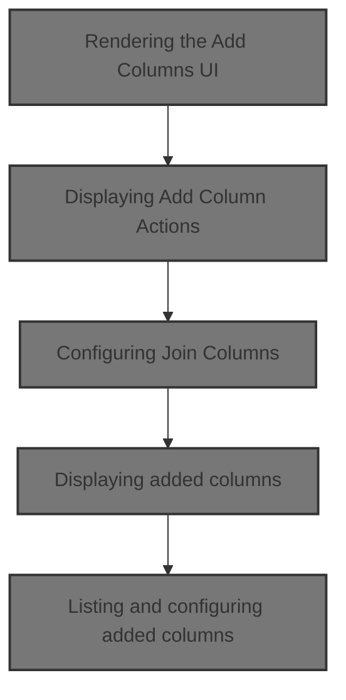

This document describes how users interactively add, join, and configure columns in the visual query builder. Users can choose to add columns from another source or create computed columns, with the UI updating in real time to reflect their changes. The updated list of columns is displayed, allowing further configuration or editing.



# Rendering the Add Columns UI

<SwmSnippet path="/ui/src/plugins/dev.perfetto.ExplorePage/query_builder/nodes/add_columns_node.ts" line="603">

---

In <SwmToken path="ui/src/plugins/dev.perfetto.ExplorePage/query_builder/nodes/add_columns_node.ts" pos="603:1:1" line-data="  nodeSpecificModify(): m.Child {">`nodeSpecificModify`</SwmToken>, we kick off the UI by rendering the add columns buttons first. This sets up the main actions the user can take, and we need to call <SwmToken path="ui/src/plugins/dev.perfetto.ExplorePage/query_builder/nodes/add_columns_node.ts" pos="605:3:3" line-data="      this.renderAddColumnsButtons(),">`renderAddColumnsButtons`</SwmToken> next so the user can start adding or configuring columns right away.

```typescript
  nodeSpecificModify(): m.Child {
    return m('div', [
      this.renderAddColumnsButtons(),
```

---

</SwmSnippet>

## Displaying Add Column Actions

<SwmSnippet path="/ui/src/plugins/dev.perfetto.ExplorePage/query_builder/nodes/add_columns_node.ts" line="826">

---

In <SwmToken path="ui/src/plugins/dev.perfetto.ExplorePage/query_builder/nodes/add_columns_node.ts" pos="826:3:3" line-data="  private renderAddColumnsButtons(): m.Child {">`renderAddColumnsButtons`</SwmToken>, we lay out the action buttons for adding columns. When the user clicks the 'From another source' button, we call <SwmToken path="ui/src/plugins/dev.perfetto.ExplorePage/query_builder/nodes/add_columns_node.ts" pos="840:3:3" line-data="            this.showJoinModal();">`showJoinModal`</SwmToken> to let them set up a join interactively.

```typescript
  private renderAddColumnsButtons(): m.Child {
    const hasConnectedNode = this.rightNode !== undefined;

    return m(
      '.pf-add-columns-actions-section',
      m(
        '.pf-add-columns-actions-buttons',
        m(Button, {
          label: hasConnectedNode
            ? 'From another source ✓'
            : 'From another source',
          icon: 'table_chart',
          variant: ButtonVariant.Outlined,
          onclick: () => {
            this.showJoinModal();
          },
        }),
        m(Button, {
          label: 'Expression',
          icon: 'functions',
          variant: ButtonVariant.Outlined,
          onclick: () => {
```

---

</SwmSnippet>

### Configuring Join Columns

```mermaid
%%{init: {"flowchart": {"defaultRenderer": "elk"}} }%%
flowchart TD
  node1["Show modal: Add columns from another source"]
  click node1 openCode "ui/src/plugins/dev.perfetto.ExplorePage/query_builder/nodes/add_columns_node.ts:610:657"
  node1 --> node2{"User clicks 'Cancel' or 'Apply'"}
  click node2 openCode "ui/src/plugins/dev.perfetto.ExplorePage/query_builder/nodes/add_columns_node.ts:619:655"
  node2 -->|"Cancel"| node3["Close modal"]
  click node3 openCode "ui/src/plugins/dev.perfetto.ExplorePage/query_builder/nodes/add_columns_node.ts:623:624"
  node2 -->|"Apply"| node4{"Is there a connected node to join with?"}
  click node4 openCode "ui/src/plugins/dev.perfetto.ExplorePage/query_builder/nodes/add_columns_node.ts:631:631"
  node4 -->|"Yes"| node5["Apply selected columns and join condition (leftColumn, rightColumn, selectedColumns, columnAliases)"]
  click node5 openCode "ui/src/plugins/dev.perfetto.ExplorePage/query_builder/nodes/add_columns_node.ts:647:647"
  node4 -->|"No"| node6["Check join suggestions"]
  click node6 openCode "ui/src/plugins/dev.perfetto.ExplorePage/query_builder/nodes/add_columns_node.ts:632:650"
  subgraph loop1["For each join suggestion"]
    node6 --> node7{"Are columns selected for this suggestion?"}
    click node7 openCode "ui/src/plugins/dev.perfetto.ExplorePage/query_builder/nodes/add_columns_node.ts:636:636"
    node7 -->|"Yes"| node8["Apply join suggestion and selected columns (set leftColumn, rightColumn, selectedColumns)"]
    click node8 openCode "ui/src/plugins/dev.perfetto.ExplorePage/query_builder/nodes/add_columns_node.ts:639:647"
    node8 --> node9["Update modal state and redraw"]
    click node9 openCode "ui/src/plugins/dev.perfetto.ExplorePage/query_builder/nodes/add_columns_node.ts:652:653"
    node7 -->|"No"| node6
  end
classDef HeadingStyle fill:#777777,stroke:#333,stroke-width:2px;

%% Swimm:
%% %%{init: {"flowchart": {"defaultRenderer": "elk"}} }%%
%% flowchart TD
%%   node1["Show modal: Add columns from another source"]
%%   click node1 openCode "<SwmPath>[ui/…/nodes/add_columns_node.ts](ui/src/plugins/dev.perfetto.ExplorePage/query_builder/nodes/add_columns_node.ts)</SwmPath>:610:657"
%%   node1 --> node2{"User clicks 'Cancel' or 'Apply'"}
%%   click node2 openCode "<SwmPath>[ui/…/nodes/add_columns_node.ts](ui/src/plugins/dev.perfetto.ExplorePage/query_builder/nodes/add_columns_node.ts)</SwmPath>:619:655"
%%   node2 -->|"Cancel"| node3["Close modal"]
%%   click node3 openCode "<SwmPath>[ui/…/nodes/add_columns_node.ts](ui/src/plugins/dev.perfetto.ExplorePage/query_builder/nodes/add_columns_node.ts)</SwmPath>:623:624"
%%   node2 -->|"Apply"| node4{"Is there a connected node to join with?"}
%%   click node4 openCode "<SwmPath>[ui/…/nodes/add_columns_node.ts](ui/src/plugins/dev.perfetto.ExplorePage/query_builder/nodes/add_columns_node.ts)</SwmPath>:631:631"
%%   node4 -->|"Yes"| node5["Apply selected columns and join condition (<SwmToken path="ui/src/plugins/dev.perfetto.ExplorePage/query_builder/nodes/add_columns_node.ts" pos="644:5:5" line-data="                    this.state.leftColumn = s.colName;">`leftColumn`</SwmToken>, <SwmToken path="ui/src/plugins/dev.perfetto.ExplorePage/query_builder/nodes/add_columns_node.ts" pos="645:5:5" line-data="                    this.state.rightColumn = s.targetColumn;">`rightColumn`</SwmToken>, <SwmToken path="ui/src/plugins/dev.perfetto.ExplorePage/query_builder/nodes/add_columns_node.ts" pos="634:3:3" line-data="                const selectedColumns =">`selectedColumns`</SwmToken>, <SwmToken path="ui/src/plugins/dev.perfetto.ExplorePage/query_builder/nodes/add_columns_node.ts" pos="1202:5:5" line-data="                this.state.columnAliases?.delete(key);">`columnAliases`</SwmToken>)"]
%%   click node5 openCode "<SwmPath>[ui/…/nodes/add_columns_node.ts](ui/src/plugins/dev.perfetto.ExplorePage/query_builder/nodes/add_columns_node.ts)</SwmPath>:647:647"
%%   node4 -->|"No"| node6["Check join suggestions"]
%%   click node6 openCode "<SwmPath>[ui/…/nodes/add_columns_node.ts](ui/src/plugins/dev.perfetto.ExplorePage/query_builder/nodes/add_columns_node.ts)</SwmPath>:632:650"
%%   subgraph loop1["For each join suggestion"]
%%     node6 --> node7{"Are columns selected for this suggestion?"}
%%     click node7 openCode "<SwmPath>[ui/…/nodes/add_columns_node.ts](ui/src/plugins/dev.perfetto.ExplorePage/query_builder/nodes/add_columns_node.ts)</SwmPath>:636:636"
%%     node7 -->|"Yes"| node8["Apply join suggestion and selected columns (set <SwmToken path="ui/src/plugins/dev.perfetto.ExplorePage/query_builder/nodes/add_columns_node.ts" pos="644:5:5" line-data="                    this.state.leftColumn = s.colName;">`leftColumn`</SwmToken>, <SwmToken path="ui/src/plugins/dev.perfetto.ExplorePage/query_builder/nodes/add_columns_node.ts" pos="645:5:5" line-data="                    this.state.rightColumn = s.targetColumn;">`rightColumn`</SwmToken>, <SwmToken path="ui/src/plugins/dev.perfetto.ExplorePage/query_builder/nodes/add_columns_node.ts" pos="634:3:3" line-data="                const selectedColumns =">`selectedColumns`</SwmToken>)"]
%%     click node8 openCode "<SwmPath>[ui/…/nodes/add_columns_node.ts](ui/src/plugins/dev.perfetto.ExplorePage/query_builder/nodes/add_columns_node.ts)</SwmPath>:639:647"
%%     node8 --> node9["Update modal state and redraw"]
%%     click node9 openCode "<SwmPath>[ui/…/nodes/add_columns_node.ts](ui/src/plugins/dev.perfetto.ExplorePage/query_builder/nodes/add_columns_node.ts)</SwmPath>:652:653"
%%     node7 -->|"No"| node6
%%   end
%% classDef HeadingStyle fill:#777777,stroke:#333,stroke-width:2px;
```



<SwmSnippet path="/ui/src/plugins/dev.perfetto.ExplorePage/query_builder/nodes/add_columns_node.ts" line="610">

---

In <SwmToken path="ui/src/plugins/dev.perfetto.ExplorePage/query_builder/nodes/add_columns_node.ts" pos="610:3:3" line-data="  private showJoinModal() {">`showJoinModal`</SwmToken>, we open a modal dialog for configuring joins. The modal content is built by calling <SwmToken path="ui/src/plugins/dev.perfetto.ExplorePage/query_builder/nodes/add_columns_node.ts" pos="617:12:12" line-data="        return m(&#39;div&#39;, this.renderGuidedMode());">`renderGuidedMode`</SwmToken>, which gives the user a guided UI for picking join columns and setting up join conditions based on current state and suggestions.

```typescript
  private showJoinModal() {
    const modalKey = 'add-join-modal';

    showModal({
      title: 'Add Columns from Another Source',
      key: modalKey,
      content: () => {
        return m('div', this.renderGuidedMode());
      },
      buttons: [
        {
          text: 'Cancel',
          action: () => {
```

---

</SwmSnippet>

<SwmSnippet path="/ui/src/plugins/dev.perfetto.ExplorePage/query_builder/nodes/add_columns_node.ts" line="965">

---

<SwmToken path="ui/src/plugins/dev.perfetto.ExplorePage/query_builder/nodes/add_columns_node.ts" pos="965:3:3" line-data="  private renderGuidedMode(): m.Child {">`renderGuidedMode`</SwmToken> builds the join configuration UI. If there's no right node, it shows join suggestions with expandable cards for each table, letting users pick columns to join. If a right node is connected, it switches to column selection and join condition setup between the two tables, including optional alias inputs. State is updated on every interaction, and Mithril redraws the UI as needed.

```typescript
  private renderGuidedMode(): m.Child {
    if (!this.rightNode) {
      const suggestions = this.getJoinSuggestions();

      return m(
        'div',
        m(
          Card,
          m('h3', 'Join Suggestions'),
          suggestions.length > 0
            ? m(
                'div',
                {style: {display: 'flex', flexDirection: 'column', gap: '8px'}},
                [
                  m(
                    'p',
                    {style: {marginBottom: '8px', color: '#888'}},
                    'Based on your JOINID columns, you could join with:',
                  ),
                  suggestions.map((s) => {
                    const availableColumns = this.getTableColumns(
                      s.suggestedTable,
                    );
                    const selectedColumns =
                      this.state.suggestionSelections?.get(s.suggestedTable) ??
                      [];
                    const isExpanded =
                      this.state.expandedSuggestions?.has(s.suggestedTable) ??
                      false;

                    return m(
                      'div',
                      {
                        style: {
                          padding: '8px',
                          backgroundColor: 'rgba(255, 255, 255, 0.05)',
                          borderRadius: '4px',
                          display: 'flex',
                          flexDirection: 'column',
                          gap: '8px',
                        },
                      },
                      [
                        // Header row with table name and expand/collapse
                        m(
                          'div',
                          {
                            style: {
                              display: 'flex',
                              justifyContent: 'space-between',
                              alignItems: 'center',
                              gap: '8px',
                              cursor: 'pointer',
                              userSelect: 'none',
                            },
                            onclick: (e: MouseEvent) => {
                              // Don't toggle if clicking on the button
                              if (
                                (e.target as HTMLElement).closest('button') ||
                                (e.target as HTMLElement).tagName === 'BUTTON'
                              ) {
                                return;
                              }

                              if (!this.state.expandedSuggestions) {
                                this.state.expandedSuggestions = new Set();
                              }
                              if (isExpanded) {
                                this.state.expandedSuggestions.delete(
                                  s.suggestedTable,
                                );
                              } else {
                                this.state.expandedSuggestions.add(
                                  s.suggestedTable,
                                );
                              }
                              m.redraw();
                            },
                          },
                          [
                            m(
                              'span',
                              {
                                style: {
                                  fontFamily: 'monospace',
                                  fontSize: '12px',
                                  display: 'flex',
                                  alignItems: 'center',
                                  gap: '4px',
                                },
                              },
                              [
                                m(
                                  'span',
                                  {
                                    style: {
                                      fontSize: '16px',
                                      lineHeight: '1',
                                    },
                                  },
                                  isExpanded ? '▼' : '▶',
                                ),
                                m('strong', s.suggestedTable),
                                ' table (using ',
                                m('code', s.colName),
                                ' = ',
                                m('code', s.targetColumn),
                                ')',
                                selectedColumns.length > 0 &&
                                  m(
                                    'span',
                                    {
                                      style: {
                                        marginLeft: '8px',
                                        color: '#888',
                                        fontSize: '11px',
                                      },
                                    },
                                    `${selectedColumns.length} selected`,
                                  ),
                              ],
                            ),
                          ],
                        ),
                        // Column selection (only when expanded)
                        isExpanded &&
                          m(
                            'div',
                            {
                              style: {
                                marginTop: '4px',
                                paddingTop: '8px',
                                borderTop: '1px solid rgba(255, 255, 255, 0.1)',
                              },
                            },
                            [
                              m(
                                'div',
                                {
                                  style: {
                                    marginBottom: '8px',
                                    fontSize: '11px',
                                    color: '#888',
                                  },
                                },
                                `Select columns from ${s.suggestedTable} (${availableColumns.length} available):`,
                              ),
                              m(MultiselectInput, {
                                options: availableColumns.map((col) => ({
                                  key: col,
                                  label: col,
                                })),
                                selectedOptions: selectedColumns,
                                onOptionAdd: (key: string) => {
                                  if (!this.state.suggestionSelections) {
                                    this.state.suggestionSelections = new Map();
                                  }
                                  const current =
                                    this.state.suggestionSelections.get(
                                      s.suggestedTable,
                                    ) ?? [];
                                  this.state.suggestionSelections.set(
                                    s.suggestedTable,
                                    [...current, key],
                                  );
                                  m.redraw();
                                },
                                onOptionRemove: (key: string) => {
                                  if (this.state.suggestionSelections) {
                                    const current =
                                      this.state.suggestionSelections.get(
                                        s.suggestedTable,
                                      ) ?? [];
                                    this.state.suggestionSelections.set(
                                      s.suggestedTable,
                                      current.filter((c) => c !== key),
                                    );
                                    m.redraw();
                                  }
                                },
                              }),
                            ],
                          ),
                      ],
                    );
                  }),
                  m(
                    'p',
                    {
                      style: {
                        marginTop: '8px',
                        color: '#888',
                        fontSize: '12px',
                      },
                    },
                    'Connect a table node to the left port to add columns.',
                  ),
                ],
              )
            : m(
                'p',
                {style: {color: '#888'}},
                'No JOINID columns found in your data. You can still connect any node to the left port.',
              ),
        ),
      );
    }

    const leftCols = this.sourceCols;
    const rightCols = this.rightCols;

    return m('div', [
      m(
        CardStack,
        m(
          Card,
          m('h3', 'Select Columns to Add'),
          m(MultiselectInput, {
            options: rightCols.map((c) => ({
              key: c.column.name,
              label: c.column.name,
            })),
            selectedOptions: this.state.selectedColumns ?? [],
            onOptionAdd: (key: string) => {
              if (!this.state.selectedColumns) {
                this.state.selectedColumns = [];
              }
              this.state.selectedColumns.push(key);
              this.state.onchange?.();
              m.redraw();
            },
            onOptionRemove: (key: string) => {
              if (this.state.selectedColumns) {
                this.state.selectedColumns = this.state.selectedColumns.filter(
                  (c) => c !== key,
                );
                // Also remove the alias for this column
                this.state.columnAliases?.delete(key);
                this.state.onchange?.();
                m.redraw();
              }
            },
          }),
          // Show alias inputs for selected columns
          this.state.selectedColumns && this.state.selectedColumns.length > 0
            ? m(
                'div',
                {
                  style: {
                    paddingTop: '5px',
                    borderTop: '1px solid rgba(255, 255, 255, 0.1)',
                  },
                },
                [
                  m(
                    'h4',
                    {style: {marginBottom: '8px'}},
                    'Column Aliases (optional)',
                  ),
                  m(
                    'div',
                    {
                      style: {
                        fontSize: '11px',
                        color: '#888',
                        marginBottom: '8px',
                      },
                    },
                    'Rename columns by providing an alias:',
                  ),
                  this.state.selectedColumns.map((colName) =>
                    m(
                      '.pf-form-row',
                      {
                        style: {
                          display: 'flex',
                          alignItems: 'center',
                          gap: '8px',
                          marginBottom: '8px',
                        },
                      },
                      [
                        m(
                          'code',
                          {style: {minWidth: '120px', fontSize: '12px'}},
                          colName,
                        ),
                        m('span', '→'),
                        m(TextInput, {
                          placeholder: 'alias (optional)',
                          value: this.state.columnAliases?.get(colName) ?? '',
                          oninput: (e: InputEvent) => {
                            const target = e.target as HTMLInputElement;
                            const alias = target.value.trim();
                            if (!this.state.columnAliases) {
                              this.state.columnAliases = new Map();
                            }
                            if (alias) {
                              this.state.columnAliases.set(colName, alias);
                            } else {
                              this.state.columnAliases.delete(colName);
                            }
                            this.state.onchange?.();
                          },
                        }),
                      ],
                    ),
                  ),
                ],
              )
            : null,
        ),
        m(
          Card,
          m('h3', 'Join Condition'),
          m(
            '.pf-form-row',
            m('label', 'Base Column:'),
            m(
              Select,
              {
                onchange: (e: Event) => {
                  const target = e.target as HTMLSelectElement;
                  this.state.leftColumn = target.value;
                  this.state.onchange?.();
                },
              },
              m(
                'option',
                {disabled: true, selected: !this.state.leftColumn},
                'Select column',
              ),
              leftCols.map((col) =>
                m(
                  'option',
                  {
                    value: col.column.name,
                    selected: col.column.name === this.state.leftColumn,
                  },
                  col.column.name,
                ),
              ),
            ),
          ),
          m(
            '.pf-form-row',
            m('label', 'Connected Node Column:'),
            m(
              Select,
              {
                onchange: (e: Event) => {
                  const target = e.target as HTMLSelectElement;
                  this.state.rightColumn = target.value;
                  this.state.onchange?.();
                },
              },
              m(
                'option',
                {disabled: true, selected: !this.state.rightColumn},
                'Select column',
              ),
              rightCols.map((col) =>
                m(
                  'option',
                  {
                    value: col.column.name,
                    selected: col.column.name === this.state.rightColumn,
                  },
                  col.column.name,
                ),
              ),
            ),
          ),
        ),
      ),
    ]);
  }
```

---

</SwmSnippet>

<SwmSnippet path="/ui/src/plugins/dev.perfetto.ExplorePage/query_builder/nodes/add_columns_node.ts" line="623">

---

After returning from <SwmToken path="ui/src/plugins/dev.perfetto.ExplorePage/query_builder/nodes/add_columns_node.ts" pos="617:12:12" line-data="        return m(&#39;div&#39;, this.renderGuidedMode());">`renderGuidedMode`</SwmToken> in <SwmToken path="ui/src/plugins/dev.perfetto.ExplorePage/query_builder/nodes/add_columns_node.ts" pos="610:3:3" line-data="  private showJoinModal() {">`showJoinModal`</SwmToken>, the Apply button checks if there's no right node and if the user picked columns from join suggestions. If so, it connects the first matching suggestion, updates state, and triggers the add-and-connect action.

```typescript
            // Just close
          },
        },
        {
          text: 'Apply',
          primary: true,
          action: () => {
            // If there's no rightNode, connect the first suggestion with selections
            if (!this.rightNode && this.state.suggestionSelections) {
              const suggestions = this.getJoinSuggestions();
              for (const s of suggestions) {
                const selectedColumns =
                  this.state.suggestionSelections.get(s.suggestedTable) ?? [];
                if (selectedColumns.length > 0) {
                  // Found a suggestion with selections - connect it
                  if (this.state.actions?.onAddAndConnectTable) {
                    this.state.isGuidedConnection = true;
                    this.state.actions.onAddAndConnectTable(
                      s.suggestedTable,
                      0,
                    );
                    this.state.leftColumn = s.colName;
                    this.state.rightColumn = s.targetColumn;
                    this.state.selectedColumns = [...selectedColumns];
                  }
                  break;
                }
              }
```

---

</SwmSnippet>

<SwmSnippet path="/ui/src/plugins/dev.perfetto.ExplorePage/query_builder/nodes/add_columns_node.ts" line="652">

---

At the end of <SwmToken path="ui/src/plugins/dev.perfetto.ExplorePage/query_builder/nodes/add_columns_node.ts" pos="610:3:3" line-data="  private showJoinModal() {">`showJoinModal`</SwmToken>, the modal is closed and any state changes from the user's actions are finalized. The UI updates based on the new state, but nothing is directly returned.

```typescript
            this.state.onchange?.();
          },
        },
      ],
    });
  }
```

---

</SwmSnippet>

### Handling other add column actions

```mermaid
%%{init: {"flowchart": {"defaultRenderer": "elk"}} }%%
flowchart TD
    node1["Display buttons: Expression, Switch, If"]
    click node1 openCode "ui/src/plugins/dev.perfetto.ExplorePage/query_builder/nodes/add_columns_node.ts:848:869"
    node1 --> node2{"Which button does the user click?"}
    click node2 openCode "ui/src/plugins/dev.perfetto.ExplorePage/query_builder/nodes/add_columns_node.ts:848:869"
    node2 -->|"Expression"| node3["Show Expression Modal"]
    click node3 openCode "ui/src/plugins/dev.perfetto.ExplorePage/query_builder/nodes/add_columns_node.ts:848:849"
    node2 -->|"Switch"| node4["Show Switch Modal"]
    click node4 openCode "ui/src/plugins/dev.perfetto.ExplorePage/query_builder/nodes/add_columns_node.ts:851:857"
    node2 -->|"If"| node5["Show If Modal"]
    click node5 openCode "ui/src/plugins/dev.perfetto.ExplorePage/query_builder/nodes/add_columns_node.ts:860:865"

classDef HeadingStyle fill:#777777,stroke:#333,stroke-width:2px;

%% Swimm:
%% %%{init: {"flowchart": {"defaultRenderer": "elk"}} }%%
%% flowchart TD
%%     node1["Display buttons: Expression, Switch, If"]
%%     click node1 openCode "<SwmPath>[ui/…/nodes/add_columns_node.ts](ui/src/plugins/dev.perfetto.ExplorePage/query_builder/nodes/add_columns_node.ts)</SwmPath>:848:869"
%%     node1 --> node2{"Which button does the user click?"}
%%     click node2 openCode "<SwmPath>[ui/…/nodes/add_columns_node.ts](ui/src/plugins/dev.perfetto.ExplorePage/query_builder/nodes/add_columns_node.ts)</SwmPath>:848:869"
%%     node2 -->|"Expression"| node3["Show Expression Modal"]
%%     click node3 openCode "<SwmPath>[ui/…/nodes/add_columns_node.ts](ui/src/plugins/dev.perfetto.ExplorePage/query_builder/nodes/add_columns_node.ts)</SwmPath>:848:849"
%%     node2 -->|"Switch"| node4["Show Switch Modal"]
%%     click node4 openCode "<SwmPath>[ui/…/nodes/add_columns_node.ts](ui/src/plugins/dev.perfetto.ExplorePage/query_builder/nodes/add_columns_node.ts)</SwmPath>:851:857"
%%     node2 -->|"If"| node5["Show If Modal"]
%%     click node5 openCode "<SwmPath>[ui/…/nodes/add_columns_node.ts](ui/src/plugins/dev.perfetto.ExplorePage/query_builder/nodes/add_columns_node.ts)</SwmPath>:860:865"
%% 
%% classDef HeadingStyle fill:#777777,stroke:#333,stroke-width:2px;
```



<SwmSnippet path="/ui/src/plugins/dev.perfetto.ExplorePage/query_builder/nodes/add_columns_node.ts" line="848">

---

After coming back from <SwmToken path="ui/src/plugins/dev.perfetto.ExplorePage/query_builder/nodes/add_columns_node.ts" pos="610:3:3" line-data="  private showJoinModal() {">`showJoinModal`</SwmToken> in <SwmToken path="ui/src/plugins/dev.perfetto.ExplorePage/query_builder/nodes/add_columns_node.ts" pos="605:3:3" line-data="      this.renderAddColumnsButtons(),">`renderAddColumnsButtons`</SwmToken>, we render the rest of the action buttons (Expression, Switch, If) so the user can keep adding or editing columns right away.

```typescript
            this.showExpressionModal();
          },
        }),
        m(Button, {
          label: 'Switch',
          icon: 'alt_route',
          variant: ButtonVariant.Outlined,
          onclick: () => {
            this.showSwitchModal();
          },
        }),
        m(Button, {
          label: 'If',
          icon: 'help_outline',
          variant: ButtonVariant.Outlined,
          onclick: () => {
            this.showIfModal();
          },
        }),
      ),
    );
  }
```

---

</SwmSnippet>

## Displaying added columns

<SwmSnippet path="/ui/src/plugins/dev.perfetto.ExplorePage/query_builder/nodes/add_columns_node.ts" line="606">

---

After returning from <SwmToken path="ui/src/plugins/dev.perfetto.ExplorePage/query_builder/nodes/add_columns_node.ts" pos="605:3:3" line-data="      this.renderAddColumnsButtons(),">`renderAddColumnsButtons`</SwmToken> in <SwmToken path="ui/src/plugins/dev.perfetto.ExplorePage/query_builder/nodes/add_columns_node.ts" pos="603:1:1" line-data="  nodeSpecificModify(): m.Child {">`nodeSpecificModify`</SwmToken>, we render the list of added columns. This lets the user see what columns have been added or configured right after taking any action.

```typescript
      this.renderAddedColumnsList(),
    ]);
  }
```

---

</SwmSnippet>

# Listing and configuring added columns

```mermaid
%%{init: {"flowchart": {"defaultRenderer": "elk"}} }%%
flowchart TD
    node1{"Are there any connected nodes or computed columns?"}
    click node1 openCode "ui/src/plugins/dev.perfetto.ExplorePage/query_builder/nodes/add_columns_node.ts:872:875"
    node1 -->|"No"| node2["Show prompt: 'No columns added yet'"]
    click node2 openCode "ui/src/plugins/dev.perfetto.ExplorePage/query_builder/nodes/add_columns_node.ts:876:880"
    node1 -->|"Yes"| node3{"Is there a connected node?"}
    click node3 openCode "ui/src/plugins/dev.perfetto.ExplorePage/query_builder/nodes/add_columns_node.ts:885:909"
    node3 -->|"Yes"| node4["Show joined source columns (with number of selected columns)"]
    click node4 openCode "ui/src/plugins/dev.perfetto.ExplorePage/query_builder/nodes/add_columns_node.ts:887:908"
    node3 -->|"No"| node5["Skip joined source columns"]
    click node5 openCode "ui/src/plugins/dev.perfetto.ExplorePage/query_builder/nodes/add_columns_node.ts:911:960"
    node4 --> node6["Show computed columns"]
    node5 --> node6
    click node6 openCode "ui/src/plugins/dev.perfetto.ExplorePage/query_builder/nodes/add_columns_node.ts:911:960"
    subgraph loop1["For each computed column"]
      node6 --> node7{"What type is the computed column?"}
      click node7 openCode "ui/src/plugins/dev.perfetto.ExplorePage/query_builder/nodes/add_columns_node.ts:913:924"
      node7 -->|"Switch"| node8["Show 'Switch' column details and edit option"]
      click node8 openCode "ui/src/plugins/dev.perfetto.ExplorePage/query_builder/nodes/add_columns_node.ts:914:951"
      node7 -->|"If"| node9["Show 'If' column details and edit option"]
      click node9 openCode "ui/src/plugins/dev.perfetto.ExplorePage/query_builder/nodes/add_columns_node.ts:916:952"
      node7 -->|"Expression"| node10["Show 'Expression' column details and edit option"]
      click node10 openCode "ui/src/plugins/dev.perfetto.ExplorePage/query_builder/nodes/add_columns_node.ts:918:954"
      node8 --> node11["Continue to next computed column"]
      node9 --> node11
      node10 --> node11
    end
    node11 --> node12["Return list of added columns"]
    click node12 openCode "ui/src/plugins/dev.perfetto.ExplorePage/query_builder/nodes/add_columns_node.ts:871:960"
classDef HeadingStyle fill:#777777,stroke:#333,stroke-width:2px;

%% Swimm:
%% %%{init: {"flowchart": {"defaultRenderer": "elk"}} }%%
%% flowchart TD
%%     node1{"Are there any connected nodes or computed columns?"}
%%     click node1 openCode "<SwmPath>[ui/…/nodes/add_columns_node.ts](ui/src/plugins/dev.perfetto.ExplorePage/query_builder/nodes/add_columns_node.ts)</SwmPath>:872:875"
%%     node1 -->|"No"| node2["Show prompt: 'No columns added yet'"]
%%     click node2 openCode "<SwmPath>[ui/…/nodes/add_columns_node.ts](ui/src/plugins/dev.perfetto.ExplorePage/query_builder/nodes/add_columns_node.ts)</SwmPath>:876:880"
%%     node1 -->|"Yes"| node3{"Is there a connected node?"}
%%     click node3 openCode "<SwmPath>[ui/…/nodes/add_columns_node.ts](ui/src/plugins/dev.perfetto.ExplorePage/query_builder/nodes/add_columns_node.ts)</SwmPath>:885:909"
%%     node3 -->|"Yes"| node4["Show joined source columns (with number of selected columns)"]
%%     click node4 openCode "<SwmPath>[ui/…/nodes/add_columns_node.ts](ui/src/plugins/dev.perfetto.ExplorePage/query_builder/nodes/add_columns_node.ts)</SwmPath>:887:908"
%%     node3 -->|"No"| node5["Skip joined source columns"]
%%     click node5 openCode "<SwmPath>[ui/…/nodes/add_columns_node.ts](ui/src/plugins/dev.perfetto.ExplorePage/query_builder/nodes/add_columns_node.ts)</SwmPath>:911:960"
%%     node4 --> node6["Show computed columns"]
%%     node5 --> node6
%%     click node6 openCode "<SwmPath>[ui/…/nodes/add_columns_node.ts](ui/src/plugins/dev.perfetto.ExplorePage/query_builder/nodes/add_columns_node.ts)</SwmPath>:911:960"
%%     subgraph loop1["For each computed column"]
%%       node6 --> node7{"What type is the computed column?"}
%%       click node7 openCode "<SwmPath>[ui/…/nodes/add_columns_node.ts](ui/src/plugins/dev.perfetto.ExplorePage/query_builder/nodes/add_columns_node.ts)</SwmPath>:913:924"
%%       node7 -->|"Switch"| node8["Show 'Switch' column details and edit option"]
%%       click node8 openCode "<SwmPath>[ui/…/nodes/add_columns_node.ts](ui/src/plugins/dev.perfetto.ExplorePage/query_builder/nodes/add_columns_node.ts)</SwmPath>:914:951"
%%       node7 -->|"If"| node9["Show 'If' column details and edit option"]
%%       click node9 openCode "<SwmPath>[ui/…/nodes/add_columns_node.ts](ui/src/plugins/dev.perfetto.ExplorePage/query_builder/nodes/add_columns_node.ts)</SwmPath>:916:952"
%%       node7 -->|"Expression"| node10["Show 'Expression' column details and edit option"]
%%       click node10 openCode "<SwmPath>[ui/…/nodes/add_columns_node.ts](ui/src/plugins/dev.perfetto.ExplorePage/query_builder/nodes/add_columns_node.ts)</SwmPath>:918:954"
%%       node8 --> node11["Continue to next computed column"]
%%       node9 --> node11
%%       node10 --> node11
%%     end
%%     node11 --> node12["Return list of added columns"]
%%     click node12 openCode "<SwmPath>[ui/…/nodes/add_columns_node.ts](ui/src/plugins/dev.perfetto.ExplorePage/query_builder/nodes/add_columns_node.ts)</SwmPath>:871:960"
%% classDef HeadingStyle fill:#777777,stroke:#333,stroke-width:2px;
```



<SwmSnippet path="/ui/src/plugins/dev.perfetto.ExplorePage/query_builder/nodes/add_columns_node.ts" line="871">

---

In <SwmToken path="ui/src/plugins/dev.perfetto.ExplorePage/query_builder/nodes/add_columns_node.ts" pos="871:3:3" line-data="  private renderAddedColumnsList(): m.Child {">`renderAddedColumnsList`</SwmToken>, we show both joined columns (if a node is connected) and computed columns. The Configure button on joined columns lets users re-open the join modal to tweak join settings.

```typescript
  private renderAddedColumnsList(): m.Child {
    const hasConnectedNode = this.rightNode !== undefined;
    const hasComputedColumns = (this.state.computedColumns?.length ?? 0) > 0;

    if (!hasConnectedNode && !hasComputedColumns) {
      return m(
        '.pf-added-columns-empty',
        'No columns added yet. Use the buttons above to add columns.',
      );
    }

    const items: m.Child[] = [];

    // Show joined columns
    if (hasConnectedNode) {
      items.push(
        m(
          '.pf-added-column-item.pf-joined-source',
          m(Icon, {icon: 'table_chart'}),
          m(
            '.pf-added-column-info',
            m('.pf-added-column-name', 'Joined Source'),
            m(
              '.pf-added-column-description',
              `${this.state.selectedColumns?.length ?? 0} selected columns`,
            ),
          ),
          m(Button, {
            label: 'Configure',
            icon: 'settings',
            variant: ButtonVariant.Outlined,
            compact: true,
            onclick: () => {
              this.showJoinModal();
            },
          }),
        ),
      );
    }

```

---

</SwmSnippet>

<SwmSnippet path="/ui/src/plugins/dev.perfetto.ExplorePage/query_builder/nodes/add_columns_node.ts" line="911">

---

After returning from <SwmToken path="ui/src/plugins/dev.perfetto.ExplorePage/query_builder/nodes/add_columns_node.ts" pos="610:3:3" line-data="  private showJoinModal() {">`showJoinModal`</SwmToken>, <SwmToken path="ui/src/plugins/dev.perfetto.ExplorePage/query_builder/nodes/add_columns_node.ts" pos="606:3:3" line-data="      this.renderAddedColumnsList(),">`renderAddedColumnsList`</SwmToken> continues by listing all computed columns. Each one gets an Edit button that opens the right modal for editing, based on its type.

```typescript
    // Show computed columns
    for (const [index, col] of (this.state.computedColumns ?? []).entries()) {
      const icon =
        col.type === 'switch'
          ? 'alt_route'
          : col.type === 'if'
            ? 'help_outline'
            : 'functions';
      const typeName =
        col.type === 'switch'
          ? 'Switch'
          : col.type === 'if'
            ? 'If'
            : 'Expression';

      // Show the expression/preview for the column
      const description =
        col.type === 'switch' || col.type === 'if'
          ? typeName
          : col.expression
            ? `${typeName}: ${col.expression}`
            : `${typeName} (empty)`;

      items.push(
        m(
          '.pf-added-column-item',
          m(Icon, {icon}),
          m(
            '.pf-added-column-info',
            m('.pf-added-column-name', col.name || '(unnamed)'),
            m('.pf-added-column-description', description),
          ),
          m(Button, {
            label: 'Edit',
            icon: 'edit',
            variant: ButtonVariant.Outlined,
            compact: true,
            onclick: () => {
              if (col.type === 'switch') {
                this.showSwitchModal(index);
              } else if (col.type === 'if') {
                this.showIfModal(index);
              } else {
                this.showExpressionModal(index);
              }
            },
          }),
        ),
      );
    }
```

---

</SwmSnippet>

&nbsp;

*This is an auto-generated document by Swimm 🌊 and has not yet been verified by a human*

<SwmMeta version="3.0.0" repo-id="Z2l0aHViJTNBJTNBY3BsdXNwbHVzLXBlcmZldHRvJTNBJTNBcmljYXJkb2xvcGV6Zw==" repo-name="cplusplus-perfetto"><sup>Powered by [Swimm](https://app.swimm.io/)</sup></SwmMeta>
