This document describes how users add new nodes to the visual graph, supporting interactive editing. When a request is made, the system determines a suitable position for the new node and updates the graph structure. If a target node is specified, the new node is connected, enabling users to build or extend node chains. The flow receives a request to add a node and outputs an updated graph.

# Where is this flow used?

This flow is used multiple times in the codebase as represented in the following diagram:

(Note - these are only some of the entry points of this flow)

```mermaid
graph TD;
      7fffc94f48fbf1ad52d39580f98ee9cab0659060df1c509d537a25a08e6d1137(ui/…/demos/nodegraph_demo.ts::NodeGraphDemo) --> b1ca0a7ed494bed1478b903031cd9d83bd365944c8f9a8bc205029aa2f4c2603(ui/…/demos/nodegraph_demo.ts::addNode):::mainFlowStyle

7fffc94f48fbf1ad52d39580f98ee9cab0659060df1c509d537a25a08e6d1137(ui/…/demos/nodegraph_demo.ts::NodeGraphDemo) --> 988961f3b612a8bb37445f969fd8161a91c7e8fbdb2619b3d4534bc94397b658(ui/…/demos/nodegraph_demo.ts::renderAddNodeMenu)

7fffc94f48fbf1ad52d39580f98ee9cab0659060df1c509d537a25a08e6d1137(ui/…/demos/nodegraph_demo.ts::NodeGraphDemo) --> a6fda4a172c4477a55cd26df8f068a46d18c06ff7ce770b39a61f1b606861617(ui/…/demos/nodegraph_demo.ts::renderNodes)

7fffc94f48fbf1ad52d39580f98ee9cab0659060df1c509d537a25a08e6d1137(ui/…/demos/nodegraph_demo.ts::NodeGraphDemo) --> 23126ae558e3a5da587f3c33aa1325a5654b91b8ed322b87f7e44ed0f76c5550(ui/…/demos/nodegraph_demo.ts::renderNodeChain)

7fffc94f48fbf1ad52d39580f98ee9cab0659060df1c509d537a25a08e6d1137(ui/…/demos/nodegraph_demo.ts::NodeGraphDemo) --> 8a3f330407d0e321e07b3405748b78a7a966d33076261b3f3ff102dee2804e16(ui/…/demos/nodegraph_demo.ts::renderChildNode)

988961f3b612a8bb37445f969fd8161a91c7e8fbdb2619b3d4534bc94397b658(ui/…/demos/nodegraph_demo.ts::renderAddNodeMenu) --> b1ca0a7ed494bed1478b903031cd9d83bd365944c8f9a8bc205029aa2f4c2603(ui/…/demos/nodegraph_demo.ts::addNode):::mainFlowStyle

a6fda4a172c4477a55cd26df8f068a46d18c06ff7ce770b39a61f1b606861617(ui/…/demos/nodegraph_demo.ts::renderNodes) --> 23126ae558e3a5da587f3c33aa1325a5654b91b8ed322b87f7e44ed0f76c5550(ui/…/demos/nodegraph_demo.ts::renderNodeChain)

23126ae558e3a5da587f3c33aa1325a5654b91b8ed322b87f7e44ed0f76c5550(ui/…/demos/nodegraph_demo.ts::renderNodeChain) --> 988961f3b612a8bb37445f969fd8161a91c7e8fbdb2619b3d4534bc94397b658(ui/…/demos/nodegraph_demo.ts::renderAddNodeMenu)

23126ae558e3a5da587f3c33aa1325a5654b91b8ed322b87f7e44ed0f76c5550(ui/…/demos/nodegraph_demo.ts::renderNodeChain) --> 8a3f330407d0e321e07b3405748b78a7a966d33076261b3f3ff102dee2804e16(ui/…/demos/nodegraph_demo.ts::renderChildNode)

8a3f330407d0e321e07b3405748b78a7a966d33076261b3f3ff102dee2804e16(ui/…/demos/nodegraph_demo.ts::renderChildNode) --> 988961f3b612a8bb37445f969fd8161a91c7e8fbdb2619b3d4534bc94397b658(ui/…/demos/nodegraph_demo.ts::renderAddNodeMenu)

8a3f330407d0e321e07b3405748b78a7a966d33076261b3f3ff102dee2804e16(ui/…/demos/nodegraph_demo.ts::renderChildNode) --> 8a3f330407d0e321e07b3405748b78a7a966d33076261b3f3ff102dee2804e16(ui/…/demos/nodegraph_demo.ts::renderChildNode)

3c0eedb4abf35114eeffd1580a4aed5df559b814c409a2243ba54971d89b79ff(ui/…/demos/nodegraph_demo.ts::view) --> b1ca0a7ed494bed1478b903031cd9d83bd365944c8f9a8bc205029aa2f4c2603(ui/…/demos/nodegraph_demo.ts::addNode):::mainFlowStyle

3c0eedb4abf35114eeffd1580a4aed5df559b814c409a2243ba54971d89b79ff(ui/…/demos/nodegraph_demo.ts::view) --> 988961f3b612a8bb37445f969fd8161a91c7e8fbdb2619b3d4534bc94397b658(ui/…/demos/nodegraph_demo.ts::renderAddNodeMenu)

3c0eedb4abf35114eeffd1580a4aed5df559b814c409a2243ba54971d89b79ff(ui/…/demos/nodegraph_demo.ts::view) --> a6fda4a172c4477a55cd26df8f068a46d18c06ff7ce770b39a61f1b606861617(ui/…/demos/nodegraph_demo.ts::renderNodes)

3c0eedb4abf35114eeffd1580a4aed5df559b814c409a2243ba54971d89b79ff(ui/…/demos/nodegraph_demo.ts::view) --> 23126ae558e3a5da587f3c33aa1325a5654b91b8ed322b87f7e44ed0f76c5550(ui/…/demos/nodegraph_demo.ts::renderNodeChain)

3c0eedb4abf35114eeffd1580a4aed5df559b814c409a2243ba54971d89b79ff(ui/…/demos/nodegraph_demo.ts::view) --> 8a3f330407d0e321e07b3405748b78a7a966d33076261b3f3ff102dee2804e16(ui/…/demos/nodegraph_demo.ts::renderChildNode)

216dfc349c44f52e899ebff3e74728826da296a507cc5ff0a41a7c8719194a0f(ui/…/demos/nodegraph_demo.ts::onclick) --> b1ca0a7ed494bed1478b903031cd9d83bd365944c8f9a8bc205029aa2f4c2603(ui/…/demos/nodegraph_demo.ts::addNode):::mainFlowStyle

216dfc349c44f52e899ebff3e74728826da296a507cc5ff0a41a7c8719194a0f(ui/…/demos/nodegraph_demo.ts::onclick) --> b1ca0a7ed494bed1478b903031cd9d83bd365944c8f9a8bc205029aa2f4c2603(ui/…/demos/nodegraph_demo.ts::addNode):::mainFlowStyle

216dfc349c44f52e899ebff3e74728826da296a507cc5ff0a41a7c8719194a0f(ui/…/demos/nodegraph_demo.ts::onclick) --> b1ca0a7ed494bed1478b903031cd9d83bd365944c8f9a8bc205029aa2f4c2603(ui/…/demos/nodegraph_demo.ts::addNode):::mainFlowStyle


classDef mainFlowStyle color:#000000,fill:#7CB9F4
classDef rootsStyle color:#000000,fill:#00FFF4
classDef Style1 color:#000000,fill:#00FFAA
classDef Style2 color:#000000,fill:#FFFF00
classDef Style3 color:#000000,fill:#AA7CB9

%% Swimm:
%% graph TD;
%%       7fffc94f48fbf1ad52d39580f98ee9cab0659060df1c509d537a25a08e6d1137(<SwmPath>[ui/…/demos/nodegraph_demo.ts](ui/src/plugins/dev.perfetto.WidgetsPage/demos/nodegraph_demo.ts)</SwmPath>::<SwmToken path="ui/src/plugins/dev.perfetto.WidgetsPage/demos/nodegraph_demo.ts" pos="427:4:4" line-data="export function NodeGraphDemo(): m.Component&lt;NodeGraphDemoAttrs&gt; {">`NodeGraphDemo`</SwmToken>) --> b1ca0a7ed494bed1478b903031cd9d83bd365944c8f9a8bc205029aa2f4c2603(<SwmPath>[ui/…/demos/nodegraph_demo.ts](ui/src/plugins/dev.perfetto.WidgetsPage/demos/nodegraph_demo.ts)</SwmPath>::<SwmToken path="ui/src/plugins/dev.perfetto.WidgetsPage/demos/nodegraph_demo.ts" pos="888:3:3" line-data="      const addNode = (">`addNode`</SwmToken>):::mainFlowStyle
%% 
%% 7fffc94f48fbf1ad52d39580f98ee9cab0659060df1c509d537a25a08e6d1137(<SwmPath>[ui/…/demos/nodegraph_demo.ts](ui/src/plugins/dev.perfetto.WidgetsPage/demos/nodegraph_demo.ts)</SwmPath>::<SwmToken path="ui/src/plugins/dev.perfetto.WidgetsPage/demos/nodegraph_demo.ts" pos="427:4:4" line-data="export function NodeGraphDemo(): m.Component&lt;NodeGraphDemoAttrs&gt; {">`NodeGraphDemo`</SwmToken>) --> 988961f3b612a8bb37445f969fd8161a91c7e8fbdb2619b3d4534bc94397b658(<SwmPath>[ui/…/demos/nodegraph_demo.ts](ui/src/plugins/dev.perfetto.WidgetsPage/demos/nodegraph_demo.ts)</SwmPath>::<SwmToken path="ui/src/plugins/dev.perfetto.WidgetsPage/demos/nodegraph_demo.ts" pos="905:11:11" line-data="              return {...out, contextMenuItems: renderAddNodeMenu(tempNode.id)};">`renderAddNodeMenu`</SwmToken>)
%% 
%% 7fffc94f48fbf1ad52d39580f98ee9cab0659060df1c509d537a25a08e6d1137(<SwmPath>[ui/…/demos/nodegraph_demo.ts](ui/src/plugins/dev.perfetto.WidgetsPage/demos/nodegraph_demo.ts)</SwmPath>::<SwmToken path="ui/src/plugins/dev.perfetto.WidgetsPage/demos/nodegraph_demo.ts" pos="427:4:4" line-data="export function NodeGraphDemo(): m.Component&lt;NodeGraphDemoAttrs&gt; {">`NodeGraphDemo`</SwmToken>) --> a6fda4a172c4477a55cd26df8f068a46d18c06ff7ce770b39a61f1b606861617(<SwmPath>[ui/…/demos/nodegraph_demo.ts](ui/src/plugins/dev.perfetto.WidgetsPage/demos/nodegraph_demo.ts)</SwmPath>::<SwmToken path="ui/src/plugins/dev.perfetto.WidgetsPage/demos/nodegraph_demo.ts" pos="1021:3:3" line-data="      function renderNodes(): Node[] {">`renderNodes`</SwmToken>)
%% 
%% 7fffc94f48fbf1ad52d39580f98ee9cab0659060df1c509d537a25a08e6d1137(<SwmPath>[ui/…/demos/nodegraph_demo.ts](ui/src/plugins/dev.perfetto.WidgetsPage/demos/nodegraph_demo.ts)</SwmPath>::<SwmToken path="ui/src/plugins/dev.perfetto.WidgetsPage/demos/nodegraph_demo.ts" pos="427:4:4" line-data="export function NodeGraphDemo(): m.Component&lt;NodeGraphDemoAttrs&gt; {">`NodeGraphDemo`</SwmToken>) --> 23126ae558e3a5da587f3c33aa1325a5654b91b8ed322b87f7e44ed0f76c5550(<SwmPath>[ui/…/demos/nodegraph_demo.ts](ui/src/plugins/dev.perfetto.WidgetsPage/demos/nodegraph_demo.ts)</SwmPath>::<SwmToken path="ui/src/plugins/dev.perfetto.WidgetsPage/demos/nodegraph_demo.ts" pos="955:3:3" line-data="      function renderNodeChain(nodeData: NodeData): Node {">`renderNodeChain`</SwmToken>)
%% 
%% 7fffc94f48fbf1ad52d39580f98ee9cab0659060df1c509d537a25a08e6d1137(<SwmPath>[ui/…/demos/nodegraph_demo.ts](ui/src/plugins/dev.perfetto.WidgetsPage/demos/nodegraph_demo.ts)</SwmPath>::<SwmToken path="ui/src/plugins/dev.perfetto.WidgetsPage/demos/nodegraph_demo.ts" pos="427:4:4" line-data="export function NodeGraphDemo(): m.Component&lt;NodeGraphDemoAttrs&gt; {">`NodeGraphDemo`</SwmToken>) --> 8a3f330407d0e321e07b3405748b78a7a966d33076261b3f3ff102dee2804e16(<SwmPath>[ui/…/demos/nodegraph_demo.ts](ui/src/plugins/dev.perfetto.WidgetsPage/demos/nodegraph_demo.ts)</SwmPath>::<SwmToken path="ui/src/plugins/dev.perfetto.WidgetsPage/demos/nodegraph_demo.ts" pos="976:8:8" line-data="          next: nextModel ? renderChildNode(nextModel) : undefined,">`renderChildNode`</SwmToken>)
%% 
%% 988961f3b612a8bb37445f969fd8161a91c7e8fbdb2619b3d4534bc94397b658(<SwmPath>[ui/…/demos/nodegraph_demo.ts](ui/src/plugins/dev.perfetto.WidgetsPage/demos/nodegraph_demo.ts)</SwmPath>::<SwmToken path="ui/src/plugins/dev.perfetto.WidgetsPage/demos/nodegraph_demo.ts" pos="905:11:11" line-data="              return {...out, contextMenuItems: renderAddNodeMenu(tempNode.id)};">`renderAddNodeMenu`</SwmToken>) --> b1ca0a7ed494bed1478b903031cd9d83bd365944c8f9a8bc205029aa2f4c2603(<SwmPath>[ui/…/demos/nodegraph_demo.ts](ui/src/plugins/dev.perfetto.WidgetsPage/demos/nodegraph_demo.ts)</SwmPath>::<SwmToken path="ui/src/plugins/dev.perfetto.WidgetsPage/demos/nodegraph_demo.ts" pos="888:3:3" line-data="      const addNode = (">`addNode`</SwmToken>):::mainFlowStyle
%% 
%% a6fda4a172c4477a55cd26df8f068a46d18c06ff7ce770b39a61f1b606861617(<SwmPath>[ui/…/demos/nodegraph_demo.ts](ui/src/plugins/dev.perfetto.WidgetsPage/demos/nodegraph_demo.ts)</SwmPath>::<SwmToken path="ui/src/plugins/dev.perfetto.WidgetsPage/demos/nodegraph_demo.ts" pos="1021:3:3" line-data="      function renderNodes(): Node[] {">`renderNodes`</SwmToken>) --> 23126ae558e3a5da587f3c33aa1325a5654b91b8ed322b87f7e44ed0f76c5550(<SwmPath>[ui/…/demos/nodegraph_demo.ts](ui/src/plugins/dev.perfetto.WidgetsPage/demos/nodegraph_demo.ts)</SwmPath>::<SwmToken path="ui/src/plugins/dev.perfetto.WidgetsPage/demos/nodegraph_demo.ts" pos="955:3:3" line-data="      function renderNodeChain(nodeData: NodeData): Node {">`renderNodeChain`</SwmToken>)
%% 
%% 23126ae558e3a5da587f3c33aa1325a5654b91b8ed322b87f7e44ed0f76c5550(<SwmPath>[ui/…/demos/nodegraph_demo.ts](ui/src/plugins/dev.perfetto.WidgetsPage/demos/nodegraph_demo.ts)</SwmPath>::<SwmToken path="ui/src/plugins/dev.perfetto.WidgetsPage/demos/nodegraph_demo.ts" pos="955:3:3" line-data="      function renderNodeChain(nodeData: NodeData): Node {">`renderNodeChain`</SwmToken>) --> 988961f3b612a8bb37445f969fd8161a91c7e8fbdb2619b3d4534bc94397b658(<SwmPath>[ui/…/demos/nodegraph_demo.ts](ui/src/plugins/dev.perfetto.WidgetsPage/demos/nodegraph_demo.ts)</SwmPath>::<SwmToken path="ui/src/plugins/dev.perfetto.WidgetsPage/demos/nodegraph_demo.ts" pos="905:11:11" line-data="              return {...out, contextMenuItems: renderAddNodeMenu(tempNode.id)};">`renderAddNodeMenu`</SwmToken>)
%% 
%% 23126ae558e3a5da587f3c33aa1325a5654b91b8ed322b87f7e44ed0f76c5550(<SwmPath>[ui/…/demos/nodegraph_demo.ts](ui/src/plugins/dev.perfetto.WidgetsPage/demos/nodegraph_demo.ts)</SwmPath>::<SwmToken path="ui/src/plugins/dev.perfetto.WidgetsPage/demos/nodegraph_demo.ts" pos="955:3:3" line-data="      function renderNodeChain(nodeData: NodeData): Node {">`renderNodeChain`</SwmToken>) --> 8a3f330407d0e321e07b3405748b78a7a966d33076261b3f3ff102dee2804e16(<SwmPath>[ui/…/demos/nodegraph_demo.ts](ui/src/plugins/dev.perfetto.WidgetsPage/demos/nodegraph_demo.ts)</SwmPath>::<SwmToken path="ui/src/plugins/dev.perfetto.WidgetsPage/demos/nodegraph_demo.ts" pos="976:8:8" line-data="          next: nextModel ? renderChildNode(nextModel) : undefined,">`renderChildNode`</SwmToken>)
%% 
%% 8a3f330407d0e321e07b3405748b78a7a966d33076261b3f3ff102dee2804e16(<SwmPath>[ui/…/demos/nodegraph_demo.ts](ui/src/plugins/dev.perfetto.WidgetsPage/demos/nodegraph_demo.ts)</SwmPath>::<SwmToken path="ui/src/plugins/dev.perfetto.WidgetsPage/demos/nodegraph_demo.ts" pos="976:8:8" line-data="          next: nextModel ? renderChildNode(nextModel) : undefined,">`renderChildNode`</SwmToken>) --> 988961f3b612a8bb37445f969fd8161a91c7e8fbdb2619b3d4534bc94397b658(<SwmPath>[ui/…/demos/nodegraph_demo.ts](ui/src/plugins/dev.perfetto.WidgetsPage/demos/nodegraph_demo.ts)</SwmPath>::<SwmToken path="ui/src/plugins/dev.perfetto.WidgetsPage/demos/nodegraph_demo.ts" pos="905:11:11" line-data="              return {...out, contextMenuItems: renderAddNodeMenu(tempNode.id)};">`renderAddNodeMenu`</SwmToken>)
%% 
%% 8a3f330407d0e321e07b3405748b78a7a966d33076261b3f3ff102dee2804e16(<SwmPath>[ui/…/demos/nodegraph_demo.ts](ui/src/plugins/dev.perfetto.WidgetsPage/demos/nodegraph_demo.ts)</SwmPath>::<SwmToken path="ui/src/plugins/dev.perfetto.WidgetsPage/demos/nodegraph_demo.ts" pos="976:8:8" line-data="          next: nextModel ? renderChildNode(nextModel) : undefined,">`renderChildNode`</SwmToken>) --> 8a3f330407d0e321e07b3405748b78a7a966d33076261b3f3ff102dee2804e16(<SwmPath>[ui/…/demos/nodegraph_demo.ts](ui/src/plugins/dev.perfetto.WidgetsPage/demos/nodegraph_demo.ts)</SwmPath>::<SwmToken path="ui/src/plugins/dev.perfetto.WidgetsPage/demos/nodegraph_demo.ts" pos="976:8:8" line-data="          next: nextModel ? renderChildNode(nextModel) : undefined,">`renderChildNode`</SwmToken>)
%% 
%% 3c0eedb4abf35114eeffd1580a4aed5df559b814c409a2243ba54971d89b79ff(<SwmPath>[ui/…/demos/nodegraph_demo.ts](ui/src/plugins/dev.perfetto.WidgetsPage/demos/nodegraph_demo.ts)</SwmPath>::view) --> b1ca0a7ed494bed1478b903031cd9d83bd365944c8f9a8bc205029aa2f4c2603(<SwmPath>[ui/…/demos/nodegraph_demo.ts](ui/src/plugins/dev.perfetto.WidgetsPage/demos/nodegraph_demo.ts)</SwmPath>::<SwmToken path="ui/src/plugins/dev.perfetto.WidgetsPage/demos/nodegraph_demo.ts" pos="888:3:3" line-data="      const addNode = (">`addNode`</SwmToken>):::mainFlowStyle
%% 
%% 3c0eedb4abf35114eeffd1580a4aed5df559b814c409a2243ba54971d89b79ff(<SwmPath>[ui/…/demos/nodegraph_demo.ts](ui/src/plugins/dev.perfetto.WidgetsPage/demos/nodegraph_demo.ts)</SwmPath>::view) --> 988961f3b612a8bb37445f969fd8161a91c7e8fbdb2619b3d4534bc94397b658(<SwmPath>[ui/…/demos/nodegraph_demo.ts](ui/src/plugins/dev.perfetto.WidgetsPage/demos/nodegraph_demo.ts)</SwmPath>::<SwmToken path="ui/src/plugins/dev.perfetto.WidgetsPage/demos/nodegraph_demo.ts" pos="905:11:11" line-data="              return {...out, contextMenuItems: renderAddNodeMenu(tempNode.id)};">`renderAddNodeMenu`</SwmToken>)
%% 
%% 3c0eedb4abf35114eeffd1580a4aed5df559b814c409a2243ba54971d89b79ff(<SwmPath>[ui/…/demos/nodegraph_demo.ts](ui/src/plugins/dev.perfetto.WidgetsPage/demos/nodegraph_demo.ts)</SwmPath>::view) --> a6fda4a172c4477a55cd26df8f068a46d18c06ff7ce770b39a61f1b606861617(<SwmPath>[ui/…/demos/nodegraph_demo.ts](ui/src/plugins/dev.perfetto.WidgetsPage/demos/nodegraph_demo.ts)</SwmPath>::<SwmToken path="ui/src/plugins/dev.perfetto.WidgetsPage/demos/nodegraph_demo.ts" pos="1021:3:3" line-data="      function renderNodes(): Node[] {">`renderNodes`</SwmToken>)
%% 
%% 3c0eedb4abf35114eeffd1580a4aed5df559b814c409a2243ba54971d89b79ff(<SwmPath>[ui/…/demos/nodegraph_demo.ts](ui/src/plugins/dev.perfetto.WidgetsPage/demos/nodegraph_demo.ts)</SwmPath>::view) --> 23126ae558e3a5da587f3c33aa1325a5654b91b8ed322b87f7e44ed0f76c5550(<SwmPath>[ui/…/demos/nodegraph_demo.ts](ui/src/plugins/dev.perfetto.WidgetsPage/demos/nodegraph_demo.ts)</SwmPath>::<SwmToken path="ui/src/plugins/dev.perfetto.WidgetsPage/demos/nodegraph_demo.ts" pos="955:3:3" line-data="      function renderNodeChain(nodeData: NodeData): Node {">`renderNodeChain`</SwmToken>)
%% 
%% 3c0eedb4abf35114eeffd1580a4aed5df559b814c409a2243ba54971d89b79ff(<SwmPath>[ui/…/demos/nodegraph_demo.ts](ui/src/plugins/dev.perfetto.WidgetsPage/demos/nodegraph_demo.ts)</SwmPath>::view) --> 8a3f330407d0e321e07b3405748b78a7a966d33076261b3f3ff102dee2804e16(<SwmPath>[ui/…/demos/nodegraph_demo.ts](ui/src/plugins/dev.perfetto.WidgetsPage/demos/nodegraph_demo.ts)</SwmPath>::<SwmToken path="ui/src/plugins/dev.perfetto.WidgetsPage/demos/nodegraph_demo.ts" pos="976:8:8" line-data="          next: nextModel ? renderChildNode(nextModel) : undefined,">`renderChildNode`</SwmToken>)
%% 
%% 216dfc349c44f52e899ebff3e74728826da296a507cc5ff0a41a7c8719194a0f(<SwmPath>[ui/…/demos/nodegraph_demo.ts](ui/src/plugins/dev.perfetto.WidgetsPage/demos/nodegraph_demo.ts)</SwmPath>::onclick) --> b1ca0a7ed494bed1478b903031cd9d83bd365944c8f9a8bc205029aa2f4c2603(<SwmPath>[ui/…/demos/nodegraph_demo.ts](ui/src/plugins/dev.perfetto.WidgetsPage/demos/nodegraph_demo.ts)</SwmPath>::<SwmToken path="ui/src/plugins/dev.perfetto.WidgetsPage/demos/nodegraph_demo.ts" pos="888:3:3" line-data="      const addNode = (">`addNode`</SwmToken>):::mainFlowStyle
%% 
%% 216dfc349c44f52e899ebff3e74728826da296a507cc5ff0a41a7c8719194a0f(<SwmPath>[ui/…/demos/nodegraph_demo.ts](ui/src/plugins/dev.perfetto.WidgetsPage/demos/nodegraph_demo.ts)</SwmPath>::onclick) --> b1ca0a7ed494bed1478b903031cd9d83bd365944c8f9a8bc205029aa2f4c2603(<SwmPath>[ui/…/demos/nodegraph_demo.ts](ui/src/plugins/dev.perfetto.WidgetsPage/demos/nodegraph_demo.ts)</SwmPath>::<SwmToken path="ui/src/plugins/dev.perfetto.WidgetsPage/demos/nodegraph_demo.ts" pos="888:3:3" line-data="      const addNode = (">`addNode`</SwmToken>):::mainFlowStyle
%% 
%% 216dfc349c44f52e899ebff3e74728826da296a507cc5ff0a41a7c8719194a0f(<SwmPath>[ui/…/demos/nodegraph_demo.ts](ui/src/plugins/dev.perfetto.WidgetsPage/demos/nodegraph_demo.ts)</SwmPath>::onclick) --> b1ca0a7ed494bed1478b903031cd9d83bd365944c8f9a8bc205029aa2f4c2603(<SwmPath>[ui/…/demos/nodegraph_demo.ts](ui/src/plugins/dev.perfetto.WidgetsPage/demos/nodegraph_demo.ts)</SwmPath>::<SwmToken path="ui/src/plugins/dev.perfetto.WidgetsPage/demos/nodegraph_demo.ts" pos="888:3:3" line-data="      const addNode = (">`addNode`</SwmToken>):::mainFlowStyle
%% 
%% 
%% classDef mainFlowStyle color:#000000,fill:#7CB9F4
%% classDef rootsStyle color:#000000,fill:#00FFF4
%% classDef Style1 color:#000000,fill:#00FFAA
%% classDef Style2 color:#000000,fill:#FFFF00
%% classDef Style3 color:#000000,fill:#AA7CB9
```

# Adding and Placing a New Node

```mermaid
%%{init: {"flowchart": {"defaultRenderer": "elk"}} }%%
flowchart TD
  node1["Start: Add new node"] --> node2{"Is graph API available and no target node specified?"}
  click node1 openCode "ui/src/plugins/dev.perfetto.WidgetsPage/demos/nodegraph_demo.ts:888:892"
  node2 -->|"Yes"| node3["Find optimal placement for node"]
  click node2 openCode "ui/src/plugins/dev.perfetto.WidgetsPage/demos/nodegraph_demo.ts:898:918"
  node2 -->|"No"| node4["Assign random position"]
  click node3 openCode "ui/src/plugins/dev.perfetto.WidgetsPage/demos/nodegraph_demo.ts:919:921"
  click node4 openCode "ui/src/plugins/dev.perfetto.WidgetsPage/demos/nodegraph_demo.ts:922:925"
  node3 --> node5["Create node at chosen position"]
  node4 --> node5
  click node5 openCode "ui/src/plugins/dev.perfetto.WidgetsPage/demos/nodegraph_demo.ts:927:928"
  node5 --> node6{"Is target node specified?"}
  click node6 openCode "ui/src/plugins/dev.perfetto.WidgetsPage/demos/nodegraph_demo.ts:932:950"
  node6 -->|"Yes"| node7["Connect new node to target node and update connections"]
  click node7 openCode "ui/src/plugins/dev.perfetto.WidgetsPage/demos/nodegraph_demo.ts:933:949"
  node6 -->|"No"| node8["Update graph structure"]
  click node8 openCode "ui/src/plugins/dev.perfetto.WidgetsPage/demos/nodegraph_demo.ts:929:931"
  node7 --> node9["Finish: Graph updated"]
  node8 --> node9
  click node9 openCode "ui/src/plugins/dev.perfetto.WidgetsPage/demos/nodegraph_demo.ts:951:952"
classDef HeadingStyle fill:#777777,stroke:#333,stroke-width:2px;

%% Swimm:
%% %%{init: {"flowchart": {"defaultRenderer": "elk"}} }%%
%% flowchart TD
%%   <SwmToken path="ui/src/widgets/nodegraph.ts" pos="30:8:8" line-data=" *   {id: &#39;node1&#39;, x: 50, y: 50, outputs: [{direction: &#39;right&#39;}]},">`node1`</SwmToken>["Start: Add new node"] --> <SwmToken path="ui/src/widgets/nodegraph.ts" pos="31:8:8" line-data=" *   {id: &#39;node2&#39;, x: 250, y: 50, inputs: [{direction: &#39;left&#39;}]},">`node2`</SwmToken>{"Is graph API available and no target node specified?"}
%%   click <SwmToken path="ui/src/widgets/nodegraph.ts" pos="30:8:8" line-data=" *   {id: &#39;node1&#39;, x: 50, y: 50, outputs: [{direction: &#39;right&#39;}]},">`node1`</SwmToken> openCode "<SwmPath>[ui/…/demos/nodegraph_demo.ts](ui/src/plugins/dev.perfetto.WidgetsPage/demos/nodegraph_demo.ts)</SwmPath>:888:892"
%%   <SwmToken path="ui/src/widgets/nodegraph.ts" pos="31:8:8" line-data=" *   {id: &#39;node2&#39;, x: 250, y: 50, inputs: [{direction: &#39;left&#39;}]},">`node2`</SwmToken> -->|"Yes"| node3["Find optimal placement for node"]
%%   click <SwmToken path="ui/src/widgets/nodegraph.ts" pos="31:8:8" line-data=" *   {id: &#39;node2&#39;, x: 250, y: 50, inputs: [{direction: &#39;left&#39;}]},">`node2`</SwmToken> openCode "<SwmPath>[ui/…/demos/nodegraph_demo.ts](ui/src/plugins/dev.perfetto.WidgetsPage/demos/nodegraph_demo.ts)</SwmPath>:898:918"
%%   <SwmToken path="ui/src/widgets/nodegraph.ts" pos="31:8:8" line-data=" *   {id: &#39;node2&#39;, x: 250, y: 50, inputs: [{direction: &#39;left&#39;}]},">`node2`</SwmToken> -->|"No"| node4["Assign random position"]
%%   click node3 openCode "<SwmPath>[ui/…/demos/nodegraph_demo.ts](ui/src/plugins/dev.perfetto.WidgetsPage/demos/nodegraph_demo.ts)</SwmPath>:919:921"
%%   click node4 openCode "<SwmPath>[ui/…/demos/nodegraph_demo.ts](ui/src/plugins/dev.perfetto.WidgetsPage/demos/nodegraph_demo.ts)</SwmPath>:922:925"
%%   node3 --> node5["Create node at chosen position"]
%%   node4 --> node5
%%   click node5 openCode "<SwmPath>[ui/…/demos/nodegraph_demo.ts](ui/src/plugins/dev.perfetto.WidgetsPage/demos/nodegraph_demo.ts)</SwmPath>:927:928"
%%   node5 --> node6{"Is target node specified?"}
%%   click node6 openCode "<SwmPath>[ui/…/demos/nodegraph_demo.ts](ui/src/plugins/dev.perfetto.WidgetsPage/demos/nodegraph_demo.ts)</SwmPath>:932:950"
%%   node6 -->|"Yes"| node7["Connect new node to target node and update connections"]
%%   click node7 openCode "<SwmPath>[ui/…/demos/nodegraph_demo.ts](ui/src/plugins/dev.perfetto.WidgetsPage/demos/nodegraph_demo.ts)</SwmPath>:933:949"
%%   node6 -->|"No"| node8["Update graph structure"]
%%   click node8 openCode "<SwmPath>[ui/…/demos/nodegraph_demo.ts](ui/src/plugins/dev.perfetto.WidgetsPage/demos/nodegraph_demo.ts)</SwmPath>:929:931"
%%   node7 --> node9["Finish: Graph updated"]
%%   node8 --> node9
%%   click node9 openCode "<SwmPath>[ui/…/demos/nodegraph_demo.ts](ui/src/plugins/dev.perfetto.WidgetsPage/demos/nodegraph_demo.ts)</SwmPath>:951:952"
%% classDef HeadingStyle fill:#777777,stroke:#333,stroke-width:2px;
```



<SwmSnippet path="/ui/src/plugins/dev.perfetto.WidgetsPage/demos/nodegraph_demo.ts" line="888">

---

In <SwmToken path="ui/src/plugins/dev.perfetto.WidgetsPage/demos/nodegraph_demo.ts" pos="888:3:3" line-data="      const addNode = (">`addNode`</SwmToken>, we kick off by generating a unique ID and prepping to create a new node. The next step is to render the node's content so we can measure its size, which is needed for finding a good spot on the canvas. This is why we call <SwmToken path="ui/src/plugins/dev.perfetto.WidgetsPage/demos/nodegraph_demo.ts" pos="907:4:4" line-data="            content: renderNodeContent(tempNode, () =&gt; {}),">`renderNodeContent`</SwmToken> before anything else.

```typescript
      const addNode = (
        factory: (id: string, x: number, y: number) => NodeData,
        toNodeId?: string,
      ) => {
        const id = uuidv4();

        let x: number;
        let y: number;

        // Use API to find optimal placement if available
        if (graphApi && !toNodeId) {
          const tempNode = factory(id, 0, 0);
          const config = NODE_CONFIGS[tempNode.type];
          const placement = graphApi.findPlacementForNode({
            id,
            inputs: config.inputs,
            outputs: config.outputs?.map((out) => {
              return {...out, contextMenuItems: renderAddNodeMenu(tempNode.id)};
            }),
            content: renderNodeContent(tempNode, () => {}),
```

---

</SwmSnippet>

<SwmSnippet path="/ui/src/plugins/dev.perfetto.WidgetsPage/demos/nodegraph_demo.ts" line="397">

---

<SwmToken path="ui/src/plugins/dev.perfetto.WidgetsPage/demos/nodegraph_demo.ts" pos="397:2:2" line-data="function renderNodeContent(">`renderNodeContent`</SwmToken> picks the right rendering function for the node based on its type. It assumes all possible types are covered—if not, it just returns nothing. This keeps rendering logic modular and type-specific.

```typescript
function renderNodeContent(
  node: NodeData,
  updateNode: (updates: Partial<Omit<NodeData, 'id'>>) => void,
): m.Children {
  switch (node.type) {
    case 'table':
      return renderTableNode(node, updateNode);
    case 'select':
      return renderSelectNode(node, updateNode);
    case 'filter':
      return renderFilterNode(node, updateNode);
    case 'sort':
      return renderSortNode(node, updateNode);
    case 'join':
      return renderJoinNode(node, updateNode);
    case 'union':
      return renderUnionNode(node, updateNode);
    case 'result':
      return renderResultNode();
  }
}
```

---

</SwmSnippet>

<SwmSnippet path="/ui/src/plugins/dev.perfetto.WidgetsPage/demos/nodegraph_demo.ts" line="901">

---

After getting the rendered node content, we call into the placement logic so it can measure the node and figure out where to put it on the canvas. This step is needed in <SwmToken path="ui/src/plugins/dev.perfetto.WidgetsPage/demos/nodegraph_demo.ts" pos="888:3:3" line-data="      const addNode = (">`addNode`</SwmToken> to avoid collisions with other nodes.

```typescript
          const placement = graphApi.findPlacementForNode({
            id,
            inputs: config.inputs,
            outputs: config.outputs?.map((out) => {
              return {...out, contextMenuItems: renderAddNodeMenu(tempNode.id)};
            }),
            content: renderNodeContent(tempNode, () => {}),
            canDockBottom: config.canDockBottom,
            canDockTop: config.canDockTop,
            accentBar: attrs.accentBars,
            titleBar: attrs.titleBars
              ? {title: tempNode.type.toUpperCase()}
              : undefined,
            hue: attrs.colors ? config.hue : undefined,
            contextMenuItems: attrs.contextMenus
              ? renderNodeContextMenu(tempNode)
              : undefined,
          });
```

---

</SwmSnippet>

<SwmSnippet path="/ui/src/widgets/nodegraph.ts" line="1680">

---

<SwmToken path="ui/src/widgets/nodegraph.ts" pos="1680:3:3" line-data="      const findPlacementForNode = (">`findPlacementForNode`</SwmToken> renders the new node off-screen to measure its size, figures out the center of the canvas (accounting for zoom and pan), sums up the height of any connected chain, and then finds a spot where the node and its chain won't overlap with others. It relies on some global state and repo-specific helpers for all this.

```typescript
      const findPlacementForNode = (
        newNode: Omit<Node, 'x' | 'y'>,
      ): Position => {
        if (latestVnode === null || canvasElement === null) {
          return {x: 0, y: 0};
        }

        const {nodes = []} = latestVnode.attrs;
        const canvas = canvasElement;

        // Default starting position (center of viewport in canvas space)
        const canvasRect = canvas.getBoundingClientRect();
        const centerX =
          (canvasRect.width / 2 - canvasState.panOffset.x) / canvasState.zoom;
        const centerY =
          (canvasRect.height / 2 - canvasState.panOffset.y) / canvasState.zoom;

        // Create a temporary node with coordinates to render and measure
        const tempNode: Node = {
          ...newNode,
          x: centerX,
          y: centerY,
        };

        // Create temporary DOM element to measure size
        const tempContainer = document.createElement('div');
        tempContainer.style.position = 'absolute';
        tempContainer.style.left = '-9999px';
        tempContainer.style.visibility = 'hidden';
        canvas.appendChild(tempContainer);

        // Render the node into the temporary container
        m.render(
          tempContainer,
          m(
            '.pf-node',
            {
              'data-node': tempNode.id,
              'style': {
                ...(tempNode.hue !== undefined
                  ? {'--pf-node-hue': `${tempNode.hue}`}
                  : {}),
              },
            },
            [
              tempNode.titleBar &&
                m('.pf-node-header', [
                  m('.pf-node-title', tempNode.titleBar.title),
                ]),
              m('.pf-node-body', [
                tempNode.content !== undefined &&
                  m('.pf-node-content', tempNode.content),
                tempNode.inputs
                  ?.filter((p) => p.direction === 'left')
                  .map((port) =>
                    m('.pf-port-row.pf-port-input', [
                      m('.pf-port'),
                      port.content,
                    ]),
                  ),
                tempNode.outputs
                  ?.filter((p) => p.direction === 'right')
                  .map((port) =>
                    m('.pf-port-row.pf-port-output', [
                      port.content,
                      m('.pf-port'),
                    ]),
                  ),
              ]),
            ],
          ),
        );

        // Get dimensions from the rendered element
        const dims = getNodeDimensions(tempNode.id);

        // Calculate chain height
        const chain = getChain(tempNode);
        let chainHeight = 0;
        chain.forEach((chainNode) => {
          const chainDims = getNodeDimensions(chainNode.id);
          chainHeight += chainDims.height;
        });

        // Clean up temporary element
        canvas.removeChild(tempContainer);

        // Find non-overlapping position starting from center
        const finalPos = findNearestNonOverlappingPosition(
          centerX - dims.width / 2,
          centerY - dims.height / 2,
          tempNode.id,
          nodes,
          dims.width,
          chainHeight,
        );

        return finalPos;
      };
```

---

</SwmSnippet>

<SwmSnippet path="/ui/src/plugins/dev.perfetto.WidgetsPage/demos/nodegraph_demo.ts" line="919">

---

After getting the placement from the canvas logic, we use those coordinates to create the new node and update the store. If there's a parent node, we update connections and chaining info to keep the graph structure intact. This wraps up the <SwmToken path="ui/src/plugins/dev.perfetto.WidgetsPage/demos/nodegraph_demo.ts" pos="888:3:3" line-data="      const addNode = (">`addNode`</SwmToken> flow.

```typescript
          x = placement.x;
          y = placement.y;
        } else {
          // Fallback to random position
          x = 100 + Math.random() * 200;
          y = 50 + Math.random() * 200;
        }

        const newNode = factory(id, x, y);

        updateStore((draft) => {
          draft.nodes.set(newNode.id, newNode);

          if (toNodeId) {
            const parentNode = draft.nodes.get(toNodeId);
            if (parentNode) {
              newNode.nextId = parentNode.nextId;
              parentNode.nextId = id;
            }

            // Find any connection connected to the bottom port of this node
            const bottomConnectionIdx = draft.connections.findIndex(
              (c) => c.fromNode === toNodeId && c.fromPort === 0,
            );
            if (bottomConnectionIdx > -1) {
              draft.connections[bottomConnectionIdx] = {
                ...draft.connections[bottomConnectionIdx],
                fromNode: id,
                fromPort: 0,
              };
            }
          }
        });
      };
```

---

</SwmSnippet>

&nbsp;

*This is an auto-generated document by Swimm 🌊 and has not yet been verified by a human*

<SwmMeta version="3.0.0" repo-id="Z2l0aHViJTNBJTNBY3BsdXNwbHVzLXBlcmZldHRvJTNBJTNBcmljYXJkb2xvcGV6Zw==" repo-name="cplusplus-perfetto"><sup>Powered by [Swimm](https://app.swimm.io/)</sup></SwmMeta>
