This document describes how users can add debug counter tracks to their workspace for trace analysis. By providing data and configuration, users can visualize debug counters as a single track or as multiple tracks split by a pivot column. The result is a set of tracks registered in the workspace, enabling flexible and granular inspection of trace data.

# Where is this flow used?

This flow is used multiple times in the codebase as represented in the following diagram:

(Note - these are only some of the entry points of this flow)

```mermaid
graph TD;
      8e48e11eaef1b14b4296298da20daa63c2afa625a92bb64ab0d456f4e00acbea(ui/…/bigtrace/index.ts::onTraceLoad) --> 8c3a35e38cd7768035f09d8d35153c4674bd5a88fab6c3dadde965fa9f38ddf4(ui/…/tracks/debug_tracks.ts::addDebugCounterTrack):::mainFlowStyle

9f40a1d189ee51d8e6c68867e2ee254015f993ab5d128176f3a468ec051b858b(ui/…/tracks/add_debug_track_menu.ts::AddDebugTrackMenu.view) --> 6809a35ba456c45e4c4b51e341385de0a74c4791d6c1df8c7ce6efeb00d7d6f1(ui/…/tracks/add_debug_track_menu.ts::AddDebugTrackMenu.createTracks)

6809a35ba456c45e4c4b51e341385de0a74c4791d6c1df8c7ce6efeb00d7d6f1(ui/…/tracks/add_debug_track_menu.ts::AddDebugTrackMenu.createTracks) --> 8c3a35e38cd7768035f09d8d35153c4674bd5a88fab6c3dadde965fa9f38ddf4(ui/…/tracks/debug_tracks.ts::addDebugCounterTrack):::mainFlowStyle

071eff58cf736cf14605ccb9e47072cc4505dfdd34fabc5820f7d689dc37f588(ui/…/bigtrace/index.ts::onTraceLoad) --> ad87295f107be9439864958ae3d5a685756bbcd1f37577c198dbb732d02f718c(ui/…/bigtrace/index.ts::registerMemoryCommand)

ad87295f107be9439864958ae3d5a685756bbcd1f37577c198dbb732d02f718c(ui/…/bigtrace/index.ts::registerMemoryCommand) --> 8c3a35e38cd7768035f09d8d35153c4674bd5a88fab6c3dadde965fa9f38ddf4(ui/…/tracks/debug_tracks.ts::addDebugCounterTrack):::mainFlowStyle

ad87295f107be9439864958ae3d5a685756bbcd1f37577c198dbb732d02f718c(ui/…/bigtrace/index.ts::registerMemoryCommand) --> 2f90633c4b35a841e190ea4d171915e2424ddc61d643b879a55d4e4146534989(ui/…/bigtrace/index.ts::prepareAnnotationData)

2f90633c4b35a841e190ea4d171915e2424ddc61d643b879a55d4e4146534989(ui/…/bigtrace/index.ts::prepareAnnotationData) --> e8014ad8539905cb6a8b4cdd925880e111827376b0337677e523584b91f5d268(ui/…/bigtrace/index.ts::createAggregatedTrackAndGetTable)

e8014ad8539905cb6a8b4cdd925880e111827376b0337677e523584b91f5d268(ui/…/bigtrace/index.ts::createAggregatedTrackAndGetTable) --> 8c3a35e38cd7768035f09d8d35153c4674bd5a88fab6c3dadde965fa9f38ddf4(ui/…/tracks/debug_tracks.ts::addDebugCounterTrack):::mainFlowStyle

0854f5c779b21f307490d62754aaf82583aea60d2b7ff953dd750cd881410a22(ui/…/bigtrace/index.ts::callback) --> 8c3a35e38cd7768035f09d8d35153c4674bd5a88fab6c3dadde965fa9f38ddf4(ui/…/tracks/debug_tracks.ts::addDebugCounterTrack):::mainFlowStyle

0854f5c779b21f307490d62754aaf82583aea60d2b7ff953dd750cd881410a22(ui/…/bigtrace/index.ts::callback) --> 2f90633c4b35a841e190ea4d171915e2424ddc61d643b879a55d4e4146534989(ui/…/bigtrace/index.ts::prepareAnnotationData)

abe3251910494b825f728a3f4f3db75082b68e3e8b2a593655b8243d8730b0b9(ui/…/bigtrace/index.ts::onTraceLoad) --> 8c3a35e38cd7768035f09d8d35153c4674bd5a88fab6c3dadde965fa9f38ddf4(ui/…/tracks/debug_tracks.ts::addDebugCounterTrack):::mainFlowStyle


classDef mainFlowStyle color:#000000,fill:#7CB9F4
classDef rootsStyle color:#000000,fill:#00FFF4
classDef Style1 color:#000000,fill:#00FFAA
classDef Style2 color:#000000,fill:#FFFF00
classDef Style3 color:#000000,fill:#AA7CB9

%% Swimm:
%% graph TD;
%%       8e48e11eaef1b14b4296298da20daa63c2afa625a92bb64ab0d456f4e00acbea(<SwmPath>[ui/…/bigtrace/index.ts](ui/src/bigtrace/index.ts)</SwmPath>::onTraceLoad) --> 8c3a35e38cd7768035f09d8d35153c4674bd5a88fab6c3dadde965fa9f38ddf4(<SwmPath>[ui/…/tracks/debug_tracks.ts](ui/src/components/tracks/debug_tracks.ts)</SwmPath>::<SwmToken path="ui/src/components/tracks/debug_tracks.ts" pos="332:6:6" line-data="export async function addDebugCounterTrack(args: DebugCounterTrackArgs) {">`addDebugCounterTrack`</SwmToken>):::mainFlowStyle
%% 
%% 9f40a1d189ee51d8e6c68867e2ee254015f993ab5d128176f3a468ec051b858b(<SwmPath>[ui/…/tracks/add_debug_track_menu.ts](ui/src/components/tracks/add_debug_track_menu.ts)</SwmPath>::AddDebugTrackMenu.view) --> 6809a35ba456c45e4c4b51e341385de0a74c4791d6c1df8c7ce6efeb00d7d6f1(<SwmPath>[ui/…/tracks/add_debug_track_menu.ts](ui/src/components/tracks/add_debug_track_menu.ts)</SwmPath>::AddDebugTrackMenu.createTracks)
%% 
%% 6809a35ba456c45e4c4b51e341385de0a74c4791d6c1df8c7ce6efeb00d7d6f1(<SwmPath>[ui/…/tracks/add_debug_track_menu.ts](ui/src/components/tracks/add_debug_track_menu.ts)</SwmPath>::AddDebugTrackMenu.createTracks) --> 8c3a35e38cd7768035f09d8d35153c4674bd5a88fab6c3dadde965fa9f38ddf4(<SwmPath>[ui/…/tracks/debug_tracks.ts](ui/src/components/tracks/debug_tracks.ts)</SwmPath>::<SwmToken path="ui/src/components/tracks/debug_tracks.ts" pos="332:6:6" line-data="export async function addDebugCounterTrack(args: DebugCounterTrackArgs) {">`addDebugCounterTrack`</SwmToken>):::mainFlowStyle
%% 
%% 071eff58cf736cf14605ccb9e47072cc4505dfdd34fabc5820f7d689dc37f588(<SwmPath>[ui/…/bigtrace/index.ts](ui/src/bigtrace/index.ts)</SwmPath>::onTraceLoad) --> ad87295f107be9439864958ae3d5a685756bbcd1f37577c198dbb732d02f718c(<SwmPath>[ui/…/bigtrace/index.ts](ui/src/bigtrace/index.ts)</SwmPath>::registerMemoryCommand)
%% 
%% ad87295f107be9439864958ae3d5a685756bbcd1f37577c198dbb732d02f718c(<SwmPath>[ui/…/bigtrace/index.ts](ui/src/bigtrace/index.ts)</SwmPath>::registerMemoryCommand) --> 8c3a35e38cd7768035f09d8d35153c4674bd5a88fab6c3dadde965fa9f38ddf4(<SwmPath>[ui/…/tracks/debug_tracks.ts](ui/src/components/tracks/debug_tracks.ts)</SwmPath>::<SwmToken path="ui/src/components/tracks/debug_tracks.ts" pos="332:6:6" line-data="export async function addDebugCounterTrack(args: DebugCounterTrackArgs) {">`addDebugCounterTrack`</SwmToken>):::mainFlowStyle
%% 
%% ad87295f107be9439864958ae3d5a685756bbcd1f37577c198dbb732d02f718c(<SwmPath>[ui/…/bigtrace/index.ts](ui/src/bigtrace/index.ts)</SwmPath>::registerMemoryCommand) --> 2f90633c4b35a841e190ea4d171915e2424ddc61d643b879a55d4e4146534989(<SwmPath>[ui/…/bigtrace/index.ts](ui/src/bigtrace/index.ts)</SwmPath>::prepareAnnotationData)
%% 
%% 2f90633c4b35a841e190ea4d171915e2424ddc61d643b879a55d4e4146534989(<SwmPath>[ui/…/bigtrace/index.ts](ui/src/bigtrace/index.ts)</SwmPath>::prepareAnnotationData) --> e8014ad8539905cb6a8b4cdd925880e111827376b0337677e523584b91f5d268(<SwmPath>[ui/…/bigtrace/index.ts](ui/src/bigtrace/index.ts)</SwmPath>::createAggregatedTrackAndGetTable)
%% 
%% e8014ad8539905cb6a8b4cdd925880e111827376b0337677e523584b91f5d268(<SwmPath>[ui/…/bigtrace/index.ts](ui/src/bigtrace/index.ts)</SwmPath>::createAggregatedTrackAndGetTable) --> 8c3a35e38cd7768035f09d8d35153c4674bd5a88fab6c3dadde965fa9f38ddf4(<SwmPath>[ui/…/tracks/debug_tracks.ts](ui/src/components/tracks/debug_tracks.ts)</SwmPath>::<SwmToken path="ui/src/components/tracks/debug_tracks.ts" pos="332:6:6" line-data="export async function addDebugCounterTrack(args: DebugCounterTrackArgs) {">`addDebugCounterTrack`</SwmToken>):::mainFlowStyle
%% 
%% 0854f5c779b21f307490d62754aaf82583aea60d2b7ff953dd750cd881410a22(<SwmPath>[ui/…/bigtrace/index.ts](ui/src/bigtrace/index.ts)</SwmPath>::callback) --> 8c3a35e38cd7768035f09d8d35153c4674bd5a88fab6c3dadde965fa9f38ddf4(<SwmPath>[ui/…/tracks/debug_tracks.ts](ui/src/components/tracks/debug_tracks.ts)</SwmPath>::<SwmToken path="ui/src/components/tracks/debug_tracks.ts" pos="332:6:6" line-data="export async function addDebugCounterTrack(args: DebugCounterTrackArgs) {">`addDebugCounterTrack`</SwmToken>):::mainFlowStyle
%% 
%% 0854f5c779b21f307490d62754aaf82583aea60d2b7ff953dd750cd881410a22(<SwmPath>[ui/…/bigtrace/index.ts](ui/src/bigtrace/index.ts)</SwmPath>::callback) --> 2f90633c4b35a841e190ea4d171915e2424ddc61d643b879a55d4e4146534989(<SwmPath>[ui/…/bigtrace/index.ts](ui/src/bigtrace/index.ts)</SwmPath>::prepareAnnotationData)
%% 
%% abe3251910494b825f728a3f4f3db75082b68e3e8b2a593655b8243d8730b0b9(<SwmPath>[ui/…/bigtrace/index.ts](ui/src/bigtrace/index.ts)</SwmPath>::onTraceLoad) --> 8c3a35e38cd7768035f09d8d35153c4674bd5a88fab6c3dadde965fa9f38ddf4(<SwmPath>[ui/…/tracks/debug_tracks.ts](ui/src/components/tracks/debug_tracks.ts)</SwmPath>::<SwmToken path="ui/src/components/tracks/debug_tracks.ts" pos="332:6:6" line-data="export async function addDebugCounterTrack(args: DebugCounterTrackArgs) {">`addDebugCounterTrack`</SwmToken>):::mainFlowStyle
%% 
%% 
%% classDef mainFlowStyle color:#000000,fill:#7CB9F4
%% classDef rootsStyle color:#000000,fill:#00FFF4
%% classDef Style1 color:#000000,fill:#00FFAA
%% classDef Style2 color:#000000,fill:#FFFF00
%% classDef Style3 color:#000000,fill:#AA7CB9
```



# Adding and Registering Debug Counter Tracks


<SwmSnippet path="/ui/src/components/tracks/debug_tracks.ts" line="332">

---

AddDebugCounterTrack kicks off by creating a dedicated table for the debug counter data, then checks if a pivot column is specified. If so, it hands off to <SwmToken path="ui/src/components/tracks/debug_tracks.ts" pos="348:3:3" line-data="    await addPivotedCounterTracks(">`addPivotedCounterTracks`</SwmToken> to split the data into separate tracks for each pivot value, making the debug info more granular. If not, it just adds a single track for all the data.

```typescript
export async function addDebugCounterTrack(args: DebugCounterTrackArgs) {
  const tableId = getUniqueTrackCounter();
  const tableName = `__debug_track_${tableId}`;
  const titleBase = args.title?.trim() || `Debug Slice Track ${tableId}`;
  const uriBase = `debug.track${tableId}`;

  // Create a table for this query before doing anything
  await createTableForCounterTrack(
    args.trace.engine,
    tableName,
    args.data,
    args.columns,
    args.pivotOn,
  );

  if (args.pivotOn) {
    await addPivotedCounterTracks(
      args.trace,
      tableName,
      titleBase,
      uriBase,
      args.pivotOn,
    );
  } else {
    addSingleCounterTrack(args.trace, tableName, titleBase, uriBase);
  }
}
```

---

</SwmSnippet>

<SwmSnippet path="/ui/src/components/tracks/debug_tracks.ts" line="389">

---

AddPivotedCounterTracks grabs all distinct values from the 'pivot' column (hardcoded, not dynamic), then loops through each value to register a separate track filtered by that value. Each track gets a unique URI and a descriptive name, and is added to the workspace's pinned tracks for visibility.

```typescript
async function addPivotedCounterTracks(
  trace: Trace,
  tableName: string,
  titleBase: string,
  uriBase: string,
  pivotColName: string,
) {
  const result = await trace.engine.query(`
    SELECT DISTINCT pivot
    FROM ${tableName}
    ORDER BY pivot
  `);

  let trackCount = 0;
  for (const iter = result.iter({}); iter.valid(); iter.next()) {
    const uri = `${uriBase}_${trackCount++}`;
    const pivotValue = iter.get('pivot');
    const name = `${titleBase}: ${pivotColName} = ${sqlValueToReadableString(pivotValue)}`;

    trace.tracks.registerTrack({
      uri,
      renderer: new SqlTableCounterTrack(
        trace,
        uri,
        `
          SELECT *
          FROM ${tableName}
          WHERE pivot = ${sqlValueToSqliteString(pivotValue)}
        `,
      ),
    });

    const trackNode = new TrackNode({uri, name, removable: true});
    trace.currentWorkspace.pinnedTracksNode.addChildLast(trackNode);
  }
```

---

</SwmSnippet>

&nbsp;

*This is an auto-generated document by Swimm 🌊 and has not yet been verified by a human*

<SwmMeta version="3.0.0" repo-id="Z2l0aHViJTNBJTNBY3BsdXNwbHVzLXBlcmZldHRvJTNBJTNBcmljYXJkb2xvcGV6Zw==" repo-name="cplusplus-perfetto"><sup>Powered by [Swimm](https://app.swimm.io/)</sup></SwmMeta>
