This document describes how users can add columns from another data source by configuring a join through a modal interface in the query builder. The process begins when the user initiates the action, displays a modal for join configuration, processes the user's selections, connects the tables, updates the state, and notifies the application of the change.


# Where is this flow used?

This flow is used multiple times in the codebase as represented in the following diagram:

```mermaid
graph TD;
      3878e9351535a4d78951cd05295e9907a8c6eefdb8d80ee0d7761cacd0f128f0(ui/…/nodes/add_columns_node.ts::AddColumnsNode.renderAddColumnsButtons) --> c4e0730baab09b4ed912518b7fd1b5048f8a5355fd577be96b76f9e6f5d53e4e(ui/…/nodes/add_columns_node.ts::AddColumnsNode.showJoinModal)

fcfc34ef3bd83f486a5d0ded2c019b262eed4280f3040be96b0d5487897b49bd(ui/…/nodes/add_columns_node.ts::AddColumnsNode.nodeSpecificModify) --> 3878e9351535a4d78951cd05295e9907a8c6eefdb8d80ee0d7761cacd0f128f0(ui/…/nodes/add_columns_node.ts::AddColumnsNode.renderAddColumnsButtons)

fcfc34ef3bd83f486a5d0ded2c019b262eed4280f3040be96b0d5487897b49bd(ui/…/nodes/add_columns_node.ts::AddColumnsNode.nodeSpecificModify) --> 1e5a8570e51b659c906c4c935481cf22cdb8f579ecb64c41df9c5ac63783270d(ui/…/nodes/add_columns_node.ts::AddColumnsNode.renderAddedColumnsList)

9acaa11d6e9d74abc85e8a09034a2a58c0814db8267fe32d916ae62a98fc08ed(ui/…/nodes/add_columns_node.ts::onclick) --> c4e0730baab09b4ed912518b7fd1b5048f8a5355fd577be96b76f9e6f5d53e4e(ui/…/nodes/add_columns_node.ts::AddColumnsNode.showJoinModal)

1e5a8570e51b659c906c4c935481cf22cdb8f579ecb64c41df9c5ac63783270d(ui/…/nodes/add_columns_node.ts::AddColumnsNode.renderAddedColumnsList) --> c4e0730baab09b4ed912518b7fd1b5048f8a5355fd577be96b76f9e6f5d53e4e(ui/…/nodes/add_columns_node.ts::AddColumnsNode.showJoinModal)

9acaa11d6e9d74abc85e8a09034a2a58c0814db8267fe32d916ae62a98fc08ed(ui/…/nodes/add_columns_node.ts::onclick) --> c4e0730baab09b4ed912518b7fd1b5048f8a5355fd577be96b76f9e6f5d53e4e(ui/…/nodes/add_columns_node.ts::AddColumnsNode.showJoinModal)


classDef mainFlowStyle color:#000000,fill:#7CB9F4
classDef rootsStyle color:#000000,fill:#00FFF4
classDef Style1 color:#000000,fill:#00FFAA
classDef Style2 color:#000000,fill:#FFFF00
classDef Style3 color:#000000,fill:#AA7CB9

%% Swimm:
%% graph TD;
%%       3878e9351535a4d78951cd05295e9907a8c6eefdb8d80ee0d7761cacd0f128f0(<SwmPath>[ui/…/nodes/add_columns_node.ts](ui/src/plugins/dev.perfetto.ExplorePage/query_builder/nodes/add_columns_node.ts)</SwmPath>::AddColumnsNode.renderAddColumnsButtons) --> c4e0730baab09b4ed912518b7fd1b5048f8a5355fd577be96b76f9e6f5d53e4e(<SwmPath>[ui/…/nodes/add_columns_node.ts](ui/src/plugins/dev.perfetto.ExplorePage/query_builder/nodes/add_columns_node.ts)</SwmPath>::AddColumnsNode.showJoinModal)
%% 
%% fcfc34ef3bd83f486a5d0ded2c019b262eed4280f3040be96b0d5487897b49bd(<SwmPath>[ui/…/nodes/add_columns_node.ts](ui/src/plugins/dev.perfetto.ExplorePage/query_builder/nodes/add_columns_node.ts)</SwmPath>::AddColumnsNode.nodeSpecificModify) --> 3878e9351535a4d78951cd05295e9907a8c6eefdb8d80ee0d7761cacd0f128f0(<SwmPath>[ui/…/nodes/add_columns_node.ts](ui/src/plugins/dev.perfetto.ExplorePage/query_builder/nodes/add_columns_node.ts)</SwmPath>::AddColumnsNode.renderAddColumnsButtons)
%% 
%% fcfc34ef3bd83f486a5d0ded2c019b262eed4280f3040be96b0d5487897b49bd(<SwmPath>[ui/…/nodes/add_columns_node.ts](ui/src/plugins/dev.perfetto.ExplorePage/query_builder/nodes/add_columns_node.ts)</SwmPath>::AddColumnsNode.nodeSpecificModify) --> 1e5a8570e51b659c906c4c935481cf22cdb8f579ecb64c41df9c5ac63783270d(<SwmPath>[ui/…/nodes/add_columns_node.ts](ui/src/plugins/dev.perfetto.ExplorePage/query_builder/nodes/add_columns_node.ts)</SwmPath>::AddColumnsNode.renderAddedColumnsList)
%% 
%% 9acaa11d6e9d74abc85e8a09034a2a58c0814db8267fe32d916ae62a98fc08ed(<SwmPath>[ui/…/nodes/add_columns_node.ts](ui/src/plugins/dev.perfetto.ExplorePage/query_builder/nodes/add_columns_node.ts)</SwmPath>::onclick) --> c4e0730baab09b4ed912518b7fd1b5048f8a5355fd577be96b76f9e6f5d53e4e(<SwmPath>[ui/…/nodes/add_columns_node.ts](ui/src/plugins/dev.perfetto.ExplorePage/query_builder/nodes/add_columns_node.ts)</SwmPath>::AddColumnsNode.showJoinModal)
%% 
%% 1e5a8570e51b659c906c4c935481cf22cdb8f579ecb64c41df9c5ac63783270d(<SwmPath>[ui/…/nodes/add_columns_node.ts](ui/src/plugins/dev.perfetto.ExplorePage/query_builder/nodes/add_columns_node.ts)</SwmPath>::AddColumnsNode.renderAddedColumnsList) --> c4e0730baab09b4ed912518b7fd1b5048f8a5355fd577be96b76f9e6f5d53e4e(<SwmPath>[ui/…/nodes/add_columns_node.ts](ui/src/plugins/dev.perfetto.ExplorePage/query_builder/nodes/add_columns_node.ts)</SwmPath>::AddColumnsNode.showJoinModal)
%% 
%% 9acaa11d6e9d74abc85e8a09034a2a58c0814db8267fe32d916ae62a98fc08ed(<SwmPath>[ui/…/nodes/add_columns_node.ts](ui/src/plugins/dev.perfetto.ExplorePage/query_builder/nodes/add_columns_node.ts)</SwmPath>::onclick) --> c4e0730baab09b4ed912518b7fd1b5048f8a5355fd577be96b76f9e6f5d53e4e(<SwmPath>[ui/…/nodes/add_columns_node.ts](ui/src/plugins/dev.perfetto.ExplorePage/query_builder/nodes/add_columns_node.ts)</SwmPath>::AddColumnsNode.showJoinModal)
%% 
%% 
%% classDef mainFlowStyle color:#000000,fill:#7CB9F4
%% classDef rootsStyle color:#000000,fill:#00FFF4
%% classDef Style1 color:#000000,fill:#00FFAA
%% classDef Style2 color:#000000,fill:#FFFF00
%% classDef Style3 color:#000000,fill:#AA7CB9
```



# Displaying and Handling the Join Modal

<SwmSnippet path="/ui/src/plugins/dev.perfetto.ExplorePage/query_builder/nodes/add_columns_node.ts" line="610">

---

In <SwmToken path="ui/src/plugins/dev.perfetto.ExplorePage/query_builder/nodes/add_columns_node.ts" pos="610:3:3" line-data="  private showJoinModal() {">`showJoinModal`</SwmToken>, we set up the modal UI and wire up the Apply button to look for the first join suggestion with user-selected columns. If found, we trigger the action to add and connect the suggested table, update join-related state, and mark the connection as guided. This sets up everything needed for the join, and then we need to call into the next layer (<SwmPath>[ui/…/dev.perfetto.ExplorePage/explore_page.ts](ui/src/plugins/dev.perfetto.ExplorePage/explore_page.ts)</SwmPath>) to actually perform the add-and-connect logic, since that's where the action is implemented.

```typescript
  private showJoinModal() {
    const modalKey = 'add-join-modal';

    showModal({
      title: 'Add Columns from Another Source',
      key: modalKey,
      content: () => {
        return m('div', this.renderGuidedMode());
      },
      buttons: [
        {
          text: 'Cancel',
          action: () => {
            // Just close
          },
        },
        {
          text: 'Apply',
          primary: true,
          action: () => {
            // If there's no rightNode, connect the first suggestion with selections
            if (!this.rightNode && this.state.suggestionSelections) {
              const suggestions = this.getJoinSuggestions();
              for (const s of suggestions) {
                const selectedColumns =
                  this.state.suggestionSelections.get(s.suggestedTable) ?? [];
                if (selectedColumns.length > 0) {
                  // Found a suggestion with selections - connect it
                  if (this.state.actions?.onAddAndConnectTable) {
                    this.state.isGuidedConnection = true;
                    this.state.actions.onAddAndConnectTable(
                      s.suggestedTable,
                      0,
                    );
                    this.state.leftColumn = s.colName;
                    this.state.rightColumn = s.targetColumn;
                    this.state.selectedColumns = [...selectedColumns];
                  }
                  break;
                }
              }
            }
```

---

</SwmSnippet>

## Delegating Table Connection Logic

<SwmSnippet path="/ui/src/plugins/dev.perfetto.ExplorePage/explore_page.ts" line="81">

---

<SwmToken path="ui/src/plugins/dev.perfetto.ExplorePage/explore_page.ts" pos="81:1:1" line-data="      onAddAndConnectTable: (tableName: string, portIndex: number) =&gt; {">`onAddAndConnectTable`</SwmToken> just wraps the call to <SwmToken path="ui/src/plugins/dev.perfetto.ExplorePage/explore_page.ts" pos="82:3:3" line-data="        this.handleAddAndConnectTable(attrs, tableName, node, portIndex);">`handleAddAndConnectTable`</SwmToken>, injecting attrs and node from its closure. This lets the UI callback stay simple while still passing all the context needed for the actual connection logic.

```typescript
      onAddAndConnectTable: (tableName: string, portIndex: number) => {
        this.handleAddAndConnectTable(attrs, tableName, node, portIndex);
      },
```

---

</SwmSnippet>

## Creating and Connecting the Table Node

<SwmSnippet path="/ui/src/plugins/dev.perfetto.ExplorePage/explore_page.ts" line="258">

---

In <SwmToken path="ui/src/plugins/dev.perfetto.ExplorePage/explore_page.ts" pos="258:5:5" line-data="  private async handleAddAndConnectTable(">`handleAddAndConnectTable`</SwmToken>, we look up the table descriptor and SQL table, create a new node for the table, and then call <SwmToken path="ui/src/plugins/dev.perfetto.ExplorePage/explore_page.ts" pos="289:1:1" line-data="    addConnection(newNode, targetNode, portIndex);">`addConnection`</SwmToken> to link it to the target node. This sets up the join in the internal graph, so the next step is to update the actual node connections in <SwmPath>[ui/…/dev.perfetto.ExplorePage/query_node.ts](ui/src/plugins/dev.perfetto.ExplorePage/query_node.ts)</SwmPath>.

```typescript
  private async handleAddAndConnectTable(
    attrs: ExplorePageAttrs,
    tableName: string,
    targetNode: QueryNode,
    portIndex: number,
  ) {
    const sqlModules = attrs.sqlModulesPlugin.getSqlModules();
    if (!sqlModules) return;

    // Get the table descriptor
    const descriptor = nodeRegistry.get('table');
    if (!descriptor) return;

    // Find the table in SQL modules
    const sqlTable = sqlModules.listTables().find((t) => t.name === tableName);
    if (!sqlTable) {
      console.warn(`Table ${tableName} not found in SQL modules`);
      return;
    }

    // Create the table node with the specific table (bypass the modal)
    const newNode = descriptor.factory(
      {
        sqlTable,
        sqlModules,
        trace: attrs.trace,
      },
      {allNodes: attrs.state.rootNodes},
    );

    // Add connection from the new table node to the target node
    addConnection(newNode, targetNode, portIndex);

```

---

</SwmSnippet>

### Wiring Up Node Connections


<SwmSnippet path="/ui/src/plugins/dev.perfetto.ExplorePage/query_node.ts" line="333">

---

In <SwmToken path="ui/src/plugins/dev.perfetto.ExplorePage/query_node.ts" pos="333:4:4" line-data="export function addConnection(">`addConnection`</SwmToken>, we wire up the nodes in both directions, handling single and multi-input nodes.

```typescript
export function addConnection(
  fromNode: QueryNode,
  toNode: QueryNode,
  portIndex?: number,
): void {
  // Update forward link (fromNode -> toNode)
  if (!fromNode.nextNodes.includes(toNode)) {
    fromNode.nextNodes.push(toNode);
  }

  // Update backward link based on node type
  if ('prevNode' in toNode && singleNodeOperation(toNode.type)) {
    // ModificationNode
    const modNode = toNode as ModificationNode;

    // If portIndex is specified and node supports inputNodes
    if (portIndex !== undefined && 'inputNodes' in modNode) {
      // portIndex maps directly to inputNodes array
      // portIndex=0 → inputNodes[0], portIndex=1 → inputNodes[1], etc.
      if (!modNode.inputNodes) {
        modNode.inputNodes = [];
      }
      // Expand array if needed
      while (modNode.inputNodes.length <= portIndex) {
        modNode.inputNodes.push(undefined);
      }
```

---

</SwmSnippet>

<SwmSnippet path="/ui/src/plugins/dev.perfetto.ExplorePage/query_node.ts" line="359">

---

After wiring up the node connections, we trigger <SwmToken path="ui/src/plugins/dev.perfetto.ExplorePage/query_node.ts" pos="360:3:3" line-data="      modNode.onPrevNodesUpdated?.();">`onPrevNodesUpdated`</SwmToken> if present, so the node can react to its new inputs. The function doesn't return anything; it just mutates the graph in place.

```typescript
      modNode.inputNodes[portIndex] = fromNode;
      modNode.onPrevNodesUpdated?.();
    } else {
      // Otherwise connect to prevNode (default single input from above)
      modNode.prevNode = fromNode;
      modNode.onPrevNodesUpdated?.();
    }
  } else if ('prevNodes' in toNode && Array.isArray(toNode.prevNodes)) {
    // MultiSourceNode - multiple inputs
    const multiSourceNode = toNode as MultiSourceNode;

    if (
      portIndex !== undefined &&
      portIndex < multiSourceNode.prevNodes.length
    ) {
      // Replace existing connection at this port
      multiSourceNode.prevNodes[portIndex] = fromNode;
    } else {
      // Append to end (ignore portIndex if out of bounds)
      multiSourceNode.prevNodes.push(fromNode);
    }
    multiSourceNode.onPrevNodesUpdated?.();
  }
}
```

---

</SwmSnippet>

### Updating Root Nodes After Connection

<SwmSnippet path="/ui/src/plugins/dev.perfetto.ExplorePage/explore_page.ts" line="291">

---

Back in <SwmToken path="ui/src/plugins/dev.perfetto.ExplorePage/explore_page.ts" pos="82:3:3" line-data="        this.handleAddAndConnectTable(attrs, tableName, node, portIndex);">`handleAddAndConnectTable`</SwmToken>, after connecting the nodes, we update the state to include the new node in <SwmToken path="ui/src/plugins/dev.perfetto.ExplorePage/explore_page.ts" pos="294:1:1" line-data="      rootNodes: [...currentState.rootNodes, newNode],">`rootNodes`</SwmToken>. This makes sure the UI knows about the new table node and can render it.

```typescript
    // Add the new node to root nodes
    attrs.onStateUpdate((currentState) => ({
      ...currentState,
      rootNodes: [...currentState.rootNodes, newNode],
    }));
  }
```

---

</SwmSnippet>

## Finalizing State and Triggering Change


<SwmSnippet path="/ui/src/plugins/dev.perfetto.ExplorePage/query_builder/nodes/add_columns_node.ts" line="652">

---

Back in <SwmToken path="ui/src/plugins/dev.perfetto.ExplorePage/query_builder/nodes/add_columns_node.ts" pos="610:3:3" line-data="  private showJoinModal() {">`showJoinModal`</SwmToken>, after the table is connected and state is updated, we call onchange if it's set. This lets the rest of the app know that the join is done and any UI or logic depending on it can update.

```typescript
            this.state.onchange?.();
          },
        },
      ],
    });
  }
```

---

</SwmSnippet>

&nbsp;

*This is an auto-generated document by Swimm 🌊 and has not yet been verified by a human*

<SwmMeta version="3.0.0" repo-id="Z2l0aHViJTNBJTNBY3BsdXNwbHVzLXBlcmZldHRvJTNBJTNBcmljYXJkb2xvcGV6Zw==" repo-name="cplusplus-perfetto"><sup>Powered by [Swimm](https://app.swimm.io/)</sup></SwmMeta>
