This document describes how users can add or edit switch columns in the query builder using a modal dialog. The modal allows users to configure column details, and changes are only applied if confirmed, resulting in an updated set of computed columns.

# Where is this flow used?

This flow is used multiple times in the codebase as represented in the following diagram:

```mermaid
graph TD;
      3878e9351535a4d78951cd05295e9907a8c6eefdb8d80ee0d7761cacd0f128f0(ui/…/nodes/add_columns_node.ts::AddColumnsNode.renderAddColumnsButtons) --> 0cd078cf250df00fca1fb44a99a2bf34bd2337ff2f9e8db6e6454e918601b294(ui/…/nodes/add_columns_node.ts::AddColumnsNode.showSwitchModal)

fcfc34ef3bd83f486a5d0ded2c019b262eed4280f3040be96b0d5487897b49bd(ui/…/nodes/add_columns_node.ts::AddColumnsNode.nodeSpecificModify) --> 3878e9351535a4d78951cd05295e9907a8c6eefdb8d80ee0d7761cacd0f128f0(ui/…/nodes/add_columns_node.ts::AddColumnsNode.renderAddColumnsButtons)

fcfc34ef3bd83f486a5d0ded2c019b262eed4280f3040be96b0d5487897b49bd(ui/…/nodes/add_columns_node.ts::AddColumnsNode.nodeSpecificModify) --> 1e5a8570e51b659c906c4c935481cf22cdb8f579ecb64c41df9c5ac63783270d(ui/…/nodes/add_columns_node.ts::AddColumnsNode.renderAddedColumnsList)

9acaa11d6e9d74abc85e8a09034a2a58c0814db8267fe32d916ae62a98fc08ed(ui/…/nodes/add_columns_node.ts::onclick) --> 0cd078cf250df00fca1fb44a99a2bf34bd2337ff2f9e8db6e6454e918601b294(ui/…/nodes/add_columns_node.ts::AddColumnsNode.showSwitchModal)

1e5a8570e51b659c906c4c935481cf22cdb8f579ecb64c41df9c5ac63783270d(ui/…/nodes/add_columns_node.ts::AddColumnsNode.renderAddedColumnsList) --> 0cd078cf250df00fca1fb44a99a2bf34bd2337ff2f9e8db6e6454e918601b294(ui/…/nodes/add_columns_node.ts::AddColumnsNode.showSwitchModal)

9acaa11d6e9d74abc85e8a09034a2a58c0814db8267fe32d916ae62a98fc08ed(ui/…/nodes/add_columns_node.ts::onclick) --> 0cd078cf250df00fca1fb44a99a2bf34bd2337ff2f9e8db6e6454e918601b294(ui/…/nodes/add_columns_node.ts::AddColumnsNode.showSwitchModal)


classDef mainFlowStyle color:#000000,fill:#7CB9F4
classDef rootsStyle color:#000000,fill:#00FFF4
classDef Style1 color:#000000,fill:#00FFAA
classDef Style2 color:#000000,fill:#FFFF00
classDef Style3 color:#000000,fill:#AA7CB9

%% Swimm:
%% graph TD;
%%       3878e9351535a4d78951cd05295e9907a8c6eefdb8d80ee0d7761cacd0f128f0(<SwmPath>[ui/…/nodes/add_columns_node.ts](ui/src/plugins/dev.perfetto.ExplorePage/query_builder/nodes/add_columns_node.ts)</SwmPath>::AddColumnsNode.renderAddColumnsButtons) --> 0cd078cf250df00fca1fb44a99a2bf34bd2337ff2f9e8db6e6454e918601b294(<SwmPath>[ui/…/nodes/add_columns_node.ts](ui/src/plugins/dev.perfetto.ExplorePage/query_builder/nodes/add_columns_node.ts)</SwmPath>::AddColumnsNode.showSwitchModal)
%% 
%% fcfc34ef3bd83f486a5d0ded2c019b262eed4280f3040be96b0d5487897b49bd(<SwmPath>[ui/…/nodes/add_columns_node.ts](ui/src/plugins/dev.perfetto.ExplorePage/query_builder/nodes/add_columns_node.ts)</SwmPath>::AddColumnsNode.nodeSpecificModify) --> 3878e9351535a4d78951cd05295e9907a8c6eefdb8d80ee0d7761cacd0f128f0(<SwmPath>[ui/…/nodes/add_columns_node.ts](ui/src/plugins/dev.perfetto.ExplorePage/query_builder/nodes/add_columns_node.ts)</SwmPath>::AddColumnsNode.renderAddColumnsButtons)
%% 
%% fcfc34ef3bd83f486a5d0ded2c019b262eed4280f3040be96b0d5487897b49bd(<SwmPath>[ui/…/nodes/add_columns_node.ts](ui/src/plugins/dev.perfetto.ExplorePage/query_builder/nodes/add_columns_node.ts)</SwmPath>::AddColumnsNode.nodeSpecificModify) --> 1e5a8570e51b659c906c4c935481cf22cdb8f579ecb64c41df9c5ac63783270d(<SwmPath>[ui/…/nodes/add_columns_node.ts](ui/src/plugins/dev.perfetto.ExplorePage/query_builder/nodes/add_columns_node.ts)</SwmPath>::AddColumnsNode.renderAddedColumnsList)
%% 
%% 9acaa11d6e9d74abc85e8a09034a2a58c0814db8267fe32d916ae62a98fc08ed(<SwmPath>[ui/…/nodes/add_columns_node.ts](ui/src/plugins/dev.perfetto.ExplorePage/query_builder/nodes/add_columns_node.ts)</SwmPath>::onclick) --> 0cd078cf250df00fca1fb44a99a2bf34bd2337ff2f9e8db6e6454e918601b294(<SwmPath>[ui/…/nodes/add_columns_node.ts](ui/src/plugins/dev.perfetto.ExplorePage/query_builder/nodes/add_columns_node.ts)</SwmPath>::AddColumnsNode.showSwitchModal)
%% 
%% 1e5a8570e51b659c906c4c935481cf22cdb8f579ecb64c41df9c5ac63783270d(<SwmPath>[ui/…/nodes/add_columns_node.ts](ui/src/plugins/dev.perfetto.ExplorePage/query_builder/nodes/add_columns_node.ts)</SwmPath>::AddColumnsNode.renderAddedColumnsList) --> 0cd078cf250df00fca1fb44a99a2bf34bd2337ff2f9e8db6e6454e918601b294(<SwmPath>[ui/…/nodes/add_columns_node.ts](ui/src/plugins/dev.perfetto.ExplorePage/query_builder/nodes/add_columns_node.ts)</SwmPath>::AddColumnsNode.showSwitchModal)
%% 
%% 9acaa11d6e9d74abc85e8a09034a2a58c0814db8267fe32d916ae62a98fc08ed(<SwmPath>[ui/…/nodes/add_columns_node.ts](ui/src/plugins/dev.perfetto.ExplorePage/query_builder/nodes/add_columns_node.ts)</SwmPath>::onclick) --> 0cd078cf250df00fca1fb44a99a2bf34bd2337ff2f9e8db6e6454e918601b294(<SwmPath>[ui/…/nodes/add_columns_node.ts](ui/src/plugins/dev.perfetto.ExplorePage/query_builder/nodes/add_columns_node.ts)</SwmPath>::AddColumnsNode.showSwitchModal)
%% 
%% 
%% classDef mainFlowStyle color:#000000,fill:#7CB9F4
%% classDef rootsStyle color:#000000,fill:#00FFF4
%% classDef Style1 color:#000000,fill:#00FFAA
%% classDef Style2 color:#000000,fill:#FFFF00
%% classDef Style3 color:#000000,fill:#AA7CB9
```



# Preparing and Launching the Switch Column Modal

<SwmSnippet path="/ui/src/plugins/dev.perfetto.ExplorePage/query_builder/nodes/add_columns_node.ts" line="708">

---

In <SwmToken path="ui/src/plugins/dev.perfetto.ExplorePage/query_builder/nodes/add_columns_node.ts" pos="708:3:3" line-data="  private showSwitchModal(columnIndex?: number) {">`showSwitchModal`</SwmToken>, we set up for either editing an existing switch column or adding a new one. If editing, we deep copy the column so changes in the modal are isolated. If adding, we start with a blank switch column. Next, we call <SwmToken path="ui/src/plugins/dev.perfetto.ExplorePage/query_builder/nodes/add_columns_node.ts" pos="734:5:5" line-data="        return this.renderComputedColumn(tempColumn);">`renderComputedColumn`</SwmToken> to generate the modal's UI for the temporary column, letting the user interact with it before any changes hit the actual state.

```typescript
  private showSwitchModal(columnIndex?: number) {
    const modalKey = 'add-switch-modal';
    const isEditing = columnIndex !== undefined;

    // Create a temporary copy to work with in the modal
    let tempColumn: NewColumn;
    if (isEditing && this.state.computedColumns?.[columnIndex]) {
      tempColumn = {
        ...this.state.computedColumns[columnIndex],
        cases: this.state.computedColumns[columnIndex].cases?.map((c) => ({
          ...c,
        })),
      };
    } else {
      tempColumn = {
        type: 'switch' as const,
        expression: '',
        name: '',
        cases: [],
      };
    }

    showModal({
      title: isEditing ? 'Edit Switch Column' : 'Add Switch Column',
      key: modalKey,
      content: () => {
        return this.renderComputedColumn(tempColumn);
      },
      buttons: [
        {
          text: 'Cancel',
          action: () => {
```

---

</SwmSnippet>

## Rendering the Computed Column UI


<SwmSnippet path="/ui/src/plugins/dev.perfetto.ExplorePage/query_builder/nodes/add_columns_node.ts" line="1343">

---

In <SwmToken path="ui/src/plugins/dev.perfetto.ExplorePage/query_builder/nodes/add_columns_node.ts" pos="1343:3:3" line-data="  private renderComputedColumn(col: NewColumn): m.Child {">`renderComputedColumn`</SwmToken>, we pick the UI to show based on the column's type. For 'switch' and 'if', we use specific components and set no-op callbacks since the modal handles all changes directly. For other types, we show inputs for SQL expression and column name, and use <SwmToken path="ui/src/plugins/dev.perfetto.ExplorePage/query_builder/nodes/add_columns_node.ts" pos="1350:6:6" line-data="          isValid: this.isComputedColumnValid(col),">`isComputedColumnValid`</SwmToken> to check if the user input is valid before showing a warning.

```typescript
  private renderComputedColumn(col: NewColumn): m.Child {
    if (col.type === 'switch') {
      return m(
        '.pf-exp-switch-wrapper',
        m(ColumnNameRow, {
          label: 'New switch column name',
          name: col.name,
          isValid: this.isComputedColumnValid(col),
          onNameChange: (name) => {
            col.name = name;
          },
          onRemove: () => {
            // No-op in modal mode
          },
        }),
        m(SwitchComponent, {
          column: col,
          columns: this.sourceCols,
          onchange: () => {
            // No-op in modal mode - changes are already in col
          },
        }),
      );
    }

    if (col.type === 'if') {
      return m(
        '.pf-exp-if-wrapper',
        m(ColumnNameRow, {
          label: 'New if column name',
          name: col.name,
          isValid: this.isComputedColumnValid(col),
          onNameChange: (name) => {
            col.name = name;
          },
          onRemove: () => {
            // No-op in modal mode
          },
        }),
        m(IfComponent, {
          column: col,
          onchange: () => {
            // No-op in modal mode - changes are already in col
          },
        }),
      );
    }

    const isValid = this.isComputedColumnValid(col);

```

---

</SwmSnippet>

<SwmSnippet path="/ui/src/plugins/dev.perfetto.ExplorePage/query_builder/nodes/add_columns_node.ts" line="514">

---

<SwmToken path="ui/src/plugins/dev.perfetto.ExplorePage/query_builder/nodes/add_columns_node.ts" pos="514:3:3" line-data="  private isComputedColumnValid(col: NewColumn): boolean {">`isComputedColumnValid`</SwmToken> just checks that both the expression and name fields have actual content (not just spaces). If either is empty, the column is considered invalid.

```typescript
  private isComputedColumnValid(col: NewColumn): boolean {
    return col.expression.trim() !== '' && col.name.trim() !== '';
  }
```

---

</SwmSnippet>

<SwmSnippet path="/ui/src/plugins/dev.perfetto.ExplorePage/query_builder/nodes/add_columns_node.ts" line="1393">

---

Back in <SwmToken path="ui/src/plugins/dev.perfetto.ExplorePage/query_builder/nodes/add_columns_node.ts" pos="734:5:5" line-data="        return this.renderComputedColumn(tempColumn);">`renderComputedColumn`</SwmToken>, after checking validity, we render the default UI for computed columns. The warning icon shows up if the input is invalid, and the user gets example SQL help and input fields for both expression and name.

```typescript
    return m(
      'div',
      {style: {display: 'flex', flexDirection: 'column', gap: '16px'}},
      // Help text
      m(
        'div',
        {
          style: {
            padding: '12px',
            background: 'var(--background-color)',
            borderRadius: '4px',
            fontSize: '13px',
            color: 'var(--pf-text-color-secondary)',
          },
        },
        m(
          'div',
          {style: {marginBottom: '8px'}},
          'Create a computed column using any SQL expression.',
        ),
        m(
          'div',
          {style: {fontStyle: 'italic'}},
          'Example: ',
          m('code', 'dur / 1e6'),
          ' to convert duration to milliseconds',
        ),
      ),
      // Expression input
      m(
        'div',
        {style: {display: 'flex', flexDirection: 'column', gap: '8px'}},
        m(
          'label',
          {
            style: {
              fontSize: '14px',
              fontWeight: 600,
              color: 'var(--pf-text-color-primary)',
            },
          },
          'SQL Expression',
        ),
        m(TextInput, {
          oninput: (e: Event) => {
            col.expression = (e.target as HTMLInputElement).value;
          },
          placeholder:
            'Enter SQL expression (e.g., dur / 1e6, name || "_suffix")',
          value: col.expression,
        }),
      ),
      // Column name input
      m(
        'div',
        {style: {display: 'flex', flexDirection: 'column', gap: '8px'}},
        m(
          'label',
          {
            style: {
              fontSize: '14px',
              fontWeight: 600,
              color: 'var(--pf-text-color-primary)',
            },
          },
          'Column Name',
        ),
        m(TextInput, {
          oninput: (e: Event) => {
            col.name = (e.target as HTMLInputElement).value;
          },
          placeholder: 'Enter column name (e.g., dur_ms)',
          value: col.name,
        }),
      ),
      !isValid && m(Icon, {icon: 'warning'}),
    );
  }
```

---

</SwmSnippet>

## Applying Changes and Triggering State Update


<SwmSnippet path="/ui/src/plugins/dev.perfetto.ExplorePage/query_builder/nodes/add_columns_node.ts" line="740">

---

After returning from <SwmToken path="ui/src/plugins/dev.perfetto.ExplorePage/query_builder/nodes/add_columns_node.ts" pos="734:5:5" line-data="        return this.renderComputedColumn(tempColumn);">`renderComputedColumn`</SwmToken> in <SwmToken path="ui/src/plugins/dev.perfetto.ExplorePage/query_builder/nodes/add_columns_node.ts" pos="708:3:3" line-data="  private showSwitchModal(columnIndex?: number) {">`showSwitchModal`</SwmToken>, we handle the Save/Add button. When clicked, we update the <SwmToken path="ui/src/plugins/dev.perfetto.ExplorePage/query_builder/nodes/add_columns_node.ts" pos="750:7:7" line-data="                ...(this.state.computedColumns ?? []),">`computedColumns`</SwmToken> array in the state and then call onchange to notify the rest of the system about the change.

```typescript
            // Do nothing - changes are not applied
          },
        },
        {
          text: isEditing ? 'Save' : 'Add',
          primary: true,
          action: () => {
            // Apply the temporary changes to the actual state
            if (isEditing && columnIndex !== undefined) {
              const newComputedColumns = [
                ...(this.state.computedColumns ?? []),
              ];
              newComputedColumns[columnIndex] = tempColumn;
              this.state.computedColumns = newComputedColumns;
            } else {
              this.state.computedColumns = [
                ...(this.state.computedColumns ?? []),
                tempColumn,
              ];
            }
            this.state.onchange?.();
```

---

</SwmSnippet>

<SwmSnippet path="/ui/src/plugins/dev.perfetto.ExplorePage/query_builder/nodes/add_columns_node.ts" line="1361">

---

<SwmToken path="ui/src/plugins/dev.perfetto.ExplorePage/query_builder/nodes/add_columns_node.ts" pos="1361:1:1" line-data="          onchange: () =&gt; {">`onchange`</SwmToken> here is just a callback. If it's set, it runs after the state update; if not, nothing happens. It's a hook for external logic.

```typescript
          onchange: () => {
            // No-op in modal mode - changes are already in col
          },
```

---

</SwmSnippet>

<SwmSnippet path="/ui/src/plugins/dev.perfetto.ExplorePage/query_builder/nodes/add_columns_node.ts" line="730">

---

After onchange in <SwmToken path="ui/src/plugins/dev.perfetto.ExplorePage/query_builder/nodes/add_columns_node.ts" pos="708:3:3" line-data="  private showSwitchModal(columnIndex?: number) {">`showSwitchModal`</SwmToken>, we finish by calling <SwmToken path="ui/src/plugins/dev.perfetto.ExplorePage/query_builder/nodes/add_columns_node.ts" pos="730:1:1" line-data="    showModal({">`showModal`</SwmToken> with all the modal attributes. This sets up the dialog, content, and buttons, and actually displays the modal for user interaction.

```typescript
    showModal({
      title: isEditing ? 'Edit Switch Column' : 'Add Switch Column',
      key: modalKey,
      content: () => {
        return this.renderComputedColumn(tempColumn);
      },
      buttons: [
        {
          text: 'Cancel',
          action: () => {
            // Do nothing - changes are not applied
          },
        },
        {
          text: isEditing ? 'Save' : 'Add',
          primary: true,
          action: () => {
            // Apply the temporary changes to the actual state
            if (isEditing && columnIndex !== undefined) {
              const newComputedColumns = [
                ...(this.state.computedColumns ?? []),
              ];
              newComputedColumns[columnIndex] = tempColumn;
              this.state.computedColumns = newComputedColumns;
            } else {
              this.state.computedColumns = [
                ...(this.state.computedColumns ?? []),
                tempColumn,
              ];
            }
            this.state.onchange?.();
          },
        },
      ],
    });
  }
```

---

</SwmSnippet>

# Managing Modal Lifecycle and UI Updates


<SwmSnippet path="/ui/src/widgets/modal.ts" line="221">

---

In <SwmToken path="ui/src/widgets/modal.ts" pos="221:6:6" line-data="export async function showModal(userAttrs: ModalAttrs): Promise&lt;void&gt; {">`showModal`</SwmToken>, we create a deferred Promise to track when the modal closes. This way, the caller can await the modal and react after it's closed. Next, we call defer to get that Promise object with resolve/reject methods.

```typescript
export async function showModal(userAttrs: ModalAttrs): Promise<void> {
  const returnedClosePromise = defer<void>();
```

---

</SwmSnippet>

<SwmSnippet path="/ui/src/base/deferred.ts" line="23">

---

<SwmToken path="ui/src/base/deferred.ts" pos="23:4:4" line-data="export function defer&lt;T&gt;(): Deferred&lt;T&gt; {">`defer`</SwmToken> builds a Promise and attaches resolve/reject methods so you can control it from outside. This is handy for things like modals where you want to resolve the Promise only when the modal closes.

```typescript
export function defer<T>(): Deferred<T> {
  // eslint-disable-next-line @typescript-eslint/no-explicit-any
  let resolve = null as any;
  // eslint-disable-next-line @typescript-eslint/no-explicit-any
  let reject = null as any;
  const p = new Promise((res, rej) => ([resolve, reject] = [res, rej]));
  // eslint-disable-next-line @typescript-eslint/no-explicit-any
  return Object.assign(p, {resolve, reject}) as any;
}
```

---

</SwmSnippet>

<SwmSnippet path="/ui/src/widgets/modal.ts" line="223">

---

After getting the deferred Promise, <SwmToken path="ui/src/widgets/modal.ts" pos="226:13:13" line-data="  // random key to distinguish two showModal({key:undefined}) calls.">`showModal`</SwmToken> sets up the modal attributes, generates a unique key if needed, and updates the global modal state. Then it calls <SwmToken path="ui/src/widgets/modal.ts" pos="237:1:1" line-data="  redrawModal();">`redrawModal`</SwmToken> to refresh the UI and returns the Promise so you can await modal closure.

```typescript
  const userOnClose = userAttrs.onClose ?? (() => {});

  // If the user doesn't specify a key (to match the closeModal), generate a
  // random key to distinguish two showModal({key:undefined}) calls.
  const key = userAttrs.key ?? `${++generationCounter}`;
  const attrs: ModalAttrs = {
    ...userAttrs,
    key,
    onClose: () => {
      userOnClose();
      returnedClosePromise.resolve();
    },
  };
  currentModal = attrs;
  redrawModal();
  return returnedClosePromise;
}
```

---

</SwmSnippet>

<SwmSnippet path="/ui/src/widgets/modal.ts" line="244">

---

We only redraw the UI if a modal is active.

```typescript
export function redrawModal() {
  if (currentModal !== undefined) {
    m.redraw();
  }
}
```

---

</SwmSnippet>

&nbsp;

*This is an auto-generated document by Swimm 🌊 and has not yet been verified by a human*

<SwmMeta version="3.0.0" repo-id="Z2l0aHViJTNBJTNBY3BsdXNwbHVzLXBlcmZldHRvJTNBJTNBcmljYXJkb2xvcGV6Zw==" repo-name="cplusplus-perfetto"><sup>Powered by [Swimm](https://app.swimm.io/)</sup></SwmMeta>
