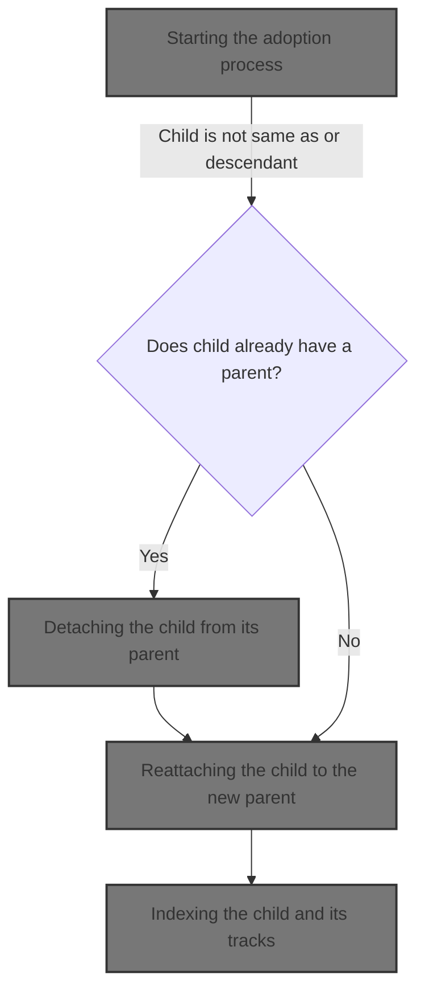

This document describes how a node is moved to a new parent within the workspace hierarchy. The process detaches the child from its previous parent, reattaches it to the new parent, and updates all references and indexes to maintain consistency.



# Starting the adoption process

```mermaid
%%{init: {"flowchart": {"defaultRenderer": "elk"}} }%%
flowchart TD
  node1{"Is child node same as parent or a descendant?"}
  click node1 openCode "ui/src/public/workspace.ts:495:500"
  node1 -->|"Yes"| node2["Reject move: Cannot adopt itself or descendant"]
  click node2 openCode "ui/src/public/workspace.ts:497:499"
  node1 -->|"No"| node3{"Does child already have a parent?"}
  click node3 openCode "ui/src/public/workspace.ts:502:504"
  node3 -->|"Yes"| node4["Detaching the child from its parent"]
  
  node3 -->|"No"| node5["Reattaching the child to the new parent"]
  
  node4 --> node5
  node5 --> node6["Indexing the child and its tracks"]
  
classDef HeadingStyle fill:#777777,stroke:#333,stroke-width:2px;
click node4 goToHeading "Detaching the child from its parent"
node4:::HeadingStyle
click node5 goToHeading "Reattaching the child to the new parent"
node5:::HeadingStyle
click node6 goToHeading "Indexing the child and its tracks"
node6:::HeadingStyle

%% Swimm:
%% %%{init: {"flowchart": {"defaultRenderer": "elk"}} }%%
%% flowchart TD
%%   node1{"Is child node same as parent or a descendant?"}
%%   click node1 openCode "<SwmPath>[ui/…/public/workspace.ts](ui/src/public/workspace.ts)</SwmPath>:495:500"
%%   node1 -->|"Yes"| node2["Reject move: Cannot adopt itself or descendant"]
%%   click node2 openCode "<SwmPath>[ui/…/public/workspace.ts](ui/src/public/workspace.ts)</SwmPath>:497:499"
%%   node1 -->|"No"| node3{"Does child already have a parent?"}
%%   click node3 openCode "<SwmPath>[ui/…/public/workspace.ts](ui/src/public/workspace.ts)</SwmPath>:502:504"
%%   node3 -->|"Yes"| node4["Detaching the child from its parent"]
%%   
%%   node3 -->|"No"| node5["Reattaching the child to the new parent"]
%%   
%%   node4 --> node5
%%   node5 --> node6["Indexing the child and its tracks"]
%%   
%% classDef HeadingStyle fill:#777777,stroke:#333,stroke-width:2px;
%% click node4 goToHeading "Detaching the child from its parent"
%% node4:::HeadingStyle
%% click node5 goToHeading "Reattaching the child to the new parent"
%% node5:::HeadingStyle
%% click node6 goToHeading "Indexing the child and its tracks"
%% node6:::HeadingStyle
```



<SwmSnippet path="/ui/src/public/workspace.ts" line="495">

---

In <SwmToken path="ui/src/public/workspace.ts" pos="495:3:3" line-data="  private adopt(child: TrackNode): Result {">`adopt`</SwmToken>, we first check for cycles or self-adoption, then if the child already has a parent, we remove it from that parent to keep the hierarchy clean. This sets up the child to be safely reattached to the new parent.

```typescript
  private adopt(child: TrackNode): Result {
    if (child === this || child.getTrackById(this.id)) {
      return errResult(
        'Cannot move track into itself or one of its descendants',
      );
    }

    if (child.parent) {
      child.parent.removeChild(child);
    }
```

---

</SwmSnippet>

## Detaching the child from its parent

<SwmSnippet path="/ui/src/public/workspace.ts" line="414">

---

In <SwmToken path="ui/src/public/workspace.ts" pos="414:1:1" line-data="  removeChild(child: TrackNode): void {">`removeChild`</SwmToken>, we detach the child from the parent's children array and clear its parent reference. Next, we update the parent's index to remove all references to the child and its nested tracks.

```typescript
  removeChild(child: TrackNode): void {
    this._children = this.children.filter((x) => child !== x);
    child._parent = undefined;
    this.removeFromIndex(child);
```

---

</SwmSnippet>

### Cleaning up index references

```mermaid
%%{init: {"flowchart": {"defaultRenderer": "elk"}} }%%
flowchart TD
  node1["Remove track's ID from index"]
  click node1 openCode "ui/src/public/workspace.ts:525:525"
  subgraph loop1["For each descendant track ID"]
    node2["Remove descendant ID from index"]
    click node2 openCode "ui/src/public/workspace.ts:527:527"
  end
  node1 --> loop1
  node3{"Does the track have a URI?"}
  click node3 openCode "ui/src/public/workspace.ts:530:530"
  loop1 --> node3
  node3 -->|"Yes"| node4["Remove track's URI from index"]
  click node4 openCode "ui/src/public/workspace.ts:530:530"
  node4 --> loop2
  node3 -->|"No"| loop2
  subgraph loop2["For each descendant track URI"]
    node5["Remove descendant URI from index"]
    click node5 openCode "ui/src/public/workspace.ts:532:532"
  end
  loop2 --> node6["Track and all references removed from index"]
  click node6 openCode "ui/src/public/workspace.ts:533:533"
classDef HeadingStyle fill:#777777,stroke:#333,stroke-width:2px;

%% Swimm:
%% %%{init: {"flowchart": {"defaultRenderer": "elk"}} }%%
%% flowchart TD
%%   node1["Remove track's ID from index"]
%%   click node1 openCode "<SwmPath>[ui/…/public/workspace.ts](ui/src/public/workspace.ts)</SwmPath>:525:525"
%%   subgraph loop1["For each descendant track ID"]
%%     node2["Remove descendant ID from index"]
%%     click node2 openCode "<SwmPath>[ui/…/public/workspace.ts](ui/src/public/workspace.ts)</SwmPath>:527:527"
%%   end
%%   node1 --> loop1
%%   node3{"Does the track have a URI?"}
%%   click node3 openCode "<SwmPath>[ui/…/public/workspace.ts](ui/src/public/workspace.ts)</SwmPath>:530:530"
%%   loop1 --> node3
%%   node3 -->|"Yes"| node4["Remove track's URI from index"]
%%   click node4 openCode "<SwmPath>[ui/…/public/workspace.ts](ui/src/public/workspace.ts)</SwmPath>:530:530"
%%   node4 --> loop2
%%   node3 -->|"No"| loop2
%%   subgraph loop2["For each descendant track URI"]
%%     node5["Remove descendant URI from index"]
%%     click node5 openCode "<SwmPath>[ui/…/public/workspace.ts](ui/src/public/workspace.ts)</SwmPath>:532:532"
%%   end
%%   loop2 --> node6["Track and all references removed from index"]
%%   click node6 openCode "<SwmPath>[ui/…/public/workspace.ts](ui/src/public/workspace.ts)</SwmPath>:533:533"
%% classDef HeadingStyle fill:#777777,stroke:#333,stroke-width:2px;
```



<SwmSnippet path="/ui/src/public/workspace.ts" line="524">

---

In <SwmToken path="ui/src/public/workspace.ts" pos="524:3:3" line-data="  private removeFromIndex(child: TrackNode) {">`removeFromIndex`</SwmToken>, we delete the child's id and all nested track ids from the parent's <SwmToken path="ui/src/public/workspace.ts" pos="525:3:3" line-data="    this.tracksById.delete(child.id);">`tracksById`</SwmToken> map. This assumes the child has <SwmToken path="ui/src/public/workspace.ts" pos="525:3:3" line-data="    this.tracksById.delete(child.id);">`tracksById`</SwmToken> and <SwmToken path="ui/src/public/workspace.ts" pos="518:9:9" line-data="    child.uri &amp;&amp; this.tracksByUri.set(child.uri, child);">`tracksByUri`</SwmToken> collections, and we clean up all references to avoid stale lookups.

```typescript
  private removeFromIndex(child: TrackNode) {
    this.tracksById.delete(child.id);
    for (const [id] of child.tracksById) {
      this.tracksById.delete(id);
    }
```

---

</SwmSnippet>

<SwmSnippet path="/ui/src/public/workspace.ts" line="530">

---

After handling ids, we also remove the child's uri and all nested uris from the parent's <SwmToken path="ui/src/public/workspace.ts" pos="530:9:9" line-data="    child.uri &amp;&amp; this.tracksByUri.delete(child.uri);">`tracksByUri`</SwmToken> map. This clears out all uri-based references tied to the child.

```typescript
    child.uri && this.tracksByUri.delete(child.uri);
    for (const [uri] of child.tracksByUri) {
      this.tracksByUri.delete(uri);
    }
```

---

</SwmSnippet>

### Propagating removal up the hierarchy

<SwmSnippet path="/ui/src/public/workspace.ts" line="418">

---

Back in <SwmToken path="ui/src/public/workspace.ts" pos="414:1:1" line-data="  removeChild(child: TrackNode): void {">`removeChild`</SwmToken>, after cleaning up the index, we call <SwmToken path="ui/src/public/workspace.ts" pos="418:3:3" line-data="    this.propagateRemoval(child);">`propagateRemoval`</SwmToken> to make sure all ancestor nodes also remove references to the child.

```typescript
    this.propagateRemoval(child);
  }
```

---

</SwmSnippet>

## Recursive removal from ancestor indexes

<SwmSnippet path="/ui/src/public/workspace.ts" line="543">

---

In <SwmToken path="ui/src/public/workspace.ts" pos="543:3:3" line-data="  private propagateRemoval(node: TrackNode): void {">`propagateRemoval`</SwmToken>, if there's a parent, we remove the node from the parent's index to keep ancestor references clean.

```typescript
  private propagateRemoval(node: TrackNode): void {
    if (this.parent) {
      this.parent.removeFromIndex(node);
```

---

</SwmSnippet>

<SwmSnippet path="/ui/src/public/workspace.ts" line="546">

---

After index cleanup, we keep propagating removal up until there are no more parents.

```typescript
      this.parent.propagateRemoval(node);
    }
  }
```

---

</SwmSnippet>

## Reattaching the child to the new parent

```mermaid
%%{init: {"flowchart": {"defaultRenderer": "elk"}} }%%
flowchart TD
    node1["Attempt to adopt child node"]
    click node1 openCode "ui/src/public/workspace.ts:505:506"
    node1 --> node2{"Is there a child node?"}
    click node2 openCode "ui/src/public/workspace.ts:505:506"
    node2 -->|"Yes"| node3["Set parent-child relationship"]
    click node3 openCode "ui/src/public/workspace.ts:505:505"
    node3 --> node4["Register child in parent's index"]
    click node4 openCode "ui/src/public/workspace.ts:506:506"
    node2 -->|"No"| node5["No action taken"]
    click node5 openCode "ui/src/public/workspace.ts:505:506"

classDef HeadingStyle fill:#777777,stroke:#333,stroke-width:2px;

%% Swimm:
%% %%{init: {"flowchart": {"defaultRenderer": "elk"}} }%%
%% flowchart TD
%%     node1["Attempt to adopt child node"]
%%     click node1 openCode "<SwmPath>[ui/…/public/workspace.ts](ui/src/public/workspace.ts)</SwmPath>:505:506"
%%     node1 --> node2{"Is there a child node?"}
%%     click node2 openCode "<SwmPath>[ui/…/public/workspace.ts](ui/src/public/workspace.ts)</SwmPath>:505:506"
%%     node2 -->|"Yes"| node3["Set parent-child relationship"]
%%     click node3 openCode "<SwmPath>[ui/…/public/workspace.ts](ui/src/public/workspace.ts)</SwmPath>:505:505"
%%     node3 --> node4["Register child in parent's index"]
%%     click node4 openCode "<SwmPath>[ui/…/public/workspace.ts](ui/src/public/workspace.ts)</SwmPath>:506:506"
%%     node2 -->|"No"| node5["No action taken"]
%%     click node5 openCode "<SwmPath>[ui/…/public/workspace.ts](ui/src/public/workspace.ts)</SwmPath>:505:506"
%% 
%% classDef HeadingStyle fill:#777777,stroke:#333,stroke-width:2px;
```



<SwmSnippet path="/ui/src/public/workspace.ts" line="505">

---

Back in <SwmToken path="ui/src/public/workspace.ts" pos="495:3:3" line-data="  private adopt(child: TrackNode): Result {">`adopt`</SwmToken>, after removing the child from its old parent, we set its new parent and update the index so the child and its nested tracks are now discoverable here.

```typescript
    child._parent = this;
    this.addToIndex(child);
```

---

</SwmSnippet>

## Indexing the child and its tracks

```mermaid
%%{init: {"flowchart": {"defaultRenderer": "elk"}} }%%
flowchart TD
  node1["Make child accessible by its ID"] 
  click node1 openCode "ui/src/public/workspace.ts:513:513"
  node1 --> loop1
  subgraph loop1["For each track in child (by ID)"]
    node2["Make track accessible by its ID"]
    click node2 openCode "ui/src/public/workspace.ts:514:515"
  end
  loop1 --> node3{"Does child have a URI?"}
  click node3 openCode "ui/src/public/workspace.ts:518:518"
  node3 -->|"Yes"| node4["Make child accessible by its URI"]
  click node4 openCode "ui/src/public/workspace.ts:518:518"
  node3 -->|"No"| loop2
  node4 --> loop2
  subgraph loop2["For each track in child (by URI)"]
    node5["Make track accessible by its URI"]
    click node5 openCode "ui/src/public/workspace.ts:519:521"
  end
classDef HeadingStyle fill:#777777,stroke:#333,stroke-width:2px;

%% Swimm:
%% %%{init: {"flowchart": {"defaultRenderer": "elk"}} }%%
%% flowchart TD
%%   node1["Make child accessible by its ID"] 
%%   click node1 openCode "<SwmPath>[ui/…/public/workspace.ts](ui/src/public/workspace.ts)</SwmPath>:513:513"
%%   node1 --> loop1
%%   subgraph loop1["For each track in child (by ID)"]
%%     node2["Make track accessible by its ID"]
%%     click node2 openCode "<SwmPath>[ui/…/public/workspace.ts](ui/src/public/workspace.ts)</SwmPath>:514:515"
%%   end
%%   loop1 --> node3{"Does child have a URI?"}
%%   click node3 openCode "<SwmPath>[ui/…/public/workspace.ts](ui/src/public/workspace.ts)</SwmPath>:518:518"
%%   node3 -->|"Yes"| node4["Make child accessible by its URI"]
%%   click node4 openCode "<SwmPath>[ui/…/public/workspace.ts](ui/src/public/workspace.ts)</SwmPath>:518:518"
%%   node3 -->|"No"| loop2
%%   node4 --> loop2
%%   subgraph loop2["For each track in child (by URI)"]
%%     node5["Make track accessible by its URI"]
%%     click node5 openCode "<SwmPath>[ui/…/public/workspace.ts](ui/src/public/workspace.ts)</SwmPath>:519:521"
%%   end
%% classDef HeadingStyle fill:#777777,stroke:#333,stroke-width:2px;
```



<SwmSnippet path="/ui/src/public/workspace.ts" line="512">

---

In <SwmToken path="ui/src/public/workspace.ts" pos="512:3:3" line-data="  private addToIndex(child: TrackNode) {">`addToIndex`</SwmToken>, we add the child and all its nested tracks to the parent's <SwmToken path="ui/src/public/workspace.ts" pos="513:3:3" line-data="    this.tracksById.set(child.id, child);">`tracksById`</SwmToken> and <SwmToken path="ui/src/public/workspace.ts" pos="518:9:9" line-data="    child.uri &amp;&amp; this.tracksByUri.set(child.uri, child);">`tracksByUri`</SwmToken> maps. This relies on the child having properly structured collections for ids and uris.

```typescript
  private addToIndex(child: TrackNode) {
    this.tracksById.set(child.id, child);
    for (const [id, node] of child.tracksById) {
      this.tracksById.set(id, node);
    }
```

---

</SwmSnippet>

<SwmSnippet path="/ui/src/public/workspace.ts" line="518">

---

After handling ids, we also add the child's uri and all nested uris to the parent's <SwmToken path="ui/src/public/workspace.ts" pos="518:9:9" line-data="    child.uri &amp;&amp; this.tracksByUri.set(child.uri, child);">`tracksByUri`</SwmToken> map. This makes all uri-based lookups work for the new hierarchy.

```typescript
    child.uri && this.tracksByUri.set(child.uri, child);
    for (const [uri, node] of child.tracksByUri) {
      this.tracksByUri.set(uri, node);
    }
```

---

</SwmSnippet>

## Propagating addition up the hierarchy

<SwmSnippet path="/ui/src/public/workspace.ts" line="507">

---

Back in <SwmToken path="ui/src/public/workspace.ts" pos="495:3:3" line-data="  private adopt(child: TrackNode): Result {">`adopt`</SwmToken>, after updating the index, we call <SwmToken path="ui/src/public/workspace.ts" pos="507:3:3" line-data="    this.propagateAddition(child);">`propagateAddition`</SwmToken> so all ancestor nodes also index the child and its nested tracks.

```typescript
    this.propagateAddition(child);

    return okResult();
  }
```

---

</SwmSnippet>

# Recursive addition to ancestor indexes

<SwmSnippet path="/ui/src/public/workspace.ts" line="536">

---

In <SwmToken path="ui/src/public/workspace.ts" pos="536:3:3" line-data="  private propagateAddition(node: TrackNode): void {">`propagateAddition`</SwmToken>, if there's a parent, we add the node to the parent's index so ancestor references are updated.

```typescript
  private propagateAddition(node: TrackNode): void {
    if (this.parent) {
      this.parent.addToIndex(node);
```

---

</SwmSnippet>

<SwmSnippet path="/ui/src/public/workspace.ts" line="539">

---

After index update, we keep propagating addition up until there are no more parents.

```typescript
      this.parent.propagateAddition(node);
    }
  }
```

---

</SwmSnippet>

&nbsp;

*This is an auto-generated document by Swimm 🌊 and has not yet been verified by a human*

<SwmMeta version="3.0.0" repo-id="Z2l0aHViJTNBJTNBY3BsdXNwbHVzLXBlcmZldHRvJTNBJTNBcmljYXJkb2xvcGV6Zw==" repo-name="cplusplus-perfetto"><sup>Powered by [Swimm](https://app.swimm.io/)</sup></SwmMeta>
