This document describes how a track node is moved to a new parent within the track hierarchy. The process detaches the node from its previous parent, updates the hierarchy, and ensures consistency throughout the structure. The input is a track node to be adopted, and the output is the node successfully moved under a new parent.

# Preparing to Move a Track Node

<SwmSnippet path="/ui/src/public/workspace.ts" line="495">

---

In <SwmToken path="ui/src/public/workspace.ts" pos="495:3:3" line-data="  private adopt(child: TrackNode): Result {">`adopt`</SwmToken>, we start by checking if the child is the same node or a descendant, and bail out if so. If the child already has a parent, we call <SwmToken path="ui/src/public/workspace.ts" pos="503:5:5" line-data="      child.parent.removeChild(child);">`removeChild`</SwmToken> on that parent to detach it, making sure the child isn't linked to multiple parents.

```typescript
  private adopt(child: TrackNode): Result {
    if (child === this || child.getTrackById(this.id)) {
      return errResult(
        'Cannot move track into itself or one of its descendants',
      );
    }

    if (child.parent) {
      child.parent.removeChild(child);
    }
```

---

</SwmSnippet>

## Detaching a Track Node from Its Parent

<SwmSnippet path="/ui/src/public/workspace.ts" line="414">

---

In <SwmToken path="ui/src/public/workspace.ts" pos="414:1:1" line-data="  removeChild(child: TrackNode): void {">`removeChild`</SwmToken>, we filter out the child from the children array and clear its parent reference. Next, we call <SwmToken path="ui/src/public/workspace.ts" pos="417:3:3" line-data="    this.removeFromIndex(child);">`removeFromIndex`</SwmToken> to clean up any internal mappings that reference this child.

```typescript
  removeChild(child: TrackNode): void {
    this._children = this.children.filter((x) => child !== x);
    child._parent = undefined;
    this.removeFromIndex(child);
```

---

</SwmSnippet>

### Cleaning Up Track Indexes

```mermaid
%%{init: {"flowchart": {"defaultRenderer": "elk"}} }%%
flowchart TD
    node1["Remove main track ID from index"]
    click node1 openCode "ui/src/public/workspace.ts:525:525"
    subgraph loop1["For each child track ID"]
      node1 --> node2["Remove child track ID from index"]
      click node2 openCode "ui/src/public/workspace.ts:526:528"
    end
    node2 --> node3{"Does the track have a URI?"}
    click node3 openCode "ui/src/public/workspace.ts:530:530"
    node3 -->|"Yes"| node4["Remove main track URI from index"]
    click node4 openCode "ui/src/public/workspace.ts:530:530"
    node4 --> node5
    node3 -->|"No"| node5
    subgraph loop2["For each child track URI"]
      node5["Remove child track URI from index"]
      click node5 openCode "ui/src/public/workspace.ts:531:533"
    end

classDef HeadingStyle fill:#777777,stroke:#333,stroke-width:2px;

%% Swimm:
%% %%{init: {"flowchart": {"defaultRenderer": "elk"}} }%%
%% flowchart TD
%%     node1["Remove main track ID from index"]
%%     click node1 openCode "<SwmPath>[ui/…/public/workspace.ts](ui/src/public/workspace.ts)</SwmPath>:525:525"
%%     subgraph loop1["For each child track ID"]
%%       node1 --> node2["Remove child track ID from index"]
%%       click node2 openCode "<SwmPath>[ui/…/public/workspace.ts](ui/src/public/workspace.ts)</SwmPath>:526:528"
%%     end
%%     node2 --> node3{"Does the track have a URI?"}
%%     click node3 openCode "<SwmPath>[ui/…/public/workspace.ts](ui/src/public/workspace.ts)</SwmPath>:530:530"
%%     node3 -->|"Yes"| node4["Remove main track URI from index"]
%%     click node4 openCode "<SwmPath>[ui/…/public/workspace.ts](ui/src/public/workspace.ts)</SwmPath>:530:530"
%%     node4 --> node5
%%     node3 -->|"No"| node5
%%     subgraph loop2["For each child track URI"]
%%       node5["Remove child track URI from index"]
%%       click node5 openCode "<SwmPath>[ui/…/public/workspace.ts](ui/src/public/workspace.ts)</SwmPath>:531:533"
%%     end
%% 
%% classDef HeadingStyle fill:#777777,stroke:#333,stroke-width:2px;
```



<SwmSnippet path="/ui/src/public/workspace.ts" line="524">

---

In <SwmToken path="ui/src/public/workspace.ts" pos="524:3:3" line-data="  private removeFromIndex(child: TrackNode) {">`removeFromIndex`</SwmToken>, we delete the child and all its nested tracks from the id and uri maps to make sure nothing is left behind in our lookup structures.

```typescript
  private removeFromIndex(child: TrackNode) {
    this.tracksById.delete(child.id);
    for (const [id] of child.tracksById) {
      this.tracksById.delete(id);
    }
```

---

</SwmSnippet>

<SwmSnippet path="/ui/src/public/workspace.ts" line="530">

---

After all deletions in <SwmToken path="ui/src/public/workspace.ts" pos="417:3:3" line-data="    this.removeFromIndex(child);">`removeFromIndex`</SwmToken>, nothing is returned—it's a void function that just updates internal state.

```typescript
    child.uri && this.tracksByUri.delete(child.uri);
    for (const [uri] of child.tracksByUri) {
      this.tracksByUri.delete(uri);
    }
```

---

</SwmSnippet>

### Propagating Track Removal Up the Tree

<SwmSnippet path="/ui/src/public/workspace.ts" line="418">

---

Back in <SwmToken path="ui/src/public/workspace.ts" pos="414:1:1" line-data="  removeChild(child: TrackNode): void {">`removeChild`</SwmToken>, after cleaning up indexes, we call <SwmToken path="ui/src/public/workspace.ts" pos="418:3:3" line-data="    this.propagateRemoval(child);">`propagateRemoval`</SwmToken> so parent nodes can also update their internal state and stay in sync.

```typescript
    this.propagateRemoval(child);
  }
```

---

</SwmSnippet>

## Recursive Removal Propagation

```mermaid
%%{init: {"flowchart": {"defaultRenderer": "elk"}} }%%
flowchart TD
    node1["Start removal process"] --> node2{"Does the node have a parent?"}
    click node1 openCode "ui/src/public/workspace.ts:543:544"
    click node2 openCode "ui/src/public/workspace.ts:544:547"
    node2 -->|"Yes"| node3["Remove node from parent"]
    click node3 openCode "ui/src/public/workspace.ts:545:545"
    node3 --> node4["Propagate removal to parent"]
    click node4 openCode "ui/src/public/workspace.ts:546:546"
    node4 --> node2
    node2 -->|"No"| node5["End removal process"]
    click node5 openCode "ui/src/public/workspace.ts:547:548"

classDef HeadingStyle fill:#777777,stroke:#333,stroke-width:2px;

%% Swimm:
%% %%{init: {"flowchart": {"defaultRenderer": "elk"}} }%%
%% flowchart TD
%%     node1["Start removal process"] --> node2{"Does the node have a parent?"}
%%     click node1 openCode "<SwmPath>[ui/…/public/workspace.ts](ui/src/public/workspace.ts)</SwmPath>:543:544"
%%     click node2 openCode "<SwmPath>[ui/…/public/workspace.ts](ui/src/public/workspace.ts)</SwmPath>:544:547"
%%     node2 -->|"Yes"| node3["Remove node from parent"]
%%     click node3 openCode "<SwmPath>[ui/…/public/workspace.ts](ui/src/public/workspace.ts)</SwmPath>:545:545"
%%     node3 --> node4["Propagate removal to parent"]
%%     click node4 openCode "<SwmPath>[ui/…/public/workspace.ts](ui/src/public/workspace.ts)</SwmPath>:546:546"
%%     node4 --> node2
%%     node2 -->|"No"| node5["End removal process"]
%%     click node5 openCode "<SwmPath>[ui/…/public/workspace.ts](ui/src/public/workspace.ts)</SwmPath>:547:548"
%% 
%% classDef HeadingStyle fill:#777777,stroke:#333,stroke-width:2px;
```



<SwmSnippet path="/ui/src/public/workspace.ts" line="543">

---

In <SwmToken path="ui/src/public/workspace.ts" pos="543:3:3" line-data="  private propagateRemoval(node: TrackNode): void {">`propagateRemoval`</SwmToken>, if there's a parent, we call <SwmToken path="ui/src/public/workspace.ts" pos="545:5:5" line-data="      this.parent.removeFromIndex(node);">`removeFromIndex`</SwmToken> on it and then recursively propagate the removal up the tree.

```typescript
  private propagateRemoval(node: TrackNode): void {
    if (this.parent) {
      this.parent.removeFromIndex(node);
```

---

</SwmSnippet>

<SwmSnippet path="/ui/src/public/workspace.ts" line="546">

---

After each parent's indexes are updated in <SwmToken path="ui/src/public/workspace.ts" pos="546:5:5" line-data="      this.parent.propagateRemoval(node);">`propagateRemoval`</SwmToken>, we stop once we hit the root.

```typescript
      this.parent.propagateRemoval(node);
    }
  }
```

---

</SwmSnippet>

## Finalizing Track Adoption

<SwmSnippet path="/ui/src/public/workspace.ts" line="505">

---

After returning from <SwmToken path="ui/src/public/workspace.ts" pos="414:1:1" line-data="  removeChild(child: TrackNode): void {">`removeChild`</SwmToken> in <SwmToken path="ui/src/public/workspace.ts" pos="495:3:3" line-data="  private adopt(child: TrackNode): Result {">`adopt`</SwmToken>, we set the new parent, update indexes, propagate the addition up the tree, and return success.

```typescript
    child._parent = this;
    this.addToIndex(child);
    this.propagateAddition(child);

    return okResult();
  }
```

---

</SwmSnippet>

&nbsp;

*This is an auto-generated document by Swimm 🌊 and has not yet been verified by a human*

<SwmMeta version="3.0.0" repo-id="Z2l0aHViJTNBJTNBY3BsdXNwbHVzLXBlcmZldHRvJTNBJTNBcmljYXJkb2xvcGV6Zw==" repo-name="cplusplus-perfetto"><sup>Powered by [Swimm](https://app.swimm.io/)</sup></SwmMeta>
