This document describes how the system processes a stream of SQL statements, preparing each one for execution by handling macros and custom directives. The flow skips empty statements, preprocesses the next valid SQL statement, and parses it so it is ready for execution or analysis.

# Advancing to the Next SQL Statement

<SwmSnippet path="/src/trace_processor/perfetto_sql/parser/perfetto_sql_parser.cc" line="407">

---

In <SwmToken path="src/trace_processor/perfetto_sql/parser/perfetto_sql_parser.cc" pos="407:4:4" line-data="bool PerfettoSqlParser::Next() {">`Next`</SwmToken>, we start by clearing out any previous statement state, then immediately call the preprocessor's <SwmToken path="src/trace_processor/perfetto_sql/parser/perfetto_sql_parser.cc" pos="413:9:11" line-data="  if (!parser_state_-&gt;preprocessor.NextStatement()) {">`NextStatement()`</SwmToken> to fetch and preprocess the next SQL statement. This is needed because the preprocessor handles macro expansion and custom directives before the parser can work with the SQL, so we can't proceed until it's done.

```c++
bool PerfettoSqlParser::Next() {
  PERFETTO_DCHECK(parser_state_->status.ok());

  parser_state_->current_statement = std::nullopt;
  statement_sql_ = std::nullopt;

  if (!parser_state_->preprocessor.NextStatement()) {
    parser_state_->status = parser_state_->preprocessor.status();
    return false;
  }
```

---

</SwmSnippet>

## Preprocessing and Skipping Empty Statements

```mermaid
%%{init: {"flowchart": {"defaultRenderer": "elk"}} }%%
flowchart TD
    subgraph loop1["Skip empty statements"]
        node1["Read next token"]
        click node1 openCode "src/trace_processor/perfetto_sql/preprocessor/perfetto_sql_preprocessor.cc:489:492"
        node1 --> node2{"Is token a semicolon?"}
        click node2 openCode "src/trace_processor/perfetto_sql/preprocessor/perfetto_sql_preprocessor.cc:490:492"
        node2 -->|"Yes"| node1
        node2 -->|"No"| node3["Check for end of input"]
        click node3 openCode "src/trace_processor/perfetto_sql/preprocessor/perfetto_sql_preprocessor.cc:494:495"
    end
    node3 --> node4{"End of input?"}
    click node4 openCode "src/trace_processor/perfetto_sql/preprocessor/perfetto_sql_preprocessor.cc:495:495"
    node4 -->|"Yes"| node5["No more statements (return false)"]
    click node5 openCode "src/trace_processor/perfetto_sql/preprocessor/perfetto_sql_preprocessor.cc:495:498"
    node4 -->|"No"| node6["Extract next statement"]
    click node6 openCode "src/trace_processor/perfetto_sql/preprocessor/perfetto_sql_preprocessor.cc:500:503"
    subgraph loop2["Process statement tokens"]
        node6 --> node7["Process next token"]
        click node7 openCode "src/trace_processor/perfetto_sql/preprocessor/perfetto_sql_preprocessor.cc:507:510"
        node7 --> node8{"Parsing error?"}
        click node8 openCode "src/trace_processor/perfetto_sql/preprocessor/perfetto_sql_preprocessor.cc:540:541"
        node8 -->|"Yes"| node9["Invalid statement (return false)"]
        click node9 openCode "src/trace_processor/perfetto_sql/preprocessor/perfetto_sql_preprocessor.cc:541:542"
        node8 -->|"No"| node10{"Statement complete?"}
        click node10 openCode "src/trace_processor/perfetto_sql/preprocessor/perfetto_sql_preprocessor.cc:544:545"
        node10 -->|"Yes"| node11["Statement processed (return true)"]
        click node11 openCode "src/trace_processor/perfetto_sql/preprocessor/perfetto_sql_preprocessor.cc:546:547"
        node10 -->|"No"| node7
    end

classDef HeadingStyle fill:#777777,stroke:#333,stroke-width:2px;

%% Swimm:
%% %%{init: {"flowchart": {"defaultRenderer": "elk"}} }%%
%% flowchart TD
%%     subgraph loop1["Skip empty statements"]
%%         node1["Read next token"]
%%         click node1 openCode "<SwmPath>[src/…/preprocessor/perfetto_sql_preprocessor.cc](src/trace_processor/perfetto_sql/preprocessor/perfetto_sql_preprocessor.cc)</SwmPath>:489:492"
%%         node1 --> node2{"Is token a semicolon?"}
%%         click node2 openCode "<SwmPath>[src/…/preprocessor/perfetto_sql_preprocessor.cc](src/trace_processor/perfetto_sql/preprocessor/perfetto_sql_preprocessor.cc)</SwmPath>:490:492"
%%         node2 -->|"Yes"| node1
%%         node2 -->|"No"| node3["Check for end of input"]
%%         click node3 openCode "<SwmPath>[src/…/preprocessor/perfetto_sql_preprocessor.cc](src/trace_processor/perfetto_sql/preprocessor/perfetto_sql_preprocessor.cc)</SwmPath>:494:495"
%%     end
%%     node3 --> node4{"End of input?"}
%%     click node4 openCode "<SwmPath>[src/…/preprocessor/perfetto_sql_preprocessor.cc](src/trace_processor/perfetto_sql/preprocessor/perfetto_sql_preprocessor.cc)</SwmPath>:495:495"
%%     node4 -->|"Yes"| node5["No more statements (return false)"]
%%     click node5 openCode "<SwmPath>[src/…/preprocessor/perfetto_sql_preprocessor.cc](src/trace_processor/perfetto_sql/preprocessor/perfetto_sql_preprocessor.cc)</SwmPath>:495:498"
%%     node4 -->|"No"| node6["Extract next statement"]
%%     click node6 openCode "<SwmPath>[src/…/preprocessor/perfetto_sql_preprocessor.cc](src/trace_processor/perfetto_sql/preprocessor/perfetto_sql_preprocessor.cc)</SwmPath>:500:503"
%%     subgraph loop2["Process statement tokens"]
%%         node6 --> node7["Process next token"]
%%         click node7 openCode "<SwmPath>[src/…/preprocessor/perfetto_sql_preprocessor.cc](src/trace_processor/perfetto_sql/preprocessor/perfetto_sql_preprocessor.cc)</SwmPath>:507:510"
%%         node7 --> node8{"Parsing error?"}
%%         click node8 openCode "<SwmPath>[src/…/preprocessor/perfetto_sql_preprocessor.cc](src/trace_processor/perfetto_sql/preprocessor/perfetto_sql_preprocessor.cc)</SwmPath>:540:541"
%%         node8 -->|"Yes"| node9["Invalid statement (return false)"]
%%         click node9 openCode "<SwmPath>[src/…/preprocessor/perfetto_sql_preprocessor.cc](src/trace_processor/perfetto_sql/preprocessor/perfetto_sql_preprocessor.cc)</SwmPath>:541:542"
%%         node8 -->|"No"| node10{"Statement complete?"}
%%         click node10 openCode "<SwmPath>[src/…/preprocessor/perfetto_sql_preprocessor.cc](src/trace_processor/perfetto_sql/preprocessor/perfetto_sql_preprocessor.cc)</SwmPath>:544:545"
%%         node10 -->|"Yes"| node11["Statement processed (return true)"]
%%         click node11 openCode "<SwmPath>[src/…/preprocessor/perfetto_sql_preprocessor.cc](src/trace_processor/perfetto_sql/preprocessor/perfetto_sql_preprocessor.cc)</SwmPath>:546:547"
%%         node10 -->|"No"| node7
%%     end
%% 
%% classDef HeadingStyle fill:#777777,stroke:#333,stroke-width:2px;
```



<SwmSnippet path="/src/trace_processor/perfetto_sql/preprocessor/perfetto_sql_preprocessor.cc" line="485">

---

In <SwmToken path="src/trace_processor/perfetto_sql/preprocessor/perfetto_sql_preprocessor.cc" pos="485:4:4" line-data="bool PerfettoSqlPreprocessor::NextStatement() {">`NextStatement`</SwmToken>, we skip over any empty statements (just semicolons), check for EOF, and then grab the next chunk of SQL to preprocess. This sets up the stack and tokenizer for the main parsing loop that follows.

```c++
bool PerfettoSqlPreprocessor::NextStatement() {
  PERFETTO_CHECK(status_.ok());

  // Skip through any number of semi-colons (representing empty statements).
  SqliteTokenizer::Token tok = global_tokenizer_.NextNonWhitespace();
  while (tok.token_type == TK_SEMI) {
    tok = global_tokenizer_.NextNonWhitespace();
  }
```

---

</SwmSnippet>

<SwmSnippet path="/src/trace_processor/perfetto_sql/preprocessor/perfetto_sql_preprocessor.cc" line="494">

---

Here the function loops through tokens, mapping them to custom types and feeding them to the preprocessor. It uses a stack to handle nested constructs, and returns true when a complete statement is built, or false on EOF or error.

```c++
  // If we still see a terminal token at this point, we must have hit EOF.
  if (tok.IsTerminal()) {
    PERFETTO_DCHECK(tok.token_type != TK_SEMI);
    return false;
  }

  SqlSource stmt =
      global_tokenizer_.Substr(tok, global_tokenizer_.NextTerminal(),
                               SqliteTokenizer::EndToken::kExclusive);

  State s{{}, *macros_, {}};
  s.stack.emplace_back(Frame::Root(), Frame::kIgnore, &s, std::move(stmt));
  for (;;) {
    auto* frame = &s.stack.back();
    auto& tk = frame->tokenizer;
    SqliteTokenizer::Token t = tk.NextNonWhitespace();
    int token_type;
    if (t.str.empty()) {
      token_type = frame->seen_semicolon ? 0 : PPTK_SEMI;
      frame->seen_semicolon = true;
    } else if (t.token_type == TK_SEMI) {
      token_type = PPTK_SEMI;
      frame->seen_semicolon = true;
    } else if (t.token_type == TK_ILLEGAL) {
      if (t.str.size() == 1 && t.str[0] == '!') {
        token_type = PPTK_EXCLAIM;
      } else {
        status_ = ErrorAtToken(tk, t, "illegal token");
        return false;
      }
    } else if (t.token_type == TK_ID) {
      token_type = PPTK_ID;
    } else if (t.token_type == TK_LP) {
      token_type = PPTK_LP;
    } else if (t.token_type == TK_RP) {
      token_type = PPTK_RP;
    } else if (t.token_type == TK_COMMA) {
      token_type = PPTK_COMMA;
    } else if (t.token_type == TK_VARIABLE) {
      token_type = PPTK_VARIABLE;
    } else {
      token_type = PPTK_OPAQUE;
    }
    frame->preprocessor.Parse(
        token_type,
        PreprocessorGrammarToken{t.str.data(), t.str.size(), token_type});
    if (s.error) {
      status_ = ErrorAtToken(tk, s.error->token, s.error->message.c_str());
      return false;
    }
    if (token_type == 0) {
      if (s.stack.size() == 1) {
        statement_ = std::move(frame->rewriter).Build();
        return true;
      }
      s.stack.pop_back();
      frame = &s.stack.back();
    }
  }
```

---

</SwmSnippet>

## Parsing the Preprocessed Statement

```mermaid
%%{init: {"flowchart": {"defaultRenderer": "elk"}} }%%
flowchart TD
    node1["Start parsing SQL statement"]
    click node1 openCode "src/trace_processor/perfetto_sql/parser/perfetto_sql_parser.cc:417:418"
    subgraph loop1["For each token in statement"]
      node1 --> node2{"Is parsing status OK?"}
      click node2 openCode "src/trace_processor/perfetto_sql/parser/perfetto_sql_parser.cc:425:427"
      node2 -->|"No"| node3["Return failure"]
      click node3 openCode "src/trace_processor/perfetto_sql/parser/perfetto_sql_parser.cc:426:427"
      node2 -->|"Yes"| node4{"Is token terminal?"}
      click node4 openCode "src/trace_processor/perfetto_sql/parser/perfetto_sql_parser.cc:428:444"
      node4 -->|"No"| node5{"Is token space or comment?"}
      click node5 openCode "src/trace_processor/perfetto_sql/parser/perfetto_sql_parser.cc:445:447"
      node5 -->|"Yes"| node2
      node5 -->|"No"| node6["Process token"]
      click node6 openCode "src/trace_processor/perfetto_sql/parser/perfetto_sql_parser.cc:448:449"
      node6 --> node2
      node4 -->|"Yes"| node7{"Has semicolon been encountered?"}
      click node7 openCode "src/trace_processor/perfetto_sql/parser/perfetto_sql_parser.cc:429:438"
      node7 -->|"No"| node8["Process semicolon"]
      click node8 openCode "src/trace_processor/perfetto_sql/parser/perfetto_sql_parser.cc:430:433"
      node8 --> node2
      node7 -->|"Yes"| node9["Process EOF"]
      click node9 openCode "src/trace_processor/perfetto_sql/parser/perfetto_sql_parser.cc:435:438"
      node9 --> node10{"Is there a current statement?"}
      click node10 openCode "src/trace_processor/perfetto_sql/parser/perfetto_sql_parser.cc:439:441"
      node10 -->|"No"| node11["Create statement object"]
      click node11 openCode "src/trace_processor/perfetto_sql/parser/perfetto_sql_parser.cc:440:441"
      node11 --> node12["Assign statement SQL and return success"]
      click node12 openCode "src/trace_processor/perfetto_sql/parser/perfetto_sql_parser.cc:442:444"
      node10 -->|"Yes"| node12
    end

classDef HeadingStyle fill:#777777,stroke:#333,stroke-width:2px;

%% Swimm:
%% %%{init: {"flowchart": {"defaultRenderer": "elk"}} }%%
%% flowchart TD
%%     node1["Start parsing SQL statement"]
%%     click node1 openCode "<SwmPath>[src/…/parser/perfetto_sql_parser.cc](src/trace_processor/perfetto_sql/parser/perfetto_sql_parser.cc)</SwmPath>:417:418"
%%     subgraph loop1["For each token in statement"]
%%       node1 --> node2{"Is parsing status OK?"}
%%       click node2 openCode "<SwmPath>[src/…/parser/perfetto_sql_parser.cc](src/trace_processor/perfetto_sql/parser/perfetto_sql_parser.cc)</SwmPath>:425:427"
%%       node2 -->|"No"| node3["Return failure"]
%%       click node3 openCode "<SwmPath>[src/…/parser/perfetto_sql_parser.cc](src/trace_processor/perfetto_sql/parser/perfetto_sql_parser.cc)</SwmPath>:426:427"
%%       node2 -->|"Yes"| node4{"Is token terminal?"}
%%       click node4 openCode "<SwmPath>[src/…/parser/perfetto_sql_parser.cc](src/trace_processor/perfetto_sql/parser/perfetto_sql_parser.cc)</SwmPath>:428:444"
%%       node4 -->|"No"| node5{"Is token space or comment?"}
%%       click node5 openCode "<SwmPath>[src/…/parser/perfetto_sql_parser.cc](src/trace_processor/perfetto_sql/parser/perfetto_sql_parser.cc)</SwmPath>:445:447"
%%       node5 -->|"Yes"| node2
%%       node5 -->|"No"| node6["Process token"]
%%       click node6 openCode "<SwmPath>[src/…/parser/perfetto_sql_parser.cc](src/trace_processor/perfetto_sql/parser/perfetto_sql_parser.cc)</SwmPath>:448:449"
%%       node6 --> node2
%%       node4 -->|"Yes"| node7{"Has semicolon been encountered?"}
%%       click node7 openCode "<SwmPath>[src/…/parser/perfetto_sql_parser.cc](src/trace_processor/perfetto_sql/parser/perfetto_sql_parser.cc)</SwmPath>:429:438"
%%       node7 -->|"No"| node8["Process semicolon"]
%%       click node8 openCode "<SwmPath>[src/…/parser/perfetto_sql_parser.cc](src/trace_processor/perfetto_sql/parser/perfetto_sql_parser.cc)</SwmPath>:430:433"
%%       node8 --> node2
%%       node7 -->|"Yes"| node9["Process EOF"]
%%       click node9 openCode "<SwmPath>[src/…/parser/perfetto_sql_parser.cc](src/trace_processor/perfetto_sql/parser/perfetto_sql_parser.cc)</SwmPath>:435:438"
%%       node9 --> node10{"Is there a current statement?"}
%%       click node10 openCode "<SwmPath>[src/…/parser/perfetto_sql_parser.cc](src/trace_processor/perfetto_sql/parser/perfetto_sql_parser.cc)</SwmPath>:439:441"
%%       node10 -->|"No"| node11["Create statement object"]
%%       click node11 openCode "<SwmPath>[src/…/parser/perfetto_sql_parser.cc](src/trace_processor/perfetto_sql/parser/perfetto_sql_parser.cc)</SwmPath>:440:441"
%%       node11 --> node12["Assign statement SQL and return success"]
%%       click node12 openCode "<SwmPath>[src/…/parser/perfetto_sql_parser.cc](src/trace_processor/perfetto_sql/parser/perfetto_sql_parser.cc)</SwmPath>:442:444"
%%       node10 -->|"Yes"| node12
%%     end
%% 
%% classDef HeadingStyle fill:#777777,stroke:#333,stroke-width:2px;
```



<SwmSnippet path="/src/trace_processor/perfetto_sql/parser/perfetto_sql_parser.cc" line="417">

---

Back in <SwmToken path="src/trace_processor/perfetto_sql/parser/perfetto_sql_parser.cc" pos="423:14:14" line-data="  for (Token token = parser_state_-&gt;tokenizer.Next();;">`Next`</SwmToken>, after getting the preprocessed statement, we reset the tokenizer to work on that output, then run the parser loop to build the final parsed statement. We handle semicolons and EOF explicitly to make sure the parser state is correct, and return true when a statement is ready.

```c++
  parser_state_->tokenizer.Reset(parser_state_->preprocessor.statement());

  auto* parser = PerfettoSqlParseAlloc(malloc, parser_state_.get());
  auto guard = base::OnScopeExit([&]() { PerfettoSqlParseFree(parser, free); });

  enum { kEof, kSemicolon, kNone } eof = kNone;
  for (Token token = parser_state_->tokenizer.Next();;
       token = parser_state_->tokenizer.Next()) {
    if (!parser_state_->status.ok()) {
      return false;
    }
    if (token.IsTerminal()) {
      if (eof == kNone) {
        PerfettoSqlParse(parser, TK_SEMI, TokenToPerfettoSqlToken(token));
        eof = kSemicolon;
        continue;
      }
      if (eof == kSemicolon) {
        PerfettoSqlParse(parser, 0, TokenToPerfettoSqlToken(token));
        eof = kEof;
        continue;
      }
      if (!parser_state_->current_statement) {
        parser_state_->current_statement = SqliteSql{};
      }
      statement_sql_ = parser_state_->preprocessor.statement();
      return true;
    }
    if (token.token_type == TK_SPACE || token.token_type == TK_COMMENT) {
      continue;
    }
    PerfettoSqlParse(parser, token.token_type, TokenToPerfettoSqlToken(token));
  }
```

---

</SwmSnippet>

&nbsp;

*This is an auto-generated document by Swimm 🌊 and has not yet been verified by a human*

<SwmMeta version="3.0.0" repo-id="Z2l0aHViJTNBJTNBY3BsdXNwbHVzLXBlcmZldHRvJTNBJTNBcmljYXJkb2xvcGV6Zw==" repo-name="cplusplus-perfetto"><sup>Powered by [Swimm](https://app.swimm.io/)</sup></SwmMeta>
