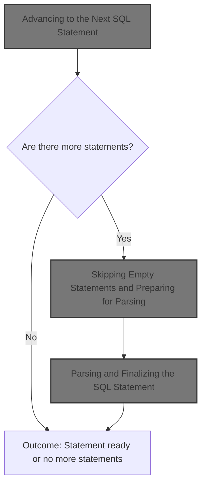

This document describes how the system advances through a stream of SQL statements, skipping empty statements and preparing each valid statement for parsing and execution. The process ensures that only meaningful SQL statements are parsed and made ready for further processing.



# Advancing to the Next SQL Statement

```mermaid
%%{init: {"flowchart": {"defaultRenderer": "elk"}} }%%
flowchart TD
    node1["Try to advance to next SQL statement"]
    click node1 openCode "src/trace_processor/perfetto_sql/parser/perfetto_sql_parser.cc:407:413"
    node1 --> node2{"Is there another statement?"}
    
    node2 -->|"No"| node4["Return 'no more statements'"]
    click node4 openCode "src/trace_processor/perfetto_sql/parser/perfetto_sql_parser.cc:415:416"
    node2 -->|"Yes"| node3["Parse tokens of the statement"]
    click node3 openCode "src/trace_processor/perfetto_sql/parser/perfetto_sql_parser.cc:417:449"
    subgraph loop1["While parsing tokens"]
      node3 --> node3
    end
    node3 --> node5["Return 'statement ready'"]
    click node5 openCode "src/trace_processor/perfetto_sql/parser/perfetto_sql_parser.cc:443:444"

classDef HeadingStyle fill:#777777,stroke:#333,stroke-width:2px;
click node2 goToHeading "Skipping Empty Statements and Preparing for Parsing"
node2:::HeadingStyle

%% Swimm:
%% %%{init: {"flowchart": {"defaultRenderer": "elk"}} }%%
%% flowchart TD
%%     node1["Try to advance to next SQL statement"]
%%     click node1 openCode "<SwmPath>[src/…/parser/perfetto_sql_parser.cc](src/trace_processor/perfetto_sql/parser/perfetto_sql_parser.cc)</SwmPath>:407:413"
%%     node1 --> node2{"Is there another statement?"}
%%     
%%     node2 -->|"No"| node4["Return 'no more statements'"]
%%     click node4 openCode "<SwmPath>[src/…/parser/perfetto_sql_parser.cc](src/trace_processor/perfetto_sql/parser/perfetto_sql_parser.cc)</SwmPath>:415:416"
%%     node2 -->|"Yes"| node3["Parse tokens of the statement"]
%%     click node3 openCode "<SwmPath>[src/…/parser/perfetto_sql_parser.cc](src/trace_processor/perfetto_sql/parser/perfetto_sql_parser.cc)</SwmPath>:417:449"
%%     subgraph loop1["While parsing tokens"]
%%       node3 --> node3
%%     end
%%     node3 --> node5["Return 'statement ready'"]
%%     click node5 openCode "<SwmPath>[src/…/parser/perfetto_sql_parser.cc](src/trace_processor/perfetto_sql/parser/perfetto_sql_parser.cc)</SwmPath>:443:444"
%% 
%% classDef HeadingStyle fill:#777777,stroke:#333,stroke-width:2px;
%% click node2 goToHeading "Skipping Empty Statements and Preparing for Parsing"
%% node2:::HeadingStyle
```



<SwmSnippet path="/src/trace_processor/perfetto_sql/parser/perfetto_sql_parser.cc" line="407">

---

In <SwmToken path="src/trace_processor/perfetto_sql/parser/perfetto_sql_parser.cc" pos="407:4:4" line-data="bool PerfettoSqlParser::Next() {">`Next`</SwmToken>, we start by clearing out any previous statement state and checking for errors. We then call the preprocessor's <SwmToken path="src/trace_processor/perfetto_sql/parser/perfetto_sql_parser.cc" pos="413:9:9" line-data="  if (!parser_state_-&gt;preprocessor.NextStatement()) {">`NextStatement`</SwmToken> to move to the next valid SQL statement, skipping any empty ones. This sets up the parser to work on a fresh statement, and if there are no more statements, we bail out early.

```c++
bool PerfettoSqlParser::Next() {
  PERFETTO_DCHECK(parser_state_->status.ok());

  parser_state_->current_statement = std::nullopt;
  statement_sql_ = std::nullopt;

  if (!parser_state_->preprocessor.NextStatement()) {
    parser_state_->status = parser_state_->preprocessor.status();
    return false;
  }
```

---

</SwmSnippet>

## Skipping Empty Statements and Preparing for Parsing

```mermaid
%%{init: {"flowchart": {"defaultRenderer": "elk"}} }%%
flowchart TD
    subgraph loop1["Skip empty statements (semicolons)"]
        node1["Read next token"]
        click node1 openCode "src/trace_processor/perfetto_sql/preprocessor/perfetto_sql_preprocessor.cc:489:492"
        node1 --> node2{"Is token a semicolon?"}
        click node2 openCode "src/trace_processor/perfetto_sql/preprocessor/perfetto_sql_preprocessor.cc:490:492"
        node2 -->|"Yes"| node1
        node2 -->|"No"| node3["Proceed to next statement"]
        click node3 openCode "src/trace_processor/perfetto_sql/preprocessor/perfetto_sql_preprocessor.cc:493:494"
    end
    node3 --> node4{"End of input (EOF)?"}
    click node4 openCode "src/trace_processor/perfetto_sql/preprocessor/perfetto_sql_preprocessor.cc:495:498"
    node4 -->|"Yes"| node5["Return: No more statements"]
    click node5 openCode "src/trace_processor/perfetto_sql/preprocessor/perfetto_sql_preprocessor.cc:497:498"
    node4 -->|"No"| node6["Extract next meaningful statement"]
    click node6 openCode "src/trace_processor/perfetto_sql/preprocessor/perfetto_sql_preprocessor.cc:500:503"
    subgraph loop2["Process statement"]
        node6 --> node7["Process next token in statement"]
        click node7 openCode "src/trace_processor/perfetto_sql/preprocessor/perfetto_sql_preprocessor.cc:506:537"
        node7 --> node8{"Error encountered?"}
        click node8 openCode "src/trace_processor/perfetto_sql/preprocessor/perfetto_sql_preprocessor.cc:540:543"
        node8 -->|"Yes"| node9["Return: Error"]
        click node9 openCode "src/trace_processor/perfetto_sql/preprocessor/perfetto_sql_preprocessor.cc:541:543"
        node8 -->|"No"| node10{"Statement complete?"}
        click node10 openCode "src/trace_processor/perfetto_sql/preprocessor/perfetto_sql_preprocessor.cc:544:548"
        node10 -->|"Yes"| node11["Return: Success (statement processed)"]
        click node11 openCode "src/trace_processor/perfetto_sql/preprocessor/perfetto_sql_preprocessor.cc:546:548"
        node10 -->|"No"| node7
    end

classDef HeadingStyle fill:#777777,stroke:#333,stroke-width:2px;

%% Swimm:
%% %%{init: {"flowchart": {"defaultRenderer": "elk"}} }%%
%% flowchart TD
%%     subgraph loop1["Skip empty statements (semicolons)"]
%%         node1["Read next token"]
%%         click node1 openCode "<SwmPath>[src/…/preprocessor/perfetto_sql_preprocessor.cc](src/trace_processor/perfetto_sql/preprocessor/perfetto_sql_preprocessor.cc)</SwmPath>:489:492"
%%         node1 --> node2{"Is token a semicolon?"}
%%         click node2 openCode "<SwmPath>[src/…/preprocessor/perfetto_sql_preprocessor.cc](src/trace_processor/perfetto_sql/preprocessor/perfetto_sql_preprocessor.cc)</SwmPath>:490:492"
%%         node2 -->|"Yes"| node1
%%         node2 -->|"No"| node3["Proceed to next statement"]
%%         click node3 openCode "<SwmPath>[src/…/preprocessor/perfetto_sql_preprocessor.cc](src/trace_processor/perfetto_sql/preprocessor/perfetto_sql_preprocessor.cc)</SwmPath>:493:494"
%%     end
%%     node3 --> node4{"End of input (EOF)?"}
%%     click node4 openCode "<SwmPath>[src/…/preprocessor/perfetto_sql_preprocessor.cc](src/trace_processor/perfetto_sql/preprocessor/perfetto_sql_preprocessor.cc)</SwmPath>:495:498"
%%     node4 -->|"Yes"| node5["Return: No more statements"]
%%     click node5 openCode "<SwmPath>[src/…/preprocessor/perfetto_sql_preprocessor.cc](src/trace_processor/perfetto_sql/preprocessor/perfetto_sql_preprocessor.cc)</SwmPath>:497:498"
%%     node4 -->|"No"| node6["Extract next meaningful statement"]
%%     click node6 openCode "<SwmPath>[src/…/preprocessor/perfetto_sql_preprocessor.cc](src/trace_processor/perfetto_sql/preprocessor/perfetto_sql_preprocessor.cc)</SwmPath>:500:503"
%%     subgraph loop2["Process statement"]
%%         node6 --> node7["Process next token in statement"]
%%         click node7 openCode "<SwmPath>[src/…/preprocessor/perfetto_sql_preprocessor.cc](src/trace_processor/perfetto_sql/preprocessor/perfetto_sql_preprocessor.cc)</SwmPath>:506:537"
%%         node7 --> node8{"Error encountered?"}
%%         click node8 openCode "<SwmPath>[src/…/preprocessor/perfetto_sql_preprocessor.cc](src/trace_processor/perfetto_sql/preprocessor/perfetto_sql_preprocessor.cc)</SwmPath>:540:543"
%%         node8 -->|"Yes"| node9["Return: Error"]
%%         click node9 openCode "<SwmPath>[src/…/preprocessor/perfetto_sql_preprocessor.cc](src/trace_processor/perfetto_sql/preprocessor/perfetto_sql_preprocessor.cc)</SwmPath>:541:543"
%%         node8 -->|"No"| node10{"Statement complete?"}
%%         click node10 openCode "<SwmPath>[src/…/preprocessor/perfetto_sql_preprocessor.cc](src/trace_processor/perfetto_sql/preprocessor/perfetto_sql_preprocessor.cc)</SwmPath>:544:548"
%%         node10 -->|"Yes"| node11["Return: Success (statement processed)"]
%%         click node11 openCode "<SwmPath>[src/…/preprocessor/perfetto_sql_preprocessor.cc](src/trace_processor/perfetto_sql/preprocessor/perfetto_sql_preprocessor.cc)</SwmPath>:546:548"
%%         node10 -->|"No"| node7
%%     end
%% 
%% classDef HeadingStyle fill:#777777,stroke:#333,stroke-width:2px;
```



<SwmSnippet path="/src/trace_processor/perfetto_sql/preprocessor/perfetto_sql_preprocessor.cc" line="485">

---

In <SwmToken path="src/trace_processor/perfetto_sql/preprocessor/perfetto_sql_preprocessor.cc" pos="485:4:4" line-data="bool PerfettoSqlPreprocessor::NextStatement() {">`NextStatement`</SwmToken>, we skip over any leading semicolons, which are just empty statements, to get to the next actual SQL statement. This relies on <SwmToken path="src/trace_processor/perfetto_sql/preprocessor/perfetto_sql_preprocessor.cc" pos="489:9:9" line-data="  SqliteTokenizer::Token tok = global_tokenizer_.NextNonWhitespace();">`global_tokenizer_`</SwmToken> being ready to parse and macros\_ being set for macro expansion.

```c++
bool PerfettoSqlPreprocessor::NextStatement() {
  PERFETTO_CHECK(status_.ok());

  // Skip through any number of semi-colons (representing empty statements).
  SqliteTokenizer::Token tok = global_tokenizer_.NextNonWhitespace();
  while (tok.token_type == TK_SEMI) {
    tok = global_tokenizer_.NextNonWhitespace();
  }
```

---

</SwmSnippet>

<SwmSnippet path="/src/trace_processor/perfetto_sql/preprocessor/perfetto_sql_preprocessor.cc" line="494">

---

After skipping empties, we grab the next statement substring and set up a parsing state with a stack of frames. We loop through tokens, classify them, and parse with macro expansion. If we hit errors, we bail; if we finish parsing and only the root frame is left, we build the final statement and return true.

```c++
  // If we still see a terminal token at this point, we must have hit EOF.
  if (tok.IsTerminal()) {
    PERFETTO_DCHECK(tok.token_type != TK_SEMI);
    return false;
  }

  SqlSource stmt =
      global_tokenizer_.Substr(tok, global_tokenizer_.NextTerminal(),
                               SqliteTokenizer::EndToken::kExclusive);

  State s{{}, *macros_, {}};
  s.stack.emplace_back(Frame::Root(), Frame::kIgnore, &s, std::move(stmt));
  for (;;) {
    auto* frame = &s.stack.back();
    auto& tk = frame->tokenizer;
    SqliteTokenizer::Token t = tk.NextNonWhitespace();
    int token_type;
    if (t.str.empty()) {
      token_type = frame->seen_semicolon ? 0 : PPTK_SEMI;
      frame->seen_semicolon = true;
    } else if (t.token_type == TK_SEMI) {
      token_type = PPTK_SEMI;
      frame->seen_semicolon = true;
    } else if (t.token_type == TK_ILLEGAL) {
      if (t.str.size() == 1 && t.str[0] == '!') {
        token_type = PPTK_EXCLAIM;
      } else {
        status_ = ErrorAtToken(tk, t, "illegal token");
        return false;
      }
    } else if (t.token_type == TK_ID) {
      token_type = PPTK_ID;
    } else if (t.token_type == TK_LP) {
      token_type = PPTK_LP;
    } else if (t.token_type == TK_RP) {
      token_type = PPTK_RP;
    } else if (t.token_type == TK_COMMA) {
      token_type = PPTK_COMMA;
    } else if (t.token_type == TK_VARIABLE) {
      token_type = PPTK_VARIABLE;
    } else {
      token_type = PPTK_OPAQUE;
    }
    frame->preprocessor.Parse(
        token_type,
        PreprocessorGrammarToken{t.str.data(), t.str.size(), token_type});
    if (s.error) {
      status_ = ErrorAtToken(tk, s.error->token, s.error->message.c_str());
      return false;
    }
    if (token_type == 0) {
      if (s.stack.size() == 1) {
        statement_ = std::move(frame->rewriter).Build();
        return true;
      }
      s.stack.pop_back();
      frame = &s.stack.back();
    }
  }
```

---

</SwmSnippet>

## Parsing and Finalizing the SQL Statement

```mermaid
%%{init: {"flowchart": {"defaultRenderer": "elk"}} }%%
flowchart TD
    node1["Begin SQL statement parsing"]
    click node1 openCode "src/trace_processor/perfetto_sql/parser/perfetto_sql_parser.cc:417:418"
    node1 --> node2["Initialize token stream"]
    click node2 openCode "src/trace_processor/perfetto_sql/parser/perfetto_sql_parser.cc:417:418"
    node2 --> node3["Start token processing loop"]
    click node3 openCode "src/trace_processor/perfetto_sql/parser/perfetto_sql_parser.cc:423:449"
    
    subgraph loop1["For each token in statement"]
        node3 --> node4{"Is parsing status OK?"}
        click node4 openCode "src/trace_processor/perfetto_sql/parser/perfetto_sql_parser.cc:425:427"
        node4 -->|"No"| node5["Return failure"]
        click node5 openCode "src/trace_processor/perfetto_sql/parser/perfetto_sql_parser.cc:426:427"
        node4 -->|"Yes"| node6{"Is token terminal?"}
        click node6 openCode "src/trace_processor/perfetto_sql/parser/perfetto_sql_parser.cc:428:444"
        node6 -->|"No"| node7{"Is token space or comment?"}
        click node7 openCode "src/trace_processor/perfetto_sql/parser/perfetto_sql_parser.cc:445:447"
        node7 -->|"Yes"| node3
        node7 -->|"No"| node8["Parse token for statement"]
        click node8 openCode "src/trace_processor/perfetto_sql/parser/perfetto_sql_parser.cc:448:449"
        node8 -->|"Other token"| node3
        node7 -->|"Space/Comment"| node3
        node6 -->|"Yes"| node9{"Semicolon previously encountered?"}
        click node9 openCode "src/trace_processor/perfetto_sql/parser/perfetto_sql_parser.cc:429:438"
        node9 -->|"No"| node10["Mark semicolon encountered"]
        click node10 openCode "src/trace_processor/perfetto_sql/parser/perfetto_sql_parser.cc:430:433"
        node10 --> node3
        node9 -->|"Yes"| node11{"Is statement object present?"}
        click node11 openCode "src/trace_processor/perfetto_sql/parser/perfetto_sql_parser.cc:439:441"
        node11 -->|"No"| node12["Create statement object"]
        click node12 openCode "src/trace_processor/perfetto_sql/parser/perfetto_sql_parser.cc:440:441"
        node12 --> node13["Complete parsing and return success"]
        click node13 openCode "src/trace_processor/perfetto_sql/parser/perfetto_sql_parser.cc:442:444"
        node11 -->|"Yes"| node13
    end

classDef HeadingStyle fill:#777777,stroke:#333,stroke-width:2px;

%% Swimm:
%% %%{init: {"flowchart": {"defaultRenderer": "elk"}} }%%
%% flowchart TD
%%     node1["Begin SQL statement parsing"]
%%     click node1 openCode "<SwmPath>[src/…/parser/perfetto_sql_parser.cc](src/trace_processor/perfetto_sql/parser/perfetto_sql_parser.cc)</SwmPath>:417:418"
%%     node1 --> node2["Initialize token stream"]
%%     click node2 openCode "<SwmPath>[src/…/parser/perfetto_sql_parser.cc](src/trace_processor/perfetto_sql/parser/perfetto_sql_parser.cc)</SwmPath>:417:418"
%%     node2 --> node3["Start token processing loop"]
%%     click node3 openCode "<SwmPath>[src/…/parser/perfetto_sql_parser.cc](src/trace_processor/perfetto_sql/parser/perfetto_sql_parser.cc)</SwmPath>:423:449"
%%     
%%     subgraph loop1["For each token in statement"]
%%         node3 --> node4{"Is parsing status OK?"}
%%         click node4 openCode "<SwmPath>[src/…/parser/perfetto_sql_parser.cc](src/trace_processor/perfetto_sql/parser/perfetto_sql_parser.cc)</SwmPath>:425:427"
%%         node4 -->|"No"| node5["Return failure"]
%%         click node5 openCode "<SwmPath>[src/…/parser/perfetto_sql_parser.cc](src/trace_processor/perfetto_sql/parser/perfetto_sql_parser.cc)</SwmPath>:426:427"
%%         node4 -->|"Yes"| node6{"Is token terminal?"}
%%         click node6 openCode "<SwmPath>[src/…/parser/perfetto_sql_parser.cc](src/trace_processor/perfetto_sql/parser/perfetto_sql_parser.cc)</SwmPath>:428:444"
%%         node6 -->|"No"| node7{"Is token space or comment?"}
%%         click node7 openCode "<SwmPath>[src/…/parser/perfetto_sql_parser.cc](src/trace_processor/perfetto_sql/parser/perfetto_sql_parser.cc)</SwmPath>:445:447"
%%         node7 -->|"Yes"| node3
%%         node7 -->|"No"| node8["Parse token for statement"]
%%         click node8 openCode "<SwmPath>[src/…/parser/perfetto_sql_parser.cc](src/trace_processor/perfetto_sql/parser/perfetto_sql_parser.cc)</SwmPath>:448:449"
%%         node8 -->|"Other token"| node3
%%         node7 -->|"Space/Comment"| node3
%%         node6 -->|"Yes"| node9{"Semicolon previously encountered?"}
%%         click node9 openCode "<SwmPath>[src/…/parser/perfetto_sql_parser.cc](src/trace_processor/perfetto_sql/parser/perfetto_sql_parser.cc)</SwmPath>:429:438"
%%         node9 -->|"No"| node10["Mark semicolon encountered"]
%%         click node10 openCode "<SwmPath>[src/…/parser/perfetto_sql_parser.cc](src/trace_processor/perfetto_sql/parser/perfetto_sql_parser.cc)</SwmPath>:430:433"
%%         node10 --> node3
%%         node9 -->|"Yes"| node11{"Is statement object present?"}
%%         click node11 openCode "<SwmPath>[src/…/parser/perfetto_sql_parser.cc](src/trace_processor/perfetto_sql/parser/perfetto_sql_parser.cc)</SwmPath>:439:441"
%%         node11 -->|"No"| node12["Create statement object"]
%%         click node12 openCode "<SwmPath>[src/…/parser/perfetto_sql_parser.cc](src/trace_processor/perfetto_sql/parser/perfetto_sql_parser.cc)</SwmPath>:440:441"
%%         node12 --> node13["Complete parsing and return success"]
%%         click node13 openCode "<SwmPath>[src/…/parser/perfetto_sql_parser.cc](src/trace_processor/perfetto_sql/parser/perfetto_sql_parser.cc)</SwmPath>:442:444"
%%         node11 -->|"Yes"| node13
%%     end
%% 
%% classDef HeadingStyle fill:#777777,stroke:#333,stroke-width:2px;
```



<SwmSnippet path="/src/trace_processor/perfetto_sql/parser/perfetto_sql_parser.cc" line="417">

---

Back in <SwmToken path="src/trace_processor/perfetto_sql/parser/perfetto_sql_parser.cc" pos="423:14:14" line-data="  for (Token token = parser_state_-&gt;tokenizer.Next();;">`Next`</SwmToken>, after getting the preprocessed statement, we reset the tokenizer to work on it. We loop through tokens, handling semicolons and terminal tokens to finalize parsing. If parsing is successful, we set the current statement and return true.

```c++
  parser_state_->tokenizer.Reset(parser_state_->preprocessor.statement());

  auto* parser = PerfettoSqlParseAlloc(malloc, parser_state_.get());
  auto guard = base::OnScopeExit([&]() { PerfettoSqlParseFree(parser, free); });

  enum { kEof, kSemicolon, kNone } eof = kNone;
  for (Token token = parser_state_->tokenizer.Next();;
       token = parser_state_->tokenizer.Next()) {
    if (!parser_state_->status.ok()) {
      return false;
    }
    if (token.IsTerminal()) {
      if (eof == kNone) {
        PerfettoSqlParse(parser, TK_SEMI, TokenToPerfettoSqlToken(token));
        eof = kSemicolon;
        continue;
      }
      if (eof == kSemicolon) {
        PerfettoSqlParse(parser, 0, TokenToPerfettoSqlToken(token));
        eof = kEof;
        continue;
      }
      if (!parser_state_->current_statement) {
        parser_state_->current_statement = SqliteSql{};
      }
      statement_sql_ = parser_state_->preprocessor.statement();
      return true;
    }
    if (token.token_type == TK_SPACE || token.token_type == TK_COMMENT) {
      continue;
    }
    PerfettoSqlParse(parser, token.token_type, TokenToPerfettoSqlToken(token));
  }
```

---

</SwmSnippet>

&nbsp;

*This is an auto-generated document by Swimm 🌊 and has not yet been verified by a human*

<SwmMeta version="3.0.0" repo-id="Z2l0aHViJTNBJTNBY3BsdXNwbHVzLXBlcmZldHRvJTNBJTNBcmljYXJkb2xvcGV6Zw==" repo-name="cplusplus-perfetto"><sup>Powered by [Swimm](https://app.swimm.io/)</sup></SwmMeta>
