This document describes how aggregated power analysis data is presented in an interactive panel. Users can view a bar chart (if available) and a configurable data table, with options to select power units and adjust columns for easier exploration and interpretation.

# Rendering the Aggregation Panel UI

<SwmSnippet path="/ui/src/plugins/org.kernel.Wattson/aggregation_panel.ts" line="38">

---

View is where the panel layout is set up. It checks if <SwmToken path="ui/src/plugins/org.kernel.Wattson/aggregation_panel.ts" pos="39:13:13" line-data="    const {dataSource, sorting, columns, barChartData} = attrs;">`barChartData`</SwmToken> exists to optionally render a bar chart, then always calls <SwmToken path="ui/src/plugins/org.kernel.Wattson/aggregation_panel.ts" pos="43:8:8" line-data="      m(StackAuto, this.renderTable(dataSource, sorting, columns)),">`renderTable`</SwmToken> to handle the main data grid. We call <SwmToken path="ui/src/plugins/org.kernel.Wattson/aggregation_panel.ts" pos="43:8:8" line-data="      m(StackAuto, this.renderTable(dataSource, sorting, columns)),">`renderTable`</SwmToken> here because the table setup (columns, sorting, formatting) is non-trivial and handled separately for clarity and maintainability.

```typescript
  view({attrs}: m.CVnode<AggregationPanelAttrs>) {
    const {dataSource, sorting, columns, barChartData} = attrs;

    return m(Stack, {fillHeight: true}, [
      barChartData && m(StackFixed, m(Box, this.renderBarChart(barChartData))),
      m(StackAuto, this.renderTable(dataSource, sorting, columns)),
    ]);
  }
```

---

</SwmSnippet>

# Configuring and Rendering the Data Table

```mermaid
%%{init: {"flowchart": {"defaultRenderer": "elk"}} }%%
flowchart TD
    node1["User opens power analysis table"]
    click node1 openCode "ui/src/plugins/org.kernel.Wattson/aggregation_panel.ts:47:84"
    node1 --> node2{"Which power unit is selected?"}
    click node2 openCode "ui/src/plugins/org.kernel.Wattson/aggregation_panel.ts:56:63"
    node2 -->|"µW"| node3["Set unit to microWatts"]
    click node3 openCode "ui/src/plugins/org.kernel.Wattson/aggregation_panel.ts:58:61"
    node2 -->|mW| node4["Set unit to milliWatts"]
    click node4 openCode "ui/src/plugins/org.kernel.Wattson/aggregation_panel.ts:58:61"
    
    subgraph loop1["For each column"]
      node3 --> node5["Adjust column title and aggregation for µW"]
      click node5 openCode "ui/src/plugins/org.kernel.Wattson/aggregation_panel.ts:67:76"
      node4 --> node6["Adjust column title and aggregation for mW"]
      click node6 openCode "ui/src/plugins/org.kernel.Wattson/aggregation_panel.ts:67:76"
    end
    node5 --> node7["Render table with adjusted columns and cell values"]
    node6 --> node7
    click node7 openCode "ui/src/plugins/org.kernel.Wattson/aggregation_panel.ts:53:83"

classDef HeadingStyle fill:#777777,stroke:#333,stroke-width:2px;

%% Swimm:
%% %%{init: {"flowchart": {"defaultRenderer": "elk"}} }%%
%% flowchart TD
%%     node1["User opens power analysis table"]
%%     click node1 openCode "<SwmPath>[ui/…/org.kernel.Wattson/aggregation_panel.ts](ui/src/plugins/org.kernel.Wattson/aggregation_panel.ts)</SwmPath>:47:84"
%%     node1 --> node2{"Which power unit is selected?"}
%%     click node2 openCode "<SwmPath>[ui/…/org.kernel.Wattson/aggregation_panel.ts](ui/src/plugins/org.kernel.Wattson/aggregation_panel.ts)</SwmPath>:56:63"
%%     node2 -->|"µW"| node3["Set unit to microWatts"]
%%     click node3 openCode "<SwmPath>[ui/…/org.kernel.Wattson/aggregation_panel.ts](ui/src/plugins/org.kernel.Wattson/aggregation_panel.ts)</SwmPath>:58:61"
%%     node2 -->|<SwmToken path="ui/src/plugins/org.kernel.Wattson/aggregation_panel.ts" pos="57:21:21" line-data="          options: [{label: &#39;µW&#39;}, {label: &#39;mW&#39;}],">`mW`</SwmToken>| node4["Set unit to milliWatts"]
%%     click node4 openCode "<SwmPath>[ui/…/org.kernel.Wattson/aggregation_panel.ts](ui/src/plugins/org.kernel.Wattson/aggregation_panel.ts)</SwmPath>:58:61"
%%     
%%     subgraph loop1["For each column"]
%%       node3 --> node5["Adjust column title and aggregation for µW"]
%%       click node5 openCode "<SwmPath>[ui/…/org.kernel.Wattson/aggregation_panel.ts](ui/src/plugins/org.kernel.Wattson/aggregation_panel.ts)</SwmPath>:67:76"
%%       node4 --> node6["Adjust column title and aggregation for <SwmToken path="ui/src/plugins/org.kernel.Wattson/aggregation_panel.ts" pos="57:21:21" line-data="          options: [{label: &#39;µW&#39;}, {label: &#39;mW&#39;}],">`mW`</SwmToken>"]
%%       click node6 openCode "<SwmPath>[ui/…/org.kernel.Wattson/aggregation_panel.ts](ui/src/plugins/org.kernel.Wattson/aggregation_panel.ts)</SwmPath>:67:76"
%%     end
%%     node5 --> node7["Render table with adjusted columns and cell values"]
%%     node6 --> node7
%%     click node7 openCode "<SwmPath>[ui/…/org.kernel.Wattson/aggregation_panel.ts](ui/src/plugins/org.kernel.Wattson/aggregation_panel.ts)</SwmPath>:53:83"
%% 
%% classDef HeadingStyle fill:#777777,stroke:#333,stroke-width:2px;
```



<SwmSnippet path="/ui/src/plugins/org.kernel.Wattson/aggregation_panel.ts" line="47">

---

RenderTable sets up the data grid, including the toolbar for toggling power units, mapping columns for display and aggregation, and configuring the <SwmToken path="ui/src/plugins/org.kernel.Wattson/aggregation_panel.ts" pos="79:1:1" line-data="      cellRenderer: (value: SqlValue, columnName: string) =&gt; {">`cellRenderer`</SwmToken>. We call <SwmToken path="ui/src/plugins/org.kernel.Wattson/aggregation_panel.ts" pos="81:5:5" line-data="        return this.renderValue(value, columnName, formatHint);">`renderValue`</SwmToken> from <SwmToken path="ui/src/plugins/org.kernel.Wattson/aggregation_panel.ts" pos="79:1:1" line-data="      cellRenderer: (value: SqlValue, columnName: string) =&gt; {">`cellRenderer`</SwmToken> to handle per-cell formatting, including unit scaling and special formatting for durations and percentages. This keeps the table rendering logic modular and lets us adapt cell display based on user-selected units and column metadata.

```typescript
  private renderTable(
    dataSource: DataGridDataSource,
    sorting: Sorting,
    columns: ReadonlyArray<ColumnDef>,
  ) {
    const columnsById = new Map(columns.map((c) => [c.columnId, c]));
    return m(DataGrid, {
      toolbarItemsLeft: m(
        Box,
        m(SegmentedButtons, {
          options: [{label: 'µW'}, {label: 'mW'}],
          selectedOption: this.scaleNumericData ? 0 : 1,
          onOptionSelected: (index) => {
            this.scaleNumericData = index === 0;
          },
          title: 'Select power units',
        }),
      ),
      fillHeight: true,
      showResetButton: false,
      columns: columns.map((c): ColumnDefinition => {
        const displayTitle = this.scaleNumericData
          ? c.title.replace('estimated mW', 'estimated µW')
          : c.title;
        return {
          name: c.columnId,
          title: displayTitle,
          aggregation: c.sum ? 'SUM' : undefined,
        };
      }),
      data: dataSource,
      initialSorting: sorting,
      cellRenderer: (value: SqlValue, columnName: string) => {
        const formatHint = columnsById.get(columnName)?.formatHint;
        return this.renderValue(value, columnName, formatHint);
      },
    });
  }
```

---

</SwmSnippet>

<SwmSnippet path="/ui/src/plugins/org.kernel.Wattson/aggregation_panel.ts" line="108">

---

RenderValue handles cell formatting: it converts nanosecond durations to readable strings, formats percentages, and scales values for '\_mw' columns if the user picked µW. Everything else falls back to a generic cell renderer. This keeps the table display consistent with user settings and column metadata.

```typescript
  private renderValue(value: SqlValue, colName: string, formatHint?: string) {
    if (formatHint === 'DURATION_NS' && typeof value === 'bigint') {
      return m('span.pf-data-grid__cell--number', Duration.humanise(value));
    } else if (formatHint === 'PERCENT' && typeof value === 'number') {
      return m(
        'span.pf-data-grid__cell--number',
        `${(value * 100).toFixed(2)}%`,
      );
    } else {
      let v = value;
      if (
        this.scaleNumericData &&
        colName.includes('_mw') &&
        typeof value === 'number'
      ) {
        v = value * 1000;
      }
      return renderCell(v, colName);
    }
  }
```

---

</SwmSnippet>

&nbsp;

*This is an auto-generated document by Swimm 🌊 and has not yet been verified by a human*

<SwmMeta version="3.0.0" repo-id="Z2l0aHViJTNBJTNBY3BsdXNwbHVzLXBlcmZldHRvJTNBJTNBcmljYXJkb2xvcGV6Zw==" repo-name="cplusplus-perfetto"><sup>Powered by [Swimm](https://app.swimm.io/)</sup></SwmMeta>
