This document describes how a color scheme is assigned to each slice name, allowing users to visually differentiate slices in the trace analysis UI. The flow receives a slice name and produces a color scheme, either by mapping the name to a consistent palette color or by generating a procedural color scheme.

# Choosing a Color Scheme for a Slice

<SwmSnippet path="/ui/src/components/colorizer.ts" line="187">

---

In <SwmToken path="ui/src/components/colorizer.ts" pos="187:4:4" line-data="export function getColorForSlice(">`getColorForSlice`</SwmToken>, we normalize the slice name and decide if we want a consistent color from the material palette by calling <SwmToken path="ui/src/components/colorizer.ts" pos="196:3:3" line-data="    return materialColorScheme(name);">`materialColorScheme`</SwmToken> next.

```typescript
export function getColorForSlice(
  sliceName: string,
  {stripTrailingDigits = true}: {stripTrailingDigits?: boolean} = {},
): ColorScheme {
  const name = stripTrailingDigits
    ? sliceName.replace(/( )?\d+/g, '')
    : sliceName;

  if (USE_CONSISTENT_COLORS.get()) {
    return materialColorScheme(name);
  } else {
```

---

</SwmSnippet>

## Mapping Names to Palette Colors

<SwmSnippet path="/ui/src/components/colorizer.ts" line="116">

---

<SwmToken path="ui/src/components/colorizer.ts" pos="116:4:4" line-data="export function materialColorScheme(seed: string): ColorScheme {">`materialColorScheme`</SwmToken> hashes the seed string to pick an index from the material palette, so each unique name gets a consistent color. We call the hash function next to get a deterministic index for the palette lookup.

```typescript
export function materialColorScheme(seed: string): ColorScheme {
  const colorIdx = hash(seed, MD_PALETTE.length);
  return MD_PALETTE[colorIdx];
}
```

---

</SwmSnippet>

<SwmSnippet path="/ui/src/base/hash.ts" line="15">

---

<SwmToken path="ui/src/base/hash.ts" pos="15:4:4" line-data="export function hash(s: string, max: number): number {">`hash`</SwmToken> uses the FNV-1a algorithm to turn a string into a number in a given range. This gives us a repeatable, well-distributed index for picking colors or other lookups.

```typescript
export function hash(s: string, max: number): number {
  let hash = 0x811c9dc5 & 0xfffffff;
  for (let i = 0; i < s.length; i++) {
    hash ^= s.charCodeAt(i);
    hash = (hash * 16777619) & 0xffffffff;
  }
```

---

</SwmSnippet>

## Fallback to Procedural Coloring

<SwmSnippet path="/ui/src/components/colorizer.ts" line="198">

---

Back in <SwmToken path="ui/src/components/colorizer.ts" pos="187:4:4" line-data="export function getColorForSlice(">`getColorForSlice`</SwmToken>, if consistent colors aren't enabled, we call <SwmToken path="ui/src/components/colorizer.ts" pos="198:3:3" line-data="    return proceduralColorScheme(name);">`proceduralColorScheme`</SwmToken> to generate a color scheme on the fly for the given name. This gives us flexibility for cases where fixed palettes aren't wanted.

```typescript
    return proceduralColorScheme(name);
  }
}
```

---

</SwmSnippet>

# Generating a Procedural Color Scheme

```mermaid
%%{init: {"flowchart": {"defaultRenderer": "elk"}} }%%
flowchart TD
  node1["Receive seed for color scheme"] --> node2{"Is color scheme cached for seed?"}
  click node1 openCode "ui/src/components/colorizer.ts:124:125"
  node2 -->|"Yes"| node3["Return cached color scheme"]
  click node2 openCode "ui/src/components/colorizer.ts:125:128"
  click node3 openCode "ui/src/components/colorizer.ts:127:128"
  node2 -->|"No"| node4["Transform seed into hue, saturation, lightness using HSLuv"]
  click node4 openCode "ui/src/components/colorizer.ts:129:142"
  node4 --> node5["Create base and variant colors"]
  click node5 openCode "ui/src/components/colorizer.ts:143:144"
  node5 --> node6["Create perceptually balanced color scheme"]
  click node6 openCode "ui/src/components/colorizer.ts:144:148"
  node6 --> node7["Cache and return color scheme"]
  click node7 openCode "ui/src/components/colorizer.ts:146:148"

classDef HeadingStyle fill:#777777,stroke:#333,stroke-width:2px;

%% Swimm:
%% %%{init: {"flowchart": {"defaultRenderer": "elk"}} }%%
%% flowchart TD
%%   node1["Receive seed for color scheme"] --> node2{"Is color scheme cached for seed?"}
%%   click node1 openCode "<SwmPath>[ui/…/components/colorizer.ts](ui/src/components/colorizer.ts)</SwmPath>:124:125"
%%   node2 -->|"Yes"| node3["Return cached color scheme"]
%%   click node2 openCode "<SwmPath>[ui/…/components/colorizer.ts](ui/src/components/colorizer.ts)</SwmPath>:125:128"
%%   click node3 openCode "<SwmPath>[ui/…/components/colorizer.ts](ui/src/components/colorizer.ts)</SwmPath>:127:128"
%%   node2 -->|"No"| node4["Transform seed into hue, saturation, lightness using <SwmToken path="ui/src/components/colorizer.ts" pos="134:7:7" line-data="    // Prefer using HSLuv, not the browser&#39;s built-in vanilla HSL handling. This">`HSLuv`</SwmToken>"]
%%   click node4 openCode "<SwmPath>[ui/…/components/colorizer.ts](ui/src/components/colorizer.ts)</SwmPath>:129:142"
%%   node4 --> node5["Create base and variant colors"]
%%   click node5 openCode "<SwmPath>[ui/…/components/colorizer.ts](ui/src/components/colorizer.ts)</SwmPath>:143:144"
%%   node5 --> node6["Create perceptually balanced color scheme"]
%%   click node6 openCode "<SwmPath>[ui/…/components/colorizer.ts](ui/src/components/colorizer.ts)</SwmPath>:144:148"
%%   node6 --> node7["Cache and return color scheme"]
%%   click node7 openCode "<SwmPath>[ui/…/components/colorizer.ts](ui/src/components/colorizer.ts)</SwmPath>:146:148"
%% 
%% classDef HeadingStyle fill:#777777,stroke:#333,stroke-width:2px;
```



<SwmSnippet path="/ui/src/components/colorizer.ts" line="124">

---

<SwmToken path="ui/src/components/colorizer.ts" pos="124:2:2" line-data="function proceduralColorScheme(seed: string): ColorScheme {">`proceduralColorScheme`</SwmToken> checks the cache, then hashes the seed for hue and lightness, and uses <SwmToken path="ui/src/components/colorizer.ts" pos="134:7:7" line-data="    // Prefer using HSLuv, not the browser&#39;s built-in vanilla HSL handling. This">`HSLuv`</SwmToken> for color creation before moving on.

```typescript
function proceduralColorScheme(seed: string): ColorScheme {
  const colorScheme = proceduralColorCache.get(seed);
  if (colorScheme) {
    return colorScheme;
  } else {
    const hue = hash(seed, 360);
    // Saturation 100 would give the most differentiation between colors, but
    // it's garish.
    const saturation = 80;

    // Prefer using HSLuv, not the browser's built-in vanilla HSL handling. This
    // is because this function chooses hue/lightness uniform at random, but HSL
    // is not perceptually uniform.
    // See https://www.boronine.com/2012/03/26/Color-Spaces-for-Human-Beings/.
    const base = new HSLuvColor({
      h: hue,
      s: saturation,
      l: hash(seed + 'x', 40) + 40,
    });
```

---

</SwmSnippet>

<SwmSnippet path="/ui/src/components/colorizer.ts" line="143">

---

After hashing for hue and lightness, <SwmToken path="ui/src/components/colorizer.ts" pos="124:2:2" line-data="function proceduralColorScheme(seed: string): ColorScheme {">`proceduralColorScheme`</SwmToken> creates base and variant <SwmToken path="ui/src/components/colorizer.ts" pos="134:7:7" line-data="    // Prefer using HSLuv, not the browser&#39;s built-in vanilla HSL handling. This">`HSLuv`</SwmToken> colors, then calls <SwmToken path="ui/src/components/colorizer.ts" pos="144:7:7" line-data="    const colorScheme = makeColorScheme(base, variant);">`makeColorScheme`</SwmToken> to bundle them into a color scheme object. This step finalizes the color scheme for use and caching.

```typescript
    const variant = new HSLuvColor({h: hue, s: saturation, l: 30});
    const colorScheme = makeColorScheme(base, variant);

    proceduralColorCache.set(seed, colorScheme);

    return colorScheme;
  }
}
```

---

</SwmSnippet>

<SwmSnippet path="/ui/src/components/colorizer.ts" line="89">

---

<SwmToken path="ui/src/components/colorizer.ts" pos="89:4:4" line-data="export function makeColorScheme(base: Color, variant?: Color): ColorScheme {">`makeColorScheme`</SwmToken> builds the color scheme object. If no variant is given, it creates one by darkening and saturating the base. It sets disabled and text colors using constants, and picks black or white text based on the perceived brightness of the base and variant for contrast.

```typescript
export function makeColorScheme(base: Color, variant?: Color): ColorScheme {
  variant = variant ?? base.darken(15).saturate(15);

  return {
    base,
    variant,
    disabled: GRAY_COLOR,
    textBase:
      base.perceivedBrightness >= PERCEIVED_BRIGHTNESS_LIMIT
        ? BLACK_COLOR
        : WHITE_COLOR,
    textVariant:
      variant.perceivedBrightness >= PERCEIVED_BRIGHTNESS_LIMIT
        ? BLACK_COLOR
        : WHITE_COLOR,
    textDisabled: WHITE_COLOR, // Low contrast is on purpose
  };
}
```

---

</SwmSnippet>

&nbsp;

*This is an auto-generated document by Swimm 🌊 and has not yet been verified by a human*

<SwmMeta version="3.0.0" repo-id="Z2l0aHViJTNBJTNBY3BsdXNwbHVzLXBlcmZldHRvJTNBJTNBcmljYXJkb2xvcGV6Zw==" repo-name="cplusplus-perfetto"><sup>Powered by [Swimm](https://app.swimm.io/)</sup></SwmMeta>
