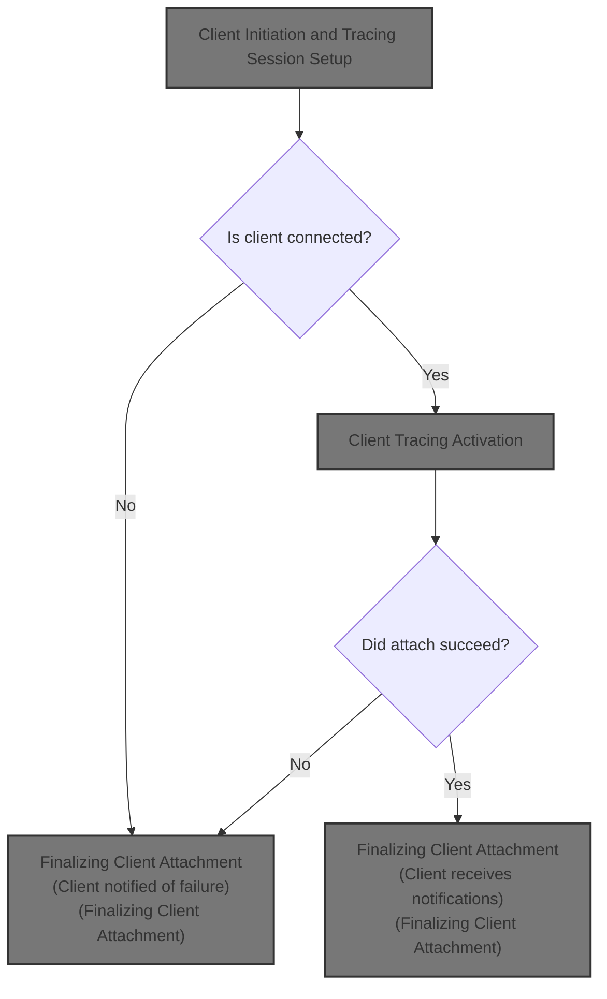

This document describes how a client attaches to an existing tracing session. The process checks the client's connection, attempts to attach, and enables notifications if successful. If attachment fails, the client is notified.



# Client Initiation and Tracing Session Setup

```mermaid
%%{init: {"flowchart": {"defaultRenderer": "elk"}} }%%
flowchart TD
  node1{"Is client connected to tracing service?"}
  click node1 openCode "src/tracing/ipc/consumer/consumer_ipc_client_impl.cc:263:266"
  node1 -->|"No"| node2["Report attach failure to client"]
  click node2 openCode "src/tracing/ipc/consumer/consumer_ipc_client_impl.cc:264:265"
  node1 -->|"Yes"| node3["Attempt to attach to tracing session"]
  click node3 openCode "src/tracing/ipc/consumer/consumer_ipc_client_impl.cc:268:299"
  node3 --> node4{"Did attach succeed?"}
  click node4 openCode "src/tracing/ipc/consumer/consumer_ipc_client_impl.cc:278:298"
  node4 -->|"No"| node2
  node4 -->|"Yes"| node5["Enable trace notifications and report success"]
  click node5 openCode "src/tracing/ipc/consumer/consumer_ipc_client_impl.cc:284:298"
classDef HeadingStyle fill:#777777,stroke:#333,stroke-width:2px;

%% Swimm:
%% %%{init: {"flowchart": {"defaultRenderer": "elk"}} }%%
%% flowchart TD
%%   node1{"Is client connected to tracing service?"}
%%   click node1 openCode "<SwmPath>[src/…/consumer/consumer_ipc_client_impl.cc](src/tracing/ipc/consumer/consumer_ipc_client_impl.cc)</SwmPath>:263:266"
%%   node1 -->|"No"| node2["Report attach failure to client"]
%%   click node2 openCode "<SwmPath>[src/…/consumer/consumer_ipc_client_impl.cc](src/tracing/ipc/consumer/consumer_ipc_client_impl.cc)</SwmPath>:264:265"
%%   node1 -->|"Yes"| node3["Attempt to attach to tracing session"]
%%   click node3 openCode "<SwmPath>[src/…/consumer/consumer_ipc_client_impl.cc](src/tracing/ipc/consumer/consumer_ipc_client_impl.cc)</SwmPath>:268:299"
%%   node3 --> node4{"Did attach succeed?"}
%%   click node4 openCode "<SwmPath>[src/…/consumer/consumer_ipc_client_impl.cc](src/tracing/ipc/consumer/consumer_ipc_client_impl.cc)</SwmPath>:278:298"
%%   node4 -->|"No"| node2
%%   node4 -->|"Yes"| node5["Enable trace notifications and report success"]
%%   click node5 openCode "<SwmPath>[src/…/consumer/consumer_ipc_client_impl.cc](src/tracing/ipc/consumer/consumer_ipc_client_impl.cc)</SwmPath>:284:298"
%% classDef HeadingStyle fill:#777777,stroke:#333,stroke-width:2px;
```



<SwmSnippet path="/src/tracing/ipc/consumer/consumer_ipc_client_impl.cc" line="262">

---

In <SwmToken path="src/tracing/ipc/consumer/consumer_ipc_client_impl.cc" pos="262:4:4" line-data="void ConsumerIPCClientImpl::Attach(const std::string&amp; key) {">`Attach`</SwmToken>, we kick off the flow by checking connection status, then send an <SwmToken path="src/tracing/ipc/consumer/consumer_ipc_client_impl.cc" pos="269:5:5" line-data="    protos::gen::AttachRequest req;">`AttachRequest`</SwmToken> using the provided key. The callback handles both success and failure, and if successful, we immediately follow up with an asynchronous <SwmToken path="src/tracing/ipc/consumer/consumer_ipc_client_impl.cc" pos="286:5:5" line-data="          protos::gen::EnableTracingRequest enable_req;">`EnableTracingRequest`</SwmToken> (with notification-only mode) to make sure the client gets notified when tracing ends. This chaining is critical for session lifecycle management. Weak pointers are used to avoid issues if the client is destroyed mid-callback.

```c++
void ConsumerIPCClientImpl::Attach(const std::string& key) {
  if (!connected_) {
    PERFETTO_DLOG("Cannot Attach(), not connected to tracing service");
    return;
  }

  {
    protos::gen::AttachRequest req;
    req.set_key(key);
    ipc::Deferred<protos::gen::AttachResponse> async_response;
    auto weak_this = weak_ptr_factory_.GetWeakPtr();

    async_response.Bind(
        [weak_this](ipc::AsyncResult<protos::gen::AttachResponse> response) {
          if (!weak_this)
            return;
          if (!response) {
            weak_this->consumer_->OnAttach(/*success=*/false, TraceConfig());
            return;
          }
          const TraceConfig& trace_config = response->trace_config();

          // If attached successfully, also attach to the end-of-trace
          // notification callback, via EnableTracing(attach_notification_only).
          protos::gen::EnableTracingRequest enable_req;
          enable_req.set_attach_notification_only(true);
          ipc::Deferred<protos::gen::EnableTracingResponse> enable_resp;
          enable_resp.Bind(
              [weak_this](
                  ipc::AsyncResult<protos::gen::EnableTracingResponse> resp) {
                if (weak_this)
                  weak_this->OnEnableTracingResponse(std::move(resp));
              });
          weak_this->consumer_port_.EnableTracing(enable_req,
                                                  std::move(enable_resp));

          weak_this->consumer_->OnAttach(/*success=*/true, trace_config);
        });
```

---

</SwmSnippet>

## Client Tracing Activation

```mermaid
%%{init: {"flowchart": {"defaultRenderer": "elk"}} }%%
flowchart TD
  node1["Request to enable tracing"] --> node2{"Is client connected?"}
  click node1 openCode "src/tracing/ipc/consumer/consumer_ipc_client_impl.cc:72:74"
  node2 -->|"No"| node3["Cannot enable tracing: not connected"]
  click node2 openCode "src/tracing/ipc/consumer/consumer_ipc_client_impl.cc:74:77"
  click node3 openCode "src/tracing/ipc/consumer/consumer_ipc_client_impl.cc:75:76"
  node2 -->|"Yes"| node4{"Is platform Windows and FD provided?"}
  click node4 openCode "src/tracing/ipc/consumer/consumer_ipc_client_impl.cc:79:85"
  node4 -->|"Yes"| node5["Cannot enable tracing: FD not supported on Windows"]
  click node5 openCode "src/tracing/ipc/consumer/consumer_ipc_client_impl.cc:81:83"
  node4 -->|"No"| node6["Enable tracing: send config and FD"]
  click node6 openCode "src/tracing/ipc/consumer/consumer_ipc_client_impl.cc:87:100"
classDef HeadingStyle fill:#777777,stroke:#333,stroke-width:2px;

%% Swimm:
%% %%{init: {"flowchart": {"defaultRenderer": "elk"}} }%%
%% flowchart TD
%%   node1["Request to enable tracing"] --> node2{"Is client connected?"}
%%   click node1 openCode "<SwmPath>[src/…/consumer/consumer_ipc_client_impl.cc](src/tracing/ipc/consumer/consumer_ipc_client_impl.cc)</SwmPath>:72:74"
%%   node2 -->|"No"| node3["Cannot enable tracing: not connected"]
%%   click node2 openCode "<SwmPath>[src/…/consumer/consumer_ipc_client_impl.cc](src/tracing/ipc/consumer/consumer_ipc_client_impl.cc)</SwmPath>:74:77"
%%   click node3 openCode "<SwmPath>[src/…/consumer/consumer_ipc_client_impl.cc](src/tracing/ipc/consumer/consumer_ipc_client_impl.cc)</SwmPath>:75:76"
%%   node2 -->|"Yes"| node4{"Is platform Windows and FD provided?"}
%%   click node4 openCode "<SwmPath>[src/…/consumer/consumer_ipc_client_impl.cc](src/tracing/ipc/consumer/consumer_ipc_client_impl.cc)</SwmPath>:79:85"
%%   node4 -->|"Yes"| node5["Cannot enable tracing: FD not supported on Windows"]
%%   click node5 openCode "<SwmPath>[src/…/consumer/consumer_ipc_client_impl.cc](src/tracing/ipc/consumer/consumer_ipc_client_impl.cc)</SwmPath>:81:83"
%%   node4 -->|"No"| node6["Enable tracing: send config and FD"]
%%   click node6 openCode "<SwmPath>[src/…/consumer/consumer_ipc_client_impl.cc](src/tracing/ipc/consumer/consumer_ipc_client_impl.cc)</SwmPath>:87:100"
%% classDef HeadingStyle fill:#777777,stroke:#333,stroke-width:2px;
```



<SwmSnippet path="/src/tracing/ipc/consumer/consumer_ipc_client_impl.cc" line="72">

---

<SwmToken path="src/tracing/ipc/consumer/consumer_ipc_client_impl.cc" pos="72:4:4" line-data="void ConsumerIPCClientImpl::EnableTracing(const TraceConfig&amp; trace_config,">`EnableTracing`</SwmToken> sends the <SwmToken path="src/tracing/ipc/consumer/consumer_ipc_client_impl.cc" pos="72:8:8" line-data="void ConsumerIPCClientImpl::EnableTracing(const TraceConfig&amp; trace_config,">`TraceConfig`</SwmToken> and file descriptor to the tracing service, kicking off the actual tracing session setup. The function checks for platform constraints (like file descriptor support on Windows), binds a callback for the response, and hands off control to the service via <SwmToken path="src/tracing/ipc/consumer/consumer_ipc_client_impl.cc" pos="100:1:3" line-data="  consumer_port_.EnableTracing(req, std::move(async_response), *fd);">`consumer_port_.EnableTracing`</SwmToken>. This is where the service takes over and starts validating and configuring the session.

```c++
void ConsumerIPCClientImpl::EnableTracing(const TraceConfig& trace_config,
                                          base::ScopedFile fd) {
  if (!connected_) {
    PERFETTO_DLOG("Cannot EnableTracing(), not connected to tracing service");
    return;
  }

#if PERFETTO_BUILDFLAG(PERFETTO_OS_WIN)
  if (fd) {
    consumer_->OnTracingDisabled(
        "Passing FDs for write_into_file is not supported on Windows");
    return;
  }
#endif

  protos::gen::EnableTracingRequest req;
  *req.mutable_trace_config() = trace_config;
  ipc::Deferred<protos::gen::EnableTracingResponse> async_response;
  auto weak_this = weak_ptr_factory_.GetWeakPtr();
  async_response.Bind(
      [weak_this](
          ipc::AsyncResult<protos::gen::EnableTracingResponse> response) {
        if (weak_this)
          weak_this->OnEnableTracingResponse(std::move(response));
      });

  // |fd| will be closed when this function returns, but it's fine because the
  // IPC layer dup()'s it when sending the IPC.
  consumer_port_.EnableTracing(req, std::move(async_response), *fd);
}
```

---

</SwmSnippet>

## Tracing Service Configuration and Guardrails

```mermaid
%%{init: {"flowchart": {"defaultRenderer": "elk"}} }%%
flowchart TD
  node1["Request to enable tracing"] --> node2{"Is there an active session for this consumer?"}
  click node1 openCode "src/tracing/service/tracing_service_impl.cc:586:588"
  click node2 openCode "src/tracing/service/tracing_service_impl.cc:608:619"
  node2 -->|"Yes"| node3["Reject: Session already active"]
  click node3 openCode "src/tracing/service/tracing_service_impl.cc:615:618"
  node2 -->|"No"| node4{"Are all configuration and policy checks passed?"}
  click node4 openCode "src/tracing/service/tracing_service_impl.cc:621:932"
  node4 -->|"No"| node5["Reject: Configuration or policy violation"]
  click node5 openCode "src/tracing/service/tracing_service_impl.cc:624:932"
  node4 -->|"Yes"| node6["Allocate buffers"]
  click node6 openCode "src/tracing/service/tracing_service_impl.cc:1078:1113"
  subgraph loop1["For each buffer in configuration"]
    node6 --> node7["Check and allocate buffer"]
    click node7 openCode "src/tracing/service/tracing_service_impl.cc:1082:1113"
    node7 --> node6
  end
  node6 --> node8{"All buffers allocated?"}
  click node8 openCode "src/tracing/service/tracing_service_impl.cc:1115:1134"
  node8 -->|"No"| node9["Reject: Buffer allocation failed"]
  click node9 openCode "src/tracing/service/tracing_service_impl.cc:1127:1134"
  node8 -->|"Yes"| node10["Setup data sources"]
  click node10 openCode "src/tracing/service/tracing_service_impl.cc:1141:1156"
  subgraph loop2["For each data source in configuration"]
    node10 --> node11["Setup data source on producers"]
    click node11 openCode "src/tracing/service/tracing_service_impl.cc:1143:1155"
    node11 --> node10
  end
  node10 --> node12{"Should tracing start now?"}
  click node12 openCode "src/tracing/service/tracing_service_impl.cc:1205:1206"
  node12 -->|"Yes"| node13["Start tracing"]
  click node13 openCode "src/tracing/service/tracing_service_impl.cc:1206:1206"
  node12 -->|"No"| node14["Wait for trigger"]
  click node14 openCode "src/tracing/service/tracing_service_impl.cc:1164:1171"
  node13 --> node15["Tracing enabled"]
  node14 --> node15["Tracing enabled"]
  click node15 openCode "src/tracing/service/tracing_service_impl.cc:1208:1209"
classDef HeadingStyle fill:#777777,stroke:#333,stroke-width:2px;

%% Swimm:
%% %%{init: {"flowchart": {"defaultRenderer": "elk"}} }%%
%% flowchart TD
%%   node1["Request to enable tracing"] --> node2{"Is there an active session for this consumer?"}
%%   click node1 openCode "<SwmPath>[src/…/service/tracing_service_impl.cc](src/tracing/service/tracing_service_impl.cc)</SwmPath>:586:588"
%%   click node2 openCode "<SwmPath>[src/…/service/tracing_service_impl.cc](src/tracing/service/tracing_service_impl.cc)</SwmPath>:608:619"
%%   node2 -->|"Yes"| node3["Reject: Session already active"]
%%   click node3 openCode "<SwmPath>[src/…/service/tracing_service_impl.cc](src/tracing/service/tracing_service_impl.cc)</SwmPath>:615:618"
%%   node2 -->|"No"| node4{"Are all configuration and policy checks passed?"}
%%   click node4 openCode "<SwmPath>[src/…/service/tracing_service_impl.cc](src/tracing/service/tracing_service_impl.cc)</SwmPath>:621:932"
%%   node4 -->|"No"| node5["Reject: Configuration or policy violation"]
%%   click node5 openCode "<SwmPath>[src/…/service/tracing_service_impl.cc](src/tracing/service/tracing_service_impl.cc)</SwmPath>:624:932"
%%   node4 -->|"Yes"| node6["Allocate buffers"]
%%   click node6 openCode "<SwmPath>[src/…/service/tracing_service_impl.cc](src/tracing/service/tracing_service_impl.cc)</SwmPath>:1078:1113"
%%   subgraph loop1["For each buffer in configuration"]
%%     node6 --> node7["Check and allocate buffer"]
%%     click node7 openCode "<SwmPath>[src/…/service/tracing_service_impl.cc](src/tracing/service/tracing_service_impl.cc)</SwmPath>:1082:1113"
%%     node7 --> node6
%%   end
%%   node6 --> node8{"All buffers allocated?"}
%%   click node8 openCode "<SwmPath>[src/…/service/tracing_service_impl.cc](src/tracing/service/tracing_service_impl.cc)</SwmPath>:1115:1134"
%%   node8 -->|"No"| node9["Reject: Buffer allocation failed"]
%%   click node9 openCode "<SwmPath>[src/…/service/tracing_service_impl.cc](src/tracing/service/tracing_service_impl.cc)</SwmPath>:1127:1134"
%%   node8 -->|"Yes"| node10["Setup data sources"]
%%   click node10 openCode "<SwmPath>[src/…/service/tracing_service_impl.cc](src/tracing/service/tracing_service_impl.cc)</SwmPath>:1141:1156"
%%   subgraph loop2["For each data source in configuration"]
%%     node10 --> node11["Setup data source on producers"]
%%     click node11 openCode "<SwmPath>[src/…/service/tracing_service_impl.cc](src/tracing/service/tracing_service_impl.cc)</SwmPath>:1143:1155"
%%     node11 --> node10
%%   end
%%   node10 --> node12{"Should tracing start now?"}
%%   click node12 openCode "<SwmPath>[src/…/service/tracing_service_impl.cc](src/tracing/service/tracing_service_impl.cc)</SwmPath>:1205:1206"
%%   node12 -->|"Yes"| node13["Start tracing"]
%%   click node13 openCode "<SwmPath>[src/…/service/tracing_service_impl.cc](src/tracing/service/tracing_service_impl.cc)</SwmPath>:1206:1206"
%%   node12 -->|"No"| node14["Wait for trigger"]
%%   click node14 openCode "<SwmPath>[src/…/service/tracing_service_impl.cc](src/tracing/service/tracing_service_impl.cc)</SwmPath>:1164:1171"
%%   node13 --> node15["Tracing enabled"]
%%   node14 --> node15["Tracing enabled"]
%%   click node15 openCode "<SwmPath>[src/…/service/tracing_service_impl.cc](src/tracing/service/tracing_service_impl.cc)</SwmPath>:1208:1209"
%% classDef HeadingStyle fill:#777777,stroke:#333,stroke-width:2px;
```



<SwmSnippet path="/src/tracing/service/tracing_service_impl.cc" line="586">

---

In <SwmToken path="src/tracing/service/tracing_service_impl.cc" pos="586:6:6" line-data="base::Status TracingServiceImpl::EnableTracing(ConsumerEndpointImpl* consumer,">`EnableTracing`</SwmToken> (service side), we start by validating the incoming configuration. This includes checking trace duration limits, trigger timeouts, buffer sizes, and making sure certain config combinations (like triggers with duration) aren't allowed. If any check fails, the function aborts early and logs the error. These guardrails are there to prevent resource misuse and unsupported scenarios.

```c++
base::Status TracingServiceImpl::EnableTracing(ConsumerEndpointImpl* consumer,
                                               const TraceConfig& cfg,
                                               base::ScopedFile fd) {
  PERFETTO_DCHECK_THREAD(thread_checker_);

  // If the producer is specifying a UUID, respect that (at least for the first
  // snapshot). Otherwise generate a new UUID.
  base::Uuid uuid(cfg.trace_uuid_lsb(), cfg.trace_uuid_msb());
  if (!uuid)
    uuid = base::Uuidv4();

  PERFETTO_DLOG("Enabling tracing for consumer %p, UUID: %s",
                reinterpret_cast<void*>(consumer),
                uuid.ToPrettyString().c_str());
  MaybeLogUploadEvent(cfg, uuid, PerfettoStatsdAtom::kTracedEnableTracing);
  if (cfg.lockdown_mode() == TraceConfig::LOCKDOWN_SET)
    lockdown_mode_ = true;
  if (cfg.lockdown_mode() == TraceConfig::LOCKDOWN_CLEAR)
    lockdown_mode_ = false;

  // Scope |tracing_session| to this block to prevent accidental use of a null
  // pointer later in this function.
  {
    TracingSession* tracing_session =
        GetTracingSession(consumer->tracing_session_id_);
    if (tracing_session) {
      MaybeLogUploadEvent(
          cfg, uuid,
          PerfettoStatsdAtom::kTracedEnableTracingExistingTraceSession);
      return PERFETTO_SVC_ERR(
          "A Consumer is trying to EnableTracing() but another tracing "
          "session is already active (forgot a call to FreeBuffers() ?)");
    }
  }

  const uint32_t max_duration_ms = cfg.enable_extra_guardrails()
                                       ? kGuardrailsMaxTracingDurationMillis
                                       : kMaxTracingDurationMillis;
  if (cfg.duration_ms() > max_duration_ms) {
    MaybeLogUploadEvent(cfg, uuid,
                        PerfettoStatsdAtom::kTracedEnableTracingTooLongTrace);
    return PERFETTO_SVC_ERR("Requested too long trace (%" PRIu32
                            "ms  > %" PRIu32 " ms)",
                            cfg.duration_ms(), max_duration_ms);
  }

  const bool has_trigger_config =
      GetTriggerMode(cfg) != TraceConfig::TriggerConfig::UNSPECIFIED;
  if (has_trigger_config &&
      (cfg.trigger_config().trigger_timeout_ms() == 0 ||
       cfg.trigger_config().trigger_timeout_ms() > max_duration_ms)) {
    MaybeLogUploadEvent(
        cfg, uuid,
        PerfettoStatsdAtom::kTracedEnableTracingInvalidTriggerTimeout);
    return PERFETTO_SVC_ERR(
        "Traces with START_TRACING triggers must provide a positive "
        "trigger_timeout_ms < 7 days (received %" PRIu32 "ms)",
        cfg.trigger_config().trigger_timeout_ms());
  }

  // This check has been introduced in May 2023 after finding b/274931668.
  if (static_cast<int>(cfg.trigger_config().trigger_mode()) >
      TraceConfig::TriggerConfig::TriggerMode_MAX) {
    MaybeLogUploadEvent(
        cfg, uuid, PerfettoStatsdAtom::kTracedEnableTracingInvalidTriggerMode);
    return PERFETTO_SVC_ERR(
        "The trace config specified an invalid trigger_mode");
  }

  if (cfg.trigger_config().use_clone_snapshot_if_available() &&
      cfg.trigger_config().trigger_mode() !=
          TraceConfig::TriggerConfig::STOP_TRACING) {
    MaybeLogUploadEvent(
        cfg, uuid, PerfettoStatsdAtom::kTracedEnableTracingInvalidTriggerMode);
    return PERFETTO_SVC_ERR(
        "trigger_mode must be STOP_TRACING when "
        "use_clone_snapshot_if_available=true");
  }

  if (has_trigger_config && cfg.duration_ms() != 0) {
    MaybeLogUploadEvent(
        cfg, uuid, PerfettoStatsdAtom::kTracedEnableTracingDurationWithTrigger);
    return PERFETTO_SVC_ERR(
        "duration_ms was set, this must not be set for traces with triggers.");
  }

  for (char c : cfg.bugreport_filename()) {
    if (!((c >= 'a' && c <= 'z') || (c >= 'A' && c <= 'Z') ||
          (c >= '0' && c <= '9') || c == '-' || c == '_' || c == '.')) {
      MaybeLogUploadEvent(
          cfg, uuid, PerfettoStatsdAtom::kTracedEnableTracingInvalidBrFilename);
      return PERFETTO_SVC_ERR(
          "bugreport_filename contains invalid chars. Use [a-zA-Z0-9-_.]+");
    }
  }

  if ((GetTriggerMode(cfg) == TraceConfig::TriggerConfig::STOP_TRACING ||
       GetTriggerMode(cfg) == TraceConfig::TriggerConfig::CLONE_SNAPSHOT) &&
      cfg.write_into_file()) {
    // We don't support this usecase because there are subtle assumptions which
    // break around TracingServiceEvents and windowed sorting (i.e. if we don't
    // drain the events in ReadBuffersIntoFile because we are waiting for
    // STOP_TRACING, we can end up queueing up a lot of TracingServiceEvents and
    // emitting them wildy out of order breaking windowed sorting in trace
    // processor).
    MaybeLogUploadEvent(
        cfg, uuid,
        PerfettoStatsdAtom::kTracedEnableTracingStopTracingWriteIntoFile);
    return PERFETTO_SVC_ERR(
        "Specifying trigger mode STOP_TRACING/CLONE_SNAPSHOT and "
        "write_into_file together is unsupported");
  }

  std::unordered_set<std::string> triggers;
  for (const auto& trigger : cfg.trigger_config().triggers()) {
    if (!triggers.insert(trigger.name()).second) {
      MaybeLogUploadEvent(
          cfg, uuid,
          PerfettoStatsdAtom::kTracedEnableTracingDuplicateTriggerName);
      return PERFETTO_SVC_ERR("Duplicate trigger name: %s",
                              trigger.name().c_str());
    }
  }

  if (cfg.enable_extra_guardrails()) {
    if (cfg.deferred_start()) {
      MaybeLogUploadEvent(
          cfg, uuid,
          PerfettoStatsdAtom::kTracedEnableTracingInvalidDeferredStart);
      return PERFETTO_SVC_ERR(
          "deferred_start=true is not supported in unsupervised traces");
    }
    uint64_t buf_size_sum = 0;
    for (const auto& buf : cfg.buffers()) {
      if (buf.size_kb() % 4 != 0) {
        MaybeLogUploadEvent(
            cfg, uuid,
            PerfettoStatsdAtom::kTracedEnableTracingInvalidBufferSize);
        return PERFETTO_SVC_ERR(
            "buffers.size_kb must be a multiple of 4, got %" PRIu32,
            buf.size_kb());
      }
      buf_size_sum += buf.size_kb();
    }
```

---

</SwmSnippet>

<SwmSnippet path="/src/tracing/service/tracing_service_impl.cc" line="731">

---

After the initial config checks, this part enforces buffer size and count limits. It sums up all buffer sizes, checks alignment, and validates that each data source's target buffer index is within bounds. If anything fails, it aborts and returns an error before moving on to session priority and uniqueness checks.

```c++
    uint32_t max_tracing_buffer_size_kb =
        std::max(kGuardrailsMaxTracingBufferSizeKb,
                 cfg.guardrail_overrides().max_tracing_buffer_size_kb());
    if (buf_size_sum > max_tracing_buffer_size_kb) {
      MaybeLogUploadEvent(
          cfg, uuid,
          PerfettoStatsdAtom::kTracedEnableTracingBufferSizeTooLarge);
      return PERFETTO_SVC_ERR("Requested too large trace buffer (%" PRIu64
                              "kB  > %" PRIu32 " kB)",
                              buf_size_sum, max_tracing_buffer_size_kb);
    }
  }

  if (cfg.buffers_size() > kMaxBuffersPerConsumer) {
    MaybeLogUploadEvent(cfg, uuid,
                        PerfettoStatsdAtom::kTracedEnableTracingTooManyBuffers);
    return PERFETTO_SVC_ERR("Too many buffers configured (%d)",
                            cfg.buffers_size());
  }
  // Check that the config specifies all buffers for its data sources. This
  // is also checked in SetupDataSource, but it is simpler to return a proper
  // error to the consumer from here (and there will be less state to undo).
  for (const TraceConfig::DataSource& cfg_data_source : cfg.data_sources()) {
    size_t num_buffers = static_cast<size_t>(cfg.buffers_size());
    size_t target_buffer = cfg_data_source.config().target_buffer();
    if (target_buffer >= num_buffers) {
      MaybeLogUploadEvent(
          cfg, uuid, PerfettoStatsdAtom::kTracedEnableTracingOobTargetBuffer);
      return PERFETTO_SVC_ERR(
          "Data source \"%s\" specified an out of bounds target_buffer (%zu >= "
          "%zu)",
          cfg_data_source.config().name().c_str(), target_buffer, num_buffers);
    }
  }
```

---

</SwmSnippet>

<SwmSnippet path="/src/tracing/service/tracing_service_impl.cc" line="766">

---

Right after buffer checks, this part scans all active sessions to determine the current highest exclusive priority. This sets up for the next step, where we decide if the incoming session should preempt others based on its priority and UID.

```c++
  uint32_t current_exclusive_prio = 0;
  for (const auto& [_, session] : tracing_sessions_) {
    current_exclusive_prio =
        std::max(current_exclusive_prio, session.config.exclusive_prio());
  }
```

---

</SwmSnippet>

<SwmSnippet path="/src/tracing/service/tracing_service_impl.cc" line="785">

---

If the incoming config requests exclusive mode and passes UID checks (on Android), we abort all existing sessions, freeing buffers and disassociating consumers. This clears the way for the new exclusive session to start cleanly.

```c++
  if (cfg.exclusive_prio() > 0) {  // Exclusive mode.
#if PERFETTO_BUILDFLAG(PERFETTO_OS_ANDROID)
    if (consumer->uid_ != AID_ROOT && consumer->uid_ != AID_SHELL) {
      MaybeLogUploadEvent(
          cfg, uuid,
          PerfettoStatsdAtom::kTracedEnableTracingExclusiveSessionNotAllowed);
      return PERFETTO_SVC_ERR(
          "On android, exclusive mode can only be requested by root or shell.");
    }
#endif
    // Abort all existing sessions.
    const std::string abort_reason =
        "Aborted due to user requested higher-priority (" +
        std::to_string(cfg.exclusive_prio()) + ") exclusive session.";
    for (auto it = tracing_sessions_.begin(); it != tracing_sessions_.end();) {
      auto next_it = it;
      ++next_it;
      const auto session_consumer = it->second.consumer_maybe_null;
      // FreeBuffers() will complete the teardown of the TracingSession and also
      // remove it from tracing_sessions_.
      FreeBuffers(it->first, abort_reason);
      // Disassociate the consumer from the obsolete tracing session.
      if (session_consumer) {
        session_consumer->tracing_session_id_ = 0;
      }
      it = next_it;
    }
```

---

</SwmSnippet>

<SwmSnippet path="/src/tracing/service/tracing_service_impl.cc" line="814">

---

After handling exclusivity, this part checks for unique session names and sets up semaphore state tracking. If a session name is already in use or semaphore constraints are violated, the function aborts and returns an error.

```c++
  if (!cfg.unique_session_name().empty()) {
    const std::string& name = cfg.unique_session_name();
    for (auto& kv : tracing_sessions_) {
      if (kv.second.state == TracingSession::CLONED_READ_ONLY)
        continue;  // Don't consider cloned sessions in uniqueness checks.
      if (kv.second.config.unique_session_name() == name) {
        MaybeLogUploadEvent(
            cfg, uuid,
            PerfettoStatsdAtom::kTracedEnableTracingDuplicateSessionName);
        static const char fmt[] =
            "A trace with this unique session name (%s) already exists";
        // This happens frequently, don't make it an "E"LOG.
        PERFETTO_LOG(fmt, name.c_str());
        return base::ErrStatus(fmt, name.c_str());
      }
    }
```

---

</SwmSnippet>

<SwmSnippet path="/src/tracing/service/tracing_service_impl.cc" line="832">

---

This part checks each semaphore in the new config against current session counts and limits. If any semaphore is over its allowed session count, the function aborts and returns an error before moving on to guardrail timing checks.

```c++
  if (!cfg.session_semaphores().empty()) {
    struct SemaphoreSessionsState {
      uint64_t smallest_max_other_session_count =
          std::numeric_limits<uint64_t>::max();
      uint64_t session_count = 0;
    };
    // For each semaphore, compute the number of active sessions and the
    // MIN(limit).
    std::unordered_map<std::string, SemaphoreSessionsState>
        sem_to_sessions_state;
    for (const auto& id_and_session : tracing_sessions_) {
      const auto& session = id_and_session.second;
      if (session.state == TracingSession::CLONED_READ_ONLY ||
          session.state == TracingSession::DISABLED) {
        // Don't consider cloned or disabled sessions in checks.
        continue;
      }
      for (const auto& sem : session.config.session_semaphores()) {
        auto& sessions_state = sem_to_sessions_state[sem.name()];
        sessions_state.smallest_max_other_session_count =
            std::min(sessions_state.smallest_max_other_session_count,
                     sem.max_other_session_count());
        sessions_state.session_count++;
      }
    }
```

---

</SwmSnippet>

<SwmSnippet path="/src/tracing/service/tracing_service_impl.cc" line="858">

---

After semaphore checks, this part enforces a minimum time between traces with the same session name. It cleans up old timing entries and aborts if a new trace is started too soon after the previous one. Next up are per-UID and global session limits.

```c++
    // Check if any of the semaphores declared by the config clashes with any of
    // the currently active semaphores.
    for (const auto& semaphore : cfg.session_semaphores()) {
      auto it = sem_to_sessions_state.find(semaphore.name());
      if (it == sem_to_sessions_state.end()) {
        continue;
      }
      uint64_t max_other_session_count =
          std::min(semaphore.max_other_session_count(),
                   it->second.smallest_max_other_session_count);
      if (it->second.session_count > max_other_session_count) {
        MaybeLogUploadEvent(
            cfg, uuid,
            PerfettoStatsdAtom::
                kTracedEnableTracingFailedSessionSemaphoreCheck);
        return PERFETTO_SVC_ERR(
            "Semaphore \"%s\" exceeds maximum allowed other session count "
            "(%" PRIu64 " > min(%" PRIu64 ", %" PRIu64 "))",
            semaphore.name().c_str(), it->second.session_count,
            semaphore.max_other_session_count(),
            it->second.smallest_max_other_session_count);
      }
    }
```

---

</SwmSnippet>

<SwmSnippet path="/src/tracing/service/tracing_service_impl.cc" line="883">

---

After timing checks, this part enforces per-UID and global session limits, aborting if they're exceeded. Then it sets up trace filters and priority boost if requested, validating configs and aborting if anything is invalid. Next is file output and buffer allocation.

```c++
  if (cfg.enable_extra_guardrails()) {
    // unique_session_name can be empty
    const std::string& name = cfg.unique_session_name();
    int64_t now_s = clock_->GetBootTimeS().count();

    // Remove any entries where the time limit has passed so this map doesn't
    // grow indefinitely:
    std::map<std::string, int64_t>& sessions = session_to_last_trace_s_;
    for (auto it = sessions.cbegin(); it != sessions.cend();) {
      if (now_s - it->second > kMinSecondsBetweenTracesGuardrail) {
        it = sessions.erase(it);
      } else {
        ++it;
      }
    }
```

---

</SwmSnippet>

<SwmSnippet path="/src/tracing/service/tracing_service_impl.cc" line="899">

---

After setting up filters and priority boost, this part handles file output and compression config, then allocates trace buffers. If any buffer allocation fails, it cleans up and aborts. Next up is error handling for allocation failures and session finalization.

```c++
    int64_t& previous_s = session_to_last_trace_s_[name];
    if (previous_s == 0) {
      previous_s = now_s;
    } else {
      MaybeLogUploadEvent(
          cfg, uuid,
          PerfettoStatsdAtom::kTracedEnableTracingSessionNameTooRecent);
      return PERFETTO_SVC_ERR(
          "A trace with unique session name \"%s\" began less than %" PRId64
          "s ago (%" PRId64 "s)",
          name.c_str(), kMinSecondsBetweenTracesGuardrail, now_s - previous_s);
    }
  }

  const int sessions_for_uid = static_cast<int>(std::count_if(
      tracing_sessions_.begin(), tracing_sessions_.end(),
      [consumer](const decltype(tracing_sessions_)::value_type& s) {
        return s.second.consumer_uid == consumer->uid_;
      }));

  int per_uid_limit = kMaxConcurrentTracingSessionsPerUid;
#if PERFETTO_BUILDFLAG(PERFETTO_OS_ANDROID)
  if (consumer->uid_ == AID_STATSD) {
    per_uid_limit = kMaxConcurrentTracingSessionsForStatsdUid;
  }
#endif
  if (sessions_for_uid >= per_uid_limit) {
    MaybeLogUploadEvent(
        cfg, uuid,
        PerfettoStatsdAtom::kTracedEnableTracingTooManySessionsForUid);
    return PERFETTO_SVC_ERR(
        "Too many concurrent tracing sesions (%d) for uid %d limit is %d",
        sessions_for_uid, static_cast<int>(consumer->uid_), per_uid_limit);
  }

  // TODO(primiano): This is a workaround to prevent that a producer gets stuck
  // in a state where it stalls by design by having more TraceWriterImpl
  // instances than free pages in the buffer. This is really a bug in
  // trace_probes and the way it handles stalls in the shmem buffer.
  if (tracing_sessions_.size() >= kMaxConcurrentTracingSessions) {
    MaybeLogUploadEvent(
        cfg, uuid,
        PerfettoStatsdAtom::kTracedEnableTracingTooManyConcurrentSessions);
    return PERFETTO_SVC_ERR("Too many concurrent tracing sesions (%zu)",
                            tracing_sessions_.size());
  }

  // If the trace config provides a filter bytecode, setup the filter now.
  // If the filter loading fails, abort the tracing session rather than running
  // unfiltered.
  std::unique_ptr<protozero::MessageFilter> trace_filter;
  if (cfg.has_trace_filter()) {
    const auto& filt = cfg.trace_filter();
    trace_filter.reset(new protozero::MessageFilter());

    protozero::StringFilter& string_filter = trace_filter->string_filter();
    for (const auto& rule : filt.string_filter_chain().rules()) {
      auto opt_policy = ConvertPolicy(rule.policy());
      if (!opt_policy.has_value()) {
        MaybeLogUploadEvent(
            cfg, uuid, PerfettoStatsdAtom::kTracedEnableTracingInvalidFilter);
        return PERFETTO_SVC_ERR(
            "Trace filter has invalid string filtering rules, aborting");
      }
      string_filter.AddRule(*opt_policy, rule.regex_pattern(),
                            rule.atrace_payload_starts_with());
    }
```

---

</SwmSnippet>

<SwmSnippet path="/src/tracing/service/tracing_service_impl.cc" line="967">

---

If buffer allocation fails, this part frees all previously allocated buffers, erases the session, and aborts. If allocation succeeds, it updates memory guardrails, assigns the session ID, and sets up data sources on producers without starting them yet. Next is trigger handling and session finalization.

```c++
    const std::string& bytecode_v1 = filt.bytecode();
    const std::string& bytecode_v2 = filt.bytecode_v2();
    const std::string& bytecode =
        bytecode_v2.empty() ? bytecode_v1 : bytecode_v2;
    if (!trace_filter->LoadFilterBytecode(bytecode.data(), bytecode.size())) {
      MaybeLogUploadEvent(
          cfg, uuid, PerfettoStatsdAtom::kTracedEnableTracingInvalidFilter);
      return PERFETTO_SVC_ERR("Trace filter bytecode invalid, aborting");
    }

    // The filter is created using perfetto.protos.Trace as root message
    // (because that makes it possible to play around with the `proto_filter`
    // tool on actual traces). Here in the service, however, we deal with
    // perfetto.protos.TracePacket(s), which are one level down (Trace.packet).
    // The IPC client (or the write_into_filte logic in here) are responsible
    // for pre-pending the packet preamble (See GetProtoPreamble() calls), but
    // the preamble is not there at ReadBuffer time. Hence we change the root of
    // the filtering to start at the Trace.packet level.
    if (!trace_filter->SetFilterRoot({TracePacket::kPacketFieldNumber})) {
      MaybeLogUploadEvent(
          cfg, uuid, PerfettoStatsdAtom::kTracedEnableTracingInvalidFilter);
      return PERFETTO_SVC_ERR("Failed to set filter root.");
    }
  }

  std::optional<base::ScopedSchedBoost> priority_boost;
  if (cfg.has_priority_boost()) {
    auto sched_policy = CreateSchedPolicyFromConfig(cfg.priority_boost());
    if (!sched_policy.ok()) {
      MaybeLogUploadEvent(
          cfg, uuid,
          PerfettoStatsdAtom::kTracedEnablePriorityBoostInvalidConfig);
      return PERFETTO_SVC_ERR("Invalid priority boost config: %s",
                              sched_policy.status().c_message());
    }
    auto boost = base::ScopedSchedBoost::Boost(sched_policy.value());
    if (!boost.ok()) {
      MaybeLogUploadEvent(
          cfg, uuid, PerfettoStatsdAtom::kTracedEnablePriorityBoostOtherError);
      return PERFETTO_SVC_ERR("Failed to boost priority: %s",
                              boost.status().c_message());
    }
    priority_boost = std::move(*boost);
  }

  const TracingSessionID tsid = ++last_tracing_session_id_;
  TracingSession* tracing_session =
      &tracing_sessions_
           .emplace(std::piecewise_construct, std::forward_as_tuple(tsid),
                    std::forward_as_tuple(tsid, consumer, cfg,
                                          weak_runner_.task_runner()))
           .first->second;

  tracing_session->trace_uuid = uuid;

  if (trace_filter)
    tracing_session->trace_filter = std::move(trace_filter);

  if (priority_boost)
    tracing_session->priority_boost = std::move(priority_boost);

  if (cfg.write_into_file()) {
    if (!fd ^ !cfg.output_path().empty()) {
      MaybeLogUploadEvent(
          tracing_session->config, uuid,
          PerfettoStatsdAtom::kTracedEnableTracingInvalidFdOutputFile);
      tracing_sessions_.erase(tsid);
      return PERFETTO_SVC_ERR(
          "When write_into_file==true either a FD needs to be passed or "
          "output_path must be populated (but not both)");
    }
    if (!cfg.output_path().empty()) {
      fd = CreateTraceFile(cfg.output_path(), /*overwrite=*/false);
      if (!fd) {
        MaybeLogUploadEvent(
            tracing_session->config, uuid,
            PerfettoStatsdAtom::kTracedEnableTracingFailedToCreateFile);
        tracing_sessions_.erase(tsid);
        return PERFETTO_SVC_ERR("Failed to create the trace file %s",
                                cfg.output_path().c_str());
      }
    }
    tracing_session->write_into_file = std::move(fd);
    uint32_t write_period_ms = cfg.file_write_period_ms();
    if (write_period_ms == 0)
      write_period_ms = kDefaultWriteIntoFilePeriodMs;
    if (write_period_ms < kMinWriteIntoFilePeriodMs)
      write_period_ms = kMinWriteIntoFilePeriodMs;
    tracing_session->write_period_ms = write_period_ms;
    tracing_session->max_file_size_bytes = cfg.max_file_size_bytes();
    tracing_session->bytes_written_into_file = 0;
  }

  if (cfg.compression_type() == TraceConfig::COMPRESSION_TYPE_DEFLATE) {
    if (init_opts_.compressor_fn) {
      tracing_session->compress_deflate = true;
    } else {
      PERFETTO_LOG(
          "COMPRESSION_TYPE_DEFLATE is not supported in the current build "
          "configuration. Skipping compression");
    }
  }

  // Initialize the log buffers.
  bool did_allocate_all_buffers = true;
  bool invalid_buffer_config = false;

  // Allocate the trace buffers. Also create a map to translate a consumer
  // relative index (TraceConfig.DataSourceConfig.target_buffer) into the
  // corresponding BufferID, which is a global ID namespace for the service and
  // all producers.
  size_t total_buf_size_kb = 0;
  const size_t num_buffers = static_cast<size_t>(cfg.buffers_size());
  tracing_session->buffers_index.reserve(num_buffers);
  for (size_t i = 0; i < num_buffers; i++) {
    const TraceConfig::BufferConfig& buffer_cfg = cfg.buffers()[i];
    BufferID global_id = buffer_ids_.Allocate();
    if (!global_id) {
      did_allocate_all_buffers = false;  // We ran out of IDs.
      break;
    }
    tracing_session->buffers_index.push_back(global_id);
    // TraceBuffer size is limited to 32-bit.
    const uint32_t buf_size_kb = buffer_cfg.size_kb();
    const uint64_t buf_size_bytes = buf_size_kb * static_cast<uint64_t>(1024);
    const size_t buf_size = static_cast<size_t>(buf_size_bytes);
    if (buf_size_bytes == 0 ||
        buf_size_bytes > std::numeric_limits<uint32_t>::max() ||
        buf_size != buf_size_bytes) {
      invalid_buffer_config = true;
      did_allocate_all_buffers = false;
      break;
    }
    total_buf_size_kb += buf_size_kb;
    TraceBuffer::OverwritePolicy policy =
        buffer_cfg.fill_policy() == TraceConfig::BufferConfig::DISCARD
            ? TraceBuffer::kDiscard
            : TraceBuffer::kOverwrite;
    auto it_and_inserted =
        buffers_.emplace(global_id, TraceBufferV1::Create(buf_size, policy));
    PERFETTO_DCHECK(it_and_inserted.second);  // buffers_.count(global_id) == 0.
    std::unique_ptr<TraceBuffer>& trace_buffer = it_and_inserted.first->second;
    if (!trace_buffer) {
      did_allocate_all_buffers = false;
      break;
    }
  }
```

---

</SwmSnippet>

<SwmSnippet path="/src/tracing/service/tracing_service_impl.cc" line="1115">

---

If allocation fails, this part loops through all allocated buffers, frees them, erases the session, and returns an error. If everything's good, the flow continues to memory guardrail updates and data source setup.

```c++
  // This can happen if either:
  // - All the kMaxTraceBufferID slots are taken.
  // - OOM, or, more realistically, we exhausted virtual memory.
  // - The buffer size in the config is invalid.
  // In any case, free all the previously allocated buffers and abort.
  if (!did_allocate_all_buffers) {
    for (BufferID global_id : tracing_session->buffers_index) {
      buffer_ids_.Free(global_id);
      buffers_.erase(global_id);
    }
```

---

</SwmSnippet>

<SwmSnippet path="/src/tracing/service/tracing_service_impl.cc" line="1127">

---

After buffer allocation and cleanup, this part sets up data sources on producers but doesn't start them yet. Trigger modes and deferred start are handled next, which control when tracing actually begins.

```c++
    tracing_sessions_.erase(tsid);
    if (invalid_buffer_config) {
      return PERFETTO_SVC_ERR(
          "Failed to allocate tracing buffers: Invalid buffer sizes");
    }
    return PERFETTO_SVC_ERR(
        "Failed to allocate tracing buffers: OOM or too many buffers");
  }

  UpdateMemoryGuardrail();

  consumer->tracing_session_id_ = tsid;

  // Setup the data sources on the producers without starting them.
  for (const TraceConfig::DataSource& cfg_data_source : cfg.data_sources()) {
    // Scan all the registered data sources with a matching name.
    auto range = data_sources_.equal_range(cfg_data_source.config().name());
    for (auto it = range.first; it != range.second; it++) {
      TraceConfig::ProducerConfig producer_config;
      for (const auto& config : cfg.producers()) {
        if (GetProducer(it->second.producer_id)->name_ ==
            config.producer_name()) {
          producer_config = config;
          break;
        }
      }
      SetupDataSource(cfg_data_source, producer_config, it->second,
                      tracing_session);
    }
  }
```

---

</SwmSnippet>

<SwmSnippet path="/src/tracing/service/tracing_service_impl.cc" line="1158">

---

After data source setup, this part handles trigger modes: schedules timeouts for <SwmToken path="src/tracing/service/tracing_service_impl.cc" pos="1164:7:7" line-data="    case TraceConfig::TriggerConfig::START_TRACING:">`START_TRACING`</SwmToken>, updates duration for <SwmToken path="src/tracing/service/tracing_service_impl.cc" pos="695:8:10" line-data="        &quot;Specifying trigger mode STOP_TRACING/CLONE_SNAPSHOT and &quot;">`STOP_TRACING/CLONE_SNAPSHOT`</SwmToken>, or starts tracing right away if no triggers or deferred start. The session is marked CONFIGURED and a success status is returned.

```c++
  bool has_start_trigger = false;
  switch (GetTriggerMode(cfg)) {
    case TraceConfig::TriggerConfig::UNSPECIFIED:
      // no triggers are specified so this isn't a trace that is using triggers.
      PERFETTO_DCHECK(!has_trigger_config);
      break;
    case TraceConfig::TriggerConfig::START_TRACING:
      // For traces which use START_TRACE triggers we need to ensure that the
      // tracing session will be cleaned up when it times out.
      has_start_trigger = true;
      weak_runner_.PostDelayedTask(
          [tsid, this]() { OnStartTriggersTimeout(tsid); },
          cfg.trigger_config().trigger_timeout_ms());
      break;
    case TraceConfig::TriggerConfig::STOP_TRACING:
    case TraceConfig::TriggerConfig::CLONE_SNAPSHOT:
      // Update the tracing_session's duration_ms to ensure that if no trigger
      // is received the session will end and be cleaned up equal to the
      // timeout.
      //
      // TODO(nuskos): Refactor this so that rather then modifying the config we
      // have a field we look at on the tracing_session.
      tracing_session->config.set_duration_ms(
          cfg.trigger_config().trigger_timeout_ms());
      break;

      // The case of unknown modes (coming from future versions of the service)
      // is handled few lines above (search for TriggerMode_MAX).
  }

  tracing_session->state = TracingSession::CONFIGURED;
  PERFETTO_LOG(
      "Configured tracing session %" PRIu64
      ", #sources:%zu, duration:%u ms%s, #buffers:%d, total "
      "buffer size:%zu KB, total sessions:%zu, uid:%u session name: \"%s\"",
      tsid, cfg.data_sources().size(), tracing_session->config.duration_ms(),
      tracing_session->config.prefer_suspend_clock_for_duration()
          ? " (suspend_clock)"
          : "",
      cfg.buffers_size(), total_buf_size_kb, tracing_sessions_.size(),
      static_cast<unsigned int>(consumer->uid_),
      cfg.unique_session_name().c_str());

  // Start the data sources, unless this is a case of early setup + fast
  // triggering, either through TraceConfig.deferred_start or
  // TraceConfig.trigger_config(). If both are specified which ever one occurs
  // first will initiate the trace.
  if (!cfg.deferred_start() && !has_start_trigger)
    StartTracing(tsid);

  return base::OkStatus();
}
```

---

</SwmSnippet>

## Finalizing Client Attachment

<SwmSnippet path="/src/tracing/ipc/consumer/consumer_ipc_client_impl.cc" line="300">

---

After returning from <SwmToken path="src/tracing/ipc/consumer/consumer_ipc_client_impl.cc" pos="72:4:4" line-data="void ConsumerIPCClientImpl::EnableTracing(const TraceConfig&amp; trace_config,">`EnableTracing`</SwmToken>, Attach wraps up by sending the <SwmToken path="src/tracing/ipc/consumer/consumer_ipc_client_impl.cc" pos="269:5:5" line-data="    protos::gen::AttachRequest req;">`AttachRequest`</SwmToken> to the service. There are no extra checks on the key or internal members here; it just assumes everything is valid and proceeds.

```c++
    consumer_port_.Attach(req, std::move(async_response));
  }
}
```

---

</SwmSnippet>

&nbsp;

*This is an auto-generated document by Swimm 🌊 and has not yet been verified by a human*

<SwmMeta version="3.0.0" repo-id="Z2l0aHViJTNBJTNBY3BsdXNwbHVzLXBlcmZldHRvJTNBJTNBcmljYXJkb2xvcGV6Zw==" repo-name="cplusplus-perfetto"><sup>Powered by [Swimm](https://app.swimm.io/)</sup></SwmMeta>
