This document describes how a new tracing session is automatically started when created. By providing a tracing protocol and configuration, the system sets up and initiates tracing immediately, resulting in an active session ready to collect trace data.

# Session Setup and Kickoff

```mermaid
%%{init: {"flowchart": {"defaultRenderer": "elk"}} }%%
flowchart TD
    node1["Begin tracing session setup"]
    click node1 openCode "ui/src/plugins/dev.perfetto.RecordTraceV2/tracing_protocol/consumer_ipc_tracing_session.ts:38:39"
    node1 --> node2["Connect to tracing protocol"]
    click node2 openCode "ui/src/plugins/dev.perfetto.RecordTraceV2/tracing_protocol/consumer_ipc_tracing_session.ts:39:39"
    node2 --> node3["Bind protocol close handler to session"]
    click node3 openCode "ui/src/plugins/dev.perfetto.RecordTraceV2/tracing_protocol/consumer_ipc_tracing_session.ts:40:40"
    node3 --> node4["Start tracing using provided configuration"]
    click node4 openCode "ui/src/plugins/dev.perfetto.RecordTraceV2/tracing_protocol/consumer_ipc_tracing_session.ts:41:41"
    node4 --> node5["Tracing session is active"]
    click node5 openCode "ui/src/plugins/dev.perfetto.RecordTraceV2/tracing_protocol/consumer_ipc_tracing_session.ts:41:42"

classDef HeadingStyle fill:#777777,stroke:#333,stroke-width:2px;

%% Swimm:
%% %%{init: {"flowchart": {"defaultRenderer": "elk"}} }%%
%% flowchart TD
%%     node1["Begin tracing session setup"]
%%     click node1 openCode "<SwmPath>[ui/…/tracing_protocol/consumer_ipc_tracing_session.ts](ui/src/plugins/dev.perfetto.RecordTraceV2/tracing_protocol/consumer_ipc_tracing_session.ts)</SwmPath>:38:39"
%%     node1 --> node2["Connect to tracing protocol"]
%%     click node2 openCode "<SwmPath>[ui/…/tracing_protocol/consumer_ipc_tracing_session.ts](ui/src/plugins/dev.perfetto.RecordTraceV2/tracing_protocol/consumer_ipc_tracing_session.ts)</SwmPath>:39:39"
%%     node2 --> node3["Bind protocol close handler to session"]
%%     click node3 openCode "<SwmPath>[ui/…/tracing_protocol/consumer_ipc_tracing_session.ts](ui/src/plugins/dev.perfetto.RecordTraceV2/tracing_protocol/consumer_ipc_tracing_session.ts)</SwmPath>:40:40"
%%     node3 --> node4["Start tracing using provided configuration"]
%%     click node4 openCode "<SwmPath>[ui/…/tracing_protocol/consumer_ipc_tracing_session.ts](ui/src/plugins/dev.perfetto.RecordTraceV2/tracing_protocol/consumer_ipc_tracing_session.ts)</SwmPath>:41:41"
%%     node4 --> node5["Tracing session is active"]
%%     click node5 openCode "<SwmPath>[ui/…/tracing_protocol/consumer_ipc_tracing_session.ts](ui/src/plugins/dev.perfetto.RecordTraceV2/tracing_protocol/consumer_ipc_tracing_session.ts)</SwmPath>:41:42"
%% 
%% classDef HeadingStyle fill:#777777,stroke:#333,stroke-width:2px;
```



<SwmSnippet path="/ui/src/plugins/dev.perfetto.RecordTraceV2/tracing_protocol/consumer_ipc_tracing_session.ts" line="38">

---

<SwmToken path="ui/src/plugins/dev.perfetto.RecordTraceV2/tracing_protocol/consumer_ipc_tracing_session.ts" pos="38:1:1" line-data="  constructor(consumerIpc: TracingProtocol, traceConfig: protos.ITraceConfig) {">`constructor`</SwmToken> kicks off the tracing session as soon as the object is created. It wires up the protocol close handler and immediately calls <SwmToken path="ui/src/plugins/dev.perfetto.RecordTraceV2/tracing_protocol/consumer_ipc_tracing_session.ts" pos="41:3:3" line-data="    this.start(traceConfig);">`start`</SwmToken> with the provided trace config, so tracing begins right away. This means the next step is always to enter the start logic, which handles the actual trace initiation.

```typescript
  constructor(consumerIpc: TracingProtocol, traceConfig: protos.ITraceConfig) {
    this.consumerIpc = consumerIpc;
    this.consumerIpc.onClose = this.onProtocolClose.bind(this);
    this.start(traceConfig);
  }
```

---

</SwmSnippet>

# Trace Initiation and RPC Call

<SwmSnippet path="/ui/src/plugins/dev.perfetto.RecordTraceV2/tracing_protocol/consumer_ipc_tracing_session.ts" line="48">

---

<SwmToken path="ui/src/plugins/dev.perfetto.RecordTraceV2/tracing_protocol/consumer_ipc_tracing_session.ts" pos="48:5:5" line-data="  private async start(traceConfig: protos.ITraceConfig): Promise&lt;void&gt; {">`start`</SwmToken> builds the <SwmToken path="ui/src/plugins/dev.perfetto.RecordTraceV2/tracing_protocol/consumer_ipc_tracing_session.ts" pos="49:11:11" line-data="    const req = new protos.EnableTracingRequest({traceConfig});">`EnableTracingRequest`</SwmToken> and logs the trace start. It then makes an async RPC call to actually enable tracing via the protocol, and once that's done, it handles the trace stop logic. The next step is to invoke the protocol's RPC method, which is where the actual communication happens.

```typescript
  private async start(traceConfig: protos.ITraceConfig): Promise<void> {
    const req = new protos.EnableTracingRequest({traceConfig});
    this.log(`Starting trace, durationMs: ${traceConfig.durationMs}`);
    const resp = await this.consumerIpc.invoke('EnableTracing', req);
    this.onTraceStopped(resp.error);
  }
```

---

</SwmSnippet>

# RPC Method Lookup and Protocol Binding

```mermaid
%%{init: {"flowchart": {"defaultRenderer": "elk"}} }%%
flowchart TD
    node1["Select RPC method to invoke"]
    click node1 openCode "ui/src/plugins/dev.perfetto.RecordTraceV2/tracing_protocol/tracing_protocol.ts:98:99"
    node1 --> node2{"Should invocation fail silently?"}
    click node2 openCode "ui/src/plugins/dev.perfetto.RecordTraceV2/tracing_protocol/tracing_protocol.ts:102:102"
    node2 -->|"Yes"| node3["Prepare request and response handler (fail silently)"]
    click node3 openCode "ui/src/plugins/dev.perfetto.RecordTraceV2/tracing_protocol/tracing_protocol.ts:100:110"
    node2 -->|"No"| node4["Prepare request and response handler"]
    click node4 openCode "ui/src/plugins/dev.perfetto.RecordTraceV2/tracing_protocol/tracing_protocol.ts:100:110"
    node3 --> node5{"Is there response data?"}
    node4 --> node5
    click node5 openCode "ui/src/plugins/dev.perfetto.RecordTraceV2/tracing_protocol/tracing_protocol.ts:105:107"
    node5 -->|"Yes"| node6["Decode response data"]
    click node6 openCode "ui/src/plugins/dev.perfetto.RecordTraceV2/tracing_protocol/tracing_protocol.ts:106:106"
    node5 -->|"No"| node7["Create default response"]
    click node7 openCode "ui/src/plugins/dev.perfetto.RecordTraceV2/tracing_protocol/tracing_protocol.ts:107:107"
    node6 --> node8["Start RPC invocation"]
    node7 --> node8
    click node8 openCode "ui/src/plugins/dev.perfetto.RecordTraceV2/tracing_protocol/tracing_protocol.ts:111:111"

classDef HeadingStyle fill:#777777,stroke:#333,stroke-width:2px;

%% Swimm:
%% %%{init: {"flowchart": {"defaultRenderer": "elk"}} }%%
%% flowchart TD
%%     node1["Select RPC method to invoke"]
%%     click node1 openCode "<SwmPath>[ui/…/tracing_protocol/tracing_protocol.ts](ui/src/plugins/dev.perfetto.RecordTraceV2/tracing_protocol/tracing_protocol.ts)</SwmPath>:98:99"
%%     node1 --> node2{"Should invocation fail silently?"}
%%     click node2 openCode "<SwmPath>[ui/…/tracing_protocol/tracing_protocol.ts](ui/src/plugins/dev.perfetto.RecordTraceV2/tracing_protocol/tracing_protocol.ts)</SwmPath>:102:102"
%%     node2 -->|"Yes"| node3["Prepare request and response handler (fail silently)"]
%%     click node3 openCode "<SwmPath>[ui/…/tracing_protocol/tracing_protocol.ts](ui/src/plugins/dev.perfetto.RecordTraceV2/tracing_protocol/tracing_protocol.ts)</SwmPath>:100:110"
%%     node2 -->|"No"| node4["Prepare request and response handler"]
%%     click node4 openCode "<SwmPath>[ui/…/tracing_protocol/tracing_protocol.ts](ui/src/plugins/dev.perfetto.RecordTraceV2/tracing_protocol/tracing_protocol.ts)</SwmPath>:100:110"
%%     node3 --> node5{"Is there response data?"}
%%     node4 --> node5
%%     click node5 openCode "<SwmPath>[ui/…/tracing_protocol/tracing_protocol.ts](ui/src/plugins/dev.perfetto.RecordTraceV2/tracing_protocol/tracing_protocol.ts)</SwmPath>:105:107"
%%     node5 -->|"Yes"| node6["Decode response data"]
%%     click node6 openCode "<SwmPath>[ui/…/tracing_protocol/tracing_protocol.ts](ui/src/plugins/dev.perfetto.RecordTraceV2/tracing_protocol/tracing_protocol.ts)</SwmPath>:106:106"
%%     node5 -->|"No"| node7["Create default response"]
%%     click node7 openCode "<SwmPath>[ui/…/tracing_protocol/tracing_protocol.ts](ui/src/plugins/dev.perfetto.RecordTraceV2/tracing_protocol/tracing_protocol.ts)</SwmPath>:107:107"
%%     node6 --> node8["Start RPC invocation"]
%%     node7 --> node8
%%     click node8 openCode "<SwmPath>[ui/…/tracing_protocol/tracing_protocol.ts](ui/src/plugins/dev.perfetto.RecordTraceV2/tracing_protocol/tracing_protocol.ts)</SwmPath>:111:111"
%% 
%% classDef HeadingStyle fill:#777777,stroke:#333,stroke-width:2px;
```



<SwmSnippet path="/ui/src/plugins/dev.perfetto.RecordTraceV2/tracing_protocol/tracing_protocol.ts" line="94">

---

In <SwmToken path="ui/src/plugins/dev.perfetto.RecordTraceV2/tracing_protocol/tracing_protocol.ts" pos="94:3:3" line-data="  async invoke&lt;T extends RpcMethodName&gt;(">`invoke`</SwmToken>, the function looks up the RPC method metadata, sets up a deferred promise, and prepares a <SwmToken path="ui/src/plugins/dev.perfetto.RecordTraceV2/tracing_protocol/tracing_protocol.ts" pos="100:3:3" line-data="    const pendingInvoke: PendingInvoke = {">`pendingInvoke`</SwmToken> object with an <SwmToken path="ui/src/plugins/dev.perfetto.RecordTraceV2/tracing_protocol/tracing_protocol.ts" pos="103:1:1" line-data="      onResponse: (data: Uint8Array | undefined, hasMore: boolean) =&gt; {">`onResponse`</SwmToken> handler. The <SwmToken path="ui/src/plugins/dev.perfetto.RecordTraceV2/tracing_protocol/tracing_protocol.ts" pos="103:1:1" line-data="      onResponse: (data: Uint8Array | undefined, hasMore: boolean) =&gt; {">`onResponse`</SwmToken> decodes the response and resolves the promise. The next step is to actually send the RPC call, which is handled by <SwmToken path="ui/src/plugins/dev.perfetto.RecordTraceV2/tracing_protocol/tracing_protocol.ts" pos="111:3:3" line-data="    this.beginInvoke(methodName, req, pendingInvoke);">`beginInvoke`</SwmToken>.

```typescript
  async invoke<T extends RpcMethodName>(
    methodName: T,
    req: RequestType<T>,
  ): Promise<ResponseType<T>> {
    const method = RPC_METHODS[methodName];
    const resultPromise = defer<ResponseType<T>>();
    const pendingInvoke: PendingInvoke = {
      methodName,
      failSilently: 'failSilently' in method && method.failSilently,
      onResponse: (data: Uint8Array | undefined, hasMore: boolean) => {
        assertFalse(hasMore); // Should have used invokeStreaming instead.
        const response = exists(data)
          ? method.respType.decode(data)
          : method.respType.create();
        resultPromise.resolve(response as ResponseType<T>);
      },
    };
```

---

</SwmSnippet>

<SwmSnippet path="/ui/src/plugins/dev.perfetto.RecordTraceV2/tracing_protocol/tracing_protocol.ts" line="49">

---

<SwmToken path="ui/src/plugins/dev.perfetto.RecordTraceV2/tracing_protocol/tracing_protocol.ts" pos="49:5:5" line-data="  static async create(stream: ByteStream): Promise&lt;TracingProtocol&gt; {">`create`</SwmToken> sends a <SwmToken path="ui/src/plugins/dev.perfetto.RecordTraceV2/tracing_protocol/tracing_protocol.ts" pos="50:7:7" line-data="    // Send the bindService request. This is a one-off request to connect to the">`bindService`</SwmToken> request over the stream to connect to the consumer service and get the list of available RPC methods. It waits for the reply, parses out the <SwmToken path="ui/src/plugins/dev.perfetto.RecordTraceV2/tracing_protocol/tracing_protocol.ts" pos="76:3:3" line-data="    const serviceId = assertExists(replyMsg.serviceId);">`serviceId`</SwmToken> and method map, and returns a <SwmToken path="ui/src/plugins/dev.perfetto.RecordTraceV2/tracing_protocol/tracing_protocol.ts" pos="49:16:16" line-data="  static async create(stream: ByteStream): Promise&lt;TracingProtocol&gt; {">`TracingProtocol`</SwmToken> instance that's ready for RPC calls.

```typescript
  static async create(stream: ByteStream): Promise<TracingProtocol> {
    // Send the bindService request. This is a one-off request to connect to the
    // consumer port and list the RPC methods available.
    const requestId = 1;
    const txFrame = new protos.IPCFrame({
      requestId,
      msgBindService: new protos.IPCFrame.BindService({
        serviceName: 'ConsumerPort',
      }),
    });
    const repsponsePromise = defer<Uint8Array>();
    const rxFrameBuf = new ProtoRingBuffer('FIXED_SIZE');
    stream.onData = (data) => {
      rxFrameBuf.append(data);
      const rxFrame = rxFrameBuf.readMessage();
      rxFrame && repsponsePromise.resolve(rxFrame);
    };
    TracingProtocol.sendFrame(stream, txFrame);

    // Wait for the IPC reply. There is no state machine or queueing needed at
    // this point (not just yet) because this is 1 req -> 1 reply.
    const frameData = await repsponsePromise;
    const rxFrame = protos.IPCFrame.decode(frameData);
    assertTrue(rxFrame.msg === 'msgBindServiceReply');
    const replyMsg = assertExists(rxFrame.msgBindServiceReply);
    const boundMethods = new Map<string, number>();
    assertTrue(replyMsg.success === true);
    const serviceId = assertExists(replyMsg.serviceId);
    for (const m of assertExists(replyMsg.methods)) {
      boundMethods.set(assertExists(m.name), assertExists(m.id));
    }
    // Now that the details of the RPC methods are known, build and return the
    // TracingProtocol object, so the caller can finally make calls.
    return new TracingProtocol(stream, serviceId, boundMethods);
  }
```

---

</SwmSnippet>

<SwmSnippet path="/ui/src/plugins/dev.perfetto.RecordTraceV2/tracing_protocol/tracing_protocol.ts" line="111">

---

We just came back from <SwmToken path="ui/src/plugins/dev.perfetto.RecordTraceV2/tracing_protocol/tracing_protocol.ts" pos="49:5:5" line-data="  static async create(stream: ByteStream): Promise&lt;TracingProtocol&gt; {">`create`</SwmToken> in <SwmPath>[ui/…/tracing_protocol/tracing_protocol.ts](ui/src/plugins/dev.perfetto.RecordTraceV2/tracing_protocol/tracing_protocol.ts)</SwmPath>, so now <SwmToken path="ui/src/plugins/dev.perfetto.RecordTraceV2/tracing_protocol/consumer_ipc_tracing_session.ts" pos="51:13:13" line-data="    const resp = await this.consumerIpc.invoke(&#39;EnableTracing&#39;, req);">`invoke`</SwmToken> hands off the actual RPC call to <SwmToken path="ui/src/plugins/dev.perfetto.RecordTraceV2/tracing_protocol/tracing_protocol.ts" pos="111:3:3" line-data="    this.beginInvoke(methodName, req, pendingInvoke);">`beginInvoke`</SwmToken>, which sends the request and wires up the response handler. The function then returns the promise that will resolve when the response arrives.

```typescript
    this.beginInvoke(methodName, req, pendingInvoke);
    return resultPromise;
  }
```

---

</SwmSnippet>

&nbsp;

*This is an auto-generated document by Swimm 🌊 and has not yet been verified by a human*

<SwmMeta version="3.0.0" repo-id="Z2l0aHViJTNBJTNBY3BsdXNwbHVzLXBlcmZldHRvJTNBJTNBcmljYXJkb2xvcGV6Zw==" repo-name="cplusplus-perfetto"><sup>Powered by [Swimm](https://app.swimm.io/)</sup></SwmMeta>
