This document describes how metrics are bundled, validated, and computed from trace data. Metrics are grouped and checked for consistency, then processed to produce structured results for analysis. The flow receives metric definitions and a trace processor as input, and outputs validated metric results, ensuring correct mapping and uniqueness where required.

# Bundling and Validating Metrics

<SwmSnippet path="/src/trace_processor/trace_summary/summary.cc" line="661">

---

We group metrics by bundle ID so we can process related metrics together and check their specs for consistency.

```c++
base::Status CreateQueriesAndComputeMetrics(TraceProcessor* processor,
                                            const std::vector<Metric>& metrics,
                                            TraceSummary* summary) {
  base::FlatHashMap<std::string, std::vector<const Metric*>> metrics_by_bundle;
  for (const Metric& m : metrics) {
    TraceMetricV2Spec::Decoder spec_decoder(m.spec);
    std::string bundle_id = spec_decoder.bundle_id().ToStdString();
    if (bundle_id.empty()) {
      bundle_id = m.id;
    }
    metrics_by_bundle[bundle_id].push_back(&m);
  }
```

---

</SwmSnippet>

<SwmSnippet path="/src/trace_processor/trace_summary/summary.cc" line="673">

---

We check each bundle for spec consistency and add the bundle/specs to the summary.

```c++
  for (auto it = metrics_by_bundle.GetIterator(); it; ++it) {
    const auto& value = it.value();
    RETURN_IF_ERROR(VerifyBundleHasConsistentSpecs(it.key(), value));

    const std::string& bundle_id = it.key();
    auto* bundle = summary->add_metric_bundles();
    bundle->set_bundle_id(bundle_id);
    for (const Metric* metric : value) {
      bundle->add_specs()->AppendRawProtoBytes(metric->spec.data,
                                               metric->spec.size);
    }
```

---

</SwmSnippet>

<SwmSnippet path="/src/trace_processor/trace_summary/summary.cc" line="685">

---

We extract interned dimension key columns from the first metric's spec for later use.

```c++
    const Metric* first = value.front();
    TraceMetricV2Spec::Decoder first_spec(first->spec);

    std::unordered_set<std::string> interned_dim_key_cols;
    for (auto ms_it = first_spec.interned_dimension_specs(); ms_it; ++ms_it) {
      InternedDimensionSpec::Decoder ms_decoder(*ms_it);
      interned_dim_key_cols.insert(InternedDimensionSpec::ColumnSpec::Decoder(
                                       ms_decoder.key_column_spec())
                                       .name()
                                       .ToStdString());
    }
```

---

</SwmSnippet>

<SwmSnippet path="/src/trace_processor/trace_summary/summary.cc" line="696">

---

Now we execute the SQL query for the bundle using the <SwmToken path="src/trace_processor/trace_summary/summary.cc" pos="661:6:6" line-data="base::Status CreateQueriesAndComputeMetrics(TraceProcessor* processor,">`TraceProcessor`</SwmToken>. If the query fails, we bail out with an error. This is where we start pulling actual data for the metrics.

```c++
    std::unordered_set<InternedDimensionKey, InternedDimensionKey::Hasher>
        interned_dim_keys_in_metric_bundle;

    auto query_it = processor->ExecuteQuery(first->query);
    if (!query_it.Status().ok()) {
      return base::ErrStatus(
          "Error while executing query for metric bundle '%s': %s",
          bundle_id.c_str(), query_it.Status().c_message());
    }

```

---

</SwmSnippet>

## Tracing and Running SQL Queries

<SwmSnippet path="/src/trace_processor/trace_processor_impl.cc" line="672">

---

In <SwmToken path="src/trace_processor/trace_processor_impl.cc" pos="672:4:4" line-data="Iterator TraceProcessorImpl::ExecuteQuery(const std::string&amp; sql) {">`ExecuteQuery`</SwmToken>, we trace the query execution, record stats, and clean up the SQL string by replacing non-breaking spaces. Then we call into the SQL engine to actually run the query and get results.

```c++
Iterator TraceProcessorImpl::ExecuteQuery(const std::string& sql) {
  PERFETTO_TP_TRACE(metatrace::Category::API_TIMELINE, "EXECUTE_QUERY",
                    [&](metatrace::Record* r) { r->AddArg("query", sql); });

  uint32_t sql_stats_row =
      context()->storage->mutable_sql_stats()->RecordQueryBegin(
          sql, base::GetWallTimeNs().count());
  std::string non_breaking_sql = base::ReplaceAll(sql, "\u00A0", " ");
  base::StatusOr<PerfettoSqlEngine::ExecutionResult> result =
      engine_->ExecuteUntilLastStatement(
          SqlSource::FromExecuteQuery(std::move(non_breaking_sql)));
```

---

</SwmSnippet>

### SQL Engine Execution

See <SwmLink doc-title="Sequential SQL Statement Execution">[Sequential SQL Statement Execution](/.swm/sequential-sql-statement-execution.yt54zrj6.sw.md)</SwmLink>

### Returning Query Results as Iterator

<SwmSnippet path="/src/trace_processor/trace_processor_impl.cc" line="683">

---

Back in <SwmToken path="src/trace_processor/trace_summary/summary.cc" pos="699:9:9" line-data="    auto query_it = processor-&gt;ExecuteQuery(first-&gt;query);">`ExecuteQuery`</SwmToken>, after getting the result from the SQL engine, we wrap it in an <SwmToken path="src/trace_processor/trace_processor_impl.cc" pos="683:5:5" line-data="  std::unique_ptr&lt;IteratorImpl&gt; impl(">`IteratorImpl`</SwmToken> and return it as an Iterator. This gives the caller a clean way to walk through the query results.

```c++
  std::unique_ptr<IteratorImpl> impl(
      new IteratorImpl(this, std::move(result), sql_stats_row));
  return Iterator(std::move(impl));
}
```

---

</SwmSnippet>

## Validating and Mapping Query Output

```mermaid
%%{init: {"flowchart": {"defaultRenderer": "elk"}} }%%
flowchart TD
  node1["Start: Generate and decode query"]
  click node1 openCode "src/trace_processor/trace_summary/summary.cc:706:713"
  node1 --> node2{"Are expected columns present?"}
  click node2 openCode "src/trace_processor/trace_summary/summary.cc:714:739"
  node2 -->|"Yes"| node3["Find metric value columns"]
  click node3 openCode "src/trace_processor/trace_summary/summary.cc:740:760"
  node2 -->|"No"| node4["Return error: Missing columns"]
  click node4 openCode "src/trace_processor/trace_summary/summary.cc:725:737"
  subgraph loop1["For each metric"]
    node3 --> node5{"Is metric value column found?"}
    click node5 openCode "src/trace_processor/trace_summary/summary.cc:744:758"
    node5 -->|"Yes"| node6["Add column index"]
    click node6 openCode "src/trace_processor/trace_summary/summary.cc:759:760"
    node5 -->|"No"| node7["Return error: Metric column missing"]
    click node7 openCode "src/trace_processor/trace_summary/summary.cc:755:758"
  end
  node6 --> node8["Process query result rows"]
  click node8 openCode "src/trace_processor/trace_summary/summary.cc:764:821"
  subgraph loop2["For each row in query result"]
    node8 --> node9{"Are all metric values null?"}
    click node9 openCode "src/trace_processor/trace_summary/summary.cc:765:772"
    node9 -->|"Yes"| node8
    node9 -->|"No"| node10["Write row"]
    click node10 openCode "src/trace_processor/trace_summary/summary.cc:777:820"
    subgraph loop4["For each dimension"]
      node10 --> node11["Write dimension and handle uniqueness"]
      click node11 openCode "src/trace_processor/trace_summary/summary.cc:779:787"
      node11 --> node12{"Is uniqueness required?"}
      click node12 openCode "src/trace_processor/trace_summary/summary.cc:789:794"
      node12 -->|"Yes, duplicate"| node13["Return error: Duplicate dimensions"]
      click node13 openCode "src/trace_processor/trace_summary/summary.cc:790:794"
      node12 -->|"No or unique"| node14["Continue"]
      click node14 openCode "src/trace_processor/trace_summary/summary.cc:795"
    end
    subgraph loop3["For each metric value in row"]
      node14 --> node15{"Is value type supported?"}
      click node15 openCode "src/trace_processor/trace_summary/summary.cc:803:819"
      node15 -->|"Yes"| node16["Write metric value"]
      click node16 openCode "src/trace_processor/trace_summary/summary.cc:805:810"
      node15 -->|"No"| node17["Return error: Unsupported value type"]
      click node17 openCode "src/trace_processor/trace_summary/summary.cc:815:819"
    end
  end
  node16 --> node18{"Are interned dimension queries present?"}
  click node18 openCode "src/trace_processor/trace_summary/summary.cc:823:827"
  node18 -->|"Yes"| node19["Write interned dimension bundles"]
  click node19 openCode "src/trace_processor/trace_summary/summary.cc:824:827"
  node18 -->|"No"| node20["Return success"]
  click node20 openCode "src/trace_processor/trace_summary/summary.cc:829:830"

classDef HeadingStyle fill:#777777,stroke:#333,stroke-width:2px;

%% Swimm:
%% %%{init: {"flowchart": {"defaultRenderer": "elk"}} }%%
%% flowchart TD
%%   node1["Start: Generate and decode query"]
%%   click node1 openCode "<SwmPath>[src/…/trace_summary/summary.cc](src/trace_processor/trace_summary/summary.cc)</SwmPath>:706:713"
%%   node1 --> node2{"Are expected columns present?"}
%%   click node2 openCode "<SwmPath>[src/…/trace_summary/summary.cc](src/trace_processor/trace_summary/summary.cc)</SwmPath>:714:739"
%%   node2 -->|"Yes"| node3["Find metric value columns"]
%%   click node3 openCode "<SwmPath>[src/…/trace_summary/summary.cc](src/trace_processor/trace_summary/summary.cc)</SwmPath>:740:760"
%%   node2 -->|"No"| node4["Return error: Missing columns"]
%%   click node4 openCode "<SwmPath>[src/…/trace_summary/summary.cc](src/trace_processor/trace_summary/summary.cc)</SwmPath>:725:737"
%%   subgraph loop1["For each metric"]
%%     node3 --> node5{"Is metric value column found?"}
%%     click node5 openCode "<SwmPath>[src/…/trace_summary/summary.cc](src/trace_processor/trace_summary/summary.cc)</SwmPath>:744:758"
%%     node5 -->|"Yes"| node6["Add column index"]
%%     click node6 openCode "<SwmPath>[src/…/trace_summary/summary.cc](src/trace_processor/trace_summary/summary.cc)</SwmPath>:759:760"
%%     node5 -->|"No"| node7["Return error: Metric column missing"]
%%     click node7 openCode "<SwmPath>[src/…/trace_summary/summary.cc](src/trace_processor/trace_summary/summary.cc)</SwmPath>:755:758"
%%   end
%%   node6 --> node8["Process query result rows"]
%%   click node8 openCode "<SwmPath>[src/…/trace_summary/summary.cc](src/trace_processor/trace_summary/summary.cc)</SwmPath>:764:821"
%%   subgraph loop2["For each row in query result"]
%%     node8 --> node9{"Are all metric values null?"}
%%     click node9 openCode "<SwmPath>[src/…/trace_summary/summary.cc](src/trace_processor/trace_summary/summary.cc)</SwmPath>:765:772"
%%     node9 -->|"Yes"| node8
%%     node9 -->|"No"| node10["Write row"]
%%     click node10 openCode "<SwmPath>[src/…/trace_summary/summary.cc](src/trace_processor/trace_summary/summary.cc)</SwmPath>:777:820"
%%     subgraph loop4["For each dimension"]
%%       node10 --> node11["Write dimension and handle uniqueness"]
%%       click node11 openCode "<SwmPath>[src/…/trace_summary/summary.cc](src/trace_processor/trace_summary/summary.cc)</SwmPath>:779:787"
%%       node11 --> node12{"Is uniqueness required?"}
%%       click node12 openCode "<SwmPath>[src/…/trace_summary/summary.cc](src/trace_processor/trace_summary/summary.cc)</SwmPath>:789:794"
%%       node12 -->|"Yes, duplicate"| node13["Return error: Duplicate dimensions"]
%%       click node13 openCode "<SwmPath>[src/…/trace_summary/summary.cc](src/trace_processor/trace_summary/summary.cc)</SwmPath>:790:794"
%%       node12 -->|"No or unique"| node14["Continue"]
%%       click node14 openCode "<SwmPath>[src/…/trace_summary/summary.cc](src/trace_processor/trace_summary/summary.cc)</SwmPath>:795"
%%     end
%%     subgraph loop3["For each metric value in row"]
%%       node14 --> node15{"Is value type supported?"}
%%       click node15 openCode "<SwmPath>[src/…/trace_summary/summary.cc](src/trace_processor/trace_summary/summary.cc)</SwmPath>:803:819"
%%       node15 -->|"Yes"| node16["Write metric value"]
%%       click node16 openCode "<SwmPath>[src/…/trace_summary/summary.cc](src/trace_processor/trace_summary/summary.cc)</SwmPath>:805:810"
%%       node15 -->|"No"| node17["Return error: Unsupported value type"]
%%       click node17 openCode "<SwmPath>[src/…/trace_summary/summary.cc](src/trace_processor/trace_summary/summary.cc)</SwmPath>:815:819"
%%     end
%%   end
%%   node16 --> node18{"Are interned dimension queries present?"}
%%   click node18 openCode "<SwmPath>[src/…/trace_summary/summary.cc](src/trace_processor/trace_summary/summary.cc)</SwmPath>:823:827"
%%   node18 -->|"Yes"| node19["Write interned dimension bundles"]
%%   click node19 openCode "<SwmPath>[src/…/trace_summary/summary.cc](src/trace_processor/trace_summary/summary.cc)</SwmPath>:824:827"
%%   node18 -->|"No"| node20["Return success"]
%%   click node20 openCode "<SwmPath>[src/…/trace_summary/summary.cc](src/trace_processor/trace_summary/summary.cc)</SwmPath>:829:830"
%% 
%% classDef HeadingStyle fill:#777777,stroke:#333,stroke-width:2px;
```



<SwmSnippet path="/src/trace_processor/trace_summary/summary.cc" line="706">

---

Back in <SwmToken path="src/trace_processor/trace_summary/summary.cc" pos="661:4:4" line-data="base::Status CreateQueriesAndComputeMetrics(TraceProcessor* processor,">`CreateQueriesAndComputeMetrics`</SwmToken>, after getting the query results, we check that the columns match what's expected (if there are no schema-changing transformations). This catches mismatches early.

```c++
    PerfettoSqlStructuredQuery::Decoder query(first_spec.query());
    // The sql.column_names field documents what columns the SQL query itself
    // returns (before structured query transformations). We can only validate
    // this when there are no transformations that modify the output schema:
    // - group_by transforms columns into group keys + aggregates
    // - select_columns transforms columns via selection/aliasing/expressions
    // Other operations (filters, order_by, limit, offset) preserve columns.
    if (query.has_sql() && !query.has_group_by() &&
        !query.has_select_columns()) {
      PerfettoSqlStructuredQuery::Sql::Decoder sql_query(query.sql());
      if (sql_query.has_column_names()) {
        std::set<std::string> actual_column_names;
        for (uint32_t i = 0; i < query_it.ColumnCount(); ++i) {
          actual_column_names.insert(query_it.GetColumnName(i));
        }
```

---

</SwmSnippet>

<SwmSnippet path="/src/trace_processor/trace_summary/summary.cc" line="721">

---

Here we build sets of actual and expected column names so we can compare them and make sure nothing's missing.

```c++
        std::set<std::string> expected_column_names;
        for (auto col_it = sql_query.column_names(); col_it; ++col_it) {
          expected_column_names.insert(col_it->as_std_string());
        }
```

---

</SwmSnippet>

<SwmSnippet path="/src/trace_processor/trace_summary/summary.cc" line="725">

---

After validating columns, we extract dimension info and figure out which columns in the query result correspond to each metric's value. If a value column is missing, we bail out.

```c++
        if (!std::includes(
                actual_column_names.begin(), actual_column_names.end(),
                expected_column_names.begin(), expected_column_names.end())) {
          std::vector<std::string> expected_vec(expected_column_names.begin(),
                                                expected_column_names.end());
          std::vector<std::string> actual_vec(actual_column_names.begin(),
                                              actual_column_names.end());
          return base::ErrStatus(
              "Not all columns expected in metrics bundle '%s' were found. "
              "Expected: [%s], Actual: [%s]",
              bundle_id.c_str(), base::Join(expected_vec, ", ").c_str(),
              base::Join(actual_vec, ", ").c_str());
        }
      }
    }
    ASSIGN_OR_RETURN(std::vector<DimensionWithIndex> dimensions_with_index,
                     GetDimensionsWithIndex(first_spec, query_it));

    std::vector<uint32_t> value_indices;
    for (const auto* metric : value) {
      TraceMetricV2Spec::Decoder spec(metric->spec);
      std::string value_column_name = spec.value().ToStdString();
      std::optional<uint32_t> value_index;
      for (uint32_t i = 0; i < query_it.ColumnCount(); ++i) {
        if (query_it.GetColumnName(i) == value_column_name) {
          value_index = i;
          break;
        }
      }
      if (!value_index) {
        return base::ErrStatus(
            "Column '%s' not found in the query result for metric '%s'",
            value_column_name.c_str(), spec.id().ToStdString().c_str());
      }
      value_indices.push_back(*value_index);
    }
```

---

</SwmSnippet>

<SwmSnippet path="/src/trace_processor/trace_summary/summary.cc" line="761">

---

Here we walk through each query result row, skip rows with all nulls, write dimension and value data, and check for duplicate dimensions if required. Duplicates cause an error.

```c++
    bool is_unique_dimensions =
        first_spec.dimension_uniqueness() == TraceMetricV2Spec::UNIQUE;
    std::unordered_set<uint64_t> seen_dimensions;
    while (query_it.Next()) {
      bool all_null = true;
      for (size_t i = 0; i < value.size(); ++i) {
        const auto& metric_value_column = query_it.Get(value_indices[i]);
        if (!metric_value_column.is_null()) {
          all_null = false;
          break;
        }
      }
      // If all values are null, we skip writing the row.
      if (all_null) {
        continue;
      }
      auto* row = bundle->add_row();
      base::MurmurHashCombiner hasher;
      for (const auto& dim : dimensions_with_index) {
        RETURN_IF_ERROR(WriteDimension(dim, bundle_id, query_it,
                                       row->add_dimension(), &hasher));
        if (interned_dim_key_cols.count(dim.name)) {
          const auto& key_val = query_it.Get(dim.index);
          ASSIGN_OR_RETURN(uint64_t value_hash, HashOf(key_val));
          interned_dim_keys_in_metric_bundle.insert({dim.name, value_hash});
        }
      }
      uint64_t hash = hasher.digest();
      if (is_unique_dimensions && !seen_dimensions.insert(hash).second) {
        return base::ErrStatus(
            "Duplicate dimensions found for metric bundle '%s': this is not "
            "allowed",
            bundle_id.c_str());
      }

      for (size_t i = 0; i < value.size(); ++i) {
        const auto& metric_value_column = query_it.Get(value_indices[i]);
        auto* row_value = row->add_values();
        if (metric_value_column.is_null()) {
          row_value->set_null_value();
          continue;
        }
        switch (metric_value_column.type) {
          case SqlValue::kLong:
            row_value->set_double_value(
                static_cast<double>(metric_value_column.long_value));
            break;
          case SqlValue::kDouble:
            row_value->set_double_value(metric_value_column.double_value);
            break;
          case SqlValue::kNull:
            PERFETTO_FATAL("Null value should have been skipped");
          case SqlValue::kString:
          case SqlValue::kBytes:
            return base::ErrStatus(
                "Received string/bytes for value column in metric '%s': this "
                "is not supported",
                it.value()[i]->id.c_str());
        }
      }
    }
```

---

</SwmSnippet>

<SwmSnippet path="/src/trace_processor/trace_summary/summary.cc" line="822">

---

Finally, we check for errors, write interned dimension bundles if needed, and return success if everything went fine.

```c++
    RETURN_IF_ERROR(query_it.Status());
    if (!first->interned_dimension_queries.empty()) {
      RETURN_IF_ERROR(WriteInternedDimensionBundles(
          processor, first_spec, first->interned_dimension_queries,
          interned_dim_keys_in_metric_bundle, bundle));
    }
  }
  return base::OkStatus();
}
```

---

</SwmSnippet>

&nbsp;

*This is an auto-generated document by Swimm 🌊 and has not yet been verified by a human*

<SwmMeta version="3.0.0" repo-id="Z2l0aHViJTNBJTNBY3BsdXNwbHVzLXBlcmZldHRvJTNBJTNBcmljYXJkb2xvcGV6Zw==" repo-name="cplusplus-perfetto"><sup>Powered by [Swimm](https://app.swimm.io/)</sup></SwmMeta>
