This document describes how the system distinguishes between window keywords and generic identifiers in SQL input. The process involves extracting and classifying tokens to support accurate SQL parsing.

# Analyzing Window Keyword Tokens

```mermaid
%%{init: {"flowchart": {"defaultRenderer": "elk"}} }%%
flowchart TD
    node1["Analyze SQL token sequence for 'WINDOW' keyword"] --> node2{"Is first token an identifier?"}
    click node1 openCode "src/trace_processor/perfetto_sql/tokenizer/tokenize_internal.c:721:722"
    node2 -->|"Yes"| node3{"Is second token 'AS'?"}
    click node2 openCode "src/trace_processor/perfetto_sql/tokenizer/tokenize_internal.c:723:724"
    node2 -->|"No"| node4["Return 'Identifier' token (not a window keyword)"]
    click node4 openCode "src/trace_processor/perfetto_sql/tokenizer/tokenize_internal.c:725:728"
    node3 -->|"Yes"| node5["Return 'Window' token (keyword sequence matched)"]
    click node3 openCode "src/trace_processor/perfetto_sql/tokenizer/tokenize_internal.c:726:727"
    click node5 openCode "src/trace_processor/perfetto_sql/tokenizer/tokenize_internal.c:729:730"
    node3 -->|"No"| node4
classDef HeadingStyle fill:#777777,stroke:#333,stroke-width:2px;

%% Swimm:
%% %%{init: {"flowchart": {"defaultRenderer": "elk"}} }%%
%% flowchart TD
%%     node1["Analyze SQL token sequence for 'WINDOW' keyword"] --> node2{"Is first token an identifier?"}
%%     click node1 openCode "<SwmPath>[src/…/tokenizer/tokenize_internal.c](src/trace_processor/perfetto_sql/tokenizer/tokenize_internal.c)</SwmPath>:721:722"
%%     node2 -->|"Yes"| node3{"Is second token 'AS'?"}
%%     click node2 openCode "<SwmPath>[src/…/tokenizer/tokenize_internal.c](src/trace_processor/perfetto_sql/tokenizer/tokenize_internal.c)</SwmPath>:723:724"
%%     node2 -->|"No"| node4["Return 'Identifier' token (not a window keyword)"]
%%     click node4 openCode "<SwmPath>[src/…/tokenizer/tokenize_internal.c](src/trace_processor/perfetto_sql/tokenizer/tokenize_internal.c)</SwmPath>:725:728"
%%     node3 -->|"Yes"| node5["Return 'Window' token (keyword sequence matched)"]
%%     click node3 openCode "<SwmPath>[src/…/tokenizer/tokenize_internal.c](src/trace_processor/perfetto_sql/tokenizer/tokenize_internal.c)</SwmPath>:726:727"
%%     click node5 openCode "<SwmPath>[src/…/tokenizer/tokenize_internal.c](src/trace_processor/perfetto_sql/tokenizer/tokenize_internal.c)</SwmPath>:729:730"
%%     node3 -->|"No"| node4
%% classDef HeadingStyle fill:#777777,stroke:#333,stroke-width:2px;
```



<SwmSnippet path="/src/trace_processor/perfetto_sql/tokenizer/tokenize_internal.c" line="721">

---

<SwmToken path="src/trace_processor/perfetto_sql/tokenizer/tokenize_internal.c" pos="721:2:2" line-data="int sqliteTokenizeInternalAnalyzeWindowKeyword(const unsigned char* z) {">`sqliteTokenizeInternalAnalyzeWindowKeyword`</SwmToken> starts the flow by checking if the input matches the pattern for a window keyword. It calls <SwmToken path="src/trace_processor/perfetto_sql/tokenizer/tokenize_internal.c" pos="723:5:5" line-data="  t = getToken(&amp;z);">`getToken`</SwmToken> to extract the first token and checks if it's an identifier, then calls <SwmToken path="src/trace_processor/perfetto_sql/tokenizer/tokenize_internal.c" pos="723:5:5" line-data="  t = getToken(&amp;z);">`getToken`</SwmToken> again to check for the 'AS' keyword. If both checks pass, it returns <SwmToken path="src/trace_processor/perfetto_sql/tokenizer/tokenize_internal.c" pos="729:3:3" line-data="  return TK_WINDOW;">`TK_WINDOW`</SwmToken>; otherwise, it returns <SwmToken path="src/trace_processor/perfetto_sql/tokenizer/tokenize_internal.c" pos="724:8:8" line-data="  if (t != TK_ID)">`TK_ID`</SwmToken>. This sets up the token type for further parsing.

```c
int sqliteTokenizeInternalAnalyzeWindowKeyword(const unsigned char* z) {
  int t;
  t = getToken(&z);
  if (t != TK_ID)
    return TK_ID;
  t = getToken(&z);
  if (t != TK_AS)
    return TK_ID;
  return TK_WINDOW;
}
```

---

</SwmSnippet>

# Extracting and Normalizing Tokens

<SwmSnippet path="/src/trace_processor/perfetto_sql/tokenizer/tokenize_internal.c" line="677">

---

In <SwmToken path="src/trace_processor/perfetto_sql/tokenizer/tokenize_internal.c" pos="677:4:4" line-data="static int getToken(const unsigned char** pz) {">`getToken`</SwmToken>, we call <SwmToken path="src/trace_processor/perfetto_sql/tokenizer/tokenize_internal.c" pos="681:5:5" line-data="    z += sqlite3GetToken(z, &amp;t);">`sqlite3GetToken`</SwmToken> and skip any whitespace or comments, so only relevant tokens are returned.

```c
static int getToken(const unsigned char** pz) {
  const unsigned char* z = *pz;
  int t; /* Token type to return */
  do {
    z += sqlite3GetToken(z, &t);
  } while (t == TK_SPACE || t == TK_COMMENT);
```

---

</SwmSnippet>

## Classifying and Scanning Input Characters

```mermaid
%%{init: {"flowchart": {"defaultRenderer": "elk"}} }%%
flowchart TD
  node1["Start: Analyze first character of input"]
  click node1 openCode "src/trace_processor/perfetto_sql/tokenizer/tokenize_internal.c:753:754"
  node1 --> node2{"What kind of token starts here?"}
  click node2 openCode "src/trace_processor/perfetto_sql/tokenizer/tokenize_internal.c:755:755"
  node2 -->|"Whitespace (space, tab, etc.)"| node3["Whitespace token"]
  node2 -->|"Comment (--, /* ... */)"| node4["Comment token"]
  node2 -->|"Operator (+, -, *, /, etc.)"| node5{"Multi-character operator?"}
  node2 -->|"Quoted string"| node6["Quoted string token"]
  node2 -->|"Number"| node7["Number token"]
  node2 -->|"Identifier/Keyword"| node8["Identifier or keyword token"]
  node2 -->|"Other"| node9["Illegal or special token"]

  subgraph loop1["Advance through token characters"]
    node3 --> node10["Advance through whitespace"]
    click node10 openCode "src/trace_processor/perfetto_sql/tokenizer/tokenize_internal.c:764:765"
    node4 --> node11["Advance through comment"]
    click node11 openCode "src/trace_processor/perfetto_sql/tokenizer/tokenize_internal.c:771:772"
    node6 --> node12["Advance through quoted string"]
    click node12 openCode "src/trace_processor/perfetto_sql/tokenizer/tokenize_internal.c:884:892"
    node7 --> node13["Advance through number"]
    click node13 openCode "src/trace_processor/perfetto_sql/tokenizer/tokenize_internal.c:930:981"
    node8 --> node14["Advance through identifier/keyword"]
    click node14 openCode "src/trace_processor/perfetto_sql/tokenizer/tokenize_internal.c:1041:1048"
  end

  node10 --> node15{"Is token valid?"}
  node11 --> node15
  node12 --> node15
  node13 --> node15
  node14 --> node15
  node5 -->|"Yes"| node16["Multi-character operator token"]
  node5 -->|"No"| node17["Single-character operator token"]
  node16 --> node15
  node17 --> node15
  node9 --> node15
  click node15 openCode "src/trace_processor/perfetto_sql/tokenizer/tokenize_internal.c:1101:1103"
  node15 -->|"Return"| node18["Return token type and length"]
  click node18 openCode "src/trace_processor/perfetto_sql/tokenizer/tokenize_internal.c:1101:1103"
classDef HeadingStyle fill:#777777,stroke:#333,stroke-width:2px;

%% Swimm:
%% %%{init: {"flowchart": {"defaultRenderer": "elk"}} }%%
%% flowchart TD
%%   node1["Start: Analyze first character of input"]
%%   click node1 openCode "<SwmPath>[src/…/tokenizer/tokenize_internal.c](src/trace_processor/perfetto_sql/tokenizer/tokenize_internal.c)</SwmPath>:753:754"
%%   node1 --> node2{"What kind of token starts here?"}
%%   click node2 openCode "<SwmPath>[src/…/tokenizer/tokenize_internal.c](src/trace_processor/perfetto_sql/tokenizer/tokenize_internal.c)</SwmPath>:755:755"
%%   node2 -->|"Whitespace (space, tab, etc.)"| node3["Whitespace token"]
%%   node2 -->|"Comment (--, /* ... */)"| node4["Comment token"]
%%   node2 -->|"Operator (+, -, *, /, etc.)"| node5{"Multi-character operator?"}
%%   node2 -->|"Quoted string"| node6["Quoted string token"]
%%   node2 -->|"Number"| node7["Number token"]
%%   node2 -->|"Identifier/Keyword"| node8["Identifier or keyword token"]
%%   node2 -->|"Other"| node9["Illegal or special token"]
%% 
%%   subgraph loop1["Advance through token characters"]
%%     node3 --> node10["Advance through whitespace"]
%%     click node10 openCode "<SwmPath>[src/…/tokenizer/tokenize_internal.c](src/trace_processor/perfetto_sql/tokenizer/tokenize_internal.c)</SwmPath>:764:765"
%%     node4 --> node11["Advance through comment"]
%%     click node11 openCode "<SwmPath>[src/…/tokenizer/tokenize_internal.c](src/trace_processor/perfetto_sql/tokenizer/tokenize_internal.c)</SwmPath>:771:772"
%%     node6 --> node12["Advance through quoted string"]
%%     click node12 openCode "<SwmPath>[src/…/tokenizer/tokenize_internal.c](src/trace_processor/perfetto_sql/tokenizer/tokenize_internal.c)</SwmPath>:884:892"
%%     node7 --> node13["Advance through number"]
%%     click node13 openCode "<SwmPath>[src/…/tokenizer/tokenize_internal.c](src/trace_processor/perfetto_sql/tokenizer/tokenize_internal.c)</SwmPath>:930:981"
%%     node8 --> node14["Advance through identifier/keyword"]
%%     click node14 openCode "<SwmPath>[src/…/tokenizer/tokenize_internal.c](src/trace_processor/perfetto_sql/tokenizer/tokenize_internal.c)</SwmPath>:1041:1048"
%%   end
%% 
%%   node10 --> node15{"Is token valid?"}
%%   node11 --> node15
%%   node12 --> node15
%%   node13 --> node15
%%   node14 --> node15
%%   node5 -->|"Yes"| node16["Multi-character operator token"]
%%   node5 -->|"No"| node17["Single-character operator token"]
%%   node16 --> node15
%%   node17 --> node15
%%   node9 --> node15
%%   click node15 openCode "<SwmPath>[src/…/tokenizer/tokenize_internal.c](src/trace_processor/perfetto_sql/tokenizer/tokenize_internal.c)</SwmPath>:1101:1103"
%%   node15 -->|"Return"| node18["Return token type and length"]
%%   click node18 openCode "<SwmPath>[src/…/tokenizer/tokenize_internal.c](src/trace_processor/perfetto_sql/tokenizer/tokenize_internal.c)</SwmPath>:1101:1103"
%% classDef HeadingStyle fill:#777777,stroke:#333,stroke-width:2px;
```



<SwmSnippet path="/src/trace_processor/perfetto_sql/tokenizer/tokenize_internal.c" line="753">

---

In <SwmToken path="src/trace_processor/perfetto_sql/tokenizer/tokenize_internal.c" pos="753:2:2" line-data="int sqlite3GetToken(const unsigned char* z, int* tokenType) {">`sqlite3GetToken`</SwmToken>, we classify the first character using <SwmToken path="src/trace_processor/perfetto_sql/tokenizer/tokenize_internal.c" pos="755:4:4" line-data="  switch (aiClass[*z]) { /* Switch on the character-class of the first byte">`aiClass`</SwmToken> to quickly decide how to scan the token. The switch handles spaces, comments, operators, quoted strings, numbers, and keywords, consuming the input until the token boundary is found and setting the token type. This structure makes tokenization fast and covers all SQL token types.

```c
int sqlite3GetToken(const unsigned char* z, int* tokenType) {
  int i, c;
  switch (aiClass[*z]) { /* Switch on the character-class of the first byte
                         ** of the token. See the comment on the CC_ defines
                         ** above. */
    case CC_SPACE: {
      testcase(z[0] == ' ');
      testcase(z[0] == '\t');
      testcase(z[0] == '\n');
      testcase(z[0] == '\f');
      testcase(z[0] == '\r');
      for (i = 1; sqlite3Isspace(z[i]); i++) {
      }
      *tokenType = TK_SPACE;
      return i;
    }
    case CC_MINUS: {
      if (z[1] == '-') {
        for (i = 2; (c = z[i]) != 0 && c != '\n'; i++) {
        }
        *tokenType = TK_COMMENT;
        return i;
      } else if (z[1] == '>') {
        *tokenType = TK_PTR;
        return 2 + (z[2] == '>');
      }
      *tokenType = TK_MINUS;
      return 1;
    }
    case CC_LP: {
      *tokenType = TK_LP;
      return 1;
    }
    case CC_RP: {
      *tokenType = TK_RP;
      return 1;
    }
    case CC_SEMI: {
      *tokenType = TK_SEMI;
      return 1;
    }
    case CC_PLUS: {
      *tokenType = TK_PLUS;
      return 1;
    }
    case CC_STAR: {
      *tokenType = TK_STAR;
      return 1;
    }
    case CC_SLASH: {
      if (z[1] != '*' || z[2] == 0) {
        *tokenType = TK_SLASH;
        return 1;
      }
      for (i = 3, c = z[2]; (c != '*' || z[i] != '/') && (c = z[i]) != 0; i++) {
      }
      if (c)
        i++;
      *tokenType = TK_COMMENT;
      return i;
    }
    case CC_PERCENT: {
      *tokenType = TK_REM;
      return 1;
    }
    case CC_EQ: {
      *tokenType = TK_EQ;
      return 1 + (z[1] == '=');
    }
    case CC_LT: {
      if ((c = z[1]) == '=') {
        *tokenType = TK_LE;
        return 2;
      } else if (c == '>') {
        *tokenType = TK_NE;
        return 2;
      } else if (c == '<') {
        *tokenType = TK_LSHIFT;
        return 2;
      } else {
        *tokenType = TK_LT;
        return 1;
      }
    }
    case CC_GT: {
      if ((c = z[1]) == '=') {
        *tokenType = TK_GE;
        return 2;
      } else if (c == '>') {
        *tokenType = TK_RSHIFT;
        return 2;
      } else {
        *tokenType = TK_GT;
        return 1;
      }
    }
    case CC_BANG: {
      if (z[1] != '=') {
        *tokenType = TK_ILLEGAL;
        return 1;
      } else {
        *tokenType = TK_NE;
        return 2;
      }
    }
    case CC_PIPE: {
      if (z[1] != '|') {
        *tokenType = TK_BITOR;
        return 1;
      } else {
        *tokenType = TK_CONCAT;
        return 2;
      }
    }
    case CC_COMMA: {
      *tokenType = TK_COMMA;
      return 1;
    }
    case CC_AND: {
      *tokenType = TK_BITAND;
      return 1;
    }
    case CC_TILDA: {
      *tokenType = TK_BITNOT;
      return 1;
    }
    case CC_QUOTE: {
      int delim = z[0];
      testcase(delim == '`');
      testcase(delim == '\'');
      testcase(delim == '"');
      for (i = 1; (c = z[i]) != 0; i++) {
        if (c == delim) {
          if (z[i + 1] == delim) {
            i++;
          } else {
            break;
          }
        }
      }
```

---

</SwmSnippet>

<SwmSnippet path="/src/trace_processor/perfetto_sql/tokenizer/tokenize_internal.c" line="893">

---

Here, the function scans quoted tokens, handling doubled quotes for escaping and setting the token type based on the quote character and whether the closing quote is found. If the quote is missing, it marks the token as illegal.

```c
      if (c == '\'') {
        *tokenType = TK_STRING;
        return i + 1;
      } else if (c != 0) {
        *tokenType = TK_ID;
        return i + 1;
      } else {
        *tokenType = TK_ILLEGAL;
        return i;
      }
    }
    case CC_DOT: {
#ifndef SQLITE_OMIT_FLOATING_POINT
      if (!sqlite3Isdigit(z[1]))
#endif
      {
        *tokenType = TK_DOT;
        return 1;
      }
      /* If the next character is a digit, this is a floating point
      ** number that begins with ".".  Fall thru into the next case */
      /* no break */ deliberate_fall_through
    }
    case CC_DIGIT: {
      testcase(z[0] == '0');
      testcase(z[0] == '1');
      testcase(z[0] == '2');
      testcase(z[0] == '3');
      testcase(z[0] == '4');
      testcase(z[0] == '5');
      testcase(z[0] == '6');
      testcase(z[0] == '7');
      testcase(z[0] == '8');
      testcase(z[0] == '9');
      testcase(z[0] == '.');
      *tokenType = TK_INTEGER;
#ifndef SQLITE_OMIT_HEX_INTEGER
      if (z[0] == '0' && (z[1] == 'x' || z[1] == 'X') &&
          sqlite3Isxdigit(z[2])) {
        for (i = 3; 1; i++) {
          if (sqlite3Isxdigit(z[i]) == 0) {
            if (z[i] == SQLITE_DIGIT_SEPARATOR) {
              *tokenType = TK_QNUMBER;
            } else {
              break;
            }
          }
        }
```

---

</SwmSnippet>

<SwmSnippet path="/src/trace_processor/perfetto_sql/tokenizer/tokenize_internal.c" line="944">

---

This loop scans through digits in a numeric token, switching to <SwmToken path="src/trace_processor/perfetto_sql/tokenizer/tokenize_internal.c" pos="947:6:6" line-data="              *tokenType = TK_QNUMBER;">`TK_QNUMBER`</SwmToken> if a digit separator is found, and stops when a non-digit/non-separator is encountered.

```c
        for (i = 0; 1; i++) {
          if (sqlite3Isdigit(z[i]) == 0) {
            if (z[i] == SQLITE_DIGIT_SEPARATOR) {
              *tokenType = TK_QNUMBER;
            } else {
              break;
            }
          }
        }
```

---

</SwmSnippet>

<SwmSnippet path="/src/trace_processor/perfetto_sql/tokenizer/tokenize_internal.c" line="954">

---

This part checks for a dot in numeric tokens, switches the type to <SwmToken path="src/trace_processor/perfetto_sql/tokenizer/tokenize_internal.c" pos="956:6:6" line-data="            *tokenType = TK_FLOAT;">`TK_FLOAT`</SwmToken> if needed, and continues scanning for digits and digit separators.

```c
        if (z[i] == '.') {
          if (*tokenType == TK_INTEGER)
            *tokenType = TK_FLOAT;
          for (i++; 1; i++) {
            if (sqlite3Isdigit(z[i]) == 0) {
              if (z[i] == SQLITE_DIGIT_SEPARATOR) {
                *tokenType = TK_QNUMBER;
              } else {
                break;
              }
            }
          }
```

---

</SwmSnippet>

<SwmSnippet path="/src/trace_processor/perfetto_sql/tokenizer/tokenize_internal.c" line="967">

---

This part detects scientific notation in numbers, switches the token type to <SwmToken path="src/trace_processor/perfetto_sql/tokenizer/tokenize_internal.c" pos="972:6:6" line-data="            *tokenType = TK_FLOAT;">`TK_FLOAT`</SwmToken> if needed, and scans through the exponent, handling digit separators.

```c
        if ((z[i] == 'e' || z[i] == 'E') &&
            (sqlite3Isdigit(z[i + 1]) ||
             ((z[i + 1] == '+' || z[i + 1] == '-') &&
              sqlite3Isdigit(z[i + 2])))) {
          if (*tokenType == TK_INTEGER)
            *tokenType = TK_FLOAT;
          for (i += 2; 1; i++) {
            if (sqlite3Isdigit(z[i]) == 0) {
              if (z[i] == SQLITE_DIGIT_SEPARATOR) {
                *tokenType = TK_QNUMBER;
              } else {
                break;
              }
            }
          }
```

---

</SwmSnippet>

<SwmSnippet path="/src/trace_processor/perfetto_sql/tokenizer/tokenize_internal.c" line="985">

---

This part checks for extra identifier characters after a number and marks the token as illegal if any are found, enforcing strict token boundaries.

```c
      while (IdChar(z[i])) {
        *tokenType = TK_ILLEGAL;
        i++;
      }
```

---

</SwmSnippet>

<SwmSnippet path="/src/trace_processor/perfetto_sql/tokenizer/tokenize_internal.c" line="991">

---

Here, the function scans variable tokens starting with $, @, :, or #, checks for valid patterns including TCL syntax, and marks the token as illegal if the format is invalid.

```c
    case CC_QUOTE2: {
      for (i = 1, c = z[0]; c != ']' && (c = z[i]) != 0; i++) {
      }
      *tokenType = c == ']' ? TK_ID : TK_ILLEGAL;
      return i;
    }
    case CC_VARNUM: {
      *tokenType = TK_VARIABLE;
      for (i = 1; sqlite3Isdigit(z[i]); i++) {
      }
      return i;
    }
    case CC_DOLLAR:
    case CC_VARALPHA: {
      int n = 0;
      testcase(z[0] == '$');
      testcase(z[0] == '@');
      testcase(z[0] == ':');
      testcase(z[0] == '#');
      *tokenType = TK_VARIABLE;
      for (i = 1; (c = z[i]) != 0; i++) {
        if (IdChar(c)) {
          n++;
#ifndef SQLITE_OMIT_TCL_VARIABLE
        } else if (c == '(' && n > 0) {
          do {
            i++;
          } while ((c = z[i]) != 0 && !sqlite3Isspace(c) && c != ')');
          if (c == ')') {
            i++;
          } else {
            *tokenType = TK_ILLEGAL;
          }
          break;
        } else if (c == ':' && z[i + 1] == ':') {
          i++;
#endif
        } else {
          break;
        }
      }
```

---

</SwmSnippet>

<SwmSnippet path="/src/trace_processor/perfetto_sql/tokenizer/tokenize_internal.c" line="1032">

---

This part scans tokens that could be keywords or identifiers, checks for allowed characters, and calls <SwmToken path="src/trace_processor/perfetto_sql/tokenizer/tokenize_internal.c" pos="1051:3:3" line-data="      return keywordCode((char*)z, i, tokenType);">`keywordCode`</SwmToken> to set the final token type. If the token contains invalid characters, it's marked as <SwmToken path="src/trace_processor/perfetto_sql/tokenizer/tokenize_internal.c" pos="1050:6:6" line-data="      *tokenType = TK_ID;">`TK_ID`</SwmToken>.

```c
      if (n == 0)
        *tokenType = TK_ILLEGAL;
      return i;
    }
    case CC_KYWD0: {
      if (aiClass[z[1]] > CC_KYWD) {
        i = 1;
        break;
      }
      for (i = 2; aiClass[z[i]] <= CC_KYWD; i++) {
      }
      if (IdChar(z[i])) {
        /* This token started out using characters that can appear in keywords,
        ** but z[i] is a character not allowed within keywords, so this must
        ** be an identifier instead */
        i++;
        break;
      }
      *tokenType = TK_ID;
      return keywordCode((char*)z, i, tokenType);
    }
    case CC_X: {
#ifndef SQLITE_OMIT_BLOB_LITERAL
      testcase(z[0] == 'x');
      testcase(z[0] == 'X');
      if (z[1] == '\'') {
        *tokenType = TK_BLOB;
        for (i = 2; sqlite3Isxdigit(z[i]); i++) {
        }
        if (z[i] != '\'' || i % 2) {
          *tokenType = TK_ILLEGAL;
          while (z[i] && z[i] != '\'') {
            i++;
          }
```

---

</SwmSnippet>

<SwmSnippet path="/src/trace_processor/perfetto_sql/tokenizer/tokenize_internal.c" line="1067">

---

This part handles blob literals starting with x'...', marking them as illegal if the format is wrong, and otherwise returning the correct token length. If it's not a blob, it falls through to identifier handling.

```c
        if (z[i])
          i++;
        return i;
      }
#endif
      /* If it is not a BLOB literal, then it must be an ID, since no
      ** SQL keywords start with the letter 'x'.  Fall through */
      /* no break */ deliberate_fall_through
    }
    case CC_KYWD:
    case CC_ID: {
      i = 1;
      break;
    }
    case CC_BOM: {
      if (z[1] == 0xbb && z[2] == 0xbf) {
        *tokenType = TK_SPACE;
        return 3;
      }
      i = 1;
      break;
    }
    case CC_NUL: {
      *tokenType = TK_ILLEGAL;
      return 0;
    }
    default: {
      *tokenType = TK_ILLEGAL;
      return 1;
    }
  }
  while (IdChar(z[i])) {
    i++;
  }
```

---

</SwmSnippet>

<SwmSnippet path="/src/trace_processor/perfetto_sql/tokenizer/tokenize_internal.c" line="1101">

---

At the end of <SwmToken path="src/trace_processor/perfetto_sql/tokenizer/tokenize_internal.c" pos="681:5:5" line-data="    z += sqlite3GetToken(z, &amp;t);">`sqlite3GetToken`</SwmToken>, if no other token type matched, it sets the token type to <SwmToken path="src/trace_processor/perfetto_sql/tokenizer/tokenize_internal.c" pos="1101:6:6" line-data="  *tokenType = TK_ID;">`TK_ID`</SwmToken> and returns the token length, making sure every input gets classified.

```c
  *tokenType = TK_ID;
  return i;
}
```

---

</SwmSnippet>

## Post-Processing and Final Token Adjustment

<SwmSnippet path="/src/trace_processor/perfetto_sql/tokenizer/tokenize_internal.c" line="683">

---

Back in <SwmToken path="src/trace_processor/perfetto_sql/tokenizer/tokenize_internal.c" pos="677:4:4" line-data="static int getToken(const unsigned char** pz) {">`getToken`</SwmToken>, after returning from <SwmToken path="src/trace_processor/perfetto_sql/tokenizer/tokenize_internal.c" pos="681:5:5" line-data="    z += sqlite3GetToken(z, &amp;t);">`sqlite3GetToken`</SwmToken>, we normalize token types like <SwmToken path="src/trace_processor/perfetto_sql/tokenizer/tokenize_internal.c" pos="683:16:16" line-data="  if (t == TK_ID || t == TK_STRING || t == TK_JOIN_KW || t == TK_WINDOW ||">`TK_STRING`</SwmToken>, <SwmToken path="src/trace_processor/perfetto_sql/tokenizer/tokenize_internal.c" pos="683:24:24" line-data="  if (t == TK_ID || t == TK_STRING || t == TK_JOIN_KW || t == TK_WINDOW ||">`TK_JOIN_KW`</SwmToken>, <SwmToken path="src/trace_processor/perfetto_sql/tokenizer/tokenize_internal.c" pos="683:32:32" line-data="  if (t == TK_ID || t == TK_STRING || t == TK_JOIN_KW || t == TK_WINDOW ||">`TK_WINDOW`</SwmToken>, and parser fallbacks to <SwmToken path="src/trace_processor/perfetto_sql/tokenizer/tokenize_internal.c" pos="683:8:8" line-data="  if (t == TK_ID || t == TK_STRING || t == TK_JOIN_KW || t == TK_WINDOW ||">`TK_ID`</SwmToken>, then update the pointer and return the final token type. This keeps parsing consistent.

```c
  if (t == TK_ID || t == TK_STRING || t == TK_JOIN_KW || t == TK_WINDOW ||
      t == TK_OVER || sqlite3ParserFallback(t) == TK_ID) {
    t = TK_ID;
  }
  *pz = z;
  return t;
}
```

---

</SwmSnippet>

&nbsp;

*This is an auto-generated document by Swimm 🌊 and has not yet been verified by a human*

<SwmMeta version="3.0.0" repo-id="Z2l0aHViJTNBJTNBY3BsdXNwbHVzLXBlcmZldHRvJTNBJTNBcmljYXJkb2xvcGV6Zw==" repo-name="cplusplus-perfetto"><sup>Powered by [Swimm](https://app.swimm.io/)</sup></SwmMeta>
