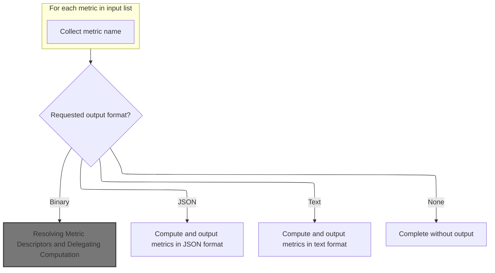
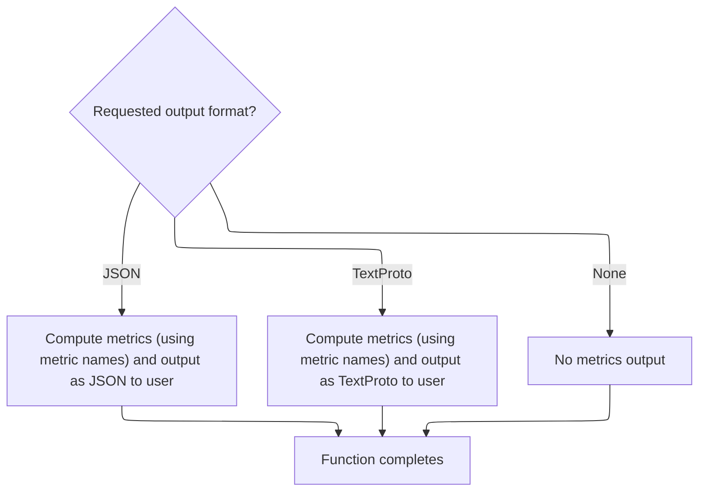

This document describes how requested metrics are computed and output in the desired format. Users provide metric names and select an output format, and the system processes these requests by resolving metric definitions, executing SQL queries, validating results, and formatting the output for trace analysis and profiling.

# Preparing Metric Names and Output Format



<SwmSnippet path="/src/trace_processor/trace_processor_shell.cc" line="415">

---

In <SwmToken path="src/trace_processor/trace_processor_shell.cc" pos="415:4:4" line-data="base::Status RunMetrics(TraceProcessor* trace_processor,">`RunMetrics`</SwmToken>, we start by extracting just the metric names from the input vector, prepping them for the metric computation and output formatting steps that follow.

```c++
base::Status RunMetrics(TraceProcessor* trace_processor,
                        const std::vector<MetricNameAndPath>& metrics,
                        MetricV1OutputFormat format) {
  std::vector<std::string> metric_names(metrics.size());
  for (size_t i = 0; i < metrics.size(); ++i) {
    metric_names[i] = metrics[i].name;
  }
```

---

</SwmSnippet>

<SwmSnippet path="/src/trace_processor/trace_processor_shell.cc" line="423">

---

Here we branch based on the requested output format. For binary proto, we call <SwmToken path="src/trace_processor/trace_processor_shell.cc" pos="427:3:3" line-data="          trace_processor-&gt;ComputeMetric(metric_names, &amp;metric_result));">`ComputeMetric`</SwmToken> to get the raw metric data, then write it out. This sets up the next step, which is handled in <SwmPath>[src/trace_processor/trace_processor_impl.cc](src/trace_processor/trace_processor_impl.cc)</SwmPath>.

```c++
  switch (format) {
    case MetricV1OutputFormat::kBinaryProto: {
      std::vector<uint8_t> metric_result;
      RETURN_IF_ERROR(
          trace_processor->ComputeMetric(metric_names, &metric_result));
      fwrite(metric_result.data(), sizeof(uint8_t), metric_result.size(),
             stdout);
      break;
    }
```

---

</SwmSnippet>

## Resolving Metric Descriptors and Delegating Computation

<SwmSnippet path="/src/trace_processor/trace_processor_impl.cc" line="994">

---

<SwmToken path="src/trace_processor/trace_processor_impl.cc" pos="994:6:6" line-data="base::Status TraceProcessorImpl::ComputeMetric(">`ComputeMetric`</SwmToken> looks up the root proto descriptor needed to build the metrics output. If it's found, we delegate the actual metric computation to <SwmToken path="src/trace_processor/trace_processor_impl.cc" pos="1004:5:5" line-data="  return metrics::ComputeMetrics(engine_.get(), metric_names, sql_metrics_,">`ComputeMetrics`</SwmToken> in <SwmPath>[src/…/metrics/metrics.cc](src/trace_processor/metrics/metrics.cc)</SwmPath>, passing all the context needed for proto construction.

```c++
base::Status TraceProcessorImpl::ComputeMetric(
    const std::vector<std::string>& metric_names,
    std::vector<uint8_t>* metrics_proto) {
  auto opt_idx = metrics_descriptor_pool_.FindDescriptorIdx(
      ".perfetto.protos.TraceMetrics");
  if (!opt_idx.has_value())
    return base::Status("Root metrics proto descriptor not found");

  const auto& root_descriptor =
      metrics_descriptor_pool_.descriptors()[opt_idx.value()];
  return metrics::ComputeMetrics(engine_.get(), metric_names, sql_metrics_,
                                 metrics_descriptor_pool_, root_descriptor,
                                 metrics_proto);
}
```

---

</SwmSnippet>

## Mapping Metric Names to SQL and Building Proto Output

<SwmSnippet path="/src/trace_processor/metrics/metrics.cc" line="730">

---

In <SwmToken path="src/trace_processor/metrics/metrics.cc" pos="730:4:4" line-data="base::Status ComputeMetrics(PerfettoSqlEngine* engine,">`ComputeMetrics`</SwmToken>, we match each metric name to its SQL definition and proto field, then run the SQL using the engine. This step is needed to get the actual metric data, which we append to the proto message. The SQL engine call is what actually executes the metric queries.

```c++
base::Status ComputeMetrics(PerfettoSqlEngine* engine,
                            const std::vector<std::string>& metrics_to_compute,
                            const std::vector<SqlMetricFile>& sql_metrics,
                            const DescriptorPool& pool,
                            const ProtoDescriptor& root_descriptor,
                            std::vector<uint8_t>* metrics_proto) {
  ProtoBuilder metric_builder(&pool, &root_descriptor);
  for (const auto& name : metrics_to_compute) {
    auto metric_it =
        std::find_if(sql_metrics.begin(), sql_metrics.end(),
                     [&name](const SqlMetricFile& metric) {
                       return metric.proto_field_name.has_value() &&
                              name == metric.proto_field_name.value();
                     });
    if (metric_it == sql_metrics.end()) {
      return base::ErrStatus("Unknown metric %s", name.c_str());
    }

    const SqlMetricFile& sql_metric = *metric_it;
    auto prep_it =
        engine->Execute(SqlSource::FromMetric(sql_metric.sql, metric_it->path));
    RETURN_IF_ERROR(prep_it.status());

    auto output_query =
        "SELECT * FROM " + sql_metric.output_table_name.value() + ";";
    PERFETTO_TP_TRACE(
        metatrace::Category::QUERY_TIMELINE, "COMPUTE_METRIC_QUERY",
        [&](metatrace::Record* r) { r->AddArg("SQL", output_query); });

    auto it = engine->ExecuteUntilLastStatement(
        SqlSource::FromTraceProcessorImplementation(std::move(output_query)));
```

---

</SwmSnippet>

### Executing Metric SQL and Fetching Results

See <SwmLink doc-title="Processing and executing a batch of SQL statements">[Processing and executing a batch of SQL statements](/.swm/processing-and-executing-a-batch-of-sql-statements.uowblvgo.sw.md)</SwmLink>

### Validating SQL Output and Building Final Proto

```mermaid
%%{init: {"flowchart": {"defaultRenderer": "elk"}} }%%
flowchart TD
    node1["Start processing SQL metric results"]
    click node1 openCode "src/trace_processor/metrics/metrics.cc:761:761"
    subgraph loop1["For each SQL metric query result"]
      node1 --> node2{"Is query result empty?"}
      click node2 openCode "src/trace_processor/metrics/metrics.cc:766:769"
      node2 -->|"Yes"| node3["Append empty metric value for field_name"]
      click node3 openCode "src/trace_processor/metrics/metrics.cc:767:768"
      node2 -->|"No"| node4{"Does output_table_name have exactly one column?"}
      click node4 openCode "src/trace_processor/metrics/metrics.cc:771:774"
      node4 -->|"No"| node5["Return error: output_table_name should have one column"]
      click node5 openCode "src/trace_processor/metrics/metrics.cc:772:774"
      node4 -->|"Yes"| node6{"Is column type valid for metrics?"}
      click node6 openCode "src/trace_processor/metrics/metrics.cc:778:781"
      node6 -->|"No"| node7["Return error: output_table_name column has invalid type"]
      click node7 openCode "src/trace_processor/metrics/metrics.cc:779:781"
      node6 -->|"Yes"| node8["Append metric value for field_name"]
      click node8 openCode "src/trace_processor/metrics/metrics.cc:782:782"
      node8 --> node9{"Does output_table_name have more than one row?"}
      click node9 openCode "src/trace_processor/metrics/metrics.cc:785:788"
      node9 -->|"Yes"| node10["Return error: output_table_name should have at most one row"]
      click node10 openCode "src/trace_processor/metrics/metrics.cc:786:788"
      node9 -->|"No"| node11["Continue to next result"]
      click node11 openCode "src/trace_processor/metrics/metrics.cc:789:790"
    end
    node11 --> node12["Serialize all metrics output"]
    click node12 openCode "src/trace_processor/metrics/metrics.cc:791:791"
    node12 --> node13["Return success"]
    click node13 openCode "src/trace_processor/metrics/metrics.cc:792:793"
classDef HeadingStyle fill:#777777,stroke:#333,stroke-width:2px;

%% Swimm:
%% %%{init: {"flowchart": {"defaultRenderer": "elk"}} }%%
%% flowchart TD
%%     node1["Start processing SQL metric results"]
%%     click node1 openCode "<SwmPath>[src/…/metrics/metrics.cc](src/trace_processor/metrics/metrics.cc)</SwmPath>:761:761"
%%     subgraph loop1["For each SQL metric query result"]
%%       node1 --> node2{"Is query result empty?"}
%%       click node2 openCode "<SwmPath>[src/…/metrics/metrics.cc](src/trace_processor/metrics/metrics.cc)</SwmPath>:766:769"
%%       node2 -->|"Yes"| node3["Append empty metric value for <SwmToken path="src/trace_processor/metrics/metrics.cc" pos="765:6:6" line-data="    const auto&amp; field_name = sql_metric.proto_field_name.value();">`field_name`</SwmToken>"]
%%       click node3 openCode "<SwmPath>[src/…/metrics/metrics.cc](src/trace_processor/metrics/metrics.cc)</SwmPath>:767:768"
%%       node2 -->|"No"| node4{"Does <SwmToken path="src/trace_processor/metrics/metrics.cc" pos="754:14:14" line-data="        &quot;SELECT * FROM &quot; + sql_metric.output_table_name.value() + &quot;;&quot;;">`output_table_name`</SwmToken> have exactly one column?"}
%%       click node4 openCode "<SwmPath>[src/…/metrics/metrics.cc](src/trace_processor/metrics/metrics.cc)</SwmPath>:771:774"
%%       node4 -->|"No"| node5["Return error: <SwmToken path="src/trace_processor/metrics/metrics.cc" pos="754:14:14" line-data="        &quot;SELECT * FROM &quot; + sql_metric.output_table_name.value() + &quot;;&quot;;">`output_table_name`</SwmToken> should have one column"]
%%       click node5 openCode "<SwmPath>[src/…/metrics/metrics.cc](src/trace_processor/metrics/metrics.cc)</SwmPath>:772:774"
%%       node4 -->|"Yes"| node6{"Is column type valid for metrics?"}
%%       click node6 openCode "<SwmPath>[src/…/metrics/metrics.cc](src/trace_processor/metrics/metrics.cc)</SwmPath>:778:781"
%%       node6 -->|"No"| node7["Return error: <SwmToken path="src/trace_processor/metrics/metrics.cc" pos="754:14:14" line-data="        &quot;SELECT * FROM &quot; + sql_metric.output_table_name.value() + &quot;;&quot;;">`output_table_name`</SwmToken> column has invalid type"]
%%       click node7 openCode "<SwmPath>[src/…/metrics/metrics.cc](src/trace_processor/metrics/metrics.cc)</SwmPath>:779:781"
%%       node6 -->|"Yes"| node8["Append metric value for <SwmToken path="src/trace_processor/metrics/metrics.cc" pos="765:6:6" line-data="    const auto&amp; field_name = sql_metric.proto_field_name.value();">`field_name`</SwmToken>"]
%%       click node8 openCode "<SwmPath>[src/…/metrics/metrics.cc](src/trace_processor/metrics/metrics.cc)</SwmPath>:782:782"
%%       node8 --> node9{"Does <SwmToken path="src/trace_processor/metrics/metrics.cc" pos="754:14:14" line-data="        &quot;SELECT * FROM &quot; + sql_metric.output_table_name.value() + &quot;;&quot;;">`output_table_name`</SwmToken> have more than one row?"}
%%       click node9 openCode "<SwmPath>[src/…/metrics/metrics.cc](src/trace_processor/metrics/metrics.cc)</SwmPath>:785:788"
%%       node9 -->|"Yes"| node10["Return error: <SwmToken path="src/trace_processor/metrics/metrics.cc" pos="754:14:14" line-data="        &quot;SELECT * FROM &quot; + sql_metric.output_table_name.value() + &quot;;&quot;;">`output_table_name`</SwmToken> should have at most one row"]
%%       click node10 openCode "<SwmPath>[src/…/metrics/metrics.cc](src/trace_processor/metrics/metrics.cc)</SwmPath>:786:788"
%%       node9 -->|"No"| node11["Continue to next result"]
%%       click node11 openCode "<SwmPath>[src/…/metrics/metrics.cc](src/trace_processor/metrics/metrics.cc)</SwmPath>:789:790"
%%     end
%%     node11 --> node12["Serialize all metrics output"]
%%     click node12 openCode "<SwmPath>[src/…/metrics/metrics.cc](src/trace_processor/metrics/metrics.cc)</SwmPath>:791:791"
%%     node12 --> node13["Return success"]
%%     click node13 openCode "<SwmPath>[src/…/metrics/metrics.cc](src/trace_processor/metrics/metrics.cc)</SwmPath>:792:793"
%% classDef HeadingStyle fill:#777777,stroke:#333,stroke-width:2px;
```



<SwmSnippet path="/src/trace_processor/metrics/metrics.cc" line="761">

---

Back in <SwmToken path="src/trace_processor/trace_processor_impl.cc" pos="1004:5:5" line-data="  return metrics::ComputeMetrics(engine_.get(), metric_names, sql_metrics_,">`ComputeMetrics`</SwmToken>, after getting results from the SQL engine, we check that each output table has one column and at most one row. We append the value to the proto if valid, or an empty field if no rows. Finally, we serialize the proto and return the result.

```c++
    RETURN_IF_ERROR(it.status());

    // Allow the query to return no rows. This has the same semantic as an
    // empty proto being returned.
    const auto& field_name = sql_metric.proto_field_name.value();
    if (it->stmt.IsDone()) {
      metric_builder.AppendSqlValue(field_name, SqlValue::Bytes(nullptr, 0));
      continue;
    }

    if (it->stats.column_count != 1) {
      return base::ErrStatus("Output table %s should have exactly one column",
                             sql_metric.output_table_name.value().c_str());
    }

    SqlValue col = sqlite::utils::SqliteValueToSqlValue(
        sqlite3_column_value(it->stmt.sqlite_stmt(), 0));
    if (col.type != SqlValue::kBytes) {
      return base::ErrStatus("Output table %s column has invalid type",
                             sql_metric.output_table_name.value().c_str());
    }
    RETURN_IF_ERROR(metric_builder.AppendSqlValue(field_name, col));

    bool has_next = it->stmt.Step();
    if (has_next) {
      return base::ErrStatus("Output table %s should have at most one row",
                             sql_metric.output_table_name.value().c_str());
    }
    RETURN_IF_ERROR(it->stmt.status());
  }
  *metrics_proto = metric_builder.SerializeRaw();
  return base::OkStatus();
}
```

---

</SwmSnippet>

## Formatting and Outputting Metric Results



<SwmSnippet path="/src/trace_processor/trace_processor_shell.cc" line="432">

---

After returning from <SwmToken path="src/trace_processor/trace_processor_shell.cc" pos="427:3:3" line-data="          trace_processor-&gt;ComputeMetric(metric_names, &amp;metric_result));">`ComputeMetric`</SwmToken> in <SwmPath>[src/trace_processor/trace_processor_impl.cc](src/trace_processor/trace_processor_impl.cc)</SwmPath>, <SwmToken path="src/trace_processor/trace_processor_shell.cc" pos="415:4:4" line-data="base::Status RunMetrics(TraceProcessor* trace_processor,">`RunMetrics`</SwmToken> handles text-based output formats by calling <SwmToken path="src/trace_processor/trace_processor_shell.cc" pos="434:5:5" line-data="      RETURN_IF_ERROR(trace_processor-&gt;ComputeMetricText(">`ComputeMetricText`</SwmToken>, formatting the result, and writing it out. This covers JSON and text proto cases.

```c++
    case MetricV1OutputFormat::kJson: {
      std::string out;
      RETURN_IF_ERROR(trace_processor->ComputeMetricText(
          metric_names, TraceProcessor::MetricResultFormat::kJson, &out));
      out += '\n';
      fwrite(out.c_str(), sizeof(char), out.size(), stdout);
      break;
    }
    case MetricV1OutputFormat::kTextProto: {
      std::string out;
      RETURN_IF_ERROR(trace_processor->ComputeMetricText(
          metric_names, TraceProcessor::MetricResultFormat::kProtoText, &out));
      out += '\n';
      fwrite(out.c_str(), sizeof(char), out.size(), stdout);
      break;
    }
    case MetricV1OutputFormat::kNone:
      break;
  }

  return base::OkStatus();
}
```

---

</SwmSnippet>

&nbsp;

*This is an auto-generated document by Swimm 🌊 and has not yet been verified by a human*

<SwmMeta version="3.0.0" repo-id="Z2l0aHViJTNBJTNBY3BsdXNwbHVzLXBlcmZldHRvJTNBJTNBcmljYXJkb2xvcGV6Zw==" repo-name="cplusplus-perfetto"><sup>Powered by [Swimm](https://app.swimm.io/)</sup></SwmMeta>
