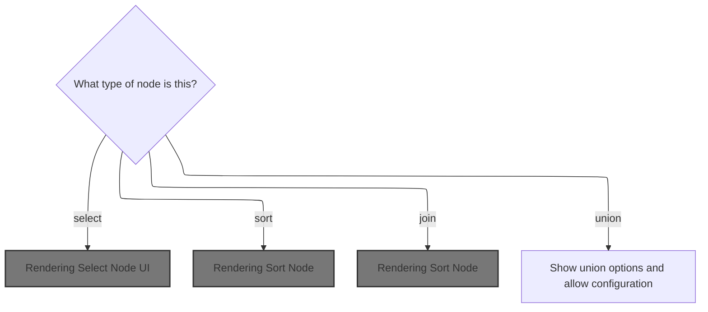

This document describes how the visual editor displays the correct user interface for each node type, enabling users to configure data processing steps interactively. The editor receives the node type and configuration as input, renders the relevant UI, and updates the node's settings based on user actions.

# Dispatching Node Rendering



<SwmSnippet path="/ui/src/plugins/dev.perfetto.WidgetsPage/demos/nodegraph_demo.ts" line="397">

---

In <SwmToken path="ui/src/plugins/dev.perfetto.WidgetsPage/demos/nodegraph_demo.ts" pos="397:2:2" line-data="function renderNodeContent(">`renderNodeContent`</SwmToken>, we start by switching on the node's type to decide which rendering function to call. For 'select' nodes, we call <SwmToken path="ui/src/plugins/dev.perfetto.WidgetsPage/demos/nodegraph_demo.ts" pos="405:3:3" line-data="      return renderSelectNode(node, updateNode);">`renderSelectNode`</SwmToken> next, which handles the UI for selecting columns. This keeps the rendering logic clean and modular.

```typescript
function renderNodeContent(
  node: NodeData,
  updateNode: (updates: Partial<Omit<NodeData, 'id'>>) => void,
): m.Children {
  switch (node.type) {
    case 'table':
      return renderTableNode(node, updateNode);
    case 'select':
      return renderSelectNode(node, updateNode);
    case 'filter':
      return renderFilterNode(node, updateNode);
```

---

</SwmSnippet>

## Rendering Select Node UI

```mermaid
%%{init: {"flowchart": {"defaultRenderer": "elk"}} }%%
flowchart TD
    node1["Display selectable columns as checkboxes"]
    click node1 openCode "ui/src/plugins/dev.perfetto.WidgetsPage/demos/nodegraph_demo.ts:257:279"
    subgraph loop1["For each column"]
      node1 --> node2["Show checkbox for column"]
      node2 --> node3{"User toggles checkbox?"}
      node3 -->|"Yes"| node4["Update selection state and re-render"]
      click node4 openCode "ui/src/plugins/dev.perfetto.WidgetsPage/demos/nodegraph_demo.ts:269:274"
      node3 -->|"No"| node5["Proceed to next column"]
      node4 --> node5
    end
    node5 --> node6["All selections updated"]
    click node6 openCode "ui/src/plugins/dev.perfetto.WidgetsPage/demos/nodegraph_demo.ts:257:279"
classDef HeadingStyle fill:#777777,stroke:#333,stroke-width:2px;

%% Swimm:
%% %%{init: {"flowchart": {"defaultRenderer": "elk"}} }%%
%% flowchart TD
%%     node1["Display selectable columns as checkboxes"]
%%     click node1 openCode "<SwmPath>[ui/…/demos/nodegraph_demo.ts](ui/src/plugins/dev.perfetto.WidgetsPage/demos/nodegraph_demo.ts)</SwmPath>:257:279"
%%     subgraph loop1["For each column"]
%%       node1 --> node2["Show checkbox for column"]
%%       node2 --> node3{"User toggles checkbox?"}
%%       node3 -->|"Yes"| node4["Update selection state and re-render"]
%%       click node4 openCode "<SwmPath>[ui/…/demos/nodegraph_demo.ts](ui/src/plugins/dev.perfetto.WidgetsPage/demos/nodegraph_demo.ts)</SwmPath>:269:274"
%%       node3 -->|"No"| node5["Proceed to next column"]
%%       node4 --> node5
%%     end
%%     node5 --> node6["All selections updated"]
%%     click node6 openCode "<SwmPath>[ui/…/demos/nodegraph_demo.ts](ui/src/plugins/dev.perfetto.WidgetsPage/demos/nodegraph_demo.ts)</SwmPath>:257:279"
%% classDef HeadingStyle fill:#777777,stroke:#333,stroke-width:2px;
```



<SwmSnippet path="/ui/src/plugins/dev.perfetto.WidgetsPage/demos/nodegraph_demo.ts" line="257">

---

<SwmToken path="ui/src/plugins/dev.perfetto.WidgetsPage/demos/nodegraph_demo.ts" pos="257:2:2" line-data="function renderSelectNode(">`renderSelectNode`</SwmToken> renders checkboxes for each column and calls <SwmToken path="ui/src/plugins/dev.perfetto.WidgetsPage/demos/nodegraph_demo.ts" pos="259:1:1" line-data="  updateNode: (updates: Partial&lt;Omit&lt;SelectNodeData, &#39;type&#39; | &#39;id&#39;&gt;&gt;) =&gt; void,">`updateNode`</SwmToken> when a checkbox is toggled to update the node's state.

```typescript
function renderSelectNode(
  node: SelectNodeData,
  updateNode: (updates: Partial<Omit<SelectNodeData, 'type' | 'id'>>) => void,
): m.Children {
  return m(
    '',
    {style: {display: 'flex', flexDirection: 'column', gap: '4px'}},
    Object.entries(node.columns).map(([col, checked]) =>
      m(Checkbox, {
        label: col,
        checked,
        onchange: () => {
          updateNode({
            columns: {
              ...node.columns,
              [col]: !checked,
            },
          });
        },
      }),
    ),
  );
}
```

---

</SwmSnippet>

## Updating Node State

<SwmSnippet path="/ui/src/plugins/dev.perfetto.WidgetsPage/demos/nodegraph_demo.ts" line="521">

---

<SwmToken path="ui/src/plugins/dev.perfetto.WidgetsPage/demos/nodegraph_demo.ts" pos="521:3:3" line-data="  const updateNode = (">`updateNode`</SwmToken> passes node updates to <SwmToken path="ui/src/plugins/dev.perfetto.WidgetsPage/demos/nodegraph_demo.ts" pos="525:1:1" line-data="    updateStore((draft) =&gt; {">`updateStore`</SwmToken> so history and UI redraws are handled together.

```typescript
  const updateNode = (
    nodeId: string,
    updates: Partial<Omit<NodeData, 'id'>>,
  ) => {
    updateStore((draft) => {
      const node = draft.nodes.get(nodeId);
      if (node) {
        Object.assign(node, updates);
      }
    });
  };
```

---

</SwmSnippet>

<SwmSnippet path="/ui/src/plugins/dev.perfetto.WidgetsPage/demos/nodegraph_demo.ts" line="476">

---

<SwmToken path="ui/src/plugins/dev.perfetto.WidgetsPage/demos/nodegraph_demo.ts" pos="476:3:3" line-data="  const updateStore = (updater: (draft: NodeGraphStore) =&gt; void) =&gt; {">`updateStore`</SwmToken> applies updates immutably, manages a capped history for <SwmToken path="ui/src/plugins/dev.perfetto.WidgetsPage/demos/nodegraph_demo.ts" pos="88:19:21" line-data="// Store interface (only data that should be in undo/redo history)">`undo/redo`</SwmToken>, trims future states if needed, and triggers a UI redraw so changes are visible. The 50-state limit prevents memory bloat.

```typescript
  const updateStore = (updater: (draft: NodeGraphStore) => void) => {
    // Apply the update
    const newStore = produce(store, updater);

    store = newStore;

    // Remove any future history if we're not at the end
    if (historyIndex < history.length - 1) {
      history.splice(historyIndex + 1);
    }

    // Add new state to history
    history.push(store);
    historyIndex = history.length - 1;

    // Limit history to prevent memory issues (keep last 50 states)
    if (history.length > 50) {
      history.shift();
      historyIndex--;
    }

    m.redraw();
  };
```

---

</SwmSnippet>

## Rendering Sort Node

```mermaid
%%{init: {"flowchart": {"defaultRenderer": "elk"}} }%%
flowchart TD
  node0["Start rendering node in editor"] --> node1{"What is the node type?"}
  click node0 openCode "ui/src/plugins/dev.perfetto.WidgetsPage/demos/nodegraph_demo.ts:408:417"
  node1 -->|"sort"| node2["Render Sort Node UI"]
  click node1 openCode "ui/src/plugins/dev.perfetto.WidgetsPage/demos/nodegraph_demo.ts:408:417"
  node1 -->|"join"| node3["Render Join Node UI"]
  node1 -->|"union"| node4["Render Union Node UI"]
  node1 -->|"result"| node5["Render Result Node UI"]
  click node2 openCode "ui/src/plugins/dev.perfetto.WidgetsPage/demos/nodegraph_demo.ts:295:330"
  click node3 openCode "ui/src/plugins/dev.perfetto.WidgetsPage/demos/nodegraph_demo.ts:332:368"
  click node4 openCode "ui/src/plugins/dev.perfetto.WidgetsPage/demos/nodegraph_demo.ts:370:390"
  click node5 openCode "ui/src/plugins/dev.perfetto.WidgetsPage/demos/nodegraph_demo.ts:414:415"
classDef HeadingStyle fill:#777777,stroke:#333,stroke-width:2px;

%% Swimm:
%% %%{init: {"flowchart": {"defaultRenderer": "elk"}} }%%
%% flowchart TD
%%   node0["Start rendering node in editor"] --> node1{"What is the node type?"}
%%   click node0 openCode "<SwmPath>[ui/…/demos/nodegraph_demo.ts](ui/src/plugins/dev.perfetto.WidgetsPage/demos/nodegraph_demo.ts)</SwmPath>:408:417"
%%   node1 -->|"sort"| node2["Render Sort Node UI"]
%%   click node1 openCode "<SwmPath>[ui/…/demos/nodegraph_demo.ts](ui/src/plugins/dev.perfetto.WidgetsPage/demos/nodegraph_demo.ts)</SwmPath>:408:417"
%%   node1 -->|"join"| node3["Render Join Node UI"]
%%   node1 -->|"union"| node4["Render Union Node UI"]
%%   node1 -->|"result"| node5["Render Result Node UI"]
%%   click node2 openCode "<SwmPath>[ui/…/demos/nodegraph_demo.ts](ui/src/plugins/dev.perfetto.WidgetsPage/demos/nodegraph_demo.ts)</SwmPath>:295:330"
%%   click node3 openCode "<SwmPath>[ui/…/demos/nodegraph_demo.ts](ui/src/plugins/dev.perfetto.WidgetsPage/demos/nodegraph_demo.ts)</SwmPath>:332:368"
%%   click node4 openCode "<SwmPath>[ui/…/demos/nodegraph_demo.ts](ui/src/plugins/dev.perfetto.WidgetsPage/demos/nodegraph_demo.ts)</SwmPath>:370:390"
%%   click node5 openCode "<SwmPath>[ui/…/demos/nodegraph_demo.ts](ui/src/plugins/dev.perfetto.WidgetsPage/demos/nodegraph_demo.ts)</SwmPath>:414:415"
%% classDef HeadingStyle fill:#777777,stroke:#333,stroke-width:2px;
```



<SwmSnippet path="/ui/src/plugins/dev.perfetto.WidgetsPage/demos/nodegraph_demo.ts" line="408">

---

Back in <SwmToken path="ui/src/plugins/dev.perfetto.WidgetsPage/demos/nodegraph_demo.ts" pos="397:2:2" line-data="function renderNodeContent(">`renderNodeContent`</SwmToken>, after handling 'select' nodes, we check for 'sort' nodes and call <SwmToken path="ui/src/plugins/dev.perfetto.WidgetsPage/demos/nodegraph_demo.ts" pos="409:3:3" line-data="      return renderSortNode(node, updateNode);">`renderSortNode`</SwmToken> to render the sorting UI for those nodes.

```typescript
    case 'sort':
      return renderSortNode(node, updateNode);
```

---

</SwmSnippet>

<SwmSnippet path="/ui/src/plugins/dev.perfetto.WidgetsPage/demos/nodegraph_demo.ts" line="295">

---

<SwmToken path="ui/src/plugins/dev.perfetto.WidgetsPage/demos/nodegraph_demo.ts" pos="295:2:2" line-data="function renderSortNode(">`renderSortNode`</SwmToken> renders UI for picking the sort column and order. When either input changes, <SwmToken path="ui/src/plugins/dev.perfetto.WidgetsPage/demos/nodegraph_demo.ts" pos="297:1:1" line-data="  updateNode: (updates: Partial&lt;Omit&lt;SortNodeData, &#39;type&#39; | &#39;id&#39;&gt;&gt;) =&gt; void,">`updateNode`</SwmToken> is called to update the node's sorting settings.

```typescript
function renderSortNode(
  node: SortNodeData,
  updateNode: (updates: Partial<Omit<SortNodeData, 'type' | 'id'>>) => void,
): m.Children {
  return m(
    '',
    {style: {display: 'flex', flexDirection: 'column', gap: '4px'}},
    [
      m(TextInput, {
        placeholder: 'Sort column...',
        value: node.sortColumn,
        oninput: (e: InputEvent) => {
          const target = e.target as HTMLInputElement;
          updateNode({sortColumn: target.value});
        },
      }),
      m(
        Select,
        {
          value: node.sortOrder,
          onchange: (e: Event) => {
            updateNode({
              sortOrder: (e.target as HTMLSelectElement).value as
                | 'ASC'
                | 'DESC',
            });
          },
        },
        [
          m('option', {value: 'ASC'}, 'ASC'),
          m('option', {value: 'DESC'}, 'DESC'),
        ],
      ),
    ],
  );
}
```

---

</SwmSnippet>

<SwmSnippet path="/ui/src/plugins/dev.perfetto.WidgetsPage/demos/nodegraph_demo.ts" line="410">

---

Back in <SwmToken path="ui/src/plugins/dev.perfetto.WidgetsPage/demos/nodegraph_demo.ts" pos="397:2:2" line-data="function renderNodeContent(">`renderNodeContent`</SwmToken>, after handling 'sort' nodes, we check for 'join' nodes and call <SwmToken path="ui/src/plugins/dev.perfetto.WidgetsPage/demos/nodegraph_demo.ts" pos="411:3:3" line-data="      return renderJoinNode(node, updateNode);">`renderJoinNode`</SwmToken> to render the join configuration UI.

```typescript
    case 'join':
      return renderJoinNode(node, updateNode);
```

---

</SwmSnippet>

<SwmSnippet path="/ui/src/plugins/dev.perfetto.WidgetsPage/demos/nodegraph_demo.ts" line="332">

---

<SwmToken path="ui/src/plugins/dev.perfetto.WidgetsPage/demos/nodegraph_demo.ts" pos="332:2:2" line-data="function renderJoinNode(">`renderJoinNode`</SwmToken> renders UI for picking join type and condition. When either input changes, <SwmToken path="ui/src/plugins/dev.perfetto.WidgetsPage/demos/nodegraph_demo.ts" pos="334:1:1" line-data="  updateNode: (updates: Partial&lt;Omit&lt;JoinNodeData, &#39;type&#39; | &#39;id&#39;&gt;&gt;) =&gt; void,">`updateNode`</SwmToken> is called to update the node's join settings.

```typescript
function renderJoinNode(
  node: JoinNodeData,
  updateNode: (updates: Partial<Omit<JoinNodeData, 'type' | 'id'>>) => void,
): m.Children {
  return m(
    '',
    {style: {display: 'flex', flexDirection: 'column', gap: '4px'}},
    [
      m(
        Select,
        {
          value: node.joinType,
          onchange: (e: Event) => {
            updateNode({
              joinType: (e.target as HTMLSelectElement)
                .value as JoinNodeData['joinType'],
            });
          },
        },
        [
          m('option', {value: 'INNER'}, 'INNER'),
          m('option', {value: 'LEFT'}, 'LEFT'),
          m('option', {value: 'RIGHT'}, 'RIGHT'),
          m('option', {value: 'FULL'}, 'FULL'),
        ],
      ),
      m(TextInput, {
        placeholder: 'ON condition...',
        value: node.joinOn,
        oninput: (e: InputEvent) => {
          const target = e.target as HTMLInputElement;
          updateNode({joinOn: target.value});
        },
      }),
    ],
  );
}
```

---

</SwmSnippet>

<SwmSnippet path="/ui/src/plugins/dev.perfetto.WidgetsPage/demos/nodegraph_demo.ts" line="412">

---

Back in <SwmToken path="ui/src/plugins/dev.perfetto.WidgetsPage/demos/nodegraph_demo.ts" pos="397:2:2" line-data="function renderNodeContent(">`renderNodeContent`</SwmToken>, after handling 'join' nodes, we check for 'union' nodes and call <SwmToken path="ui/src/plugins/dev.perfetto.WidgetsPage/demos/nodegraph_demo.ts" pos="413:3:3" line-data="      return renderUnionNode(node, updateNode);">`renderUnionNode`</SwmToken> to render the union configuration UI.

```typescript
    case 'union':
      return renderUnionNode(node, updateNode);
    case 'result':
      return renderResultNode();
  }
}
```

---

</SwmSnippet>

<SwmSnippet path="/ui/src/plugins/dev.perfetto.WidgetsPage/demos/nodegraph_demo.ts" line="370">

---

<SwmToken path="ui/src/plugins/dev.perfetto.WidgetsPage/demos/nodegraph_demo.ts" pos="370:2:2" line-data="function renderUnionNode(">`renderUnionNode`</SwmToken> renders a Select for union type. When the selection changes, <SwmToken path="ui/src/plugins/dev.perfetto.WidgetsPage/demos/nodegraph_demo.ts" pos="372:1:1" line-data="  updateNode: (updates: Partial&lt;Omit&lt;UnionNodeData, &#39;type&#39; | &#39;id&#39;&gt;&gt;) =&gt; void,">`updateNode`</SwmToken> is called to update the node's <SwmToken path="ui/src/plugins/dev.perfetto.WidgetsPage/demos/nodegraph_demo.ts" pos="377:6:6" line-data="      value: node.unionType,">`unionType`</SwmToken>.

```typescript
function renderUnionNode(
  node: UnionNodeData,
  updateNode: (updates: Partial<Omit<UnionNodeData, 'type' | 'id'>>) => void,
): m.Children {
  return m(
    Select,
    {
      value: node.unionType,
      onchange: (e: Event) => {
        updateNode({
          unionType: (e.target as HTMLSelectElement)
            .value as UnionNodeData['unionType'],
        });
      },
    },
    [
      m('option', {value: 'UNION'}, 'UNION'),
      m('option', {value: 'UNION ALL'}, 'UNION ALL'),
    ],
  );
}
```

---

</SwmSnippet>

&nbsp;

*This is an auto-generated document by Swimm 🌊 and has not yet been verified by a human*

<SwmMeta version="3.0.0" repo-id="Z2l0aHViJTNBJTNBY3BsdXNwbHVzLXBlcmZldHRvJTNBJTNBcmljYXJkb2xvcGV6Zw==" repo-name="cplusplus-perfetto"><sup>Powered by [Swimm](https://app.swimm.io/)</sup></SwmMeta>
