This document describes how a connection to an Android device is established for tracing and profiling. The process prepares the device, handles authentication, and ensures the connection is ready for use. The input is a request to connect, and the output is an authenticated connection for further operations.

# Where is this flow used?

This flow is used multiple times in the codebase as represented in the following diagram:

```mermaid
graph TD;
      65d43f1f359e5a84dab4ece770eb52c32ce4f8a3fa420d6089d49fe5c9fa1389(ui/…/webusb/adb_webusb_target.ts::AdbWebusbTarget.runPreflightChecks) --> 00b9c4849ef2cb881fd8ea0718a4b735837a677742f32a992e7ce0068191b6a4(ui/…/webusb/adb_webusb_target.ts::AdbWebusbTarget.connectIfNeeded)

40a8c58603cb3744e989d4552be2ab743477d07b8415a624964f58b3d98e0d44(ui/…/webusb/adb_webusb_target.ts::AdbWebusbTarget.startTracing) --> 00b9c4849ef2cb881fd8ea0718a4b735837a677742f32a992e7ce0068191b6a4(ui/…/webusb/adb_webusb_target.ts::AdbWebusbTarget.connectIfNeeded)


classDef mainFlowStyle color:#000000,fill:#7CB9F4
classDef rootsStyle color:#000000,fill:#00FFF4
classDef Style1 color:#000000,fill:#00FFAA
classDef Style2 color:#000000,fill:#FFFF00
classDef Style3 color:#000000,fill:#AA7CB9

%% Swimm:
%% graph TD;
%%       65d43f1f359e5a84dab4ece770eb52c32ce4f8a3fa420d6089d49fe5c9fa1389(<SwmPath>[ui/…/webusb/adb_webusb_target.ts](ui/src/plugins/dev.perfetto.RecordTraceV2/adb/webusb/adb_webusb_target.ts)</SwmPath>::AdbWebusbTarget.runPreflightChecks) --> 00b9c4849ef2cb881fd8ea0718a4b735837a677742f32a992e7ce0068191b6a4(<SwmPath>[ui/…/webusb/adb_webusb_target.ts](ui/src/plugins/dev.perfetto.RecordTraceV2/adb/webusb/adb_webusb_target.ts)</SwmPath>::AdbWebusbTarget.connectIfNeeded)
%% 
%% 40a8c58603cb3744e989d4552be2ab743477d07b8415a624964f58b3d98e0d44(<SwmPath>[ui/…/webusb/adb_webusb_target.ts](ui/src/plugins/dev.perfetto.RecordTraceV2/adb/webusb/adb_webusb_target.ts)</SwmPath>::AdbWebusbTarget.startTracing) --> 00b9c4849ef2cb881fd8ea0718a4b735837a677742f32a992e7ce0068191b6a4(<SwmPath>[ui/…/webusb/adb_webusb_target.ts](ui/src/plugins/dev.perfetto.RecordTraceV2/adb/webusb/adb_webusb_target.ts)</SwmPath>::AdbWebusbTarget.connectIfNeeded)
%% 
%% 
%% classDef mainFlowStyle color:#000000,fill:#7CB9F4
%% classDef rootsStyle color:#000000,fill:#00FFF4
%% classDef Style1 color:#000000,fill:#00FFAA
%% classDef Style2 color:#000000,fill:#FFFF00
%% classDef Style3 color:#000000,fill:#AA7CB9
```



# Initiating or Reusing the Device Connection

<SwmSnippet path="/ui/src/plugins/dev.perfetto.RecordTraceV2/adb/webusb/adb_webusb_target.ts" line="56">

---

<SwmToken path="ui/src/plugins/dev.perfetto.RecordTraceV2/adb/webusb/adb_webusb_target.ts" pos="56:3:3" line-data="  async connectIfNeeded(): Promise&lt;Result&lt;AdbWebusbDevice&gt;&gt; {">`connectIfNeeded`</SwmToken> kicks off the connection process by either reusing an existing ADB <SwmToken path="ui/src/plugins/dev.perfetto.RecordTraceV2/adb/webusb/adb_webusb_target.ts" pos="33:8:8" line-data="  readonly transportType = &#39;WebUSB&#39;;">`WebUSB`</SwmToken> device connection or creating a new one if needed. It does this by calling <SwmToken path="ui/src/plugins/dev.perfetto.RecordTraceV2/adb/webusb/adb_webusb_target.ts" pos="57:7:7" line-data="    return this.adbDevice.getOrCreate(() =&gt;">`getOrCreate`</SwmToken> on the <SwmToken path="ui/src/plugins/dev.perfetto.RecordTraceV2/adb/webusb/adb_webusb_target.ts" pos="57:5:5" line-data="    return this.adbDevice.getOrCreate(() =&gt;">`adbDevice`</SwmToken>, passing in <SwmToken path="ui/src/plugins/dev.perfetto.RecordTraceV2/adb/webusb/adb_webusb_target.ts" pos="58:1:3" line-data="      AdbWebusbDevice.connect(this.usbiface.dev, this.adbKeyMgr),">`AdbWebusbDevice.connect`</SwmToken> as the factory. We need to call into <SwmToken path="ui/src/plugins/dev.perfetto.RecordTraceV2/adb/webusb/adb_webusb_target.ts" pos="58:1:3" line-data="      AdbWebusbDevice.connect(this.usbiface.dev, this.adbKeyMgr),">`AdbWebusbDevice.connect`</SwmToken> next because that's where the actual USB protocol handshake and authentication logic happens, which is required to establish or validate the connection.

```typescript
  async connectIfNeeded(): Promise<Result<AdbWebusbDevice>> {
    return this.adbDevice.getOrCreate(() =>
      AdbWebusbDevice.connect(this.usbiface.dev, this.adbKeyMgr),
    );
  }
```

---

</SwmSnippet>

# Establishing the USB and ADB Protocol Session


<SwmSnippet path="/ui/src/plugins/dev.perfetto.RecordTraceV2/adb/webusb/adb_webusb_device.ts" line="71">

---

In <SwmToken path="ui/src/plugins/dev.perfetto.RecordTraceV2/adb/webusb/adb_webusb_target.ts" pos="58:1:3" line-data="      AdbWebusbDevice.connect(this.usbiface.dev, this.adbKeyMgr),">`AdbWebusbDevice.connect`</SwmToken>, we handle the USB device setup, claim the interface, and prep for the ADB handshake. If any of these steps fail, we bail early. Before we can start the authentication loop, we need an ADB key, so we call into AdbKeyManager.getOrCreateKey to fetch or generate it. Without this key, we can't sign authentication challenges from the device.

```typescript
  static async connect(
    usbdev: USBDevice,
    adbKeyMgr: AdbKeyManager,
  ): Promise<Result<AdbWebusbDevice>> {
    const usb = getAdbWebUsbInterface(usbdev);
    if (usb === undefined) {
      return errResult(
        'Could not find the USB Interface. ' +
          'Try disconnecting and reconnecting the device.',
      );
    }
    if (usbdev.opened) {
      await usbdev.close();
    }
    await usbdev.open();
    using autoClose = new CloseDeviceWhenOutOfScope(usbdev);
    await usbdev.selectConfiguration(usb.configurationValue);

    try {
      await usbdev.claimInterface(usb.usbInterfaceNumber);
    } catch (err) {
      console.error(err);
      return errResult(
        'Failed to claim USB interface. Try `adb kill-server` or ' +
          'close other profiling tools and try again',
      );
    }

    const keyRes = await adbKeyMgr.getOrCreateKey();
    if (!keyRes.ok) return keyRes;
```

---

</SwmSnippet>

<SwmSnippet path="/ui/src/plugins/dev.perfetto.RecordTraceV2/adb/webusb/adb_key_manager.ts" line="32">

---

<SwmToken path="ui/src/plugins/dev.perfetto.RecordTraceV2/adb/webusb/adb_key_manager.ts" pos="32:3:3" line-data="  async getOrCreateKey(): Promise&lt;Result&lt;AdbKey&gt;&gt; {">`getOrCreateKey`</SwmToken> tries to fetch the ADB key from browser credentials using an 'optional' mediation to avoid bugging the user every time. If it can't get the key (either missing or dismissed dialog), it asks the user if they want to generate a new one. If they agree, it creates and stores the new key for future use. This keeps the key persistent and avoids accidental replacement.

```typescript
  async getOrCreateKey(): Promise<Result<AdbKey>> {
    this.refreshKeyExpiry();
    return this.key.getOrCreate(async () => {
      // 2. We try to get the private key from the browser.
      // The mediation is set as 'optional', because we use
      // 'preventSilentAccess', which sometimes requests the user to click
      // on a button to allow the auth, but sometimes only shows a
      // notification and does not require the user to click on anything.
      // If we had set mediation to 'required', the user would have been
      // asked to click on a button every time.
      if (hasPasswordCredential()) {
        const options: PasswordCredentialRequestOptions = {
          password: true,
          mediation: 'optional',
        };
        const credential = await navigator.credentials.get(options);
        await navigator.credentials.preventSilentAccess();
        if (exists(credential) && 'password' in credential) {
          return okResult(AdbKey.deserialize(credential.password as string));
        }
      }

      // This can happen in two cases:
      // 1. The very first time when we have no credentials saved.
      // 2. If the user (accidentally) dismisses the "sign in" dialog.
      // We use this UX to prevent that if the user accidentally clicks Escape,
      // we invalidate the key and generates a new one, which would be
      // unauthorized.
      if (!confirm("Couldn't load the ADB key. Generate a new key?")) {
        return errResult(
          "Couldn't load the ADB Key. " + 'Did you dismiss the sign-in dialog',
        );
      }

      // 3. We generate a new key pair.
      const newKey = await AdbKey.generateNewKeyPair();
      await storeKeyInBrowserCredentials(newKey);
      return okResult(newKey);
    });
  }
```

---

</SwmSnippet>

<SwmSnippet path="/ui/src/plugins/dev.perfetto.RecordTraceV2/adb/webusb/adb_webusb_device.ts" line="101">

---

Back in <SwmToken path="ui/src/plugins/dev.perfetto.RecordTraceV2/adb/webusb/adb_webusb_target.ts" pos="58:1:3" line-data="      AdbWebusbDevice.connect(this.usbiface.dev, this.adbKeyMgr),">`AdbWebusbDevice.connect`</SwmToken>, after getting the key, we send the initial CNXN message and enter the authentication loop. We handle up to 10 rounds of device messages to deal with protocol noise or retries. If we get a CNXN response, we're done. If we get an AUTH message, we either sign the nonce or send the public key, prompting the user for authorization if needed. If nothing works after 10 tries, we fail the connection.

```typescript
    const key = keyRes.value;

    await AdbWebusbDevice.send(
      usb,
      'CNXN',
      VERSION_NO_CHECKSUM,
      DEFAULT_MAX_PAYLOAD_BYTES,
      'host:1:WebUsb',
    );

    // At this point there are two options:
    // 1. The device accepts the key and responds with a CNXN msg.
    // 2. The device doesn't recognize us, and responds with another AUTH msg.

    // We need to have some tolerance from queued messages from previous
    // sessions, hence the 10 attempts to deal with spurious messages.
    let authAttempts = 0;
    const modalKey = 'adbauth';
    for (let attempt = 0; attempt < 10; attempt++) {
      const msg = await this.recvMsg(usb);

      if (msg.cmd === 'CNXN') {
        // Success, the device authenticated us.
        closeModal(modalKey);
        const maxPayload = msg.arg1;
        const ver = msg.arg0;
        if (ver !== VERSION_WITH_CHECKSUM && ver !== VERSION_NO_CHECKSUM) {
          return errResult(`ADB version ${ver} not supported`);
        }
        const useChecksum = ver === VERSION_WITH_CHECKSUM;
        autoClose.keepOpen = true;
        return okResult(new AdbWebusbDevice(usb, maxPayload, useChecksum));
      }

      if (msg.cmd !== 'AUTH') {
        logSpuriousMsg(msg);
        continue;
      }

      assertTrue(msg.arg0 === AuthCmd.TOKEN);
      const authAttempt = authAttempts++;
      if (authAttempt === 0) {
        // Case 1: we are presented with a nonce to sign. If the device has
        // previously received our public key, the dialog asking for user
        // confirmation will NOT be displayed.
        const signedNonce = key.sign(msg.data);
        await this.send(usb, 'AUTH', AuthCmd.SIGNATURE, 0, signedNonce);
        continue;
      }
      if (authAttempt === 1) {
        // Case 2: present our public key. This will prompt the dialog.
        await this.send(usb, 'AUTH', AuthCmd.PUBKEY, 0, key.getPublicKey());
        showModal({
          key: modalKey,
          title: 'ADB Authorization required',
          content: 'Please unlock the device and authorize the ADB connection',
        });
        continue;
      }
      break;
    }
```

---

</SwmSnippet>

&nbsp;

*This is an auto-generated document by Swimm 🌊 and has not yet been verified by a human*

<SwmMeta version="3.0.0" repo-id="Z2l0aHViJTNBJTNBY3BsdXNwbHVzLXBlcmZldHRvJTNBJTNBcmljYXJkb2xvcGV6Zw==" repo-name="cplusplus-perfetto"><sup>Powered by [Swimm](https://app.swimm.io/)</sup></SwmMeta>
