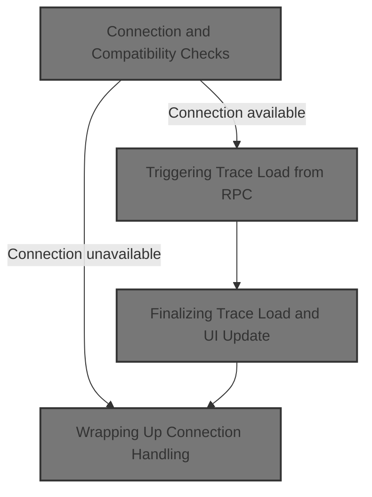

This document describes how the application checks for an HTTP RPC backend connection, guides the user through compatibility and version decisions, and loads a trace from the backend if available. Users are prompted to choose how to proceed if there are compatibility issues or a preloaded trace, ensuring a seamless experience whether working with the backend or the <SwmToken path="ui/src/frontend/rpc_http_dialog.ts" pos="120:7:9" line-data="//    |  +---+Use built-in WASM  |    |                    |                 |">`built-in`</SwmToken> UI.



# Connection and Compatibility Checks

```mermaid
%%{init: {"flowchart": {"defaultRenderer": "elk"}} }%%
flowchart TD
  node1["Check HTTP RPC connection status"]
  click node1 openCode "ui/src/frontend/rpc_http_dialog.ts:151:153"
  node1 --> node2{"Is connection available?"}
  click node2 openCode "ui/src/frontend/rpc_http_dialog.ts:153:157"
  node2 -->|"No"| node4["Fallback to built-in UI"]
  click node4 openCode "ui/src/frontend/rpc_http_dialog.ts:161:162"
  node2 -->|"Yes"| node3{"Is there a preloaded trace?"}
  click node3 openCode "ui/src/frontend/rpc_http_dialog.ts:205:217"
  node3 -->|"Yes"| node5["Triggering Trace Load from RPC"]
  
  node3 -->|"No"| node6["Preparing and Serializing Trace Load"]
  

classDef HeadingStyle fill:#777777,stroke:#333,stroke-width:2px;
click node5 goToHeading "Triggering Trace Load from RPC"
node5:::HeadingStyle
click node6 goToHeading "Preparing and Serializing Trace Load"
node6:::HeadingStyle

%% Swimm:
%% %%{init: {"flowchart": {"defaultRenderer": "elk"}} }%%
%% flowchart TD
%%   node1["Check HTTP RPC connection status"]
%%   click node1 openCode "<SwmPath>[ui/…/frontend/rpc_http_dialog.ts](ui/src/frontend/rpc_http_dialog.ts)</SwmPath>:151:153"
%%   node1 --> node2{"Is connection available?"}
%%   click node2 openCode "<SwmPath>[ui/…/frontend/rpc_http_dialog.ts](ui/src/frontend/rpc_http_dialog.ts)</SwmPath>:153:157"
%%   node2 -->|"No"| node4["Fallback to <SwmToken path="ui/src/frontend/rpc_http_dialog.ts" pos="120:7:9" line-data="//    |  +---+Use built-in WASM  |    |                    |                 |">`built-in`</SwmToken> UI"]
%%   click node4 openCode "<SwmPath>[ui/…/frontend/rpc_http_dialog.ts](ui/src/frontend/rpc_http_dialog.ts)</SwmPath>:161:162"
%%   node2 -->|"Yes"| node3{"Is there a preloaded trace?"}
%%   click node3 openCode "<SwmPath>[ui/…/frontend/rpc_http_dialog.ts](ui/src/frontend/rpc_http_dialog.ts)</SwmPath>:205:217"
%%   node3 -->|"Yes"| node5["Triggering Trace Load from RPC"]
%%   
%%   node3 -->|"No"| node6["Preparing and Serializing Trace Load"]
%%   
%% 
%% classDef HeadingStyle fill:#777777,stroke:#333,stroke-width:2px;
%% click node5 goToHeading "Triggering Trace Load from RPC"
%% node5:::HeadingStyle
%% click node6 goToHeading "Preparing and Serializing Trace Load"
%% node6:::HeadingStyle
```



<SwmSnippet path="/ui/src/frontend/rpc_http_dialog.ts" line="151">

---

In <SwmToken path="ui/src/frontend/rpc_http_dialog.ts" pos="151:6:6" line-data="export async function checkHttpRpcConnection(): Promise&lt;void&gt; {">`checkHttpRpcConnection`</SwmToken>, we start by checking if the HTTP RPC backend is available and update the global flag. If not connected, we bail out. If connected, we pull the backend status and run through checks for version mismatches, API compatibility, and whether a trace is already loaded. Each of these can trigger a user dialog, and depending on the user's choice, we might switch UI versions, force WASM mode, or proceed to open the trace from the RPC backend. We need to call into <SwmToken path="ui/src/frontend/rpc_http_dialog.ts" pos="153:1:1" line-data="  AppImpl.instance.httpRpc.httpRpcAvailable = state.connected;">`AppImpl`</SwmToken> next to actually open the trace if the user chooses to proceed with the <SwmToken path="ui/src/frontend/rpc_http_dialog.ts" pos="204:7:9" line-data="  // Check if pre-loaded:">`pre-loaded`</SwmToken> trace.

```typescript
export async function checkHttpRpcConnection(): Promise<void> {
  const state = await HttpRpcEngine.checkConnection();
  AppImpl.instance.httpRpc.httpRpcAvailable = state.connected;
  if (!state.connected) {
    // No RPC = exit immediately to the WASM UI.
    return;
  }
  const tpStatus = assertExists(state.status);

  function forceWasm() {
    AppImpl.instance.httpRpc.newEngineMode = 'FORCE_BUILTIN_WASM';
  }

  // Check short version:
  if (tpStatus.versionCode !== '' && tpStatus.versionCode !== VERSION) {
    const url = await isVersionAvailable(tpStatus.versionCode);
    if (url !== undefined) {
      // If matched UI available show a dialog asking the user to
      // switch.
      const result = await showDialogVersionMismatch(tpStatus, url);
      switch (result) {
        case MismatchedVersionDialog.Dismissed:
        case MismatchedVersionDialog.UseMatchingUi:
          navigateToVersion(tpStatus.versionCode);
          return;
        case MismatchedVersionDialog.UseMismatchedRpc:
          break;
        case MismatchedVersionDialog.UseWasm:
          forceWasm();
          return;
        default:
          const x: never = result;
          throw new Error(`Unsupported result ${x}`);
      }
    }
  }

  // Check the RPC version:
  if (tpStatus.apiVersion < CURRENT_API_VERSION) {
    const result = await showDialogIncompatibleRPC(tpStatus);
    switch (result) {
      case IncompatibleRpcDialogResult.Dismissed:
      case IncompatibleRpcDialogResult.UseWasm:
        forceWasm();
        return;
      case IncompatibleRpcDialogResult.UseIncompatibleRpc:
        break;
      default:
        const x: never = result;
        throw new Error(`Unsupported result ${x}`);
    }
  }

  // Check if pre-loaded:
  if (tpStatus.loadedTraceName) {
    // If a trace is already loaded in the trace processor (e.g., the user
    // launched trace_processor_shell -D trace_file.pftrace), prompt the user to
    // initialize the UI with the already-loaded trace.
    const result = await showDialogToUsePreloadedTrace(tpStatus);
    switch (result) {
      case PreloadedDialogResult.Dismissed:
      case PreloadedDialogResult.UseRpcWithPreloadedTrace:
        AppImpl.instance.openTraceFromHttpRpc();
        return;
      case PreloadedDialogResult.UseRpc:
        // Resetting state is the default.
        return;
```

---

</SwmSnippet>

## Triggering Trace Load from RPC

<SwmSnippet path="/ui/src/core/app_impl.ts" line="223">

---

<SwmToken path="ui/src/core/app_impl.ts" pos="223:1:1" line-data="  openTraceFromHttpRpc() {">`openTraceFromHttpRpc`</SwmToken> just calls <SwmToken path="ui/src/core/app_impl.ts" pos="224:5:5" line-data="    return this.openTrace({type: &#39;HTTP_RPC&#39;});">`openTrace`</SwmToken> with a source type indicating the trace should be loaded from the HTTP RPC backend. This hands off control to the main trace loading logic, which handles the rest of the process.

```typescript
  openTraceFromHttpRpc() {
    return this.openTrace({type: 'HTTP_RPC'});
  }
```

---

</SwmSnippet>

## Preparing and Serializing Trace Load

<SwmSnippet path="/ui/src/core/app_impl.ts" line="227">

---

In <SwmToken path="ui/src/core/app_impl.ts" pos="227:5:5" line-data="  private async openTrace(src: TraceSource): Promise&lt;TraceImpl&gt; {">`openTrace`</SwmToken>, we sanitize the trace source buffer to guarantee it's a real <SwmToken path="ui/src/core/app_impl.ts" pos="229:19:19" line-data="      // Even though the type of `buffer` is ArrayBuffer, it&#39;s possible to">`ArrayBuffer`</SwmToken>, not a <SwmToken path="ui/src/core/app_impl.ts" pos="228:22:22" line-data="    if (src.type === &#39;ARRAY_BUFFER&#39; &amp;&amp; src.buffer instanceof Uint8Array) {">`Uint8Array`</SwmToken>, to avoid downstream bugs. We then use an async limiter to make sure only one trace load runs at a time, wait for any required extras to be ready, and then call <SwmToken path="ui/src/core/app_impl.ts" pos="262:3:3" line-data="        // loadTrace() in trace_loader.ts will do the following:">`loadTrace`</SwmToken> to actually process and load the trace. This hands off to the trace loading logic in <SwmPath>[ui/…/core/load_trace.ts](ui/src/core/load_trace.ts)</SwmPath>.

```typescript
  private async openTrace(src: TraceSource): Promise<TraceImpl> {
    if (src.type === 'ARRAY_BUFFER' && src.buffer instanceof Uint8Array) {
      // Even though the type of `buffer` is ArrayBuffer, it's possible to
      // accidentally pass a Uint8Array here, because the interface of
      // Uint8Array is compatible with ArrayBuffer. That can cause subtle bugs
      // in TraceStream when creating chunks out of it (see b/390473162).
      // So if we get a Uint8Array in input, convert it into an actual
      // ArrayBuffer, as various parts of the codebase assume that this is a
      // pure ArrayBuffer, and not a logical view of it with a byteOffset > 0.
      if (
        src.buffer.byteOffset === 0 &&
        src.buffer.byteLength === src.buffer.buffer.byteLength
      ) {
        src = {...src, buffer: src.buffer.buffer};
      } else {
        src = {...src, buffer: src.buffer.slice().buffer};
      }
    }

    const result = defer<TraceImpl>();

    // Rationale for asyncLimiter: openTrace takes several seconds and involves
    // a long sequence of async tasks (e.g. invoking plugins' onLoad()). These
    // tasks cannot overlap if the user opens traces in rapid succession, as
    // they will mess up the state of registries. So once we start, we must
    // complete trace loading (we don't bother supporting cancellations. If the
    // user is too bothered, they can reload the tab).
    await this.openTraceAsyncLimiter.schedule(async () => {
      // Wait for extras parsing descriptors to be loaded
      // via is_internal_user.js. This prevents a race condition where
      // trace loading would otherwise begin before this data is available.
      await this.extraLoadingPromise;
      this.closeCurrentTrace();
      this.isLoadingTrace = true;
      try {
        // loadTrace() in trace_loader.ts will do the following:
        // - Create a new engine.
        // - Pump the data from the TraceSource into the engine.
        // - Do the initial queries to build the TraceImpl object
        // - Call AppImpl.setActiveTrace(TraceImpl)
        // - Continue with the trace loading logic (track decider, plugins, etc)
        // - Resolve the promise when everything is done.
        const trace = await loadTrace(this, src);
```

---

</SwmSnippet>

### Engine Creation and Trace Pump

<SwmSnippet path="/ui/src/core/load_trace.ts" line="126">

---

<SwmToken path="ui/src/core/load_trace.ts" pos="126:6:6" line-data="export async function loadTrace(">`loadTrace`</SwmToken> updates the UI status, creates a new engine instance for the trace, and then calls <SwmToken path="ui/src/core/load_trace.ts" pos="133:5:5" line-data="  return await loadTraceIntoEngine(app, traceSource, engine);">`loadTraceIntoEngine`</SwmToken> to actually load the trace data into that engine. This sets up the isolated environment needed for each trace.

```typescript
export async function loadTrace(
  app: AppImpl,
  traceSource: TraceSource,
): Promise<TraceImpl> {
  updateStatus(app, 'Opening trace');
  const engineId = `${++lastEngineId}`;
  const engine = await createEngine(app, engineId);
  return await loadTraceIntoEngine(app, traceSource, engine);
}
```

---

</SwmSnippet>

### Trace Data Injection and Initialization

See <SwmLink doc-title="Loading and Restoring Trace Workspace">[Loading and Restoring Trace Workspace](/.swm/loading-and-restoring-trace-workspace.ouzpwo6a.sw.md)</SwmLink>

### Finalizing Trace Load and UI Update

```mermaid
%%{init: {"flowchart": {"defaultRenderer": "elk"}} }%%
flowchart TD
    node1["User initiates opening a trace"]
    click node1 openCode "ui/src/core/app_impl.ts:270:287"
    node1 --> node2["Reset search box in UI"]
    click node2 openCode "ui/src/core/app_impl.ts:270:287"
    node2 --> node3["Mark trace as loaded"]
    click node3 openCode "ui/src/core/app_impl.ts:270:287"
    node3 --> node4["Set loading state to false"]
    click node4 openCode "ui/src/core/app_impl.ts:281:281"
    node4 --> node5["Redraw the UI"]
    click node5 openCode "ui/src/core/app_impl.ts:282:282"

classDef HeadingStyle fill:#777777,stroke:#333,stroke-width:2px;

%% Swimm:
%% %%{init: {"flowchart": {"defaultRenderer": "elk"}} }%%
%% flowchart TD
%%     node1["User initiates opening a trace"]
%%     click node1 openCode "<SwmPath>[ui/…/core/app_impl.ts](ui/src/core/app_impl.ts)</SwmPath>:270:287"
%%     node1 --> node2["Reset search box in UI"]
%%     click node2 openCode "<SwmPath>[ui/…/core/app_impl.ts](ui/src/core/app_impl.ts)</SwmPath>:270:287"
%%     node2 --> node3["Mark trace as loaded"]
%%     click node3 openCode "<SwmPath>[ui/…/core/app_impl.ts](ui/src/core/app_impl.ts)</SwmPath>:270:287"
%%     node3 --> node4["Set loading state to false"]
%%     click node4 openCode "<SwmPath>[ui/…/core/app_impl.ts](ui/src/core/app_impl.ts)</SwmPath>:281:281"
%%     node4 --> node5["Redraw the UI"]
%%     click node5 openCode "<SwmPath>[ui/…/core/app_impl.ts](ui/src/core/app_impl.ts)</SwmPath>:282:282"
%% 
%% classDef HeadingStyle fill:#777777,stroke:#333,stroke-width:2px;
```



<SwmSnippet path="/ui/src/core/app_impl.ts" line="270">

---

After <SwmToken path="ui/src/core/app_impl.ts" pos="271:3:3" line-data="        // loadTrace() internally will call setActiveTrace() and change our">`loadTrace`</SwmToken> returns in <SwmToken path="ui/src/core/app_impl.ts" pos="224:5:5" line-data="    return this.openTrace({type: &#39;HTTP_RPC&#39;});">`openTrace`</SwmToken>, we clean up, update UI state, and make sure only one trace load can run at once.

```typescript
        this.omnibox.reset(/* focus= */ false);
        // loadTrace() internally will call setActiveTrace() and change our
        // _currentTrace in the middle of its ececution. We cannot wait for
        // loadTrace to be finished before setting it because some internal
        // implementation details of loadTrace() rely on that trace to be current
        // to work properly (mainly the router hash uuid).

        result.resolve(trace);
      } catch (error) {
        result.reject(error);
      } finally {
        this.isLoadingTrace = false;
        raf.scheduleFullRedraw();
      }
    });

    return result;
  }
```

---

</SwmSnippet>

## Wrapping Up Connection Handling

<SwmSnippet path="/ui/src/frontend/rpc_http_dialog.ts" line="218">

---

After <SwmToken path="ui/src/frontend/rpc_http_dialog.ts" pos="213:5:5" line-data="        AppImpl.instance.openTraceFromHttpRpc();">`openTraceFromHttpRpc`</SwmToken> returns, <SwmToken path="ui/src/frontend/rpc_http_dialog.ts" pos="151:6:6" line-data="export async function checkHttpRpcConnection(): Promise&lt;void&gt; {">`checkHttpRpcConnection`</SwmToken> wraps up by making sure every dialog result is handled, throwing if something unexpected happens.

```typescript
      case PreloadedDialogResult.UseWasm:
        forceWasm();
        return;
      default:
        const x: never = result;
        throw new Error(`Unsupported result ${x}`);
    }
  }
}
```

---

</SwmSnippet>

&nbsp;

*This is an auto-generated document by Swimm 🌊 and has not yet been verified by a human*

<SwmMeta version="3.0.0" repo-id="Z2l0aHViJTNBJTNBY3BsdXNwbHVzLXBlcmZldHRvJTNBJTNBcmljYXJkb2xvcGV6Zw==" repo-name="cplusplus-perfetto"><sup>Powered by [Swimm](https://app.swimm.io/)</sup></SwmMeta>
