This document describes how JSON values representing timestamps are converted into a unified microseconds format. The flow handles both numeric and string-encoded timestamps, enabling consistent interpretation of trace data for further processing.

# Converting JSON Values to Timestamps

<SwmSnippet path="/src/trace_processor/importers/json/json_trace_tokenizer.cc" line="212">

---

In <SwmToken path="src/trace_processor/importers/json/json_trace_tokenizer.cc" pos="212:4:4" line-data="inline bool CoerceToTs(const json::JsonValue&amp; value,">`CoerceToTs`</SwmToken>, we start by switching on the variant index of the JSON value to figure out if it's a double, <SwmToken path="src/trace_processor/importers/json/json_trace_tokenizer.cc" pos="213:1:1" line-data="                       int64_t&amp; ts,">`int64_t`</SwmToken>, or <SwmToken path="src/trace_processor/importers/json/json_trace_tokenizer.cc" pos="226:14:14" line-data="    case base::variant_index&lt;json::JsonValue, std::string_view&gt;(): {">`string_view`</SwmToken>. For doubles and <SwmToken path="src/trace_processor/importers/json/json_trace_tokenizer.cc" pos="213:1:1" line-data="                       int64_t&amp; ts,">`int64_t`</SwmToken>, we convert to microseconds (multiply by 1000, round if needed). If it's a string, we try to parse it as a nested JSON value using <SwmToken path="src/trace_processor/importers/json/json_trace_tokenizer.cc" pos="239:1:3" line-data="          json::ParseValue(start, quote_end, str_parsed, temp_str, status);">`json::ParseValue`</SwmToken>—this lets us handle cases where numbers are string-encoded. We need to call into the JSON parser next to handle these string cases and extract the actual numeric value, if present.

```c++
inline bool CoerceToTs(const json::JsonValue& value,
                       int64_t& ts,
                       base::Status& status) {
  switch (value.index()) {
    case base::variant_index<json::JsonValue, double>(): {
      double value_dbl = base::unchecked_get<double>(value);
      ts = value_dbl == std::trunc(value_dbl)
               ? static_cast<int64_t>(value_dbl) * 1000
               : static_cast<int64_t>(std::llround(value_dbl * 1000.0));
      return true;
    }
    case base::variant_index<json::JsonValue, int64_t>():
      ts = base::unchecked_get<int64_t>(value) * 1000;
      return true;
    case base::variant_index<json::JsonValue, std::string_view>(): {
      std::string_view value_str = base::unchecked_get<std::string_view>(value);
      json::JsonValue str_parsed;
      std::string temp_str;
      const char* start = value_str.data();
      const char* end = value_str.data() + value_str.size();

      // The ParseValue function expects to see the next character after any
      // number so we need to add one to the end of the string contents (which
      // should be the quote character) to ensure we don't get
      // `kIncompleteInput`.
      const char* quote_end = value_str.data() + value_str.size() + 1;
      auto ret =
          json::ParseValue(start, quote_end, str_parsed, temp_str, status);
```

---

</SwmSnippet>

## Parsing JSON Values by Type

```mermaid
%%{init: {"flowchart": {"defaultRenderer": "elk"}} }%%
flowchart TD
  node1{"What type of value is being parsed?"}
  click node1 openCode "src/trace_processor/util/json_parser.h:561:621"
  node1 -->|"Object"| node2["Extract object"]
  click node2 openCode "src/trace_processor/util/json_parser.h:562:567"
  node1 -->|"Array"| node3["Extract array"]
  click node3 openCode "src/trace_processor/util/json_parser.h:568:573"
  node1 -->|"String"| node4["Extract string"]
  click node4 openCode "src/trace_processor/util/json_parser.h:574:578"
  node1 -->|"True"| node5{"Is input valid and matches 'true'?"}
  click node5 openCode "src/trace_processor/util/json_parser.h:579:588"
  node5 -->|"Yes"| node6["Set value to true"]
  click node6 openCode "src/trace_processor/util/json_parser.h:590:591"
  node5 -->|"No"| node9["Return error or incomplete input"]
  click node9 openCode "src/trace_processor/util/json_parser.h:581:587"
  node1 -->|"False"| node7{"Is input valid and matches 'false'?"}
  click node7 openCode "src/trace_processor/util/json_parser.h:592:601"
  node7 -->|"Yes"| node8["Set value to false"]
  click node8 openCode "src/trace_processor/util/json_parser.h:603:604"
  node7 -->|"No"| node9
  node1 -->|"Null"| node10{"Is input valid and matches 'null'?"}
  click node10 openCode "src/trace_processor/util/json_parser.h:605:614"
  node10 -->|"Yes"| node11["Set value to null"]
  click node11 openCode "src/trace_processor/util/json_parser.h:616"
  node10 -->|"No"| node9
  node1 -->|"Number"| node12["Extract number"]
  click node12 openCode "src/trace_processor/util/json_parser.h:619:620"

classDef HeadingStyle fill:#777777,stroke:#333,stroke-width:2px;

%% Swimm:
%% %%{init: {"flowchart": {"defaultRenderer": "elk"}} }%%
%% flowchart TD
%%   node1{"What type of value is being parsed?"}
%%   click node1 openCode "<SwmPath>[src/…/util/json_parser.h](src/trace_processor/util/json_parser.h)</SwmPath>:561:621"
%%   node1 -->|"Object"| node2["Extract object"]
%%   click node2 openCode "<SwmPath>[src/…/util/json_parser.h](src/trace_processor/util/json_parser.h)</SwmPath>:562:567"
%%   node1 -->|"Array"| node3["Extract array"]
%%   click node3 openCode "<SwmPath>[src/…/util/json_parser.h](src/trace_processor/util/json_parser.h)</SwmPath>:568:573"
%%   node1 -->|"String"| node4["Extract string"]
%%   click node4 openCode "<SwmPath>[src/…/util/json_parser.h](src/trace_processor/util/json_parser.h)</SwmPath>:574:578"
%%   node1 -->|"True"| node5{"Is input valid and matches 'true'?"}
%%   click node5 openCode "<SwmPath>[src/…/util/json_parser.h](src/trace_processor/util/json_parser.h)</SwmPath>:579:588"
%%   node5 -->|"Yes"| node6["Set value to true"]
%%   click node6 openCode "<SwmPath>[src/…/util/json_parser.h](src/trace_processor/util/json_parser.h)</SwmPath>:590:591"
%%   node5 -->|"No"| node9["Return error or incomplete input"]
%%   click node9 openCode "<SwmPath>[src/…/util/json_parser.h](src/trace_processor/util/json_parser.h)</SwmPath>:581:587"
%%   node1 -->|"False"| node7{"Is input valid and matches 'false'?"}
%%   click node7 openCode "<SwmPath>[src/…/util/json_parser.h](src/trace_processor/util/json_parser.h)</SwmPath>:592:601"
%%   node7 -->|"Yes"| node8["Set value to false"]
%%   click node8 openCode "<SwmPath>[src/…/util/json_parser.h](src/trace_processor/util/json_parser.h)</SwmPath>:603:604"
%%   node7 -->|"No"| node9
%%   node1 -->|"Null"| node10{"Is input valid and matches 'null'?"}
%%   click node10 openCode "<SwmPath>[src/…/util/json_parser.h](src/trace_processor/util/json_parser.h)</SwmPath>:605:614"
%%   node10 -->|"Yes"| node11["Set value to null"]
%%   click node11 openCode "<SwmPath>[src/…/util/json_parser.h](src/trace_processor/util/json_parser.h)</SwmPath>:616"
%%   node10 -->|"No"| node9
%%   node1 -->|"Number"| node12["Extract number"]
%%   click node12 openCode "<SwmPath>[src/…/util/json_parser.h](src/trace_processor/util/json_parser.h)</SwmPath>:619:620"
%% 
%% classDef HeadingStyle fill:#777777,stroke:#333,stroke-width:2px;
```



<SwmSnippet path="/src/trace_processor/util/json_parser.h" line="554">

---

In <SwmToken path="src/trace_processor/util/json_parser.h" pos="554:4:4" line-data="inline ReturnCode ParseValue(const char*&amp; cur,">`ParseValue`</SwmToken>, we look at the first character to figure out what kind of JSON value we're dealing with. Objects and arrays get handed off to a block scanner, strings go to <SwmToken path="src/trace_processor/util/json_parser.h" pos="576:10:10" line-data="      return static_cast&lt;ReturnCode&gt;(internal::ParseString(">`ParseString`</SwmToken>, and everything else is either a literal or a number. This lets us quickly branch to the right parsing logic for each value type.

```c
inline ReturnCode ParseValue(const char*& cur,
                             const char* end,
                             JsonValue& value,
                             std::string& unescaped_str,
                             base::Status& status) {
  const char* start = cur;
  PERFETTO_CHECK(start != end);
  switch (*cur) {
    case '{': {
      auto e = internal::ScanToEndOfDelimitedBlock(start, end, '{', '}', cur,
                                                   status);
      value = Object{std::string_view(start, static_cast<size_t>(cur - start))};
      return static_cast<ReturnCode>(e);
    }
    case '[': {
      auto e = internal::ScanToEndOfDelimitedBlock(start, end, '[', ']', cur,
                                                   status);
      value = Array{std::string_view(start, static_cast<size_t>(cur - start))};
      return static_cast<ReturnCode>(e);
    }
    case '"':
      value = std::string_view();
      return static_cast<ReturnCode>(internal::ParseString(
          start, end, cur, base::unchecked_get<std::string_view>(value),
          unescaped_str, status));
```

---

</SwmSnippet>

<SwmSnippet path="/src/trace_processor/util/json_parser.h" line="241">

---

<SwmToken path="src/trace_processor/util/json_parser.h" pos="241:4:4" line-data="inline ReturnCode ParseString(const char* start,">`ParseString`</SwmToken> first scans the input to find the string boundaries and checks for escape sequences. If escapes are found, it unescapes into a buffer and updates the output to point to the unescaped version. If not, it just references the original substring. This avoids extra allocations when not needed.

```c
inline ReturnCode ParseString(const char* start,
                              const char* end,
                              const char*& out,
                              std::string_view& str,
                              std::string& unescaped_str,
                              base::Status& status) {
  const char* cur = start;
  PERFETTO_DCHECK(start != end);

  bool key_has_escapes = false;
  // First, scan the string to identify its boundaries and check for escapes.
  if (auto e = ScanString(cur, end, cur, str, key_has_escapes, status);
      e != ReturnCode::kOk) {
    return e;
  }
  // If escape sequences were found, unescape the string.
  if (PERFETTO_UNLIKELY(key_has_escapes)) {
    unescaped_str.clear();  // Clear previous unescaped content.
    if (auto e = internal::UnescapeString(str.data(), str.data() + str.size(),
                                          unescaped_str, status);
        e != ReturnCode::kOk) {
      return e;
    }
    // Update |str| to point to the unescaped version.
    str = unescaped_str;
  }
  out = cur;
  return ReturnCode::kOk;
}
```

---

</SwmSnippet>

<SwmSnippet path="/src/trace_processor/util/json_parser.h" line="579">

---

Back in <SwmToken path="src/trace_processor/importers/json/json_trace_tokenizer.cc" pos="233:5:5" line-data="      // The ParseValue function expects to see the next character after any">`ParseValue`</SwmToken>, after handling objects, arrays, and strings, we check for 'true', 'false', and 'null' by matching the substring exactly. If none of those match, we assume it's a number and call the number parser. This keeps the parsing strict and predictable.

```c
    case 't':
      if (static_cast<size_t>(end - start) < 4) {
        return ReturnCode::kIncompleteInput;
      }
      if (std::string_view(start, 4) != "true") {
        status =
            base::ErrStatus("Invalid token: expected 'true' but got '%.*s'",
                            std::min(4, static_cast<int>(end - start)), start);
        return ReturnCode::kError;
      }
      cur += 4;
      value = true;
      return ReturnCode::kOk;
    case 'f':
      if (static_cast<size_t>(end - start) < 5) {
        return ReturnCode::kIncompleteInput;
      }
      if (std::string_view(start, 5) != "false") {
        status =
            base::ErrStatus("Invalid token: expected 'false' but got '%.*s'",
                            std::min(5, static_cast<int>(end - start)), start);
        return ReturnCode::kError;
      }
      cur += 5;
      value = false;
      return ReturnCode::kOk;
    case 'n':
      if (static_cast<size_t>(end - start) < 4) {
        return ReturnCode::kIncompleteInput;
      }
      if (std::string_view(start, 4) != "null") {
        status =
            base::ErrStatus("Invalid token: expected 'null' but got '%.*s'",
                            std::min(4, static_cast<int>(end - start)), start);
        return ReturnCode::kError;
      }
      cur += 4;
      value = Null{};
      return ReturnCode::kOk;
    default:
      return static_cast<ReturnCode>(
          internal::ParseNumber(start, end, cur, value, status));
  }
}
```

---

</SwmSnippet>

## Validating and Recursing on Parsed Values

```mermaid
%%{init: {"flowchart": {"defaultRenderer": "elk"}} }%%
flowchart TD
  node1["Receive timestamp input"]
  click node1 openCode "src/trace_processor/importers/json/json_trace_tokenizer.cc:240:279"
  node1 --> node2{"Is input valid and complete?"}
  click node2 openCode "src/trace_processor/importers/json/json_trace_tokenizer.cc:240:264"
  node2 -->|"Trailing characters, incomplete, end of scope, or error"| node3["Reject input"]
  click node3 openCode "src/trace_processor/importers/json/json_trace_tokenizer.cc:243:263"
  node2 -->|"Valid"| node4{"Is value a number?"}
  click node4 openCode "src/trace_processor/importers/json/json_trace_tokenizer.cc:265:271"
  node4 -->|"No"| node3
  node4 -->|"Yes"| node5["Timestamp ready for use"]
  click node5 openCode "src/trace_processor/importers/json/json_trace_tokenizer.cc:272:273"

classDef HeadingStyle fill:#777777,stroke:#333,stroke-width:2px;

%% Swimm:
%% %%{init: {"flowchart": {"defaultRenderer": "elk"}} }%%
%% flowchart TD
%%   node1["Receive timestamp input"]
%%   click node1 openCode "<SwmPath>[src/…/json/json_trace_tokenizer.cc](src/trace_processor/importers/json/json_trace_tokenizer.cc)</SwmPath>:240:279"
%%   node1 --> node2{"Is input valid and complete?"}
%%   click node2 openCode "<SwmPath>[src/…/json/json_trace_tokenizer.cc](src/trace_processor/importers/json/json_trace_tokenizer.cc)</SwmPath>:240:264"
%%   node2 -->|"Trailing characters, incomplete, end of scope, or error"| node3["Reject input"]
%%   click node3 openCode "<SwmPath>[src/…/json/json_trace_tokenizer.cc](src/trace_processor/importers/json/json_trace_tokenizer.cc)</SwmPath>:243:263"
%%   node2 -->|"Valid"| node4{"Is value a number?"}
%%   click node4 openCode "<SwmPath>[src/…/json/json_trace_tokenizer.cc](src/trace_processor/importers/json/json_trace_tokenizer.cc)</SwmPath>:265:271"
%%   node4 -->|"No"| node3
%%   node4 -->|"Yes"| node5["Timestamp ready for use"]
%%   click node5 openCode "<SwmPath>[src/…/json/json_trace_tokenizer.cc](src/trace_processor/importers/json/json_trace_tokenizer.cc)</SwmPath>:272:273"
%% 
%% classDef HeadingStyle fill:#777777,stroke:#333,stroke-width:2px;
```



<SwmSnippet path="/src/trace_processor/importers/json/json_trace_tokenizer.cc" line="240">

---

After returning from <SwmToken path="src/trace_processor/importers/json/json_trace_tokenizer.cc" pos="251:13:13" line-data="          // status is already set by ParseValue.">`ParseValue`</SwmToken>, <SwmToken path="src/trace_processor/importers/json/json_trace_tokenizer.cc" pos="272:3:3" line-data="      return CoerceToTs(str_parsed, ts, status);">`CoerceToTs`</SwmToken> checks for parsing errors, trailing characters, and makes sure the parsed value is a number. If it is, it recursively calls itself to convert the parsed value to a timestamp. This lets us handle string-encoded numbers cleanly.

```c++
      switch (ret) {
        case json::ReturnCode::kOk:
          if (start != end) {
            status = base::ErrStatus(
                "Unexpected trailing characters when parsing string timestamp "
                "'%.*s'",
                static_cast<int>(value_str.size()), value_str.data());
            return false;
          }
          break;
        case json::ReturnCode::kError:
          // status is already set by ParseValue.
          return false;
        case json::ReturnCode::kIncompleteInput:
          status = base::ErrStatus(
              "Unexpected incomplete input when parsing string timestamp "
              "'%.*s'",
              static_cast<int>(value_str.size()), value_str.data());
          return false;
        case json::ReturnCode::kEndOfScope:
          status = base::ErrStatus(
              "Unexpected end of scope when parsing string timestamp '%.*s'",
              static_cast<int>(value_str.size()), value_str.data());
          return false;
      }
      if (!std::holds_alternative<double>(str_parsed) &&
          !std::holds_alternative<int64_t>(str_parsed)) {
        status = base::ErrStatus("Expected a number in string timestamp '%.*s'",
                                 static_cast<int>(value_str.size()),
                                 value_str.data());
        return false;
      }
      return CoerceToTs(str_parsed, ts, status);
    }
    default:
      status = base::ErrStatus("Expected a number in timestamp, got %zu",
                               value.index());
      return false;
  }
}
```

---

</SwmSnippet>

&nbsp;

*This is an auto-generated document by Swimm 🌊 and has not yet been verified by a human*

<SwmMeta version="3.0.0" repo-id="Z2l0aHViJTNBJTNBY3BsdXNwbHVzLXBlcmZldHRvJTNBJTNBcmljYXJkb2xvcGV6Zw==" repo-name="cplusplus-perfetto"><sup>Powered by [Swimm](https://app.swimm.io/)</sup></SwmMeta>
