This document outlines the flow for creating a virtual table for trace analysis. The process starts with receiving a table name and parameters, prepares and executes SQL queries, and processes the results to populate the virtual table with counter data for advanced analysis.

# Initializing the virtual table and preparing the query

<SwmSnippet path="/src/trace_processor/perfetto_sql/intrinsics/operators/counter_mipmap_operator.cc" line="77">

---

In <SwmToken path="src/trace_processor/perfetto_sql/intrinsics/operators/counter_mipmap_operator.cc" pos="77:4:4" line-data="int CounterMipmapOperator::Create(sqlite3* db,">`Create`</SwmToken>, we validate inputs, build the SQL query from argv\[3\], and call the engine to execute it so we can get the data for our custom State object.

```c++
int CounterMipmapOperator::Create(sqlite3* db,
                                  void* raw_ctx,
                                  int argc,
                                  const char* const* argv,
                                  sqlite3_vtab** vtab,
                                  char** zErr) {
  if (argc != 4) {
    *zErr = sqlite3_mprintf("counter_mipmap: wrong number of arguments");
    return SQLITE_ERROR;
  }

  if (int ret = sqlite3_declare_vtab(db, kSchema); ret != SQLITE_OK) {
    return ret;
  }

  auto* ctx = GetContext(raw_ctx);
  auto state = std::make_unique<State>();

  std::string sql = "SELECT ts, value FROM ";
  sql.append(argv[3]);
  auto res = ctx->engine->ExecuteUntilLastStatement(
      SqlSource::FromTraceProcessorImplementation(std::move(sql)));
```

---

</SwmSnippet>

## Parsing and executing SQL statements with Perfetto extensions

```mermaid
%%{init: {"flowchart": {"defaultRenderer": "elk"}} }%%
flowchart TD
    node1["Start processing SQL statements"]
    click node1 openCode "src/trace_processor/perfetto_sql/engine/perfetto_sql_engine.cc:573:594"
    subgraph loop1["For each statement in SQL input"]
      node1 --> node2{"Is statement PerfettoSQL special?"}
      click node2 openCode "src/trace_processor/perfetto_sql/engine/perfetto_sql_engine.cc:597:641"
      node2 -->|"Yes"| node3["Execute PerfettoSQL statement"]
      click node3 openCode "src/trace_processor/perfetto_sql/engine/perfetto_sql_engine.cc:601:624"
      node2 -->|"No"| node4["Prepare and execute SQLite statement"]
      click node4 openCode "src/trace_processor/perfetto_sql/engine/perfetto_sql_engine.cc:637:641"
      node3 --> node5["Finish previous statement side effects"]
      click node5 openCode "src/trace_processor/perfetto_sql/engine/perfetto_sql_engine.cc:660:670"
      node4 --> node5
      node5 --> node6["Update result with current statement"]
      click node6 openCode "src/trace_processor/perfetto_sql/engine/perfetto_sql_engine.cc:672:689"
      node6 --> node2
    end
    node2 -->|"After all statements processed"| node7{"Was any valid statement found?"}
    click node7 openCode "src/trace_processor/perfetto_sql/engine/perfetto_sql_engine.cc:694:695"
    node7 -->|"Yes"| node8["Return result of last valid statement"]
    click node8 openCode "src/trace_processor/perfetto_sql/engine/perfetto_sql_engine.cc:698:700"
    node7 -->|"No"| node9["Return error: No valid SQL to run"]
    click node9 openCode "src/trace_processor/perfetto_sql/engine/perfetto_sql_engine.cc:695:696"
classDef HeadingStyle fill:#777777,stroke:#333,stroke-width:2px;

%% Swimm:
%% %%{init: {"flowchart": {"defaultRenderer": "elk"}} }%%
%% flowchart TD
%%     node1["Start processing SQL statements"]
%%     click node1 openCode "<SwmPath>[src/…/engine/perfetto_sql_engine.cc](src/trace_processor/perfetto_sql/engine/perfetto_sql_engine.cc)</SwmPath>:573:594"
%%     subgraph loop1["For each statement in SQL input"]
%%       node1 --> node2{"Is statement <SwmToken path="src/trace_processor/perfetto_sql/engine/perfetto_sql_engine.cc" pos="576:9:9" line-data="  // can also be PerfettoSQL statements which we need to transpile before">`PerfettoSQL`</SwmToken> special?"}
%%       click node2 openCode "<SwmPath>[src/…/engine/perfetto_sql_engine.cc](src/trace_processor/perfetto_sql/engine/perfetto_sql_engine.cc)</SwmPath>:597:641"
%%       node2 -->|"Yes"| node3["Execute <SwmToken path="src/trace_processor/perfetto_sql/engine/perfetto_sql_engine.cc" pos="576:9:9" line-data="  // can also be PerfettoSQL statements which we need to transpile before">`PerfettoSQL`</SwmToken> statement"]
%%       click node3 openCode "<SwmPath>[src/…/engine/perfetto_sql_engine.cc](src/trace_processor/perfetto_sql/engine/perfetto_sql_engine.cc)</SwmPath>:601:624"
%%       node2 -->|"No"| node4["Prepare and execute <SwmToken path="src/trace_processor/perfetto_sql/engine/perfetto_sql_engine.cc" pos="577:15:15" line-data="  // execution or execute without delegating to SQLite.">`SQLite`</SwmToken> statement"]
%%       click node4 openCode "<SwmPath>[src/…/engine/perfetto_sql_engine.cc](src/trace_processor/perfetto_sql/engine/perfetto_sql_engine.cc)</SwmPath>:637:641"
%%       node3 --> node5["Finish previous statement side effects"]
%%       click node5 openCode "<SwmPath>[src/…/engine/perfetto_sql_engine.cc](src/trace_processor/perfetto_sql/engine/perfetto_sql_engine.cc)</SwmPath>:660:670"
%%       node4 --> node5
%%       node5 --> node6["Update result with current statement"]
%%       click node6 openCode "<SwmPath>[src/…/engine/perfetto_sql_engine.cc](src/trace_processor/perfetto_sql/engine/perfetto_sql_engine.cc)</SwmPath>:672:689"
%%       node6 --> node2
%%     end
%%     node2 -->|"After all statements processed"| node7{"Was any valid statement found?"}
%%     click node7 openCode "<SwmPath>[src/…/engine/perfetto_sql_engine.cc](src/trace_processor/perfetto_sql/engine/perfetto_sql_engine.cc)</SwmPath>:694:695"
%%     node7 -->|"Yes"| node8["Return result of last valid statement"]
%%     click node8 openCode "<SwmPath>[src/…/engine/perfetto_sql_engine.cc](src/trace_processor/perfetto_sql/engine/perfetto_sql_engine.cc)</SwmPath>:698:700"
%%     node7 -->|"No"| node9["Return error: No valid SQL to run"]
%%     click node9 openCode "<SwmPath>[src/…/engine/perfetto_sql_engine.cc](src/trace_processor/perfetto_sql/engine/perfetto_sql_engine.cc)</SwmPath>:695:696"
%% classDef HeadingStyle fill:#777777,stroke:#333,stroke-width:2px;
```



<SwmSnippet path="/src/trace_processor/perfetto_sql/engine/perfetto_sql_engine.cc" line="573">

---

In <SwmToken path="src/trace_processor/perfetto_sql/engine/perfetto_sql_engine.cc" pos="573:2:2" line-data="PerfettoSqlEngine::ExecuteUntilLastStatement(SqlSource sql_source) {">`ExecuteUntilLastStatement`</SwmToken>, we parse and execute <SwmToken path="src/trace_processor/perfetto_sql/engine/perfetto_sql_engine.cc" pos="576:9:9" line-data="  // can also be PerfettoSQL statements which we need to transpile before">`PerfettoSQL`</SwmToken> extensions directly, rewrite them for <SwmToken path="src/trace_processor/perfetto_sql/engine/perfetto_sql_engine.cc" pos="577:15:15" line-data="  // execution or execute without delegating to SQLite.">`SQLite`</SwmToken>, and make sure all side effects are handled before returning the last prepared statement.

```c++
PerfettoSqlEngine::ExecuteUntilLastStatement(SqlSource sql_source) {
  // A SQL string can contain several statements. Some of them might be
  // comment only, e.g. "SELECT 1; /* comment */; SELECT 2;". Some statements
  // can also be PerfettoSQL statements which we need to transpile before
  // execution or execute without delegating to SQLite.
  //
  // The logic here is the following:
  //  - We parse the statement as a PerfettoSQL statement.
  //  - If the statement is something we can execute, execute it instantly and
  //    prepare a dummy SQLite statement so the rest of the code continues to
  //    work correctly.
  //  - If the statement is actually an SQLite statement, we invoke
  //  PrepareStmt.
  //  - We step once to make sure side effects take effect (e.g. for CREATE
  //    TABLE statements, tables are created).
  //  - If we encounter a valid statement afterwards, we step internally
  //  through
  //    all rows of the previous one. This ensures that any further side
  //    effects take hold *before* we step into the next statement.
  //  - Once no further statements are encountered, we return the prepared
  //    statement for the last valid statement.
  std::optional<SqliteEngine::PreparedStatement> res;
  ExecutionStats stats;
  PerfettoSqlParser parser(std::move(sql_source), macros_);
  while (parser.Next()) {
    std::optional<SqlSource> source;
    if (const auto* cf = std::get_if<PerfettoSqlParser::CreateFunction>(
            &parser.statement())) {
      RETURN_IF_ERROR(AddTracebackIfNeeded(ExecuteCreateFunction(*cf),
                                           parser.statement_sql()));
      source = RewriteToDummySql(parser.statement_sql());
    } else if (const auto* cst = std::get_if<PerfettoSqlParser::CreateTable>(
                   &parser.statement())) {
      RETURN_IF_ERROR(AddTracebackIfNeeded(ExecuteCreateTable(*cst),
                                           parser.statement_sql()));
      source = RewriteToDummySql(parser.statement_sql());
    } else if (const auto* create_view =
                   std::get_if<PerfettoSqlParser::CreateView>(
                       &parser.statement())) {
      RETURN_IF_ERROR(AddTracebackIfNeeded(ExecuteCreateView(*create_view),
                                           parser.statement_sql()));
      source = RewriteToDummySql(parser.statement_sql());
    } else if (const auto* include = std::get_if<PerfettoSqlParser::Include>(
                   &parser.statement())) {
      RETURN_IF_ERROR(ExecuteInclude(*include, parser));
      source = RewriteToDummySql(parser.statement_sql());
    } else if (const auto* macro = std::get_if<PerfettoSqlParser::CreateMacro>(
                   &parser.statement())) {
      auto sql = macro->sql;
      RETURN_IF_ERROR(ExecuteCreateMacro(*macro));
      source = RewriteToDummySql(sql);
    } else if (const auto* create_index =
                   std::get_if<PerfettoSqlParser::CreateIndex>(
                       &parser.statement())) {
      RETURN_IF_ERROR(ExecuteCreateIndex(*create_index));
      source = RewriteToDummySql(parser.statement_sql());
    } else if (const auto* drop_index =
                   std::get_if<PerfettoSqlParser::DropIndex>(
                       &parser.statement())) {
      RETURN_IF_ERROR(ExecuteDropIndex(*drop_index));
      source = RewriteToDummySql(parser.statement_sql());
    } else {
      // If none of the above matched, this must just be an SQL statement
      // directly executable by SQLite.
      const auto* sql =
          std::get_if<PerfettoSqlParser::SqliteSql>(&parser.statement());
      PERFETTO_CHECK(sql);
      source = parser.statement_sql();
    }

    // Try to get SQLite to prepare the statement.
    std::optional<SqliteEngine::PreparedStatement> cur_stmt;
    {
      PERFETTO_TP_TRACE(metatrace::Category::QUERY_TIMELINE, "QUERY_PREPARE");
      auto stmt = engine_->PrepareStatement(std::move(*source));
      RETURN_IF_ERROR(stmt.status());
      cur_stmt = std::move(stmt);
    }

    // The only situation where we'd have an ok status but also no prepared
    // statement is if the SQL was a pure comment. However, the PerfettoSQL
    // parser should filter out such statements so this should never happen.
    PERFETTO_DCHECK(cur_stmt->sqlite_stmt());

    // Before stepping into |cur_stmt|, we need to finish iterating through
    // the previous statement so we don't have two clashing statements (e.g.
    // SELECT * FROM v and DROP VIEW v) partially stepped into.
    if (res && !res->IsDone()) {
      PERFETTO_TP_TRACE(metatrace::Category::QUERY_TIMELINE,
                        "STMT_STEP_UNTIL_DONE",
                        [&res](metatrace::Record* record) {
                          record->AddArg("Original SQL", res->original_sql());
                          record->AddArg("Executed SQL", res->sql());
                        });
      while (res->Step()) {
      }
      RETURN_IF_ERROR(res->status());
    }

    // Propagate the current statement to the next iteration.
    res = std::move(cur_stmt);

    // Step the newly prepared statement once. This is considered to be
    // "executing" the statement.
    {
      PERFETTO_TP_TRACE(metatrace::Category::QUERY_TIMELINE, "STMT_FIRST_STEP",
                        [&res](metatrace::Record* record) {
                          record->AddArg("Original SQL", res->original_sql());
                          record->AddArg("Executed SQL", res->sql());
                        });
      res->Step();
      RETURN_IF_ERROR(res->status());
    }

    // Increment the neecessary counts for the statement.
    IncrementCountForStmt(*res, &stats);
  }
```

---

</SwmSnippet>

<SwmSnippet path="/src/trace_processor/perfetto_sql/engine/perfetto_sql_engine.cc" line="690">

---

We return the last prepared statement and stats, or an error if nothing valid was parsed.

```c++
  RETURN_IF_ERROR(parser.status());

  // If we didn't manage to prepare a single statement, that means everything
  // in the SQL was treated as a comment.
  if (!res)
    return base::ErrStatus("No valid SQL to run");

  // Update the output statement and column count.
  stats.column_count =
      static_cast<uint32_t>(sqlite3_column_count(res->sqlite_stmt()));
  return ExecutionResult{std::move(*res), stats};
}
```

---

</SwmSnippet>

## Extracting query results and building the State object

```mermaid
%%{init: {"flowchart": {"defaultRenderer": "elk"}} }%%
flowchart TD
  node1{"Was initial query successful?"}
  click node1 openCode "src/trace_processor/perfetto_sql/intrinsics/operators/counter_mipmap_operator.cc:99:102"
  node1 -->|"No"| node2["Return error"]
  click node2 openCode "src/trace_processor/perfetto_sql/intrinsics/operators/counter_mipmap_operator.cc:100:101"
  node1 -->|"Yes"| node3["Process query results"]
  click node3 openCode "src/trace_processor/perfetto_sql/intrinsics/operators/counter_mipmap_operator.cc:103:108"

  subgraph loop1["For each row in query result"]
    node3 --> node4["Extract timestamp and value"]
    click node4 openCode "src/trace_processor/perfetto_sql/intrinsics/operators/counter_mipmap_operator.cc:104:105"
    node4 --> node5["Store timestamp and value"]
    click node5 openCode "src/trace_processor/perfetto_sql/intrinsics/operators/counter_mipmap_operator.cc:106:107"
    node5 --> node3
  end
  node3 --> node6{"Was final statement status OK?"}
  click node6 openCode "src/trace_processor/perfetto_sql/intrinsics/operators/counter_mipmap_operator.cc:109:112"
  node6 -->|"No"| node7["Return error"]
  click node7 openCode "src/trace_processor/perfetto_sql/intrinsics/operators/counter_mipmap_operator.cc:110:111"
  node6 -->|"Yes"| node8["Create virtual table and return success"]
  click node8 openCode "src/trace_processor/perfetto_sql/intrinsics/operators/counter_mipmap_operator.cc:114:117"

classDef HeadingStyle fill:#777777,stroke:#333,stroke-width:2px;

%% Swimm:
%% %%{init: {"flowchart": {"defaultRenderer": "elk"}} }%%
%% flowchart TD
%%   node1{"Was initial query successful?"}
%%   click node1 openCode "<SwmPath>[src/…/operators/counter_mipmap_operator.cc](src/trace_processor/perfetto_sql/intrinsics/operators/counter_mipmap_operator.cc)</SwmPath>:99:102"
%%   node1 -->|"No"| node2["Return error"]
%%   click node2 openCode "<SwmPath>[src/…/operators/counter_mipmap_operator.cc](src/trace_processor/perfetto_sql/intrinsics/operators/counter_mipmap_operator.cc)</SwmPath>:100:101"
%%   node1 -->|"Yes"| node3["Process query results"]
%%   click node3 openCode "<SwmPath>[src/…/operators/counter_mipmap_operator.cc](src/trace_processor/perfetto_sql/intrinsics/operators/counter_mipmap_operator.cc)</SwmPath>:103:108"
%% 
%%   subgraph loop1["For each row in query result"]
%%     node3 --> node4["Extract timestamp and value"]
%%     click node4 openCode "<SwmPath>[src/…/operators/counter_mipmap_operator.cc](src/trace_processor/perfetto_sql/intrinsics/operators/counter_mipmap_operator.cc)</SwmPath>:104:105"
%%     node4 --> node5["Store timestamp and value"]
%%     click node5 openCode "<SwmPath>[src/…/operators/counter_mipmap_operator.cc](src/trace_processor/perfetto_sql/intrinsics/operators/counter_mipmap_operator.cc)</SwmPath>:106:107"
%%     node5 --> node3
%%   end
%%   node3 --> node6{"Was final statement status OK?"}
%%   click node6 openCode "<SwmPath>[src/…/operators/counter_mipmap_operator.cc](src/trace_processor/perfetto_sql/intrinsics/operators/counter_mipmap_operator.cc)</SwmPath>:109:112"
%%   node6 -->|"No"| node7["Return error"]
%%   click node7 openCode "<SwmPath>[src/…/operators/counter_mipmap_operator.cc](src/trace_processor/perfetto_sql/intrinsics/operators/counter_mipmap_operator.cc)</SwmPath>:110:111"
%%   node6 -->|"Yes"| node8["Create virtual table and return success"]
%%   click node8 openCode "<SwmPath>[src/…/operators/counter_mipmap_operator.cc](src/trace_processor/perfetto_sql/intrinsics/operators/counter_mipmap_operator.cc)</SwmPath>:114:117"
%% 
%% classDef HeadingStyle fill:#777777,stroke:#333,stroke-width:2px;
```



<SwmSnippet path="/src/trace_processor/perfetto_sql/intrinsics/operators/counter_mipmap_operator.cc" line="99">

---

Back in <SwmToken path="src/trace_processor/perfetto_sql/intrinsics/operators/counter_mipmap_operator.cc" pos="77:4:4" line-data="int CounterMipmapOperator::Create(sqlite3* db,">`Create`</SwmToken>, after getting the <SwmToken path="src/trace_processor/perfetto_sql/engine/perfetto_sql_engine.cc" pos="700:3:3" line-data="  return ExecutionResult{std::move(*res), stats};">`ExecutionResult`</SwmToken> from the engine, we check for errors and then iterate through each row of the result. For each row, we extract the timestamp and value, append the timestamp to the State object, and push a Counter (with min and max set to the value) into the State's forest. This builds up the custom data structure needed for further analysis.

```c++
  if (!res.ok()) {
    *zErr = sqlite3_mprintf("%s", res.status().c_message());
    return SQLITE_ERROR;
  }
  do {
    int64_t ts = sqlite3_column_int64(res->stmt.sqlite_stmt(), 0);
    auto value = sqlite3_column_double(res->stmt.sqlite_stmt(), 1);
    state->timestamps.push_back(ts);
    state->forest.Push(Counter{value, value});
  } while (res->stmt.Step());
```

---

</SwmSnippet>

<SwmSnippet path="/src/trace_processor/perfetto_sql/intrinsics/operators/counter_mipmap_operator.cc" line="109">

---

Finally, Create hands off the populated State to <SwmToken path="src/trace_processor/perfetto_sql/intrinsics/operators/counter_mipmap_operator.cc" pos="115:9:9" line-data="  vtab_res-&gt;state = ctx-&gt;OnCreate(argc, argv, std::move(state));">`OnCreate`</SwmToken>, builds the virtual table object, and returns it to <SwmToken path="src/trace_processor/perfetto_sql/engine/perfetto_sql_engine.cc" pos="577:15:15" line-data="  // execution or execute without delegating to SQLite.">`SQLite`</SwmToken>. If anything failed, it returns an error instead.

```c++
  if (!res->stmt.status().ok()) {
    *zErr = sqlite3_mprintf("%s", res->stmt.status().c_message());
    return SQLITE_ERROR;
  }

  std::unique_ptr<Vtab> vtab_res = std::make_unique<Vtab>();
  vtab_res->state = ctx->OnCreate(argc, argv, std::move(state));
  *vtab = vtab_res.release();
  return SQLITE_OK;
}
```

---

</SwmSnippet>

&nbsp;

*This is an auto-generated document by Swimm 🌊 and has not yet been verified by a human*

<SwmMeta version="3.0.0" repo-id="Z2l0aHViJTNBJTNBY3BsdXNwbHVzLXBlcmZldHRvJTNBJTNBcmljYXJkb2xvcGV6Zw==" repo-name="cplusplus-perfetto"><sup>Powered by [Swimm](https://app.swimm.io/)</sup></SwmMeta>
