This document describes how a virtual table is created and initialized from a SQL query. The process takes a query as input, organizes the resulting slice data, and outputs a virtual table structured for efficient access and analysis.

# Virtual Table Setup and Query Dispatch

<SwmSnippet path="/src/trace_processor/perfetto_sql/intrinsics/operators/slice_mipmap_operator.cc" line="75">

---

In <SwmToken path="src/trace_processor/perfetto_sql/intrinsics/operators/slice_mipmap_operator.cc" pos="75:2:4" line-data="int SliceMipmapOperator::Create(sqlite3* db,">`SliceMipmapOperator::Create`</SwmToken>, we start by checking the argument count and declaring the virtual table schema. Then, we build a SQL query using argv\[3\] and send it to the custom engine for execution. This step is needed because we want to fetch and process the relevant slice data before setting up the virtual table's internal state, so we call into the engine to run the query and get the results.

```c++
int SliceMipmapOperator::Create(sqlite3* db,
                                void* raw_ctx,
                                int argc,
                                const char* const* argv,
                                sqlite3_vtab** vtab,
                                char** zErr) {
  if (argc != 4) {
    *zErr = sqlite3_mprintf("slice_mipmap: wrong number of arguments");
    return SQLITE_ERROR;
  }

  if (int ret = sqlite3_declare_vtab(db, kSliceSchema); ret != SQLITE_OK) {
    return ret;
  }

  auto* ctx = GetContext(raw_ctx);
  auto state = std::make_unique<State>();

  std::string sql = "SELECT * FROM ";
  sql.append(argv[3]);
  auto res = ctx->engine->ExecuteUntilLastStatement(
      SqlSource::FromTraceProcessorImplementation(std::move(sql)));
```

---

</SwmSnippet>

## SQL Statement Parsing and Execution Loop

<SwmSnippet path="/src/trace_processor/perfetto_sql/engine/perfetto_sql_engine.cc" line="573">

---

In <SwmToken path="src/trace_processor/perfetto_sql/engine/perfetto_sql_engine.cc" pos="573:0:2" line-data="PerfettoSqlEngine::ExecuteUntilLastStatement(SqlSource sql_source) {">`PerfettoSqlEngine::ExecuteUntilLastStatement`</SwmToken>, we start by setting up the parser to break the SQL source into statements. We need to call into the parser next because some statements are PerfettoSQL-specific and need to be handled directly, not just passed to <SwmToken path="src/trace_processor/perfetto_sql/engine/perfetto_sql_engine.cc" pos="577:15:15" line-data="  // execution or execute without delegating to SQLite.">`SQLite`</SwmToken>. Parsing lets us distinguish and execute these custom statements, then prep the rest for <SwmToken path="src/trace_processor/perfetto_sql/engine/perfetto_sql_engine.cc" pos="577:15:15" line-data="  // execution or execute without delegating to SQLite.">`SQLite`</SwmToken>.

```c++
PerfettoSqlEngine::ExecuteUntilLastStatement(SqlSource sql_source) {
  // A SQL string can contain several statements. Some of them might be
  // comment only, e.g. "SELECT 1; /* comment */; SELECT 2;". Some statements
  // can also be PerfettoSQL statements which we need to transpile before
  // execution or execute without delegating to SQLite.
  //
  // The logic here is the following:
  //  - We parse the statement as a PerfettoSQL statement.
  //  - If the statement is something we can execute, execute it instantly and
  //    prepare a dummy SQLite statement so the rest of the code continues to
  //    work correctly.
  //  - If the statement is actually an SQLite statement, we invoke
  //  PrepareStmt.
  //  - We step once to make sure side effects take effect (e.g. for CREATE
  //    TABLE statements, tables are created).
  //  - If we encounter a valid statement afterwards, we step internally
  //  through
  //    all rows of the previous one. This ensures that any further side
  //    effects take hold *before* we step into the next statement.
  //  - Once no further statements are encountered, we return the prepared
  //    statement for the last valid statement.
  std::optional<SqliteEngine::PreparedStatement> res;
  ExecutionStats stats;
  PerfettoSqlParser parser(std::move(sql_source), macros_);
  while (parser.Next()) {
```

---

</SwmSnippet>

### Statement Iteration and Type Detection

See <SwmLink doc-title="Advancing to the Next SQL Statement">[Advancing to the Next SQL Statement](/.swm/advancing-to-the-next-sql-statement.acc5g20c.sw.md)</SwmLink>

### Statement Dispatch, Execution, and Side Effect Handling

```mermaid
%%{init: {"flowchart": {"defaultRenderer": "elk"}} }%%
flowchart TD
  node1{"What type of SQL statement?"}
  click node1 openCode "src/trace_processor/perfetto_sql/engine/perfetto_sql_engine.cc:599:641"
  node1 -->|"Create Function/Table/View/Macro/Index/Drop Index/Include"| node2["Process and rewrite statement"]
  click node2 openCode "src/trace_processor/perfetto_sql/engine/perfetto_sql_engine.cc:601:629"
  node1 -->|"Standard SQL"| node3["Use statement as-is"]
  click node3 openCode "src/trace_processor/perfetto_sql/engine/perfetto_sql_engine.cc:637:641"
  node2 --> node4["Prepare statement for execution"]
  click node4 openCode "src/trace_processor/perfetto_sql/engine/perfetto_sql_engine.cc:647:650"
  node3 --> node4
  node4 --> node5{"Is there a previous statement not done?"}
  click node5 openCode "src/trace_processor/perfetto_sql/engine/perfetto_sql_engine.cc:660:670"
  
  subgraph loop1["While previous statement is not done"]
    node5 -->|"Yes"| node6["Step through previous statement"]
    click node6 openCode "src/trace_processor/perfetto_sql/engine/perfetto_sql_engine.cc:667:668"
    node6 --> node5
  end
  node5 -->|"No"| node7["Execute new statement"]
  click node7 openCode "src/trace_processor/perfetto_sql/engine/perfetto_sql_engine.cc:677:685"
  node6 --> node7
  node7 --> node8["Update execution statistics and column count"]
  click node8 openCode "src/trace_processor/perfetto_sql/engine/perfetto_sql_engine.cc:688:699"
  node8 --> node9{"Was a valid statement prepared?"}
  click node9 openCode "src/trace_processor/perfetto_sql/engine/perfetto_sql_engine.cc:694:695"
  node9 -->|"No"| node10["Return error: No valid SQL to run"]
  click node10 openCode "src/trace_processor/perfetto_sql/engine/perfetto_sql_engine.cc:695:695"
  node9 -->|"Yes"| node11["Return execution result"]
  click node11 openCode "src/trace_processor/perfetto_sql/engine/perfetto_sql_engine.cc:700:701"

classDef HeadingStyle fill:#777777,stroke:#333,stroke-width:2px;

%% Swimm:
%% %%{init: {"flowchart": {"defaultRenderer": "elk"}} }%%
%% flowchart TD
%%   node1{"What type of SQL statement?"}
%%   click node1 openCode "<SwmPath>[src/…/engine/perfetto_sql_engine.cc](src/trace_processor/perfetto_sql/engine/perfetto_sql_engine.cc)</SwmPath>:599:641"
%%   node1 -->|"Create Function/Table/View/Macro/Index/Drop Index/Include"| node2["Process and rewrite statement"]
%%   click node2 openCode "<SwmPath>[src/…/engine/perfetto_sql_engine.cc](src/trace_processor/perfetto_sql/engine/perfetto_sql_engine.cc)</SwmPath>:601:629"
%%   node1 -->|"Standard SQL"| node3["Use statement <SwmToken path="src/trace_processor/perfetto_sql/engine/perfetto_sql_engine.cc" pos="87:4:6" line-data="//   statements as-is for execution by SQLite.">`as-is`</SwmToken>"]
%%   click node3 openCode "<SwmPath>[src/…/engine/perfetto_sql_engine.cc](src/trace_processor/perfetto_sql/engine/perfetto_sql_engine.cc)</SwmPath>:637:641"
%%   node2 --> node4["Prepare statement for execution"]
%%   click node4 openCode "<SwmPath>[src/…/engine/perfetto_sql_engine.cc](src/trace_processor/perfetto_sql/engine/perfetto_sql_engine.cc)</SwmPath>:647:650"
%%   node3 --> node4
%%   node4 --> node5{"Is there a previous statement not done?"}
%%   click node5 openCode "<SwmPath>[src/…/engine/perfetto_sql_engine.cc](src/trace_processor/perfetto_sql/engine/perfetto_sql_engine.cc)</SwmPath>:660:670"
%%   
%%   subgraph loop1["While previous statement is not done"]
%%     node5 -->|"Yes"| node6["Step through previous statement"]
%%     click node6 openCode "<SwmPath>[src/…/engine/perfetto_sql_engine.cc](src/trace_processor/perfetto_sql/engine/perfetto_sql_engine.cc)</SwmPath>:667:668"
%%     node6 --> node5
%%   end
%%   node5 -->|"No"| node7["Execute new statement"]
%%   click node7 openCode "<SwmPath>[src/…/engine/perfetto_sql_engine.cc](src/trace_processor/perfetto_sql/engine/perfetto_sql_engine.cc)</SwmPath>:677:685"
%%   node6 --> node7
%%   node7 --> node8["Update execution statistics and column count"]
%%   click node8 openCode "<SwmPath>[src/…/engine/perfetto_sql_engine.cc](src/trace_processor/perfetto_sql/engine/perfetto_sql_engine.cc)</SwmPath>:688:699"
%%   node8 --> node9{"Was a valid statement prepared?"}
%%   click node9 openCode "<SwmPath>[src/…/engine/perfetto_sql_engine.cc](src/trace_processor/perfetto_sql/engine/perfetto_sql_engine.cc)</SwmPath>:694:695"
%%   node9 -->|"No"| node10["Return error: No valid SQL to run"]
%%   click node10 openCode "<SwmPath>[src/…/engine/perfetto_sql_engine.cc](src/trace_processor/perfetto_sql/engine/perfetto_sql_engine.cc)</SwmPath>:695:695"
%%   node9 -->|"Yes"| node11["Return execution result"]
%%   click node11 openCode "<SwmPath>[src/…/engine/perfetto_sql_engine.cc](src/trace_processor/perfetto_sql/engine/perfetto_sql_engine.cc)</SwmPath>:700:701"
%% 
%% classDef HeadingStyle fill:#777777,stroke:#333,stroke-width:2px;
```



<SwmSnippet path="/src/trace_processor/perfetto_sql/engine/perfetto_sql_engine.cc" line="598">

---

Back in <SwmToken path="src/trace_processor/perfetto_sql/engine/perfetto_sql_engine.cc" pos="573:0:2" line-data="PerfettoSqlEngine::ExecuteUntilLastStatement(SqlSource sql_source) {">`PerfettoSqlEngine::ExecuteUntilLastStatement`</SwmToken>, after coming back from the parser, we check the type of each statement. If it's a <SwmToken path="src/trace_processor/perfetto_sql/engine/perfetto_sql_engine.cc" pos="653:27:27" line-data="    // statement is if the SQL was a pure comment. However, the PerfettoSQL">`PerfettoSQL`</SwmToken> statement, we execute it directly and then rewrite it to dummy SQL for <SwmToken path="src/trace_processor/perfetto_sql/engine/perfetto_sql_engine.cc" pos="636:9:9" line-data="      // directly executable by SQLite.">`SQLite`</SwmToken> compatibility. For regular SQL, we just prepare it. Before moving to the next statement, we make sure the previous one is fully stepped through to apply all side effects. This way, we keep the state consistent and only return the last valid prepared statement.

```c++
    std::optional<SqlSource> source;
    if (const auto* cf = std::get_if<PerfettoSqlParser::CreateFunction>(
            &parser.statement())) {
      RETURN_IF_ERROR(AddTracebackIfNeeded(ExecuteCreateFunction(*cf),
                                           parser.statement_sql()));
      source = RewriteToDummySql(parser.statement_sql());
    } else if (const auto* cst = std::get_if<PerfettoSqlParser::CreateTable>(
                   &parser.statement())) {
      RETURN_IF_ERROR(AddTracebackIfNeeded(ExecuteCreateTable(*cst),
                                           parser.statement_sql()));
      source = RewriteToDummySql(parser.statement_sql());
    } else if (const auto* create_view =
                   std::get_if<PerfettoSqlParser::CreateView>(
                       &parser.statement())) {
      RETURN_IF_ERROR(AddTracebackIfNeeded(ExecuteCreateView(*create_view),
                                           parser.statement_sql()));
      source = RewriteToDummySql(parser.statement_sql());
    } else if (const auto* include = std::get_if<PerfettoSqlParser::Include>(
                   &parser.statement())) {
      RETURN_IF_ERROR(ExecuteInclude(*include, parser));
      source = RewriteToDummySql(parser.statement_sql());
    } else if (const auto* macro = std::get_if<PerfettoSqlParser::CreateMacro>(
                   &parser.statement())) {
      auto sql = macro->sql;
      RETURN_IF_ERROR(ExecuteCreateMacro(*macro));
      source = RewriteToDummySql(sql);
    } else if (const auto* create_index =
                   std::get_if<PerfettoSqlParser::CreateIndex>(
                       &parser.statement())) {
      RETURN_IF_ERROR(ExecuteCreateIndex(*create_index));
      source = RewriteToDummySql(parser.statement_sql());
    } else if (const auto* drop_index =
                   std::get_if<PerfettoSqlParser::DropIndex>(
                       &parser.statement())) {
      RETURN_IF_ERROR(ExecuteDropIndex(*drop_index));
      source = RewriteToDummySql(parser.statement_sql());
    } else {
      // If none of the above matched, this must just be an SQL statement
      // directly executable by SQLite.
      const auto* sql =
          std::get_if<PerfettoSqlParser::SqliteSql>(&parser.statement());
      PERFETTO_CHECK(sql);
      source = parser.statement_sql();
    }

    // Try to get SQLite to prepare the statement.
    std::optional<SqliteEngine::PreparedStatement> cur_stmt;
    {
      PERFETTO_TP_TRACE(metatrace::Category::QUERY_TIMELINE, "QUERY_PREPARE");
      auto stmt = engine_->PrepareStatement(std::move(*source));
      RETURN_IF_ERROR(stmt.status());
      cur_stmt = std::move(stmt);
    }

    // The only situation where we'd have an ok status but also no prepared
    // statement is if the SQL was a pure comment. However, the PerfettoSQL
    // parser should filter out such statements so this should never happen.
    PERFETTO_DCHECK(cur_stmt->sqlite_stmt());

    // Before stepping into |cur_stmt|, we need to finish iterating through
    // the previous statement so we don't have two clashing statements (e.g.
    // SELECT * FROM v and DROP VIEW v) partially stepped into.
    if (res && !res->IsDone()) {
      PERFETTO_TP_TRACE(metatrace::Category::QUERY_TIMELINE,
                        "STMT_STEP_UNTIL_DONE",
                        [&res](metatrace::Record* record) {
                          record->AddArg("Original SQL", res->original_sql());
                          record->AddArg("Executed SQL", res->sql());
                        });
      while (res->Step()) {
      }
      RETURN_IF_ERROR(res->status());
    }

    // Propagate the current statement to the next iteration.
    res = std::move(cur_stmt);

    // Step the newly prepared statement once. This is considered to be
    // "executing" the statement.
    {
      PERFETTO_TP_TRACE(metatrace::Category::QUERY_TIMELINE, "STMT_FIRST_STEP",
                        [&res](metatrace::Record* record) {
                          record->AddArg("Original SQL", res->original_sql());
                          record->AddArg("Executed SQL", res->sql());
                        });
      res->Step();
      RETURN_IF_ERROR(res->status());
    }

    // Increment the neecessary counts for the statement.
    IncrementCountForStmt(*res, &stats);
  }
  RETURN_IF_ERROR(parser.status());

  // If we didn't manage to prepare a single statement, that means everything
  // in the SQL was treated as a comment.
  if (!res)
    return base::ErrStatus("No valid SQL to run");

  // Update the output statement and column count.
  stats.column_count =
      static_cast<uint32_t>(sqlite3_column_count(res->sqlite_stmt()));
  return ExecutionResult{std::move(*res), stats};
}
```

---

</SwmSnippet>

## Result Row Processing and State Construction

```mermaid
%%{init: {"flowchart": {"defaultRenderer": "elk"}} }%%
flowchart TD
  node1{"Is query result valid?"}
  click node1 openCode "src/trace_processor/perfetto_sql/intrinsics/operators/slice_mipmap_operator.cc:97:100"
  node1 -->|"No"| node2["Return error"]
  click node2 openCode "src/trace_processor/perfetto_sql/intrinsics/operators/slice_mipmap_operator.cc:98:99"
  node1 -->|"Yes"| node3["Process each row in result"]
  click node3 openCode "src/trace_processor/perfetto_sql/intrinsics/operators/slice_mipmap_operator.cc:101:121"
  subgraph loop1["For each row in result"]
    node3 --> node4{"Is id within 32-bit bounds?"}
    click node4 openCode "src/trace_processor/perfetto_sql/intrinsics/operators/slice_mipmap_operator.cc:104:108"
    node4 -->|"No"| node5["Return error"]
    click node5 openCode "src/trace_processor/perfetto_sql/intrinsics/operators/slice_mipmap_operator.cc:105:107"
    node4 -->|"Yes"| node6{"Is depth within organizational structure?"}
    click node6 openCode "src/trace_processor/perfetto_sql/intrinsics/operators/slice_mipmap_operator.cc:113:115"
    node6 -->|"No"| node7["Resize organizational structure"]
    click node7 openCode "src/trace_processor/perfetto_sql/intrinsics/operators/slice_mipmap_operator.cc:114:115"
    node6 -->|"Yes"| node8["Organize and collect data by depth (id, ts, dur)"]
    click node8 openCode "src/trace_processor/perfetto_sql/intrinsics/operators/slice_mipmap_operator.cc:116:120"
    node7 --> node8
    node8 --> node3
  end
  node3 --> node9{"Is final data valid?"}
  click node9 openCode "src/trace_processor/perfetto_sql/intrinsics/operators/slice_mipmap_operator.cc:122:125"
  node9 -->|"No"| node10["Return error"]
  click node10 openCode "src/trace_processor/perfetto_sql/intrinsics/operators/slice_mipmap_operator.cc:123:124"
  node9 -->|"Yes"| node11["Create virtual table with organized data"]
  click node11 openCode "src/trace_processor/perfetto_sql/intrinsics/operators/slice_mipmap_operator.cc:127:129"
  node11 --> node12["Return success"]
  click node12 openCode "src/trace_processor/perfetto_sql/intrinsics/operators/slice_mipmap_operator.cc:130:131"

classDef HeadingStyle fill:#777777,stroke:#333,stroke-width:2px;

%% Swimm:
%% %%{init: {"flowchart": {"defaultRenderer": "elk"}} }%%
%% flowchart TD
%%   node1{"Is query result valid?"}
%%   click node1 openCode "<SwmPath>[src/…/operators/slice_mipmap_operator.cc](src/trace_processor/perfetto_sql/intrinsics/operators/slice_mipmap_operator.cc)</SwmPath>:97:100"
%%   node1 -->|"No"| node2["Return error"]
%%   click node2 openCode "<SwmPath>[src/…/operators/slice_mipmap_operator.cc](src/trace_processor/perfetto_sql/intrinsics/operators/slice_mipmap_operator.cc)</SwmPath>:98:99"
%%   node1 -->|"Yes"| node3["Process each row in result"]
%%   click node3 openCode "<SwmPath>[src/…/operators/slice_mipmap_operator.cc](src/trace_processor/perfetto_sql/intrinsics/operators/slice_mipmap_operator.cc)</SwmPath>:101:121"
%%   subgraph loop1["For each row in result"]
%%     node3 --> node4{"Is id within 32-bit bounds?"}
%%     click node4 openCode "<SwmPath>[src/…/operators/slice_mipmap_operator.cc](src/trace_processor/perfetto_sql/intrinsics/operators/slice_mipmap_operator.cc)</SwmPath>:104:108"
%%     node4 -->|"No"| node5["Return error"]
%%     click node5 openCode "<SwmPath>[src/…/operators/slice_mipmap_operator.cc](src/trace_processor/perfetto_sql/intrinsics/operators/slice_mipmap_operator.cc)</SwmPath>:105:107"
%%     node4 -->|"Yes"| node6{"Is depth within organizational structure?"}
%%     click node6 openCode "<SwmPath>[src/…/operators/slice_mipmap_operator.cc](src/trace_processor/perfetto_sql/intrinsics/operators/slice_mipmap_operator.cc)</SwmPath>:113:115"
%%     node6 -->|"No"| node7["Resize organizational structure"]
%%     click node7 openCode "<SwmPath>[src/…/operators/slice_mipmap_operator.cc](src/trace_processor/perfetto_sql/intrinsics/operators/slice_mipmap_operator.cc)</SwmPath>:114:115"
%%     node6 -->|"Yes"| node8["Organize and collect data by depth (id, ts, dur)"]
%%     click node8 openCode "<SwmPath>[src/…/operators/slice_mipmap_operator.cc](src/trace_processor/perfetto_sql/intrinsics/operators/slice_mipmap_operator.cc)</SwmPath>:116:120"
%%     node7 --> node8
%%     node8 --> node3
%%   end
%%   node3 --> node9{"Is final data valid?"}
%%   click node9 openCode "<SwmPath>[src/…/operators/slice_mipmap_operator.cc](src/trace_processor/perfetto_sql/intrinsics/operators/slice_mipmap_operator.cc)</SwmPath>:122:125"
%%   node9 -->|"No"| node10["Return error"]
%%   click node10 openCode "<SwmPath>[src/…/operators/slice_mipmap_operator.cc](src/trace_processor/perfetto_sql/intrinsics/operators/slice_mipmap_operator.cc)</SwmPath>:123:124"
%%   node9 -->|"Yes"| node11["Create virtual table with organized data"]
%%   click node11 openCode "<SwmPath>[src/…/operators/slice_mipmap_operator.cc](src/trace_processor/perfetto_sql/intrinsics/operators/slice_mipmap_operator.cc)</SwmPath>:127:129"
%%   node11 --> node12["Return success"]
%%   click node12 openCode "<SwmPath>[src/…/operators/slice_mipmap_operator.cc](src/trace_processor/perfetto_sql/intrinsics/operators/slice_mipmap_operator.cc)</SwmPath>:130:131"
%% 
%% classDef HeadingStyle fill:#777777,stroke:#333,stroke-width:2px;
```



<SwmSnippet path="/src/trace_processor/perfetto_sql/intrinsics/operators/slice_mipmap_operator.cc" line="97">

---

Back in <SwmToken path="src/trace_processor/perfetto_sql/intrinsics/operators/slice_mipmap_operator.cc" pos="75:4:4" line-data="int SliceMipmapOperator::Create(sqlite3* db,">`Create`</SwmToken>, after getting the query result from the engine, we loop through each row, extract id, timestamp, duration, and depth, and group slices by their depth. If a depth is new, we resize the state. This builds up the internal state structure that the virtual table will use for fast access later.

```c++
  if (!res.ok()) {
    *zErr = sqlite3_mprintf("%s", res.status().c_message());
    return SQLITE_ERROR;
  }
  do {
    int64_t rawId = sqlite3_column_int64(res->stmt.sqlite_stmt(), 0);
    uint32_t id = static_cast<uint32_t>(rawId);
    if (PERFETTO_UNLIKELY(rawId != id)) {
      *zErr = sqlite3_mprintf(
          "slice_mipmap: id %lld is too large to fit in 32 bits", rawId);
      return SQLITE_ERROR;
    }
    int64_t ts = sqlite3_column_int64(res->stmt.sqlite_stmt(), 1);
    int64_t dur = sqlite3_column_int64(res->stmt.sqlite_stmt(), 2);
    auto depth =
        static_cast<uint32_t>(sqlite3_column_int64(res->stmt.sqlite_stmt(), 3));
    if (PERFETTO_UNLIKELY(depth >= state->by_depth.size())) {
      state->by_depth.resize(depth + 1);
    }
    auto& by_depth = state->by_depth[depth];
    by_depth.forest.Push(
        Slice{dur, 1, static_cast<uint32_t>(by_depth.forest.size())});
    by_depth.timestamps.push_back(ts);
    by_depth.ids.push_back(id);
  } while (res->stmt.Step());
```

---

</SwmSnippet>

<SwmSnippet path="/src/trace_processor/perfetto_sql/intrinsics/operators/slice_mipmap_operator.cc" line="122">

---

Finally in <SwmToken path="src/trace_processor/perfetto_sql/intrinsics/operators/slice_mipmap_operator.cc" pos="75:4:4" line-data="int SliceMipmapOperator::Create(sqlite3* db,">`Create`</SwmToken>, we check for errors, then use the built state to initialize the virtual table by calling <SwmToken path="src/trace_processor/perfetto_sql/intrinsics/operators/slice_mipmap_operator.cc" pos="128:9:9" line-data="  vtab_res-&gt;state = ctx-&gt;OnCreate(argc, argv, std::move(state));">`OnCreate`</SwmToken>. The resulting Vtab object is set as the output, so the virtual table is ready to serve queries using the processed slice data.

```c++
  if (!res->stmt.status().ok()) {
    *zErr = sqlite3_mprintf("%s", res->stmt.status().c_message());
    return SQLITE_ERROR;
  }

  std::unique_ptr<Vtab> vtab_res = std::make_unique<Vtab>();
  vtab_res->state = ctx->OnCreate(argc, argv, std::move(state));
  *vtab = vtab_res.release();
  return SQLITE_OK;
}
```

---

</SwmSnippet>

&nbsp;

*This is an auto-generated document by Swimm 🌊 and has not yet been verified by a human*

<SwmMeta version="3.0.0" repo-id="Z2l0aHViJTNBJTNBY3BsdXNwbHVzLXBlcmZldHRvJTNBJTNBcmljYXJkb2xvcGV6Zw==" repo-name="cplusplus-perfetto"><sup>Powered by [Swimm](https://app.swimm.io/)</sup></SwmMeta>
