This document describes how debug slice tracks are created and registered for visualization. Users can display debug slice data as one or more tracks, grouped by a specified column or shown as a single track, enabling flexible trace analysis within the workspace.

# Where is this flow used?

This flow is used multiple times in the codebase as represented in the following diagram:

(Note - these are only some of the entry points of this flow)

```mermaid
graph TD;
      880011133ccea4284a774831bd3d71213679beb9c264e1e6805eb22959cbfae4(ui/…/bigtrace/index.ts::onTraceLoad) --> 5e62b971eed946207dde35b30b6343f3182bff0a6adab1d3cd4dc10b3df2e968(ui/…/tracks/debug_tracks.ts::addDebugSliceTrack):::mainFlowStyle

880011133ccea4284a774831bd3d71213679beb9c264e1e6805eb22959cbfae4(ui/…/bigtrace/index.ts::onTraceLoad) --> a0c84f6a4d5fff303556c58ab8eafc8e46993ad51b7e8c9bfdb33c1d6e013213(ui/…/bigtrace/index.ts::pinJankCujs)

880011133ccea4284a774831bd3d71213679beb9c264e1e6805eb22959cbfae4(ui/…/bigtrace/index.ts::onTraceLoad) --> 8b65f0ae6a85d042c7abe2f5c7f969a7abc29ebe0313f070cb213c1f89041633(ui/…/bigtrace/index.ts::pinLatencyCujs)

a0c84f6a4d5fff303556c58ab8eafc8e46993ad51b7e8c9bfdb33c1d6e013213(ui/…/bigtrace/index.ts::pinJankCujs) --> c3b9462eb410948544b05acbd04b81d89db0ed16037bbaabacf41cb5bec51c0a(ui/…/bigtrace/index.ts::addJankCUJDebugTrack)

c3b9462eb410948544b05acbd04b81d89db0ed16037bbaabacf41cb5bec51c0a(ui/…/bigtrace/index.ts::addJankCUJDebugTrack) --> 5e62b971eed946207dde35b30b6343f3182bff0a6adab1d3cd4dc10b3df2e968(ui/…/tracks/debug_tracks.ts::addDebugSliceTrack):::mainFlowStyle

8b65f0ae6a85d042c7abe2f5c7f969a7abc29ebe0313f070cb213c1f89041633(ui/…/bigtrace/index.ts::pinLatencyCujs) --> 5e62b971eed946207dde35b30b6343f3182bff0a6adab1d3cd4dc10b3df2e968(ui/…/tracks/debug_tracks.ts::addDebugSliceTrack):::mainFlowStyle

fa3441f1a26daf91071e9633a92825cfac16bff0f5042bd47821c40f17e5cddf(ui/…/bigtrace/index.ts::onTraceLoad) --> a0c84f6a4d5fff303556c58ab8eafc8e46993ad51b7e8c9bfdb33c1d6e013213(ui/…/bigtrace/index.ts::pinJankCujs)

fa3441f1a26daf91071e9633a92825cfac16bff0f5042bd47821c40f17e5cddf(ui/…/bigtrace/index.ts::onTraceLoad) --> 8b65f0ae6a85d042c7abe2f5c7f969a7abc29ebe0313f070cb213c1f89041633(ui/…/bigtrace/index.ts::pinLatencyCujs)

8e48e11eaef1b14b4296298da20daa63c2afa625a92bb64ab0d456f4e00acbea(ui/…/bigtrace/index.ts::onTraceLoad) --> 8905fd0bc3df8a40b50583e675ffcf8fa0634a20fb569a519f03ec7f822168e7(ui/…/bigtrace/index.ts::addAppProcessStartsDebugTrack)

8905fd0bc3df8a40b50583e675ffcf8fa0634a20fb569a519f03ec7f822168e7(ui/…/bigtrace/index.ts::addAppProcessStartsDebugTrack) --> 5e62b971eed946207dde35b30b6343f3182bff0a6adab1d3cd4dc10b3df2e968(ui/…/tracks/debug_tracks.ts::addDebugSliceTrack):::mainFlowStyle

a07c9128be4da0c9c0e2c0b69ab47930d3b6c675819b994309cd382c2ac2f1c2(ui/…/bigtrace/index.ts::onTraceLoad) --> a0c84f6a4d5fff303556c58ab8eafc8e46993ad51b7e8c9bfdb33c1d6e013213(ui/…/bigtrace/index.ts::pinJankCujs)

a07c9128be4da0c9c0e2c0b69ab47930d3b6c675819b994309cd382c2ac2f1c2(ui/…/bigtrace/index.ts::onTraceLoad) --> 5e62b971eed946207dde35b30b6343f3182bff0a6adab1d3cd4dc10b3df2e968(ui/…/tracks/debug_tracks.ts::addDebugSliceTrack):::mainFlowStyle

c3ddaa5826dfda7d778d73b417be027d11bbe8e263cf735338d198087320f8cb(ui/…/bigtrace/index.ts::callback) --> a0c84f6a4d5fff303556c58ab8eafc8e46993ad51b7e8c9bfdb33c1d6e013213(ui/…/bigtrace/index.ts::pinJankCujs)

c3ddaa5826dfda7d778d73b417be027d11bbe8e263cf735338d198087320f8cb(ui/…/bigtrace/index.ts::callback) --> 5e62b971eed946207dde35b30b6343f3182bff0a6adab1d3cd4dc10b3df2e968(ui/…/tracks/debug_tracks.ts::addDebugSliceTrack):::mainFlowStyle


classDef mainFlowStyle color:#000000,fill:#7CB9F4
classDef rootsStyle color:#000000,fill:#00FFF4
classDef Style1 color:#000000,fill:#00FFAA
classDef Style2 color:#000000,fill:#FFFF00
classDef Style3 color:#000000,fill:#AA7CB9

%% Swimm:
%% graph TD;
%%       880011133ccea4284a774831bd3d71213679beb9c264e1e6805eb22959cbfae4(<SwmPath>[ui/…/bigtrace/index.ts](ui/src/bigtrace/index.ts)</SwmPath>::onTraceLoad) --> 5e62b971eed946207dde35b30b6343f3182bff0a6adab1d3cd4dc10b3df2e968(<SwmPath>[ui/…/tracks/debug_tracks.ts](ui/src/components/tracks/debug_tracks.ts)</SwmPath>::<SwmToken path="ui/src/components/tracks/debug_tracks.ts" pos="99:6:6" line-data="export async function addDebugSliceTrack(args: DebugSliceTrackArgs) {">`addDebugSliceTrack`</SwmToken>):::mainFlowStyle
%% 
%% 880011133ccea4284a774831bd3d71213679beb9c264e1e6805eb22959cbfae4(<SwmPath>[ui/…/bigtrace/index.ts](ui/src/bigtrace/index.ts)</SwmPath>::onTraceLoad) --> a0c84f6a4d5fff303556c58ab8eafc8e46993ad51b7e8c9bfdb33c1d6e013213(<SwmPath>[ui/…/bigtrace/index.ts](ui/src/bigtrace/index.ts)</SwmPath>::pinJankCujs)
%% 
%% 880011133ccea4284a774831bd3d71213679beb9c264e1e6805eb22959cbfae4(<SwmPath>[ui/…/bigtrace/index.ts](ui/src/bigtrace/index.ts)</SwmPath>::onTraceLoad) --> 8b65f0ae6a85d042c7abe2f5c7f969a7abc29ebe0313f070cb213c1f89041633(<SwmPath>[ui/…/bigtrace/index.ts](ui/src/bigtrace/index.ts)</SwmPath>::pinLatencyCujs)
%% 
%% a0c84f6a4d5fff303556c58ab8eafc8e46993ad51b7e8c9bfdb33c1d6e013213(<SwmPath>[ui/…/bigtrace/index.ts](ui/src/bigtrace/index.ts)</SwmPath>::pinJankCujs) --> c3b9462eb410948544b05acbd04b81d89db0ed16037bbaabacf41cb5bec51c0a(<SwmPath>[ui/…/bigtrace/index.ts](ui/src/bigtrace/index.ts)</SwmPath>::addJankCUJDebugTrack)
%% 
%% c3b9462eb410948544b05acbd04b81d89db0ed16037bbaabacf41cb5bec51c0a(<SwmPath>[ui/…/bigtrace/index.ts](ui/src/bigtrace/index.ts)</SwmPath>::addJankCUJDebugTrack) --> 5e62b971eed946207dde35b30b6343f3182bff0a6adab1d3cd4dc10b3df2e968(<SwmPath>[ui/…/tracks/debug_tracks.ts](ui/src/components/tracks/debug_tracks.ts)</SwmPath>::<SwmToken path="ui/src/components/tracks/debug_tracks.ts" pos="99:6:6" line-data="export async function addDebugSliceTrack(args: DebugSliceTrackArgs) {">`addDebugSliceTrack`</SwmToken>):::mainFlowStyle
%% 
%% 8b65f0ae6a85d042c7abe2f5c7f969a7abc29ebe0313f070cb213c1f89041633(<SwmPath>[ui/…/bigtrace/index.ts](ui/src/bigtrace/index.ts)</SwmPath>::pinLatencyCujs) --> 5e62b971eed946207dde35b30b6343f3182bff0a6adab1d3cd4dc10b3df2e968(<SwmPath>[ui/…/tracks/debug_tracks.ts](ui/src/components/tracks/debug_tracks.ts)</SwmPath>::<SwmToken path="ui/src/components/tracks/debug_tracks.ts" pos="99:6:6" line-data="export async function addDebugSliceTrack(args: DebugSliceTrackArgs) {">`addDebugSliceTrack`</SwmToken>):::mainFlowStyle
%% 
%% fa3441f1a26daf91071e9633a92825cfac16bff0f5042bd47821c40f17e5cddf(<SwmPath>[ui/…/bigtrace/index.ts](ui/src/bigtrace/index.ts)</SwmPath>::onTraceLoad) --> a0c84f6a4d5fff303556c58ab8eafc8e46993ad51b7e8c9bfdb33c1d6e013213(<SwmPath>[ui/…/bigtrace/index.ts](ui/src/bigtrace/index.ts)</SwmPath>::pinJankCujs)
%% 
%% fa3441f1a26daf91071e9633a92825cfac16bff0f5042bd47821c40f17e5cddf(<SwmPath>[ui/…/bigtrace/index.ts](ui/src/bigtrace/index.ts)</SwmPath>::onTraceLoad) --> 8b65f0ae6a85d042c7abe2f5c7f969a7abc29ebe0313f070cb213c1f89041633(<SwmPath>[ui/…/bigtrace/index.ts](ui/src/bigtrace/index.ts)</SwmPath>::pinLatencyCujs)
%% 
%% 8e48e11eaef1b14b4296298da20daa63c2afa625a92bb64ab0d456f4e00acbea(<SwmPath>[ui/…/bigtrace/index.ts](ui/src/bigtrace/index.ts)</SwmPath>::onTraceLoad) --> 8905fd0bc3df8a40b50583e675ffcf8fa0634a20fb569a519f03ec7f822168e7(<SwmPath>[ui/…/bigtrace/index.ts](ui/src/bigtrace/index.ts)</SwmPath>::addAppProcessStartsDebugTrack)
%% 
%% 8905fd0bc3df8a40b50583e675ffcf8fa0634a20fb569a519f03ec7f822168e7(<SwmPath>[ui/…/bigtrace/index.ts](ui/src/bigtrace/index.ts)</SwmPath>::addAppProcessStartsDebugTrack) --> 5e62b971eed946207dde35b30b6343f3182bff0a6adab1d3cd4dc10b3df2e968(<SwmPath>[ui/…/tracks/debug_tracks.ts](ui/src/components/tracks/debug_tracks.ts)</SwmPath>::<SwmToken path="ui/src/components/tracks/debug_tracks.ts" pos="99:6:6" line-data="export async function addDebugSliceTrack(args: DebugSliceTrackArgs) {">`addDebugSliceTrack`</SwmToken>):::mainFlowStyle
%% 
%% a07c9128be4da0c9c0e2c0b69ab47930d3b6c675819b994309cd382c2ac2f1c2(<SwmPath>[ui/…/bigtrace/index.ts](ui/src/bigtrace/index.ts)</SwmPath>::onTraceLoad) --> a0c84f6a4d5fff303556c58ab8eafc8e46993ad51b7e8c9bfdb33c1d6e013213(<SwmPath>[ui/…/bigtrace/index.ts](ui/src/bigtrace/index.ts)</SwmPath>::pinJankCujs)
%% 
%% a07c9128be4da0c9c0e2c0b69ab47930d3b6c675819b994309cd382c2ac2f1c2(<SwmPath>[ui/…/bigtrace/index.ts](ui/src/bigtrace/index.ts)</SwmPath>::onTraceLoad) --> 5e62b971eed946207dde35b30b6343f3182bff0a6adab1d3cd4dc10b3df2e968(<SwmPath>[ui/…/tracks/debug_tracks.ts](ui/src/components/tracks/debug_tracks.ts)</SwmPath>::<SwmToken path="ui/src/components/tracks/debug_tracks.ts" pos="99:6:6" line-data="export async function addDebugSliceTrack(args: DebugSliceTrackArgs) {">`addDebugSliceTrack`</SwmToken>):::mainFlowStyle
%% 
%% c3ddaa5826dfda7d778d73b417be027d11bbe8e263cf735338d198087320f8cb(<SwmPath>[ui/…/bigtrace/index.ts](ui/src/bigtrace/index.ts)</SwmPath>::callback) --> a0c84f6a4d5fff303556c58ab8eafc8e46993ad51b7e8c9bfdb33c1d6e013213(<SwmPath>[ui/…/bigtrace/index.ts](ui/src/bigtrace/index.ts)</SwmPath>::pinJankCujs)
%% 
%% c3ddaa5826dfda7d778d73b417be027d11bbe8e263cf735338d198087320f8cb(<SwmPath>[ui/…/bigtrace/index.ts](ui/src/bigtrace/index.ts)</SwmPath>::callback) --> 5e62b971eed946207dde35b30b6343f3182bff0a6adab1d3cd4dc10b3df2e968(<SwmPath>[ui/…/tracks/debug_tracks.ts](ui/src/components/tracks/debug_tracks.ts)</SwmPath>::<SwmToken path="ui/src/components/tracks/debug_tracks.ts" pos="99:6:6" line-data="export async function addDebugSliceTrack(args: DebugSliceTrackArgs) {">`addDebugSliceTrack`</SwmToken>):::mainFlowStyle
%% 
%% 
%% classDef mainFlowStyle color:#000000,fill:#7CB9F4
%% classDef rootsStyle color:#000000,fill:#00FFF4
%% classDef Style1 color:#000000,fill:#00FFAA
%% classDef Style2 color:#000000,fill:#FFFF00
%% classDef Style3 color:#000000,fill:#AA7CB9
```



# Creating and Registering Debug Slice Tracks Based on Pivot Values


<SwmSnippet path="/ui/src/components/tracks/debug_tracks.ts" line="99">

---

In <SwmToken path="ui/src/components/tracks/debug_tracks.ts" pos="99:6:6" line-data="export async function addDebugSliceTrack(args: DebugSliceTrackArgs) {">`addDebugSliceTrack`</SwmToken>, we set up the table and base identifiers for the debug track, then create the table for the slice data. If a <SwmToken path="ui/src/components/tracks/debug_tracks.ts" pos="112:3:3" line-data="    args.pivotOn,">`pivotOn`</SwmToken> column is specified, we call <SwmToken path="ui/src/components/tracks/debug_tracks.ts" pos="118:3:3" line-data="    await addPivotedSliceTracks(">`addPivotedSliceTracks`</SwmToken> to split the track into multiple tracks by distinct pivot values. This lets us visualize slices grouped by the pivot column, rather than as a single aggregated track.

```typescript
export async function addDebugSliceTrack(args: DebugSliceTrackArgs) {
  const tableId = getUniqueTrackCounter();
  const tableName = `__debug_track_${tableId}`;
  const titleBase = args.title?.trim() || `Debug Slice Track ${tableId}`;
  const uriBase = `debug.track${tableId}`;

  // Create a table for this query before doing anything
  await createTableForSliceTrack(
    args.trace.engine,
    tableName,
    args.data,
    args.columns,
    args.rawColumns,
    args.pivotOn,
    args.argSetIdColumn,
    args.colorColumn,
  );

  if (args.pivotOn) {
    await addPivotedSliceTracks(
      args.trace,
      tableName,
      titleBase,
      uriBase,
      args.pivotOn,
      args.colorColumn,
    );
  } else {
```

---

</SwmSnippet>

<SwmSnippet path="/ui/src/components/tracks/debug_tracks.ts" line="205">

---

AddPivotedSliceTracks queries the table for distinct values in the 'pivot' column (hardcoded, not dynamic), then loops through each value to create and register a separate <SwmToken path="ui/src/components/tracks/debug_tracks.ts" pos="235:4:4" line-data="      renderer: SliceTrack.create({">`SliceTrack`</SwmToken> filtered by that value. Each track gets a unique URI and name, and is added to the workspace's pinned tracks. The function relies on repository-specific classes for track creation and UI integration.

```typescript
async function addPivotedSliceTracks(
  trace: Trace,
  tableName: string,
  titleBase: string,
  uriBase: string,
  pivotColName: string,
  colorCol?: string,
) {
  const result = await trace.engine.query(`
    SELECT DISTINCT pivot
    FROM ${tableName}
    ORDER BY pivot
  `);

  let trackCount = 0;
  for (const iter = result.iter({}); iter.valid(); iter.next()) {
    const uri = `${uriBase}_${trackCount++}`;
    const pivotValue = iter.get('pivot');
    const name = `${titleBase}: ${pivotColName} = ${sqlValueToReadableString(pivotValue)}`;

    const schema = {
      id: NUM,
      ts: LONG,
      dur: LONG,
      name: STR,
      ...(colorCol && {color: UNKNOWN}),
    };

    trace.tracks.registerTrack({
      uri,
      renderer: SliceTrack.create({
        trace,
        uri,
        dataset: new SourceDataset({
          schema,
          src: tableName,
          filter: {
            col: 'pivot',
            eq: pivotValue,
          },
        }),
        colorizer: (row) =>
          getColorForSlice(sqlValueToReadableString(row.color) ?? row.name),
        detailsPanel: (row) => {
          return new DebugSliceTrackDetailsPanel(trace, tableName, row.id);
        },
      }),
    });

    const trackNode = new TrackNode({uri, name, removable: true});
    trace.currentWorkspace.pinnedTracksNode.addChildLast(trackNode);
  }
```

---

</SwmSnippet>

<SwmSnippet path="/ui/src/components/tracks/debug_tracks.ts" line="127">

---

Back in <SwmToken path="ui/src/components/tracks/debug_tracks.ts" pos="99:6:6" line-data="export async function addDebugSliceTrack(args: DebugSliceTrackArgs) {">`addDebugSliceTrack`</SwmToken>, if we didn't call <SwmToken path="ui/src/components/tracks/debug_tracks.ts" pos="118:3:3" line-data="    await addPivotedSliceTracks(">`addPivotedSliceTracks`</SwmToken> (because <SwmToken path="ui/src/components/tracks/debug_tracks.ts" pos="112:3:3" line-data="    args.pivotOn,">`pivotOn`</SwmToken> wasn't set), we fall back to <SwmToken path="ui/src/components/tracks/debug_tracks.ts" pos="127:1:1" line-data="    addSingleSliceTrack(">`addSingleSliceTrack`</SwmToken> to register a single track for the whole table. This keeps the flow consistent whether or not we're splitting by pivot values.

```typescript
    addSingleSliceTrack(
      args.trace,
      tableName,
      titleBase,
      uriBase,
      args.argSetIdColumn,
      args.colorColumn,
    );
  }
}
```

---

</SwmSnippet>

&nbsp;

*This is an auto-generated document by Swimm 🌊 and has not yet been verified by a human*

<SwmMeta version="3.0.0" repo-id="Z2l0aHViJTNBJTNBY3BsdXNwbHVzLXBlcmZldHRvJTNBJTNBcmljYXJkb2xvcGV6Zw==" repo-name="cplusplus-perfetto"><sup>Powered by [Swimm](https://app.swimm.io/)</sup></SwmMeta>
