This document describes how users can create custom debug tracks for data visualization in the trace viewer. By specifying the track type and options, users can generate new slice or counter tracks, including multiple tracks if a pivot is specified. The system registers these tracks for analysis or shows an error if the type is unsupported.

# Where is this flow used?

This flow is used multiple times in the codebase as represented in the following diagram:

```mermaid
graph TD;
      9f40a1d189ee51d8e6c68867e2ee254015f993ab5d128176f3a468ec051b858b(ui/…/tracks/add_debug_track_menu.ts::AddDebugTrackMenu.view) --> 6809a35ba456c45e4c4b51e341385de0a74c4791d6c1df8c7ce6efeb00d7d6f1(ui/…/tracks/add_debug_track_menu.ts::AddDebugTrackMenu.createTracks)

8032cb9f882e9313cd322dc52c76b56fc587135bbf80e7d2f8f3d8ef3ae3ee5c(ui/…/tracks/add_debug_track_menu.ts::onSubmit) --> 6809a35ba456c45e4c4b51e341385de0a74c4791d6c1df8c7ce6efeb00d7d6f1(ui/…/tracks/add_debug_track_menu.ts::AddDebugTrackMenu.createTracks)


classDef mainFlowStyle color:#000000,fill:#7CB9F4
classDef rootsStyle color:#000000,fill:#00FFF4
classDef Style1 color:#000000,fill:#00FFAA
classDef Style2 color:#000000,fill:#FFFF00
classDef Style3 color:#000000,fill:#AA7CB9

%% Swimm:
%% graph TD;
%%       9f40a1d189ee51d8e6c68867e2ee254015f993ab5d128176f3a468ec051b858b(<SwmPath>[ui/…/tracks/add_debug_track_menu.ts](ui/src/components/tracks/add_debug_track_menu.ts)</SwmPath>::AddDebugTrackMenu.view) --> 6809a35ba456c45e4c4b51e341385de0a74c4791d6c1df8c7ce6efeb00d7d6f1(<SwmPath>[ui/…/tracks/add_debug_track_menu.ts](ui/src/components/tracks/add_debug_track_menu.ts)</SwmPath>::AddDebugTrackMenu.createTracks)
%% 
%% 8032cb9f882e9313cd322dc52c76b56fc587135bbf80e7d2f8f3d8ef3ae3ee5c(<SwmPath>[ui/…/tracks/add_debug_track_menu.ts](ui/src/components/tracks/add_debug_track_menu.ts)</SwmPath>::<SwmToken path="ui/src/components/tracks/add_debug_track_menu.ts" pos="106:1:1" line-data="        onSubmit: () =&gt; this.createTracks(attrs),">`onSubmit`</SwmToken>) --> 6809a35ba456c45e4c4b51e341385de0a74c4791d6c1df8c7ce6efeb00d7d6f1(<SwmPath>[ui/…/tracks/add_debug_track_menu.ts](ui/src/components/tracks/add_debug_track_menu.ts)</SwmPath>::AddDebugTrackMenu.createTracks)
%% 
%% 
%% classDef mainFlowStyle color:#000000,fill:#7CB9F4
%% classDef rootsStyle color:#000000,fill:#00FFF4
%% classDef Style1 color:#000000,fill:#00FFAA
%% classDef Style2 color:#000000,fill:#FFFF00
%% classDef Style3 color:#000000,fill:#AA7CB9
```



# Dispatching Track Creation Based on Type


<SwmSnippet path="/ui/src/components/tracks/add_debug_track_menu.ts" line="290">

---

In <SwmToken path="ui/src/components/tracks/add_debug_track_menu.ts" pos="290:3:3" line-data="  private createTracks(attrs: AddDebugTrackMenuAttrs) {">`createTracks`</SwmToken>, we start by switching on the <SwmToken path="ui/src/components/tracks/add_debug_track_menu.ts" pos="291:6:6" line-data="    switch (this.trackType) {">`trackType`</SwmToken> to decide which debug track creation function to call. For 'slice', we call <SwmToken path="ui/src/components/tracks/add_debug_track_menu.ts" pos="293:1:1" line-data="        addDebugSliceTrack({">`addDebugSliceTrack`</SwmToken> and pass all relevant data and options. This hands off control to the <SwmPath>[ui/…/tracks/debug_tracks.ts](ui/src/components/tracks/debug_tracks.ts)</SwmPath> logic, which actually builds and registers the track.

```typescript
  private createTracks(attrs: AddDebugTrackMenuAttrs) {
    switch (this.trackType) {
      case 'slice':
        addDebugSliceTrack({
          trace: attrs.trace,
          data: {
            sqlSource: attrs.query,
            columns: attrs.availableColumns,
          },
          title: this.trackName,
          columns: {
            ts: this.options.ts,
            dur: this.options.dur,
            name: this.options.name,
          },
          argSetIdColumn: this.options.argSetId,
          rawColumns: attrs.availableColumns,
          pivotOn: this.options.pivot,
          colorColumn: this.options.color || undefined,
        });
        break;
```

---

</SwmSnippet>

## Building and Registering Slice Tracks

<SwmSnippet path="/ui/src/components/tracks/debug_tracks.ts" line="99">

---

In <SwmToken path="ui/src/components/tracks/debug_tracks.ts" pos="99:6:6" line-data="export async function addDebugSliceTrack(args: DebugSliceTrackArgs) {">`addDebugSliceTrack`</SwmToken>, we set up a new table for the slice track data, then check if <SwmToken path="ui/src/components/tracks/debug_tracks.ts" pos="112:3:3" line-data="    args.pivotOn,">`pivotOn`</SwmToken> is set. If it is, we call <SwmToken path="ui/src/components/tracks/debug_tracks.ts" pos="118:3:3" line-data="    await addPivotedSliceTracks(">`addPivotedSliceTracks`</SwmToken> to create tracks for each distinct pivot value. Otherwise, we fall back to a single track.

```typescript
export async function addDebugSliceTrack(args: DebugSliceTrackArgs) {
  const tableId = getUniqueTrackCounter();
  const tableName = `__debug_track_${tableId}`;
  const titleBase = args.title?.trim() || `Debug Slice Track ${tableId}`;
  const uriBase = `debug.track${tableId}`;

  // Create a table for this query before doing anything
  await createTableForSliceTrack(
    args.trace.engine,
    tableName,
    args.data,
    args.columns,
    args.rawColumns,
    args.pivotOn,
    args.argSetIdColumn,
    args.colorColumn,
  );

  if (args.pivotOn) {
    await addPivotedSliceTracks(
      args.trace,
      tableName,
      titleBase,
      uriBase,
      args.pivotOn,
      args.colorColumn,
    );
  } else {
```

---

</SwmSnippet>

<SwmSnippet path="/ui/src/components/tracks/debug_tracks.ts" line="205">

---

<SwmToken path="ui/src/components/tracks/debug_tracks.ts" pos="205:4:4" line-data="async function addPivotedSliceTracks(">`addPivotedSliceTracks`</SwmToken> queries the table for distinct values in the hardcoded 'pivot' column, then loops over each value to register a new <SwmToken path="ui/src/components/tracks/debug_tracks.ts" pos="235:4:4" line-data="      renderer: SliceTrack.create({">`SliceTrack`</SwmToken> filtered by that pivot. It builds track names and URIs, sets up the schema, colorizer, and details panel, and adds each track to the workspace tree.

```typescript
async function addPivotedSliceTracks(
  trace: Trace,
  tableName: string,
  titleBase: string,
  uriBase: string,
  pivotColName: string,
  colorCol?: string,
) {
  const result = await trace.engine.query(`
    SELECT DISTINCT pivot
    FROM ${tableName}
    ORDER BY pivot
  `);

  let trackCount = 0;
  for (const iter = result.iter({}); iter.valid(); iter.next()) {
    const uri = `${uriBase}_${trackCount++}`;
    const pivotValue = iter.get('pivot');
    const name = `${titleBase}: ${pivotColName} = ${sqlValueToReadableString(pivotValue)}`;

    const schema = {
      id: NUM,
      ts: LONG,
      dur: LONG,
      name: STR,
      ...(colorCol && {color: UNKNOWN}),
    };

    trace.tracks.registerTrack({
      uri,
      renderer: SliceTrack.create({
        trace,
        uri,
        dataset: new SourceDataset({
          schema,
          src: tableName,
          filter: {
            col: 'pivot',
            eq: pivotValue,
          },
        }),
        colorizer: (row) =>
          getColorForSlice(sqlValueToReadableString(row.color) ?? row.name),
        detailsPanel: (row) => {
          return new DebugSliceTrackDetailsPanel(trace, tableName, row.id);
        },
      }),
    });

    const trackNode = new TrackNode({uri, name, removable: true});
    trace.currentWorkspace.pinnedTracksNode.addChildLast(trackNode);
  }
```

---

</SwmSnippet>

<SwmSnippet path="/ui/src/components/tracks/debug_tracks.ts" line="127">

---

After <SwmToken path="ui/src/components/tracks/debug_tracks.ts" pos="118:3:3" line-data="    await addPivotedSliceTracks(">`addPivotedSliceTracks`</SwmToken> or <SwmToken path="ui/src/components/tracks/debug_tracks.ts" pos="127:1:1" line-data="    addSingleSliceTrack(">`addSingleSliceTrack`</SwmToken> runs in <SwmToken path="ui/src/components/tracks/add_debug_track_menu.ts" pos="293:1:1" line-data="        addDebugSliceTrack({">`addDebugSliceTrack`</SwmToken>, we just finish up and return control to the caller. No extra work is done here.

```typescript
    addSingleSliceTrack(
      args.trace,
      tableName,
      titleBase,
      uriBase,
      args.argSetIdColumn,
      args.colorColumn,
    );
  }
}
```

---

</SwmSnippet>

## Handling Counter Track Creation

<SwmSnippet path="/ui/src/components/tracks/add_debug_track_menu.ts" line="311">

---

Back in AddDebugTrackMenu.createTracks, after handling 'slice', we move to the 'counter' case and call <SwmToken path="ui/src/components/tracks/add_debug_track_menu.ts" pos="312:1:1" line-data="        addDebugCounterTrack({">`addDebugCounterTrack`</SwmToken> with its own set of data. This hands off control to <SwmPath>[ui/…/tracks/debug_tracks.ts](ui/src/components/tracks/debug_tracks.ts)</SwmPath> for counter track creation.

```typescript
      case 'counter':
        addDebugCounterTrack({
          trace: attrs.trace,
          data: {
            sqlSource: attrs.query,
            columns: attrs.availableColumns,
          },
          title: this.trackName,
          columns: {
            ts: this.options.ts,
            value: this.options.value,
          },
          pivotOn: this.options.pivot,
        });
        break;
      default:
```

---

</SwmSnippet>

## Building and Registering Counter Tracks

<SwmSnippet path="/ui/src/components/tracks/debug_tracks.ts" line="332">

---

In <SwmToken path="ui/src/components/tracks/debug_tracks.ts" pos="332:6:6" line-data="export async function addDebugCounterTrack(args: DebugCounterTrackArgs) {">`addDebugCounterTrack`</SwmToken>, we set up a new table for counter track data, then check if <SwmToken path="ui/src/components/tracks/debug_tracks.ts" pos="344:3:3" line-data="    args.pivotOn,">`pivotOn`</SwmToken> is set. If it is, we call <SwmToken path="ui/src/components/tracks/debug_tracks.ts" pos="348:3:3" line-data="    await addPivotedCounterTracks(">`addPivotedCounterTracks`</SwmToken> to create tracks for each distinct pivot value. Otherwise, we fall back to a single counter track.

```typescript
export async function addDebugCounterTrack(args: DebugCounterTrackArgs) {
  const tableId = getUniqueTrackCounter();
  const tableName = `__debug_track_${tableId}`;
  const titleBase = args.title?.trim() || `Debug Slice Track ${tableId}`;
  const uriBase = `debug.track${tableId}`;

  // Create a table for this query before doing anything
  await createTableForCounterTrack(
    args.trace.engine,
    tableName,
    args.data,
    args.columns,
    args.pivotOn,
  );

  if (args.pivotOn) {
    await addPivotedCounterTracks(
      args.trace,
      tableName,
      titleBase,
      uriBase,
      args.pivotOn,
    );
  } else {
    addSingleCounterTrack(args.trace, tableName, titleBase, uriBase);
  }
}
```

---

</SwmSnippet>

<SwmSnippet path="/ui/src/components/tracks/debug_tracks.ts" line="389">

---

AddPivotedCounterTracks queries for all unique 'pivot' values, then loops over each to register a <SwmToken path="ui/src/components/tracks/debug_tracks.ts" pos="410:6:6" line-data="      renderer: new SqlTableCounterTrack(">`SqlTableCounterTrack`</SwmToken> filtered by that value. It builds track names and URIs, and adds each track to the workspace tree.

```typescript
async function addPivotedCounterTracks(
  trace: Trace,
  tableName: string,
  titleBase: string,
  uriBase: string,
  pivotColName: string,
) {
  const result = await trace.engine.query(`
    SELECT DISTINCT pivot
    FROM ${tableName}
    ORDER BY pivot
  `);

  let trackCount = 0;
  for (const iter = result.iter({}); iter.valid(); iter.next()) {
    const uri = `${uriBase}_${trackCount++}`;
    const pivotValue = iter.get('pivot');
    const name = `${titleBase}: ${pivotColName} = ${sqlValueToReadableString(pivotValue)}`;

    trace.tracks.registerTrack({
      uri,
      renderer: new SqlTableCounterTrack(
        trace,
        uri,
        `
          SELECT *
          FROM ${tableName}
          WHERE pivot = ${sqlValueToSqliteString(pivotValue)}
        `,
      ),
    });

    const trackNode = new TrackNode({uri, name, removable: true});
    trace.currentWorkspace.pinnedTracksNode.addChildLast(trackNode);
  }
```

---

</SwmSnippet>

## Finalizing Track Creation

<SwmSnippet path="/ui/src/components/tracks/add_debug_track_menu.ts" line="327">

---

After <SwmToken path="ui/src/components/tracks/add_debug_track_menu.ts" pos="312:1:1" line-data="        addDebugCounterTrack({">`addDebugCounterTrack`</SwmToken> runs in AddDebugTrackMenu.createTracks, we just finish up and return control to the caller. No extra work is done here.

```typescript
        assertUnreachable(this.trackType);
    }
  }
```

---

</SwmSnippet>

&nbsp;

*This is an auto-generated document by Swimm 🌊 and has not yet been verified by a human*

<SwmMeta version="3.0.0" repo-id="Z2l0aHViJTNBJTNBY3BsdXNwbHVzLXBlcmZldHRvJTNBJTNBcmljYXJkb2xvcGV6Zw==" repo-name="cplusplus-perfetto"><sup>Powered by [Swimm](https://app.swimm.io/)</sup></SwmMeta>
