This document describes how users can analyze and visualize the critical path of thread execution in a loaded trace. By selecting threads or areas in the UI, users trigger analysis commands that generate visual tracks or open result tabs, helping them identify performance bottlenecks and understand thread activity.

# Registering Critical Path Commands

<SwmSnippet path="/ui/src/plugins/dev.perfetto.CriticalPath/index.ts" line="156">

---

In <SwmToken path="ui/src/plugins/dev.perfetto.CriticalPath/index.ts" pos="156:3:3" line-data="  async onTraceLoad(ctx: Trace): Promise&lt;void&gt; {">`onTraceLoad`</SwmToken>, we set up several commands for different critical path visualizations, each with its own callback. These callbacks run SQL queries and then call <SwmToken path="ui/src/plugins/dev.perfetto.CriticalPath/index.ts" pos="174:1:1" line-data="            addDebugSliceTrack({">`addDebugSliceTrack`</SwmToken> to turn the results into tracks that show up in the UI. We need to call <SwmPath>[ui/…/tracks/debug_tracks.ts](ui/src/components/tracks/debug_tracks.ts)</SwmPath> next because that's where <SwmToken path="ui/src/plugins/dev.perfetto.CriticalPath/index.ts" pos="174:1:1" line-data="            addDebugSliceTrack({">`addDebugSliceTrack`</SwmToken> lives, and it's responsible for actually creating and registering the tracks based on the query results.

```typescript
  async onTraceLoad(ctx: Trace): Promise<void> {
    // The 3 commands below are used in two contextes:
    // 1. By clicking a slice and using the command palette. In this case the
    //    utid argument is undefined and we need to look at the selection.
    // 2. Invoked via runCommand(...) by thread_state_tab.ts when the user
    //    clicks on the buttons in the details panel. In this case the details
    //    panel passes the utid explicitly.
    ctx.commands.registerCommand({
      id: CRITICAL_PATH_LITE_CMD,
      name: 'Critical path lite (selected thread state slice)',
      callback: async (utidArg) => {
        const thdInfo = await getThreadInfoForUtidOrSelection(ctx, utidArg);
        if (thdInfo === undefined) {
          return showModalErrorThreadStateRequired();
        }
        ctx.engine
          .query(`INCLUDE PERFETTO MODULE sched.thread_executing_span;`)
          .then(() =>
            addDebugSliceTrack({
              trace: ctx,
              data: {
                sqlSource: `
                SELECT
                  cr.id,
                  cr.utid,
                  cr.ts,
                  cr.dur,
                  thread.name AS thread_name,
                  process.name AS process_name,
                  'thread_state' AS table_name
                FROM
                  _thread_executing_span_critical_path(
                    ${thdInfo.utid},
                    trace_bounds.start_ts,
                    trace_bounds.end_ts - trace_bounds.start_ts) cr,
                  trace_bounds
                JOIN thread USING(utid)
                LEFT JOIN process USING(upid)
              `,
                columns: sliceLiteColumnNames,
              },
              title: `${thdInfo.name}`,
              columns: sliceLiteColumns,
              rawColumns: sliceLiteColumnNames,
            }),
          );
      },
    });

    ctx.commands.registerCommand({
      id: CRITICAL_PATH_CMD,
      name: 'Critical path (selected thread state slice)',
      callback: async (utidArg) => {
        const thdInfo = await getThreadInfoForUtidOrSelection(ctx, utidArg);
        if (thdInfo === undefined) {
          return showModalErrorThreadStateRequired();
        }
        ctx.engine
          .query(
            `INCLUDE PERFETTO MODULE sched.thread_executing_span_with_slice;`,
          )
          .then(() =>
            addDebugSliceTrack({
              trace: ctx,
              data: {
                sqlSource: `
                SELECT cr.id, cr.utid, cr.ts, cr.dur, cr.name, cr.table_name
                  FROM
                    _thread_executing_span_critical_path_stack(
                      ${thdInfo.utid},
                      trace_bounds.start_ts,
                      trace_bounds.end_ts - trace_bounds.start_ts) cr,
                    trace_bounds WHERE name IS NOT NULL
              `,
                columns: sliceColumnNames,
              },
              title: `${thdInfo.name}`,
              columns: sliceColumns,
              rawColumns: sliceColumnNames,
            }),
          );
      },
    });

    ctx.commands.registerCommand({
      id: 'dev.perfetto.CriticalPathLite_AreaSelection',
      name: 'Critical path lite (over area selection)',
      callback: async () => {
        const trackUtid = getFirstUtidOfSelectionOrVisibleWindow(ctx);
        const window = await getTimeSpanOfSelectionOrVisibleWindow(ctx);
        if (trackUtid === 0) {
          return showModalErrorAreaSelectionRequired();
        }
        await ctx.engine.query(
          `INCLUDE PERFETTO MODULE sched.thread_executing_span;`,
        );
        await addDebugSliceTrack({
          trace: ctx,
          data: {
            sqlSource: `
                SELECT
                  cr.id,
                  cr.utid,
                  cr.ts,
                  cr.dur,
                  thread.name AS thread_name,
                  process.name AS process_name,
                  'thread_state' AS table_name
                FROM
                  _thread_executing_span_critical_path(
                      ${trackUtid},
                      ${window.start},
                      ${window.end} - ${window.start}) cr
                JOIN thread USING(utid)
                LEFT JOIN process USING(upid)
                `,
            columns: criticalPathsliceLiteColumnNames,
          },
          title:
            (await getThreadInfo(ctx.engine, trackUtid as Utid)).name ??
            '<thread name>',
          columns: criticalPathsliceLiteColumns,
          rawColumns: criticalPathsliceLiteColumnNames,
        });
      },
    });

    ctx.commands.registerCommand({
      id: 'dev.perfetto.CriticalPath_AreaSelection',
      name: 'Critical path  (over area selection)',
      callback: async () => {
        const trackUtid = getFirstUtidOfSelectionOrVisibleWindow(ctx);
        const window = await getTimeSpanOfSelectionOrVisibleWindow(ctx);
        if (trackUtid === 0) {
          return showModalErrorAreaSelectionRequired();
        }
        await ctx.engine.query(
          `INCLUDE PERFETTO MODULE sched.thread_executing_span_with_slice;`,
        );
        await addDebugSliceTrack({
          trace: ctx,
          data: {
            sqlSource: `
                SELECT cr.id, cr.utid, cr.ts, cr.dur, cr.name, cr.table_name
                FROM
                _critical_path_stack(
                  ${trackUtid},
                  ${window.start},
                  ${window.end} - ${window.start}, 1, 1, 1, 1) cr
                WHERE name IS NOT NULL
                `,
            columns: criticalPathsliceColumnNames,
          },
          title:
            (await getThreadInfo(ctx.engine, trackUtid as Utid)).name ??
            '<thread name>',
          columns: criticalPathSliceColumns,
          rawColumns: criticalPathsliceColumnNames,
        });
      },
    });

```

---

</SwmSnippet>

## Creating and Registering Debug Slice Tracks

```mermaid
%%{init: {"flowchart": {"defaultRenderer": "elk"}} }%%
flowchart TD
  node1["Create table for debug slice track data using provided configuration"] --> node2{"Is pivotOn specified?"}
  click node1 openCode "ui/src/components/tracks/debug_tracks.ts:106:115"
  node2 -->|"Yes"| node3["Add multiple slice tracks, each visualizing a pivoted group"]
  click node2 openCode "ui/src/components/tracks/debug_tracks.ts:117:126"
  click node3 openCode "ui/src/components/tracks/debug_tracks.ts:118:125"
  node2 -->|"No"| node4["Add a single slice track for all data"]
  click node4 openCode "ui/src/components/tracks/debug_tracks.ts:127:134"
  node3 --> node5["Debug slice track(s) registered for visualization"]
  node4 --> node5
  click node5 openCode "ui/src/components/tracks/debug_tracks.ts:135:136"

classDef HeadingStyle fill:#777777,stroke:#333,stroke-width:2px;

%% Swimm:
%% %%{init: {"flowchart": {"defaultRenderer": "elk"}} }%%
%% flowchart TD
%%   node1["Create table for debug slice track data using provided configuration"] --> node2{"Is <SwmToken path="ui/src/components/tracks/debug_tracks.ts" pos="112:3:3" line-data="    args.pivotOn,">`pivotOn`</SwmToken> specified?"}
%%   click node1 openCode "<SwmPath>[ui/…/tracks/debug_tracks.ts](ui/src/components/tracks/debug_tracks.ts)</SwmPath>:106:115"
%%   node2 -->|"Yes"| node3["Add multiple slice tracks, each visualizing a pivoted group"]
%%   click node2 openCode "<SwmPath>[ui/…/tracks/debug_tracks.ts](ui/src/components/tracks/debug_tracks.ts)</SwmPath>:117:126"
%%   click node3 openCode "<SwmPath>[ui/…/tracks/debug_tracks.ts](ui/src/components/tracks/debug_tracks.ts)</SwmPath>:118:125"
%%   node2 -->|"No"| node4["Add a single slice track for all data"]
%%   click node4 openCode "<SwmPath>[ui/…/tracks/debug_tracks.ts](ui/src/components/tracks/debug_tracks.ts)</SwmPath>:127:134"
%%   node3 --> node5["Debug slice track(s) registered for visualization"]
%%   node4 --> node5
%%   click node5 openCode "<SwmPath>[ui/…/tracks/debug_tracks.ts](ui/src/components/tracks/debug_tracks.ts)</SwmPath>:135:136"
%% 
%% classDef HeadingStyle fill:#777777,stroke:#333,stroke-width:2px;
```



<SwmSnippet path="/ui/src/components/tracks/debug_tracks.ts" line="99">

---

<SwmToken path="ui/src/components/tracks/debug_tracks.ts" pos="99:6:6" line-data="export async function addDebugSliceTrack(args: DebugSliceTrackArgs) {">`addDebugSliceTrack`</SwmToken> generates unique names for tables and URIs to avoid collisions, sets up the table for the slice track, and then adds either pivoted or single slice tracks depending on the args. This is why we need to call this function after registering commands: it handles the actual creation and registration of the tracks that visualize the query results.

```typescript
export async function addDebugSliceTrack(args: DebugSliceTrackArgs) {
  const tableId = getUniqueTrackCounter();
  const tableName = `__debug_track_${tableId}`;
  const titleBase = args.title?.trim() || `Debug Slice Track ${tableId}`;
  const uriBase = `debug.track${tableId}`;

  // Create a table for this query before doing anything
  await createTableForSliceTrack(
    args.trace.engine,
    tableName,
    args.data,
    args.columns,
    args.rawColumns,
    args.pivotOn,
    args.argSetIdColumn,
    args.colorColumn,
  );

  if (args.pivotOn) {
    await addPivotedSliceTracks(
      args.trace,
      tableName,
      titleBase,
      uriBase,
      args.pivotOn,
      args.colorColumn,
    );
  } else {
    addSingleSliceTrack(
      args.trace,
      tableName,
      titleBase,
      uriBase,
      args.argSetIdColumn,
      args.colorColumn,
    );
  }
}
```

---

</SwmSnippet>

<SwmSnippet path="/ui/src/components/tracks/debug_tracks.ts" line="259">

---

<SwmToken path="ui/src/components/tracks/debug_tracks.ts" pos="259:2:2" line-data="function addSingleSliceTrack(">`addSingleSliceTrack`</SwmToken> builds the schema for the track, optionally adding a color field if <SwmToken path="ui/src/components/tracks/debug_tracks.ts" pos="265:1:1" line-data="  colorCol?: string,">`colorCol`</SwmToken> is present. It registers the track with a renderer that uses this schema, sets up colorizing and details panel logic, and then adds the track node to the workspace's pinned tracks so it shows up in the UI. This makes the track interactive and visually distinct if color info is available.

```typescript
function addSingleSliceTrack(
  trace: Trace,
  tableName: string,
  name: string,
  uri: string,
  argSetIdCol?: string,
  colorCol?: string,
) {
  const schema = {
    id: NUM,
    ts: LONG,
    dur: LONG,
    name: STR,
    ...(colorCol && {color: UNKNOWN}),
  };

  trace.tracks.registerTrack({
    uri,
    renderer: SliceTrack.create({
      trace,
      uri,
      dataset: new SourceDataset({
        schema,
        src: tableName,
      }),
      colorizer: (row) =>
        getColorForSlice(sqlValueToReadableString(row.color) ?? row.name),
      detailsPanel: (row) => {
        return new DebugSliceTrackDetailsPanel(
          trace,
          tableName,
          row.id,
          argSetIdCol,
        );
      },
    }),
  });

  const trackNode = new TrackNode({uri, name, removable: true});
  trace.currentWorkspace.pinnedTracksNode.addChildLast(trackNode);
}
```

---

</SwmSnippet>

## Registering Additional Query Result Tabs

```mermaid
%%{init: {"flowchart": {"defaultRenderer": "elk"}} }%%
flowchart TD
  node0["Register UI command: Critical path analysis"] --> node1["User triggers command"]
  click node0 openCode "ui/src/plugins/dev.perfetto.CriticalPath/index.ts:318:341"
  node1 --> node2{"Is there a valid area selection or visible window?"}
  click node1 openCode "ui/src/plugins/dev.perfetto.CriticalPath/index.ts:321:322"
  node2 -->|"No"| node3["Show error: Area selection required"]
  click node2 openCode "ui/src/plugins/dev.perfetto.CriticalPath/index.ts:324:325"
  node2 -->|"Yes"| node4["Open results tab with critical path analysis (thread, time span)"]
  click node3 openCode "ui/src/plugins/dev.perfetto.CriticalPath/index.ts:325:326"
  click node4 openCode "ui/src/plugins/dev.perfetto.CriticalPath/index.ts:327:338"
classDef HeadingStyle fill:#777777,stroke:#333,stroke-width:2px;

%% Swimm:
%% %%{init: {"flowchart": {"defaultRenderer": "elk"}} }%%
%% flowchart TD
%%   node0["Register UI command: Critical path analysis"] --> node1["User triggers command"]
%%   click node0 openCode "<SwmPath>[ui/…/dev.perfetto.CriticalPath/index.ts](ui/src/plugins/dev.perfetto.CriticalPath/index.ts)</SwmPath>:318:341"
%%   node1 --> node2{"Is there a valid area selection or visible window?"}
%%   click node1 openCode "<SwmPath>[ui/…/dev.perfetto.CriticalPath/index.ts](ui/src/plugins/dev.perfetto.CriticalPath/index.ts)</SwmPath>:321:322"
%%   node2 -->|"No"| node3["Show error: Area selection required"]
%%   click node2 openCode "<SwmPath>[ui/…/dev.perfetto.CriticalPath/index.ts](ui/src/plugins/dev.perfetto.CriticalPath/index.ts)</SwmPath>:324:325"
%%   node2 -->|"Yes"| node4["Open results tab with critical path analysis (thread, time span)"]
%%   click node3 openCode "<SwmPath>[ui/…/dev.perfetto.CriticalPath/index.ts](ui/src/plugins/dev.perfetto.CriticalPath/index.ts)</SwmPath>:325:326"
%%   click node4 openCode "<SwmPath>[ui/…/dev.perfetto.CriticalPath/index.ts](ui/src/plugins/dev.perfetto.CriticalPath/index.ts)</SwmPath>:327:338"
%% classDef HeadingStyle fill:#777777,stroke:#333,stroke-width:2px;
```



<SwmSnippet path="/ui/src/plugins/dev.perfetto.CriticalPath/index.ts" line="318">

---

Back in <SwmToken path="ui/src/plugins/dev.perfetto.CriticalPath/index.ts" pos="156:3:3" line-data="  async onTraceLoad(ctx: Trace): Promise&lt;void&gt; {">`onTraceLoad`</SwmToken>, after we've set up the tracks via <SwmPath>[ui/…/tracks/debug_tracks.ts](ui/src/components/tracks/debug_tracks.ts)</SwmPath>, this part registers a command that adds a query results tab instead of a track. This lets users view the raw results of the critical path graph query directly in a tab, giving a different way to inspect the data.

```typescript
    ctx.commands.registerCommand({
      id: 'dev.perfetto.CriticalPathPprof_AreaSelection',
      name: 'Critical path pprof (over area selection)',
      callback: async () => {
        const trackUtid = getFirstUtidOfSelectionOrVisibleWindow(ctx);
        const window = await getTimeSpanOfSelectionOrVisibleWindow(ctx);
        if (trackUtid === 0) {
          return showModalErrorAreaSelectionRequired();
        }
        addQueryResultsTab(ctx, {
          query: `
              INCLUDE PERFETTO MODULE sched.thread_executing_span_with_slice;
              SELECT *
                FROM
                  _thread_executing_span_critical_path_graph(
                  "criical_path",
                    ${trackUtid},
                    ${window.start},
                    ${window.end} - ${window.start}) cr`,
          title: 'Critical path',
        });
      },
    });
  }
```

---

</SwmSnippet>

&nbsp;

*This is an auto-generated document by Swimm 🌊 and has not yet been verified by a human*

<SwmMeta version="3.0.0" repo-id="Z2l0aHViJTNBJTNBY3BsdXNwbHVzLXBlcmZldHRvJTNBJTNBcmljYXJkb2xvcGV6Zw==" repo-name="cplusplus-perfetto"><sup>Powered by [Swimm](https://app.swimm.io/)</sup></SwmMeta>
