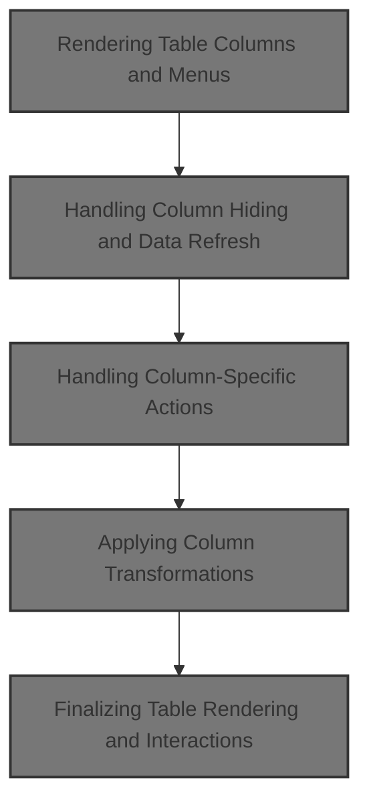

This document explains how users can customize and interact with a SQL table, including selecting columns and rows and performing actions such as hiding, sorting, casting, transforming, and filtering columns. User actions are immediately reflected in the table view, ensuring a dynamic and responsive experience.



# Rendering Table Columns and Menus

```mermaid
%%{init: {"flowchart": {"defaultRenderer": "elk"}} }%%
flowchart TD
  node1["Select columns and rows to display"]
  click node1 openCode "ui/src/components/widgets/sql/table/table.ts:167:173"
  subgraph loop1["For each displayed column"]
    node2["Applying Column Transformations"]
    
  end
  node2 --> node3["Apply user customizations to columns"]
  click node3 openCode "ui/src/components/widgets/sql/table/state.ts:345:357"
  node3 --> node4["Build table grid with customized columns"]
  click node4 openCode "ui/src/components/widgets/sql/table/table.ts:219:236"
  node4 --> node5["Render interactive SQL table"]
  click node5 openCode "ui/src/components/widgets/sql/table/table.ts:258:285"

classDef HeadingStyle fill:#777777,stroke:#333,stroke-width:2px;
click node2 goToHeading "Handling Column Hiding and Data Refresh"
node2:::HeadingStyle
click node2 goToHeading "Applying Column Transformations"
node2:::HeadingStyle

%% Swimm:
%% %%{init: {"flowchart": {"defaultRenderer": "elk"}} }%%
%% flowchart TD
%%   node1["Select columns and rows to display"]
%%   click node1 openCode "<SwmPath>[ui/…/table/table.ts](ui/src/components/widgets/sql/table/table.ts)</SwmPath>:167:173"
%%   subgraph loop1["For each displayed column"]
%%     node2["Applying Column Transformations"]
%%     
%%   end
%%   node2 --> node3["Apply user customizations to columns"]
%%   click node3 openCode "<SwmPath>[ui/…/table/state.ts](ui/src/components/widgets/sql/table/state.ts)</SwmPath>:345:357"
%%   node3 --> node4["Build table grid with customized columns"]
%%   click node4 openCode "<SwmPath>[ui/…/table/table.ts](ui/src/components/widgets/sql/table/table.ts)</SwmPath>:219:236"
%%   node4 --> node5["Render interactive SQL table"]
%%   click node5 openCode "<SwmPath>[ui/…/table/table.ts](ui/src/components/widgets/sql/table/table.ts)</SwmPath>:258:285"
%% 
%% classDef HeadingStyle fill:#777777,stroke:#333,stroke-width:2px;
%% click node2 goToHeading "Handling Column Hiding and Data Refresh"
%% node2:::HeadingStyle
%% click node2 goToHeading "Applying Column Transformations"
%% node2:::HeadingStyle
```



<SwmSnippet path="/ui/src/components/widgets/sql/table/table.ts" line="166">

---

In <SwmToken path="ui/src/components/widgets/sql/table/table.ts" pos="166:1:1" line-data="  view({attrs}: m.Vnode&lt;SqlTableConfig&gt;) {">`view`</SwmToken>, we start by grabbing the rows and columns to display, then build up the menu items for each column. We need to call <SwmPath>[ui/…/table/state.ts](ui/src/components/widgets/sql/table/state.ts)</SwmPath> next because that's where the logic for hiding, sorting, and updating columns lives, so any user action on these menus needs to update the state there.

```typescript
  view({attrs}: m.Vnode<SqlTableConfig>) {
    const rows = this.state.getDisplayedRows();
    const additionalColumnMenuItems = this.getAdditionalColumnMenuItems(
      attrs.addColumnMenuItems,
    );

    const columns = this.state.getSelectedColumns();

    // Build VirtualGrid columns
    const virtualGridColumns = columns.map((column, i) => {
      const sorted = this.state.isSortedBy(column);
      const menuItems: m.Children = [
        renderSortMenuItems(sorted, (direction) =>
          this.state.sortBy({column, direction}),
        ),
        m(MenuDivider),
        this.state.getSelectedColumns().length > 1 &&
          m(MenuItem, {
            label: 'Hide',
            icon: Icons.Hide,
            onclick: () => this.state.hideColumnAtIndex(i),
          }),
```

---

</SwmSnippet>

## Handling Column Hiding and Data Refresh

<SwmSnippet path="/ui/src/components/widgets/sql/table/state.ts" line="345">

---

<SwmToken path="ui/src/components/widgets/sql/table/state.ts" pos="345:1:1" line-data="  hideColumnAtIndex(index: number) {">`hideColumnAtIndex`</SwmToken> removes the column, triggers any cleanup via <SwmToken path="ui/src/components/widgets/sql/table/state.ts" pos="348:3:3" line-data="    this.willRemoveColumn(column);">`willRemoveColumn`</SwmToken>, and then reloads the table data to update the UI. We need to call reload here to make sure the table reflects the new column set.

```typescript
  hideColumnAtIndex(index: number) {
    const column = this.columns[index];
    this.columns.splice(index, 1);
    this.willRemoveColumn(column);
    // TODO(altimin): we can avoid the fetch here if the orderBy hasn't changed.
    this.reload({offset: 'keep'});
  }
```

---

</SwmSnippet>

<SwmSnippet path="/ui/src/components/widgets/sql/table/state.ts" line="251">

---

<SwmToken path="ui/src/components/widgets/sql/table/state.ts" pos="251:5:5" line-data="  private async reload(params?: {offset: &#39;reset&#39; | &#39;keep&#39;}) {">`reload`</SwmToken> resets the offset if needed, checks if filters changed, clears current data, and builds a new request. It schedules a redraw after <SwmToken path="ui/src/components/widgets/sql/table/state.ts" pos="272:3:3" line-data="    // 50ms is half of the responsiveness threshold (100ms):">`50ms`</SwmToken> to avoid flicker, reloads row count if filters changed, loads new data, and only updates state if the request is still valid. Then it triggers a full redraw.

```typescript
  private async reload(params?: {offset: 'reset' | 'keep'}) {
    if ((params?.offset ?? 'reset') === 'reset') {
      this.offset = 0;
    }

    const newFilters = this.rowCount?.filters;
    const filtersMatch =
      newFilters && areFiltersEqual(newFilters, this.filters.get());
    this.data = undefined;
    const request = this.buildRequest();
    this.request = request;
    if (!filtersMatch) {
      this.rowCount = undefined;
    }

    // Schedule a full redraw to happen after a short delay (50 ms).
    // This is done to prevent flickering / visual noise and allow the UI to fetch
    // the initial data from the Trace Processor.
    // There is a chance that someone else schedules a full redraw in the
    // meantime, forcing the flicker, but in practice it works quite well and
    // avoids a lot of complexity for the callers.
    // 50ms is half of the responsiveness threshold (100ms):
    // https://web.dev/rail/#response-process-events-in-under-50ms
    setTimeout(() => raf.scheduleFullRedraw(), 50);

    if (!filtersMatch) {
      this.rowCount = await this.loadRowCount();
    }

    const data = await this.loadData();

    // If the request has changed since we started loading the data, do not update the state.
    if (this.request !== request) return;
    this.data = data;

    raf.scheduleFullRedraw();
  }
```

---

</SwmSnippet>

## Handling Column-Specific Actions

```mermaid
%%{init: {"flowchart": {"defaultRenderer": "elk"}} }%%
flowchart TD
  node1["Start: For each column in table"]
  click node1 openCode "ui/src/components/widgets/sql/table/table.ts:188:207"
  subgraph loop1["For each column in table"]
    node1 --> node2{"Does this column provide custom menu actions?"}
    click node2 openCode "ui/src/components/widgets/sql/table/table.ts:189:192"
    node2 -->|"Yes"| node3["Add custom menu actions to menu"]
    click node3 openCode "ui/src/components/widgets/sql/table/table.ts:189:192"
    node2 -->|"No"| node4["Proceed with standard menu actions"]
    click node4 openCode "ui/src/components/widgets/sql/table/table.ts:193:207"
    node3 --> node5["Show menu: cast, transform, filter, custom actions"]
    node4 --> node5
    click node5 openCode "ui/src/components/widgets/sql/table/table.ts:193:207"
  end
  node5 --> node6["Menu displayed to user"]
  click node6 openCode "ui/src/components/widgets/sql/table/table.ts:193:207"
classDef HeadingStyle fill:#777777,stroke:#333,stroke-width:2px;

%% Swimm:
%% %%{init: {"flowchart": {"defaultRenderer": "elk"}} }%%
%% flowchart TD
%%   node1["Start: For each column in table"]
%%   click node1 openCode "<SwmPath>[ui/…/table/table.ts](ui/src/components/widgets/sql/table/table.ts)</SwmPath>:188:207"
%%   subgraph loop1["For each column in table"]
%%     node1 --> node2{"Does this column provide custom menu actions?"}
%%     click node2 openCode "<SwmPath>[ui/…/table/table.ts](ui/src/components/widgets/sql/table/table.ts)</SwmPath>:189:192"
%%     node2 -->|"Yes"| node3["Add custom menu actions to menu"]
%%     click node3 openCode "<SwmPath>[ui/…/table/table.ts](ui/src/components/widgets/sql/table/table.ts)</SwmPath>:189:192"
%%     node2 -->|"No"| node4["Proceed with standard menu actions"]
%%     click node4 openCode "<SwmPath>[ui/…/table/table.ts](ui/src/components/widgets/sql/table/table.ts)</SwmPath>:193:207"
%%     node3 --> node5["Show menu: cast, transform, filter, custom actions"]
%%     node4 --> node5
%%     click node5 openCode "<SwmPath>[ui/…/table/table.ts](ui/src/components/widgets/sql/table/table.ts)</SwmPath>:193:207"
%%   end
%%   node5 --> node6["Menu displayed to user"]
%%   click node6 openCode "<SwmPath>[ui/…/table/table.ts](ui/src/components/widgets/sql/table/table.ts)</SwmPath>:193:207"
%% classDef HeadingStyle fill:#777777,stroke:#333,stroke-width:2px;
```



<SwmSnippet path="/ui/src/components/widgets/sql/table/table.ts" line="188">

---

Back in `SqlTable.view`, after handling column hiding, we check if the column provides its own menu items and let it trigger actions like replacing itself. We call <SwmPath>[ui/…/table/state.ts](ui/src/components/widgets/sql/table/state.ts)</SwmPath> again to update the table state when a column is replaced.

```typescript
        // Use the new getColumnSpecificMenuItems method if available
        column.getColumnSpecificMenuItems?.({
          replaceColumn: (newColumn: TableColumn) =>
            this.state.replaceColumnAtIndex(i, newColumn),
        }),
```

---

</SwmSnippet>

<SwmSnippet path="/ui/src/components/widgets/sql/table/state.ts" line="353">

---

<SwmToken path="ui/src/components/widgets/sql/table/state.ts" pos="353:1:1" line-data="  replaceColumnAtIndex(index: number, column: TableColumn) {">`replaceColumnAtIndex`</SwmToken> runs cleanup for the old column, swaps in the new one, and reloads the table to update the UI. We need to call reload here so the table reflects the new column immediately.

```typescript
  replaceColumnAtIndex(index: number, column: TableColumn) {
    this.willRemoveColumn(this.columns[index]);
    this.columns[index] = column;
    this.reload({offset: 'keep'});
  }
```

---

</SwmSnippet>

<SwmSnippet path="/ui/src/components/widgets/sql/table/table.ts" line="193">

---

Back in `SqlTable.view`, after handling column replacement, we add a 'Cast' menu for each column. We call <SwmPath>[ui/…/menus/cast_column_menu.ts](ui/src/components/widgets/sql/table/menus/cast_column_menu.ts)</SwmPath> next to let users change the column's type, which updates the table state if they do.

```typescript
        m(
          MenuItem,
          {label: 'Cast', icon: Icons.Change},
          renderCastColumnMenu(column, i, this.state),
        ),
```

---

</SwmSnippet>

<SwmSnippet path="/ui/src/components/widgets/sql/table/menus/cast_column_menu.ts" line="118">

---

<SwmToken path="ui/src/components/widgets/sql/table/menus/cast_column_menu.ts" pos="118:4:4" line-data="export function renderCastColumnMenu(">`renderCastColumnMenu`</SwmToken> builds menu items for casting a column to different types. It checks if a SQL CAST is needed or just a reinterpretation, wraps the column in a <SwmToken path="ui/src/components/widgets/sql/table/menus/cast_column_menu.ts" pos="134:13:13" line-data="          // If this is already a CastColumn, get the original source column.">`CastColumn`</SwmToken>, and calls <SwmToken path="ui/src/components/widgets/sql/table/menus/cast_column_menu.ts" pos="166:3:5" line-data="          return state.replaceColumnAtIndex(columnIndex, castColumn);">`state.replaceColumnAtIndex`</SwmToken> to update the table.

```typescript
export function renderCastColumnMenu(
  column: TableColumn,
  columnIndex: number,
  state: SqlTableState,
): m.Children {
  return Object.entries(CASTS)
    .filter(([_, params]) => {
      if (column.type === undefined) {
        return true;
      }
      return !typesEqual(params.type, column.type);
    })
    .map(([label, params]) =>
      m(MenuItem, {
        label,
        onclick: () => {
          // If this is already a CastColumn, get the original source column.
          const columnToCast: TableColumn =
            column instanceof CastColumn ? column.sourceColumn : column;

          const castExpression = (() => {
            if (
              columnToCast.type !== undefined &&
              underlyingSqlType(columnToCast.type) ===
                underlyingSqlType(params.type)
            ) {
              // If the underlying types are the same, there is no need for a SQL cast, we only need to reinterpret the data.
              return (cols: string[]) => cols[0];
            }
            return (cols: string[]) =>
              `CAST(${cols[0]} AS ${underlyingSqlType(params.type)})`;
          })();

          // Create a CastColumn wrapping the source column
          const castColumn = new CastColumn(
            createTableColumn({
              column: new SqlExpression(
                castExpression,
                [columnToCast.column],
                `cast<${label}>(${sqlColumnId(columnToCast.column)})`,
              ),
              trace: state.trace,
              type: params.type,
            }),
            columnToCast,
            params.type,
          );

          return state.replaceColumnAtIndex(columnIndex, castColumn);
        },
      }),
    );
}
```

---

</SwmSnippet>

<SwmSnippet path="/ui/src/components/widgets/sql/table/table.ts" line="198">

---

Back in `SqlTable.view`, after handling casting, we add a transform menu for each column. We call <SwmPath>[ui/…/menus/transform_column_menu.ts](ui/src/components/widgets/sql/table/menus/transform_column_menu.ts)</SwmPath> next so users can apply transformations, which updates the table if they do.

```typescript
        renderTransformColumnMenu(column, i, this.state),
        m(
          MenuItem,
          {label: 'Add filter', icon: Icons.Filter},
          renderColumnFilterOptions(column, this.state),
        ),
        additionalColumnMenuItems &&
          additionalColumnMenuItems[
            this.state.getCurrentRequest().columns[sqlColumnId(column.column)]
          ],
```

---

</SwmSnippet>

## Applying Column Transformations

<SwmSnippet path="/ui/src/components/widgets/sql/table/menus/transform_column_menu.ts" line="292">

---

<SwmToken path="ui/src/components/widgets/sql/table/menus/transform_column_menu.ts" pos="292:4:4" line-data="export function renderTransformColumnMenu(">`renderTransformColumnMenu`</SwmToken> filters available transforms for the column, builds menu items, and calls <SwmToken path="ui/src/components/widgets/sql/table/menus/transform_column_menu.ts" pos="323:1:3" line-data="                  state.addColumn(">`state.addColumn`</SwmToken> to insert the transformed column after the original. If a transform needs parameters, it shows a config menu before adding.

```typescript
export function renderTransformColumnMenu(
  column: TableColumn,
  columnIndex: number,
  state: SqlTableState,
): m.Children {
  const applicableTransforms = (
    Object.entries(TRANSFORMS) as [TransformType, Transform][]
  ).filter(
    ([_, transform]) =>
      transform.requiredType === undefined ||
      (column.type !== undefined &&
        typesEqual(transform.requiredType, column.type)),
  );

  // Only show the Transform menu if there are applicable transformations
  if (applicableTransforms.length === 0) {
    return null;
  }

  return m(
    MenuItem,
    {label: 'Transform', icon: Icons.ApplyFunction},
    applicableTransforms.map(([name, transform]) => {
      const paramCount = transform.parameters?.length ?? 0;
      return m(
        MenuItem,
        {
          label: name,
          onclick:
            paramCount === 0
              ? () =>
                  state.addColumn(
                    applyTransform({
                      column,
                      state,
                      transformType: name,
                      values: [],
                    }),
                    columnIndex,
                  )
              : undefined,
        },
        paramCount !== 0 &&
          m(ConfigureTransformMenu, {
            column,
            state,
            transformType: name,
            onApply: (column: TableColumn) =>
              state.addColumn(column, columnIndex),
            formSubmitLabel: 'Add',
          }),
      );
    }),
  );
}
```

---

</SwmSnippet>

<SwmSnippet path="/ui/src/components/widgets/sql/table/state.ts" line="340">

---

<SwmToken path="ui/src/components/widgets/sql/table/state.ts" pos="340:1:1" line-data="  addColumn(column: TableColumn, index: number) {">`addColumn`</SwmToken> inserts the new column right after the specified index and reloads the table to update the UI. This keeps the offset and assumes the index is valid.

```typescript
  addColumn(column: TableColumn, index: number) {
    this.columns.splice(index + 1, 0, column);
    this.reload({offset: 'keep'});
  }
```

---

</SwmSnippet>

## Finalizing Table Rendering and Interactions

```mermaid
%%{init: {"flowchart": {"defaultRenderer": "elk"}} }%%
flowchart TD
  node1["Prepare columns for display"]
  click node1 openCode "ui/src/components/widgets/sql/table/table.ts:208:217"
  node1 --> node2["Render table grid"]
  click node2 openCode "ui/src/components/widgets/sql/table/table.ts:258:280"
  subgraph loop1["For each row and column"]
    node2 --> node3["Render cell"]
    click node3 openCode "ui/src/components/widgets/sql/table/table.ts:239:255"
    node3 --> node2
  end
  node2 --> node4{"User reorders columns?"}
  click node4 openCode "ui/src/components/widgets/sql/table/table.ts:264:279"
  node4 -->|"Yes"| node5["Update column order"]
  click node5 openCode "ui/src/components/widgets/sql/table/table.ts:266:277"
  node4 -->|"No"| node6["Continue"]
  node2 --> node7{"Is table loading?"}
  click node7 openCode "ui/src/components/widgets/sql/table/table.ts:281:281"
  node7 -->|"Yes"| node8["Show loading spinner"]
  click node8 openCode "ui/src/components/widgets/sql/table/table.ts:281:281"
  node7 -->|"No"| node9["Continue"]
  node2 --> node10{"Is there a query error?"}
  click node10 openCode "ui/src/components/widgets/sql/table/table.ts:282:283"
  node10 -->|"Yes"| node11["Show error message"]
  click node11 openCode "ui/src/components/widgets/sql/table/table.ts:283:284"
  node10 -->|"No"| node12["Show table to user"]
  click node12 openCode "ui/src/components/widgets/sql/table/table.ts:258:280"

classDef HeadingStyle fill:#777777,stroke:#333,stroke-width:2px;

%% Swimm:
%% %%{init: {"flowchart": {"defaultRenderer": "elk"}} }%%
%% flowchart TD
%%   node1["Prepare columns for display"]
%%   click node1 openCode "<SwmPath>[ui/…/table/table.ts](ui/src/components/widgets/sql/table/table.ts)</SwmPath>:208:217"
%%   node1 --> node2["Render table grid"]
%%   click node2 openCode "<SwmPath>[ui/…/table/table.ts](ui/src/components/widgets/sql/table/table.ts)</SwmPath>:258:280"
%%   subgraph loop1["For each row and column"]
%%     node2 --> node3["Render cell"]
%%     click node3 openCode "<SwmPath>[ui/…/table/table.ts](ui/src/components/widgets/sql/table/table.ts)</SwmPath>:239:255"
%%     node3 --> node2
%%   end
%%   node2 --> node4{"User reorders columns?"}
%%   click node4 openCode "<SwmPath>[ui/…/table/table.ts](ui/src/components/widgets/sql/table/table.ts)</SwmPath>:264:279"
%%   node4 -->|"Yes"| node5["Update column order"]
%%   click node5 openCode "<SwmPath>[ui/…/table/table.ts](ui/src/components/widgets/sql/table/table.ts)</SwmPath>:266:277"
%%   node4 -->|"No"| node6["Continue"]
%%   node2 --> node7{"Is table loading?"}
%%   click node7 openCode "<SwmPath>[ui/…/table/table.ts](ui/src/components/widgets/sql/table/table.ts)</SwmPath>:281:281"
%%   node7 -->|"Yes"| node8["Show loading spinner"]
%%   click node8 openCode "<SwmPath>[ui/…/table/table.ts](ui/src/components/widgets/sql/table/table.ts)</SwmPath>:281:281"
%%   node7 -->|"No"| node9["Continue"]
%%   node2 --> node10{"Is there a query error?"}
%%   click node10 openCode "<SwmPath>[ui/…/table/table.ts](ui/src/components/widgets/sql/table/table.ts)</SwmPath>:282:283"
%%   node10 -->|"Yes"| node11["Show error message"]
%%   click node11 openCode "<SwmPath>[ui/…/table/table.ts](ui/src/components/widgets/sql/table/table.ts)</SwmPath>:283:284"
%%   node10 -->|"No"| node12["Show table to user"]
%%   click node12 openCode "<SwmPath>[ui/…/table/table.ts](ui/src/components/widgets/sql/table/table.ts)</SwmPath>:258:280"
%% 
%% classDef HeadingStyle fill:#777777,stroke:#333,stroke-width:2px;
```



<SwmSnippet path="/ui/src/components/widgets/sql/table/table.ts" line="208">

---

Back in `SqlTable.view`, after handling all column menu actions, we build the grid columns and rows for rendering. Menu actions from earlier update the state, so the final table reflects all changes. We also handle column reordering, loading, and error display here.

```typescript
        // Menu items before divider apply to selected column
        m(MenuDivider),
        // Menu items after divider apply to entire table
        m(AddColumnMenuItem, {
          table: this,
          state: this.state,
          index: i,
        }),
      ];
      const columnKey = tableColumnId(column);

      const gridColumn: GridColumn = {
        key: columnKey,
        header: m(
          GridHeaderCell,
          {
            sort: sorted,
            onSort: (direction: SortDirection) => {
              this.state.sortBy({column, direction});
            },
            menuItems,
          },
          columnTitle(column),
        ),
        reorderable: {handle: 'column'},
      };

      return gridColumn;
    });

    // Build VirtualGrid rows
    const virtualGridRows = rows.map((row) => {
      return columns.map((col) => {
        const {content, menu, isNumerical, isNull} = renderCell(
          col,
          row,
          this.state,
        );
        return m(
          GridCell,
          {
            menuItems: menu,
            align: isNull ? 'center' : isNumerical ? 'right' : 'left',
            nullish: isNull,
          },
          content,
        );
      });
    });

    return [
      m(Grid, {
        className: 'sql-table',
        columns: virtualGridColumns,
        rowData: virtualGridRows,
        fillHeight: true,
        onColumnReorder: (from, to, position) => {
          if (typeof from === 'string' && typeof to === 'string') {
            // Convert column names to indices
            const fromIndex = columns.findIndex(
              (col) => tableColumnId(col) === from,
            );
            const toIndex = columns.findIndex(
              (col) => tableColumnId(col) === to,
            );

            if (fromIndex !== -1 && toIndex !== -1) {
              const targetIndex = position === 'before' ? toIndex : toIndex + 1;
              this.state.moveColumn(fromIndex, targetIndex);
            }
          }
        },
      }),
      this.state.isLoading() && m(Spinner),
      this.state.getQueryError() !== undefined &&
        m('.query-error', this.state.getQueryError()),
    ];
  }
```

---

</SwmSnippet>

&nbsp;

*This is an auto-generated document by Swimm 🌊 and has not yet been verified by a human*

<SwmMeta version="3.0.0" repo-id="Z2l0aHViJTNBJTNBY3BsdXNwbHVzLXBlcmZldHRvJTNBJTNBcmljYXJkb2xvcGV6Zw==" repo-name="cplusplus-perfetto"><sup>Powered by [Swimm](https://app.swimm.io/)</sup></SwmMeta>
