This document describes how users interact with the Data Explorer view to build and execute queries. Users configure queries, trigger execution, and receive results or error messages, with the interface updating to reflect the current status and outcome.

# Rendering the Query Data Shell

<SwmSnippet path="/ui/src/plugins/dev.perfetto.ExplorePage/query_builder/data_explorer.ts" line="56">

---

In <SwmToken path="ui/src/plugins/dev.perfetto.ExplorePage/query_builder/data_explorer.ts" pos="56:1:1" line-data="  view({attrs}: m.CVnode&lt;DataExplorerAttrs&gt;) {">`view`</SwmToken>, we start by rendering the shell and immediately call <SwmToken path="ui/src/plugins/dev.perfetto.ExplorePage/query_builder/data_explorer.ts" pos="62:6:6" line-data="        buttons: this.renderMenu(attrs),">`renderMenu`</SwmToken> to inject all the interactive controls for the query builder.

```typescript
  view({attrs}: m.CVnode<DataExplorerAttrs>) {
    return m(
      DetailsShell,
      {
        title: 'Query data',
        fillHeight: true,
        buttons: this.renderMenu(attrs),
      },
```

---

</SwmSnippet>

## Building the Query Action Menu

<SwmSnippet path="/ui/src/plugins/dev.perfetto.ExplorePage/query_builder/data_explorer.ts" line="68">

---

In <SwmToken path="ui/src/plugins/dev.perfetto.ExplorePage/query_builder/data_explorer.ts" pos="68:3:3" line-data="  private renderMenu(attrs: DataExplorerAttrs): m.Children {">`renderMenu`</SwmToken>, we set up the Run Query button and only show it if <SwmToken path="ui/src/plugins/dev.perfetto.ExplorePage/query_builder/data_explorer.ts" pos="69:3:3" line-data="    const autoExecute = attrs.node.state.autoExecute ?? true;">`autoExecute`</SwmToken> is off. The button's onclick is wired to <SwmToken path="ui/src/plugins/dev.perfetto.ExplorePage/query_builder/data_explorer.ts" pos="79:9:11" line-data="        onclick: () =&gt; attrs.onExecute(),">`attrs.onExecute`</SwmToken>, which hands off control to the query execution logic in <SwmPath>[ui/…/query_builder/builder.ts](ui/src/plugins/dev.perfetto.ExplorePage/query_builder/builder.ts)</SwmPath>. This bridges the UI controls with the actual query running process.

```typescript
  private renderMenu(attrs: DataExplorerAttrs): m.Children {
    const autoExecute = attrs.node.state.autoExecute ?? true;

    const runButton =
      !autoExecute &&
      m(Button, {
        label: 'Run Query',
        icon: 'play_arrow',
        intent: Intent.Primary,
        variant: ButtonVariant.Filled,
        disabled: !isAQuery(attrs.query) || !attrs.node.validate(),
        onclick: () => attrs.onExecute(),
      });

```

---

</SwmSnippet>

### Triggering Query Execution

<SwmSnippet path="/ui/src/plugins/dev.perfetto.ExplorePage/query_builder/builder.ts" line="318">

---

OnExecute resets the <SwmToken path="ui/src/plugins/dev.perfetto.ExplorePage/query_builder/builder.ts" pos="319:5:5" line-data="                // Reset queryExecuted flag to allow execution">`queryExecuted`</SwmToken> flag and calls <SwmToken path="ui/src/plugins/dev.perfetto.ExplorePage/query_builder/builder.ts" pos="322:3:3" line-data="                this.runQuery(selectedNode);">`runQuery`</SwmToken> with the selected node. This hands off control to the main query execution logic, making sure the query can be run again if needed.

```typescript
              onExecute: () => {
                // Reset queryExecuted flag to allow execution
                // Analysis has already happened, this.query is already set
                this.queryExecuted = false;
                this.runQuery(selectedNode);
              },
```

---

</SwmSnippet>

<SwmSnippet path="/ui/src/plugins/dev.perfetto.ExplorePage/query_builder/builder.ts" line="516">

---

RunQuery checks if the query can reuse an existing materialized table by hashing the query node. If the query changed, it drops the old materialization and creates a new one. After materialization, it fetches row count and schema for the UI, builds the response, and sets up the data source. Errors trigger cleanup and are surfaced to the UI. Node state is used to track materialization and caching.

```typescript
  private async runQuery(node: QueryNode) {
    if (
      this.query === undefined ||
      this.query instanceof Error ||
      this.queryExecuted
    ) {
      return;
    }

    this.isQueryRunning = true;
    const queryStartMs = performance.now();
    let tableName: string | undefined;
    let createdNewMaterialization = false;
    const currentQueryHash = hashNodeQuery(node);

    // If we can't get a hash, something is wrong with the node
    if (currentQueryHash === undefined) {
      this.handleQueryError(
        node,
        new Error('Cannot generate query hash - invalid node structure'),
      );
      this.isQueryRunning = false;
      return;
    }

    try {
      const engine = this.materializationService.getEngine();

      // Check if we can reuse existing materialization
      if (this.canReuseMaterialization(node, currentQueryHash)) {
        // Query hasn't changed, reuse existing materialized table
        tableName = node.state.materializationTableName!;
        console.log(
          `Reusing materialized table ${tableName} for node ${node.nodeId}`,
        );
      } else {
        // Query changed - drop old materialization if it exists
        if (node.state.materialized) {
          await this.materializationService.dropMaterialization(node);
        }

        // Materialize the new query
        tableName = await this.materializationService.materializeNode(
          node,
          this.query,
          currentQueryHash,
        );
        createdNewMaterialization = true;
      }

      // Fetch metadata: count and columns (we need both for the UI)
      // If these fail, we want to clean up the materialized table
      const [countQueryResult, schemaQueryResult] = await Promise.all([
        engine.query(`SELECT COUNT(*) as count FROM ${tableName}`),
        engine.query(`SELECT * FROM ${tableName} LIMIT 1`),
      ]);

      // Build response object with metadata
      const response: QueryResponse = {
        query: queryToRun(this.query),
        totalRowCount: Number(countQueryResult.firstRow({count: NUM}).count),
        durationMs: performance.now() - queryStartMs,
        columns: schemaQueryResult.columns(),
        rows: [], // SQLDataSource fetches rows on-demand
        statementCount: 1,
        statementWithOutputCount: 1,
        lastStatementSql: this.query.sql,
      };
      this.response = response;

      // Create data source for server-side pagination/filtering/sorting
      this.dataSource = new SQLDataSource(engine, `SELECT * FROM ${tableName}`);

      // Handle errors and warnings
      this.queryExecuted = true;
      this.setNodeIssuesFromResponse(node, this.query, this.response);

      // Update columns for SQL source nodes
      if (node instanceof SqlSourceNode && this.response !== undefined) {
        node.onQueryExecuted(this.response.columns);
        // Note: onQueryExecuted() calls notifyNextNodes() which triggers
        // re-analysis for downstream nodes without marking this node as changed.
        // We don't need to resetQueryState() here as that would clear the results display.
      }
    } catch (e) {
      // If we created a new materialization and it failed, clean it up
      if (createdNewMaterialization && tableName !== undefined) {
        try {
          await this.materializationService.dropMaterialization(node);
        } catch (dropError) {
          console.error('Failed to clean up materialized table:', dropError);
        }
      }
      this.handleQueryError(node, e);
    } finally {
      this.isQueryRunning = false;
      m.redraw();
    }
  }
```

---

</SwmSnippet>

### Updating Menu Status and Indicators

```mermaid
%%{init: {"flowchart": {"defaultRenderer": "elk"}} }%%
flowchart TD
  node1["Build menu UI"]
  click node1 openCode "ui/src/plugins/dev.perfetto.ExplorePage/query_builder/data_explorer.ts:82:160"
  node1 --> node2{"Status indicator"}
  click node2 openCode "ui/src/plugins/dev.perfetto.ExplorePage/query_builder/data_explorer.ts:84:89"
  node2 -->|"Analyzing & not running"| node3["Show 'Queued...'"]
  click node3 openCode "ui/src/plugins/dev.perfetto.ExplorePage/query_builder/data_explorer.ts:86:86"
  node2 -->|"Running"| node4["Show spinner"]
  click node4 openCode "ui/src/plugins/dev.perfetto.ExplorePage/query_builder/data_explorer.ts:88:88"
  node2 -->|"Else"| node5["No status indicator"]
  click node5 openCode "ui/src/plugins/dev.perfetto.ExplorePage/query_builder/data_explorer.ts:89:89"
  node1 --> node6{"Query stats"}
  click node6 openCode "ui/src/plugins/dev.perfetto.ExplorePage/query_builder/data_explorer.ts:124:131"
  node6 -->|"Query finished"| node7["Display row count and duration"]
  click node7 openCode "ui/src/plugins/dev.perfetto.ExplorePage/query_builder/data_explorer.ts:127:129"
  node6 -->|"No"| node8["No stats"]
  click node8 openCode "ui/src/plugins/dev.perfetto.ExplorePage/query_builder/data_explorer.ts:131:131"
  node1 --> node9{"Materialization indicator"}
  click node9 openCode "ui/src/plugins/dev.perfetto.ExplorePage/query_builder/data_explorer.ts:102:111"
  node9 -->|"Materialized"| node10["Show materialization info"]
  click node10 openCode "ui/src/plugins/dev.perfetto.ExplorePage/query_builder/data_explorer.ts:104:110"
  node9 -->|"No"| node11["No materialization info"]
  click node11 openCode "ui/src/plugins/dev.perfetto.ExplorePage/query_builder/data_explorer.ts:111:111"
  node1 --> node12["Show auto-execute switch"]
  click node12 openCode "ui/src/plugins/dev.perfetto.ExplorePage/query_builder/data_explorer.ts:91:99"
  node1 --> node13{"Full screen mode"}
  click node13 openCode "ui/src/plugins/dev.perfetto.ExplorePage/query_builder/data_explorer.ts:142:144"
  node13 -->|"Yes"| node14["Menu: Exit full screen"]
  click node14 openCode "ui/src/plugins/dev.perfetto.ExplorePage/query_builder/data_explorer.ts:143:143"
  node13 -->|"No"| node15["Menu: Full screen"]
  click node15 openCode "ui/src/plugins/dev.perfetto.ExplorePage/query_builder/data_explorer.ts:142:142"

classDef HeadingStyle fill:#777777,stroke:#333,stroke-width:2px;

%% Swimm:
%% %%{init: {"flowchart": {"defaultRenderer": "elk"}} }%%
%% flowchart TD
%%   node1["Build menu UI"]
%%   click node1 openCode "<SwmPath>[ui/…/query_builder/data_explorer.ts](ui/src/plugins/dev.perfetto.ExplorePage/query_builder/data_explorer.ts)</SwmPath>:82:160"
%%   node1 --> node2{"Status indicator"}
%%   click node2 openCode "<SwmPath>[ui/…/query_builder/data_explorer.ts](ui/src/plugins/dev.perfetto.ExplorePage/query_builder/data_explorer.ts)</SwmPath>:84:89"
%%   node2 -->|"Analyzing & not running"| node3["Show 'Queued...'"]
%%   click node3 openCode "<SwmPath>[ui/…/query_builder/data_explorer.ts](ui/src/plugins/dev.perfetto.ExplorePage/query_builder/data_explorer.ts)</SwmPath>:86:86"
%%   node2 -->|"Running"| node4["Show spinner"]
%%   click node4 openCode "<SwmPath>[ui/…/query_builder/data_explorer.ts](ui/src/plugins/dev.perfetto.ExplorePage/query_builder/data_explorer.ts)</SwmPath>:88:88"
%%   node2 -->|"Else"| node5["No status indicator"]
%%   click node5 openCode "<SwmPath>[ui/…/query_builder/data_explorer.ts](ui/src/plugins/dev.perfetto.ExplorePage/query_builder/data_explorer.ts)</SwmPath>:89:89"
%%   node1 --> node6{"Query stats"}
%%   click node6 openCode "<SwmPath>[ui/…/query_builder/data_explorer.ts](ui/src/plugins/dev.perfetto.ExplorePage/query_builder/data_explorer.ts)</SwmPath>:124:131"
%%   node6 -->|"Query finished"| node7["Display row count and duration"]
%%   click node7 openCode "<SwmPath>[ui/…/query_builder/data_explorer.ts](ui/src/plugins/dev.perfetto.ExplorePage/query_builder/data_explorer.ts)</SwmPath>:127:129"
%%   node6 -->|"No"| node8["No stats"]
%%   click node8 openCode "<SwmPath>[ui/…/query_builder/data_explorer.ts](ui/src/plugins/dev.perfetto.ExplorePage/query_builder/data_explorer.ts)</SwmPath>:131:131"
%%   node1 --> node9{"Materialization indicator"}
%%   click node9 openCode "<SwmPath>[ui/…/query_builder/data_explorer.ts](ui/src/plugins/dev.perfetto.ExplorePage/query_builder/data_explorer.ts)</SwmPath>:102:111"
%%   node9 -->|"Materialized"| node10["Show materialization info"]
%%   click node10 openCode "<SwmPath>[ui/…/query_builder/data_explorer.ts](ui/src/plugins/dev.perfetto.ExplorePage/query_builder/data_explorer.ts)</SwmPath>:104:110"
%%   node9 -->|"No"| node11["No materialization info"]
%%   click node11 openCode "<SwmPath>[ui/…/query_builder/data_explorer.ts](ui/src/plugins/dev.perfetto.ExplorePage/query_builder/data_explorer.ts)</SwmPath>:111:111"
%%   node1 --> node12["Show <SwmToken path="ui/src/plugins/dev.perfetto.ExplorePage/query_builder/builder.ts" pos="244:20:22" line-data="                // Either we have materialized data to reuse, or auto-execute is on">`auto-execute`</SwmToken> switch"]
%%   click node12 openCode "<SwmPath>[ui/…/query_builder/data_explorer.ts](ui/src/plugins/dev.perfetto.ExplorePage/query_builder/data_explorer.ts)</SwmPath>:91:99"
%%   node1 --> node13{"Full screen mode"}
%%   click node13 openCode "<SwmPath>[ui/…/query_builder/data_explorer.ts](ui/src/plugins/dev.perfetto.ExplorePage/query_builder/data_explorer.ts)</SwmPath>:142:144"
%%   node13 -->|"Yes"| node14["Menu: Exit full screen"]
%%   click node14 openCode "<SwmPath>[ui/…/query_builder/data_explorer.ts](ui/src/plugins/dev.perfetto.ExplorePage/query_builder/data_explorer.ts)</SwmPath>:143:143"
%%   node13 -->|"No"| node15["Menu: Full screen"]
%%   click node15 openCode "<SwmPath>[ui/…/query_builder/data_explorer.ts](ui/src/plugins/dev.perfetto.ExplorePage/query_builder/data_explorer.ts)</SwmPath>:142:142"
%% 
%% classDef HeadingStyle fill:#777777,stroke:#333,stroke-width:2px;
```



<SwmSnippet path="/ui/src/plugins/dev.perfetto.ExplorePage/query_builder/data_explorer.ts" line="82">

---

Back in DataExplorer.renderMenu, after returning from <SwmPath>[ui/…/query_builder/builder.ts](ui/src/plugins/dev.perfetto.ExplorePage/query_builder/builder.ts)</SwmPath>, we update the menu to show execution status (spinner, stats, materialization icon) and adjust controls based on the latest query state. This keeps the UI in sync with what's happening in the backend.

```typescript
    // Show "Queued..." when analyzing (validating query)
    // Show spinner when actually executing the query
    const statusIndicator =
      attrs.isAnalyzing && !attrs.isQueryRunning
        ? m('span.status-indicator', 'Queued...')
        : attrs.isQueryRunning
          ? m(Spinner)
          : null;

    const autoExecuteSwitch = m(Switch, {
      label: 'Auto Execute',
      checked: autoExecute,
      onchange: (e: Event) => {
        const target = e.target as HTMLInputElement;
        attrs.node.state.autoExecute = target.checked;
        attrs.onchange?.();
      },
    });

    // Add materialization indicator icon with tooltip
    const materializationIndicator =
      attrs.node.state.materialized && attrs.node.state.materializationTableName
        ? m(
            Tooltip,
            {
              trigger: m(Icon, {icon: 'database'}),
            },
            `Materialized as ${attrs.node.state.materializationTableName}`,
          )
        : null;

    // Helper to create separator dot
    const separator = () =>
      m(
        'span.pf-query-stats-separator',
        {
          'aria-hidden': 'true',
        },
        '•',
      );

    // Add query stats display (row count and duration)
    const queryStats =
      attrs.response && !attrs.isQueryRunning
        ? m('.pf-query-stats', [
            m('span', `${attrs.response.totalRowCount.toLocaleString()} rows`),
            separator(),
            m('span', `${attrs.response.durationMs.toFixed(1)}ms`),
          ])
        : null;

    const positionMenu = m(
      PopupMenu,
      {
        trigger: m(Button, {
          icon: Icons.ContextMenuAlt,
        }),
      },
      [
        m(MenuItem, {
          label: attrs.isFullScreen ? 'Exit full screen' : 'Full screen',
          onclick: () => attrs.onFullScreenToggle(),
        }),
      ],
    );

    return [
      runButton,
      statusIndicator,
      queryStats,
      queryStats !== null && materializationIndicator !== null
        ? separator()
        : null,
      materializationIndicator,
      materializationIndicator !== null ? separator() : null,
      autoExecuteSwitch,
      positionMenu,
    ];
  }
```

---

</SwmSnippet>

## Rendering Query Results and Errors

```mermaid
%%{init: {"flowchart": {"defaultRenderer": "elk"}} }%%
flowchart TD
  node1["User opens Data Explorer view"]
  click node1 openCode "ui/src/plugins/dev.perfetto.ExplorePage/query_builder/data_explorer.ts:162:331"
  node1 --> node2{"Any error present?"}
  node2 -->|"Validation error"| node3["Show validation error message"]
  click node3 openCode "ui/src/plugins/dev.perfetto.ExplorePage/query_builder/data_explorer.ts:166:178"
  node2 -->|"Execution error"| node4["Show execution error message"]
  click node4 openCode "ui/src/plugins/dev.perfetto.ExplorePage/query_builder/data_explorer.ts:181:190"
  node2 -->|"Response error"| node5["Show response error message"]
  click node5 openCode "ui/src/plugins/dev.perfetto.ExplorePage/query_builder/data_explorer.ts:193:205"
  node2 -->|"Data error"| node6["Show data error message"]
  click node6 openCode "ui/src/plugins/dev.perfetto.ExplorePage/query_builder/data_explorer.ts:208:220"
  node2 -->|"No error"| node7{"Query running?"}
  node7 -->|"Yes"| node8["Show spinner"]
  click node8 openCode "ui/src/plugins/dev.perfetto.ExplorePage/query_builder/data_explorer.ts:223:238"
  node7 -->|"No"| node9{"No query available?"}
  node9 -->|"Yes"| node10["Show 'No data to display'"]
  click node10 openCode "ui/src/plugins/dev.perfetto.ExplorePage/query_builder/data_explorer.ts:241:243"
  node9 -->|"No"| node11{"Valid response and data source?"}
  node11 -->|"Yes"| node12{"Multiple statements returned results?"}
  node12 -->|"Yes"| node13["Show warning for multiple statements and data grid"]
  click node13 openCode "ui/src/plugins/dev.perfetto.ExplorePage/query_builder/data_explorer.ts:247:261"
  node12 -->|"No"| node14["Show data grid"]
  click node14 openCode "ui/src/plugins/dev.perfetto.ExplorePage/query_builder/data_explorer.ts:264:307"
  node11 -->|"No"| node15{"Query ready but not executed and auto-execute off?"}
  node15 -->|"Yes"| node16["Show 'Run Query' button"]
  click node16 openCode "ui/src/plugins/dev.perfetto.ExplorePage/query_builder/data_explorer.ts:311:327"

classDef HeadingStyle fill:#777777,stroke:#333,stroke-width:2px;

%% Swimm:
%% %%{init: {"flowchart": {"defaultRenderer": "elk"}} }%%
%% flowchart TD
%%   node1["User opens Data Explorer view"]
%%   click node1 openCode "<SwmPath>[ui/…/query_builder/data_explorer.ts](ui/src/plugins/dev.perfetto.ExplorePage/query_builder/data_explorer.ts)</SwmPath>:162:331"
%%   node1 --> node2{"Any error present?"}
%%   node2 -->|"Validation error"| node3["Show validation error message"]
%%   click node3 openCode "<SwmPath>[ui/…/query_builder/data_explorer.ts](ui/src/plugins/dev.perfetto.ExplorePage/query_builder/data_explorer.ts)</SwmPath>:166:178"
%%   node2 -->|"Execution error"| node4["Show execution error message"]
%%   click node4 openCode "<SwmPath>[ui/…/query_builder/data_explorer.ts](ui/src/plugins/dev.perfetto.ExplorePage/query_builder/data_explorer.ts)</SwmPath>:181:190"
%%   node2 -->|"Response error"| node5["Show response error message"]
%%   click node5 openCode "<SwmPath>[ui/…/query_builder/data_explorer.ts](ui/src/plugins/dev.perfetto.ExplorePage/query_builder/data_explorer.ts)</SwmPath>:193:205"
%%   node2 -->|"Data error"| node6["Show data error message"]
%%   click node6 openCode "<SwmPath>[ui/…/query_builder/data_explorer.ts](ui/src/plugins/dev.perfetto.ExplorePage/query_builder/data_explorer.ts)</SwmPath>:208:220"
%%   node2 -->|"No error"| node7{"Query running?"}
%%   node7 -->|"Yes"| node8["Show spinner"]
%%   click node8 openCode "<SwmPath>[ui/…/query_builder/data_explorer.ts](ui/src/plugins/dev.perfetto.ExplorePage/query_builder/data_explorer.ts)</SwmPath>:223:238"
%%   node7 -->|"No"| node9{"No query available?"}
%%   node9 -->|"Yes"| node10["Show 'No data to display'"]
%%   click node10 openCode "<SwmPath>[ui/…/query_builder/data_explorer.ts](ui/src/plugins/dev.perfetto.ExplorePage/query_builder/data_explorer.ts)</SwmPath>:241:243"
%%   node9 -->|"No"| node11{"Valid response and data source?"}
%%   node11 -->|"Yes"| node12{"Multiple statements returned results?"}
%%   node12 -->|"Yes"| node13["Show warning for multiple statements and data grid"]
%%   click node13 openCode "<SwmPath>[ui/…/query_builder/data_explorer.ts](ui/src/plugins/dev.perfetto.ExplorePage/query_builder/data_explorer.ts)</SwmPath>:247:261"
%%   node12 -->|"No"| node14["Show data grid"]
%%   click node14 openCode "<SwmPath>[ui/…/query_builder/data_explorer.ts](ui/src/plugins/dev.perfetto.ExplorePage/query_builder/data_explorer.ts)</SwmPath>:264:307"
%%   node11 -->|"No"| node15{"Query ready but not executed and <SwmToken path="ui/src/plugins/dev.perfetto.ExplorePage/query_builder/builder.ts" pos="244:20:22" line-data="                // Either we have materialized data to reuse, or auto-execute is on">`auto-execute`</SwmToken> off?"}
%%   node15 -->|"Yes"| node16["Show 'Run Query' button"]
%%   click node16 openCode "<SwmPath>[ui/…/query_builder/data_explorer.ts](ui/src/plugins/dev.perfetto.ExplorePage/query_builder/data_explorer.ts)</SwmPath>:311:327"
%% 
%% classDef HeadingStyle fill:#777777,stroke:#333,stroke-width:2px;
```



<SwmSnippet path="/ui/src/plugins/dev.perfetto.ExplorePage/query_builder/data_explorer.ts" line="64">

---

DataExplorer.view calls <SwmToken path="ui/src/plugins/dev.perfetto.ExplorePage/query_builder/data_explorer.ts" pos="64:3:3" line-data="      this.renderContent(attrs),">`renderContent`</SwmToken> to show results or errors after the menu is set up.

```typescript
      this.renderContent(attrs),
    );
  }
```

---

</SwmSnippet>

<SwmSnippet path="/ui/src/plugins/dev.perfetto.ExplorePage/query_builder/data_explorer.ts" line="162">

---

RenderContent shows errors, spinners, or results depending on the query state, and triggers <SwmPath>[ui/…/query_builder/builder.ts](ui/src/plugins/dev.perfetto.ExplorePage/query_builder/builder.ts)</SwmPath> for new data when needed.

```typescript
  private renderContent(attrs: DataExplorerAttrs): m.Children {
    const errors = findErrors(attrs.query, attrs.response);

    // Show validation errors with centered warning icon
    if (!attrs.node.validate() && attrs.node.state.issues?.queryError) {
      return m(
        '.pf-data-explorer-empty-state',
        m(Icon, {
          className: 'pf-data-explorer-warning-icon',
          icon: 'warning',
        }),
        m(
          '.pf-data-explorer-warning-message',
          attrs.node.state.issues.queryError.message,
        ),
      );
    }

    // Show execution errors with centered warning icon
    if (errors) {
      return m(
        '.pf-data-explorer-empty-state',
        m(Icon, {
          className: 'pf-data-explorer-warning-icon',
          icon: 'warning',
        }),
        m('.pf-data-explorer-warning-message', `Error: ${errors.message}`),
      );
    }

    // Show response warnings with centered warning icon
    if (attrs.node.state.issues?.responseError) {
      return m(
        '.pf-data-explorer-empty-state',
        m(Icon, {
          className: 'pf-data-explorer-warning-icon',
          icon: 'warning',
        }),
        m(
          '.pf-data-explorer-warning-message',
          attrs.node.state.issues.responseError.message,
        ),
      );
    }

    // Show data errors (like "no rows returned") with centered warning icon
    if (attrs.node.state.issues?.dataError) {
      return m(
        '.pf-data-explorer-empty-state',
        m(Icon, {
          className: 'pf-data-explorer-warning-icon',
          icon: 'warning',
        }),
        m(
          '.pf-data-explorer-warning-message',
          attrs.node.state.issues.dataError.message,
        ),
      );
    }

    // Show spinner overlay when query is running
    if (attrs.isQueryRunning) {
      return m(
        '.pf-data-explorer-empty-state',
        m(
          '.pf-exp-query-running-spinner',
          {
            style: {
              fontSize: '64px',
            },
          },
          m(Spinner, {
            easing: true,
          }),
        ),
      );
    }

    // Show "No data to display" when no query is available
    if (attrs.query === undefined) {
      return m(TextParagraph, {text: 'No data to display'});
    }

    if (attrs.response && attrs.dataSource && attrs.node.validate()) {
      // Show warning for multiple statements with centered icon
      const warning =
        attrs.response.statementWithOutputCount > 1
          ? m(
              '.pf-data-explorer-empty-state',
              m(Icon, {
                className: 'pf-data-explorer-warning-icon',
                icon: 'warning',
              }),
              m(
                '.pf-data-explorer-warning-message',
                `${attrs.response.statementWithOutputCount} out of ${attrs.response.statementCount} `,
                'statements returned a result. ',
                'Only the results for the last statement are displayed.',
              ),
            )
          : null;

      return [
        warning,
        m(DataGrid, {
          fillHeight: true,
          columns: attrs.response.columns.map((c) => ({name: c})),
          data: attrs.dataSource,
          showFiltersInToolbar: true,
          // We don't actually want the datagrid to display or apply any filters
          // to the datasource itself, so we define this but fix it as an empty
          // array.
          filters: [],
          onFilterAdd: (filter) => {
            // These are the filters supported by the explore page currently.
            const supportedOps = [
              '=',
              '!=',
              '<',
              '<=',
              '>',
              '>=',
              'glob',
              'is null',
              'is not null',
            ];
            if (supportedOps.includes(filter.op)) {
              if (attrs.onFilterAdd) {
                // Delegate to the parent handler which will create a FilterNode
                attrs.onFilterAdd(filter as FilterValue | FilterNull);
              } else {
                // Fallback: add filter directly to node state (legacy behavior)
                attrs.node.state.filters = [
                  ...(attrs.node.state.filters ?? []),
                  filter as FilterValue | FilterNull,
                ];
                attrs.onchange?.();
              }
            }
          },
          cellRenderer: (value: SqlValue, name: string) => {
            return renderCell(value, name);
          },
        }),
      ];
    }

    // Show a prominent execute button when query is ready but not executed
    const autoExecute = attrs.node.state.autoExecute ?? true;
    if (
      !autoExecute &&
      isAQuery(attrs.query) &&
      !attrs.response &&
      !attrs.isQueryRunning &&
      !attrs.isAnalyzing
    ) {
      return m(
        '.pf-data-explorer-empty-state',
        m(Button, {
          label: 'Run Query',
          icon: 'play_arrow',
          intent: Intent.Primary,
          variant: ButtonVariant.Filled,
          onclick: () => attrs.onExecute(),
        }),
      );
    }

    return null;
  }
```

---

</SwmSnippet>

&nbsp;

*This is an auto-generated document by Swimm 🌊 and has not yet been verified by a human*

<SwmMeta version="3.0.0" repo-id="Z2l0aHViJTNBJTNBY3BsdXNwbHVzLXBlcmZldHRvJTNBJTNBcmljYXJkb2xvcGV6Zw==" repo-name="cplusplus-perfetto"><sup>Powered by [Swimm](https://app.swimm.io/)</sup></SwmMeta>
