This document describes how the Day Explorer panel is set up for users analyzing trace data. As part of the trace analysis UI, users are presented with an interactive panel that adapts to available features and allows customization of displayed tracks and counters.

# Loading and Initializing Day Explorer UI

```mermaid
%%{init: {"flowchart": {"defaultRenderer": "elk"}} }%%
flowchart TD
    node1["Initialize plugin state for loaded trace"]
    click node1 openCode "ui/src/plugins/com.android.DayExplorer/index.ts:316:318"
    node1 --> node2["Determine supported features"]
    click node2 openCode "ui/src/plugins/com.android.DayExplorer/index.ts:320:321"
    node2 --> node3["Register Day Explorer panel in UI"]
    click node3 openCode "ui/src/plugins/com.android.DayExplorer/index.ts:323:325"
    node3 --> node4{"Is google3 feature available?"}
    click node4 openCode "ui/src/plugins/com.android.DayExplorer/index.ts:327"
    node4 -->|"Yes"| node5["Add advanced Day Explorer command"]
    click node5 openCode "ui/src/plugins/com.android.DayExplorer/index.ts:328:329"
    node4 -->|"No"| node6["Setup complete"]
    click node6 openCode "ui/src/plugins/com.android.DayExplorer/index.ts:330"

classDef HeadingStyle fill:#777777,stroke:#333,stroke-width:2px;

%% Swimm:
%% %%{init: {"flowchart": {"defaultRenderer": "elk"}} }%%
%% flowchart TD
%%     node1["Initialize plugin state for loaded trace"]
%%     click node1 openCode "<SwmPath>[ui/…/com.android.DayExplorer/index.ts](ui/src/plugins/com.android.DayExplorer/index.ts)</SwmPath>:316:318"
%%     node1 --> node2["Determine supported features"]
%%     click node2 openCode "<SwmPath>[ui/…/com.android.DayExplorer/index.ts](ui/src/plugins/com.android.DayExplorer/index.ts)</SwmPath>:320:321"
%%     node2 --> node3["Register Day Explorer panel in UI"]
%%     click node3 openCode "<SwmPath>[ui/…/com.android.DayExplorer/index.ts](ui/src/plugins/com.android.DayExplorer/index.ts)</SwmPath>:323:325"
%%     node3 --> node4{"Is <SwmToken path="ui/src/plugins/com.android.DayExplorer/index.ts" pos="66:1:1" line-data="          google3.wireless.android.telemetry.trace_extractor.modules.day_explorer.perfetto_ui_blames`,">`google3`</SwmToken> feature available?"}
%%     click node4 openCode "<SwmPath>[ui/…/com.android.DayExplorer/index.ts](ui/src/plugins/com.android.DayExplorer/index.ts)</SwmPath>:327"
%%     node4 -->|"Yes"| node5["Add advanced Day Explorer command"]
%%     click node5 openCode "<SwmPath>[ui/…/com.android.DayExplorer/index.ts](ui/src/plugins/com.android.DayExplorer/index.ts)</SwmPath>:328:329"
%%     node4 -->|"No"| node6["Setup complete"]
%%     click node6 openCode "<SwmPath>[ui/…/com.android.DayExplorer/index.ts](ui/src/plugins/com.android.DayExplorer/index.ts)</SwmPath>:330"
%% 
%% classDef HeadingStyle fill:#777777,stroke:#333,stroke-width:2px;
```



<SwmSnippet path="/ui/src/plugins/com.android.DayExplorer/index.ts" line="315">

---

OnTraceLoad kicks off the Day Explorer plugin setup by mounting its store, checking supported features, and registering the flame graph panel. If the <SwmToken path="ui/src/plugins/com.android.DayExplorer/index.ts" pos="327:9:9" line-data="    if (features.has(&#39;google3&#39;)) {">`google3`</SwmToken> feature is available, it proceeds to add the Day Explorer command, which unlocks further interactive capabilities for the user.

```typescript
  async onTraceLoad(ctx: Trace): Promise<void> {
    this.store = ctx.mountStore(DayExplorerPlugin.id, (init) =>
      this.migrateDayExplorerPluginState(init),
    );

    const support = this.support(ctx);
    const features = await support.features(ctx.engine);

    ctx.selection.registerAreaSelectionTab(
      this.createDayExplorerFlameGraphPanel(ctx),
    );

    if (features.has('google3')) {
      await this.addDayExplorerCommand(ctx, support, features);
    }
  }
```

---

</SwmSnippet>

# Registering Day Explorer Commands and Counters

```mermaid
%%{init: {"flowchart": {"defaultRenderer": "elk"}} }%%
flowchart TD
    node1{"Is google3 feature enabled?"}
    click node1 openCode "ui/src/plugins/com.android.DayExplorer/index.ts:290:312"
    node1 -->|"Yes"| node2["Register Day Explorer command"]
    click node2 openCode "ui/src/plugins/com.android.DayExplorer/index.ts:291:311"
    node1 -->|"No"| node6["End"]
    click node6 openCode "ui/src/plugins/com.android.DayExplorer/index.ts:313:313"
    node2 --> node3["Prompt user for maximum results"]
    click node3 openCode "ui/src/plugins/com.android.DayExplorer/index.ts:295:297"
    node3 --> node4{"Is input a valid positive number?"}
    click node4 openCode "ui/src/plugins/com.android.DayExplorer/index.ts:299:302"
    node4 -->|"Yes"| node5["Add usage and counters tracks"]
    click node5 openCode "ui/src/plugins/com.android.DayExplorer/index.ts:303:309"
    node4 -->|"No"| node7["Alert user: Positive number required"]
    click node7 openCode "ui/src/plugins/com.android.DayExplorer/index.ts:300:301"
    node7 --> node6
    node5 --> node6["Done"]

classDef HeadingStyle fill:#777777,stroke:#333,stroke-width:2px;

%% Swimm:
%% %%{init: {"flowchart": {"defaultRenderer": "elk"}} }%%
%% flowchart TD
%%     node1{"Is <SwmToken path="ui/src/plugins/com.android.DayExplorer/index.ts" pos="66:1:1" line-data="          google3.wireless.android.telemetry.trace_extractor.modules.day_explorer.perfetto_ui_blames`,">`google3`</SwmToken> feature enabled?"}
%%     click node1 openCode "<SwmPath>[ui/…/com.android.DayExplorer/index.ts](ui/src/plugins/com.android.DayExplorer/index.ts)</SwmPath>:290:312"
%%     node1 -->|"Yes"| node2["Register Day Explorer command"]
%%     click node2 openCode "<SwmPath>[ui/…/com.android.DayExplorer/index.ts](ui/src/plugins/com.android.DayExplorer/index.ts)</SwmPath>:291:311"
%%     node1 -->|"No"| node6["End"]
%%     click node6 openCode "<SwmPath>[ui/…/com.android.DayExplorer/index.ts](ui/src/plugins/com.android.DayExplorer/index.ts)</SwmPath>:313:313"
%%     node2 --> node3["Prompt user for maximum results"]
%%     click node3 openCode "<SwmPath>[ui/…/com.android.DayExplorer/index.ts](ui/src/plugins/com.android.DayExplorer/index.ts)</SwmPath>:295:297"
%%     node3 --> node4{"Is input a valid positive number?"}
%%     click node4 openCode "<SwmPath>[ui/…/com.android.DayExplorer/index.ts](ui/src/plugins/com.android.DayExplorer/index.ts)</SwmPath>:299:302"
%%     node4 -->|"Yes"| node5["Add usage and counters tracks"]
%%     click node5 openCode "<SwmPath>[ui/…/com.android.DayExplorer/index.ts](ui/src/plugins/com.android.DayExplorer/index.ts)</SwmPath>:303:309"
%%     node4 -->|"No"| node7["Alert user: Positive number required"]
%%     click node7 openCode "<SwmPath>[ui/…/com.android.DayExplorer/index.ts](ui/src/plugins/com.android.DayExplorer/index.ts)</SwmPath>:300:301"
%%     node7 --> node6
%%     node5 --> node6["Done"]
%% 
%% classDef HeadingStyle fill:#777777,stroke:#333,stroke-width:2px;
```



<SwmSnippet path="/ui/src/plugins/com.android.DayExplorer/index.ts" line="285">

---

AddDayExplorerCommand registers a command that, when triggered, prompts the user for a result limit and then calls <SwmToken path="ui/src/plugins/com.android.DayExplorer/index.ts" pos="304:5:5" line-data="          await this.addDayExplorerCounters(">`addDayExplorerCounters`</SwmToken> to actually add the relevant counters to the UI. This step is needed to let users interactively control how much data gets displayed.

```typescript
  async addDayExplorerCommand(
    ctx: Trace,
    support: SupportPlugin,
    features: Set<string>,
  ): Promise<void> {
    if (features.has('google3')) {
      ctx.commands.registerCommand({
        id: 'com.android.DayExplorerBlamesByCategory',
        name: 'Add tracks: Day Explorer',
        callback: async () => {
          const limitStr = await ctx.omnibox.prompt(
            'Maximum results per group',
          );
          const limit = Number(limitStr);
          if (!isFinite(limit) || limit <= 0) {
            alert('Positive number required');
            return;
          }
          await this.addDayExplorerUsage(ctx, support, 'Day Explorer');
          await this.addDayExplorerCounters(
            ctx,
            support,
            'Day Explorer',
            limit,
          );
        },
      });
    }
  }
```

---

</SwmSnippet>

<SwmSnippet path="/ui/src/plugins/com.android.DayExplorer/index.ts" line="58">

---

AddDayExplorerCounters loads the required Perfetto module for Day Explorer, gets or creates the group for organizing counters, and then kicks off the recursive addition of counters using <SwmToken path="ui/src/plugins/com.android.DayExplorer/index.ts" pos="70:16:17" line-data="    await this.addDayExplorerRecursive(ctx, group, limit, -1n);">`-1n`</SwmToken> as the starting value.

```typescript
  async addDayExplorerCounters(
    ctx: Trace,
    support: SupportPlugin,
    groupName: string,
    limit: number,
  ): Promise<void> {
    await ctx.engine.query(
      `INCLUDE PERFETTO MODULE
          google3.wireless.android.telemetry.trace_extractor.modules.day_explorer.perfetto_ui_blames`,
    );

    const group = support.getOrCreateGroup(ctx, groupName);
    await this.addDayExplorerRecursive(ctx, group, limit, -1n);
  }
```

---

</SwmSnippet>

&nbsp;

*This is an auto-generated document by Swimm 🌊 and has not yet been verified by a human*

<SwmMeta version="3.0.0" repo-id="Z2l0aHViJTNBJTNBY3BsdXNwbHVzLXBlcmZldHRvJTNBJTNBcmljYXJkb2xvcGV6Zw==" repo-name="cplusplus-perfetto"><sup>Powered by [Swimm](https://app.swimm.io/)</sup></SwmMeta>
