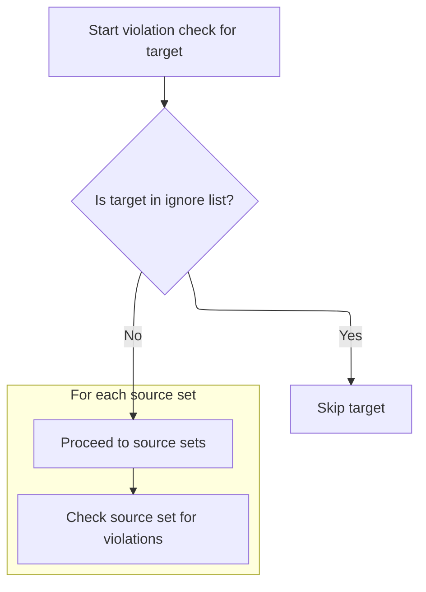
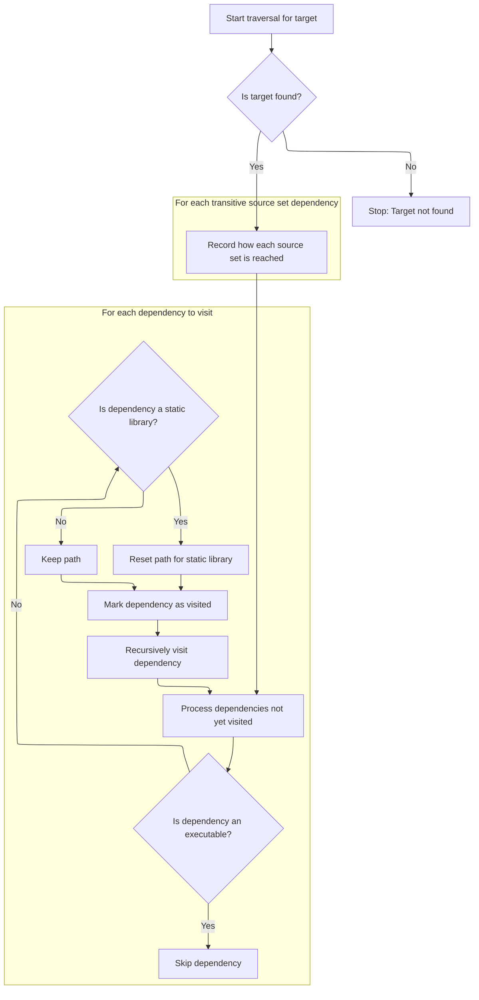
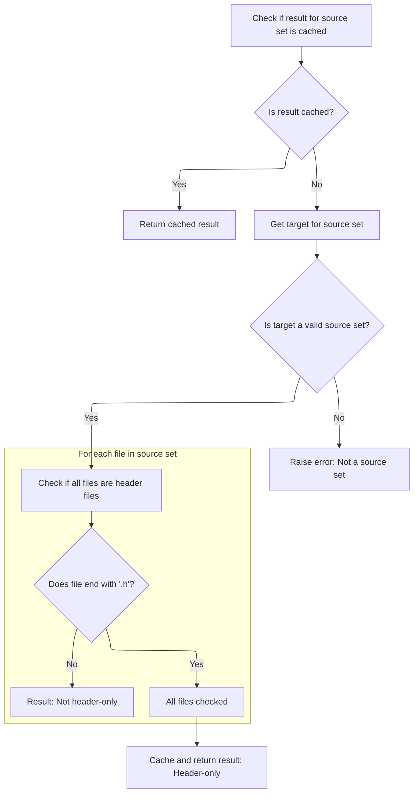

This document outlines the process for analyzing build target dependencies to prevent multiple inclusion of source sets, which can cause build issues. The analysis begins with a specified build target, resolves all dependencies, and checks for cases where a source set is included via multiple paths. Header-only source sets are skipped. If any violations are detected, the build process is stopped.

# Initializing the dependency analysis

```mermaid
%%{init: {"flowchart": {"defaultRenderer": "elk"}} }%%
flowchart TD
  node1["Start build target analysis"] --> node2["Resolving and initializing targets"]
  click node1 openCode "tools/gn_utils.py:233:234"
  
  node2 --> node3["Recursively collecting source set paths"]
  
  node3 --> node4{"Is target in ignore list?"}
  click node4 openCode "tools/gn_utils.py:242:243"
  node4 -->|"Yes"| node7["Finish initialization"]
  click node7 openCode "tools/gn_utils.py:243:244"
  node4 -->|"No"| node5

  subgraph loop1["For each source set"]
    node5{"Is header-only?"}
    
    node5 -->|"Yes"| node11["Skip ODR check"]
    click node11 openCode "tools/gn_utils.py:246:247"
    node5 -->|"No"| node6{"Multiple paths in source set?"}
    click node6 openCode "tools/gn_utils.py:247:248"
    node6 -->|"Yes"| node8["Count ODR violation"]
    click node8 openCode "tools/gn_utils.py:248:252"
    node6 -->|"No"| node11
  end

  node11 --> node9{"Any ODR violations detected?"}
  click node9 openCode "tools/gn_utils.py:253:255"
  node9 -->|"Yes"| node10["Abort build: ODR violations found"]
  click node10 openCode "tools/gn_utils.py:254:255"
  node9 -->|"No"| node7

classDef HeadingStyle fill:#777777,stroke:#333,stroke-width:2px;
click node2 goToHeading "Resolving and initializing targets"
node2:::HeadingStyle
click node3 goToHeading "Recursively collecting source set paths"
node3:::HeadingStyle
click node5 goToHeading "Checking if a source set is header-only"
node5:::HeadingStyle

%% Swimm:
%% %%{init: {"flowchart": {"defaultRenderer": "elk"}} }%%
%% flowchart TD
%%   node1["Start build target analysis"] --> node2["Resolving and initializing targets"]
%%   click node1 openCode "<SwmPath>[tools/gn_utils.py](tools/gn_utils.py)</SwmPath>:233:234"
%%   
%%   node2 --> node3["Recursively collecting source set paths"]
%%   
%%   node3 --> node4{"Is target in ignore list?"}
%%   click node4 openCode "<SwmPath>[tools/gn_utils.py](tools/gn_utils.py)</SwmPath>:242:243"
%%   node4 -->|"Yes"| node7["Finish initialization"]
%%   click node7 openCode "<SwmPath>[tools/gn_utils.py](tools/gn_utils.py)</SwmPath>:243:244"
%%   node4 -->|"No"| node5
%% 
%%   subgraph loop1["For each source set"]
%%     node5{"Is header-only?"}
%%     
%%     node5 -->|"Yes"| node11["Skip ODR check"]
%%     click node11 openCode "<SwmPath>[tools/gn_utils.py](tools/gn_utils.py)</SwmPath>:246:247"
%%     node5 -->|"No"| node6{"Multiple paths in source set?"}
%%     click node6 openCode "<SwmPath>[tools/gn_utils.py](tools/gn_utils.py)</SwmPath>:247:248"
%%     node6 -->|"Yes"| node8["Count ODR violation"]
%%     click node8 openCode "<SwmPath>[tools/gn_utils.py](tools/gn_utils.py)</SwmPath>:248:252"
%%     node6 -->|"No"| node11
%%   end
%% 
%%   node11 --> node9{"Any ODR violations detected?"}
%%   click node9 openCode "<SwmPath>[tools/gn_utils.py](tools/gn_utils.py)</SwmPath>:253:255"
%%   node9 -->|"Yes"| node10["Abort build: ODR violations found"]
%%   click node10 openCode "<SwmPath>[tools/gn_utils.py](tools/gn_utils.py)</SwmPath>:254:255"
%%   node9 -->|"No"| node7
%% 
%% classDef HeadingStyle fill:#777777,stroke:#333,stroke-width:2px;
%% click node2 goToHeading "Resolving and initializing targets"
%% node2:::HeadingStyle
%% click node3 goToHeading "Recursively collecting source set paths"
%% node3:::HeadingStyle
%% click node5 goToHeading "Checking if a source set is header-only"
%% node5:::HeadingStyle
```



<SwmSnippet path="/tools/gn_utils.py" line="233">

---

In <SwmToken path="tools/gn_utils.py" pos="233:3:3" line-data="  def __init__(self, gn: &#39;GnParser&#39;, target_name: str):">`__init__`</SwmToken>, we start by storing the gn parser and immediately fetching the target object for <SwmToken path="tools/gn_utils.py" pos="233:16:16" line-data="  def __init__(self, gn: &#39;GnParser&#39;, target_name: str):">`target_name`</SwmToken> using <SwmToken path="tools/gn_utils.py" pos="235:7:9" line-data="    self.root = gn.get_target(target_name)">`gn.get_target`</SwmToken>. This sets up the root for all dependency analysis. We need to call <SwmToken path="tools/gn_utils.py" pos="235:9:9" line-data="    self.root = gn.get_target(target_name)">`get_target`</SwmToken> next because all subsequent logic depends on having the full Target object, including its dependencies and metadata. The code assumes <SwmToken path="tools/gn_utils.py" pos="233:16:16" line-data="  def __init__(self, gn: &#39;GnParser&#39;, target_name: str):">`target_name`</SwmToken> is valid and that the source sets and paths are structured so that multiple inclusions can be detected later.

```python
  def __init__(self, gn: 'GnParser', target_name: str):
    self.gn = gn
    self.root = gn.get_target(target_name)
    self.source_sets: Dict[str, Set[str]] = collections.defaultdict(set)
    self.deps_visited = set()
    self.source_set_hdr_only = {}

```

---

</SwmSnippet>

## Resolving and initializing targets

```mermaid
%%{init: {"flowchart": {"defaultRenderer": "elk"}} }%%
flowchart TD
  node1["Request target by name"] --> node2{"Is target already processed?"}
  click node1 openCode "tools/gn_utils.py:450:456"
  click node2 openCode "tools/gn_utils.py:456:458"
  node2 -->|"Yes"| node3["Return existing target"]
  click node3 openCode "tools/gn_utils.py:458:459"
  node2 -->|"No"| node4{"Is target description available?"}
  click node4 openCode "tools/gn_utils.py:460:462"
  node4 -->|"No"| node5["Return None"]
  click node5 openCode "tools/gn_utils.py:462:463"
  node4 -->|"Yes"| node6["Create target and set metadata"]
  click node6 openCode "tools/gn_utils.py:464:481"
  node6 --> node7{"Is target a third-party dependency?"}
  click node7 openCode "tools/gn_utils.py:476:478"
  node7 -->|"Yes"| node8["Mark as third-party and return target"]
  click node8 openCode "tools/gn_utils.py:477:478"
  node7 -->|"No"| node9{"What is target type?"}
  click node9 openCode "tools/gn_utils.py:482:555"
  node9 -->|proto_library| node10["Setup proto library"]
  click node10 openCode "tools/gn_utils.py:482:493"
  node9 -->|source_set| node11["Setup source set"]
  click node11 openCode "tools/gn_utils.py:494:497"
  node9 -->|"linker_unit"| node12["Setup linker unit"]
  click node12 openCode "tools/gn_utils.py:498:500"
  node9 -->|"action"| node13["Setup action"]
  click node13 openCode "tools/gn_utils.py:501:554"
  node9 -->|"other"| node14["Setup metadata"]
  click node14 openCode "tools/gn_utils.py:555:569"
  node10 --> node15["Process dependencies"]
  node11 --> node15
  node12 --> node15
  node13 --> node15
  node14 --> node15
  subgraph loop1["For each dependency"]
    node15 --> node16{"Dependency type?"}
    click node15 openCode "tools/gn_utils.py:570:622"
    click node16 openCode "tools/gn_utils.py:571:622"
    node16 -->|generated_file| node17["Ignore dependency"]
    click node17 openCode "tools/gn_utils.py:574:577"
    node16 -->|"action (private to proto_library)"| node18["Ignore for dep tracking"]
    click node18 openCode "tools/gn_utils.py:578:586"
    node16 -->|"group (non-third-party)"| node19["Bubble up group config"]
    click node19 openCode "tools/gn_utils.py:588:592"
    node16 -->|"linker_unit"| node20["Add as hard boundary"]
    click node20 openCode "tools/gn_utils.py:594:599"
    node16 -->|source_set| node21["Bubble up source set config"]
    click node21 openCode "tools/gn_utils.py:601:603"
    node16 -->|proto_library| node22["Bubble up proto paths"]
    click node22 openCode "tools/gn_utils.py:603:605"
    node16 -->|"android custom action"| node23["Handle Android-specific logic"]
    click node23 openCode "tools/gn_utils.py:606:619"
    node16 -->|"other"| node24["Add as regular dependency and update transitive deps"]
    click node24 openCode "tools/gn_utils.py:620:622"
    node17 --> node15
    node18 --> node15
    node19 --> node15
    node20 --> node15
    node21 --> node15
    node22 --> node15
    node23 --> node15
    node24 --> node15
  end
  node15 --> node25["Return constructed target"]
  click node25 openCode "tools/gn_utils.py:624:624"

classDef HeadingStyle fill:#777777,stroke:#333,stroke-width:2px;

%% Swimm:
%% %%{init: {"flowchart": {"defaultRenderer": "elk"}} }%%
%% flowchart TD
%%   node1["Request target by name"] --> node2{"Is target already processed?"}
%%   click node1 openCode "<SwmPath>[tools/gn_utils.py](tools/gn_utils.py)</SwmPath>:450:456"
%%   click node2 openCode "<SwmPath>[tools/gn_utils.py](tools/gn_utils.py)</SwmPath>:456:458"
%%   node2 -->|"Yes"| node3["Return existing target"]
%%   click node3 openCode "<SwmPath>[tools/gn_utils.py](tools/gn_utils.py)</SwmPath>:458:459"
%%   node2 -->|"No"| node4{"Is target description available?"}
%%   click node4 openCode "<SwmPath>[tools/gn_utils.py](tools/gn_utils.py)</SwmPath>:460:462"
%%   node4 -->|"No"| node5["Return None"]
%%   click node5 openCode "<SwmPath>[tools/gn_utils.py](tools/gn_utils.py)</SwmPath>:462:463"
%%   node4 -->|"Yes"| node6["Create target and set metadata"]
%%   click node6 openCode "<SwmPath>[tools/gn_utils.py](tools/gn_utils.py)</SwmPath>:464:481"
%%   node6 --> node7{"Is target a third-party dependency?"}
%%   click node7 openCode "<SwmPath>[tools/gn_utils.py](tools/gn_utils.py)</SwmPath>:476:478"
%%   node7 -->|"Yes"| node8["Mark as third-party and return target"]
%%   click node8 openCode "<SwmPath>[tools/gn_utils.py](tools/gn_utils.py)</SwmPath>:477:478"
%%   node7 -->|"No"| node9{"What is target type?"}
%%   click node9 openCode "<SwmPath>[tools/gn_utils.py](tools/gn_utils.py)</SwmPath>:482:555"
%%   node9 -->|<SwmToken path="tools/gn_utils.py" pos="486:8:8" line-data="      target.type = &#39;proto_library&#39;">`proto_library`</SwmToken>| node10["Setup proto library"]
%%   click node10 openCode "<SwmPath>[tools/gn_utils.py](tools/gn_utils.py)</SwmPath>:482:493"
%%   node9 -->|<SwmToken path="tools/gn_utils.py" pos="285:10:10" line-data="    if target.type != &#39;source_set&#39;:">`source_set`</SwmToken>| node11["Setup source set"]
%%   click node11 openCode "<SwmPath>[tools/gn_utils.py](tools/gn_utils.py)</SwmPath>:494:497"
%%   node9 -->|"linker_unit"| node12["Setup linker unit"]
%%   click node12 openCode "<SwmPath>[tools/gn_utils.py](tools/gn_utils.py)</SwmPath>:498:500"
%%   node9 -->|"action"| node13["Setup action"]
%%   click node13 openCode "<SwmPath>[tools/gn_utils.py](tools/gn_utils.py)</SwmPath>:501:554"
%%   node9 -->|"other"| node14["Setup metadata"]
%%   click node14 openCode "<SwmPath>[tools/gn_utils.py](tools/gn_utils.py)</SwmPath>:555:569"
%%   node10 --> node15["Process dependencies"]
%%   node11 --> node15
%%   node12 --> node15
%%   node13 --> node15
%%   node14 --> node15
%%   subgraph loop1["For each dependency"]
%%     node15 --> node16{"Dependency type?"}
%%     click node15 openCode "<SwmPath>[tools/gn_utils.py](tools/gn_utils.py)</SwmPath>:570:622"
%%     click node16 openCode "<SwmPath>[tools/gn_utils.py](tools/gn_utils.py)</SwmPath>:571:622"
%%     node16 -->|<SwmToken path="tools/gn_utils.py" pos="574:3:3" line-data="      # generated_file targets only exist for GN builds: we can safely ignore">`generated_file`</SwmToken>| node17["Ignore dependency"]
%%     click node17 openCode "<SwmPath>[tools/gn_utils.py](tools/gn_utils.py)</SwmPath>:574:577"
%%     node16 -->|"action (private to <SwmToken path="tools/gn_utils.py" pos="486:8:8" line-data="      target.type = &#39;proto_library&#39;">`proto_library`</SwmToken>)"| node18["Ignore for dep tracking"]
%%     click node18 openCode "<SwmPath>[tools/gn_utils.py](tools/gn_utils.py)</SwmPath>:578:586"
%%     node16 -->|"group (non-third-party)"| node19["Bubble up group config"]
%%     click node19 openCode "<SwmPath>[tools/gn_utils.py](tools/gn_utils.py)</SwmPath>:588:592"
%%     node16 -->|"linker_unit"| node20["Add as hard boundary"]
%%     click node20 openCode "<SwmPath>[tools/gn_utils.py](tools/gn_utils.py)</SwmPath>:594:599"
%%     node16 -->|<SwmToken path="tools/gn_utils.py" pos="285:10:10" line-data="    if target.type != &#39;source_set&#39;:">`source_set`</SwmToken>| node21["Bubble up source set config"]
%%     click node21 openCode "<SwmPath>[tools/gn_utils.py](tools/gn_utils.py)</SwmPath>:601:603"
%%     node16 -->|<SwmToken path="tools/gn_utils.py" pos="486:8:8" line-data="      target.type = &#39;proto_library&#39;">`proto_library`</SwmToken>| node22["Bubble up proto paths"]
%%     click node22 openCode "<SwmPath>[tools/gn_utils.py](tools/gn_utils.py)</SwmPath>:603:605"
%%     node16 -->|"android custom action"| node23["Handle Android-specific logic"]
%%     click node23 openCode "<SwmPath>[tools/gn_utils.py](tools/gn_utils.py)</SwmPath>:606:619"
%%     node16 -->|"other"| node24["Add as regular dependency and update transitive deps"]
%%     click node24 openCode "<SwmPath>[tools/gn_utils.py](tools/gn_utils.py)</SwmPath>:620:622"
%%     node17 --> node15
%%     node18 --> node15
%%     node19 --> node15
%%     node20 --> node15
%%     node21 --> node15
%%     node22 --> node15
%%     node23 --> node15
%%     node24 --> node15
%%   end
%%   node15 --> node25["Return constructed target"]
%%   click node25 openCode "<SwmPath>[tools/gn_utils.py](tools/gn_utils.py)</SwmPath>:624:624"
%% 
%% classDef HeadingStyle fill:#777777,stroke:#333,stroke-width:2px;
```



<SwmSnippet path="/tools/gn_utils.py" line="450">

---

In <SwmToken path="tools/gn_utils.py" pos="450:3:3" line-data="  def get_target(self, gn_target_name: str) -&gt; Target:">`get_target`</SwmToken>, we check if the target is already cached, and if not, we build it from its descriptor, initializing all its attributes. The function handles different target types (<SwmToken path="tools/gn_utils.py" pos="486:8:8" line-data="      target.type = &#39;proto_library&#39;">`proto_library`</SwmToken>, <SwmToken path="tools/gn_utils.py" pos="453:11:11" line-data="        It bubbles up variables from source_set dependencies as described in the">`source_set`</SwmToken>, linker units, actions) with custom logic, and recursively processes dependencies, bubbling up flags and sources as needed. This is more than a simple getter—it's a full initializer and dependency resolver tailored to Perfetto's build system.

```python
  def get_target(self, gn_target_name: str) -> Target:
    """Returns a Target object from the fully qualified GN target name.

        It bubbles up variables from source_set dependencies as described in the
        class-level comments.
        """
    target = self.all_targets.get(gn_target_name)
    if target is not None:
      return target  # Target already processed.

    desc = self.gn_desc_.get(gn_target_name)
    if not desc:
      return None

    target = GnParser.Target(gn_target_name, desc['type'])
    target.testonly = desc.get('testonly', False)
    target.toolchain = desc.get('toolchain', None)
    self.all_targets[gn_target_name] = target

    # We should never have GN targets directly depend on buidtools. They
    # should hop via //gn:xxx, so we can give generators an opportunity to
    # override them.
    assert (not gn_target_name.startswith('//buildtools'))

    # Don't descend further into third_party targets. Genrators are supposed
    # to either ignore them or route to other externally-provided targets.
    if gn_target_name.startswith('//gn'):
      target.is_third_party_dep_ = True
      return target

    target.metadata = desc.get('metadata', {})

    proto_target_type, proto_desc = self.get_proto_target_type(target)
    if proto_target_type:
      assert proto_desc
      self.proto_libs[target.name] = target
      target.type = 'proto_library'
      target.proto_plugin = proto_target_type
      target.proto_paths.update(self.get_proto_paths(proto_desc))
      target.proto_exports.update(self.get_proto_exports(proto_desc))
      target.sources.update(
          self.get_proto_sources(proto_target_type, proto_desc))
      assert (all(x.endswith('.proto') for x in target.sources))
    elif target.type == 'source_set':
      self.source_sets[gn_target_name] = target
      target.sources.update(desc.get('sources', []))
      target.inputs.update(desc.get('inputs', []))
    elif target.type in LINKER_UNIT_TYPES:
      self.linker_units[gn_target_name] = target
      target.sources.update(desc.get('sources', []))
    elif target.type == 'action':
      self.actions[gn_target_name] = target
      target.data.update(target.metadata.get('perfetto_data', []))
      target.inputs.update(desc.get('inputs', []))
      target.sources.update(desc.get('sources', []))
      outs = [re.sub('^//out/.+?/gen/', '', x) for x in desc['outputs']]
      target.outputs.update(outs)
      target.script = desc['script']
      # Args are typically relative to the root build dir (../../xxx)
      # because root build dir is typically out/xxx/).
      target.args = [re.sub('^../../', '//', x) for x in desc['args']]
      action_types = target.metadata.get('perfetto_action_type_for_generator')
      target.custom_action_type = action_types[0] if action_types else None
      python_main = target.metadata.get('perfetto_python_main')
      target.python_main = python_main[0] if python_main else None
      manifest = target.metadata.get('perfetto_android_manifest')
      if manifest:
        target.manifest = manifest[0]
      resource_files = target.metadata.get(
          'perfetto_android_resource_files_glob')
      if resource_files:
        target.resource_files = resource_files[0]
        assert (target.resource_files.endswith('/**/*'))
      java_target_name_suffix = target.metadata.get(
          'perfetto_android_library_android_bp_java_target_name_suffix')
      if java_target_name_suffix:
        target.android_bp_java_target_name_suffix = java_target_name_suffix[0]
      copy_java_target_name_suffix = target.metadata.get(
          'perfetto_android_library_android_bp_copy_java_target_name_suffix')
      if copy_java_target_name_suffix:
        target.android_bp_copy_java_target_name_suffix = copy_java_target_name_suffix[
            0]
      copy_java_target_jarjar = target.metadata.get(
          'perfetto_android_library_android_bp_copy_java_target_jarjar')
      if copy_java_target_jarjar:
        target.android_bp_copy_java_target_jarjar = copy_java_target_jarjar[0]
      a_i_t_app = target.metadata.get('perfetto_android_a_i_t_app')
      target.a_i_t_app = a_i_t_app[0] if a_i_t_app else None
      a_i_t_test_app = target.metadata.get('perfetto_android_a_i_t_test_app')
      target.a_i_t_test_app = a_i_t_test_app[0] if a_i_t_test_app else None
      a_i_t_android_bp_test_manifest = target.metadata.get(
          'perfetto_android_a_i_t_android_bp_test_manifest')
      target.a_i_t_android_bp_test_manifest = a_i_t_android_bp_test_manifest[
          0] if a_i_t_android_bp_test_manifest else None
      a_i_t_android_bp_test_config = target.metadata.get(
          'perfetto_android_a_i_t_android_bp_test_config')
      target.a_i_t_android_bp_test_config = a_i_t_android_bp_test_config[
          0] if a_i_t_android_bp_test_config else None
      minuend_descriptor = target.metadata.get('perfetto_minuend_descriptor')
      target.minuend_descriptor = minuend_descriptor[
          0] if minuend_descriptor else None
      subtrahend_descriptor = target.metadata.get(
          'perfetto_subtrahend_descriptor')
      target.subtrahend_descriptor = subtrahend_descriptor[
          0] if subtrahend_descriptor else None

    # Default for 'public' is //* - all headers in 'sources' are public.
    # TODO(primiano): if a 'public' section is specified (even if empty), then
    # the rest of 'sources' is considered inaccessible by gn. Consider
    # emulating that, so that generated build files don't end up with overly
    # accessible headers.
    public_headers = [x for x in desc.get('public', []) if x != '*']
    target.public_headers.update(public_headers)

    target.cflags.update(desc.get('cflags', []) + desc.get('cflags_cc', []))
    target.libs.update(desc.get('libs', []))
    target.ldflags.update(desc.get('ldflags', []))
    target.defines.update(desc.get('defines', []))
    target.include_dirs.update(desc.get('include_dirs', []))

    # Recurse in dependencies.
    for dep_name in desc.get('deps', []):
      dep = self.get_target(dep_name)

      # generated_file targets only exist for GN builds: we can safely ignore
      # them.
      if dep.type == 'generated_file':
        continue

      # When a proto_library depends on an action, that is always the "_gen"
      # rule of the action which is "private" to the proto_library rule.
      # therefore, just ignore it for dep tracking purposes.
      if dep.type == 'action' and proto_target_type is not None:
        target_no_toolchain = label_without_toolchain(target.name)
        dep_no_toolchain = label_without_toolchain(dep.name)
        assert (dep_no_toolchain == f'{target_no_toolchain}_gen')
        continue

      # Non-third party groups are only used for bubbling cflags etc so don't
      # add a dep.
      if dep.type == 'group' and not dep.is_third_party_dep_:
        target.update(dep)  # Bubble up groups's cflags/ldflags etc.
        continue

      # Linker units act as a hard boundary making all their internal deps
      # opaque to the outside world. For this reason, do not propogate deps
      # transitively across them.
      if dep.type in LINKER_UNIT_TYPES:
        target.deps.add(dep)
        continue

      if dep.type == 'source_set':
        target.update(dep)  # Bubble up source set's cflags/ldflags etc.
      elif dep.type == 'proto_library':
        target.proto_paths.update(dep.proto_paths)

      if (target.custom_action_type == 'perfetto_android_library' or
          target.custom_action_type == 'perfetto_android_app'):
        jni_library = dep.type == 'shared_library' and dep.custom_target_type(
        ) == 'perfetto_android_jni_library'
        android_lib = dep.custom_action_type == 'perfetto_android_library'
        assert (jni_library or android_lib or dep.is_third_party_dep_)

      if target.custom_action_type == 'perfetto_android_instrumentation_test':
        assert (dep.custom_action_type == 'perfetto_android_app')
        assert (dep.name == target.a_i_t_app or
                dep.name == target.a_i_t_test_app)
        if dep.name == target.a_i_t_test_app:
          dep.instruments = target.a_i_t_app

      target.deps.add(dep)
      target.transitive_deps.add(dep)
      target.transitive_deps.update(dep.transitive_deps)
```

---

</SwmSnippet>

<SwmSnippet path="/tools/gn_utils.py" line="622">

---

After all the dependency resolution and attribute merging, <SwmToken path="tools/gn_utils.py" pos="235:9:9" line-data="    self.root = gn.get_target(target_name)">`get_target`</SwmToken> returns a fully initialized Target object with all its sources, flags, metadata, and dependency relationships set up. This object is ready for downstream analysis and ODR checks.

```python
      target.transitive_deps.update(dep.transitive_deps)

    return target
```

---

</SwmSnippet>

## Visiting dependencies for source set analysis



<SwmSnippet path="/tools/gn_utils.py" line="240">

---

Back in <SwmToken path="tools/gn_utils.py" pos="233:3:3" line-data="  def __init__(self, gn: &#39;GnParser&#39;, target_name: str):">`__init__`</SwmToken>, after getting the target, we call \_visit to walk through all dependencies and collect source sets and their inclusion paths. This sets up the data needed to check for ODR violations. If the target is in <SwmToken path="tools/gn_utils.py" pos="242:7:7" line-data="    if target_name in ODR_VIOLATION_IGNORE_TARGETS:">`ODR_VIOLATION_IGNORE_TARGETS`</SwmToken>, we skip the check entirely.

```python
    self._visit(target_name)
    num_violations = 0
    if target_name in ODR_VIOLATION_IGNORE_TARGETS:
      return
    for sset, paths in self.source_sets.items():
```

---

</SwmSnippet>

## Recursively collecting source set paths



<SwmSnippet path="/tools/gn_utils.py" line="257">

---

In <SwmToken path="tools/gn_utils.py" pos="257:3:3" line-data="  def _visit(self, target_name: str, parent_path=&#39;&#39;):">`_visit`</SwmToken>, we grab the target object for <SwmToken path="tools/gn_utils.py" pos="257:8:8" line-data="  def _visit(self, target_name: str, parent_path=&#39;&#39;):">`target_name`</SwmToken> and build up the path string to track how we got here. We need to call <SwmToken path="tools/gn_utils.py" pos="258:9:9" line-data="    target = self.gn.get_target(target_name)">`get_target`</SwmToken> to fetch each dependency object so we can analyze its source sets and dependencies recursively. This lets us collect all the paths for each source set.

```python
  def _visit(self, target_name: str, parent_path=''):
    target = self.gn.get_target(target_name)
```

---

</SwmSnippet>

<SwmSnippet path="/tools/gn_utils.py" line="259">

---

After getting the target in \_visit, we use its <SwmToken path="tools/gn_utils.py" pos="262:9:9" line-data="    for ssdep in target.transitive_source_set_deps():">`transitive_source_set_deps`</SwmToken> to record each source set along with the full path of dependencies leading to it. This is how we build up the <SwmToken path="tools/gn_utils.py" pos="264:3:3" line-data="      self.source_sets[ssdep.name].add(name_and_path)">`source_sets`</SwmToken> map for later ODR checks.

```python
    path = ((parent_path + ' > ') if parent_path else '') + target_name
    if not target:
      raise Exception('Cannot find target %s' % target_name)
    for ssdep in target.transitive_source_set_deps():
      name_and_path = '%s (via %s)' % (target_name, path)
      self.source_sets[ssdep.name].add(name_and_path)
```

---

</SwmSnippet>

<SwmSnippet path="/tools/gn_utils.py" line="264">

---

\_visit skips executables, resets the path for static libraries, and recursively walks the rest of the dependencies.

```python
      self.source_sets[ssdep.name].add(name_and_path)
    deps = set(target.non_proto_or_source_set_deps()).union(
        target.transitive_proto_deps()) - self.deps_visited
    for dep in deps:
      if dep.type == 'executable':
        continue  # Execs are strong boundaries and don't cause ODR violations.
      # static_library dependencies should reset the path. It doesn't matter if
      # we get to a source file via:
      # source_set1 > static_lib > source.cc OR
      # source_set1 > source_set2 > static_lib > source.cc
      # This is NOT an ODR violation because source.cc is linked from the same
      # static library
      next_parent_path = path if dep.type != 'static_library' else ''
      self.deps_visited.add(dep.name)
      self._visit(dep.name, next_parent_path)
```

---

</SwmSnippet>

<SwmSnippet path="/tools/gn_utils.py" line="278">

---

\_visit just keeps recursing through dependencies, updating the <SwmToken path="tools/gn_utils.py" pos="236:3:3" line-data="    self.source_sets: Dict[str, Set[str]] = collections.defaultdict(set)">`source_sets`</SwmToken> map as it goes. It doesn't return anything; its job is to build up the data for ODR checks.

```python
      self._visit(dep.name, next_parent_path)
```

---

</SwmSnippet>

## Checking for ODR violations

<SwmSnippet path="/tools/gn_utils.py" line="245">

---

Back in **init**, after \_visit, we loop through each source set and call <SwmToken path="tools/gn_utils.py" pos="245:5:5" line-data="      if self.is_header_only(sset):">`is_header_only`</SwmToken> to skip header-only sets. For the rest, if they're included via multiple paths, we count it as an ODR violation and print the details.

```python
      if self.is_header_only(sset):
        continue
      if len(paths) != 1:
        num_violations += 1
        print(
            'ODR violation in target %s, multiple paths include %s:\n  %s' %
            (target_name, sset, '\n  '.join(paths)),
            file=sys.stderr)
```

---

</SwmSnippet>

## Checking if a source set is header-only



<SwmSnippet path="/tools/gn_utils.py" line="280">

---

After getting the target in <SwmToken path="tools/gn_utils.py" pos="280:3:3" line-data="  def is_header_only(self, source_set_name: str):">`is_header_only`</SwmToken>, we check if all its sources are headers, cache the result, and return it.

```python
  def is_header_only(self, source_set_name: str):
    cached = self.source_set_hdr_only.get(source_set_name)
    if cached is not None:
      return cached
    target = self.gn.get_target(source_set_name)
    if target.type != 'source_set':
      raise TypeError('%s is not a source_set' % source_set_name)
```

---

</SwmSnippet>

<SwmSnippet path="/tools/gn_utils.py" line="287">

---

After getting the target in <SwmToken path="tools/gn_utils.py" pos="245:5:5" line-data="      if self.is_header_only(sset):">`is_header_only`</SwmToken>, we check if all its sources are headers, cache the result, and return it.

```python
    res = all(src.endswith('.h') for src in target.sources)
    self.source_set_hdr_only[source_set_name] = res
    return res
```

---

</SwmSnippet>

## Aborting on ODR violations

<SwmSnippet path="/tools/gn_utils.py" line="253">

---

After checking header-only status in **init**, if any ODR violations were found, we raise an exception and stop the build process.

```python
    if num_violations > 0:
      raise Exception('%d ODR violations detected. Build generation aborted' %
                      num_violations)
```

---

</SwmSnippet>

&nbsp;

*This is an auto-generated document by Swimm 🌊 and has not yet been verified by a human*

<SwmMeta version="3.0.0" repo-id="Z2l0aHViJTNBJTNBY3BsdXNwbHVzLXBlcmZldHRvJTNBJTNBcmljYXJkb2xvcGV6Zw==" repo-name="cplusplus-perfetto"><sup>Powered by [Swimm](https://app.swimm.io/)</sup></SwmMeta>
