This document describes how descriptor tracks are registered or retrieved, ensuring each track is resolved, associated with its parent if needed, and registered with the correct properties. The flow manages different track scopes and determines whether to merge tracks or keep them separate, supporting accurate trace analysis.

# Resolving and Interning Descriptor Tracks

```mermaid
%%{init: {"flowchart": {"defaultRenderer": "elk"}} }%%
flowchart TD
  node1["Start: Request to register or retrieve a track"] --> node2{"Is the descriptor track resolvable?"}
  click node1 openCode "src/trace_processor/importers/proto/track_event_tracker.cc:348:353"
  node2 -->|"No"| node3["No track registered (not found)"]
  click node2 openCode "src/trace_processor/importers/proto/track_event_tracker.cc:353:356"
  click node3 openCode "src/trace_processor/importers/proto/track_event_tracker.cc:355:356"
  node2 -->|"Yes"| node4{"Is this a root track?"}
  click node4 openCode "src/trace_processor/importers/proto/track_event_tracker.cc:387:422"
  node4 -->|"Yes"| node5{"Scope of track?"}
  node5 -->|"Thread"| node6{"Counter track?"}
  node6 -->|"Yes"| node7["Track registered as thread counter"]
  click node7 openCode "src/trace_processor/importers/proto/track_event_tracker.cc:391:396"
  node6 -->|"No"| node8{"Use separate track?"}
  node8 -->|"Yes"| node9["Track registered as thread"]
  click node9 openCode "src/trace_processor/importers/proto/track_event_tracker.cc:397:401"
  node8 -->|"No"| node10["Track registered as thread event"]
  click node10 openCode "src/trace_processor/importers/proto/track_event_tracker.cc:402:402"
  node5 -->|"Process"| node11{"Counter track?"}
  node11 -->|"Yes"| node12["Track registered as process counter"]
  click node12 openCode "src/trace_processor/importers/proto/track_event_tracker.cc:408:412"
  node11 -->|"No"| node13["Track registered as process"]
  click node13 openCode "src/trace_processor/importers/proto/track_event_tracker.cc:414:418"
  node5 -->|"Global"| node14["Invalid: Should never happen"]
  click node14 openCode "src/trace_processor/importers/proto/track_event_tracker.cc:420:421"
  node4 -->|"No"| node15{"Parent track present?"}
  click node15 openCode "src/trace_processor/importers/proto/track_event_tracker.cc:435:535"
  node15 -->|"Yes"| node16{"Parent scope?"}
  node16 -->|"Thread"| node17{"Counter track?"}
  node17 -->|"Yes"| node18["Track registered as child thread counter"]
  click node18 openCode "src/trace_processor/importers/proto/track_event_tracker.cc:443:456"
  node17 -->|"No"| node19{"Sibling merge behavior?"}
  node19 -->|"None"| node20["Track registered as child thread"]
  click node20 openCode "src/trace_processor/importers/proto/track_event_tracker.cc:459:472"
  node19 -->|"Merge"| node21["Track registered as merged thread"]
  click node21 openCode "src/trace_processor/importers/proto/track_event_tracker.cc:473:482"
  node16 -->|"Process"| node22{"Counter track?"}
  node22 -->|"Yes"| node23["Track registered as child process counter"]
  click node23 openCode "src/trace_processor/importers/proto/track_event_tracker.cc:487:504"
  node22 -->|"No"| node24{"Sibling merge behavior?"}
  node24 -->|"None"| node25["Track registered as child process"]
  click node25 openCode "src/trace_processor/importers/proto/track_event_tracker.cc:508:520"
  node24 -->|"Merge"| node26["Track registered as merged process"]
  click node26 openCode "src/trace_processor/importers/proto/track_event_tracker.cc:522:531"
  node16 -->|"Global"| node27["No action"]
  click node27 openCode "src/trace_processor/importers/proto/track_event_tracker.cc:532:534"
  node15 -->|"No"| node28{"Counter track?"}
  node28 -->|"Yes"| node29["Track registered as global counter"]
  click node29 openCode "src/trace_processor/importers/proto/track_event_tracker.cc:541:548"
  node28 -->|"No"| node30{"Sibling merge behavior?"}
  node30 -->|"None"| node31["Track registered as global"]
  click node31 openCode "src/trace_processor/importers/proto/track_event_tracker.cc:551:556"
  node30 -->|"Merge"| node32["Track registered as merged global"]
  click node32 openCode "src/trace_processor/importers/proto/track_event_tracker.cc:558:564"

classDef HeadingStyle fill:#777777,stroke:#333,stroke-width:2px;

%% Swimm:
%% %%{init: {"flowchart": {"defaultRenderer": "elk"}} }%%
%% flowchart TD
%%   node1["Start: Request to register or retrieve a track"] --> node2{"Is the descriptor track resolvable?"}
%%   click node1 openCode "<SwmPath>[src/…/proto/track_event_tracker.cc](src/trace_processor/importers/proto/track_event_tracker.cc)</SwmPath>:348:353"
%%   node2 -->|"No"| node3["No track registered (not found)"]
%%   click node2 openCode "<SwmPath>[src/…/proto/track_event_tracker.cc](src/trace_processor/importers/proto/track_event_tracker.cc)</SwmPath>:353:356"
%%   click node3 openCode "<SwmPath>[src/…/proto/track_event_tracker.cc](src/trace_processor/importers/proto/track_event_tracker.cc)</SwmPath>:355:356"
%%   node2 -->|"Yes"| node4{"Is this a root track?"}
%%   click node4 openCode "<SwmPath>[src/…/proto/track_event_tracker.cc](src/trace_processor/importers/proto/track_event_tracker.cc)</SwmPath>:387:422"
%%   node4 -->|"Yes"| node5{"Scope of track?"}
%%   node5 -->|"Thread"| node6{"Counter track?"}
%%   node6 -->|"Yes"| node7["Track registered as thread counter"]
%%   click node7 openCode "<SwmPath>[src/…/proto/track_event_tracker.cc](src/trace_processor/importers/proto/track_event_tracker.cc)</SwmPath>:391:396"
%%   node6 -->|"No"| node8{"Use separate track?"}
%%   node8 -->|"Yes"| node9["Track registered as thread"]
%%   click node9 openCode "<SwmPath>[src/…/proto/track_event_tracker.cc](src/trace_processor/importers/proto/track_event_tracker.cc)</SwmPath>:397:401"
%%   node8 -->|"No"| node10["Track registered as thread event"]
%%   click node10 openCode "<SwmPath>[src/…/proto/track_event_tracker.cc](src/trace_processor/importers/proto/track_event_tracker.cc)</SwmPath>:402:402"
%%   node5 -->|"Process"| node11{"Counter track?"}
%%   node11 -->|"Yes"| node12["Track registered as process counter"]
%%   click node12 openCode "<SwmPath>[src/…/proto/track_event_tracker.cc](src/trace_processor/importers/proto/track_event_tracker.cc)</SwmPath>:408:412"
%%   node11 -->|"No"| node13["Track registered as process"]
%%   click node13 openCode "<SwmPath>[src/…/proto/track_event_tracker.cc](src/trace_processor/importers/proto/track_event_tracker.cc)</SwmPath>:414:418"
%%   node5 -->|"Global"| node14["Invalid: Should never happen"]
%%   click node14 openCode "<SwmPath>[src/…/proto/track_event_tracker.cc](src/trace_processor/importers/proto/track_event_tracker.cc)</SwmPath>:420:421"
%%   node4 -->|"No"| node15{"Parent track present?"}
%%   click node15 openCode "<SwmPath>[src/…/proto/track_event_tracker.cc](src/trace_processor/importers/proto/track_event_tracker.cc)</SwmPath>:435:535"
%%   node15 -->|"Yes"| node16{"Parent scope?"}
%%   node16 -->|"Thread"| node17{"Counter track?"}
%%   node17 -->|"Yes"| node18["Track registered as child thread counter"]
%%   click node18 openCode "<SwmPath>[src/…/proto/track_event_tracker.cc](src/trace_processor/importers/proto/track_event_tracker.cc)</SwmPath>:443:456"
%%   node17 -->|"No"| node19{"Sibling merge behavior?"}
%%   node19 -->|"None"| node20["Track registered as child thread"]
%%   click node20 openCode "<SwmPath>[src/…/proto/track_event_tracker.cc](src/trace_processor/importers/proto/track_event_tracker.cc)</SwmPath>:459:472"
%%   node19 -->|"Merge"| node21["Track registered as merged thread"]
%%   click node21 openCode "<SwmPath>[src/…/proto/track_event_tracker.cc](src/trace_processor/importers/proto/track_event_tracker.cc)</SwmPath>:473:482"
%%   node16 -->|"Process"| node22{"Counter track?"}
%%   node22 -->|"Yes"| node23["Track registered as child process counter"]
%%   click node23 openCode "<SwmPath>[src/…/proto/track_event_tracker.cc](src/trace_processor/importers/proto/track_event_tracker.cc)</SwmPath>:487:504"
%%   node22 -->|"No"| node24{"Sibling merge behavior?"}
%%   node24 -->|"None"| node25["Track registered as child process"]
%%   click node25 openCode "<SwmPath>[src/…/proto/track_event_tracker.cc](src/trace_processor/importers/proto/track_event_tracker.cc)</SwmPath>:508:520"
%%   node24 -->|"Merge"| node26["Track registered as merged process"]
%%   click node26 openCode "<SwmPath>[src/…/proto/track_event_tracker.cc](src/trace_processor/importers/proto/track_event_tracker.cc)</SwmPath>:522:531"
%%   node16 -->|"Global"| node27["No action"]
%%   click node27 openCode "<SwmPath>[src/…/proto/track_event_tracker.cc](src/trace_processor/importers/proto/track_event_tracker.cc)</SwmPath>:532:534"
%%   node15 -->|"No"| node28{"Counter track?"}
%%   node28 -->|"Yes"| node29["Track registered as global counter"]
%%   click node29 openCode "<SwmPath>[src/…/proto/track_event_tracker.cc](src/trace_processor/importers/proto/track_event_tracker.cc)</SwmPath>:541:548"
%%   node28 -->|"No"| node30{"Sibling merge behavior?"}
%%   node30 -->|"None"| node31["Track registered as global"]
%%   click node31 openCode "<SwmPath>[src/…/proto/track_event_tracker.cc](src/trace_processor/importers/proto/track_event_tracker.cc)</SwmPath>:551:556"
%%   node30 -->|"Merge"| node32["Track registered as merged global"]
%%   click node32 openCode "<SwmPath>[src/…/proto/track_event_tracker.cc](src/trace_processor/importers/proto/track_event_tracker.cc)</SwmPath>:558:564"
%% 
%% classDef HeadingStyle fill:#777777,stroke:#333,stroke-width:2px;
```



<SwmSnippet path="/src/trace_processor/importers/proto/track_event_tracker.cc" line="348">

---

<SwmToken path="src/trace_processor/importers/proto/track_event_tracker.cc" pos="348:2:2" line-data="TrackEventTracker::InternDescriptorTrackImpl(">`InternDescriptorTrackImpl`</SwmToken> kicks off the flow by resolving the descriptor track for a given UUID, handling parent tracks recursively to maintain hierarchy. It sets up argument callbacks for root and non-root tracks, then branches based on track scope and counter status to intern the correct track type. If a parent track exists, it decides between creating separate tracks or merging siblings using the track compressor, depending on the merge behavior. Calling into <SwmPath>[src/…/common/track_compressor.h](src/trace_processor/importers/common/track_compressor.h)</SwmPath> next is needed when merging is required, as it handles the creation of merged tracks.

```c++
TrackEventTracker::InternDescriptorTrackImpl(
    uint64_t uuid,
    StringId event_name,
    std::optional<uint32_t> packet_sequence_id) {
  std::optional<ResolvedDescriptorTrack> resolved =
      ResolveDescriptorTrack(uuid);
  if (!resolved) {
    return std::nullopt;
  }
  State* state = descriptor_tracks_state_.Find(uuid);
  PERFETTO_CHECK(state);

  DescriptorTrackReservation* reservation = &state->reservation;

  // Try to resolve any parent tracks recursively, too.
  std::optional<TrackId> parent_track_id;
  std::optional<ResolvedDescriptorTrack> parent_resolved_track;
  if (reservation->parent_uuid != kDefaultDescriptorTrackUuid) {
    parent_track_id = InternDescriptorTrackForParent(
        reservation->parent_uuid, kNullStringId, packet_sequence_id);
    parent_resolved_track = ResolveDescriptorTrack(reservation->parent_uuid);
  }

  // Don't capture anything by reference in these functions as they are
  // persisted in the case of merged tracks.
  TrackTracker::SetArgsCallback args_fn_root =
      [this, uuid, packet_sequence_id](ArgsTracker::BoundInserter& inserter) {
        State* state = descriptor_tracks_state_.Find(uuid);
        PERFETTO_CHECK(state);
        AddTrackArgs(uuid, packet_sequence_id, state->reservation,
                     true /* is_root*/, inserter);
      };
  TrackTracker::SetArgsCallback args_fn_non_root =
      [this, uuid, packet_sequence_id](ArgsTracker::BoundInserter& inserter) {
        State* state = descriptor_tracks_state_.Find(uuid);
        PERFETTO_CHECK(state);
        AddTrackArgs(uuid, packet_sequence_id, state->reservation,
                     false /* is_root*/, inserter);
      };
  if (resolved->is_root()) {
    switch (resolved->scope()) {
      case ResolvedDescriptorTrack::Scope::kThread:
        if (resolved->is_counter()) {
          return context_->track_tracker->InternTrack(
              kThreadCounterTrackBlueprint,
              tracks::Dimensions(resolved->utid(), static_cast<int64_t>(uuid)),
              tracks::DynamicName(reservation->name), args_fn_root,
              tracks::DynamicUnit(reservation->counter_details->unit));
        } else if (reservation->use_separate_track) {
          return context_->track_tracker->InternTrack(
              kThreadTrackBlueprint,
              tracks::Dimensions(resolved->utid(), static_cast<int64_t>(uuid)),
              tracks::DynamicName(reservation->name), args_fn_root);
        }
        return context_->track_tracker->InternThreadTrack(resolved->utid());
      case ResolvedDescriptorTrack::Scope::kProcess: {
        StringId translated_name =
            context_->process_track_translation_table->TranslateName(
                reservation->name);
        if (reservation->is_counter) {
          return context_->track_tracker->InternTrack(
              kProcessCounterTrackBlueprint,
              tracks::Dimensions(resolved->upid(), static_cast<int64_t>(uuid)),
              tracks::DynamicName(translated_name), args_fn_root,
              tracks::DynamicUnit(reservation->counter_details->unit));
        }
        return context_->track_tracker->InternTrack(
            kProcessTrackBlueprint,
            tracks::Dimensions(resolved->upid(), static_cast<int64_t>(uuid)),
            tracks::DynamicName(translated_name), args_fn_root);
      }
      case ResolvedDescriptorTrack::Scope::kGlobal:
        PERFETTO_FATAL("Should never happen");
    }
  }

  StringId name = reservation->name.is_null() ? event_name : reservation->name;
  // Don't capture anything by reference in these functions as they are
  // persisted in the case of merged tracks.
  auto set_parent_id = [this, parent_track_id](TrackId id) {
    if (parent_track_id) {
      auto rr = context_->storage->mutable_track_table()->FindById(id);
      PERFETTO_CHECK(rr);
      rr->set_parent_id(parent_track_id);
    }
  };
  using M = TrackEventTracker::DescriptorTrackReservation::SiblingMergeBehavior;
  if (parent_track_id) {
    // If we have the track id, we should also always have the resolved track
    // too.
    PERFETTO_CHECK(parent_resolved_track);
    switch (parent_resolved_track->scope()) {
      case ResolvedDescriptorTrack::Scope::kThread: {
        // If parent is a thread track, create another thread-associated track.
        if (reservation->is_counter) {
          TrackId id = context_->track_tracker->InternTrack(
              kThreadCounterTrackBlueprint,
              tracks::Dimensions(parent_resolved_track->utid(),
                                 static_cast<int64_t>(uuid)),
              tracks::DynamicName(reservation->name), args_fn_non_root,
              tracks::DynamicUnit(reservation->counter_details->unit));
          // If the parent has a process descriptor set, promote this track
          // to also be a root thread level track. This is necessary for
          // backcompat reasons: see the comment on parent_uuid in
          // TrackDescriptor.
          if (!parent_resolved_track->is_root()) {
            set_parent_id(id);
          }
          return id;
        }
        if (reservation->sibling_merge_behavior == M::kNone) {
          TrackId id = context_->track_tracker->InternTrack(
              kThreadTrackBlueprint,
              tracks::Dimensions(parent_resolved_track->utid(),
                                 static_cast<int64_t>(uuid)),
              tracks::DynamicName(name), args_fn_non_root);
          // If the parent has a process descriptor set, promote this track
          // to also be a root thread level track. This is necessary for
          // backcompat reasons: see the comment on parent_uuid in
          // TrackDescriptor.
          if (!parent_resolved_track->is_root()) {
            set_parent_id(id);
          }
          return id;
        }
        auto [type, key] = GetMergeKey(*reservation, name);
        return context_->track_compressor->CreateTrackFactory(
            kThreadTrackMergedBlueprint,
            tracks::Dimensions(parent_resolved_track->utid(),
                               static_cast<int64_t>(reservation->parent_uuid),
                               type, key),
            tracks::DynamicName(name), args_fn_non_root,
            parent_resolved_track->is_root() ? std::function<void(TrackId)>()
                                             : set_parent_id);
      }
      case ResolvedDescriptorTrack::Scope::kProcess: {
        // If parent is a process track, create another process-associated
        // track.
        if (reservation->is_counter) {
          StringId translated_name =
              context_->process_track_translation_table->TranslateName(
                  reservation->name);
          TrackId id = context_->track_tracker->InternTrack(
              kProcessCounterTrackBlueprint,
              tracks::Dimensions(parent_resolved_track->upid(),
                                 static_cast<int64_t>(uuid)),
              tracks::DynamicName(translated_name), args_fn_non_root,
              tracks::DynamicUnit(reservation->counter_details->unit));
          // If the parent has a thread descriptor set, promote this track
          // to also be a root thread level track. This is necessary for
          // backcompat reasons: see the comment on parent_uuid in
          // TrackDescriptor.
          if (!parent_resolved_track->is_root()) {
            set_parent_id(id);
          }
          return id;
        }
        StringId translated_name =
            context_->process_track_translation_table->TranslateName(name);
        if (reservation->sibling_merge_behavior == M::kNone) {
          TrackId id = context_->track_tracker->InternTrack(
              kProcessTrackBlueprint,
              tracks::Dimensions(parent_resolved_track->upid(),
                                 static_cast<int64_t>(uuid)),
              tracks::DynamicName(translated_name), args_fn_non_root);
          // If the parent has a thread descriptor set, promote this track
          // to also be a root thread level track. This is necessary for
          // backcompat reasons: see the comment on parent_uuid in
          // TrackDescriptor.
          if (!parent_resolved_track->is_root()) {
            set_parent_id(id);
          }
          return id;
        }
        auto [type, key] = GetMergeKey(*reservation, translated_name);
        return context_->track_compressor->CreateTrackFactory(
            kProcessTrackMergedBlueprint,
            tracks::Dimensions(parent_resolved_track->upid(),
                               static_cast<int64_t>(reservation->parent_uuid),
                               type, key),
            tracks::DynamicName(translated_name), args_fn_non_root,
            parent_resolved_track->is_root() ? std::function<void(TrackId)>()
                                             : set_parent_id);
      }
      case ResolvedDescriptorTrack::Scope::kGlobal:
        break;
    }
  }

  // root_in_scope only matters for legacy JSON export. This is somewhat related
  // but intentionally distinct from our handling of parent_id relationships.
  bool is_root_in_scope = uuid == kDefaultDescriptorTrackUuid;
  if (reservation->is_counter) {
    TrackId id = context_->track_tracker->InternTrack(
        kGlobalCounterTrackBlueprint,
        tracks::Dimensions(static_cast<int64_t>(uuid)),
        tracks::DynamicName(reservation->name),
        is_root_in_scope ? args_fn_root : args_fn_non_root,
        tracks::DynamicUnit(reservation->counter_details->unit));
    set_parent_id(id);
    return id;
  }
  if (reservation->sibling_merge_behavior == M::kNone) {
    TrackId id = context_->track_tracker->InternTrack(
        kGlobalTrackBlueprint, tracks::Dimensions(static_cast<int64_t>(uuid)),
        tracks::DynamicName(name),
        is_root_in_scope ? args_fn_root : args_fn_non_root);
    set_parent_id(id);
    return id;
  }
  auto [type, key] = GetMergeKey(*reservation, name);
  return context_->track_compressor->CreateTrackFactory(
      kGlobalTrackMergedBlueprint,
      tracks::Dimensions(static_cast<int64_t>(reservation->parent_uuid), type,
                         key),
      tracks::DynamicName(name),
      is_root_in_scope ? args_fn_root : args_fn_non_root, set_parent_id);
}
```

---

</SwmSnippet>

# Building and Registering Track Factories

```mermaid
%%{init: {"flowchart": {"defaultRenderer": "elk"}} }%%
flowchart TD
  node1["Setup track factory with blueprint, dimensions, and name"] --> node2["Encapsulate logic to create new track with unique identity"]
  click node1 openCode "src/trace_processor/importers/common/track_compressor.h:239:245"
  click node2 openCode "src/trace_processor/importers/common/track_compressor.h:246:250"
  node2 --> node3{"Is callback for new track provided?"}
  click node3 openCode "src/trace_processor/importers/common/track_compressor.h:254:256"
  node3 -->|"Yes"| node4["Notify with new track identity"]
  click node4 openCode "src/trace_processor/importers/common/track_compressor.h:255:256"
  node3 -->|"No"| node5["Skip notification"]
  click node5 openCode "src/trace_processor/importers/common/track_compressor.h:254:256"
  node4 --> node6["Assign track to group using track set ID"]
  click node6 openCode "src/trace_processor/importers/common/track_compressor.h:257:259"
  node5 --> node6
  node6 --> node7["Return track factory for future track creation"]
  click node7 openCode "src/trace_processor/importers/common/track_compressor.h:260:263"

classDef HeadingStyle fill:#777777,stroke:#333,stroke-width:2px;

%% Swimm:
%% %%{init: {"flowchart": {"defaultRenderer": "elk"}} }%%
%% flowchart TD
%%   node1["Setup track factory with blueprint, dimensions, and name"] --> node2["Encapsulate logic to create new track with unique identity"]
%%   click node1 openCode "<SwmPath>[src/…/common/track_compressor.h](src/trace_processor/importers/common/track_compressor.h)</SwmPath>:239:245"
%%   click node2 openCode "<SwmPath>[src/…/common/track_compressor.h](src/trace_processor/importers/common/track_compressor.h)</SwmPath>:246:250"
%%   node2 --> node3{"Is callback for new track provided?"}
%%   click node3 openCode "<SwmPath>[src/…/common/track_compressor.h](src/trace_processor/importers/common/track_compressor.h)</SwmPath>:254:256"
%%   node3 -->|"Yes"| node4["Notify with new track identity"]
%%   click node4 openCode "<SwmPath>[src/…/common/track_compressor.h](src/trace_processor/importers/common/track_compressor.h)</SwmPath>:255:256"
%%   node3 -->|"No"| node5["Skip notification"]
%%   click node5 openCode "<SwmPath>[src/…/common/track_compressor.h](src/trace_processor/importers/common/track_compressor.h)</SwmPath>:254:256"
%%   node4 --> node6["Assign track to group using track set ID"]
%%   click node6 openCode "<SwmPath>[src/…/common/track_compressor.h](src/trace_processor/importers/common/track_compressor.h)</SwmPath>:257:259"
%%   node5 --> node6
%%   node6 --> node7["Return track factory for future track creation"]
%%   click node7 openCode "<SwmPath>[src/…/common/track_compressor.h](src/trace_processor/importers/common/track_compressor.h)</SwmPath>:260:263"
%% 
%% classDef HeadingStyle fill:#777777,stroke:#333,stroke-width:2px;
```



<SwmSnippet path="/src/trace_processor/importers/common/track_compressor.h" line="239">

---

<SwmToken path="src/trace_processor/importers/common/track_compressor.h" pos="239:3:3" line-data="  TrackFactory CreateTrackFactory(">`CreateTrackFactory`</SwmToken> sets up a <SwmToken path="src/trace_processor/importers/common/track_compressor.h" pos="239:1:1" line-data="  TrackFactory CreateTrackFactory(">`TrackFactory`</SwmToken> object that encapsulates how to create tracks with specific blueprints and dimensions, including hashing and nesting behavior. When invoked, it calls <SwmToken path="src/trace_processor/importers/common/track_compressor.h" pos="253:5:5" line-data="              context_-&gt;track_tracker-&gt;CreateTrack(bp, final_dims, name, args);">`CreateTrack`</SwmToken> in <SwmPath>[src/…/common/track_tracker.h](src/trace_processor/importers/common/track_tracker.h)</SwmPath> to actually instantiate the track, passing all the computed parameters and handling callbacks for new tracks. This is where the real track creation happens.

```c
  TrackFactory CreateTrackFactory(
      const BlueprintT& bp,
      const internal::uncompressed_dimensions_t<BlueprintT>& dims,
      const typename BlueprintT::name_t& name = tracks::BlueprintName(),
      TrackTracker::SetArgsCallback args = {},
      std::function<void(TrackId)> on_new_track = {}) {
    return TrackFactory{
        tracks::HashFromBlueprintAndDimensions(bp, dims),
        TypeToNestingBehaviour(bp.type),
        [this, dims, bp, name, args = std::move(args),
         on_new_track = std::move(on_new_track)](const TrackSet& state,
                                                 uint32_t idx) {
          auto final_dims = std::tuple_cat(dims, std::make_tuple(idx));
          TrackId track_id =
              context_->track_tracker->CreateTrack(bp, final_dims, name, args);
          if (on_new_track) {
            on_new_track(track_id);
          }
          auto rr =
              context_->storage->mutable_track_table()->FindById(track_id);
          rr->set_track_group_id(state.set_id);
          return track_id;
        },
    };
  }
```

---

</SwmSnippet>

<SwmSnippet path="/src/trace_processor/importers/common/track_tracker.h" line="128">

---

<SwmToken path="src/trace_processor/importers/common/track_tracker.h" pos="128:3:3" line-data="  TrackId CreateTrack(">`CreateTrack`</SwmToken> builds the track by converting dimensions to argument arrays, then uses compile-time checks to determine how to set up the name, unit, and description string IDs based on blueprint types. It then calls <SwmToken path="src/trace_processor/importers/common/track_tracker.h" pos="185:3:3" line-data="    return AddTrack(bp, n, u, desc, a.data(), kDimensionCount, args);">`AddTrack`</SwmToken> with all these computed values, finalizing the track creation and returning its <SwmToken path="src/trace_processor/importers/common/track_tracker.h" pos="128:1:1" line-data="  TrackId CreateTrack(">`TrackId`</SwmToken>.

```c
  TrackId CreateTrack(
      const BlueprintT& bp,
      const typename BlueprintT::dimensions_t& dims,
      const typename BlueprintT::name_t& name = tracks::BlueprintName(),
      const SetArgsCallback& args = {},
      const typename BlueprintT::unit_t& unit = tracks::BlueprintUnit()) {
    std::array<GlobalArgsTracker::CompactArg, 8> a;
    DimensionsToArgs<0>(dims, bp.dimension_blueprints.data(), a.data());
    StringId n;
    using NBT = tracks::NameBlueprintT;
    using name_blueprint_t = typename BlueprintT::name_blueprint_t;
    if constexpr (std::is_same_v<NBT::Auto, name_blueprint_t>) {
      n = kNullStringId;
    } else if constexpr (std::is_same_v<NBT::Static, name_blueprint_t>) {
      n = context_->storage->InternString(bp.name_blueprint.name);
    } else if constexpr (std::is_base_of_v<NBT::FnBase, name_blueprint_t>) {
      n = context_->storage->InternString(
          std::apply(bp.name_blueprint.fn, dims).string_view());
    } else {
      static_assert(std::is_same_v<NBT::Dynamic, name_blueprint_t>);
      n = name;
    }
    using UBT = tracks::UnitBlueprintT;
    using unit_blueprint_t = typename BlueprintT::unit_blueprint_t;
    StringId u;
    if constexpr (std::is_same_v<UBT::Unknown, unit_blueprint_t>) {
      u = kNullStringId;
    } else if constexpr (std::is_same_v<UBT::Static, unit_blueprint_t>) {
      u = context_->storage->InternString(bp.unit_blueprint.name);
    } else {
      static_assert(std::is_same_v<UBT::Dynamic, unit_blueprint_t>);
      u = unit;
    }
    // Compute description from blueprint.
    using DBT = tracks::DescriptionBlueprintT;
    using description_blueprint_t =
        typename BlueprintT::description_blueprint_t;
    StringId desc = kNullStringId;
    if constexpr (std::is_same_v<DBT::None, description_blueprint_t>) {
      // No description.
    } else if constexpr (std::is_same_v<DBT::Static, description_blueprint_t>) {
      desc =
          context_->storage->InternString(bp.description_blueprint.description);
    } else if constexpr (std::is_base_of_v<DBT::FnBase,
                                           description_blueprint_t>) {
      desc = context_->storage->InternString(
          std::apply(bp.description_blueprint.fn, dims).string_view());
    } else {
      static_assert(std::is_same_v<DBT::Dynamic, description_blueprint_t>);
      // Dynamic description not yet supported.
    }

    // GCC warns about the variables being unused even they are in certain
    // constexpr branches above. Just use them here to suppress the warning.
    base::ignore_result(name, unit);
    static constexpr uint32_t kDimensionCount =
        std::tuple_size_v<typename BlueprintT::dimensions_t>;
    return AddTrack(bp, n, u, desc, a.data(), kDimensionCount, args);
  }
```

---

</SwmSnippet>

&nbsp;

*This is an auto-generated document by Swimm 🌊 and has not yet been verified by a human*

<SwmMeta version="3.0.0" repo-id="Z2l0aHViJTNBJTNBY3BsdXNwbHVzLXBlcmZldHRvJTNBJTNBcmljYXJkb2xvcGV6Zw==" repo-name="cplusplus-perfetto"><sup>Powered by [Swimm](https://app.swimm.io/)</sup></SwmMeta>
