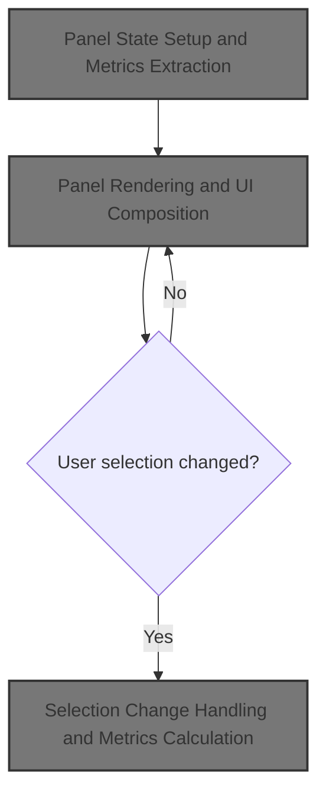

This document describes the flow for displaying and updating the details panel, an interactive part of the trace analysis UI that visualizes callstack metrics as a flamegraph. The panel updates dynamically based on user selections and maintains state to enhance the exploration of performance data.



# Panel State Setup and Metrics Extraction

```mermaid
%%{init: {"flowchart": {"defaultRenderer": "elk"}} }%%
flowchart TD
    node1["Prepare panel configuration, metrics, and serialization"] --> node2{"Is previous panel state available?"}
    click node1 openCode "ui/src/plugins/dev.perfetto.InstrumentsSamplesProfile/instruments_samples_profile_track.ts:72:121"
    node2 -->|"Yes"| node3["Restore panel state from serialization and clear serialization"]
    click node2 openCode "ui/src/plugins/dev.perfetto.InstrumentsSamplesProfile/instruments_samples_profile_track.ts:126:130"
    node2 -->|"No"| node4["Use default panel state"]
    click node3 openCode "ui/src/plugins/dev.perfetto.InstrumentsSamplesProfile/instruments_samples_profile_track.ts:127:130"
    click node4 openCode "ui/src/plugins/dev.perfetto.InstrumentsSamplesProfile/instruments_samples_profile_track.ts:119:121"
    node3 --> node5["Render details panel with metrics and trace; update state on user interaction"]
    node4 --> node5
    click node5 openCode "ui/src/plugins/dev.perfetto.InstrumentsSamplesProfile/instruments_samples_profile_track.ts:132:143"
    node5 --> node6["Return panel configuration including serialization and state management"]
    click node6 openCode "ui/src/plugins/dev.perfetto.InstrumentsSamplesProfile/instruments_samples_profile_track.ts:144:146"
classDef HeadingStyle fill:#777777,stroke:#333,stroke-width:2px;

%% Swimm:
%% %%{init: {"flowchart": {"defaultRenderer": "elk"}} }%%
%% flowchart TD
%%     node1["Prepare panel configuration, metrics, and serialization"] --> node2{"Is previous panel state available?"}
%%     click node1 openCode "<SwmPath>[ui/…/dev.perfetto.InstrumentsSamplesProfile/instruments_samples_profile_track.ts](ui/src/plugins/dev.perfetto.InstrumentsSamplesProfile/instruments_samples_profile_track.ts)</SwmPath>:72:121"
%%     node2 -->|"Yes"| node3["Restore panel state from serialization and clear serialization"]
%%     click node2 openCode "<SwmPath>[ui/…/dev.perfetto.InstrumentsSamplesProfile/instruments_samples_profile_track.ts](ui/src/plugins/dev.perfetto.InstrumentsSamplesProfile/instruments_samples_profile_track.ts)</SwmPath>:126:130"
%%     node2 -->|"No"| node4["Use default panel state"]
%%     click node3 openCode "<SwmPath>[ui/…/dev.perfetto.InstrumentsSamplesProfile/instruments_samples_profile_track.ts](ui/src/plugins/dev.perfetto.InstrumentsSamplesProfile/instruments_samples_profile_track.ts)</SwmPath>:127:130"
%%     click node4 openCode "<SwmPath>[ui/…/dev.perfetto.InstrumentsSamplesProfile/instruments_samples_profile_track.ts](ui/src/plugins/dev.perfetto.InstrumentsSamplesProfile/instruments_samples_profile_track.ts)</SwmPath>:119:121"
%%     node3 --> node5["Render details panel with metrics and trace; update state on user interaction"]
%%     node4 --> node5
%%     click node5 openCode "<SwmPath>[ui/…/dev.perfetto.InstrumentsSamplesProfile/instruments_samples_profile_track.ts](ui/src/plugins/dev.perfetto.InstrumentsSamplesProfile/instruments_samples_profile_track.ts)</SwmPath>:132:143"
%%     node5 --> node6["Return panel configuration including serialization and state management"]
%%     click node6 openCode "<SwmPath>[ui/…/dev.perfetto.InstrumentsSamplesProfile/instruments_samples_profile_track.ts](ui/src/plugins/dev.perfetto.InstrumentsSamplesProfile/instruments_samples_profile_track.ts)</SwmPath>:144:146"
%% classDef HeadingStyle fill:#777777,stroke:#333,stroke-width:2px;
```



<SwmSnippet path="/ui/src/plugins/dev.perfetto.InstrumentsSamplesProfile/instruments_samples_profile_track.ts" line="72">

---

DetailsPanel kicks off the flow by setting up state management for the flamegraph panel, including a serialization object for UI state persistence. It runs a SQL query to extract callstack metrics for a specific timestamp and process, then initializes the flamegraph state. Next, it calls <SwmToken path="ui/src/plugins/dev.perfetto.InstrumentsSamplesProfile/instruments_samples_profile_track.ts" pos="133:1:1" line-data="          renderDetailsPanel(">`renderDetailsPanel`</SwmToken> to actually build and display the panel UI using the prepared metrics and state.

```typescript
    detailsPanel: (row) => {
      // TODO(lalitm): we should be able remove this around the 26Q2 timeframe
      // We moved serialization from being attached to selections to instead being
      // attached to the plugin that loaded the panel.
      const serialization = {
        schema: FLAMEGRAPH_STATE_SCHEMA.optional(),
        state: undefined as FlamegraphState | undefined,
      };
      const flamegraph = new QueryFlamegraph(trace);
      const metrics: ReadonlyArray<QueryFlamegraphMetric> =
        metricsFromTableOrSubquery(
          `
            (
              select
                id,
                parent_id as parentId,
                name,
                mapping_name,
                source_file || ':' || line_number as source_location,
                self_count
              from _callstacks_for_callsites!((
                select p.callsite_id
                from instruments_sample p
                join thread t using (utid)
                where p.ts >= ${row.ts}
                  and p.ts <= ${row.ts}
                  and t.upid = ${upid}
              ))
            )
          `,
          [
            {
              name: 'Instruments Samples',
              unit: '',
              columnName: 'self_count',
            },
          ],
          'include perfetto module appleos.instruments.samples',
          [{name: 'mapping_name', displayName: 'Mapping'}],
          [
            {
              name: 'source_location',
              displayName: 'Source Location',
              mergeAggregation: 'ONE_OR_SUMMARY',
            },
          ],
        );
      let state = detailsPanelState ?? Flamegraph.createDefaultState(metrics);

      return {
        load: async () => {
          // If the state in the serialization is not undefined, we should read from
          // it.
          // TODO(lalitm): remove this in 26Q2 - see comment on `serialization`.
          if (serialization.state !== undefined) {
            state = Flamegraph.updateState(serialization.state, metrics);
            onDetailsPanelStateChange(state);
            serialization.state = undefined;
          }
        },
        render: () =>
          renderDetailsPanel(
            trace,
            flamegraph,
            metrics,
            Time.fromRaw(row.ts),
            state,
            (newState) => {
              state = newState;
              onDetailsPanelStateChange(newState);
            },
          ),
        serialization,
      };
    },
```

---

</SwmSnippet>

# Panel Rendering and UI Composition

<SwmSnippet path="/ui/src/plugins/dev.perfetto.InstrumentsSamplesProfile/instruments_samples_profile_track.ts" line="260">

---

RenderDetailsPanel builds the UI for the details panel, wiring up the flamegraph visualization with metrics and state, and adding timestamp info. Next, the flow moves to the plugin's main index file to handle selection changes and update the flamegraph data.

```typescript
function renderDetailsPanel(
  trace: Trace,
  flamegraph: QueryFlamegraph,
  metrics: ReadonlyArray<QueryFlamegraphMetric>,
  ts: time,
  state: FlamegraphState | undefined,
  onStateChange: (state: FlamegraphState) => void,
) {
  return m(
    '.pf-flamegraph-profile',
    m(
      DetailsShell,
      {
        fillHeight: true,
        title: 'Instruments Samples',
        buttons: m(Stack, {orientation: 'horizontal', spacing: 'large'}, [
          m('span', [
            `First timestamp: `,
            m(Timestamp, {
              trace,
              ts,
            }),
          ]),
          m('span', [
            `Last timestamp: `,
            m(Timestamp, {
              trace,
              ts,
            }),
          ]),
        ]),
      },
      flamegraph.render({metrics, state, onStateChange}),
    ),
  );
}
```

---

</SwmSnippet>

# Selection Change Handling and Metrics Calculation

```mermaid
%%{init: {"flowchart": {"defaultRenderer": "elk"}} }%%
flowchart TD
  node1["User selects area to visualize"] --> node2{"Has selection changed?"}
  click node1 openCode "ui/src/plugins/dev.perfetto.InstrumentsSamplesProfile/index.ts:182:185"
  node2 -->|"Yes"| node3["Update visualization for new selection"]
  click node2 openCode "ui/src/plugins/dev.perfetto.InstrumentsSamplesProfile/index.ts:183:185"
  click node3 openCode "ui/src/plugins/dev.perfetto.InstrumentsSamplesProfile/index.ts:186:192"
  node2 -->|"No"| node4["Keep current visualization"]
  click node4 openCode "ui/src/plugins/dev.perfetto.InstrumentsSamplesProfile/index.ts:193:195"
  node3 --> node5{"Is visualization available?"}
  node4 --> node5
  click node5 openCode "ui/src/plugins/dev.perfetto.InstrumentsSamplesProfile/index.ts:193:195"
  node5 -->|"Yes"| node6["Show rendered flamegraph with metrics"]
  click node6 openCode "ui/src/plugins/dev.perfetto.InstrumentsSamplesProfile/index.ts:196:209"
  node5 -->|"No"| node7["Show nothing"]
  click node7 openCode "ui/src/plugins/dev.perfetto.InstrumentsSamplesProfile/index.ts:194:195"

classDef HeadingStyle fill:#777777,stroke:#333,stroke-width:2px;

%% Swimm:
%% %%{init: {"flowchart": {"defaultRenderer": "elk"}} }%%
%% flowchart TD
%%   node1["User selects area to visualize"] --> node2{"Has selection changed?"}
%%   click node1 openCode "<SwmPath>[ui/…/dev.perfetto.InstrumentsSamplesProfile/index.ts](ui/src/plugins/dev.perfetto.InstrumentsSamplesProfile/index.ts)</SwmPath>:182:185"
%%   node2 -->|"Yes"| node3["Update visualization for new selection"]
%%   click node2 openCode "<SwmPath>[ui/…/dev.perfetto.InstrumentsSamplesProfile/index.ts](ui/src/plugins/dev.perfetto.InstrumentsSamplesProfile/index.ts)</SwmPath>:183:185"
%%   click node3 openCode "<SwmPath>[ui/…/dev.perfetto.InstrumentsSamplesProfile/index.ts](ui/src/plugins/dev.perfetto.InstrumentsSamplesProfile/index.ts)</SwmPath>:186:192"
%%   node2 -->|"No"| node4["Keep current visualization"]
%%   click node4 openCode "<SwmPath>[ui/…/dev.perfetto.InstrumentsSamplesProfile/index.ts](ui/src/plugins/dev.perfetto.InstrumentsSamplesProfile/index.ts)</SwmPath>:193:195"
%%   node3 --> node5{"Is visualization available?"}
%%   node4 --> node5
%%   click node5 openCode "<SwmPath>[ui/…/dev.perfetto.InstrumentsSamplesProfile/index.ts](ui/src/plugins/dev.perfetto.InstrumentsSamplesProfile/index.ts)</SwmPath>:193:195"
%%   node5 -->|"Yes"| node6["Show rendered flamegraph with metrics"]
%%   click node6 openCode "<SwmPath>[ui/…/dev.perfetto.InstrumentsSamplesProfile/index.ts](ui/src/plugins/dev.perfetto.InstrumentsSamplesProfile/index.ts)</SwmPath>:196:209"
%%   node5 -->|"No"| node7["Show nothing"]
%%   click node7 openCode "<SwmPath>[ui/…/dev.perfetto.InstrumentsSamplesProfile/index.ts](ui/src/plugins/dev.perfetto.InstrumentsSamplesProfile/index.ts)</SwmPath>:194:195"
%% 
%% classDef HeadingStyle fill:#777777,stroke:#333,stroke-width:2px;
```



<SwmSnippet path="/ui/src/plugins/dev.perfetto.InstrumentsSamplesProfile/index.ts" line="182">

---

In render, the plugin checks if the selection has changed and, if so, recalculates the flamegraph metrics. Next, it calls <SwmToken path="ui/src/plugins/dev.perfetto.InstrumentsSamplesProfile/index.ts" pos="187:7:7" line-data="          flamegraphWithMetrics = this.computeInstrumentsSampleFlamegraph(">`computeInstrumentsSampleFlamegraph`</SwmToken> to fetch new metrics and update the visualization.

```typescript
      render: (selection: AreaSelection) => {
        const changed =
          previousSelection === undefined ||
          !areaSelectionsEqual(previousSelection, selection);
        if (changed) {
          flamegraphWithMetrics = this.computeInstrumentsSampleFlamegraph(
            trace,
            selection,
          );
          previousSelection = selection;
        }
        if (flamegraphWithMetrics === undefined) {
          return undefined;
        }
```

---

</SwmSnippet>

<SwmSnippet path="/ui/src/plugins/dev.perfetto.InstrumentsSamplesProfile/index.ts" line="214">

---

ComputeInstrumentsSampleFlamegraph extracts process and thread IDs from the selection, builds a SQL query to fetch callstack metrics for the selected time range, updates the flamegraph state in the store, and returns the flamegraph object with metrics.

```typescript
  private computeInstrumentsSampleFlamegraph(
    trace: Trace,
    currentSelection: AreaSelection,
  ): QueryFlamegraphWithMetrics | undefined {
    const upids = getUpidsFromInstrumentsSampleAreaSelection(currentSelection);
    const utids = getUtidsFromInstrumentsSampleAreaSelection(currentSelection);
    if (utids.length === 0 && upids.length === 0) {
      return undefined;
    }
    const metrics = metricsFromTableOrSubquery(
      `
      (
        select id, parent_id as parentId, name, self_count
        from _callstacks_for_callsites!((
          select p.callsite_id
          from instruments_sample p
          join thread t using (utid)
          where p.ts >= ${currentSelection.start}
            and p.ts <= ${currentSelection.end}
            and (
              p.utid in (${utids.join(',')})
              or t.upid in (${upids.join(',')})
            )
        ))
      )
    `,
      [
        {
          name: 'Instruments Samples',
          unit: '',
          columnName: 'self_count',
        },
      ],
      'include perfetto module appleos.instruments.samples',
    );
    const store = assertExists(this.store);
    store.edit((draft) => {
      draft.areaSelectionFlamegraphState = Flamegraph.updateState(
        draft.areaSelectionFlamegraphState,
        metrics,
      );
    });
    return {flamegraph: new QueryFlamegraph(trace), metrics};
  }
```

---

</SwmSnippet>

<SwmSnippet path="/ui/src/plugins/dev.perfetto.InstrumentsSamplesProfile/index.ts" line="196">

---

We just got the flamegraph and metrics from <SwmToken path="ui/src/plugins/dev.perfetto.InstrumentsSamplesProfile/index.ts" pos="187:7:7" line-data="          flamegraphWithMetrics = this.computeInstrumentsSampleFlamegraph(">`computeInstrumentsSampleFlamegraph`</SwmToken>, and now they're used to render the UI content with the current store state and handle state changes.

```typescript
        const {flamegraph, metrics} = flamegraphWithMetrics;
        const store = assertExists(this.store);
        return {
          isLoading: false,
          content: flamegraph.render({
            metrics,
            state: store.state.areaSelectionFlamegraphState,
            onStateChange: (state) => {
              store.edit((draft) => {
                draft.areaSelectionFlamegraphState = state;
              });
            },
          }),
        };
      },
```

---

</SwmSnippet>

&nbsp;

*This is an auto-generated document by Swimm 🌊 and has not yet been verified by a human*

<SwmMeta version="3.0.0" repo-id="Z2l0aHViJTNBJTNBY3BsdXNwbHVzLXBlcmZldHRvJTNBJTNBcmljYXJkb2xvcGV6Zw==" repo-name="cplusplus-perfetto"><sup>Powered by [Swimm](https://app.swimm.io/)</sup></SwmMeta>
