This document describes how wakeup information is determined for a thread during a scheduling event. By analyzing thread state transitions, the flow identifies the thread responsible for the wakeup and provides details such as the waker's CPU, thread ID, and the wakeup timestamp.

# Where is this flow used?

This flow is used multiple times in the codebase as represented in the following diagram:

```mermaid
graph TD;
      ba5681248b29d1d73fc4ff219b6582525785c6b6c0ade329e07e9b22fffa1094(ui/…/dev.perfetto.Sched/sched_details_tab.ts::SchedSliceDetailsPanel.load) --> 77a64d291a888ebfa2790171b15093ca679775b07ed12dde2fecc245daa28e59(ui/…/sql_utils/sched.ts::getSchedWakeupInfo):::mainFlowStyle

ff7c1dfe0044d6024f93095d291f76baef539181fe877ce6bac9b849a1b607f5(ui/…/dev.perfetto.Sched/waker_overlay.ts::WakerOverlay.loadWakeupInfo) --> 77a64d291a888ebfa2790171b15093ca679775b07ed12dde2fecc245daa28e59(ui/…/sql_utils/sched.ts::getSchedWakeupInfo):::mainFlowStyle

0478d9a6f258e58f21c1e02d21e74fb872cbea5678171e531c9ce406d2cf8d02(ui/…/dev.perfetto.Sched/waker_overlay.ts::WakerOverlay.render) --> ff7c1dfe0044d6024f93095d291f76baef539181fe877ce6bac9b849a1b607f5(ui/…/dev.perfetto.Sched/waker_overlay.ts::WakerOverlay.loadWakeupInfo)


classDef mainFlowStyle color:#000000,fill:#7CB9F4
classDef rootsStyle color:#000000,fill:#00FFF4
classDef Style1 color:#000000,fill:#00FFAA
classDef Style2 color:#000000,fill:#FFFF00
classDef Style3 color:#000000,fill:#AA7CB9

%% Swimm:
%% graph TD;
%%       ba5681248b29d1d73fc4ff219b6582525785c6b6c0ade329e07e9b22fffa1094(<SwmPath>[ui/…/dev.perfetto.Sched/sched_details_tab.ts](ui/src/plugins/dev.perfetto.Sched/sched_details_tab.ts)</SwmPath>::SchedSliceDetailsPanel.load) --> 77a64d291a888ebfa2790171b15093ca679775b07ed12dde2fecc245daa28e59(<SwmPath>[ui/…/sql_utils/sched.ts](ui/src/components/sql_utils/sched.ts)</SwmPath>::<SwmToken path="ui/src/components/sql_utils/sched.ts" pos="132:6:6" line-data="export async function getSchedWakeupInfo(">`getSchedWakeupInfo`</SwmToken>):::mainFlowStyle
%% 
%% ff7c1dfe0044d6024f93095d291f76baef539181fe877ce6bac9b849a1b607f5(<SwmPath>[ui/…/dev.perfetto.Sched/waker_overlay.ts](ui/src/plugins/dev.perfetto.Sched/waker_overlay.ts)</SwmPath>::WakerOverlay.loadWakeupInfo) --> 77a64d291a888ebfa2790171b15093ca679775b07ed12dde2fecc245daa28e59(<SwmPath>[ui/…/sql_utils/sched.ts](ui/src/components/sql_utils/sched.ts)</SwmPath>::<SwmToken path="ui/src/components/sql_utils/sched.ts" pos="132:6:6" line-data="export async function getSchedWakeupInfo(">`getSchedWakeupInfo`</SwmToken>):::mainFlowStyle
%% 
%% 0478d9a6f258e58f21c1e02d21e74fb872cbea5678171e531c9ce406d2cf8d02(<SwmPath>[ui/…/dev.perfetto.Sched/waker_overlay.ts](ui/src/plugins/dev.perfetto.Sched/waker_overlay.ts)</SwmPath>::WakerOverlay.render) --> ff7c1dfe0044d6024f93095d291f76baef539181fe877ce6bac9b849a1b607f5(<SwmPath>[ui/…/dev.perfetto.Sched/waker_overlay.ts](ui/src/plugins/dev.perfetto.Sched/waker_overlay.ts)</SwmPath>::WakerOverlay.loadWakeupInfo)
%% 
%% 
%% classDef mainFlowStyle color:#000000,fill:#7CB9F4
%% classDef rootsStyle color:#000000,fill:#00FFF4
%% classDef Style1 color:#000000,fill:#00FFAA
%% classDef Style2 color:#000000,fill:#FFFF00
%% classDef Style3 color:#000000,fill:#AA7CB9
```



# Tracing Wakeup Events and Thread State Resolution


<SwmSnippet path="/ui/src/components/sql_utils/sched.ts" line="132">

---

In <SwmToken path="ui/src/components/sql_utils/sched.ts" pos="132:6:6" line-data="export async function getSchedWakeupInfo(">`getSchedWakeupInfo`</SwmToken>, we kick off by querying for the previous runnable state of the thread at the exact timestamp before the scheduling event. We use <SwmToken path="ui/src/components/sql_utils/sched.ts" pos="136:9:9" line-data="  const prevRunnable = await getThreadStateFromConstraints(engine, {">`getThreadStateFromConstraints`</SwmToken> to get detailed info about that thread state, which lets us check if there's a valid <SwmToken path="ui/src/components/sql_utils/sched.ts" pos="144:19:19" line-data="  if (prevRunnable.length === 0 || prevRunnable[0].wakerId === undefined) {">`wakerId`</SwmToken>. If not, we bail early. We need to call into <SwmPath>[ui/…/sql_utils/thread_state.ts](ui/src/components/sql_utils/thread_state.ts)</SwmPath> next to fetch more details about the waker thread, since that's not included in the initial query.

```typescript
export async function getSchedWakeupInfo(
  engine: Engine,
  sched: Sched,
): Promise<SchedWakeupInfo | undefined> {
  const prevRunnable = await getThreadStateFromConstraints(engine, {
    filters: [
      'state = "R"',
      `ts + dur = ${sched.ts}`,
      `utid = ${sched.thread.utid}`,
      `(irq_context is null or irq_context = 0)`,
    ],
  });
  if (prevRunnable.length === 0 || prevRunnable[0].wakerId === undefined) {
    return undefined;
  }
```

---

</SwmSnippet>

<SwmSnippet path="/ui/src/components/sql_utils/thread_state.ts" line="125">

---

<SwmToken path="ui/src/components/sql_utils/thread_state.ts" pos="125:6:6" line-data="export async function getThreadStateFromConstraints(">`getThreadStateFromConstraints`</SwmToken> builds a SQL query joining <SwmToken path="ui/src/components/sql_utils/thread_state.ts" pos="145:3:3" line-data="    FROM thread_state ts">`thread_state`</SwmToken> and sched tables to get detailed thread state info, then iterates over the results, transforming raw DB fields to domain types and fetching thread/process info for each row asynchronously. This gives us a fully populated <SwmToken path="ui/src/components/sql_utils/thread_state.ts" pos="128:5:5" line-data="): Promise&lt;ThreadState[]&gt; {">`ThreadState`</SwmToken> array for further use.

```typescript
export async function getThreadStateFromConstraints(
  engine: Engine,
  constraints: SQLConstraints,
): Promise<ThreadState[]> {
  const query = await engine.query(`
    WITH raw AS (
      SELECT
      ts.id,
      sched.id AS sched_id,
      ts.ts,
      ts.dur,
      ts.cpu,
      ts.state,
      ts.blocked_function,
      ts.io_wait,
      ts.utid,
      ts.waker_utid,
      ts.waker_id,
      ts.irq_context,
      sched.priority
    FROM thread_state ts
    LEFT JOIN sched USING (utid, ts)
    )
    SELECT * FROM raw

    ${constraintsToQuerySuffix(constraints)}`);
  const it = query.iter({
    id: NUM,
    sched_id: NUM_NULL,
    ts: LONG,
    dur: LONG,
    cpu: NUM_NULL,
    state: STR_NULL,
    blocked_function: STR_NULL,
    io_wait: NUM_NULL,
    utid: NUM,
    waker_utid: NUM_NULL,
    waker_id: NUM_NULL,
    irq_context: NUM_NULL,
    priority: NUM_NULL,
  });

  const result: ThreadState[] = [];

  for (; it.valid(); it.next()) {
    const ioWait = it.io_wait === null ? undefined : it.io_wait > 0;

    // TODO(altimin): Consider fetching thread / process info using a single
    // query instead of one per row.
    result.push({
      id: it.id as ThreadStateSqlId,
      schedSqlId: fromNumNull(it.sched_id) as SchedSqlId | undefined,
      ts: Time.fromRaw(it.ts),
      dur: it.dur,
      cpu: fromNumNull(it.cpu),
      state: translateState(it.state ?? undefined, ioWait),
      blockedFunction: it.blocked_function ?? undefined,
      thread: await getThreadInfo(engine, asUtid(it.utid)),
      wakerUtid: asUtid(it.waker_utid ?? undefined),
      wakerId: asThreadStateSqlId(it.waker_id ?? undefined),
      wakerInterruptCtx: fromNumNull(it.irq_context) as boolean | undefined,
      priority: fromNumNull(it.priority),
    });
  }
```

---

</SwmSnippet>

<SwmSnippet path="/ui/src/components/sql_utils/sched.ts" line="147">

---

Back in <SwmToken path="ui/src/components/sql_utils/sched.ts" pos="132:6:6" line-data="export async function getSchedWakeupInfo(">`getSchedWakeupInfo`</SwmToken>, after getting the previous runnable thread state, we fetch the full waker thread state using its ID. This gives us the CPU and other details needed for the wakeup info. If the waker isn't found, we return undefined; otherwise, we package up the relevant info.

```typescript
  const waker = await getThreadState(engine, prevRunnable[0].wakerId);
  if (waker === undefined) {
    return undefined;
  }
  return {
    wakerCpu: waker?.cpu,
    wakerUtid: prevRunnable[0].wakerUtid,
    wakeupTs: prevRunnable[0].ts,
  };
}
```

---

</SwmSnippet>

<SwmSnippet path="/ui/src/components/sql_utils/thread_state.ts" line="192">

---

<SwmToken path="ui/src/components/sql_utils/thread_state.ts" pos="192:6:6" line-data="export async function getThreadState(">`getThreadState`</SwmToken> wraps <SwmToken path="ui/src/components/sql_utils/thread_state.ts" pos="196:9:9" line-data="  const result = await getThreadStateFromConstraints(engine, {">`getThreadStateFromConstraints`</SwmToken> to fetch a single thread state by ID. It checks for uniqueness and returns the thread state or undefined. This is used to get full details for a specific thread state, like the waker in the wakeup flow.

```typescript
export async function getThreadState(
  engine: Engine,
  id: number,
): Promise<ThreadState | undefined> {
  const result = await getThreadStateFromConstraints(engine, {
    filters: [`id=${id}`],
  });
  if (result.length > 1) {
    throw new Error(`thread_state table has more than one row with id ${id}`);
  }
  if (result.length === 0) {
    return undefined;
  }
  return result[0];
}
```

---

</SwmSnippet>

&nbsp;

*This is an auto-generated document by Swimm 🌊 and has not yet been verified by a human*

<SwmMeta version="3.0.0" repo-id="Z2l0aHViJTNBJTNBY3BsdXNwbHVzLXBlcmZldHRvJTNBJTNBcmljYXJkb2xvcGV6Zw==" repo-name="cplusplus-perfetto"><sup>Powered by [Swimm](https://app.swimm.io/)</sup></SwmMeta>
