```mermaid
%%{init: {"flowchart": {"defaultRenderer": "elk"}} }%%
flowchart TD
  node1["Start connection to Android device"]
  click node1 openCode "ui/src/plugins/dev.perfetto.RecordTraceV2/adb/webusb/adb_webusb_device.ts:71:75"
  node1 --> node2{"Is device compatible?"}
  click node2 openCode "ui/src/plugins/dev.perfetto.RecordTraceV2/adb/webusb/adb_webusb_device.ts:75:81"
  node2 -->|"No"| node3["Show error: Device not compatible"]
  click node3 openCode "ui/src/plugins/dev.perfetto.RecordTraceV2/adb/webusb/adb_webusb_device.ts:77:80"
  node2 -->|"Yes"| node4["Prepare device for communication"]
  click node4 openCode "ui/src/plugins/dev.perfetto.RecordTraceV2/adb/webusb/adb_webusb_device.ts:82:91"
  node4 --> node5{"Is authentication key available?"}
  click node5 openCode "ui/src/plugins/dev.perfetto.RecordTraceV2/adb/webusb/adb_webusb_device.ts:99:100"
  node5 -->|"No"| node6["Generate new authentication key"]
  click node6 openCode "ui/src/plugins/dev.perfetto.RecordTraceV2/adb/webusb/adb_key_manager.ts:32:71"
  node5 -->|"Yes"| node7["Initiate connection handshake"]
  click node7 openCode "ui/src/plugins/dev.perfetto.RecordTraceV2/adb/webusb/adb_webusb_device.ts:103:109"
  node6 --> node7
  node7 --> node8["Begin authentication"]
  click node8 openCode "ui/src/plugins/dev.perfetto.RecordTraceV2/adb/webusb/adb_webusb_device.ts:119:161"
  subgraph loop1["Up to 10 authentication attempts"]
    node8 --> node9{"Device responds with CNXN?"}
    click node9 openCode "ui/src/plugins/dev.perfetto.RecordTraceV2/adb/webusb/adb_webusb_device.ts:122:133"
    node9 -->|"Yes"| node10{"Is ADB protocol version supported?"}
    click node10 openCode "ui/src/plugins/dev.perfetto.RecordTraceV2/adb/webusb/adb_webusb_device.ts:126:130"
    node10 -->|"No"| node11["Show error: Unsupported protocol version"]
    click node11 openCode "ui/src/plugins/dev.perfetto.RecordTraceV2/adb/webusb/adb_webusb_device.ts:128:129"
    node10 -->|"Yes"| node12["Connection successful"]
    click node12 openCode "ui/src/plugins/dev.perfetto.RecordTraceV2/adb/webusb/adb_webusb_device.ts:132:133"
    node9 -->|"No"| node13{"Device requests authentication?"}
    click node13 openCode "ui/src/plugins/dev.perfetto.RecordTraceV2/adb/webusb/adb_webusb_device.ts:135:138"
    node13 -->|"No"| node14["Wait for valid response"]
    click node14 openCode "ui/src/plugins/dev.perfetto.RecordTraceV2/adb/webusb/adb_webusb_device.ts:136:137"
    node13 -->|"Yes"| node15["Sign nonce or present public key"]
    click node15 openCode "ui/src/plugins/dev.perfetto.RecordTraceV2/adb/webusb/adb_webusb_device.ts:140:159"
    node15 --> node8
    node14 --> node8
  end
  node8 --> node16{"Max attempts reached?"}
  click node16 openCode "ui/src/plugins/dev.perfetto.RecordTraceV2/adb/webusb/adb_webusb_device.ts:119:161"
  node16 -->|"Yes"| node17["Show error: Authentication failed"]
  click node17 openCode "ui/src/plugins/dev.perfetto.RecordTraceV2/adb/webusb/adb_webusb_device.ts:160:161"
  node16 -->|"No"| node8

classDef HeadingStyle fill:#777777,stroke:#333,stroke-width:2px;

%% Swimm:
%% %%{init: {"flowchart": {"defaultRenderer": "elk"}} }%%
%% flowchart TD
%%   node1["Start connection to Android device"]
%%   click node1 openCode "<SwmPath>[ui/…/webusb/adb_webusb_device.ts](ui/src/plugins/dev.perfetto.RecordTraceV2/adb/webusb/adb_webusb_device.ts)</SwmPath>:71:75"
%%   node1 --> node2{"Is device compatible?"}
%%   click node2 openCode "<SwmPath>[ui/…/webusb/adb_webusb_device.ts](ui/src/plugins/dev.perfetto.RecordTraceV2/adb/webusb/adb_webusb_device.ts)</SwmPath>:75:81"
%%   node2 -->|"No"| node3["Show error: Device not compatible"]
%%   click node3 openCode "<SwmPath>[ui/…/webusb/adb_webusb_device.ts](ui/src/plugins/dev.perfetto.RecordTraceV2/adb/webusb/adb_webusb_device.ts)</SwmPath>:77:80"
%%   node2 -->|"Yes"| node4["Prepare device for communication"]
%%   click node4 openCode "<SwmPath>[ui/…/webusb/adb_webusb_device.ts](ui/src/plugins/dev.perfetto.RecordTraceV2/adb/webusb/adb_webusb_device.ts)</SwmPath>:82:91"
%%   node4 --> node5{"Is authentication key available?"}
%%   click node5 openCode "<SwmPath>[ui/…/webusb/adb_webusb_device.ts](ui/src/plugins/dev.perfetto.RecordTraceV2/adb/webusb/adb_webusb_device.ts)</SwmPath>:99:100"
%%   node5 -->|"No"| node6["Generate new authentication key"]
%%   click node6 openCode "<SwmPath>[ui/…/webusb/adb_key_manager.ts](ui/src/plugins/dev.perfetto.RecordTraceV2/adb/webusb/adb_key_manager.ts)</SwmPath>:32:71"
%%   node5 -->|"Yes"| node7["Initiate connection handshake"]
%%   click node7 openCode "<SwmPath>[ui/…/webusb/adb_webusb_device.ts](ui/src/plugins/dev.perfetto.RecordTraceV2/adb/webusb/adb_webusb_device.ts)</SwmPath>:103:109"
%%   node6 --> node7
%%   node7 --> node8["Begin authentication"]
%%   click node8 openCode "<SwmPath>[ui/…/webusb/adb_webusb_device.ts](ui/src/plugins/dev.perfetto.RecordTraceV2/adb/webusb/adb_webusb_device.ts)</SwmPath>:119:161"
%%   subgraph loop1["Up to 10 authentication attempts"]
%%     node8 --> node9{"Device responds with CNXN?"}
%%     click node9 openCode "<SwmPath>[ui/…/webusb/adb_webusb_device.ts](ui/src/plugins/dev.perfetto.RecordTraceV2/adb/webusb/adb_webusb_device.ts)</SwmPath>:122:133"
%%     node9 -->|"Yes"| node10{"Is ADB protocol version supported?"}
%%     click node10 openCode "<SwmPath>[ui/…/webusb/adb_webusb_device.ts](ui/src/plugins/dev.perfetto.RecordTraceV2/adb/webusb/adb_webusb_device.ts)</SwmPath>:126:130"
%%     node10 -->|"No"| node11["Show error: Unsupported protocol version"]
%%     click node11 openCode "<SwmPath>[ui/…/webusb/adb_webusb_device.ts](ui/src/plugins/dev.perfetto.RecordTraceV2/adb/webusb/adb_webusb_device.ts)</SwmPath>:128:129"
%%     node10 -->|"Yes"| node12["Connection successful"]
%%     click node12 openCode "<SwmPath>[ui/…/webusb/adb_webusb_device.ts](ui/src/plugins/dev.perfetto.RecordTraceV2/adb/webusb/adb_webusb_device.ts)</SwmPath>:132:133"
%%     node9 -->|"No"| node13{"Device requests authentication?"}
%%     click node13 openCode "<SwmPath>[ui/…/webusb/adb_webusb_device.ts](ui/src/plugins/dev.perfetto.RecordTraceV2/adb/webusb/adb_webusb_device.ts)</SwmPath>:135:138"
%%     node13 -->|"No"| node14["Wait for valid response"]
%%     click node14 openCode "<SwmPath>[ui/…/webusb/adb_webusb_device.ts](ui/src/plugins/dev.perfetto.RecordTraceV2/adb/webusb/adb_webusb_device.ts)</SwmPath>:136:137"
%%     node13 -->|"Yes"| node15["Sign nonce or present public key"]
%%     click node15 openCode "<SwmPath>[ui/…/webusb/adb_webusb_device.ts](ui/src/plugins/dev.perfetto.RecordTraceV2/adb/webusb/adb_webusb_device.ts)</SwmPath>:140:159"
%%     node15 --> node8
%%     node14 --> node8
%%   end
%%   node8 --> node16{"Max attempts reached?"}
%%   click node16 openCode "<SwmPath>[ui/…/webusb/adb_webusb_device.ts](ui/src/plugins/dev.perfetto.RecordTraceV2/adb/webusb/adb_webusb_device.ts)</SwmPath>:119:161"
%%   node16 -->|"Yes"| node17["Show error: Authentication failed"]
%%   click node17 openCode "<SwmPath>[ui/…/webusb/adb_webusb_device.ts](ui/src/plugins/dev.perfetto.RecordTraceV2/adb/webusb/adb_webusb_device.ts)</SwmPath>:160:161"
%%   node16 -->|"No"| node8
%% 
%% classDef HeadingStyle fill:#777777,stroke:#333,stroke-width:2px;
```

This document describes how the system verifies that an Android device is ready for tracing. The process starts with establishing a <SwmToken path="ui/src/plugins/dev.perfetto.RecordTraceV2/adb/webusb/adb_webusb_target.ts" pos="45:5:5" line-data="      name: &#39;WebUSB connection&#39;,">`WebUSB`</SwmToken> connection and authenticating the device, followed by checks for Android version, tracing service status, and overall device readiness. Each check yields a result indicating whether the device is prepared for tracing operations.

# Starting <SwmToken path="ui/src/plugins/dev.perfetto.RecordTraceV2/adb/webusb/adb_webusb_target.ts" pos="45:5:5" line-data="      name: &#39;WebUSB connection&#39;,">`WebUSB`</SwmToken> Preflight Checks

<SwmSnippet path="/ui/src/plugins/dev.perfetto.RecordTraceV2/adb/webusb/adb_webusb_target.ts" line="41">

---

In <SwmToken path="ui/src/plugins/dev.perfetto.RecordTraceV2/adb/webusb/adb_webusb_target.ts" pos="41:4:4" line-data="  async *runPreflightChecks(): AsyncGenerator&lt;PreflightCheck&gt; {">`runPreflightChecks`</SwmToken>, we start by verifying the device connection and yield its status, then move on only if the connection is good.

```typescript
  async *runPreflightChecks(): AsyncGenerator<PreflightCheck> {
    const status = await this.connectIfNeeded();

    yield {
      name: 'WebUSB connection',
      status: await (async (): Promise<Result<string>> => {
        if (!status.ok) return status;
        return okResult('connected');
      })(),
    };

    if (this.adbDevice.value === undefined) return;
```

---

</SwmSnippet>

## Ensuring Device Connection

<SwmSnippet path="/ui/src/plugins/dev.perfetto.RecordTraceV2/adb/webusb/adb_webusb_target.ts" line="56">

---

<SwmToken path="ui/src/plugins/dev.perfetto.RecordTraceV2/adb/webusb/adb_webusb_target.ts" pos="56:3:3" line-data="  async connectIfNeeded(): Promise&lt;Result&lt;AdbWebusbDevice&gt;&gt; {">`connectIfNeeded`</SwmToken> checks if we already have a connected device, and if not, it calls <SwmToken path="ui/src/plugins/dev.perfetto.RecordTraceV2/adb/webusb/adb_webusb_target.ts" pos="58:1:3" line-data="      AdbWebusbDevice.connect(this.usbiface.dev, this.adbKeyMgr),">`AdbWebusbDevice.connect`</SwmToken> to set up the connection. This step is needed to make sure we have a usable device object before running any platform-specific logic.

```typescript
  async connectIfNeeded(): Promise<Result<AdbWebusbDevice>> {
    return this.adbDevice.getOrCreate(() =>
      AdbWebusbDevice.connect(this.usbiface.dev, this.adbKeyMgr),
    );
  }
```

---

</SwmSnippet>

## Establishing and Authenticating ADB <SwmToken path="ui/src/plugins/dev.perfetto.RecordTraceV2/adb/webusb/adb_webusb_target.ts" pos="45:5:5" line-data="      name: &#39;WebUSB connection&#39;,">`WebUSB`</SwmToken> Connection



<SwmSnippet path="/ui/src/plugins/dev.perfetto.RecordTraceV2/adb/webusb/adb_webusb_device.ts" line="71">

---

In <SwmToken path="ui/src/plugins/dev.perfetto.RecordTraceV2/adb/webusb/adb_webusb_target.ts" pos="58:1:3" line-data="      AdbWebusbDevice.connect(this.usbiface.dev, this.adbKeyMgr),">`AdbWebusbDevice.connect`</SwmToken>, we open and configure the USB device, claim the ADB interface, and start the ADB handshake. We then fetch a key from <SwmToken path="ui/src/plugins/dev.perfetto.RecordTraceV2/adb/webusb/adb_webusb_device.ts" pos="73:1:1" line-data="    adbKeyMgr: AdbKeyManager,">`adbKeyMgr`</SwmToken> to handle authentication challenges. If the device doesn't recognize us, we prompt the user for authorization and retry up to 10 times to handle spurious messages. If everything checks out, we return a connected device; otherwise, we clean up and return an error.

```typescript
  static async connect(
    usbdev: USBDevice,
    adbKeyMgr: AdbKeyManager,
  ): Promise<Result<AdbWebusbDevice>> {
    const usb = getAdbWebUsbInterface(usbdev);
    if (usb === undefined) {
      return errResult(
        'Could not find the USB Interface. ' +
          'Try disconnecting and reconnecting the device.',
      );
    }
    if (usbdev.opened) {
      await usbdev.close();
    }
    await usbdev.open();
    using autoClose = new CloseDeviceWhenOutOfScope(usbdev);
    await usbdev.selectConfiguration(usb.configurationValue);

    try {
      await usbdev.claimInterface(usb.usbInterfaceNumber);
    } catch (err) {
      console.error(err);
      return errResult(
        'Failed to claim USB interface. Try `adb kill-server` or ' +
          'close other profiling tools and try again',
      );
    }

    const keyRes = await adbKeyMgr.getOrCreateKey();
    if (!keyRes.ok) return keyRes;
```

---

</SwmSnippet>

<SwmSnippet path="/ui/src/plugins/dev.perfetto.RecordTraceV2/adb/webusb/adb_key_manager.ts" line="32">

---

<SwmToken path="ui/src/plugins/dev.perfetto.RecordTraceV2/adb/webusb/adb_key_manager.ts" pos="32:3:3" line-data="  async getOrCreateKey(): Promise&lt;Result&lt;AdbKey&gt;&gt; {">`getOrCreateKey`</SwmToken> tries to fetch the ADB key from browser credentials with minimal user interaction. If it can't get the key, it asks the user before generating a new one, then saves it for future use. This avoids silent failures and keeps the key management user-driven.

```typescript
  async getOrCreateKey(): Promise<Result<AdbKey>> {
    this.refreshKeyExpiry();
    return this.key.getOrCreate(async () => {
      // 2. We try to get the private key from the browser.
      // The mediation is set as 'optional', because we use
      // 'preventSilentAccess', which sometimes requests the user to click
      // on a button to allow the auth, but sometimes only shows a
      // notification and does not require the user to click on anything.
      // If we had set mediation to 'required', the user would have been
      // asked to click on a button every time.
      if (hasPasswordCredential()) {
        const options: PasswordCredentialRequestOptions = {
          password: true,
          mediation: 'optional',
        };
        const credential = await navigator.credentials.get(options);
        await navigator.credentials.preventSilentAccess();
        if (exists(credential) && 'password' in credential) {
          return okResult(AdbKey.deserialize(credential.password as string));
        }
      }

      // This can happen in two cases:
      // 1. The very first time when we have no credentials saved.
      // 2. If the user (accidentally) dismisses the "sign in" dialog.
      // We use this UX to prevent that if the user accidentally clicks Escape,
      // we invalidate the key and generates a new one, which would be
      // unauthorized.
      if (!confirm("Couldn't load the ADB key. Generate a new key?")) {
        return errResult(
          "Couldn't load the ADB Key. " + 'Did you dismiss the sign-in dialog',
        );
      }

      // 3. We generate a new key pair.
      const newKey = await AdbKey.generateNewKeyPair();
      await storeKeyInBrowserCredentials(newKey);
      return okResult(newKey);
    });
  }
```

---

</SwmSnippet>

<SwmSnippet path="/ui/src/plugins/dev.perfetto.RecordTraceV2/adb/webusb/adb_webusb_device.ts" line="101">

---

Back in <SwmToken path="ui/src/plugins/dev.perfetto.RecordTraceV2/adb/webusb/adb_webusb_target.ts" pos="58:1:3" line-data="      AdbWebusbDevice.connect(this.usbiface.dev, this.adbKeyMgr),">`AdbWebusbDevice.connect`</SwmToken>, we use the key for authentication, prompt the user if needed, and clean up resources if it doesn't work out.

```typescript
    const key = keyRes.value;

    await AdbWebusbDevice.send(
      usb,
      'CNXN',
      VERSION_NO_CHECKSUM,
      DEFAULT_MAX_PAYLOAD_BYTES,
      'host:1:WebUsb',
    );

    // At this point there are two options:
    // 1. The device accepts the key and responds with a CNXN msg.
    // 2. The device doesn't recognize us, and responds with another AUTH msg.

    // We need to have some tolerance from queued messages from previous
    // sessions, hence the 10 attempts to deal with spurious messages.
    let authAttempts = 0;
    const modalKey = 'adbauth';
    for (let attempt = 0; attempt < 10; attempt++) {
      const msg = await this.recvMsg(usb);

      if (msg.cmd === 'CNXN') {
        // Success, the device authenticated us.
        closeModal(modalKey);
        const maxPayload = msg.arg1;
        const ver = msg.arg0;
        if (ver !== VERSION_WITH_CHECKSUM && ver !== VERSION_NO_CHECKSUM) {
          return errResult(`ADB version ${ver} not supported`);
        }
        const useChecksum = ver === VERSION_WITH_CHECKSUM;
        autoClose.keepOpen = true;
        return okResult(new AdbWebusbDevice(usb, maxPayload, useChecksum));
      }

      if (msg.cmd !== 'AUTH') {
        logSpuriousMsg(msg);
        continue;
      }

      assertTrue(msg.arg0 === AuthCmd.TOKEN);
      const authAttempt = authAttempts++;
      if (authAttempt === 0) {
        // Case 1: we are presented with a nonce to sign. If the device has
        // previously received our public key, the dialog asking for user
        // confirmation will NOT be displayed.
        const signedNonce = key.sign(msg.data);
        await this.send(usb, 'AUTH', AuthCmd.SIGNATURE, 0, signedNonce);
        continue;
      }
      if (authAttempt === 1) {
        // Case 2: present our public key. This will prompt the dialog.
        await this.send(usb, 'AUTH', AuthCmd.PUBKEY, 0, key.getPublicKey());
        showModal({
          key: modalKey,
          title: 'ADB Authorization required',
          content: 'Please unlock the device and authorize the ADB connection',
        });
        continue;
      }
      break;
    }
```

---

</SwmSnippet>

## Running Android Platform Checks

```mermaid
%%{init: {"flowchart": {"defaultRenderer": "elk"}} }%%
flowchart TD
  node1["Start preflight checks"]
  click node1 openCode "ui/src/plugins/dev.perfetto.RecordTraceV2/adb/webusb/adb_webusb_target.ts:53:54"
  node1 --> node2["Check Android version (API level >= 29)"]
  click node2 openCode "ui/src/plugins/dev.perfetto.RecordTraceV2/adb/adb_platform_checks.ts:30:41"
  node2 --> node3["Check if 'traced' service is running"]
  click node3 openCode "ui/src/plugins/dev.perfetto.RecordTraceV2/adb/adb_platform_checks.ts:43:55"
  node3 --> node4["Check tracing service version"]
  click node4 openCode "ui/src/plugins/dev.perfetto.RecordTraceV2/adb/adb_platform_checks.ts:57:63"
  node4 --> node5["Check tracing service state (producers, data sources, sessions)"]
  click node5 openCode "ui/src/plugins/dev.perfetto.RecordTraceV2/adb/adb_platform_checks.ts:65:76"
  node5 --> node6["All preflight check results yielded"]
  click node6 openCode "ui/src/plugins/dev.perfetto.RecordTraceV2/adb/webusb/adb_webusb_target.ts:53:54"

classDef HeadingStyle fill:#777777,stroke:#333,stroke-width:2px;

%% Swimm:
%% %%{init: {"flowchart": {"defaultRenderer": "elk"}} }%%
%% flowchart TD
%%   node1["Start preflight checks"]
%%   click node1 openCode "<SwmPath>[ui/…/webusb/adb_webusb_target.ts](ui/src/plugins/dev.perfetto.RecordTraceV2/adb/webusb/adb_webusb_target.ts)</SwmPath>:53:54"
%%   node1 --> node2["Check Android version (API level >= 29)"]
%%   click node2 openCode "<SwmPath>[ui/…/adb/adb_platform_checks.ts](ui/src/plugins/dev.perfetto.RecordTraceV2/adb/adb_platform_checks.ts)</SwmPath>:30:41"
%%   node2 --> node3["Check if 'traced' service is running"]
%%   click node3 openCode "<SwmPath>[ui/…/adb/adb_platform_checks.ts](ui/src/plugins/dev.perfetto.RecordTraceV2/adb/adb_platform_checks.ts)</SwmPath>:43:55"
%%   node3 --> node4["Check tracing service version"]
%%   click node4 openCode "<SwmPath>[ui/…/adb/adb_platform_checks.ts](ui/src/plugins/dev.perfetto.RecordTraceV2/adb/adb_platform_checks.ts)</SwmPath>:57:63"
%%   node4 --> node5["Check tracing service state (producers, data sources, sessions)"]
%%   click node5 openCode "<SwmPath>[ui/…/adb/adb_platform_checks.ts](ui/src/plugins/dev.perfetto.RecordTraceV2/adb/adb_platform_checks.ts)</SwmPath>:65:76"
%%   node5 --> node6["All preflight check results yielded"]
%%   click node6 openCode "<SwmPath>[ui/…/webusb/adb_webusb_target.ts](ui/src/plugins/dev.perfetto.RecordTraceV2/adb/webusb/adb_webusb_target.ts)</SwmPath>:53:54"
%% 
%% classDef HeadingStyle fill:#777777,stroke:#333,stroke-width:2px;
```



<SwmSnippet path="/ui/src/plugins/dev.perfetto.RecordTraceV2/adb/webusb/adb_webusb_target.ts" line="53">

---

After returning from <SwmToken path="ui/src/plugins/dev.perfetto.RecordTraceV2/adb/webusb/adb_webusb_target.ts" pos="42:11:11" line-data="    const status = await this.connectIfNeeded();">`connectIfNeeded`</SwmToken> in <SwmToken path="ui/src/plugins/dev.perfetto.RecordTraceV2/adb/webusb/adb_webusb_target.ts" pos="41:4:4" line-data="  async *runPreflightChecks(): AsyncGenerator&lt;PreflightCheck&gt; {">`runPreflightChecks`</SwmToken>, we move on to platform-specific checks by calling <SwmToken path="ui/src/plugins/dev.perfetto.RecordTraceV2/adb/webusb/adb_webusb_target.ts" pos="53:4:4" line-data="    yield* checkAndroidTarget(this.adbDevice.value);">`checkAndroidTarget`</SwmToken>. This step verifies the Android environment and tracing setup, making sure the device is ready for further operations.

```typescript
    yield* checkAndroidTarget(this.adbDevice.value);
  }
```

---

</SwmSnippet>

<SwmSnippet path="/ui/src/plugins/dev.perfetto.RecordTraceV2/adb/adb_platform_checks.ts" line="27">

---

<SwmToken path="ui/src/plugins/dev.perfetto.RecordTraceV2/adb/adb_platform_checks.ts" pos="27:7:7" line-data="export async function* checkAndroidTarget(">`checkAndroidTarget`</SwmToken> runs a series of shell commands on the device to check Android version (must be API 29+), whether the traced process is running, and the state of the tracing service. Results are yielded as <SwmToken path="ui/src/plugins/dev.perfetto.RecordTraceV2/adb/adb_platform_checks.ts" pos="29:5:5" line-data="): AsyncGenerator&lt;PreflightCheck&gt; {">`PreflightCheck`</SwmToken> objects, with errors and suggestions if something's missing.

```typescript
export async function* checkAndroidTarget(
  adbDevice: AdbDevice,
): AsyncGenerator<PreflightCheck> {
  yield {
    name: 'Android version',
    status: await (async (): Promise<Result<string>> => {
      const status = await adbDevice.shell('getprop ro.build.version.sdk');
      if (!status.ok) return status;
      const sdkVer = parseInt(status.value);
      const minApi = 29;
      if (sdkVer < minApi) {
        return errResult(`Android API level ${minApi}+ (Q+) required`);
      }
      return okResult(`API level ${sdkVer} >= ${minApi}`);
    })(),
  };
  yield {
    name: 'traced running?',
    status: await (async (): Promise<Result<string>> => {
      const status = await adbDevice.shell('pidof traced');
      if (!status.ok) return status;
      if (isFinite(parseInt(status.value))) {
        return okResult(`pid = ${status.value}`);
      }
      return errResult(
        'Not running. Try `adb shell setprop persist.traced.enable 1`',
      );
    })(),
  };
  const svcStatus = await getAdbTracingServiceState(adbDevice);
  yield {
    name: 'Traced version',
    status: await (async (): Promise<Result<string>> => {
      if (!svcStatus.ok) return svcStatus;
      return okResult(svcStatus.value.tracingServiceVersion ?? 'N/A');
    })(),
  };
  if (svcStatus === undefined) return;
  yield {
    name: 'Traced state',
    status: await (async (): Promise<Result<string>> => {
      if (!svcStatus.ok) return svcStatus;
      const tss: protos.ITracingServiceState = svcStatus.value;
      return okResult(
        `#producers: ${tss.producers?.length ?? 'N/A'}, ` +
          `#datasources: ${tss.dataSources?.length ?? 'N/A'}, ` +
          `#sessions: ${tss.numSessionsStarted ?? 'N/A'}`,
      );
    })(),
  };
}
```

---

</SwmSnippet>

&nbsp;

*This is an auto-generated document by Swimm 🌊 and has not yet been verified by a human*

<SwmMeta version="3.0.0" repo-id="Z2l0aHViJTNBJTNBY3BsdXNwbHVzLXBlcmZldHRvJTNBJTNBcmljYXJkb2xvcGV6Zw==" repo-name="cplusplus-perfetto"><sup>Powered by [Swimm](https://app.swimm.io/)</sup></SwmMeta>
