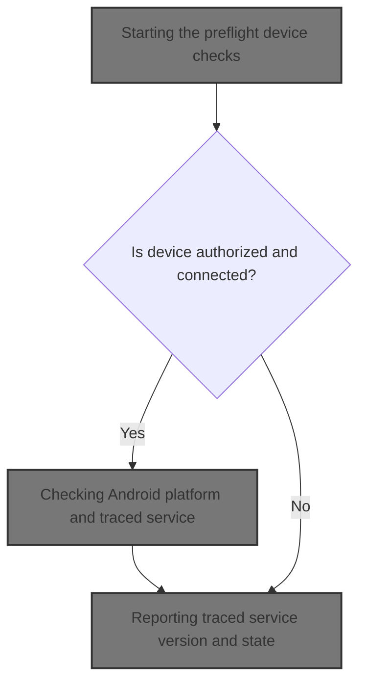

This document outlines the process for verifying that an Android device is ready for system tracing. The flow checks device connectivity and authorization, ensures platform compatibility, and confirms the tracing service is running. The input is a request to check device readiness, and the output is a sequence of status reports indicating whether the device can be used for profiling and trace analysis.



# Starting the preflight device checks

```mermaid
%%{init: {"flowchart": {"defaultRenderer": "elk"}} }%%
flowchart TD
  node1["Start preflight checks"]
  click node1 openCode "ui/src/plugins/dev.perfetto.RecordTraceV2/adb/web_device_proxy/wdp_target.ts:86:87"
  node1 --> node2["Handling device proxy authorization and connection"]
  
  node2 --> node3["Report device readiness"]
  click node3 openCode "ui/src/plugins/dev.perfetto.RecordTraceV2/adb/web_device_proxy/wdp_target.ts:89:92"
  node3 --> node4{"Is Android device available?"}
  click node4 openCode "ui/src/plugins/dev.perfetto.RecordTraceV2/adb/web_device_proxy/wdp_target.ts:93:94"
  node4 -->|"Yes"| node5["Perform Android device checks"]
  click node5 openCode "ui/src/plugins/dev.perfetto.RecordTraceV2/adb/web_device_proxy/wdp_target.ts:94:95"
  node4 -->|"No"| node5
classDef HeadingStyle fill:#777777,stroke:#333,stroke-width:2px;
click node2 goToHeading "Handling device proxy authorization and connection"
node2:::HeadingStyle

%% Swimm:
%% %%{init: {"flowchart": {"defaultRenderer": "elk"}} }%%
%% flowchart TD
%%   node1["Start preflight checks"]
%%   click node1 openCode "<SwmPath>[ui/…/web_device_proxy/wdp_target.ts](ui/src/plugins/dev.perfetto.RecordTraceV2/adb/web_device_proxy/wdp_target.ts)</SwmPath>:86:87"
%%   node1 --> node2["Handling device proxy authorization and connection"]
%%   
%%   node2 --> node3["Report device readiness"]
%%   click node3 openCode "<SwmPath>[ui/…/web_device_proxy/wdp_target.ts](ui/src/plugins/dev.perfetto.RecordTraceV2/adb/web_device_proxy/wdp_target.ts)</SwmPath>:89:92"
%%   node3 --> node4{"Is Android device available?"}
%%   click node4 openCode "<SwmPath>[ui/…/web_device_proxy/wdp_target.ts](ui/src/plugins/dev.perfetto.RecordTraceV2/adb/web_device_proxy/wdp_target.ts)</SwmPath>:93:94"
%%   node4 -->|"Yes"| node5["Perform Android device checks"]
%%   click node5 openCode "<SwmPath>[ui/…/web_device_proxy/wdp_target.ts](ui/src/plugins/dev.perfetto.RecordTraceV2/adb/web_device_proxy/wdp_target.ts)</SwmPath>:94:95"
%%   node4 -->|"No"| node5
%% classDef HeadingStyle fill:#777777,stroke:#333,stroke-width:2px;
%% click node2 goToHeading "Handling device proxy authorization and connection"
%% node2:::HeadingStyle
```



<SwmSnippet path="/ui/src/plugins/dev.perfetto.RecordTraceV2/adb/web_device_proxy/wdp_target.ts" line="86">

---

In <SwmToken path="ui/src/plugins/dev.perfetto.RecordTraceV2/adb/web_device_proxy/wdp_target.ts" pos="86:4:4" line-data="  async *runPreflightChecks(): AsyncGenerator&lt;PreflightCheck&gt; {">`runPreflightChecks`</SwmToken>, we kick off the flow by making sure the device is connected and authorized. We call <SwmToken path="ui/src/plugins/dev.perfetto.RecordTraceV2/adb/web_device_proxy/wdp_target.ts" pos="87:5:5" line-data="    await this.connectIfNeeded();">`connectIfNeeded`</SwmToken> first because all later checks depend on having a working connection to the device. If we skip this, the rest of the checks would be meaningless or fail outright.

```typescript
  async *runPreflightChecks(): AsyncGenerator<PreflightCheck> {
    await this.connectIfNeeded();

```

---

</SwmSnippet>

## Handling device proxy authorization and connection

```mermaid
%%{init: {"flowchart": {"defaultRenderer": "elk"}} }%%
flowchart TD
    node1["Start connection process"]
    click node1 openCode "ui/src/plugins/dev.perfetto.RecordTraceV2/adb/web_device_proxy/wdp_target.ts:97:98"
    node1 --> loop1_entry
    subgraph loop1["Up to 2 connection attempts"]
      loop1_entry["Begin attempt"]
      click loop1_entry openCode "ui/src/plugins/dev.perfetto.RecordTraceV2/adb/web_device_proxy/wdp_target.ts:99:123"
      loop1_entry --> node2{"Is device proxy unauthorized?"}
      click node2 openCode "ui/src/plugins/dev.perfetto.RecordTraceV2/adb/web_device_proxy/wdp_target.ts:100:100"
      node2 -->|"Yes"| node3["Prompt user to authorize device"]
      click node3 openCode "ui/src/plugins/dev.perfetto.RecordTraceV2/adb/web_device_proxy/wdp_target.ts:101:101"
      node3 --> node4{"Did user approve popup?"}
      click node4 openCode "ui/src/plugins/dev.perfetto.RecordTraceV2/adb/web_device_proxy/wdp_target.ts:102:104"
      node4 -->|"No"| node5["Return: Enable popups and try again"]
      click node5 openCode "ui/src/plugins/dev.perfetto.RecordTraceV2/adb/web_device_proxy/wdp_target.ts:103:104"
      node4 -->|"Yes"| node6["Wait for device state update"]
      click node6 openCode "ui/src/plugins/dev.perfetto.RecordTraceV2/adb/web_device_proxy/wdp_target.ts:112:114"
      node6 --> node7["Check if device is ready"]
      click node7 openCode "ui/src/plugins/dev.perfetto.RecordTraceV2/adb/web_device_proxy/wdp_target.ts:116:117"
      node2 -->|"No"| node7
      node7 --> node8{"Is device ready?"}
      click node8 openCode "ui/src/plugins/dev.perfetto.RecordTraceV2/adb/web_device_proxy/wdp_target.ts:117:117"
      node8 -->|"No"| loop1_entry
      node8 -->|"Yes"| node9["Connect to device proxy"]
      click node9 openCode "ui/src/plugins/dev.perfetto.RecordTraceV2/adb/web_device_proxy/wdp_target.ts:118:122"
      node9 --> node10["Return successful connection"]
      click node10 openCode "ui/src/plugins/dev.perfetto.RecordTraceV2/adb/web_device_proxy/wdp_target.ts:118:122"
    end
    loop1_entry -.-> node11["Return: Authorization failed after 2 attempts"]
    click node11 openCode "ui/src/plugins/dev.perfetto.RecordTraceV2/adb/web_device_proxy/wdp_target.ts:124:127"

classDef HeadingStyle fill:#777777,stroke:#333,stroke-width:2px;

%% Swimm:
%% %%{init: {"flowchart": {"defaultRenderer": "elk"}} }%%
%% flowchart TD
%%     node1["Start connection process"]
%%     click node1 openCode "<SwmPath>[ui/…/web_device_proxy/wdp_target.ts](ui/src/plugins/dev.perfetto.RecordTraceV2/adb/web_device_proxy/wdp_target.ts)</SwmPath>:97:98"
%%     node1 --> loop1_entry
%%     subgraph loop1["Up to 2 connection attempts"]
%%       loop1_entry["Begin attempt"]
%%       click loop1_entry openCode "<SwmPath>[ui/…/web_device_proxy/wdp_target.ts](ui/src/plugins/dev.perfetto.RecordTraceV2/adb/web_device_proxy/wdp_target.ts)</SwmPath>:99:123"
%%       loop1_entry --> node2{"Is device proxy unauthorized?"}
%%       click node2 openCode "<SwmPath>[ui/…/web_device_proxy/wdp_target.ts](ui/src/plugins/dev.perfetto.RecordTraceV2/adb/web_device_proxy/wdp_target.ts)</SwmPath>:100:100"
%%       node2 -->|"Yes"| node3["Prompt user to authorize device"]
%%       click node3 openCode "<SwmPath>[ui/…/web_device_proxy/wdp_target.ts](ui/src/plugins/dev.perfetto.RecordTraceV2/adb/web_device_proxy/wdp_target.ts)</SwmPath>:101:101"
%%       node3 --> node4{"Did user approve popup?"}
%%       click node4 openCode "<SwmPath>[ui/…/web_device_proxy/wdp_target.ts](ui/src/plugins/dev.perfetto.RecordTraceV2/adb/web_device_proxy/wdp_target.ts)</SwmPath>:102:104"
%%       node4 -->|"No"| node5["Return: Enable popups and try again"]
%%       click node5 openCode "<SwmPath>[ui/…/web_device_proxy/wdp_target.ts](ui/src/plugins/dev.perfetto.RecordTraceV2/adb/web_device_proxy/wdp_target.ts)</SwmPath>:103:104"
%%       node4 -->|"Yes"| node6["Wait for device state update"]
%%       click node6 openCode "<SwmPath>[ui/…/web_device_proxy/wdp_target.ts](ui/src/plugins/dev.perfetto.RecordTraceV2/adb/web_device_proxy/wdp_target.ts)</SwmPath>:112:114"
%%       node6 --> node7["Check if device is ready"]
%%       click node7 openCode "<SwmPath>[ui/…/web_device_proxy/wdp_target.ts](ui/src/plugins/dev.perfetto.RecordTraceV2/adb/web_device_proxy/wdp_target.ts)</SwmPath>:116:117"
%%       node2 -->|"No"| node7
%%       node7 --> node8{"Is device ready?"}
%%       click node8 openCode "<SwmPath>[ui/…/web_device_proxy/wdp_target.ts](ui/src/plugins/dev.perfetto.RecordTraceV2/adb/web_device_proxy/wdp_target.ts)</SwmPath>:117:117"
%%       node8 -->|"No"| loop1_entry
%%       node8 -->|"Yes"| node9["Connect to device proxy"]
%%       click node9 openCode "<SwmPath>[ui/…/web_device_proxy/wdp_target.ts](ui/src/plugins/dev.perfetto.RecordTraceV2/adb/web_device_proxy/wdp_target.ts)</SwmPath>:118:122"
%%       node9 --> node10["Return successful connection"]
%%       click node10 openCode "<SwmPath>[ui/…/web_device_proxy/wdp_target.ts](ui/src/plugins/dev.perfetto.RecordTraceV2/adb/web_device_proxy/wdp_target.ts)</SwmPath>:118:122"
%%     end
%%     loop1_entry -.-> node11["Return: Authorization failed after 2 attempts"]
%%     click node11 openCode "<SwmPath>[ui/…/web_device_proxy/wdp_target.ts](ui/src/plugins/dev.perfetto.RecordTraceV2/adb/web_device_proxy/wdp_target.ts)</SwmPath>:124:127"
%% 
%% classDef HeadingStyle fill:#777777,stroke:#333,stroke-width:2px;
```



<SwmSnippet path="/ui/src/plugins/dev.perfetto.RecordTraceV2/adb/web_device_proxy/wdp_target.ts" line="97">

---

<SwmToken path="ui/src/plugins/dev.perfetto.RecordTraceV2/adb/web_device_proxy/wdp_target.ts" pos="97:5:5" line-data="  private async connectIfNeeded(): Promise&lt;Result&lt;AdbWebsocketDevice&gt;&gt; {">`connectIfNeeded`</SwmToken> handles the device proxy authorization flow. If the device isn't authorized, it pops up a window for the user to approve access, waits a bit for the device state to update, and then checks if the device is ready. It tries this twice before giving up. Once authorized and ready, it proceeds to connect using the websocket device logic.

```typescript
  private async connectIfNeeded(): Promise<Result<AdbWebsocketDevice>> {
    return this.adbDevice.getOrCreate(async () => {
      for (let attempt = 0; attempt < 2; attempt++) {
        if (this.devJson.proxyStatus === 'PROXY_UNAUTHORIZED') {
          const res = await showPopupWindow({url: this.devJson.approveUrl});
          if (!res) {
            return errResult('Enable popups and try again');
          }
          // At this point either the device transitions into the authorized
          // state or some error state. Give some time for the WDP to reach the
          // final state, whatever it is. If we remove this delay we'll see a
          // device in a 'AUTHORIZING' state and won't be able to progress.
          // If this time is not enough, the user will have to manually press
          // on the refresh button to re-run the pre-flight checks and get the
          // most up-to-date state.
          const wait = defer<void>();
          setTimeout(() => wait.resolve(), 250);
          await wait;
        }
        const ready = this.deviceReady();
        if (!ready.ok) return ready;
        return AdbWebsocketDevice.connect(
          this.wsUrl,
          this.id,
          'WEB_DEVICE_PROXY',
        );
      } // for(attempt)
      return errResult(
        'WDP authorization failed. Follow the WDP popup, ' +
          'authorize access and try again',
      );
    });
  }
```

---

</SwmSnippet>

## Connecting to the device over websocket

```mermaid
%%{init: {"flowchart": {"defaultRenderer": "elk"}} }%%
flowchart TD
    node1["Receive websocket URL, device serial, and connection mode"] --> node2["Attempt to connect to device using provided parameters"]
    click node1 openCode "ui/src/plugins/dev.perfetto.RecordTraceV2/adb/websocket/adb_websocket_device.ts:46:50"
    click node2 openCode "ui/src/plugins/dev.perfetto.RecordTraceV2/adb/websocket/adb_websocket_device.ts:51:51"
    node2 --> node3{"Was connection successful?"}
    click node3 openCode "ui/src/plugins/dev.perfetto.RecordTraceV2/adb/websocket/adb_websocket_device.ts:52:52"
    node3 -->|"Yes"| node4["Return new connected device instance"]
    click node4 openCode "ui/src/plugins/dev.perfetto.RecordTraceV2/adb/websocket/adb_websocket_device.ts:54:54"
    node3 -->|"No"| node5["Return error status"]
    click node5 openCode "ui/src/plugins/dev.perfetto.RecordTraceV2/adb/websocket/adb_websocket_device.ts:52:52"

classDef HeadingStyle fill:#777777,stroke:#333,stroke-width:2px;

%% Swimm:
%% %%{init: {"flowchart": {"defaultRenderer": "elk"}} }%%
%% flowchart TD
%%     node1["Receive websocket URL, device serial, and connection mode"] --> node2["Attempt to connect to device using provided parameters"]
%%     click node1 openCode "<SwmPath>[ui/…/websocket/adb_websocket_device.ts](ui/src/plugins/dev.perfetto.RecordTraceV2/adb/websocket/adb_websocket_device.ts)</SwmPath>:46:50"
%%     click node2 openCode "<SwmPath>[ui/…/websocket/adb_websocket_device.ts](ui/src/plugins/dev.perfetto.RecordTraceV2/adb/websocket/adb_websocket_device.ts)</SwmPath>:51:51"
%%     node2 --> node3{"Was connection successful?"}
%%     click node3 openCode "<SwmPath>[ui/…/websocket/adb_websocket_device.ts](ui/src/plugins/dev.perfetto.RecordTraceV2/adb/websocket/adb_websocket_device.ts)</SwmPath>:52:52"
%%     node3 -->|"Yes"| node4["Return new connected device instance"]
%%     click node4 openCode "<SwmPath>[ui/…/websocket/adb_websocket_device.ts](ui/src/plugins/dev.perfetto.RecordTraceV2/adb/websocket/adb_websocket_device.ts)</SwmPath>:54:54"
%%     node3 -->|"No"| node5["Return error status"]
%%     click node5 openCode "<SwmPath>[ui/…/websocket/adb_websocket_device.ts](ui/src/plugins/dev.perfetto.RecordTraceV2/adb/websocket/adb_websocket_device.ts)</SwmPath>:52:52"
%% 
%% classDef HeadingStyle fill:#777777,stroke:#333,stroke-width:2px;
```



<SwmSnippet path="/ui/src/plugins/dev.perfetto.RecordTraceV2/adb/websocket/adb_websocket_device.ts" line="46">

---

<SwmToken path="ui/src/plugins/dev.perfetto.RecordTraceV2/adb/websocket/adb_websocket_device.ts" pos="46:5:5" line-data="  static async connect(">`connect`</SwmToken> tries to open a websocket connection to the device and wraps the result. If the connection is successful, it creates an <SwmToken path="ui/src/plugins/dev.perfetto.RecordTraceV2/adb/websocket/adb_websocket_device.ts" pos="50:8:8" line-data="  ): Promise&lt;Result&lt;AdbWebsocketDevice&gt;&gt; {">`AdbWebsocketDevice`</SwmToken> instance; if not, it returns an error. The next step is to actually set up the transport if needed.

```typescript
  static async connect(
    wsUrl: string,
    deviceSerial: string,
    mode: AdbWebsocketMode,
  ): Promise<Result<AdbWebsocketDevice>> {
    const status = await this.connectToTransport(wsUrl, deviceSerial, mode);
    if (!status.ok) return status;
    const sock = status.value;
    return okResult(new AdbWebsocketDevice(wsUrl, deviceSerial, sock, mode));
  }
```

---

</SwmSnippet>

## Setting up adb transport over websocket

```mermaid
%%{init: {"flowchart": {"defaultRenderer": "elk"}} }%%
flowchart TD
    node1["Attempt to connect to device over websocket"] --> node2{"Was connection successful?"}
    click node1 openCode "ui/src/plugins/dev.perfetto.RecordTraceV2/adb/websocket/adb_websocket_device.ts:62:63"
    node2 -->|"No"| node3["Report connection failure"]
    click node2 openCode "ui/src/plugins/dev.perfetto.RecordTraceV2/adb/websocket/adb_websocket_device.ts:63:65"
    click node3 openCode "ui/src/plugins/dev.perfetto.RecordTraceV2/adb/websocket/adb_websocket_device.ts:64:65"
    node2 -->|"Yes"| node4{"Is mode WEBSOCKET_BRIDGE?"}
    click node4 openCode "ui/src/plugins/dev.perfetto.RecordTraceV2/adb/websocket/adb_websocket_device.ts:66:70"
    node4 -->|"No"| node7["Return successful connection"]
    click node7 openCode "ui/src/plugins/dev.perfetto.RecordTraceV2/adb/websocket/adb_websocket_device.ts:71:71"
    node4 -->|"Yes"| node5["Set up device transport for deviceSerial"]
    click node5 openCode "ui/src/plugins/dev.perfetto.RecordTraceV2/adb/websocket/adb_websocket_device.ts:67:68"
    node5 --> node6{"Did transport setup succeed?"}
    click node6 openCode "ui/src/plugins/dev.perfetto.RecordTraceV2/adb/websocket/adb_websocket_device.ts:69:69"
    node6 -->|"No"| node3
    node6 -->|"Yes"| node7
classDef HeadingStyle fill:#777777,stroke:#333,stroke-width:2px;

%% Swimm:
%% %%{init: {"flowchart": {"defaultRenderer": "elk"}} }%%
%% flowchart TD
%%     node1["Attempt to connect to device over websocket"] --> node2{"Was connection successful?"}
%%     click node1 openCode "<SwmPath>[ui/…/websocket/adb_websocket_device.ts](ui/src/plugins/dev.perfetto.RecordTraceV2/adb/websocket/adb_websocket_device.ts)</SwmPath>:62:63"
%%     node2 -->|"No"| node3["Report connection failure"]
%%     click node2 openCode "<SwmPath>[ui/…/websocket/adb_websocket_device.ts](ui/src/plugins/dev.perfetto.RecordTraceV2/adb/websocket/adb_websocket_device.ts)</SwmPath>:63:65"
%%     click node3 openCode "<SwmPath>[ui/…/websocket/adb_websocket_device.ts](ui/src/plugins/dev.perfetto.RecordTraceV2/adb/websocket/adb_websocket_device.ts)</SwmPath>:64:65"
%%     node2 -->|"Yes"| node4{"Is mode <SwmToken path="ui/src/plugins/dev.perfetto.RecordTraceV2/adb/websocket/adb_websocket_device.ts" pos="66:9:9" line-data="    if (mode === &#39;WEBSOCKET_BRIDGE&#39;) {">`WEBSOCKET_BRIDGE`</SwmToken>?"}
%%     click node4 openCode "<SwmPath>[ui/…/websocket/adb_websocket_device.ts](ui/src/plugins/dev.perfetto.RecordTraceV2/adb/websocket/adb_websocket_device.ts)</SwmPath>:66:70"
%%     node4 -->|"No"| node7["Return successful connection"]
%%     click node7 openCode "<SwmPath>[ui/…/websocket/adb_websocket_device.ts](ui/src/plugins/dev.perfetto.RecordTraceV2/adb/websocket/adb_websocket_device.ts)</SwmPath>:71:71"
%%     node4 -->|"Yes"| node5["Set up device transport for <SwmToken path="ui/src/plugins/dev.perfetto.RecordTraceV2/adb/websocket/adb_websocket_device.ts" pos="48:1:1" line-data="    deviceSerial: string,">`deviceSerial`</SwmToken>"]
%%     click node5 openCode "<SwmPath>[ui/…/websocket/adb_websocket_device.ts](ui/src/plugins/dev.perfetto.RecordTraceV2/adb/websocket/adb_websocket_device.ts)</SwmPath>:67:68"
%%     node5 --> node6{"Did transport setup succeed?"}
%%     click node6 openCode "<SwmPath>[ui/…/websocket/adb_websocket_device.ts](ui/src/plugins/dev.perfetto.RecordTraceV2/adb/websocket/adb_websocket_device.ts)</SwmPath>:69:69"
%%     node6 -->|"No"| node3
%%     node6 -->|"Yes"| node7
%% classDef HeadingStyle fill:#777777,stroke:#333,stroke-width:2px;
```



<SwmSnippet path="/ui/src/plugins/dev.perfetto.RecordTraceV2/adb/websocket/adb_websocket_device.ts" line="57">

---

In <SwmToken path="ui/src/plugins/dev.perfetto.RecordTraceV2/adb/websocket/adb_websocket_device.ts" pos="57:7:7" line-data="  private static async connectToTransport(">`connectToTransport`</SwmToken>, we try to connect to the websocket URL. If it fails, we bail out with an error. If it works, we move on to set up adb transport if required.

```typescript
  private static async connectToTransport(
    wsUrl: string,
    deviceSerial: string,
    mode: AdbWebsocketMode,
  ): Promise<Result<AsyncWebsocket>> {
    const sock = await AsyncWebsocket.connect(wsUrl);
    if (sock === undefined) {
      return errResult(`Connection to ${wsUrl} failed`);
    }
```

---

</SwmSnippet>

<SwmSnippet path="/ui/src/plugins/dev.perfetto.RecordTraceV2/adb/websocket/adb_websocket_device.ts" line="66">

---

After connecting to the websocket, if we're in bridge mode, we send the adb transport command to target the right device. If that fails, we return an error. Otherwise, we wrap up the socket and return it for further use.

```typescript
    if (mode === 'WEBSOCKET_BRIDGE') {
      const transport = `host:transport:${deviceSerial}`;
      const status = await adbCmdAndWait(sock, transport, false);
      if (!status.ok) return status;
    }
    return okResult(sock);
  }
```

---

</SwmSnippet>

## Yielding device proxy and platform checks

<SwmSnippet path="/ui/src/plugins/dev.perfetto.RecordTraceV2/adb/web_device_proxy/wdp_target.ts" line="89">

---

Back in <SwmToken path="ui/src/plugins/dev.perfetto.RecordTraceV2/adb/web_device_proxy/wdp_target.ts" pos="86:4:4" line-data="  async *runPreflightChecks(): AsyncGenerator&lt;PreflightCheck&gt; {">`runPreflightChecks`</SwmToken>, after connecting, we yield the device proxy status. If the device is available, we delegate further checks to <SwmToken path="ui/src/plugins/dev.perfetto.RecordTraceV2/adb/web_device_proxy/wdp_target.ts" pos="94:4:4" line-data="    yield* checkAndroidTarget(this.adbDevice.value);">`checkAndroidTarget`</SwmToken> to verify platform details and traced service state.

```typescript
    yield {
      name: 'Web Device Proxy',
      status: this.deviceReady(),
    };
    if (this.adbDevice.value === undefined) return;
    yield* checkAndroidTarget(this.adbDevice.value);
  }
```

---

</SwmSnippet>

# Checking Android platform and traced service

```mermaid
%%{init: {"flowchart": {"defaultRenderer": "elk"}} }%%
flowchart TD
    node1{"Is Android API level >= 29?"}
    click node1 openCode "ui/src/plugins/dev.perfetto.RecordTraceV2/adb/adb_platform_checks.ts:30:41"
    node1 -->|"Yes"| node2{"Is tracing service running?"}
    click node2 openCode "ui/src/plugins/dev.perfetto.RecordTraceV2/adb/adb_platform_checks.ts:44:55"
    node1 -->|"No"| node4["Device not supported for tracing"]
    click node4 openCode "ui/src/plugins/dev.perfetto.RecordTraceV2/adb/adb_platform_checks.ts:38:39"
    node2 -->|"Yes"| node3["Querying traced service state via RPC"]
    
    node2 -->|"No"| node5["Prompt to enable tracing service"]
    click node5 openCode "ui/src/plugins/dev.perfetto.RecordTraceV2/adb/adb_platform_checks.ts:51:53"

classDef HeadingStyle fill:#777777,stroke:#333,stroke-width:2px;
click node3 goToHeading "Querying traced service state via RPC"
node3:::HeadingStyle

%% Swimm:
%% %%{init: {"flowchart": {"defaultRenderer": "elk"}} }%%
%% flowchart TD
%%     node1{"Is Android API level >= 29?"}
%%     click node1 openCode "<SwmPath>[ui/…/adb/adb_platform_checks.ts](ui/src/plugins/dev.perfetto.RecordTraceV2/adb/adb_platform_checks.ts)</SwmPath>:30:41"
%%     node1 -->|"Yes"| node2{"Is tracing service running?"}
%%     click node2 openCode "<SwmPath>[ui/…/adb/adb_platform_checks.ts](ui/src/plugins/dev.perfetto.RecordTraceV2/adb/adb_platform_checks.ts)</SwmPath>:44:55"
%%     node1 -->|"No"| node4["Device not supported for tracing"]
%%     click node4 openCode "<SwmPath>[ui/…/adb/adb_platform_checks.ts](ui/src/plugins/dev.perfetto.RecordTraceV2/adb/adb_platform_checks.ts)</SwmPath>:38:39"
%%     node2 -->|"Yes"| node3["Querying traced service state via RPC"]
%%     
%%     node2 -->|"No"| node5["Prompt to enable tracing service"]
%%     click node5 openCode "<SwmPath>[ui/…/adb/adb_platform_checks.ts](ui/src/plugins/dev.perfetto.RecordTraceV2/adb/adb_platform_checks.ts)</SwmPath>:51:53"
%% 
%% classDef HeadingStyle fill:#777777,stroke:#333,stroke-width:2px;
%% click node3 goToHeading "Querying traced service state via RPC"
%% node3:::HeadingStyle
```



<SwmSnippet path="/ui/src/plugins/dev.perfetto.RecordTraceV2/adb/adb_platform_checks.ts" line="27">

---

In <SwmToken path="ui/src/plugins/dev.perfetto.RecordTraceV2/adb/adb_platform_checks.ts" pos="27:7:7" line-data="export async function* checkAndroidTarget(">`checkAndroidTarget`</SwmToken>, we check the Android API level and whether the traced process is running. Once those are done, we call <SwmToken path="ui/src/plugins/dev.perfetto.RecordTraceV2/adb/adb_platform_checks.ts" pos="56:9:9" line-data="  const svcStatus = await getAdbTracingServiceState(adbDevice);">`getAdbTracingServiceState`</SwmToken> to get more details about the traced service.

```typescript
export async function* checkAndroidTarget(
  adbDevice: AdbDevice,
): AsyncGenerator<PreflightCheck> {
  yield {
    name: 'Android version',
    status: await (async (): Promise<Result<string>> => {
      const status = await adbDevice.shell('getprop ro.build.version.sdk');
      if (!status.ok) return status;
      const sdkVer = parseInt(status.value);
      const minApi = 29;
      if (sdkVer < minApi) {
        return errResult(`Android API level ${minApi}+ (Q+) required`);
      }
      return okResult(`API level ${sdkVer} >= ${minApi}`);
    })(),
  };
  yield {
    name: 'traced running?',
    status: await (async (): Promise<Result<string>> => {
      const status = await adbDevice.shell('pidof traced');
      if (!status.ok) return status;
      if (isFinite(parseInt(status.value))) {
        return okResult(`pid = ${status.value}`);
      }
      return errResult(
        'Not running. Try `adb shell setprop persist.traced.enable 1`',
      );
    })(),
  };
  const svcStatus = await getAdbTracingServiceState(adbDevice);
```

---

</SwmSnippet>

## Querying traced service state via RPC

```mermaid
%%{init: {"flowchart": {"defaultRenderer": "elk"}} }%%
flowchart TD
  node1["Connect to device tracing service"]
  click node1 openCode "ui/src/plugins/dev.perfetto.RecordTraceV2/adb/adb_tracing_session.ts:41:42"
  node1 --> node2{"Was connection successful?"}
  click node2 openCode "ui/src/plugins/dev.perfetto.RecordTraceV2/adb/adb_tracing_session.ts:43:45"
  node2 -->|"Yes"| node3["Query tracing service state"]
  click node3 openCode "ui/src/plugins/dev.perfetto.RecordTraceV2/adb/adb_tracing_session.ts:48:50"
  node2 -->|"No"| node4["Return error: Could not connect"]
  click node4 openCode "ui/src/plugins/dev.perfetto.RecordTraceV2/adb/adb_tracing_session.ts:44:45"
  node3 --> node5{"Did service respond with valid state?"}
  click node5 openCode "ui/src/plugins/dev.perfetto.RecordTraceV2/adb/adb_tracing_session.ts:51:52"
  node5 -->|"Yes"| node6["Return service state"]
  click node6 openCode "ui/src/plugins/dev.perfetto.RecordTraceV2/adb/adb_tracing_session.ts:54:54"
  node5 -->|"No"| node7["Return error: Service state missing"]
  click node7 openCode "ui/src/plugins/dev.perfetto.RecordTraceV2/adb/adb_tracing_session.ts:52:53"

classDef HeadingStyle fill:#777777,stroke:#333,stroke-width:2px;

%% Swimm:
%% %%{init: {"flowchart": {"defaultRenderer": "elk"}} }%%
%% flowchart TD
%%   node1["Connect to device tracing service"]
%%   click node1 openCode "<SwmPath>[ui/…/adb/adb_tracing_session.ts](ui/src/plugins/dev.perfetto.RecordTraceV2/adb/adb_tracing_session.ts)</SwmPath>:41:42"
%%   node1 --> node2{"Was connection successful?"}
%%   click node2 openCode "<SwmPath>[ui/…/adb/adb_tracing_session.ts](ui/src/plugins/dev.perfetto.RecordTraceV2/adb/adb_tracing_session.ts)</SwmPath>:43:45"
%%   node2 -->|"Yes"| node3["Query tracing service state"]
%%   click node3 openCode "<SwmPath>[ui/…/adb/adb_tracing_session.ts](ui/src/plugins/dev.perfetto.RecordTraceV2/adb/adb_tracing_session.ts)</SwmPath>:48:50"
%%   node2 -->|"No"| node4["Return error: Could not connect"]
%%   click node4 openCode "<SwmPath>[ui/…/adb/adb_tracing_session.ts](ui/src/plugins/dev.perfetto.RecordTraceV2/adb/adb_tracing_session.ts)</SwmPath>:44:45"
%%   node3 --> node5{"Did service respond with valid state?"}
%%   click node5 openCode "<SwmPath>[ui/…/adb/adb_tracing_session.ts](ui/src/plugins/dev.perfetto.RecordTraceV2/adb/adb_tracing_session.ts)</SwmPath>:51:52"
%%   node5 -->|"Yes"| node6["Return service state"]
%%   click node6 openCode "<SwmPath>[ui/…/adb/adb_tracing_session.ts](ui/src/plugins/dev.perfetto.RecordTraceV2/adb/adb_tracing_session.ts)</SwmPath>:54:54"
%%   node5 -->|"No"| node7["Return error: Service state missing"]
%%   click node7 openCode "<SwmPath>[ui/…/adb/adb_tracing_session.ts](ui/src/plugins/dev.perfetto.RecordTraceV2/adb/adb_tracing_session.ts)</SwmPath>:52:53"
%% 
%% classDef HeadingStyle fill:#777777,stroke:#333,stroke-width:2px;
```



<SwmSnippet path="/ui/src/plugins/dev.perfetto.RecordTraceV2/adb/adb_tracing_session.ts" line="38">

---

In <SwmToken path="ui/src/plugins/dev.perfetto.RecordTraceV2/adb/adb_tracing_session.ts" pos="38:6:6" line-data="export async function getAdbTracingServiceState(">`getAdbTracingServiceState`</SwmToken>, we open a stream to the traced service and use <SwmToken path="ui/src/plugins/dev.perfetto.RecordTraceV2/adb/adb_tracing_session.ts" pos="47:9:11" line-data="  using consumerPort = await TracingProtocol.create(stream);">`TracingProtocol.create`</SwmToken> to bind to the consumer port and discover RPC methods. This sets up the protocol for querying service state.

```typescript
export async function getAdbTracingServiceState(
  adbDevice: AdbDevice,
): Promise<Result<protos.ITracingServiceState>> {
  const sock = CONSUMER_SOCKET;
  const status = await adbDevice.createStream(`localfilesystem:${sock}`);
  if (!status.ok) {
    return errResult(`Failed to connect to ${sock}: ${status.error}`);
  }
  const stream = status.value;
  using consumerPort = await TracingProtocol.create(stream);
```

---

</SwmSnippet>

<SwmSnippet path="/ui/src/plugins/dev.perfetto.RecordTraceV2/tracing_protocol/tracing_protocol.ts" line="49">

---

<SwmToken path="ui/src/plugins/dev.perfetto.RecordTraceV2/adb/adb_tracing_session.ts" pos="47:9:11" line-data="  using consumerPort = await TracingProtocol.create(stream);">`TracingProtocol.create`</SwmToken> sends a <SwmToken path="ui/src/plugins/dev.perfetto.RecordTraceV2/tracing_protocol/tracing_protocol.ts" pos="50:7:7" line-data="    // Send the bindService request. This is a one-off request to connect to the">`bindService`</SwmToken> request to the consumer port, waits for the reply, and extracts the available RPC methods. It sets up the protocol object so we can make further RPC calls to the traced service.

```typescript
  static async create(stream: ByteStream): Promise<TracingProtocol> {
    // Send the bindService request. This is a one-off request to connect to the
    // consumer port and list the RPC methods available.
    const requestId = 1;
    const txFrame = new protos.IPCFrame({
      requestId,
      msgBindService: new protos.IPCFrame.BindService({
        serviceName: 'ConsumerPort',
      }),
    });
    const repsponsePromise = defer<Uint8Array>();
    const rxFrameBuf = new ProtoRingBuffer('FIXED_SIZE');
    stream.onData = (data) => {
      rxFrameBuf.append(data);
      const rxFrame = rxFrameBuf.readMessage();
      rxFrame && repsponsePromise.resolve(rxFrame);
    };
    TracingProtocol.sendFrame(stream, txFrame);

    // Wait for the IPC reply. There is no state machine or queueing needed at
    // this point (not just yet) because this is 1 req -> 1 reply.
    const frameData = await repsponsePromise;
    const rxFrame = protos.IPCFrame.decode(frameData);
    assertTrue(rxFrame.msg === 'msgBindServiceReply');
    const replyMsg = assertExists(rxFrame.msgBindServiceReply);
    const boundMethods = new Map<string, number>();
    assertTrue(replyMsg.success === true);
    const serviceId = assertExists(replyMsg.serviceId);
    for (const m of assertExists(replyMsg.methods)) {
      boundMethods.set(assertExists(m.name), assertExists(m.id));
    }
    // Now that the details of the RPC methods are known, build and return the
    // TracingProtocol object, so the caller can finally make calls.
    return new TracingProtocol(stream, serviceId, boundMethods);
  }
```

---

</SwmSnippet>

<SwmSnippet path="/ui/src/plugins/dev.perfetto.RecordTraceV2/adb/adb_tracing_session.ts" line="48">

---

After setting up the protocol, we send a <SwmToken path="ui/src/plugins/dev.perfetto.RecordTraceV2/adb/adb_tracing_session.ts" pos="49:12:12" line-data="  const rpcCall = consumerPort.invokeStreaming(&#39;QueryServiceState&#39;, req);">`QueryServiceState`</SwmToken> RPC to the traced service and wait for the response. If the service state is missing, we return an error; otherwise, we pass the state along for further checks.

```typescript
  const req = new protos.QueryServiceStateRequest({});
  const rpcCall = consumerPort.invokeStreaming('QueryServiceState', req);
  const resp = await rpcCall.promise;
  if (!exists(resp.serviceState)) {
    return errResult('Failed to decode QueryServiceStateResponse');
  }
  return okResult(resp.serviceState);
}
```

---

</SwmSnippet>

## Reporting traced service version and state

```mermaid
%%{init: {"flowchart": {"defaultRenderer": "elk"}} }%%
flowchart TD
  node1["Check tracing service status"]
  click node1 openCode "ui/src/plugins/dev.perfetto.RecordTraceV2/adb/adb_platform_checks.ts:57:77"
  node1 --> node2{"Is service status OK?"}
  click node2 openCode "ui/src/plugins/dev.perfetto.RecordTraceV2/adb/adb_platform_checks.ts:60:61"
  node2 -->|"No"| node3["Report: Service not available"]
  click node3 openCode "ui/src/plugins/dev.perfetto.RecordTraceV2/adb/adb_platform_checks.ts:60:61"
  node2 -->|"Yes"| node4["Report: Tracing service version"]
  click node4 openCode "ui/src/plugins/dev.perfetto.RecordTraceV2/adb/adb_platform_checks.ts:61:62"
  node4 --> node5{"Is service status undefined?"}
  click node5 openCode "ui/src/plugins/dev.perfetto.RecordTraceV2/adb/adb_platform_checks.ts:64:65"
  node5 -->|"Yes"| node6["No further information available"]
  click node6 openCode "ui/src/plugins/dev.perfetto.RecordTraceV2/adb/adb_platform_checks.ts:64:65"
  node5 -->|"No"| node7["Report: Tracing service state (producers, data sources, sessions)"]
  click node7 openCode "ui/src/plugins/dev.perfetto.RecordTraceV2/adb/adb_platform_checks.ts:66:76"

classDef HeadingStyle fill:#777777,stroke:#333,stroke-width:2px;

%% Swimm:
%% %%{init: {"flowchart": {"defaultRenderer": "elk"}} }%%
%% flowchart TD
%%   node1["Check tracing service status"]
%%   click node1 openCode "<SwmPath>[ui/…/adb/adb_platform_checks.ts](ui/src/plugins/dev.perfetto.RecordTraceV2/adb/adb_platform_checks.ts)</SwmPath>:57:77"
%%   node1 --> node2{"Is service status OK?"}
%%   click node2 openCode "<SwmPath>[ui/…/adb/adb_platform_checks.ts](ui/src/plugins/dev.perfetto.RecordTraceV2/adb/adb_platform_checks.ts)</SwmPath>:60:61"
%%   node2 -->|"No"| node3["Report: Service not available"]
%%   click node3 openCode "<SwmPath>[ui/…/adb/adb_platform_checks.ts](ui/src/plugins/dev.perfetto.RecordTraceV2/adb/adb_platform_checks.ts)</SwmPath>:60:61"
%%   node2 -->|"Yes"| node4["Report: Tracing service version"]
%%   click node4 openCode "<SwmPath>[ui/…/adb/adb_platform_checks.ts](ui/src/plugins/dev.perfetto.RecordTraceV2/adb/adb_platform_checks.ts)</SwmPath>:61:62"
%%   node4 --> node5{"Is service status undefined?"}
%%   click node5 openCode "<SwmPath>[ui/…/adb/adb_platform_checks.ts](ui/src/plugins/dev.perfetto.RecordTraceV2/adb/adb_platform_checks.ts)</SwmPath>:64:65"
%%   node5 -->|"Yes"| node6["No further information available"]
%%   click node6 openCode "<SwmPath>[ui/…/adb/adb_platform_checks.ts](ui/src/plugins/dev.perfetto.RecordTraceV2/adb/adb_platform_checks.ts)</SwmPath>:64:65"
%%   node5 -->|"No"| node7["Report: Tracing service state (producers, data sources, sessions)"]
%%   click node7 openCode "<SwmPath>[ui/…/adb/adb_platform_checks.ts](ui/src/plugins/dev.perfetto.RecordTraceV2/adb/adb_platform_checks.ts)</SwmPath>:66:76"
%% 
%% classDef HeadingStyle fill:#777777,stroke:#333,stroke-width:2px;
```



<SwmSnippet path="/ui/src/plugins/dev.perfetto.RecordTraceV2/adb/adb_platform_checks.ts" line="57">

---

After getting the traced service state in <SwmToken path="ui/src/plugins/dev.perfetto.RecordTraceV2/adb/web_device_proxy/wdp_target.ts" pos="94:4:4" line-data="    yield* checkAndroidTarget(this.adbDevice.value);">`checkAndroidTarget`</SwmToken>, we yield its version and a summary of its state (producers, datasources, sessions). This info helps diagnose if the traced service is running and ready.

```typescript
  yield {
    name: 'Traced version',
    status: await (async (): Promise<Result<string>> => {
      if (!svcStatus.ok) return svcStatus;
      return okResult(svcStatus.value.tracingServiceVersion ?? 'N/A');
    })(),
  };
  if (svcStatus === undefined) return;
  yield {
    name: 'Traced state',
    status: await (async (): Promise<Result<string>> => {
      if (!svcStatus.ok) return svcStatus;
      const tss: protos.ITracingServiceState = svcStatus.value;
      return okResult(
        `#producers: ${tss.producers?.length ?? 'N/A'}, ` +
          `#datasources: ${tss.dataSources?.length ?? 'N/A'}, ` +
          `#sessions: ${tss.numSessionsStarted ?? 'N/A'}`,
      );
    })(),
  };
}
```

---

</SwmSnippet>

&nbsp;

*This is an auto-generated document by Swimm 🌊 and has not yet been verified by a human*

<SwmMeta version="3.0.0" repo-id="Z2l0aHViJTNBJTNBY3BsdXNwbHVzLXBlcmZldHRvJTNBJTNBcmljYXJkb2xvcGV6Zw==" repo-name="cplusplus-perfetto"><sup>Powered by [Swimm](https://app.swimm.io/)</sup></SwmMeta>
