This document describes how trace event packets are received and routed for processing within the trace analysis pipeline. Each packet is examined to determine its type and dispatched to the appropriate handler. Track event packets are further processed to validate and normalize their data before analysis.

# Dispatching and Handling Trace Event Packets

```mermaid
%%{init: {"flowchart": {"defaultRenderer": "elk"}} }%%
flowchart TD
    node1["Receive trace packet"] --> node2{"field_id: What type of packet?"}
    click node1 openCode "src/trace_processor/importers/proto/track_event_module.cc:62:84"
    node2 -->|"Range of Interest"| node3["Process as Range of Interest"]
    click node2 openCode "src/trace_processor/importers/proto/track_event_module.cc:68:82"
    node2 -->|"Track Descriptor"| node4["Process as Track Descriptor"]
    node2 -->|"Track Event"| node5["Process as Track Event"]
    node2 -->|"Thread Descriptor"| node6["Process as Thread Descriptor"]
    node2 -->|"Other"| node7["No action needed"]
    click node3 openCode "src/trace_processor/importers/proto/track_event_module.cc:70:71"
    click node4 openCode "src/trace_processor/importers/proto/track_event_module.cc:73:74"
    click node5 openCode "src/trace_processor/importers/proto/track_event_module.cc:76:77"
    click node6 openCode "src/trace_processor/importers/proto/track_event_module.cc:80:81"
    click node7 openCode "src/trace_processor/importers/proto/track_event_module.cc:83:83"

classDef HeadingStyle fill:#777777,stroke:#333,stroke-width:2px;

%% Swimm:
%% %%{init: {"flowchart": {"defaultRenderer": "elk"}} }%%
%% flowchart TD
%%     node1["Receive trace packet"] --> node2{"<SwmToken path="src/trace_processor/importers/proto/track_event_module.cc" pos="67:3:3" line-data="    uint32_t field_id) {">`field_id`</SwmToken>: What type of packet?"}
%%     click node1 openCode "<SwmPath>[src/…/proto/track_event_module.cc](src/trace_processor/importers/proto/track_event_module.cc)</SwmPath>:62:84"
%%     node2 -->|"Range of Interest"| node3["Process as Range of Interest"]
%%     click node2 openCode "<SwmPath>[src/…/proto/track_event_module.cc](src/trace_processor/importers/proto/track_event_module.cc)</SwmPath>:68:82"
%%     node2 -->|"Track Descriptor"| node4["Process as Track Descriptor"]
%%     node2 -->|"Track Event"| node5["Process as Track Event"]
%%     node2 -->|"Thread Descriptor"| node6["Process as Thread Descriptor"]
%%     node2 -->|"Other"| node7["No action needed"]
%%     click node3 openCode "<SwmPath>[src/…/proto/track_event_module.cc](src/trace_processor/importers/proto/track_event_module.cc)</SwmPath>:70:71"
%%     click node4 openCode "<SwmPath>[src/…/proto/track_event_module.cc](src/trace_processor/importers/proto/track_event_module.cc)</SwmPath>:73:74"
%%     click node5 openCode "<SwmPath>[src/…/proto/track_event_module.cc](src/trace_processor/importers/proto/track_event_module.cc)</SwmPath>:76:77"
%%     click node6 openCode "<SwmPath>[src/…/proto/track_event_module.cc](src/trace_processor/importers/proto/track_event_module.cc)</SwmPath>:80:81"
%%     click node7 openCode "<SwmPath>[src/…/proto/track_event_module.cc](src/trace_processor/importers/proto/track_event_module.cc)</SwmPath>:83:83"
%% 
%% classDef HeadingStyle fill:#777777,stroke:#333,stroke-width:2px;
```



<SwmSnippet path="/src/trace_processor/importers/proto/track_event_module.cc" line="62">

---

<SwmToken path="src/trace_processor/importers/proto/track_event_module.cc" pos="62:4:4" line-data="ModuleResult TrackEventModule::TokenizePacket(">`TokenizePacket`</SwmToken> routes the packet to the right handler based on its type, and for track events, it hands off to <SwmToken path="src/trace_processor/importers/proto/track_event_module.cc" pos="76:5:5" line-data="      return tokenizer_.TokenizeTrackEventPacket(std::move(state), decoder,">`TokenizeTrackEventPacket`</SwmToken> for the actual processing.

```c++
ModuleResult TrackEventModule::TokenizePacket(
    const TracePacket::Decoder& decoder,
    TraceBlobView* packet,
    int64_t packet_timestamp,
    RefPtr<PacketSequenceStateGeneration> state,
    uint32_t field_id) {
  switch (field_id) {
    case TracePacket::kTrackEventRangeOfInterestFieldNumber:
      return tokenizer_.TokenizeRangeOfInterestPacket(std::move(state), decoder,
                                                      packet, packet_timestamp);
    case TracePacket::kTrackDescriptorFieldNumber:
      return tokenizer_.TokenizeTrackDescriptorPacket(std::move(state), decoder,
                                                      packet, packet_timestamp);
    case TracePacket::kTrackEventFieldNumber:
      return tokenizer_.TokenizeTrackEventPacket(std::move(state), decoder,
                                                 packet, packet_timestamp);
    case TracePacket::kThreadDescriptorFieldNumber:
      // TODO(eseckler): Remove once Chrome has switched to TrackDescriptors.
      return tokenizer_.TokenizeThreadDescriptorPacket(std::move(state),
                                                       decoder, packet);
  }
  return ModuleResult::Ignored();
}
```

---

</SwmSnippet>

<SwmSnippet path="/src/trace_processor/importers/proto/track_event_tokenizer.cc" line="399">

---

<SwmToken path="src/trace_processor/importers/proto/track_event_tokenizer.cc" pos="399:4:4" line-data="ModuleResult TrackEventTokenizer::TokenizeTrackEventPacket(">`TokenizeTrackEventPacket`</SwmToken> does all the heavy lifting: it validates and normalizes timestamps, processes legacy and counter events, adds extra values, and pushes the result to the next stage.

```c++
ModuleResult TrackEventTokenizer::TokenizeTrackEventPacket(
    RefPtr<PacketSequenceStateGeneration> state,
    const protos::pbzero::TracePacket::Decoder& packet,
    TraceBlobView* packet_blob,
    int64_t packet_timestamp) {
  if (PERFETTO_UNLIKELY(!packet.has_trusted_packet_sequence_id())) {
    context_->import_logs_tracker->RecordTokenizationError(
        stats::track_event_missing_sequence_id, packet_blob->offset());
    return ModuleResult::Handled();
  }

  protos::pbzero::TrackEvent::Decoder event(packet.track_event());
  protos::pbzero::TrackEventDefaults::Decoder* defaults =
      state->GetTrackEventDefaults();

  int64_t timestamp;
  TrackEventData data(std::move(*packet_blob), state);

  // TODO(eseckler): Remove handling of timestamps relative to ThreadDescriptors
  // once all producers have switched to clock-domain timestamps (e.g.
  // TracePacket's timestamp).

  if (event.has_timestamp_delta_us()) {
    // Delta timestamps require a valid ThreadDescriptor packet since the last
    // packet loss.
    if (!state->track_event_timestamps_valid()) {
      RecordTokenizationErrorWithSeqId(
          stats::track_event_skipped_timestamp_delta_without_valid_state,
          packet.trusted_packet_sequence_id(), &data.trace_packet_data.packet);
      return ModuleResult::Handled();
    }
    timestamp = state->IncrementAndGetTrackEventTimeNs(
        event.timestamp_delta_us() * 1000);

    // Legacy TrackEvent timestamp fields are in MONOTONIC domain. Adjust to
    // trace time if we have a clock snapshot.
    std::optional<int64_t> trace_ts = context_->clock_tracker->ToTraceTime(
        protos::pbzero::BUILTIN_CLOCK_MONOTONIC, timestamp);
    if (trace_ts)
      timestamp = *trace_ts;
  } else if (int64_t ts_absolute_us = event.timestamp_absolute_us()) {
    // One-off absolute timestamps don't affect delta computation.
    timestamp = ts_absolute_us * 1000;

    // Legacy TrackEvent timestamp fields are in MONOTONIC domain. Adjust to
    // trace time if we have a clock snapshot.
    std::optional<int64_t> trace_ts = context_->clock_tracker->ToTraceTime(
        protos::pbzero::BUILTIN_CLOCK_MONOTONIC, timestamp);
    if (trace_ts)
      timestamp = *trace_ts;
  } else if (packet.has_timestamp()) {
    timestamp = packet_timestamp;
  } else {
    context_->import_logs_tracker->RecordTokenizationError(
        stats::track_event_missing_timestamp,
        data.trace_packet_data.packet.offset());
    return ModuleResult::Handled();
  }

  // Handle legacy sample events which might have timestamps embedded inside.
  if (PERFETTO_UNLIKELY(event.has_legacy_event())) {
    protos::pbzero::TrackEvent::LegacyEvent::Decoder leg(event.legacy_event());
    if (PERFETTO_UNLIKELY(leg.phase() == 'P')) {
      base::Status status = TokenizeLegacySampleEvent(
          event, leg, *data.trace_packet_data.sequence_state);
      if (!status.ok()) {
        context_->storage->IncrementStats(
            stats::legacy_v8_cpu_profile_invalid_sample);
      }
    }
  }

  if (event.has_thread_time_delta_us()) {
    // Delta timestamps require a valid ThreadDescriptor packet since the last
    // packet loss.
    if (!state->track_event_timestamps_valid()) {
      RecordTokenizationErrorWithSeqId(
          stats::track_event_skipped_thread_time_delta_without_valid_state,
          packet.trusted_packet_sequence_id(), &data.trace_packet_data.packet);
      return ModuleResult::Handled();
    }
    data.thread_timestamp = state->IncrementAndGetTrackEventThreadTimeNs(
        event.thread_time_delta_us() * 1000);
  } else if (event.has_thread_time_absolute_us()) {
    // One-off absolute timestamps don't affect delta computation.
    data.thread_timestamp = event.thread_time_absolute_us() * 1000;
  }

  if (event.has_thread_instruction_count_delta()) {
    // Delta timestamps require a valid ThreadDescriptor packet since the last
    // packet loss.
    if (!state->track_event_timestamps_valid()) {
      RecordTokenizationErrorWithSeqId(
          stats::
              track_event_skipped_thread_instruction_delta_without_valid_state,
          packet.trusted_packet_sequence_id(), &data.trace_packet_data.packet);
      return ModuleResult::Handled();
    }
    data.thread_instruction_count =
        state->IncrementAndGetTrackEventThreadInstructionCount(
            event.thread_instruction_count_delta());
  } else if (event.has_thread_instruction_count_absolute()) {
    // One-off absolute timestamps don't affect delta computation.
    data.thread_instruction_count = event.thread_instruction_count_absolute();
  }

  if (event.type() == protos::pbzero::TrackEvent::TYPE_COUNTER) {
    // Consider track_uuid from the packet and TrackEventDefaults.
    uint64_t track_uuid;
    if (event.has_track_uuid()) {
      track_uuid = event.track_uuid();
    } else if (defaults && defaults->has_track_uuid()) {
      track_uuid = defaults->track_uuid();
    } else {
      RecordTokenizationError(stats::track_event_counter_missing_track_uuid,
                              &data.trace_packet_data.packet);
      return ModuleResult::Handled();
    }

    if (!event.has_counter_value() && !event.has_double_counter_value()) {
      RecordTokenizationErrorWithTrackUuid(
          stats::track_event_counter_missing_value, track_uuid,
          &data.trace_packet_data.packet);
      return ModuleResult::Handled();
    }

    std::optional<double> value;
    if (event.has_counter_value()) {
      value = track_event_tracker_->ConvertToAbsoluteCounterValue(
          state.get(), track_uuid, static_cast<double>(event.counter_value()));
    } else {
      value = track_event_tracker_->ConvertToAbsoluteCounterValue(
          state.get(), track_uuid, event.double_counter_value());
    }

    if (!value) {
      RecordTokenizationErrorWithTrackUuid(
          stats::track_event_counter_invalid_track_uuid, track_uuid,
          &data.trace_packet_data.packet);
      return ModuleResult::Handled();
    }

    data.counter_value = *value;
  }

  size_t index = 0;
  const protozero::RepeatedFieldIterator<uint64_t> kEmptyIterator;
  uint32_t seq_id = packet.trusted_packet_sequence_id();
  if (!AddExtraCounterValues(
          *state, data, index, event.extra_counter_values(),
          event.extra_counter_track_uuids(),
          defaults ? defaults->extra_counter_track_uuids() : kEmptyIterator,
          seq_id, &data.trace_packet_data.packet)) {
    return ModuleResult::Handled();
  }
  if (!AddExtraCounterValues(
          *state, data, index, event.extra_double_counter_values(),
          event.extra_double_counter_track_uuids(),
          defaults ? defaults->extra_double_counter_track_uuids()
                   : kEmptyIterator,
          seq_id, &data.trace_packet_data.packet)) {
    return ModuleResult::Handled();
  }
  module_context_->track_event_stream->Push(timestamp, std::move(data));
  return ModuleResult::Handled();
}
```

---

</SwmSnippet>

&nbsp;

*This is an auto-generated document by Swimm 🌊 and has not yet been verified by a human*

<SwmMeta version="3.0.0" repo-id="Z2l0aHViJTNBJTNBY3BsdXNwbHVzLXBlcmZldHRvJTNBJTNBcmljYXJkb2xvcGV6Zw==" repo-name="cplusplus-perfetto"><sup>Powered by [Swimm](https://app.swimm.io/)</sup></SwmMeta>
