This document describes how a selected time span is visually represented on the timeline. When a user selects a range, the system calculates its position, formats a duration label, and draws the span bar with this label, making trace analysis more intuitive.

# Calculating Span Position and Label

<SwmSnippet path="/ui/src/frontend/timeline_page/time_selection_panel.ts" line="304">

---

In <SwmToken path="ui/src/frontend/timeline_page/time_selection_panel.ts" pos="304:1:1" line-data="  renderSpan(">`renderSpan`</SwmToken>, we figure out where the span should be drawn by converting the start and end times to pixel positions using <SwmToken path="ui/src/frontend/timeline_page/time_selection_panel.ts" pos="311:7:9" line-data="    const xLeft = timescale.timeToPx(start);">`timescale.timeToPx`</SwmToken>. Then, we generate a label for the span by calling <SwmToken path="ui/src/frontend/timeline_page/time_selection_panel.ts" pos="313:7:7" line-data="    const label = formatDuration(this.trace, end - start);">`formatDuration`</SwmToken> with <SwmToken path="ui/src/frontend/timeline_page/time_selection_panel.ts" pos="313:9:11" line-data="    const label = formatDuration(this.trace, end - start);">`this.trace`</SwmToken> and the duration. The label formatting isn't generic—it uses trace-specific settings, so we need to call into the <SwmToken path="ui/src/frontend/timeline_page/time_selection_panel.ts" pos="21:12:12" line-data="import {formatDuration} from &#39;../../components/time_utils&#39;;">`time_utils`</SwmToken> module next to handle all the trace-dependent formatting logic.

```typescript
  renderSpan(
    ctx: CanvasRenderingContext2D,
    timescale: TimeScale,
    trackSize: Size2D,
    start: time,
    end: time,
  ) {
    const xLeft = timescale.timeToPx(start);
    const xRight = timescale.timeToPx(end);
    const label = formatDuration(this.trace, end - start);
```

---

</SwmSnippet>

## Formatting the Duration Label

```mermaid
%%{init: {"flowchart": {"defaultRenderer": "elk"}} }%%
flowchart TD
  node1["User requests duration display"] --> node2{"What is the selected time format?"}
  click node1 openCode "ui/src/components/time_utils.ts:32:54"
  node2 -->|"UTC, TraceTz, Timecode, CustomTimezone"| node3{"How precise should the display be?"}
  click node2 openCode "ui/src/components/time_utils.ts:34:50"
  node3 -->|"Human-readable"| node4["Show duration in a friendly way"]
  click node3 openCode "ui/src/components/time_utils.ts:56:67"
  node3 -->|"Full detail"| node5["Show duration with full technical detail"]
  click node4 openCode "ui/src/components/time_utils.ts:60:61"
  click node5 openCode "ui/src/components/time_utils.ts:62:63"
  node2 -->|"TraceNs, TraceNsLocale, Seconds, Milliseconds, Microseconds"| node6["Display as number in selected unit"]
  click node6 openCode "ui/src/components/time_utils.ts:41:49"
  node2 -->|"Other/Unknown"| node7["Show error: unsupported format"]
  click node7 openCode "ui/src/components/time_utils.ts:51:53"
classDef HeadingStyle fill:#777777,stroke:#333,stroke-width:2px;

%% Swimm:
%% %%{init: {"flowchart": {"defaultRenderer": "elk"}} }%%
%% flowchart TD
%%   node1["User requests duration display"] --> node2{"What is the selected time format?"}
%%   click node1 openCode "<SwmPath>[ui/…/components/time_utils.ts](ui/src/components/time_utils.ts)</SwmPath>:32:54"
%%   node2 -->|"UTC, <SwmToken path="ui/src/components/time_utils.ts" pos="36:5:5" line-data="    case TimestampFormat.TraceTz:">`TraceTz`</SwmToken>, Timecode, <SwmToken path="ui/src/components/time_utils.ts" pos="38:5:5" line-data="    case TimestampFormat.CustomTimezone:">`CustomTimezone`</SwmToken>"| node3{"How precise should the display be?"}
%%   click node2 openCode "<SwmPath>[ui/…/components/time_utils.ts](ui/src/components/time_utils.ts)</SwmPath>:34:50"
%%   node3 -->|"Human-readable"| node4["Show duration in a friendly way"]
%%   click node3 openCode "<SwmPath>[ui/…/components/time_utils.ts](ui/src/components/time_utils.ts)</SwmPath>:56:67"
%%   node3 -->|"Full detail"| node5["Show duration with full technical detail"]
%%   click node4 openCode "<SwmPath>[ui/…/components/time_utils.ts](ui/src/components/time_utils.ts)</SwmPath>:60:61"
%%   click node5 openCode "<SwmPath>[ui/…/components/time_utils.ts](ui/src/components/time_utils.ts)</SwmPath>:62:63"
%%   node2 -->|"<SwmToken path="ui/src/components/time_utils.ts" pos="40:5:5" line-data="    case TimestampFormat.TraceNs:">`TraceNs`</SwmToken>, <SwmToken path="ui/src/components/time_utils.ts" pos="42:5:5" line-data="    case TimestampFormat.TraceNsLocale:">`TraceNsLocale`</SwmToken>, Seconds, Milliseconds, Microseconds"| node6["Display as number in selected unit"]
%%   click node6 openCode "<SwmPath>[ui/…/components/time_utils.ts](ui/src/components/time_utils.ts)</SwmPath>:41:49"
%%   node2 -->|"Other/Unknown"| node7["Show error: unsupported format"]
%%   click node7 openCode "<SwmPath>[ui/…/components/time_utils.ts](ui/src/components/time_utils.ts)</SwmPath>:51:53"
%% classDef HeadingStyle fill:#777777,stroke:#333,stroke-width:2px;
```



<SwmSnippet path="/ui/src/components/time_utils.ts" line="32">

---

In <SwmToken path="ui/src/components/time_utils.ts" pos="32:4:4" line-data="export function formatDuration(trace: Trace, dur: duration): string {">`formatDuration`</SwmToken>, we check the trace's timestamp format and pick the right formatting logic. Some formats go through <SwmToken path="ui/src/components/time_utils.ts" pos="39:3:3" line-data="      return renderFormattedDuration(trace, dur);">`renderFormattedDuration`</SwmToken> for more detailed handling, while others just stringify or use Duration helpers. This lets us support a bunch of different display styles based on the trace's config.

```typescript
export function formatDuration(trace: Trace, dur: duration): string {
  const fmt = trace.timeline.timestampFormat;
  switch (fmt) {
    case TimestampFormat.UTC:
    case TimestampFormat.TraceTz:
    case TimestampFormat.Timecode:
    case TimestampFormat.CustomTimezone:
      return renderFormattedDuration(trace, dur);
    case TimestampFormat.TraceNs:
      return dur.toString();
    case TimestampFormat.TraceNsLocale:
      return dur.toLocaleString();
    case TimestampFormat.Seconds:
      return Duration.formatSeconds(dur);
    case TimestampFormat.Milliseconds:
      return Duration.formatMilliseconds(dur);
    case TimestampFormat.Microseconds:
      return Duration.formatMicroseconds(dur);
    default:
```

---

</SwmSnippet>

<SwmSnippet path="/ui/src/components/time_utils.ts" line="56">

---

<SwmToken path="ui/src/components/time_utils.ts" pos="56:2:2" line-data="function renderFormattedDuration(trace: Trace, dur: duration): string {">`renderFormattedDuration`</SwmToken> checks the trace's <SwmToken path="ui/src/components/time_utils.ts" pos="57:11:11" line-data="  const fmt = trace.timeline.durationPrecision;">`durationPrecision`</SwmToken> and picks either a human-readable or a full format for the duration. If the precision isn't recognized, it throws, so we don't silently misformat anything.

```typescript
function renderFormattedDuration(trace: Trace, dur: duration): string {
  const fmt = trace.timeline.durationPrecision;
  switch (fmt) {
    case DurationPrecision.HumanReadable:
      return Duration.humanise(dur);
    case DurationPrecision.Full:
      return Duration.format(dur);
    default:
      const x: never = fmt;
      throw new Error(`Invalid format ${x}`);
  }
}
```

---

</SwmSnippet>

<SwmSnippet path="/ui/src/components/time_utils.ts" line="51">

---

We just came back from the formatting logic in <SwmPath>[ui/…/components/time_utils.ts](ui/src/components/time_utils.ts)</SwmPath>. If the timestamp format wasn't recognized, we throw an error right here, so we don't end up with a bogus label in the UI.

```typescript
      const x: never = fmt;
      throw new Error(`Invalid format ${x}`);
  }
}
```

---

</SwmSnippet>

## Drawing the Span Bar

<SwmSnippet path="/ui/src/frontend/timeline_page/time_selection_panel.ts" line="314">

---

Back in TimeSelectionPanel.renderSpan, now that we've got the formatted label from <SwmToken path="ui/src/frontend/timeline_page/time_selection_panel.ts" pos="21:12:12" line-data="import {formatDuration} from &#39;../../components/time_utils&#39;;">`time_utils`</SwmToken>, we call <SwmToken path="ui/src/frontend/timeline_page/time_selection_panel.ts" pos="314:1:1" line-data="    drawHBar(">`drawHBar`</SwmToken> to actually render the span bar with the label. This keeps the drawing logic separate and reusable.

```typescript
    drawHBar(
      ctx,
      {
        x: xLeft,
        y: 0,
        width: xRight - xLeft,
        height: trackSize.height,
      },
      this.getBBoxFromSize(trackSize),
      label,
    );
  }
```

---

</SwmSnippet>

&nbsp;

*This is an auto-generated document by Swimm 🌊 and has not yet been verified by a human*

<SwmMeta version="3.0.0" repo-id="Z2l0aHViJTNBJTNBY3BsdXNwbHVzLXBlcmZldHRvJTNBJTNBcmljYXJkb2xvcGV6Zw==" repo-name="cplusplus-perfetto"><sup>Powered by [Swimm](https://app.swimm.io/)</sup></SwmMeta>
