This document describes how aggregated data is presented in an interactive panel, combining a bar chart for summaries and a data table for detailed values. Users can explore and interpret profiling data through a visually organized and formatted interface.

# Building the Aggregation Panel Layout

```mermaid
%%{init: {"flowchart": {"defaultRenderer": "elk"}} }%%
flowchart TD
    node1["Start rendering aggregation panel"]
    click node1 openCode "ui/src/components/aggregation_panel.ts:36:39"
    node1 --> node2{"Is bar chart data available?"}
    click node2 openCode "ui/src/components/aggregation_panel.ts:40:40"
    node2 -->|"Yes"| node3["Show bar chart"]
    click node3 openCode "ui/src/components/aggregation_panel.ts:40:40"
    node2 -->|"No"| node4
    node3 --> node4["Show data table"]
    click node4 openCode "ui/src/components/aggregation_panel.ts:41:41"
    node2 -->|"No"| node4
    node4 --> node5["Panel displayed to user"]
    click node5 openCode "ui/src/components/aggregation_panel.ts:39:43"

classDef HeadingStyle fill:#777777,stroke:#333,stroke-width:2px;

%% Swimm:
%% %%{init: {"flowchart": {"defaultRenderer": "elk"}} }%%
%% flowchart TD
%%     node1["Start rendering aggregation panel"]
%%     click node1 openCode "<SwmPath>[ui/…/components/aggregation_panel.ts](ui/src/components/aggregation_panel.ts)</SwmPath>:36:39"
%%     node1 --> node2{"Is bar chart data available?"}
%%     click node2 openCode "<SwmPath>[ui/…/components/aggregation_panel.ts](ui/src/components/aggregation_panel.ts)</SwmPath>:40:40"
%%     node2 -->|"Yes"| node3["Show bar chart"]
%%     click node3 openCode "<SwmPath>[ui/…/components/aggregation_panel.ts](ui/src/components/aggregation_panel.ts)</SwmPath>:40:40"
%%     node2 -->|"No"| node4
%%     node3 --> node4["Show data table"]
%%     click node4 openCode "<SwmPath>[ui/…/components/aggregation_panel.ts](ui/src/components/aggregation_panel.ts)</SwmPath>:41:41"
%%     node2 -->|"No"| node4
%%     node4 --> node5["Panel displayed to user"]
%%     click node5 openCode "<SwmPath>[ui/…/components/aggregation_panel.ts](ui/src/components/aggregation_panel.ts)</SwmPath>:39:43"
%% 
%% classDef HeadingStyle fill:#777777,stroke:#333,stroke-width:2px;
```



<SwmSnippet path="/ui/src/components/aggregation_panel.ts" line="36">

---

We start the flow in view by laying out the aggregation panel using Stack components for vertical arrangement. If <SwmToken path="ui/src/components/aggregation_panel.ts" pos="37:13:13" line-data="    const {dataSource, sorting, columns, barChartData, onReady} = attrs;">`barChartData`</SwmToken> exists, we show a bar chart at the top. The table is rendered below, inside <SwmToken path="ui/src/components/aggregation_panel.ts" pos="41:3:3" line-data="      m(StackAuto, this.renderTable(dataSource, sorting, columns, onReady)),">`StackAuto`</SwmToken> so it fills the remaining space. We call <SwmToken path="ui/src/components/aggregation_panel.ts" pos="41:8:8" line-data="      m(StackAuto, this.renderTable(dataSource, sorting, columns, onReady)),">`renderTable`</SwmToken> here to handle the details of table setup and cell rendering, keeping the layout logic clean.

```typescript
  view({attrs}: m.CVnode<AggregationPanelAttrs>) {
    const {dataSource, sorting, columns, barChartData, onReady} = attrs;

    return m(Stack, {fillHeight: true, spacing: 'none'}, [
      barChartData && m(StackFixed, m(Box, this.renderBarChart(barChartData))),
      m(StackAuto, this.renderTable(dataSource, sorting, columns, onReady)),
    ]);
  }
```

---

</SwmSnippet>

# Configuring Table Data and Columns

```mermaid
%%{init: {"flowchart": {"defaultRenderer": "elk"}} }%%
flowchart TD
    node1["Start table rendering"]
    click node1 openCode "ui/src/components/aggregation_panel.ts:45:51"
    node1 --> node2["Prepare columns"]
    click node2 openCode "ui/src/components/aggregation_panel.ts:51:52"
    subgraph loop1["For each column"]
      node2 --> node3{"Is aggregation enabled for this column?"}
      click node3 openCode "ui/src/components/aggregation_panel.ts:60:61"
      node3 -->|"Yes"| node4["Set aggregation to SUM"]
      click node4 openCode "ui/src/components/aggregation_panel.ts:60:61"
      node3 -->|"No"| node5["No aggregation"]
      click node5 openCode "ui/src/components/aggregation_panel.ts:60:61"
      node4 --> node6["Set column title and format"]
      click node6 openCode "ui/src/components/aggregation_panel.ts:58:59"
      node5 --> node6
    end
    node6 --> node7["Configure table with data and sorting"]
    click node7 openCode "ui/src/components/aggregation_panel.ts:53:74"
    subgraph loop2["For each cell in table"]
      node7 --> node8{"Does column have format hint?"}
      click node8 openCode "ui/src/components/aggregation_panel.ts:67:68"
      node8 -->|"Yes"| node9["Format cell value"]
      click node9 openCode "ui/src/components/aggregation_panel.ts:68:69"
      node8 -->|"No"| node10["Display raw value"]
      click node10 openCode "ui/src/components/aggregation_panel.ts:68:69"
      node9 --> node11["Show table to user"]
      node10 --> node11
    end
    click node11 openCode "ui/src/components/aggregation_panel.ts:74:75"

classDef HeadingStyle fill:#777777,stroke:#333,stroke-width:2px;

%% Swimm:
%% %%{init: {"flowchart": {"defaultRenderer": "elk"}} }%%
%% flowchart TD
%%     node1["Start table rendering"]
%%     click node1 openCode "<SwmPath>[ui/…/components/aggregation_panel.ts](ui/src/components/aggregation_panel.ts)</SwmPath>:45:51"
%%     node1 --> node2["Prepare columns"]
%%     click node2 openCode "<SwmPath>[ui/…/components/aggregation_panel.ts](ui/src/components/aggregation_panel.ts)</SwmPath>:51:52"
%%     subgraph loop1["For each column"]
%%       node2 --> node3{"Is aggregation enabled for this column?"}
%%       click node3 openCode "<SwmPath>[ui/…/components/aggregation_panel.ts](ui/src/components/aggregation_panel.ts)</SwmPath>:60:61"
%%       node3 -->|"Yes"| node4["Set aggregation to SUM"]
%%       click node4 openCode "<SwmPath>[ui/…/components/aggregation_panel.ts](ui/src/components/aggregation_panel.ts)</SwmPath>:60:61"
%%       node3 -->|"No"| node5["No aggregation"]
%%       click node5 openCode "<SwmPath>[ui/…/components/aggregation_panel.ts](ui/src/components/aggregation_panel.ts)</SwmPath>:60:61"
%%       node4 --> node6["Set column title and format"]
%%       click node6 openCode "<SwmPath>[ui/…/components/aggregation_panel.ts](ui/src/components/aggregation_panel.ts)</SwmPath>:58:59"
%%       node5 --> node6
%%     end
%%     node6 --> node7["Configure table with data and sorting"]
%%     click node7 openCode "<SwmPath>[ui/…/components/aggregation_panel.ts](ui/src/components/aggregation_panel.ts)</SwmPath>:53:74"
%%     subgraph loop2["For each cell in table"]
%%       node7 --> node8{"Does column have format hint?"}
%%       click node8 openCode "<SwmPath>[ui/…/components/aggregation_panel.ts](ui/src/components/aggregation_panel.ts)</SwmPath>:67:68"
%%       node8 -->|"Yes"| node9["Format cell value"]
%%       click node9 openCode "<SwmPath>[ui/…/components/aggregation_panel.ts](ui/src/components/aggregation_panel.ts)</SwmPath>:68:69"
%%       node8 -->|"No"| node10["Display raw value"]
%%       click node10 openCode "<SwmPath>[ui/…/components/aggregation_panel.ts](ui/src/components/aggregation_panel.ts)</SwmPath>:68:69"
%%       node9 --> node11["Show table to user"]
%%       node10 --> node11
%%     end
%%     click node11 openCode "<SwmPath>[ui/…/components/aggregation_panel.ts](ui/src/components/aggregation_panel.ts)</SwmPath>:74:75"
%% 
%% classDef HeadingStyle fill:#777777,stroke:#333,stroke-width:2px;
```



<SwmSnippet path="/ui/src/components/aggregation_panel.ts" line="45">

---

RenderTable sets up the <SwmToken path="ui/src/components/aggregation_panel.ts" pos="53:5:5" line-data="    return m(DataGrid, {">`DataGrid`</SwmToken> by mapping columns to the format it expects and creating a Map for quick column lookup. It wires up <SwmToken path="ui/src/components/aggregation_panel.ts" pos="66:1:1" line-data="      cellRenderer: (value: SqlValue, columnName: string) =&gt; {">`cellRenderer`</SwmToken> to call <SwmToken path="ui/src/components/aggregation_panel.ts" pos="68:5:5" line-data="        return this.renderCell(value, columnName, formatHint);">`renderCell`</SwmToken> for each cell, so we can handle custom formatting based on column metadata. This keeps the table rendering flexible and maintainable.

```typescript
  private renderTable(
    dataSource: DataGridDataSource,
    sorting: Sorting,
    columns: ReadonlyArray<ColumnDef>,
    onReady?: (api: DataGridApi) => void,
  ) {
    const columnsById = new Map(columns.map((c) => [c.columnId, c]));

    return m(DataGrid, {
      fillHeight: true,
      showResetButton: false,
      columns: columns.map((c): ColumnDefinition => {
        return {
          name: c.columnId,
          title: c.title,
          aggregation: c.sum ? 'SUM' : undefined,
        };
      }),
      data: dataSource,
      initialSorting: sorting,
      onReady,
      cellRenderer: (value: SqlValue, columnName: string) => {
        const formatHint = columnsById.get(columnName)?.formatHint;
        return this.renderCell(value, columnName, formatHint);
      },
      valueFormatter: (value: SqlValue, columnName: string) => {
        const formatHint = columnsById.get(columnName)?.formatHint;
        return valueFormatter(value, formatHint);
      },
    });
  }
```

---

</SwmSnippet>

# Formatting Table Cell Values

```mermaid
%%{init: {"flowchart": {"defaultRenderer": "elk"}} }%%
flowchart TD
  node2{"formatHint is DURATION_NS and value is a duration?"}
  click node2 openCode "ui/src/components/aggregation_panel.ts:100:102"
  node2 -->|"Yes"| node3["Format as human-readable duration (Duration.humanise)"]
  click node3 openCode "ui/src/components/aggregation_panel.ts:101:101"
  node2 -->|"No"| node4{"formatHint is 'PERCENT' and value is a number?"}
  click node4 openCode "ui/src/components/aggregation_panel.ts:102:104"
  node4 -->|"Yes"| node5["Format as percent string"]
  click node5 openCode "ui/src/components/aggregation_panel.ts:103:103"
  node4 -->|"No"| node6["Use default cell rendering (renderCell)"]
  click node6 openCode "ui/src/components/aggregation_panel.ts:105:105"
classDef HeadingStyle fill:#777777,stroke:#333,stroke-width:2px;

%% Swimm:
%% %%{init: {"flowchart": {"defaultRenderer": "elk"}} }%%
%% flowchart TD
%%   node2{"<SwmToken path="ui/src/components/aggregation_panel.ts" pos="67:3:3" line-data="        const formatHint = columnsById.get(columnName)?.formatHint;">`formatHint`</SwmToken> is <SwmToken path="ui/src/components/aggregation_panel.ts" pos="100:9:9" line-data="    if (formatHint === &#39;DURATION_NS&#39; &amp;&amp; typeof value === &#39;bigint&#39;) {">`DURATION_NS`</SwmToken> and value is a duration?"}
%%   click node2 openCode "<SwmPath>[ui/…/components/aggregation_panel.ts](ui/src/components/aggregation_panel.ts)</SwmPath>:100:102"
%%   node2 -->|"Yes"| node3["Format as human-readable duration (<SwmToken path="ui/src/components/aggregation_panel.ts" pos="101:3:5" line-data="      return Duration.humanise(value);">`Duration.humanise`</SwmToken>)"]
%%   click node3 openCode "<SwmPath>[ui/…/components/aggregation_panel.ts](ui/src/components/aggregation_panel.ts)</SwmPath>:101:101"
%%   node2 -->|"No"| node4{"<SwmToken path="ui/src/components/aggregation_panel.ts" pos="67:3:3" line-data="        const formatHint = columnsById.get(columnName)?.formatHint;">`formatHint`</SwmToken> is 'PERCENT' and value is a number?"}
%%   click node4 openCode "<SwmPath>[ui/…/components/aggregation_panel.ts](ui/src/components/aggregation_panel.ts)</SwmPath>:102:104"
%%   node4 -->|"Yes"| node5["Format as percent string"]
%%   click node5 openCode "<SwmPath>[ui/…/components/aggregation_panel.ts](ui/src/components/aggregation_panel.ts)</SwmPath>:103:103"
%%   node4 -->|"No"| node6["Use default cell rendering (<SwmToken path="ui/src/components/aggregation_panel.ts" pos="68:5:5" line-data="        return this.renderCell(value, columnName, formatHint);">`renderCell`</SwmToken>)"]
%%   click node6 openCode "<SwmPath>[ui/…/components/aggregation_panel.ts](ui/src/components/aggregation_panel.ts)</SwmPath>:105:105"
%% classDef HeadingStyle fill:#777777,stroke:#333,stroke-width:2px;
```



<SwmSnippet path="/ui/src/components/aggregation_panel.ts" line="99">

---

RenderCell checks the <SwmToken path="ui/src/components/aggregation_panel.ts" pos="99:17:17" line-data="  private renderCell(value: SqlValue, colName: string, formatHint?: string) {">`formatHint`</SwmToken> to see if the value should be shown as a human-readable duration or a percentage. If not, it passes control to the generic <SwmToken path="ui/src/components/aggregation_panel.ts" pos="99:3:3" line-data="  private renderCell(value: SqlValue, colName: string, formatHint?: string) {">`renderCell`</SwmToken>, which handles everything else. This way, we only handle special cases here and keep the rest centralized.

```typescript
  private renderCell(value: SqlValue, colName: string, formatHint?: string) {
    if (formatHint === 'DURATION_NS' && typeof value === 'bigint') {
      return Duration.humanise(value);
    } else if (formatHint === 'PERCENT' && typeof value === 'number') {
      return `${(value * 100).toFixed(2)}%`;
    } else {
      return renderCell(value, colName);
    }
  }
```

---

</SwmSnippet>

<SwmSnippet path="/ui/src/components/widgets/data_grid/data_grid.ts" line="1096">

---

RenderCell in <SwmToken path="ui/src/components/aggregation_panel.ts" pos="21:15:15" line-data="import {ColumnDefinition, DataGridDataSource} from &#39;./widgets/data_grid/common&#39;;">`data_grid`</SwmToken> checks if the value is binary data (<SwmToken path="ui/src/components/widgets/data_grid/data_grid.ts" pos="1097:8:8" line-data="  if (value instanceof Uint8Array) {">`Uint8Array`</SwmToken>). If so, it renders a download link so users can grab the blob as a file. Otherwise, it just shows the value as text. This covers both binary and regular cell content.

```typescript
export function renderCell(value: SqlValue, columnName: string) {
  if (value instanceof Uint8Array) {
    return m(
      Anchor,
      {
        icon: Icons.Download,
        onclick: () =>
          download({
            fileName: `${columnName}.blob`,
            content: value,
          }),
      },
      `Blob (${value.length} bytes)`,
    );
  } else {
    return String(value);
  }
}
```

---

</SwmSnippet>

&nbsp;

*This is an auto-generated document by Swimm 🌊 and has not yet been verified by a human*

<SwmMeta version="3.0.0" repo-id="Z2l0aHViJTNBJTNBY3BsdXNwbHVzLXBlcmZldHRvJTNBJTNBcmljYXJkb2xvcGV6Zw==" repo-name="cplusplus-perfetto"><sup>Powered by [Swimm](https://app.swimm.io/)</sup></SwmMeta>
