This document describes how Android app startup data from a trace is processed and displayed as organized tracks in the analysis UI. If startup data is present, the system adds a track for app startups, along with breakdown and optimization tracks, ensuring they are shown in the correct order for easy exploration by users.

# Loading and Registering Android Startup Tracks

<SwmSnippet path="/ui/src/plugins/com.android.AndroidStartup/index.ts" line="26">

---

In <SwmToken path="ui/src/plugins/com.android.AndroidStartup/index.ts" pos="26:3:3" line-data="  async onTraceLoad(ctx: Trace): Promise&lt;void&gt; {">`onTraceLoad`</SwmToken>, we start by including the Android startup modules and checking if there's any startup data. If there is, we register a UI track for Android startups with a unique URI and set its <SwmToken path="ui/src/plugins/com.android.AndroidStartup/index.ts" pos="70:1:1" line-data="      sortOrder: -6,">`sortOrder`</SwmToken> to -6 so it shows up above other tracks. Next, we need to call workspace methods to actually insert this track node into the UI tree in the right position, which is handled by <SwmPath>[ui/…/public/workspace.ts](ui/src/public/workspace.ts)</SwmPath>.

```typescript
  async onTraceLoad(ctx: Trace): Promise<void> {
    const e = ctx.engine;
    await e.query(`
      include perfetto module android.startup.startups;
    `);

    const cnt = await e.query('select count() cnt from android_startups');
    if (cnt.firstRow({cnt: LONG}).cnt === 0n) {
      return;
    }

    await e.query(`
      include perfetto module android.startup.startup_breakdowns;
    `);

    const startupTrackUri = `/android_startups`;
    ctx.tracks.registerTrack({
      uri: startupTrackUri,
      renderer: await SliceTrack.createMaterialized({
        trace: ctx,
        uri: startupTrackUri,
        dataset: new SourceDataset({
          schema: {
            id: NUM,
            ts: LONG,
            dur: LONG_NULL,
            name: STR,
          },
          src: `
            SELECT
              startup_id AS id,
              ts,
              dur,
              package AS name
            FROM android_startups
          `,
        }),
      }),
    });

    // Needs a sort order lower than 'Ftrace Events' so that it is prioritized in the UI.
    const startupTrack = new TrackNode({
      name: 'Android App Startups',
      uri: startupTrackUri,
      sortOrder: -6,
    });
    ctx.defaultWorkspace.addChildInOrder(startupTrack);

```

---

</SwmSnippet>

## Ordered Insertion of Track Nodes

```mermaid
%%{init: {"flowchart": {"defaultRenderer": "elk"}} }%%
flowchart TD
    node1["Start: Add child node in order"] --> node2{"Is there a node with sort order greater than child's sort order?"}
    click node1 openCode "ui/src/public/workspace.ts:330:331"
    node2 -->|"Yes"| node3["Insert child before that node"]
    click node2 openCode "ui/src/public/workspace.ts:331:334"
    click node3 openCode "ui/src/public/workspace.ts:335:335"
    node2 -->|"No"| node4["Add child at the end"]
    click node4 openCode "ui/src/public/workspace.ts:337:337"
    node3 --> node5["Return success"]
    node4 --> node5
    click node5 openCode "ui/src/public/workspace.ts:335:338"

classDef HeadingStyle fill:#777777,stroke:#333,stroke-width:2px;

%% Swimm:
%% %%{init: {"flowchart": {"defaultRenderer": "elk"}} }%%
%% flowchart TD
%%     node1["Start: Add child node in order"] --> node2{"Is there a node with sort order greater than child's sort order?"}
%%     click node1 openCode "<SwmPath>[ui/…/public/workspace.ts](ui/src/public/workspace.ts)</SwmPath>:330:331"
%%     node2 -->|"Yes"| node3["Insert child before that node"]
%%     click node2 openCode "<SwmPath>[ui/…/public/workspace.ts](ui/src/public/workspace.ts)</SwmPath>:331:334"
%%     click node3 openCode "<SwmPath>[ui/…/public/workspace.ts](ui/src/public/workspace.ts)</SwmPath>:335:335"
%%     node2 -->|"No"| node4["Add child at the end"]
%%     click node4 openCode "<SwmPath>[ui/…/public/workspace.ts](ui/src/public/workspace.ts)</SwmPath>:337:337"
%%     node3 --> node5["Return success"]
%%     node4 --> node5
%%     click node5 openCode "<SwmPath>[ui/…/public/workspace.ts](ui/src/public/workspace.ts)</SwmPath>:335:338"
%% 
%% classDef HeadingStyle fill:#777777,stroke:#333,stroke-width:2px;
```



<SwmSnippet path="/ui/src/public/workspace.ts" line="330">

---

<SwmToken path="ui/src/public/workspace.ts" pos="330:1:1" line-data="  addChildInOrder(child: TrackNode): Result {">`addChildInOrder`</SwmToken> checks the <SwmToken path="ui/src/public/workspace.ts" pos="332:10:10" line-data="      (n) =&gt; (n.sortOrder ?? 0) &gt; (child.sortOrder ?? 0),">`sortOrder`</SwmToken> of existing children and finds where the new track node should go. If it finds a child with a higher <SwmToken path="ui/src/public/workspace.ts" pos="332:10:10" line-data="      (n) =&gt; (n.sortOrder ?? 0) &gt; (child.sortOrder ?? 0),">`sortOrder`</SwmToken>, it inserts before that node; otherwise, it adds the new node at the end. This keeps the UI tracks in the right order for display.

```typescript
  addChildInOrder(child: TrackNode): Result {
    const insertPoint = this._children.find(
      (n) => (n.sortOrder ?? 0) > (child.sortOrder ?? 0),
    );
    if (insertPoint) {
      return this.addChildBefore(child, insertPoint);
    } else {
      return this.addChildLast(child);
    }
  }
```

---

</SwmSnippet>

<SwmSnippet path="/ui/src/public/workspace.ts" line="372">

---

<SwmToken path="ui/src/public/workspace.ts" pos="372:1:1" line-data="  addChildBefore(child: TrackNode, referenceNode: TrackNode): Result {">`addChildBefore`</SwmToken> makes sure the reference node is actually a child, then uses adopt(child) to handle node ownership before inserting the new child right before the reference node in the array. This keeps the tree structure correct and avoids orphan nodes.

```typescript
  addChildBefore(child: TrackNode, referenceNode: TrackNode): Result {
    // Nodes are the same, nothing to do.
    if (child === referenceNode) return okResult();

    assertTrue(this.children.includes(referenceNode));

    const result = this.adopt(child);
    if (!result.ok) return result;

    const indexOfReference = this.children.indexOf(referenceNode);
    this._children.splice(indexOfReference, 0, child);

    return okResult();
  }
```

---

</SwmSnippet>

## Adding Breakdown and Optimization Tracks

```mermaid
%%{init: {"flowchart": {"defaultRenderer": "elk"}} }%%
flowchart TD
  node1["Prepare Android app startup breakdown track (prioritized in UI)"]
  click node1 openCode "ui/src/plugins/com.android.AndroidStartup/index.ts:74:97"
  node1 --> node2["Add breakdown track to startup section in UI"]
  click node2 openCode "ui/src/plugins/com.android.AndroidStartup/index.ts:98:103"
  node2 --> node3{"Are optimizations available?"}
  click node3 openCode "ui/src/plugins/com.android.AndroidStartup/index.ts:105:106"
  node3 -->|"Yes"| node4["Add optimizations to UI"]
  click node4 openCode "ui/src/plugins/com.android.AndroidStartup/index.ts:107:108"
  node3 -->|"No"| node5["Show startup breakdown only"]
  click node5 openCode "ui/src/plugins/com.android.AndroidStartup/index.ts:109:109"
classDef HeadingStyle fill:#777777,stroke:#333,stroke-width:2px;

%% Swimm:
%% %%{init: {"flowchart": {"defaultRenderer": "elk"}} }%%
%% flowchart TD
%%   node1["Prepare Android app startup breakdown track (prioritized in UI)"]
%%   click node1 openCode "<SwmPath>[ui/…/com.android.AndroidStartup/index.ts](ui/src/plugins/com.android.AndroidStartup/index.ts)</SwmPath>:74:97"
%%   node1 --> node2["Add breakdown track to startup section in UI"]
%%   click node2 openCode "<SwmPath>[ui/…/com.android.AndroidStartup/index.ts](ui/src/plugins/com.android.AndroidStartup/index.ts)</SwmPath>:98:103"
%%   node2 --> node3{"Are optimizations available?"}
%%   click node3 openCode "<SwmPath>[ui/…/com.android.AndroidStartup/index.ts](ui/src/plugins/com.android.AndroidStartup/index.ts)</SwmPath>:105:106"
%%   node3 -->|"Yes"| node4["Add optimizations to UI"]
%%   click node4 openCode "<SwmPath>[ui/…/com.android.AndroidStartup/index.ts](ui/src/plugins/com.android.AndroidStartup/index.ts)</SwmPath>:107:108"
%%   node3 -->|"No"| node5["Show startup breakdown only"]
%%   click node5 openCode "<SwmPath>[ui/…/com.android.AndroidStartup/index.ts](ui/src/plugins/com.android.AndroidStartup/index.ts)</SwmPath>:109:109"
%% classDef HeadingStyle fill:#777777,stroke:#333,stroke-width:2px;
```



<SwmSnippet path="/ui/src/plugins/com.android.AndroidStartup/index.ts" line="74">

---

Back in <SwmToken path="ui/src/plugins/com.android.AndroidStartup/index.ts" pos="26:3:3" line-data="  async onTraceLoad(ctx: Trace): Promise&lt;void&gt; {">`onTraceLoad`</SwmToken>, after inserting the startup track node, we register a breakdown track and add it as a child to the startup track. If there's an optimizations track, we add that too. This sets up a clear hierarchy in the UI so users can see breakdowns and optimizations grouped under each startup.

```typescript
    const breakdownTrackUri = '/android_startups_breakdown';
    ctx.tracks.registerTrack({
      uri: breakdownTrackUri,
      renderer: await SliceTrack.createMaterialized({
        trace: ctx,
        uri: breakdownTrackUri,
        dataset: new SourceDataset({
          schema: {
            ts: LONG,
            dur: LONG_NULL,
            name: STR,
          },
          src: `
            SELECT
              ts,
              dur,
              reason AS name
            FROM android_startup_opinionated_breakdown
          `,
        }),
      }),
    });

    // Needs a sort order lower than 'Ftrace Events' so that it is prioritized in the UI.
    const breakdownTrack = new TrackNode({
      name: 'Android App Startups Breakdown',
      uri: breakdownTrackUri,
      sortOrder: -6,
    });
    startupTrack.addChildLast(breakdownTrack);

    const optimizations = await optimizationsTrack(ctx);
    if (optimizations) {
      startupTrack.addChildLast(optimizations);
    }
  }
```

---

</SwmSnippet>

&nbsp;

*This is an auto-generated document by Swimm 🌊 and has not yet been verified by a human*

<SwmMeta version="3.0.0" repo-id="Z2l0aHViJTNBJTNBY3BsdXNwbHVzLXBlcmZldHRvJTNBJTNBcmljYXJkb2xvcGV6Zw==" repo-name="cplusplus-perfetto"><sup>Powered by [Swimm](https://app.swimm.io/)</sup></SwmMeta>
