```mermaid
%%{init: {"flowchart": {"defaultRenderer": "elk"}} }%%
flowchart TD
    node1["Start: Want to add child node in order"] --> node2{"Is there a node with sort order greater than the child's?"}
    click node1 openCode "ui/src/public/workspace.ts:330:339"
    node2 -->|"Yes"| node3["Insert child before that node"]
    click node2 openCode "ui/src/public/workspace.ts:331:333"
    click node3 openCode "ui/src/public/workspace.ts:334:335"
    node2 -->|"No"| node4["Add child at the end"]
    click node4 openCode "ui/src/public/workspace.ts:336:337"
    node3 --> node5["Child added in correct order"]
    node4 --> node5["Child added in correct order"]
    click node5 openCode "ui/src/public/workspace.ts:338:339"

classDef HeadingStyle fill:#777777,stroke:#333,stroke-width:2px;

%% Swimm:
%% %%{init: {"flowchart": {"defaultRenderer": "elk"}} }%%
%% flowchart TD
%%     node1["Start: Want to add child node in order"] --> node2{"Is there a node with sort order greater than the child's?"}
%%     click node1 openCode "<SwmPath>[ui/…/public/workspace.ts](ui/src/public/workspace.ts)</SwmPath>:330:339"
%%     node2 -->|"Yes"| node3["Insert child before that node"]
%%     click node2 openCode "<SwmPath>[ui/…/public/workspace.ts](ui/src/public/workspace.ts)</SwmPath>:331:333"
%%     click node3 openCode "<SwmPath>[ui/…/public/workspace.ts](ui/src/public/workspace.ts)</SwmPath>:334:335"
%%     node2 -->|"No"| node4["Add child at the end"]
%%     click node4 openCode "<SwmPath>[ui/…/public/workspace.ts](ui/src/public/workspace.ts)</SwmPath>:336:337"
%%     node3 --> node5["Child added in correct order"]
%%     node4 --> node5["Child added in correct order"]
%%     click node5 openCode "<SwmPath>[ui/…/public/workspace.ts](ui/src/public/workspace.ts)</SwmPath>:338:339"
%% 
%% classDef HeadingStyle fill:#777777,stroke:#333,stroke-width:2px;
```

This document describes how Android log messages are integrated and visualized when a trace is loaded. If Android logs are present, a dedicated track is added to the workspace, and a tab is provided for viewing and searching log messages within the user interface.

# Loading and Registering Android Log Track

<SwmSnippet path="/ui/src/plugins/com.android.AndroidLog/index.ts" line="65">

---

In <SwmToken path="ui/src/plugins/com.android.AndroidLog/index.ts" pos="65:3:3" line-data="  async onTraceLoad(ctx: Trace): Promise&lt;void&gt; {">`onTraceLoad`</SwmToken>, we mount the <SwmToken path="ui/src/plugins/com.android.AndroidLog/index.ts" pos="67:6:6" line-data="      &#39;com.android.AndroidLogFilterState&#39;,">`AndroidLogFilterState`</SwmToken> store with a version check to keep state compatible, then query the engine for the count of <SwmToken path="ui/src/plugins/com.android.AndroidLog/index.ts" pos="76:15:15" line-data="      `select count(1) as cnt from android_logs`,">`android_logs`</SwmToken>. If there are logs, we register a track for them, setting up the renderer with <SwmToken path="ui/src/plugins/com.android.AndroidLog/index.ts" pos="99:4:4" line-data="        renderer: createAndroidLogTrack(ctx, uri),">`createAndroidLogTrack`</SwmToken>. We need to call <SwmPath>[ui/…/com.android.AndroidLog/logs_track.ts](ui/src/plugins/com.android.AndroidLog/logs_track.ts)</SwmPath> next to actually define how the log data is visualized in the UI, since that's where the track rendering logic lives.

```typescript
  async onTraceLoad(ctx: Trace): Promise<void> {
    const store = ctx.mountStore<AndroidLogPluginState>(
      'com.android.AndroidLogFilterState',
      (init) => {
        return exists(init) && (init as {version: unknown}).version === VERSION
          ? (init as AndroidLogPluginState)
          : DEFAULT_STATE;
      },
    );

    const result = await ctx.engine.query(
      `select count(1) as cnt from android_logs`,
    );
    const logCount = result.firstRow({cnt: NUM}).cnt;
    const uri = 'perfetto.AndroidLog';
    if (logCount > 0) {
      ctx.tracks.registerTrack({
        uri,
        description: () => {
          return m('', [
            'Android log (logcat) messages.',
            m('br'),
            m(
              Anchor,
              {
                href: 'https://perfetto.dev/docs/data-sources/android-log',
                target: '_blank',
                icon: Icons.ExternalLink,
              },
              'Documentation',
            ),
          ]);
        },
        tags: {kinds: [ANDROID_LOGS_TRACK_KIND]},
        renderer: createAndroidLogTrack(ctx, uri),
      });
```

---

</SwmSnippet>

<SwmSnippet path="/ui/src/plugins/com.android.AndroidLog/logs_track.ts" line="40">

---

<SwmToken path="ui/src/plugins/com.android.AndroidLog/logs_track.ts" pos="40:4:4" line-data="export function createAndroidLogTrack(trace: Trace, uri: string) {">`createAndroidLogTrack`</SwmToken> sets up the track renderer. It maps log priorities to depth for color coding, sorts logs by timestamp for correct rendering, and uses repo-specific UI components for display. The details panel loads the full log message asynchronously to keep the UI responsive, and instant events are drawn as compact boxes for clarity.

```typescript
export function createAndroidLogTrack(trace: Trace, uri: string) {
  return SliceTrack.create({
    trace,
    uri,
    rootTableName: 'android_logs',
    dataset: new SourceDataset({
      src: `
        select
          id,
          ts,
          prio,
          utid,
          tag,
          msg,
          CASE
            WHEN prio <= 3 THEN 0
            WHEN prio = 4 THEN 1
            WHEN prio = 5 THEN 2
            WHEN prio = 6 THEN 3
            WHEN prio = 7 THEN 4
            ELSE -1
          END as depth
        from android_logs
        order by ts
        -- android_logs aren't guaranteed to be ordered by ts, but this is a
        -- requirements for SliceTrack's mipmap operator to work 
        -- correctly, so we must explicitly sort them above.
      `,
      schema: {
        id: NUM,
        ts: LONG,
        prio: NUM,
        utid: NUM,
        depth: NUM,
        tag: STR_NULL,
        msg: STR_NULL,
      },
    }),
    initialMaxDepth: 4,
    colorizer: (row) => DEPTH_TO_COLOR[row.depth],
    tooltip: (slice) => [m('', m('b', slice.row.tag)), m('', slice.row.msg)],
    // All log events are instant events, render them as a little box rather
    // than the default chevron.
    instantStyle: {
      width: EVT_PX,
      render: (ctx, r) => ctx.fillRect(r.x, r.y, r.width, r.height),
    },
    // Make rows a little more compact.
    sliceLayout: {
      padding: 2,
      sliceHeight: 7,
    },
    detailsPanel: (row) => {
      // The msg is initially undefined, it'll be filled in when it loads
      let msg: string | undefined;

      // Quickly load the log message
      trace.engine
        .query(`select msg from android_logs where id = ${row.id}`)
        .then((result) => {
          const resultRow = result.maybeFirstRow({msg: STR});
          msg = resultRow?.msg;
        });

      return {
        render() {
          return m(
            DetailsShell,
            {
              title: `Android Log`,
            },
            m(
              GridLayout,
              m(
                GridLayoutColumn,
                m(
                  Section,
                  {title: 'Details'},
                  m(
                    Tree,
                    m(TreeNode, {
                      left: 'ID',
                      right: row.id,
                    }),
                    m(TreeNode, {
                      left: 'Timestamp',
                      right: m(Timestamp, {trace, ts: Time.fromRaw(row.ts)}),
                    }),
                    m(TreeNode, {
                      left: 'Priority',
                      right: row.prio,
                    }),
                    m(TreeNode, {
                      left: 'Tag',
                      right: row.tag,
                    }),
                    m(TreeNode, {
                      left: 'Utid',
                      right: row.utid,
                    }),
                    m(TreeNode, {
                      left: 'Message',
                      right: msg ? msg : m(Spinner),
                    }),
                  ),
                ),
              ),
            ),
          );
        },
      };
    },
  });
}
```

---

</SwmSnippet>

<SwmSnippet path="/ui/src/plugins/com.android.AndroidLog/index.ts" line="101">

---

After setting up the renderer, we add the track to the workspace for visibility, set up filtering, register the logs tab, and add a command to open it. The workspace call handles the track's placement.

```typescript
      const track = new TrackNode({
        name: 'Android logs',
        uri,
      });
      ctx.defaultWorkspace.addChildInOrder(track);
    }

    const androidLogsTabUri = 'perfetto.AndroidLog#tab';

    // Eternal tabs should always be available even if there is nothing to show
    const filterStore = store.createSubStore(
      ['filter'],
      (x) => x as LogFilteringCriteria,
    );

    const cache: LogPanelCache = {
      uniqueMachineIds: await getMachineIds(ctx.engine),
    };

    ctx.tabs.registerTab({
      isEphemeral: false,
      uri: androidLogsTabUri,
      content: {
        render: () => m(LogPanel, {filterStore, cache, trace: ctx}),
        getTitle: () => 'Android Logs',
      },
    });

    if (logCount > 0) {
      ctx.tabs.addDefaultTab(androidLogsTabUri);
    }

    ctx.commands.registerCommand({
      id: 'com.android.ShowAndroidLogsTab',
      name: 'Show android logs tab',
      callback: () => {
        ctx.tabs.showTab(androidLogsTabUri);
      },
    });

```

---

</SwmSnippet>

## Placing <SwmToken path="ui/src/plugins/com.android.AndroidLog/index.ts" pos="101:9:9" line-data="      const track = new TrackNode({">`TrackNode`</SwmToken> in Workspace



<SwmSnippet path="/ui/src/public/workspace.ts" line="330">

---

<SwmToken path="ui/src/public/workspace.ts" pos="330:1:1" line-data="  addChildInOrder(child: TrackNode): Result {">`addChildInOrder`</SwmToken> figures out where to insert the new <SwmToken path="ui/src/public/workspace.ts" pos="330:6:6" line-data="  addChildInOrder(child: TrackNode): Result {">`TrackNode`</SwmToken> by comparing <SwmToken path="ui/src/public/workspace.ts" pos="332:10:10" line-data="      (n) =&gt; (n.sortOrder ?? 0) &gt; (child.sortOrder ?? 0),">`sortOrder`</SwmToken> values. If it finds a child with a higher <SwmToken path="ui/src/public/workspace.ts" pos="332:10:10" line-data="      (n) =&gt; (n.sortOrder ?? 0) &gt; (child.sortOrder ?? 0),">`sortOrder`</SwmToken>, it inserts before that; otherwise, it adds the new node at the end. This keeps tracks ordered in the workspace.

```typescript
  addChildInOrder(child: TrackNode): Result {
    const insertPoint = this._children.find(
      (n) => (n.sortOrder ?? 0) > (child.sortOrder ?? 0),
    );
    if (insertPoint) {
      return this.addChildBefore(child, insertPoint);
    } else {
      return this.addChildLast(child);
    }
  }
```

---

</SwmSnippet>

<SwmSnippet path="/ui/src/public/workspace.ts" line="372">

---

<SwmToken path="ui/src/public/workspace.ts" pos="372:1:1" line-data="  addChildBefore(child: TrackNode, referenceNode: TrackNode): Result {">`addChildBefore`</SwmToken> checks if the child is already at the right spot, asserts the reference node is present, calls adopt to set up the relationship, and then inserts the child before the reference node. This keeps the workspace tree consistent and ordered.

```typescript
  addChildBefore(child: TrackNode, referenceNode: TrackNode): Result {
    // Nodes are the same, nothing to do.
    if (child === referenceNode) return okResult();

    assertTrue(this.children.includes(referenceNode));

    const result = this.adopt(child);
    if (!result.ok) return result;

    const indexOfReference = this.children.indexOf(referenceNode);
    this._children.splice(indexOfReference, 0, child);

    return okResult();
  }
```

---

</SwmSnippet>

## Finalizing Android Log Integration

```mermaid
%%{init: {"flowchart": {"defaultRenderer": "elk"}} }%%
flowchart TD
    node1["Register Android logs search provider"] --> node2{"Is track Android logs kind?"}
    click node1 openCode "ui/src/plugins/com.android.AndroidLog/index.ts:141:157"
    node2 -->|"Yes"| node3{"Does track have message field?"}
    click node2 openCode "ui/src/plugins/com.android.AndroidLog/index.ts:145:147"
    node3 -->|"Yes"| node4["Include track in log search"]
    click node3 openCode "ui/src/plugins/com.android.AndroidLog/index.ts:148:150"
    click node4 openCode "ui/src/plugins/com.android.AndroidLog/index.ts:151:151"
    node3 -->|"No"| node5["Exclude track"]
    click node5 openCode "ui/src/plugins/com.android.AndroidLog/index.ts:151:151"
    node2 -->|"No"| node5
    node1 --> node6["Filter logs by user search term"]
    click node6 openCode "ui/src/plugins/com.android.AndroidLog/index.ts:152:156"

classDef HeadingStyle fill:#777777,stroke:#333,stroke-width:2px;

%% Swimm:
%% %%{init: {"flowchart": {"defaultRenderer": "elk"}} }%%
%% flowchart TD
%%     node1["Register Android logs search provider"] --> node2{"Is track Android logs kind?"}
%%     click node1 openCode "<SwmPath>[ui/…/com.android.AndroidLog/index.ts](ui/src/plugins/com.android.AndroidLog/index.ts)</SwmPath>:141:157"
%%     node2 -->|"Yes"| node3{"Does track have message field?"}
%%     click node2 openCode "<SwmPath>[ui/…/com.android.AndroidLog/index.ts](ui/src/plugins/com.android.AndroidLog/index.ts)</SwmPath>:145:147"
%%     node3 -->|"Yes"| node4["Include track in log search"]
%%     click node3 openCode "<SwmPath>[ui/…/com.android.AndroidLog/index.ts](ui/src/plugins/com.android.AndroidLog/index.ts)</SwmPath>:148:150"
%%     click node4 openCode "<SwmPath>[ui/…/com.android.AndroidLog/index.ts](ui/src/plugins/com.android.AndroidLog/index.ts)</SwmPath>:151:151"
%%     node3 -->|"No"| node5["Exclude track"]
%%     click node5 openCode "<SwmPath>[ui/…/com.android.AndroidLog/index.ts](ui/src/plugins/com.android.AndroidLog/index.ts)</SwmPath>:151:151"
%%     node2 -->|"No"| node5
%%     node1 --> node6["Filter logs by user search term"]
%%     click node6 openCode "<SwmPath>[ui/…/com.android.AndroidLog/index.ts](ui/src/plugins/com.android.AndroidLog/index.ts)</SwmPath>:152:156"
%% 
%% classDef HeadingStyle fill:#777777,stroke:#333,stroke-width:2px;
```



<SwmSnippet path="/ui/src/plugins/com.android.AndroidLog/index.ts" line="141">

---

Back in <SwmToken path="ui/src/plugins/com.android.AndroidLog/index.ts" pos="65:3:3" line-data="  async onTraceLoad(ctx: Trace): Promise&lt;void&gt; {">`onTraceLoad`</SwmToken> after placing the track in the workspace, we register a search provider for Android logs. It filters for tracks tagged as Android logs and supports searching the message field using a GLOB query, so users can search log messages directly in the UI.

```typescript
    ctx.search.registerSearchProvider({
      name: 'Android logs',
      selectTracks(tracks) {
        return tracks
          .filter((track) =>
            track.tags?.kinds?.includes(ANDROID_LOGS_TRACK_KIND),
          )
          .filter((t) =>
            t.renderer.getDataset?.()?.implements({msg: STR_NULL}),
          );
      },
      async getSearchFilter(searchTerm) {
        return {
          where: `msg GLOB ${escapeSearchQuery(searchTerm)}`,
        };
      },
    });
  }
```

---

</SwmSnippet>

&nbsp;

*This is an auto-generated document by Swimm 🌊 and has not yet been verified by a human*

<SwmMeta version="3.0.0" repo-id="Z2l0aHViJTNBJTNBY3BsdXNwbHVzLXBlcmZldHRvJTNBJTNBcmljYXJkb2xvcGV6Zw==" repo-name="cplusplus-perfetto"><sup>Powered by [Swimm](https://app.swimm.io/)</sup></SwmMeta>
