This document describes how tooltips are displayed in the flamegraph visualization. When a user interacts with a region or node, the tooltip adapts its content to show relevant metric values, contextual details, and interactive actions. Users can view detailed information and perform actions such as filtering or pivoting directly from the tooltip.

# Where is this flow used?

This flow is used multiple times in the codebase as represented in the following diagram:

```mermaid
graph TD;
      a1eeca89f9bf7ce09ed7941cc555e9bae1caa0b1603e8a7406f43d9ee4a62868(ui/…/timeline_page/track_tree_view.ts::TrackTreeView.renderPopup) --> 068402229771f9cc0c6d3b33e3803cabadf32ff86945cdc06900b700534b6b86(ui/…/widgets/flamegraph.ts::Flamegraph.renderTooltip)

7af2a7812bac0fd77765ddddcbd63121690ab837f6ee0644fc5ffbfc1b106963(ui/…/timeline_page/track_tree_view.ts::TrackTreeView.view) --> a1eeca89f9bf7ce09ed7941cc555e9bae1caa0b1603e8a7406f43d9ee4a62868(ui/…/timeline_page/track_tree_view.ts::TrackTreeView.renderPopup)

66ee145356ce7616b679db96071e69ffeb927c23b863655e9f8739afd48c5944(ui/…/widgets/flamegraph.ts::Flamegraph.view) --> 068402229771f9cc0c6d3b33e3803cabadf32ff86945cdc06900b700534b6b86(ui/…/widgets/flamegraph.ts::Flamegraph.renderTooltip)


classDef mainFlowStyle color:#000000,fill:#7CB9F4
classDef rootsStyle color:#000000,fill:#00FFF4
classDef Style1 color:#000000,fill:#00FFAA
classDef Style2 color:#000000,fill:#FFFF00
classDef Style3 color:#000000,fill:#AA7CB9

%% Swimm:
%% graph TD;
%%       a1eeca89f9bf7ce09ed7941cc555e9bae1caa0b1603e8a7406f43d9ee4a62868(<SwmPath>[ui/…/timeline_page/track_tree_view.ts](ui/src/frontend/timeline_page/track_tree_view.ts)</SwmPath>::TrackTreeView.renderPopup) --> 068402229771f9cc0c6d3b33e3803cabadf32ff86945cdc06900b700534b6b86(<SwmPath>[ui/…/widgets/flamegraph.ts](ui/src/widgets/flamegraph.ts)</SwmPath>::Flamegraph.renderTooltip)
%% 
%% 7af2a7812bac0fd77765ddddcbd63121690ab837f6ee0644fc5ffbfc1b106963(<SwmPath>[ui/…/timeline_page/track_tree_view.ts](ui/src/frontend/timeline_page/track_tree_view.ts)</SwmPath>::TrackTreeView.view) --> a1eeca89f9bf7ce09ed7941cc555e9bae1caa0b1603e8a7406f43d9ee4a62868(<SwmPath>[ui/…/timeline_page/track_tree_view.ts](ui/src/frontend/timeline_page/track_tree_view.ts)</SwmPath>::TrackTreeView.renderPopup)
%% 
%% 66ee145356ce7616b679db96071e69ffeb927c23b863655e9f8739afd48c5944(<SwmPath>[ui/…/widgets/flamegraph.ts](ui/src/widgets/flamegraph.ts)</SwmPath>::Flamegraph.view) --> 068402229771f9cc0c6d3b33e3803cabadf32ff86945cdc06900b700534b6b86(<SwmPath>[ui/…/widgets/flamegraph.ts](ui/src/widgets/flamegraph.ts)</SwmPath>::Flamegraph.renderTooltip)
%% 
%% 
%% classDef mainFlowStyle color:#000000,fill:#7CB9F4
%% classDef rootsStyle color:#000000,fill:#00FFF4
%% classDef Style1 color:#000000,fill:#00FFAA
%% classDef Style2 color:#000000,fill:#FFFF00
%% classDef Style3 color:#000000,fill:#AA7CB9
```



# Rendering Tooltip Details and Formatting Values

<SwmSnippet path="/ui/src/widgets/flamegraph.ts" line="638">

---

In <SwmToken path="ui/src/widgets/flamegraph.ts" pos="638:3:3" line-data="  private renderTooltip() {">`renderTooltip`</SwmToken>, we first check if there's a tooltip position to render. If the source is 'MERGED', we show a static message. Otherwise, we extract the relevant data and unit, then call <SwmToken path="ui/src/widgets/flamegraph.ts" pos="659:7:7" line-data="      const val = displaySize(allRootsCumulativeValue, unit);">`displaySize`</SwmToken> to format the cumulative value for display. This prepares the value for the next UI rendering step.

```typescript
  private renderTooltip() {
    if (this.tooltipPos === undefined) {
      return undefined;
    }
    const {source} = this.tooltipPos;
    if (source.kind === 'MERGED') {
      return m(
        'div',
        m('.tooltip-bold-text', '(merged)'),
        m('.tooltip-text', 'Nodes too small to show, please use filters'),
      );
    }
    const {
      nodes,
      allRootsCumulativeValue,
      unfilteredCumulativeValue,
      nodeActions,
      rootActions,
    } = assertExists(this.attrs.data);
    const {unit} = assertExists(this.selectedMetric);
    if (source.kind === 'ROOT') {
      const val = displaySize(allRootsCumulativeValue, unit);
```

---

</SwmSnippet>

<SwmSnippet path="/ui/src/widgets/flamegraph.ts" line="1049">

---

<SwmToken path="ui/src/widgets/flamegraph.ts" pos="1049:2:2" line-data="function displaySize(totalSize: number, unit: string): string {">`displaySize`</SwmToken> takes a raw value and its unit, then scales and formats it for display. It uses 1024 for bytes and 1000 for time or other units, picking the right suffix and formatting the number for readability. This makes sure users see values in familiar units like <SwmToken path="ui/src/widgets/flamegraph.ts" pos="1057:12:12" line-data="      units = [&#39;B&#39;, &#39;KiB&#39;, &#39;MiB&#39;, &#39;GiB&#39;];">`KiB`</SwmToken> or ms.

```typescript
function displaySize(totalSize: number, unit: string): string {
  if (unit === '' || unit === 'count') return totalSize.toLocaleString();
  if (totalSize === 0) return `0 ${unit}`;
  let step: number;
  let units: string[];
  switch (unit) {
    case 'B':
      step = 1024;
      units = ['B', 'KiB', 'MiB', 'GiB'];
      break;
    case 'ns':
      step = 1000;
      units = ['ns', 'us', 'ms', 's'];
      break;
    default:
      step = 1000;
      units = [unit, `K${unit}`, `M${unit}`, `G${unit}`];
      break;
  }
  const unitsIndex = Math.min(
    Math.trunc(Math.log(totalSize) / Math.log(step)),
    units.length - 1,
  );
  const pow = Math.pow(step, unitsIndex);
  const result = totalSize / pow;
  const resultString =
    totalSize % pow === 0 ? result.toString() : result.toFixed(2);
  return `${resultString} ${units[unitsIndex]}`;
}
```

---

</SwmSnippet>

<SwmSnippet path="/ui/src/widgets/flamegraph.ts" line="660">

---

Back in <SwmToken path="ui/src/widgets/flamegraph.ts" pos="638:3:3" line-data="  private renderTooltip() {">`renderTooltip`</SwmToken>, after formatting the value, we calculate percentages and build the tooltip UI. We then call <SwmToken path="ui/src/widgets/flamegraph.ts" pos="671:3:3" line-data="          this.renderActionsMenu(rootActions, new Map()),">`renderActionsMenu`</SwmToken> to add interactive options for the root node, letting users take actions directly from the tooltip.

```typescript
      const percent = displayPercentage(
        allRootsCumulativeValue,
        unfilteredCumulativeValue,
      );
      return m(
        'div',
        m('.tooltip-bold-text', 'root'),
        m(
          '.tooltip-text-line',
          m('.tooltip-bold-text', 'Cumulative:'),
          m('.tooltip-text', `${val}, ${percent}`),
          this.renderActionsMenu(rootActions, new Map()),
        ),
      );
    }
```

---

</SwmSnippet>

## Rendering Action Menus for Tooltip Interactions

<SwmSnippet path="/ui/src/widgets/flamegraph.ts" line="814">

---

<SwmToken path="ui/src/widgets/flamegraph.ts" pos="814:3:3" line-data="  private renderActionsMenu(">`renderActionsMenu`</SwmToken> checks if there are actions to show. If so, it builds a popup menu and maps each action to <SwmToken path="ui/src/widgets/flamegraph.ts" pos="831:13:13" line-data="      actions.map((action) =&gt; this.renderMenuItem(action, properties)),">`renderMenuItem`</SwmToken>, so each possible action gets its own menu entry.

```typescript
  private renderActionsMenu(
    actions: ReadonlyArray<FlamegraphOptionalAction>,
    properties: ReadonlyMap<string, FlamegraphPropertyDefinition>,
  ) {
    if (actions.length === 0) {
      return null;
    }

    return m(
      PopupMenu,
      {
        trigger: m(Button, {
          icon: 'menu',
          compact: true,
        }),
        position: PopupPosition.Bottom,
      },
      actions.map((action) => this.renderMenuItem(action, properties)),
    );
  }
```

---

</SwmSnippet>

## Rendering Individual and Nested Menu Items


<SwmSnippet path="/ui/src/widgets/flamegraph.ts" line="835">

---

In <SwmToken path="ui/src/widgets/flamegraph.ts" pos="835:3:3" line-data="  private renderMenuItem(">`renderMenuItem`</SwmToken>, we check if the action has <SwmToken path="ui/src/widgets/flamegraph.ts" pos="839:6:6" line-data="    if (action.subActions !== undefined &amp;&amp; action.subActions.length &gt; 0) {">`subActions`</SwmToken>. If it does, we call <SwmToken path="ui/src/widgets/flamegraph.ts" pos="840:5:5" line-data="      return this.renderParentMenuItem(action, action.subActions, properties);">`renderParentMenuItem`</SwmToken> to build a nested menu structure for grouped actions.

```typescript
  private renderMenuItem(
    action: FlamegraphOptionalAction,
    properties: ReadonlyMap<string, FlamegraphPropertyDefinition>,
  ): m.Vnode<MenuItemAttrs> {
    if (action.subActions !== undefined && action.subActions.length > 0) {
      return this.renderParentMenuItem(action, action.subActions, properties);
    } else if (action.execute) {
```

---

</SwmSnippet>

<SwmSnippet path="/ui/src/widgets/flamegraph.ts" line="848">

---

<SwmToken path="ui/src/widgets/flamegraph.ts" pos="848:3:3" line-data="  private renderParentMenuItem(">`renderParentMenuItem`</SwmToken> builds a parent menu item and maps each <SwmToken path="ui/src/widgets/flamegraph.ts" pos="860:6:6" line-data="      subActions.map((subAction) =&gt; this.renderMenuItem(subAction, properties)),">`subAction`</SwmToken> to <SwmToken path="ui/src/widgets/flamegraph.ts" pos="860:13:13" line-data="      subActions.map((subAction) =&gt; this.renderMenuItem(subAction, properties)),">`renderMenuItem`</SwmToken>, creating a nested menu structure for grouped actions.

```typescript
  private renderParentMenuItem(
    action: FlamegraphOptionalAction,
    subActions: FlamegraphOptionalAction[],
    properties: ReadonlyMap<string, FlamegraphPropertyDefinition>,
  ): m.Vnode<MenuItemAttrs> {
    return m(
      MenuItem,
      {
        label: action.name,
        // No onclick handler for parent menu items
      },
      // Directly render sub-actions as children of the MenuItem
      subActions.map((subAction) => this.renderMenuItem(subAction, properties)),
    );
  }
```

---

</SwmSnippet>

<SwmSnippet path="/ui/src/widgets/flamegraph.ts" line="842">

---

Back in <SwmToken path="ui/src/widgets/flamegraph.ts" pos="831:13:13" line-data="      actions.map((action) =&gt; this.renderMenuItem(action, properties)),">`renderMenuItem`</SwmToken>, if there are no <SwmToken path="ui/src/widgets/flamegraph.ts" pos="839:6:6" line-data="    if (action.subActions !== undefined &amp;&amp; action.subActions.length &gt; 0) {">`subActions`</SwmToken>, we check for an executable action and call <SwmToken path="ui/src/widgets/flamegraph.ts" pos="842:5:5" line-data="      return this.renderExecutableMenuItem(action, properties);">`renderExecutableMenuItem`</SwmToken> to make it interactive. If not, we fall back to a disabled item.

```typescript
      return this.renderExecutableMenuItem(action, properties);
    } else {
      return this.renderDisabledMenuItem(action);
    }
  }
```

---

</SwmSnippet>

<SwmSnippet path="/ui/src/widgets/flamegraph.ts" line="864">

---

<SwmToken path="ui/src/widgets/flamegraph.ts" pos="864:3:3" line-data="  private renderExecutableMenuItem(">`renderExecutableMenuItem`</SwmToken> creates a menu item that runs the action when clicked, passing reduced properties and closing the tooltip for immediate UI feedback.

```typescript
  private renderExecutableMenuItem(
    action: FlamegraphOptionalAction,
    properties: ReadonlyMap<string, FlamegraphPropertyDefinition>,
  ): m.Vnode<MenuItemAttrs> {
    return m(MenuItem, {
      label: action.name,
      onclick: () => {
        const reducedProperties = this.createReducedProperties(properties);
        action.execute!(reducedProperties);
        this.tooltipPos = undefined; // Close tooltip after action
      },
    });
  }
```

---

</SwmSnippet>

## Rendering Node-Specific Tooltip Details and Actions


<SwmSnippet path="/ui/src/widgets/flamegraph.ts" line="675">

---

Back in <SwmToken path="ui/src/widgets/flamegraph.ts" pos="638:3:3" line-data="  private renderTooltip() {">`renderTooltip`</SwmToken>, after rendering the actions menu, we extract node details and format cumulative and self values using <SwmToken path="ui/src/widgets/flamegraph.ts" pos="720:3:3" line-data="          `${displaySize(cumulativeValue, unit)} (${percentText})`,">`displaySize`</SwmToken> so users see them in familiar units.

```typescript
    const {queryIdx} = source;
    const {
      name,
      cumulativeValue,
      selfValue,
      parentCumulativeValue,
      properties,
      marker,
    } = nodes[queryIdx];
    const filterButtonClick = (state: FlamegraphState) => {
      this.attrs.onStateChange(state);
      this.tooltipPos = undefined;
    };

    const percent = displayPercentage(
      cumulativeValue,
      unfilteredCumulativeValue,
    );
    const selfPercent = displayPercentage(selfValue, unfilteredCumulativeValue);

    let percentText = `all: ${percent}`;
    let selfPercentText = `all: ${selfPercent}`;
    if (parentCumulativeValue !== undefined) {
      const parentPercent = displayPercentage(
        cumulativeValue,
        parentCumulativeValue,
      );
      percentText += `, parent: ${parentPercent}`;
      const parentSelfPercent = displayPercentage(
        selfValue,
        parentCumulativeValue,
      );
      selfPercentText += `, parent: ${parentSelfPercent}`;
    }
    return m(
      'div',
      // Show marker at the top of the tooltip
      marker &&
        m('.tooltip-text-line', m('.tooltip-marker-text', `■ ${marker}`)),
      m('.tooltip-bold-text', name),
      m(
        '.tooltip-text-line',
        m('.tooltip-bold-text', 'Cumulative:'),
        m(
          '.tooltip-text',
          `${displaySize(cumulativeValue, unit)} (${percentText})`,
        ),
      ),
      m(
        '.tooltip-text-line',
        m('.tooltip-bold-text', 'Self:'),
        m(
          '.tooltip-text',
          `${displaySize(selfValue, unit)} (${selfPercentText})`,
        ),
      ),
      Array.from(properties, ([_, value]) => {
        if (value.isVisible) {
          return m(
            '.tooltip-text-line',
            m('.tooltip-bold-text', value.displayName + ':'),
            m('.tooltip-text', value.value),
          );
        }
        return null;
      }),
```

---

</SwmSnippet>

<SwmSnippet path="/ui/src/widgets/flamegraph.ts" line="741">

---

After formatting node values, we add buttons for filtering and pivoting, then call <SwmToken path="ui/src/widgets/flamegraph.ts" pos="803:3:3" line-data="        this.renderActionsMenu(nodeActions, properties),">`renderActionsMenu`</SwmToken> again to show node-specific actions at the end of the tooltip.

```typescript
      m(
        ButtonBar,
        {},
        m(Button, {
          label: 'Zoom',
          onclick: () => {
            this.zoomRegion = source;
          },
        }),
        m(Button, {
          label: 'Show Stack',
          onclick: () => {
            filterButtonClick(
              addFilter(this.attrs.state, {
                kind: 'SHOW_STACK',
                filter: `^${name}$`,
              }),
            );
          },
        }),
        m(Button, {
          label: 'Hide Stack',
          onclick: () => {
            filterButtonClick(
              addFilter(this.attrs.state, {
                kind: 'HIDE_STACK',
                filter: `^${name}$`,
              }),
            );
          },
        }),
        m(Button, {
          label: 'Hide Frame',
          onclick: () => {
            filterButtonClick(
              addFilter(this.attrs.state, {
                kind: 'HIDE_FRAME',
                filter: `^${name}$`,
              }),
            );
          },
        }),
        m(Button, {
          label: 'Show From Frame',
          onclick: () => {
            filterButtonClick(
              addFilter(this.attrs.state, {
                kind: 'SHOW_FROM_FRAME',
                filter: `^${name}$`,
              }),
            );
          },
        }),
        m(Button, {
          label: 'Pivot',
          onclick: () => {
            filterButtonClick({
              ...this.attrs.state,
              view: {kind: 'PIVOT', pivot: `^${name}$`},
            });
          },
        }),
        this.renderActionsMenu(nodeActions, properties),
      ),
    );
  }
```

---

</SwmSnippet>

&nbsp;

*This is an auto-generated document by Swimm 🌊 and has not yet been verified by a human*

<SwmMeta version="3.0.0" repo-id="Z2l0aHViJTNBJTNBY3BsdXNwbHVzLXBlcmZldHRvJTNBJTNBcmljYXJkb2xvcGV6Zw==" repo-name="cplusplus-perfetto"><sup>Powered by [Swimm](https://app.swimm.io/)</sup></SwmMeta>
