This document describes how filter details are displayed in the query builder. Users see either a raw SQL expression, a message, or interactive filter chips and summaries, depending on the filter mode and current filter state. This enables users to view, edit, or remove filters directly from the UI.

# Rendering Filter Details and UI Chips

```mermaid
%%{init: {"flowchart": {"defaultRenderer": "elk"}} }%%
flowchart TD
  node1["User views filter details"]
  click node1 openCode "ui/src/plugins/dev.perfetto.ExplorePage/query_builder/nodes/filter_node.ts:119:151"
  node1 --> node2{"Is filter mode freeform?"}
  click node2 openCode "ui/src/plugins/dev.perfetto.ExplorePage/query_builder/nodes/filter_node.ts:122:136"
  node2 -->|"Yes"| node3{"Is there a SQL expression?"}
  click node3 openCode "ui/src/plugins/dev.perfetto.ExplorePage/query_builder/nodes/filter_node.ts:126:129"
  node3 -->|"No"| node4["Show message: No filter clause"]
  click node4 openCode "ui/src/plugins/dev.perfetto.ExplorePage/query_builder/nodes/filter_node.ts:128:129"
  node3 -->|"Yes"| node5{"Is SQL expression short (<200 chars)?"}
  click node5 openCode "ui/src/plugins/dev.perfetto.ExplorePage/query_builder/nodes/filter_node.ts:131:135"
  node5 -->|"Yes"| node6["Show SQL expression to user"]
  click node6 openCode "ui/src/plugins/dev.perfetto.ExplorePage/query_builder/nodes/filter_node.ts:132:133"
  node5 -->|"No"| node7["Show message: Filter clause applied"]
  click node7 openCode "ui/src/plugins/dev.perfetto.ExplorePage/query_builder/nodes/filter_node.ts:134:135"
  node2 -->|"No"| node8{"Are any filters applied?"}
  click node8 openCode "ui/src/plugins/dev.perfetto.ExplorePage/query_builder/nodes/filter_node.ts:139:141"
  node8 -->|"No"| node9["Show message: No filters applied"]
  click node9 openCode "ui/src/plugins/dev.perfetto.ExplorePage/query_builder/nodes/filter_node.ts:140:141"
  node8 -->|"Yes"| node10["Show structured filter details (interactive, compact) via formatFilterDetails"]
  click node10 openCode "ui/src/plugins/dev.perfetto.ExplorePage/query_builder/nodes/filter_node.ts:143:150"
classDef HeadingStyle fill:#777777,stroke:#333,stroke-width:2px;

%% Swimm:
%% %%{init: {"flowchart": {"defaultRenderer": "elk"}} }%%
%% flowchart TD
%%   node1["User views filter details"]
%%   click node1 openCode "<SwmPath>[ui/…/nodes/filter_node.ts](ui/src/plugins/dev.perfetto.ExplorePage/query_builder/nodes/filter_node.ts)</SwmPath>:119:151"
%%   node1 --> node2{"Is filter mode freeform?"}
%%   click node2 openCode "<SwmPath>[ui/…/nodes/filter_node.ts](ui/src/plugins/dev.perfetto.ExplorePage/query_builder/nodes/filter_node.ts)</SwmPath>:122:136"
%%   node2 -->|"Yes"| node3{"Is there a SQL expression?"}
%%   click node3 openCode "<SwmPath>[ui/…/nodes/filter_node.ts](ui/src/plugins/dev.perfetto.ExplorePage/query_builder/nodes/filter_node.ts)</SwmPath>:126:129"
%%   node3 -->|"No"| node4["Show message: No filter clause"]
%%   click node4 openCode "<SwmPath>[ui/…/nodes/filter_node.ts](ui/src/plugins/dev.perfetto.ExplorePage/query_builder/nodes/filter_node.ts)</SwmPath>:128:129"
%%   node3 -->|"Yes"| node5{"Is SQL expression short (<200 chars)?"}
%%   click node5 openCode "<SwmPath>[ui/…/nodes/filter_node.ts](ui/src/plugins/dev.perfetto.ExplorePage/query_builder/nodes/filter_node.ts)</SwmPath>:131:135"
%%   node5 -->|"Yes"| node6["Show SQL expression to user"]
%%   click node6 openCode "<SwmPath>[ui/…/nodes/filter_node.ts](ui/src/plugins/dev.perfetto.ExplorePage/query_builder/nodes/filter_node.ts)</SwmPath>:132:133"
%%   node5 -->|"No"| node7["Show message: Filter clause applied"]
%%   click node7 openCode "<SwmPath>[ui/…/nodes/filter_node.ts](ui/src/plugins/dev.perfetto.ExplorePage/query_builder/nodes/filter_node.ts)</SwmPath>:134:135"
%%   node2 -->|"No"| node8{"Are any filters applied?"}
%%   click node8 openCode "<SwmPath>[ui/…/nodes/filter_node.ts](ui/src/plugins/dev.perfetto.ExplorePage/query_builder/nodes/filter_node.ts)</SwmPath>:139:141"
%%   node8 -->|"No"| node9["Show message: No filters applied"]
%%   click node9 openCode "<SwmPath>[ui/…/nodes/filter_node.ts](ui/src/plugins/dev.perfetto.ExplorePage/query_builder/nodes/filter_node.ts)</SwmPath>:140:141"
%%   node8 -->|"Yes"| node10["Show structured filter details (interactive, compact) via <SwmToken path="ui/src/plugins/dev.perfetto.ExplorePage/query_builder/nodes/filter_node.ts" pos="143:3:3" line-data="    return formatFilterDetails(">`formatFilterDetails`</SwmToken>"]
%%   click node10 openCode "<SwmPath>[ui/…/nodes/filter_node.ts](ui/src/plugins/dev.perfetto.ExplorePage/query_builder/nodes/filter_node.ts)</SwmPath>:143:150"
%% classDef HeadingStyle fill:#777777,stroke:#333,stroke-width:<SwmToken path="ui/src/plugins/dev.perfetto.ExplorePage/query_builder/operations/filter.ts" pos="136:19:19" line-data="          &#39;style&#39;: {cursor: &#39;pointer&#39;, marginLeft: &#39;2px&#39;},">`2px`</SwmToken>;
```



<SwmSnippet path="/ui/src/plugins/dev.perfetto.ExplorePage/query_builder/nodes/filter_node.ts" line="119">

---

NodeDetails kicks off the rendering of filter details for a filter node. It checks if we're in 'freeform' SQL mode or 'structured' mode, and then either shows the raw SQL or delegates to <SwmToken path="ui/src/plugins/dev.perfetto.ExplorePage/query_builder/nodes/filter_node.ts" pos="143:3:3" line-data="    return formatFilterDetails(">`formatFilterDetails`</SwmToken> for structured filters. Calling <SwmToken path="ui/src/plugins/dev.perfetto.ExplorePage/query_builder/nodes/filter_node.ts" pos="143:3:3" line-data="    return formatFilterDetails(">`formatFilterDetails`</SwmToken> lets us render interactive filter chips and summaries, handling UI logic for editing, toggling, and removing filters.

```typescript
  nodeDetails(): m.Child {
    this.validate();

    const mode = this.state.filterMode ?? 'structured';

    // Freeform SQL mode
    if (mode === 'freeform') {
      const sql = this.state.sqlExpression?.trim();
      if (!sql) {
        return m('.pf-filter-node-details', 'No filter clause');
      }

      if (sql.length < 200) {
        return m('.pf-filter-node-details', m('code', sql));
      } else {
        return m('.pf-filter-node-details', 'Filter clause applied');
      }
    }

    // Structured mode
    if (!this.state.filters || this.state.filters.length === 0) {
      return m('.pf-filter-node-details', 'No filters applied');
    }

    return formatFilterDetails(
      this.state.filters,
      this.state.filterOperator,
      this.state, // Pass state for interactive toggling and removal
      undefined, // onRemove - handled internally by formatFilterDetails
      true, // compact mode for smaller font
      (filter) => this.handleFilterEdit(filter), // onEdit callback for right-click editing
    );
  }
```

---

</SwmSnippet>

<SwmSnippet path="/ui/src/plugins/dev.perfetto.ExplorePage/query_builder/operations/filter.ts" line="776">

---

FormatFilterDetails handles rendering the filter chips or a summary, depending on how many filters there are. If there are 4 or fewer, it shows individual chips (with special handling for OR vs AND). If there are more, it switches to a summary with counts and operator badges. It also wires up removal and editing handlers, and uses specific CSS classes and UI components for styling and interactivity.

```typescript
export function formatFilterDetails(
  filters: UIFilter[] | undefined,
  filterOperator: 'AND' | 'OR' | undefined,
  state?: {filters?: UIFilter[]; onchange?: () => void},
  onRemove?: (filter: UIFilter) => void,
  compact?: boolean,
  onEdit?: (filter: UIFilter) => void,
): m.Child | undefined {
  if (!filters || filters.length === 0) {
    return undefined;
  }

  // Create default onRemove handler if state is provided but onRemove is not
  const effectiveOnRemove =
    onRemove ??
    (state
      ? (filter: UIFilter) => {
          state.filters = (state.filters ?? []).filter((f) => f !== filter);
          state.onchange?.();
        }
      : undefined);

  const count = filters.length;
  const enabledCount = filters.filter((f) => f.enabled !== false).length;
  const operator = filterOperator ?? 'AND';
  const onFilterToggle = state ? createFilterToggleCallback(state) : undefined;

  // Helper to render a filter chip
  const renderFilterChip = (filter: UIFilter) => {
    const isEnabled = filter.enabled !== false;
    const label = formatSingleFilter(filter);
    const classNames = [
      'pf-filter-chip-wrapper',
      !isEnabled && 'pf-filter-chip-wrapper--disabled',
      compact && 'pf-filter-chip-wrapper--compact',
    ]
      .filter(Boolean)
      .join(' ');

    return m(
      'span',
      {
        className: classNames,
        style: {
          display: 'inline-flex',
          alignItems: 'center',
          gap: '4px',
        },
      },
      m(Chip, {
        label,
        rounded: true,
        removable: !!effectiveOnRemove,
        intent: isEnabled ? Intent.Primary : Intent.None,
        onclick: onFilterToggle
          ? (e: MouseEvent) => {
              e.preventDefault();
              e.stopPropagation();
              onFilterToggle(filter);
            }
          : undefined,
        onRemove: effectiveOnRemove
          ? () => effectiveOnRemove(filter)
          : undefined,
        style: {cursor: 'pointer'},
        oncontextmenu: onEdit
          ? (e: MouseEvent) => {
              e.preventDefault();
              e.stopPropagation();
              onEdit(filter);
            }
          : undefined,
      }),
    );
  };

  // For 4 or fewer filters
  if (count <= 4) {
    // For OR filters, show chips in visual boundary without summary text
    if (operator === 'OR') {
      const orChipsClass = compact
        ? '.pf-filter-chips.pf-filter-chips--no-count.pf-filter-chips--compact'
        : '.pf-filter-chips.pf-filter-chips--no-count';

      return m(
        '.pf-filter-or-group',
        m('.pf-filter-or-badge', 'OR'),
        m(
          orChipsClass,
          filters.map((filter) => renderFilterChip(filter)),
        ),
      );
    }
    // For AND filters, just show chips
    const filterChipsClass = compact
      ? '.pf-filter-chips.pf-filter-chips--compact'
      : '.pf-filter-chips';

    return m(
      '.pf-filter-container',
      m(
        filterChipsClass,
        filters.map((filter) => renderFilterChip(filter)),
      ),
    );
  }

  // For more than 4 filters with AND operator, show summary only
  if (operator === 'AND') {
    return m(
      '.pf-filter-container',
      m(
        '.pf-filter-and-header',
        m('.pf-filter-operator-badge', 'AND'),
        enabledCount === count
          ? `${count} filters`
          : `${enabledCount} of ${count} enabled`,
      ),
    );
  }

  // For more than 4 filters with OR operator, show summary only
  return m(
    '.pf-filter-container',
    m(
      '.pf-filter-and-header',
      m('.pf-filter-operator-badge', 'OR'),
      enabledCount === count
        ? `${count} filters`
        : `${enabledCount} of ${count} enabled`,
    ),
  );
}
```

---

</SwmSnippet>

&nbsp;

*This is an auto-generated document by Swimm 🌊 and has not yet been verified by a human*

<SwmMeta version="3.0.0" repo-id="Z2l0aHViJTNBJTNBY3BsdXNwbHVzLXBlcmZldHRvJTNBJTNBcmljYXJkb2xvcGV6Zw==" repo-name="cplusplus-perfetto"><sup>Powered by [Swimm](https://app.swimm.io/)</sup></SwmMeta>
