This document describes how the details panel displays profiling data for a selected row in the trace. The panel presents a flamegraph and metrics, restoring previous state if available, so users can interactively explore performance data.

# Managing Flamegraph State and Metrics for the Details Panel

```mermaid
%%{init: {"flowchart": {"defaultRenderer": "elk"}} }%%
flowchart TD
    node1["Prepare metrics from selected row and initialize panel state"]
    click node1 openCode "ui/src/plugins/dev.perfetto.InstrumentsSamplesProfile/instruments_samples_profile_track.ts:187:229"
    node1 --> node2{"Is there a saved panel state?"}
    click node2 openCode "ui/src/plugins/dev.perfetto.InstrumentsSamplesProfile/instruments_samples_profile_track.ts:236:240"
    node2 -->|"Yes"| node3["Restore panel state for user"]
    click node3 openCode "ui/src/plugins/dev.perfetto.InstrumentsSamplesProfile/instruments_samples_profile_track.ts:237:239"
    node2 -->|"No"| node4["Use default panel state"]
    click node4 openCode "ui/src/plugins/dev.perfetto.InstrumentsSamplesProfile/instruments_samples_profile_track.ts:229:229"
    node3 --> node5["Panel supports: Load (restore state) and Render (show details)"]
    node4 --> node5
    click node5 openCode "ui/src/plugins/dev.perfetto.InstrumentsSamplesProfile/instruments_samples_profile_track.ts:231:255"

classDef HeadingStyle fill:#777777,stroke:#333,stroke-width:2px;

%% Swimm:
%% %%{init: {"flowchart": {"defaultRenderer": "elk"}} }%%
%% flowchart TD
%%     node1["Prepare metrics from selected row and initialize panel state"]
%%     click node1 openCode "<SwmPath>[ui/…/dev.perfetto.InstrumentsSamplesProfile/instruments_samples_profile_track.ts](ui/src/plugins/dev.perfetto.InstrumentsSamplesProfile/instruments_samples_profile_track.ts)</SwmPath>:187:229"
%%     node1 --> node2{"Is there a saved panel state?"}
%%     click node2 openCode "<SwmPath>[ui/…/dev.perfetto.InstrumentsSamplesProfile/instruments_samples_profile_track.ts](ui/src/plugins/dev.perfetto.InstrumentsSamplesProfile/instruments_samples_profile_track.ts)</SwmPath>:236:240"
%%     node2 -->|"Yes"| node3["Restore panel state for user"]
%%     click node3 openCode "<SwmPath>[ui/…/dev.perfetto.InstrumentsSamplesProfile/instruments_samples_profile_track.ts](ui/src/plugins/dev.perfetto.InstrumentsSamplesProfile/instruments_samples_profile_track.ts)</SwmPath>:237:239"
%%     node2 -->|"No"| node4["Use default panel state"]
%%     click node4 openCode "<SwmPath>[ui/…/dev.perfetto.InstrumentsSamplesProfile/instruments_samples_profile_track.ts](ui/src/plugins/dev.perfetto.InstrumentsSamplesProfile/instruments_samples_profile_track.ts)</SwmPath>:229:229"
%%     node3 --> node5["Panel supports: Load (restore state) and Render (show details)"]
%%     node4 --> node5
%%     click node5 openCode "<SwmPath>[ui/…/dev.perfetto.InstrumentsSamplesProfile/instruments_samples_profile_track.ts](ui/src/plugins/dev.perfetto.InstrumentsSamplesProfile/instruments_samples_profile_track.ts)</SwmPath>:231:255"
%% 
%% classDef HeadingStyle fill:#777777,stroke:#333,stroke-width:2px;
```



<SwmSnippet path="/ui/src/plugins/dev.perfetto.InstrumentsSamplesProfile/instruments_samples_profile_track.ts" line="183">

---

<SwmToken path="ui/src/plugins/dev.perfetto.InstrumentsSamplesProfile/instruments_samples_profile_track.ts" pos="183:1:1" line-data="    detailsPanel: (row) =&gt; {">`detailsPanel`</SwmToken> sets up the flamegraph details panel for a given row. It starts by creating a serialization object to manage the flamegraph state, but this is legacy and flagged for removal soon. The function builds flamegraph metrics using a domain-specific SQL query that pulls callstack data for the row's timestamp and utid. It assumes <SwmToken path="ui/src/plugins/dev.perfetto.InstrumentsSamplesProfile/instruments_samples_profile_track.ts" pos="206:11:13" line-data="                where p.ts &gt;= ${row.ts}">`row.ts`</SwmToken> and 'utid' are available. The returned object has 'load' and 'render' methods: 'load' restores state from serialization if present, and 'render' updates the UI and state reactively. This pattern supports both legacy and new state management approaches.

```typescript
    detailsPanel: (row) => {
      // TODO(lalitm): we should be able remove this around the 26Q2 timeframe
      // We moved serialization from being attached to selections to instead being
      // attached to the plugin that loaded the panel.
      const serialization = {
        schema: FLAMEGRAPH_STATE_SCHEMA.optional(),
        state: undefined as FlamegraphState | undefined,
      };
      const flamegraph = new QueryFlamegraph(trace);
      const metrics: ReadonlyArray<QueryFlamegraphMetric> =
        metricsFromTableOrSubquery(
          `
            (
              select
                id,
                parent_id as parentId,
                name,
                mapping_name,
                source_file || ':' || line_number as source_location,
                self_count
              from _callstacks_for_callsites!((
                select p.callsite_id
                from instruments_sample p
                where p.ts >= ${row.ts}
                  and p.ts <= ${row.ts}
                  and p.utid = ${utid}
              ))
            )
          `,
          [
            {
              name: 'Instruments Samples',
              unit: '',
              columnName: 'self_count',
            },
          ],
          'include perfetto module appleos.instruments.samples',
          [{name: 'mapping_name', displayName: 'Mapping'}],
          [
            {
              name: 'source_location',
              displayName: 'Source Location',
              mergeAggregation: 'ONE_OR_SUMMARY',
            },
          ],
        );
      let state = detailsPanelState ?? Flamegraph.createDefaultState(metrics);

      return {
        load: async () => {
          // If the state in the serialization is not undefined, we should read from
          // it.
          // TODO(lalitm): remove this in 26Q2 - see comment on `serialization`.
          if (serialization.state !== undefined) {
            state = Flamegraph.updateState(serialization.state, metrics);
            onDetailsPanelStateChange(state);
            serialization.state = undefined;
          }
        },
        render: () =>
          renderDetailsPanel(
            trace,
            flamegraph,
            metrics,
            Time.fromRaw(row.ts),
            state,
            (newState) => {
              state = newState;
              onDetailsPanelStateChange(newState);
            },
          ),
        serialization,
      };
    },
```

---

</SwmSnippet>

&nbsp;

*This is an auto-generated document by Swimm 🌊 and has not yet been verified by a human*

<SwmMeta version="3.0.0" repo-id="Z2l0aHViJTNBJTNBY3BsdXNwbHVzLXBlcmZldHRvJTNBJTNBcmljYXJkb2xvcGV6Zw==" repo-name="cplusplus-perfetto"><sup>Powered by [Swimm](https://app.swimm.io/)</sup></SwmMeta>
