This document explains how the query table displays SQL query results. The table shell is set up with a title, description, and action buttons. If results are available, the table content is rendered, showing a warning for multi-statement results and enabling interactive navigation from specific cells.

# Rendering the Query Table Shell

<SwmSnippet path="/ui/src/components/query_table/query_table.ts" line="113">

---

<SwmToken path="ui/src/components/query_table/query_table.ts" pos="113:1:1" line-data="  view({attrs}: m.CVnode&lt;QueryTableAttrs&gt;) {">`view`</SwmToken> sets up the outer shell for the query table, including the title, description, and buttons. It only calls <SwmToken path="ui/src/components/query_table/query_table.ts" pos="125:13:13" line-data="      resp &amp;&amp; this.dataSource &amp;&amp; this.renderTableContent(resp, this.dataSource),">`renderTableContent`</SwmToken> if both a response and <SwmToken path="ui/src/components/query_table/query_table.ts" pos="125:7:7" line-data="      resp &amp;&amp; this.dataSource &amp;&amp; this.renderTableContent(resp, this.dataSource),">`dataSource`</SwmToken> are present, passing them along to handle the actual table rendering. This keeps layout and content logic separate.

```typescript
  view({attrs}: m.CVnode<QueryTableAttrs>) {
    const {resp, query, contextButtons = [], fillHeight} = attrs;

    return m(
      DetailsShell,
      {
        className: 'pf-query-table',
        title: this.renderTitle(resp),
        description: query,
        buttons: this.renderButtons(query, contextButtons),
        fillHeight,
      },
      resp && this.dataSource && this.renderTableContent(resp, this.dataSource),
    );
  }
```

---

</SwmSnippet>

# Building the Table and Handling Multi-Statement Results

```mermaid
%%{init: {"flowchart": {"defaultRenderer": "elk"}} }%%
flowchart TD
  node1["Start rendering table content"]
  click node1 openCode "ui/src/components/query_table/query_table.ts:149:165"
  node1 --> node2{"Is there a query error?"}
  click node2 openCode "ui/src/components/query_table/query_table.ts:167:209"
  node2 -->|"Yes"| node3["Show SQL error message"]
  click node3 openCode "ui/src/components/query_table/query_table.ts:168:170"
  node2 -->|"No"| node4{"Did multiple statements return results?"}
  click node4 openCode "ui/src/components/query_table/query_table.ts:155:162"
  node4 -->|"Yes"| node5["Show warning about multiple statements"]
  click node5 openCode "ui/src/components/query_table/query_table.ts:157:161"
  node4 -->|"No"| node7
  node5 --> node6["Show data grid for last statement"]
  click node6 openCode "ui/src/components/query_table/query_table.ts:163:164"
  node4 -->|"No"| node6

classDef HeadingStyle fill:#777777,stroke:#333,stroke-width:2px;

%% Swimm:
%% %%{init: {"flowchart": {"defaultRenderer": "elk"}} }%%
%% flowchart TD
%%   node1["Start rendering table content"]
%%   click node1 openCode "<SwmPath>[ui/…/query_table/query_table.ts](ui/src/components/query_table/query_table.ts)</SwmPath>:149:165"
%%   node1 --> node2{"Is there a query error?"}
%%   click node2 openCode "<SwmPath>[ui/…/query_table/query_table.ts](ui/src/components/query_table/query_table.ts)</SwmPath>:167:209"
%%   node2 -->|"Yes"| node3["Show SQL error message"]
%%   click node3 openCode "<SwmPath>[ui/…/query_table/query_table.ts](ui/src/components/query_table/query_table.ts)</SwmPath>:168:170"
%%   node2 -->|"No"| node4{"Did multiple statements return results?"}
%%   click node4 openCode "<SwmPath>[ui/…/query_table/query_table.ts](ui/src/components/query_table/query_table.ts)</SwmPath>:155:162"
%%   node4 -->|"Yes"| node5["Show warning about multiple statements"]
%%   click node5 openCode "<SwmPath>[ui/…/query_table/query_table.ts](ui/src/components/query_table/query_table.ts)</SwmPath>:157:161"
%%   node4 -->|"No"| node7
%%   node5 --> node6["Show data grid for last statement"]
%%   click node6 openCode "<SwmPath>[ui/…/query_table/query_table.ts](ui/src/components/query_table/query_table.ts)</SwmPath>:163:164"
%%   node4 -->|"No"| node6
%% 
%% classDef HeadingStyle fill:#777777,stroke:#333,stroke-width:2px;
```



<SwmSnippet path="/ui/src/components/query_table/query_table.ts" line="149">

---

<SwmToken path="ui/src/components/query_table/query_table.ts" pos="149:3:3" line-data="  private renderTableContent(">`renderTableContent`</SwmToken> adds a warning if the query returned results from multiple statements, then calls <SwmToken path="ui/src/components/query_table/query_table.ts" pos="163:3:3" line-data="      this.renderContent(resp, dataSource),">`renderContent`</SwmToken> to actually render the table. This keeps user feedback and table rendering separate.

```typescript
  private renderTableContent(
    resp: QueryResponse,
    dataSource: DataGridDataSource,
  ) {
    return m(
      '.pf-query-panel',
      resp.statementWithOutputCount > 1 &&
        m(Box, [
          m(Callout, {icon: 'warning'}, [
            `${resp.statementWithOutputCount} out of ${resp.statementCount} `,
            'statements returned a result. ',
            'Only the results for the last statement are displayed.',
          ]),
        ]),
      this.renderContent(resp, dataSource),
    );
  }
```

---

</SwmSnippet>

<SwmSnippet path="/ui/src/components/query_table/query_table.ts" line="167">

---

<SwmToken path="ui/src/components/query_table/query_table.ts" pos="167:3:3" line-data="  private renderContent(resp: QueryResponse, dataSource: DataGridDataSource) {">`renderContent`</SwmToken> checks for SQL errors first. If there's no error, it sets up the <SwmToken path="ui/src/components/query_table/query_table.ts" pos="175:5:5" line-data="    return m(DataGrid, {">`DataGrid`</SwmToken>, using a custom <SwmToken path="ui/src/components/query_table/query_table.ts" pos="185:1:1" line-data="      cellRenderer: (value, name, row) =&gt; {">`cellRenderer`</SwmToken> that wraps 'id' cells in an Anchor for navigation when on the '/viewer' page and the row is sliceish with a valid <SwmToken path="ui/src/components/query_table/query_table.ts" pos="186:3:3" line-data="        const sliceId = getSliceId(row);">`sliceId`</SwmToken>. Otherwise, it just renders the cell value. This ties table interactivity to both the data and the current page.

```typescript
  private renderContent(resp: QueryResponse, dataSource: DataGridDataSource) {
    if (resp.error) {
      return m('.pf-query-panel__query-error', `SQL error: ${resp.error}`);
    }

    const onTimelinePage =
      Router.parseUrl(window.location.href).page === '/viewer';

    return m(DataGrid, {
      // If filters are defined by no onFilterChanged handler, the grid operates
      // in filter read only mode.
      fillHeight: true,
      filters: [],
      columns: resp.columns.map((c) => ({name: c})),
      data: dataSource,
      onReady: (api) => {
        this.dataGridApi = api;
      },
      cellRenderer: (value, name, row) => {
        const sliceId = getSliceId(row);
        const cell = renderCell(value, name);
        if (
          name === 'id' &&
          sliceId !== undefined &&
          onTimelinePage &&
          isSliceish(row)
        ) {
          return m(
            Anchor,
            {
              title: 'Go to slice',
              icon: Icons.UpdateSelection,
              onclick: () => this.goToSlice(sliceId, false),
              ondblclick: () => this.goToSlice(sliceId, true),
            },
            cell,
          );
        } else {
          return cell;
        }
      },
    });
  }
```

---

</SwmSnippet>

&nbsp;

*This is an auto-generated document by Swimm 🌊 and has not yet been verified by a human*

<SwmMeta version="3.0.0" repo-id="Z2l0aHViJTNBJTNBY3BsdXNwbHVzLXBlcmZldHRvJTNBJTNBcmljYXJkb2xvcGV6Zw==" repo-name="cplusplus-perfetto"><sup>Powered by [Swimm](https://app.swimm.io/)</sup></SwmMeta>
