This document describes how users can interactively edit filter criteria in the query builder. Users select columns and operations to customize their data exploration, and can save, delete, or cancel changes. The flow ensures only valid filters are applied and informs users when editing is not possible.


# Where is this flow used?

This flow is used multiple times in the codebase as represented in the following diagram:

```mermaid
graph TD;
      1c1f8877750b6fe36e82da1e13d975510880a8dd63dd29cf6c47415a7c52df59(ui/…/nodes/filter_node.ts::FilterNode.handleFilterEdit) --> 13ae9bba1f344e9a4cd6f88751d43f4dd7751147d46c7849b727b07726749b19(ui/…/operations/filter.ts::showFilterEditModal):::mainFlowStyle

d769968ad729657e18a5104fc685e3a4ce0146010875237888835f21a00552f7(ui/…/nodes/filter_node.ts::FilterNode.nodeDetails) --> 1c1f8877750b6fe36e82da1e13d975510880a8dd63dd29cf6c47415a7c52df59(ui/…/nodes/filter_node.ts::FilterNode.handleFilterEdit)

2b1c22cee8669815d2b83f5ccf6e295f13a039349eda5b7093d7707555093d93(ui/…/nodes/filter_node.ts::FilterNode.nodeSpecificModify) --> 1c1f8877750b6fe36e82da1e13d975510880a8dd63dd29cf6c47415a7c52df59(ui/…/nodes/filter_node.ts::FilterNode.handleFilterEdit)

6daa4978950aefa45cd32618dfa2dd34a6076b1164b8fcfd8d749299b8f72e82(ui/…/operations/filter.ts::FilterOperation.view) --> 13ae9bba1f344e9a4cd6f88751d43f4dd7751147d46c7849b727b07726749b19(ui/…/operations/filter.ts::showFilterEditModal):::mainFlowStyle

b16241dfed56724b685f7be74452cafe7ce789cc92c2b9d27336d3b3ce28d371(ui/…/operations/filter.ts::onclick) --> 13ae9bba1f344e9a4cd6f88751d43f4dd7751147d46c7849b727b07726749b19(ui/…/operations/filter.ts::showFilterEditModal):::mainFlowStyle


classDef mainFlowStyle color:#000000,fill:#7CB9F4
classDef rootsStyle color:#000000,fill:#00FFF4
classDef Style1 color:#000000,fill:#00FFAA
classDef Style2 color:#000000,fill:#FFFF00
classDef Style3 color:#000000,fill:#AA7CB9

%% Swimm:
%% graph TD;
%%       1c1f8877750b6fe36e82da1e13d975510880a8dd63dd29cf6c47415a7c52df59(<SwmPath>[ui/…/nodes/filter_node.ts](ui/src/plugins/dev.perfetto.ExplorePage/query_builder/nodes/filter_node.ts)</SwmPath>::FilterNode.handleFilterEdit) --> 13ae9bba1f344e9a4cd6f88751d43f4dd7751147d46c7849b727b07726749b19(<SwmPath>[ui/…/operations/filter.ts](ui/src/plugins/dev.perfetto.ExplorePage/query_builder/operations/filter.ts)</SwmPath>::<SwmToken path="ui/src/plugins/dev.perfetto.ExplorePage/query_builder/operations/filter.ts" pos="460:4:4" line-data="export function showFilterEditModal(">`showFilterEditModal`</SwmToken>):::mainFlowStyle
%% 
%% d769968ad729657e18a5104fc685e3a4ce0146010875237888835f21a00552f7(<SwmPath>[ui/…/nodes/filter_node.ts](ui/src/plugins/dev.perfetto.ExplorePage/query_builder/nodes/filter_node.ts)</SwmPath>::FilterNode.nodeDetails) --> 1c1f8877750b6fe36e82da1e13d975510880a8dd63dd29cf6c47415a7c52df59(<SwmPath>[ui/…/nodes/filter_node.ts](ui/src/plugins/dev.perfetto.ExplorePage/query_builder/nodes/filter_node.ts)</SwmPath>::FilterNode.handleFilterEdit)
%% 
%% 2b1c22cee8669815d2b83f5ccf6e295f13a039349eda5b7093d7707555093d93(<SwmPath>[ui/…/nodes/filter_node.ts](ui/src/plugins/dev.perfetto.ExplorePage/query_builder/nodes/filter_node.ts)</SwmPath>::FilterNode.nodeSpecificModify) --> 1c1f8877750b6fe36e82da1e13d975510880a8dd63dd29cf6c47415a7c52df59(<SwmPath>[ui/…/nodes/filter_node.ts](ui/src/plugins/dev.perfetto.ExplorePage/query_builder/nodes/filter_node.ts)</SwmPath>::FilterNode.handleFilterEdit)
%% 
%% 6daa4978950aefa45cd32618dfa2dd34a6076b1164b8fcfd8d749299b8f72e82(<SwmPath>[ui/…/operations/filter.ts](ui/src/plugins/dev.perfetto.ExplorePage/query_builder/operations/filter.ts)</SwmPath>::FilterOperation.view) --> 13ae9bba1f344e9a4cd6f88751d43f4dd7751147d46c7849b727b07726749b19(<SwmPath>[ui/…/operations/filter.ts](ui/src/plugins/dev.perfetto.ExplorePage/query_builder/operations/filter.ts)</SwmPath>::<SwmToken path="ui/src/plugins/dev.perfetto.ExplorePage/query_builder/operations/filter.ts" pos="460:4:4" line-data="export function showFilterEditModal(">`showFilterEditModal`</SwmToken>):::mainFlowStyle
%% 
%% b16241dfed56724b685f7be74452cafe7ce789cc92c2b9d27336d3b3ce28d371(<SwmPath>[ui/…/operations/filter.ts](ui/src/plugins/dev.perfetto.ExplorePage/query_builder/operations/filter.ts)</SwmPath>::onclick) --> 13ae9bba1f344e9a4cd6f88751d43f4dd7751147d46c7849b727b07726749b19(<SwmPath>[ui/…/operations/filter.ts](ui/src/plugins/dev.perfetto.ExplorePage/query_builder/operations/filter.ts)</SwmPath>::<SwmToken path="ui/src/plugins/dev.perfetto.ExplorePage/query_builder/operations/filter.ts" pos="460:4:4" line-data="export function showFilterEditModal(">`showFilterEditModal`</SwmToken>):::mainFlowStyle
%% 
%% 
%% classDef mainFlowStyle color:#000000,fill:#7CB9F4
%% classDef rootsStyle color:#000000,fill:#00FFF4
%% classDef Style1 color:#000000,fill:#00FFAA
%% classDef Style2 color:#000000,fill:#FFFF00
%% classDef Style3 color:#000000,fill:#AA7CB9
```



# Launching the Filter Edit Modal

<SwmSnippet path="/ui/src/plugins/dev.perfetto.ExplorePage/query_builder/operations/filter.ts" line="460">

---

In <SwmToken path="ui/src/plugins/dev.perfetto.ExplorePage/query_builder/operations/filter.ts" pos="460:4:4" line-data="export function showFilterEditModal(">`showFilterEditModal`</SwmToken>, we check if there are any columns to filter on. If not, we immediately show a modal with an error message to the user and exit. This prevents the user from trying to edit a filter when it's not possible. We call into the modal logic next to actually display this message and halt further interaction.

```typescript
export function showFilterEditModal(
  filter: Partial<UIFilter>,
  sourceCols: ColumnInfo[],
  onSave: (editedFilter: UIFilter) => void,
  onDelete?: () => void,
): void {
  // Check if there are any columns available
  if (sourceCols.length === 0) {
    // Show user-facing error instead of silent failure
    showModal({
      title: 'Cannot edit filter',
      content: m(
        'div',
        m('p', 'No columns are available to filter on.'),
        m('p', 'Please select a table or add columns before editing filters.'),
      ),
    });
    return;
  }

```

---

</SwmSnippet>

<SwmSnippet path="/ui/src/widgets/modal.ts" line="221">

---

<SwmToken path="ui/src/widgets/modal.ts" pos="221:6:6" line-data="export async function showModal(userAttrs: ModalAttrs): Promise&lt;void&gt; {">`showModal`</SwmToken> sets up and displays the modal. It uses a deferred promise so the caller can wait for the modal to close, generates a unique key if needed, merges user and internal attributes, and triggers a UI redraw to show the modal. This keeps modal management consistent and allows for async handling.

```typescript
export async function showModal(userAttrs: ModalAttrs): Promise<void> {
  const returnedClosePromise = defer<void>();
  const userOnClose = userAttrs.onClose ?? (() => {});

  // If the user doesn't specify a key (to match the closeModal), generate a
  // random key to distinguish two showModal({key:undefined}) calls.
  const key = userAttrs.key ?? `${++generationCounter}`;
  const attrs: ModalAttrs = {
    ...userAttrs,
    key,
    onClose: () => {
      userOnClose();
      returnedClosePromise.resolve();
    },
  };
  currentModal = attrs;
  redrawModal();
  return returnedClosePromise;
}
```

---

</SwmSnippet>

<SwmSnippet path="/ui/src/plugins/dev.perfetto.ExplorePage/query_builder/operations/filter.ts" line="480">

---

Back in <SwmToken path="ui/src/plugins/dev.perfetto.ExplorePage/query_builder/operations/filter.ts" pos="460:4:4" line-data="export function showFilterEditModal(">`showFilterEditModal`</SwmToken>, after showing the modal, we build out the filter editor UI with dynamic options for columns and operators, and wire up handlers for user input. When the user saves, we trigger the <SwmToken path="ui/src/plugins/dev.perfetto.ExplorePage/query_builder/operations/filter.ts" pos="592:1:1" line-data="                  onSave(editedFilter as UIFilter);">`onSave`</SwmToken> callback, which leads us to the settings editor logic next to handle the actual save.

```typescript
  // Ensure we start with a valid partial filter
  let editedFilter: Partial<UIFilter> = {...filter};
  const modalKey = 'edit-filter-modal';

  showModal({
    key: modalKey,
    title: 'Edit Filter',
    content: () => {
      const opObject = ALL_FILTER_OPS.find(
        (o) => o.displayName === editedFilter.op,
      );
      const valueRequired = isValueRequired(opObject);
      // Validate the filter before enabling save
      const isValid = isFilterDefinitionValid(editedFilter);

      const colOptions = sourceCols.map((col) => {
        return m(
          'option',
          {value: col.name, selected: col.name === editedFilter.column},
          col.name,
        );
      });

      const opOptions = ALL_FILTER_OPS.map((op) => {
        return m(
          'option',
          {
            value: op.key,
            selected: op.displayName === editedFilter.op,
          },
          op.displayName,
        );
      });

      return m(
        '.pf-filter-editor-modal',
        {
          style: {
            display: 'flex',
            flexDirection: 'column',
            gap: '12px',
            padding: '8px 0',
          },
        },
        [
          m(
            'div',
            {style: {display: 'flex', gap: '8px'}},
            m(
              Select,
              {
                onchange: (e: Event) => {
                  const target = e.target as HTMLSelectElement;
                  editedFilter = {...editedFilter, column: target.value};
                  m.redraw();
                },
              },
              colOptions,
            ),
            m(
              Select,
              {
                onchange: (e: Event) => {
                  const target = e.target as HTMLSelectElement;
                  const newOp = ALL_FILTER_OPS.find(
                    (op) => op.key === target.value,
                  );
                  if (newOp) {
                    // Construct the correct filter type based on whether value is required
                    if (isValueRequired(newOp)) {
                      // FilterValue type - ensure value exists
                      editedFilter = {
                        column: editedFilter.column,
                        op: newOp.displayName as FilterValue['op'],
                        value:
                          'value' in editedFilter ? editedFilter.value : '',
                        enabled: editedFilter.enabled,
                      };
                    } else {
                      // FilterNull type - no value property
                      editedFilter = {
                        column: editedFilter.column,
                        op: newOp.displayName as FilterNull['op'],
                        enabled: editedFilter.enabled,
                      };
                    }
                    m.redraw();
                  }
                },
              },
              opOptions,
            ),
          ),
          valueRequired &&
            m(TextInput, {
              placeholder: 'Value',
              value: 'value' in editedFilter ? String(editedFilter.value) : '',
              oninput: (e: Event) => {
                const target = e.target as HTMLInputElement;
                const value = parseFilterValue(target.value);
                if (value !== undefined && 'value' in editedFilter) {
                  // Since valueRequired is true, editedFilter must be FilterValue
                  editedFilter = {
                    ...editedFilter,
                    value,
                  };
                }
                m.redraw();
              },
              onkeydown: (e: KeyboardEvent) => {
                if (e.key === 'Enter' && isValid) {
                  // Type guard ensures editedFilter is UIFilter when isValid is true
                  onSave(editedFilter as UIFilter);
                  closeModal(modalKey);
                } else if (e.key === 'Escape') {
                  closeModal(modalKey);
                }
              },
            }),
        ],
      );
    },
    buttons: [
      ...(onDelete
        ? [
            {
              text: 'Delete',
              action: () => {
                onDelete();
              },
            },
          ]
        : []),
      {
        text: 'Cancel',
        action: () => {},
      },
      {
        text: 'Save',
        primary: true,
        disabled: !isFilterDefinitionValid(editedFilter),
        action: () => {
          // Only call onSave if the filter is valid
          // Type guard from isFilterDefinitionValid ensures editedFilter is UIFilter
          if (isFilterDefinitionValid(editedFilter)) {
            onSave(editedFilter);
```

---

</SwmSnippet>

## Saving the Edited Filter

<SwmSnippet path="/ui/src/components/json_settings_editor.ts" line="48">

---

<SwmToken path="ui/src/components/json_settings_editor.ts" pos="48:1:1" line-data="          onSave: () =&gt; this.handleSave(),">`onSave`</SwmToken> calls into the save handler, which checks and saves the data.

```typescript
          onSave: () => this.handleSave(),
```

---

</SwmSnippet>

## Validating and Applying Settings

<SwmSnippet path="/ui/src/components/json_settings_editor.ts" line="87">

---

In <SwmToken path="ui/src/components/json_settings_editor.ts" pos="87:3:3" line-data="  private handleSave(): void {">`handleSave`</SwmToken>, we check if there's input and a current setting, then validate the input. If validation fails, nothing is saved and the user sees an error.

```typescript
  private handleSave(): void {
    if (this.textareaValue === undefined || !this.currentSetting) return;
    const validatedData = this.validateAndSetError(this.textareaValue);
```

---

</SwmSnippet>

### Validating User Input and Handling Errors

See <SwmLink doc-title="Validating User Input in Settings Editor">[Validating User Input in Settings Editor](/.swm/validating-user-input-in-settings-editor.sdg7u6wa.sw.md)</SwmLink>

### Committing Validated Settings

<SwmSnippet path="/ui/src/components/json_settings_editor.ts" line="90">

---

After returning from validation in <SwmToken path="ui/src/components/json_settings_editor.ts" pos="48:11:11" line-data="          onSave: () =&gt; this.handleSave(),">`handleSave`</SwmToken>, if the data is valid, we update the setting and sync the original value to match the new input. This makes sure the changes stick and the UI stays in sync.

```typescript
    if (validatedData !== undefined) {
      this.currentSetting.set(validatedData);
      this.originalValue = this.textareaValue;
    }
  }
```

---

</SwmSnippet>

## Finalizing the Modal Interaction


<SwmSnippet path="/ui/src/plugins/dev.perfetto.ExplorePage/query_builder/operations/filter.ts" line="484">

---

After saving, we close the modal and finish up the flow.

```typescript
  showModal({
    key: modalKey,
    title: 'Edit Filter',
    content: () => {
      const opObject = ALL_FILTER_OPS.find(
        (o) => o.displayName === editedFilter.op,
      );
      const valueRequired = isValueRequired(opObject);
      // Validate the filter before enabling save
      const isValid = isFilterDefinitionValid(editedFilter);

      const colOptions = sourceCols.map((col) => {
        return m(
          'option',
          {value: col.name, selected: col.name === editedFilter.column},
          col.name,
        );
      });

      const opOptions = ALL_FILTER_OPS.map((op) => {
        return m(
          'option',
          {
            value: op.key,
            selected: op.displayName === editedFilter.op,
          },
          op.displayName,
        );
      });

      return m(
        '.pf-filter-editor-modal',
        {
          style: {
            display: 'flex',
            flexDirection: 'column',
            gap: '12px',
            padding: '8px 0',
          },
        },
        [
          m(
            'div',
            {style: {display: 'flex', gap: '8px'}},
            m(
              Select,
              {
                onchange: (e: Event) => {
                  const target = e.target as HTMLSelectElement;
                  editedFilter = {...editedFilter, column: target.value};
                  m.redraw();
                },
              },
              colOptions,
            ),
            m(
              Select,
              {
                onchange: (e: Event) => {
                  const target = e.target as HTMLSelectElement;
                  const newOp = ALL_FILTER_OPS.find(
                    (op) => op.key === target.value,
                  );
                  if (newOp) {
                    // Construct the correct filter type based on whether value is required
                    if (isValueRequired(newOp)) {
                      // FilterValue type - ensure value exists
                      editedFilter = {
                        column: editedFilter.column,
                        op: newOp.displayName as FilterValue['op'],
                        value:
                          'value' in editedFilter ? editedFilter.value : '',
                        enabled: editedFilter.enabled,
                      };
                    } else {
                      // FilterNull type - no value property
                      editedFilter = {
                        column: editedFilter.column,
                        op: newOp.displayName as FilterNull['op'],
                        enabled: editedFilter.enabled,
                      };
                    }
                    m.redraw();
                  }
                },
              },
              opOptions,
            ),
          ),
          valueRequired &&
            m(TextInput, {
              placeholder: 'Value',
              value: 'value' in editedFilter ? String(editedFilter.value) : '',
              oninput: (e: Event) => {
                const target = e.target as HTMLInputElement;
                const value = parseFilterValue(target.value);
                if (value !== undefined && 'value' in editedFilter) {
                  // Since valueRequired is true, editedFilter must be FilterValue
                  editedFilter = {
                    ...editedFilter,
                    value,
                  };
                }
                m.redraw();
              },
              onkeydown: (e: KeyboardEvent) => {
                if (e.key === 'Enter' && isValid) {
                  // Type guard ensures editedFilter is UIFilter when isValid is true
                  onSave(editedFilter as UIFilter);
                  closeModal(modalKey);
                } else if (e.key === 'Escape') {
                  closeModal(modalKey);
                }
              },
            }),
        ],
      );
    },
    buttons: [
      ...(onDelete
        ? [
            {
              text: 'Delete',
              action: () => {
                onDelete();
              },
            },
          ]
        : []),
      {
        text: 'Cancel',
        action: () => {},
      },
      {
        text: 'Save',
        primary: true,
        disabled: !isFilterDefinitionValid(editedFilter),
        action: () => {
          // Only call onSave if the filter is valid
          // Type guard from isFilterDefinitionValid ensures editedFilter is UIFilter
          if (isFilterDefinitionValid(editedFilter)) {
            onSave(editedFilter);
          }
        },
      },
    ],
  });
}
```

---

</SwmSnippet>

&nbsp;

*This is an auto-generated document by Swimm 🌊 and has not yet been verified by a human*

<SwmMeta version="3.0.0" repo-id="Z2l0aHViJTNBJTNBY3BsdXNwbHVzLXBlcmZldHRvJTNBJTNBcmljYXJkb2xvcGV6Zw==" repo-name="cplusplus-perfetto"><sup>Powered by [Swimm](https://app.swimm.io/)</sup></SwmMeta>
