This document describes how the system displays and manages the editing interface for nodes in a visual data pipeline editor. When a user selects a node, the system determines its type and presents a specialized UI for editing its properties. User changes are reflected in the node's state, supporting interactive data transformation.

# Where is this flow used?

This flow is used multiple times in the codebase as represented in the following diagram:

(Note - these are only some of the entry points of this flow)

```mermaid
graph TD;
      7fffc94f48fbf1ad52d39580f98ee9cab0659060df1c509d537a25a08e6d1137(ui/…/demos/nodegraph_demo.ts::NodeGraphDemo) --> 605b295f3f212c72e19053f935a4e96195907f8506948e174a850000f6ca6161(ui/…/demos/nodegraph_demo.ts::renderNodeContent):::mainFlowStyle

7fffc94f48fbf1ad52d39580f98ee9cab0659060df1c509d537a25a08e6d1137(ui/…/demos/nodegraph_demo.ts::NodeGraphDemo) --> b1ca0a7ed494bed1478b903031cd9d83bd365944c8f9a8bc205029aa2f4c2603(ui/…/demos/nodegraph_demo.ts::addNode)

7fffc94f48fbf1ad52d39580f98ee9cab0659060df1c509d537a25a08e6d1137(ui/…/demos/nodegraph_demo.ts::NodeGraphDemo) --> 988961f3b612a8bb37445f969fd8161a91c7e8fbdb2619b3d4534bc94397b658(ui/…/demos/nodegraph_demo.ts::renderAddNodeMenu)

7fffc94f48fbf1ad52d39580f98ee9cab0659060df1c509d537a25a08e6d1137(ui/…/demos/nodegraph_demo.ts::NodeGraphDemo) --> a6fda4a172c4477a55cd26df8f068a46d18c06ff7ce770b39a61f1b606861617(ui/…/demos/nodegraph_demo.ts::renderNodes)

7fffc94f48fbf1ad52d39580f98ee9cab0659060df1c509d537a25a08e6d1137(ui/…/demos/nodegraph_demo.ts::NodeGraphDemo) --> 23126ae558e3a5da587f3c33aa1325a5654b91b8ed322b87f7e44ed0f76c5550(ui/…/demos/nodegraph_demo.ts::renderNodeChain)

7fffc94f48fbf1ad52d39580f98ee9cab0659060df1c509d537a25a08e6d1137(ui/…/demos/nodegraph_demo.ts::NodeGraphDemo) --> 8a3f330407d0e321e07b3405748b78a7a966d33076261b3f3ff102dee2804e16(ui/…/demos/nodegraph_demo.ts::renderChildNode)

b1ca0a7ed494bed1478b903031cd9d83bd365944c8f9a8bc205029aa2f4c2603(ui/…/demos/nodegraph_demo.ts::addNode) --> 605b295f3f212c72e19053f935a4e96195907f8506948e174a850000f6ca6161(ui/…/demos/nodegraph_demo.ts::renderNodeContent):::mainFlowStyle

b1ca0a7ed494bed1478b903031cd9d83bd365944c8f9a8bc205029aa2f4c2603(ui/…/demos/nodegraph_demo.ts::addNode) --> 988961f3b612a8bb37445f969fd8161a91c7e8fbdb2619b3d4534bc94397b658(ui/…/demos/nodegraph_demo.ts::renderAddNodeMenu)

988961f3b612a8bb37445f969fd8161a91c7e8fbdb2619b3d4534bc94397b658(ui/…/demos/nodegraph_demo.ts::renderAddNodeMenu) --> b1ca0a7ed494bed1478b903031cd9d83bd365944c8f9a8bc205029aa2f4c2603(ui/…/demos/nodegraph_demo.ts::addNode)

a6fda4a172c4477a55cd26df8f068a46d18c06ff7ce770b39a61f1b606861617(ui/…/demos/nodegraph_demo.ts::renderNodes) --> 23126ae558e3a5da587f3c33aa1325a5654b91b8ed322b87f7e44ed0f76c5550(ui/…/demos/nodegraph_demo.ts::renderNodeChain)

23126ae558e3a5da587f3c33aa1325a5654b91b8ed322b87f7e44ed0f76c5550(ui/…/demos/nodegraph_demo.ts::renderNodeChain) --> 988961f3b612a8bb37445f969fd8161a91c7e8fbdb2619b3d4534bc94397b658(ui/…/demos/nodegraph_demo.ts::renderAddNodeMenu)

23126ae558e3a5da587f3c33aa1325a5654b91b8ed322b87f7e44ed0f76c5550(ui/…/demos/nodegraph_demo.ts::renderNodeChain) --> 8a3f330407d0e321e07b3405748b78a7a966d33076261b3f3ff102dee2804e16(ui/…/demos/nodegraph_demo.ts::renderChildNode)

23126ae558e3a5da587f3c33aa1325a5654b91b8ed322b87f7e44ed0f76c5550(ui/…/demos/nodegraph_demo.ts::renderNodeChain) --> 605b295f3f212c72e19053f935a4e96195907f8506948e174a850000f6ca6161(ui/…/demos/nodegraph_demo.ts::renderNodeContent):::mainFlowStyle

8a3f330407d0e321e07b3405748b78a7a966d33076261b3f3ff102dee2804e16(ui/…/demos/nodegraph_demo.ts::renderChildNode) --> 988961f3b612a8bb37445f969fd8161a91c7e8fbdb2619b3d4534bc94397b658(ui/…/demos/nodegraph_demo.ts::renderAddNodeMenu)

8a3f330407d0e321e07b3405748b78a7a966d33076261b3f3ff102dee2804e16(ui/…/demos/nodegraph_demo.ts::renderChildNode) --> 8a3f330407d0e321e07b3405748b78a7a966d33076261b3f3ff102dee2804e16(ui/…/demos/nodegraph_demo.ts::renderChildNode)

8a3f330407d0e321e07b3405748b78a7a966d33076261b3f3ff102dee2804e16(ui/…/demos/nodegraph_demo.ts::renderChildNode) --> 605b295f3f212c72e19053f935a4e96195907f8506948e174a850000f6ca6161(ui/…/demos/nodegraph_demo.ts::renderNodeContent):::mainFlowStyle

3c0eedb4abf35114eeffd1580a4aed5df559b814c409a2243ba54971d89b79ff(ui/…/demos/nodegraph_demo.ts::view) --> 605b295f3f212c72e19053f935a4e96195907f8506948e174a850000f6ca6161(ui/…/demos/nodegraph_demo.ts::renderNodeContent):::mainFlowStyle

3c0eedb4abf35114eeffd1580a4aed5df559b814c409a2243ba54971d89b79ff(ui/…/demos/nodegraph_demo.ts::view) --> b1ca0a7ed494bed1478b903031cd9d83bd365944c8f9a8bc205029aa2f4c2603(ui/…/demos/nodegraph_demo.ts::addNode)

3c0eedb4abf35114eeffd1580a4aed5df559b814c409a2243ba54971d89b79ff(ui/…/demos/nodegraph_demo.ts::view) --> 988961f3b612a8bb37445f969fd8161a91c7e8fbdb2619b3d4534bc94397b658(ui/…/demos/nodegraph_demo.ts::renderAddNodeMenu)

3c0eedb4abf35114eeffd1580a4aed5df559b814c409a2243ba54971d89b79ff(ui/…/demos/nodegraph_demo.ts::view) --> a6fda4a172c4477a55cd26df8f068a46d18c06ff7ce770b39a61f1b606861617(ui/…/demos/nodegraph_demo.ts::renderNodes)

3c0eedb4abf35114eeffd1580a4aed5df559b814c409a2243ba54971d89b79ff(ui/…/demos/nodegraph_demo.ts::view) --> 23126ae558e3a5da587f3c33aa1325a5654b91b8ed322b87f7e44ed0f76c5550(ui/…/demos/nodegraph_demo.ts::renderNodeChain)

3c0eedb4abf35114eeffd1580a4aed5df559b814c409a2243ba54971d89b79ff(ui/…/demos/nodegraph_demo.ts::view) --> 8a3f330407d0e321e07b3405748b78a7a966d33076261b3f3ff102dee2804e16(ui/…/demos/nodegraph_demo.ts::renderChildNode)

216dfc349c44f52e899ebff3e74728826da296a507cc5ff0a41a7c8719194a0f(ui/…/demos/nodegraph_demo.ts::onclick) --> b1ca0a7ed494bed1478b903031cd9d83bd365944c8f9a8bc205029aa2f4c2603(ui/…/demos/nodegraph_demo.ts::addNode)

216dfc349c44f52e899ebff3e74728826da296a507cc5ff0a41a7c8719194a0f(ui/…/demos/nodegraph_demo.ts::onclick) --> b1ca0a7ed494bed1478b903031cd9d83bd365944c8f9a8bc205029aa2f4c2603(ui/…/demos/nodegraph_demo.ts::addNode)

216dfc349c44f52e899ebff3e74728826da296a507cc5ff0a41a7c8719194a0f(ui/…/demos/nodegraph_demo.ts::onclick) --> b1ca0a7ed494bed1478b903031cd9d83bd365944c8f9a8bc205029aa2f4c2603(ui/…/demos/nodegraph_demo.ts::addNode)


classDef mainFlowStyle color:#000000,fill:#7CB9F4
classDef rootsStyle color:#000000,fill:#00FFF4
classDef Style1 color:#000000,fill:#00FFAA
classDef Style2 color:#000000,fill:#FFFF00
classDef Style3 color:#000000,fill:#AA7CB9

%% Swimm:
%% graph TD;
%%       7fffc94f48fbf1ad52d39580f98ee9cab0659060df1c509d537a25a08e6d1137(<SwmPath>[ui/…/demos/nodegraph_demo.ts](ui/src/plugins/dev.perfetto.WidgetsPage/demos/nodegraph_demo.ts)</SwmPath>::<SwmToken path="ui/src/plugins/dev.perfetto.WidgetsPage/demos/nodegraph_demo.ts" pos="427:4:4" line-data="export function NodeGraphDemo(): m.Component&lt;NodeGraphDemoAttrs&gt; {">`NodeGraphDemo`</SwmToken>) --> 605b295f3f212c72e19053f935a4e96195907f8506948e174a850000f6ca6161(<SwmPath>[ui/…/demos/nodegraph_demo.ts](ui/src/plugins/dev.perfetto.WidgetsPage/demos/nodegraph_demo.ts)</SwmPath>::<SwmToken path="ui/src/plugins/dev.perfetto.WidgetsPage/demos/nodegraph_demo.ts" pos="397:2:2" line-data="function renderNodeContent(">`renderNodeContent`</SwmToken>):::mainFlowStyle
%% 
%% 7fffc94f48fbf1ad52d39580f98ee9cab0659060df1c509d537a25a08e6d1137(<SwmPath>[ui/…/demos/nodegraph_demo.ts](ui/src/plugins/dev.perfetto.WidgetsPage/demos/nodegraph_demo.ts)</SwmPath>::<SwmToken path="ui/src/plugins/dev.perfetto.WidgetsPage/demos/nodegraph_demo.ts" pos="427:4:4" line-data="export function NodeGraphDemo(): m.Component&lt;NodeGraphDemoAttrs&gt; {">`NodeGraphDemo`</SwmToken>) --> b1ca0a7ed494bed1478b903031cd9d83bd365944c8f9a8bc205029aa2f4c2603(<SwmPath>[ui/…/demos/nodegraph_demo.ts](ui/src/plugins/dev.perfetto.WidgetsPage/demos/nodegraph_demo.ts)</SwmPath>::<SwmToken path="ui/src/plugins/dev.perfetto.WidgetsPage/demos/nodegraph_demo.ts" pos="840:9:9" line-data="            onclick: () =&gt; addNode(createSelectNode, toNode),">`addNode`</SwmToken>)
%% 
%% 7fffc94f48fbf1ad52d39580f98ee9cab0659060df1c509d537a25a08e6d1137(<SwmPath>[ui/…/demos/nodegraph_demo.ts](ui/src/plugins/dev.perfetto.WidgetsPage/demos/nodegraph_demo.ts)</SwmPath>::<SwmToken path="ui/src/plugins/dev.perfetto.WidgetsPage/demos/nodegraph_demo.ts" pos="427:4:4" line-data="export function NodeGraphDemo(): m.Component&lt;NodeGraphDemoAttrs&gt; {">`NodeGraphDemo`</SwmToken>) --> 988961f3b612a8bb37445f969fd8161a91c7e8fbdb2619b3d4534bc94397b658(<SwmPath>[ui/…/demos/nodegraph_demo.ts](ui/src/plugins/dev.perfetto.WidgetsPage/demos/nodegraph_demo.ts)</SwmPath>::<SwmToken path="ui/src/plugins/dev.perfetto.WidgetsPage/demos/nodegraph_demo.ts" pos="835:3:3" line-data="      function renderAddNodeMenu(toNode: string) {">`renderAddNodeMenu`</SwmToken>)
%% 
%% 7fffc94f48fbf1ad52d39580f98ee9cab0659060df1c509d537a25a08e6d1137(<SwmPath>[ui/…/demos/nodegraph_demo.ts](ui/src/plugins/dev.perfetto.WidgetsPage/demos/nodegraph_demo.ts)</SwmPath>::<SwmToken path="ui/src/plugins/dev.perfetto.WidgetsPage/demos/nodegraph_demo.ts" pos="427:4:4" line-data="export function NodeGraphDemo(): m.Component&lt;NodeGraphDemoAttrs&gt; {">`NodeGraphDemo`</SwmToken>) --> a6fda4a172c4477a55cd26df8f068a46d18c06ff7ce770b39a61f1b606861617(<SwmPath>[ui/…/demos/nodegraph_demo.ts](ui/src/plugins/dev.perfetto.WidgetsPage/demos/nodegraph_demo.ts)</SwmPath>::<SwmToken path="ui/src/plugins/dev.perfetto.WidgetsPage/demos/nodegraph_demo.ts" pos="1021:3:3" line-data="      function renderNodes(): Node[] {">`renderNodes`</SwmToken>)
%% 
%% 7fffc94f48fbf1ad52d39580f98ee9cab0659060df1c509d537a25a08e6d1137(<SwmPath>[ui/…/demos/nodegraph_demo.ts](ui/src/plugins/dev.perfetto.WidgetsPage/demos/nodegraph_demo.ts)</SwmPath>::<SwmToken path="ui/src/plugins/dev.perfetto.WidgetsPage/demos/nodegraph_demo.ts" pos="427:4:4" line-data="export function NodeGraphDemo(): m.Component&lt;NodeGraphDemoAttrs&gt; {">`NodeGraphDemo`</SwmToken>) --> 23126ae558e3a5da587f3c33aa1325a5654b91b8ed322b87f7e44ed0f76c5550(<SwmPath>[ui/…/demos/nodegraph_demo.ts](ui/src/plugins/dev.perfetto.WidgetsPage/demos/nodegraph_demo.ts)</SwmPath>::<SwmToken path="ui/src/plugins/dev.perfetto.WidgetsPage/demos/nodegraph_demo.ts" pos="955:3:3" line-data="      function renderNodeChain(nodeData: NodeData): Node {">`renderNodeChain`</SwmToken>)
%% 
%% 7fffc94f48fbf1ad52d39580f98ee9cab0659060df1c509d537a25a08e6d1137(<SwmPath>[ui/…/demos/nodegraph_demo.ts](ui/src/plugins/dev.perfetto.WidgetsPage/demos/nodegraph_demo.ts)</SwmPath>::<SwmToken path="ui/src/plugins/dev.perfetto.WidgetsPage/demos/nodegraph_demo.ts" pos="427:4:4" line-data="export function NodeGraphDemo(): m.Component&lt;NodeGraphDemoAttrs&gt; {">`NodeGraphDemo`</SwmToken>) --> 8a3f330407d0e321e07b3405748b78a7a966d33076261b3f3ff102dee2804e16(<SwmPath>[ui/…/demos/nodegraph_demo.ts](ui/src/plugins/dev.perfetto.WidgetsPage/demos/nodegraph_demo.ts)</SwmPath>::<SwmToken path="ui/src/plugins/dev.perfetto.WidgetsPage/demos/nodegraph_demo.ts" pos="976:8:8" line-data="          next: nextModel ? renderChildNode(nextModel) : undefined,">`renderChildNode`</SwmToken>)
%% 
%% b1ca0a7ed494bed1478b903031cd9d83bd365944c8f9a8bc205029aa2f4c2603(<SwmPath>[ui/…/demos/nodegraph_demo.ts](ui/src/plugins/dev.perfetto.WidgetsPage/demos/nodegraph_demo.ts)</SwmPath>::<SwmToken path="ui/src/plugins/dev.perfetto.WidgetsPage/demos/nodegraph_demo.ts" pos="840:9:9" line-data="            onclick: () =&gt; addNode(createSelectNode, toNode),">`addNode`</SwmToken>) --> 605b295f3f212c72e19053f935a4e96195907f8506948e174a850000f6ca6161(<SwmPath>[ui/…/demos/nodegraph_demo.ts](ui/src/plugins/dev.perfetto.WidgetsPage/demos/nodegraph_demo.ts)</SwmPath>::<SwmToken path="ui/src/plugins/dev.perfetto.WidgetsPage/demos/nodegraph_demo.ts" pos="397:2:2" line-data="function renderNodeContent(">`renderNodeContent`</SwmToken>):::mainFlowStyle
%% 
%% b1ca0a7ed494bed1478b903031cd9d83bd365944c8f9a8bc205029aa2f4c2603(<SwmPath>[ui/…/demos/nodegraph_demo.ts](ui/src/plugins/dev.perfetto.WidgetsPage/demos/nodegraph_demo.ts)</SwmPath>::<SwmToken path="ui/src/plugins/dev.perfetto.WidgetsPage/demos/nodegraph_demo.ts" pos="840:9:9" line-data="            onclick: () =&gt; addNode(createSelectNode, toNode),">`addNode`</SwmToken>) --> 988961f3b612a8bb37445f969fd8161a91c7e8fbdb2619b3d4534bc94397b658(<SwmPath>[ui/…/demos/nodegraph_demo.ts](ui/src/plugins/dev.perfetto.WidgetsPage/demos/nodegraph_demo.ts)</SwmPath>::<SwmToken path="ui/src/plugins/dev.perfetto.WidgetsPage/demos/nodegraph_demo.ts" pos="835:3:3" line-data="      function renderAddNodeMenu(toNode: string) {">`renderAddNodeMenu`</SwmToken>)
%% 
%% 988961f3b612a8bb37445f969fd8161a91c7e8fbdb2619b3d4534bc94397b658(<SwmPath>[ui/…/demos/nodegraph_demo.ts](ui/src/plugins/dev.perfetto.WidgetsPage/demos/nodegraph_demo.ts)</SwmPath>::<SwmToken path="ui/src/plugins/dev.perfetto.WidgetsPage/demos/nodegraph_demo.ts" pos="835:3:3" line-data="      function renderAddNodeMenu(toNode: string) {">`renderAddNodeMenu`</SwmToken>) --> b1ca0a7ed494bed1478b903031cd9d83bd365944c8f9a8bc205029aa2f4c2603(<SwmPath>[ui/…/demos/nodegraph_demo.ts](ui/src/plugins/dev.perfetto.WidgetsPage/demos/nodegraph_demo.ts)</SwmPath>::<SwmToken path="ui/src/plugins/dev.perfetto.WidgetsPage/demos/nodegraph_demo.ts" pos="840:9:9" line-data="            onclick: () =&gt; addNode(createSelectNode, toNode),">`addNode`</SwmToken>)
%% 
%% a6fda4a172c4477a55cd26df8f068a46d18c06ff7ce770b39a61f1b606861617(<SwmPath>[ui/…/demos/nodegraph_demo.ts](ui/src/plugins/dev.perfetto.WidgetsPage/demos/nodegraph_demo.ts)</SwmPath>::<SwmToken path="ui/src/plugins/dev.perfetto.WidgetsPage/demos/nodegraph_demo.ts" pos="1021:3:3" line-data="      function renderNodes(): Node[] {">`renderNodes`</SwmToken>) --> 23126ae558e3a5da587f3c33aa1325a5654b91b8ed322b87f7e44ed0f76c5550(<SwmPath>[ui/…/demos/nodegraph_demo.ts](ui/src/plugins/dev.perfetto.WidgetsPage/demos/nodegraph_demo.ts)</SwmPath>::<SwmToken path="ui/src/plugins/dev.perfetto.WidgetsPage/demos/nodegraph_demo.ts" pos="955:3:3" line-data="      function renderNodeChain(nodeData: NodeData): Node {">`renderNodeChain`</SwmToken>)
%% 
%% 23126ae558e3a5da587f3c33aa1325a5654b91b8ed322b87f7e44ed0f76c5550(<SwmPath>[ui/…/demos/nodegraph_demo.ts](ui/src/plugins/dev.perfetto.WidgetsPage/demos/nodegraph_demo.ts)</SwmPath>::<SwmToken path="ui/src/plugins/dev.perfetto.WidgetsPage/demos/nodegraph_demo.ts" pos="955:3:3" line-data="      function renderNodeChain(nodeData: NodeData): Node {">`renderNodeChain`</SwmToken>) --> 988961f3b612a8bb37445f969fd8161a91c7e8fbdb2619b3d4534bc94397b658(<SwmPath>[ui/…/demos/nodegraph_demo.ts](ui/src/plugins/dev.perfetto.WidgetsPage/demos/nodegraph_demo.ts)</SwmPath>::<SwmToken path="ui/src/plugins/dev.perfetto.WidgetsPage/demos/nodegraph_demo.ts" pos="835:3:3" line-data="      function renderAddNodeMenu(toNode: string) {">`renderAddNodeMenu`</SwmToken>)
%% 
%% 23126ae558e3a5da587f3c33aa1325a5654b91b8ed322b87f7e44ed0f76c5550(<SwmPath>[ui/…/demos/nodegraph_demo.ts](ui/src/plugins/dev.perfetto.WidgetsPage/demos/nodegraph_demo.ts)</SwmPath>::<SwmToken path="ui/src/plugins/dev.perfetto.WidgetsPage/demos/nodegraph_demo.ts" pos="955:3:3" line-data="      function renderNodeChain(nodeData: NodeData): Node {">`renderNodeChain`</SwmToken>) --> 8a3f330407d0e321e07b3405748b78a7a966d33076261b3f3ff102dee2804e16(<SwmPath>[ui/…/demos/nodegraph_demo.ts](ui/src/plugins/dev.perfetto.WidgetsPage/demos/nodegraph_demo.ts)</SwmPath>::<SwmToken path="ui/src/plugins/dev.perfetto.WidgetsPage/demos/nodegraph_demo.ts" pos="976:8:8" line-data="          next: nextModel ? renderChildNode(nextModel) : undefined,">`renderChildNode`</SwmToken>)
%% 
%% 23126ae558e3a5da587f3c33aa1325a5654b91b8ed322b87f7e44ed0f76c5550(<SwmPath>[ui/…/demos/nodegraph_demo.ts](ui/src/plugins/dev.perfetto.WidgetsPage/demos/nodegraph_demo.ts)</SwmPath>::<SwmToken path="ui/src/plugins/dev.perfetto.WidgetsPage/demos/nodegraph_demo.ts" pos="955:3:3" line-data="      function renderNodeChain(nodeData: NodeData): Node {">`renderNodeChain`</SwmToken>) --> 605b295f3f212c72e19053f935a4e96195907f8506948e174a850000f6ca6161(<SwmPath>[ui/…/demos/nodegraph_demo.ts](ui/src/plugins/dev.perfetto.WidgetsPage/demos/nodegraph_demo.ts)</SwmPath>::<SwmToken path="ui/src/plugins/dev.perfetto.WidgetsPage/demos/nodegraph_demo.ts" pos="397:2:2" line-data="function renderNodeContent(">`renderNodeContent`</SwmToken>):::mainFlowStyle
%% 
%% 8a3f330407d0e321e07b3405748b78a7a966d33076261b3f3ff102dee2804e16(<SwmPath>[ui/…/demos/nodegraph_demo.ts](ui/src/plugins/dev.perfetto.WidgetsPage/demos/nodegraph_demo.ts)</SwmPath>::<SwmToken path="ui/src/plugins/dev.perfetto.WidgetsPage/demos/nodegraph_demo.ts" pos="976:8:8" line-data="          next: nextModel ? renderChildNode(nextModel) : undefined,">`renderChildNode`</SwmToken>) --> 988961f3b612a8bb37445f969fd8161a91c7e8fbdb2619b3d4534bc94397b658(<SwmPath>[ui/…/demos/nodegraph_demo.ts](ui/src/plugins/dev.perfetto.WidgetsPage/demos/nodegraph_demo.ts)</SwmPath>::<SwmToken path="ui/src/plugins/dev.perfetto.WidgetsPage/demos/nodegraph_demo.ts" pos="835:3:3" line-data="      function renderAddNodeMenu(toNode: string) {">`renderAddNodeMenu`</SwmToken>)
%% 
%% 8a3f330407d0e321e07b3405748b78a7a966d33076261b3f3ff102dee2804e16(<SwmPath>[ui/…/demos/nodegraph_demo.ts](ui/src/plugins/dev.perfetto.WidgetsPage/demos/nodegraph_demo.ts)</SwmPath>::<SwmToken path="ui/src/plugins/dev.perfetto.WidgetsPage/demos/nodegraph_demo.ts" pos="976:8:8" line-data="          next: nextModel ? renderChildNode(nextModel) : undefined,">`renderChildNode`</SwmToken>) --> 8a3f330407d0e321e07b3405748b78a7a966d33076261b3f3ff102dee2804e16(<SwmPath>[ui/…/demos/nodegraph_demo.ts](ui/src/plugins/dev.perfetto.WidgetsPage/demos/nodegraph_demo.ts)</SwmPath>::<SwmToken path="ui/src/plugins/dev.perfetto.WidgetsPage/demos/nodegraph_demo.ts" pos="976:8:8" line-data="          next: nextModel ? renderChildNode(nextModel) : undefined,">`renderChildNode`</SwmToken>)
%% 
%% 8a3f330407d0e321e07b3405748b78a7a966d33076261b3f3ff102dee2804e16(<SwmPath>[ui/…/demos/nodegraph_demo.ts](ui/src/plugins/dev.perfetto.WidgetsPage/demos/nodegraph_demo.ts)</SwmPath>::<SwmToken path="ui/src/plugins/dev.perfetto.WidgetsPage/demos/nodegraph_demo.ts" pos="976:8:8" line-data="          next: nextModel ? renderChildNode(nextModel) : undefined,">`renderChildNode`</SwmToken>) --> 605b295f3f212c72e19053f935a4e96195907f8506948e174a850000f6ca6161(<SwmPath>[ui/…/demos/nodegraph_demo.ts](ui/src/plugins/dev.perfetto.WidgetsPage/demos/nodegraph_demo.ts)</SwmPath>::<SwmToken path="ui/src/plugins/dev.perfetto.WidgetsPage/demos/nodegraph_demo.ts" pos="397:2:2" line-data="function renderNodeContent(">`renderNodeContent`</SwmToken>):::mainFlowStyle
%% 
%% 3c0eedb4abf35114eeffd1580a4aed5df559b814c409a2243ba54971d89b79ff(<SwmPath>[ui/…/demos/nodegraph_demo.ts](ui/src/plugins/dev.perfetto.WidgetsPage/demos/nodegraph_demo.ts)</SwmPath>::view) --> 605b295f3f212c72e19053f935a4e96195907f8506948e174a850000f6ca6161(<SwmPath>[ui/…/demos/nodegraph_demo.ts](ui/src/plugins/dev.perfetto.WidgetsPage/demos/nodegraph_demo.ts)</SwmPath>::<SwmToken path="ui/src/plugins/dev.perfetto.WidgetsPage/demos/nodegraph_demo.ts" pos="397:2:2" line-data="function renderNodeContent(">`renderNodeContent`</SwmToken>):::mainFlowStyle
%% 
%% 3c0eedb4abf35114eeffd1580a4aed5df559b814c409a2243ba54971d89b79ff(<SwmPath>[ui/…/demos/nodegraph_demo.ts](ui/src/plugins/dev.perfetto.WidgetsPage/demos/nodegraph_demo.ts)</SwmPath>::view) --> b1ca0a7ed494bed1478b903031cd9d83bd365944c8f9a8bc205029aa2f4c2603(<SwmPath>[ui/…/demos/nodegraph_demo.ts](ui/src/plugins/dev.perfetto.WidgetsPage/demos/nodegraph_demo.ts)</SwmPath>::<SwmToken path="ui/src/plugins/dev.perfetto.WidgetsPage/demos/nodegraph_demo.ts" pos="840:9:9" line-data="            onclick: () =&gt; addNode(createSelectNode, toNode),">`addNode`</SwmToken>)
%% 
%% 3c0eedb4abf35114eeffd1580a4aed5df559b814c409a2243ba54971d89b79ff(<SwmPath>[ui/…/demos/nodegraph_demo.ts](ui/src/plugins/dev.perfetto.WidgetsPage/demos/nodegraph_demo.ts)</SwmPath>::view) --> 988961f3b612a8bb37445f969fd8161a91c7e8fbdb2619b3d4534bc94397b658(<SwmPath>[ui/…/demos/nodegraph_demo.ts](ui/src/plugins/dev.perfetto.WidgetsPage/demos/nodegraph_demo.ts)</SwmPath>::<SwmToken path="ui/src/plugins/dev.perfetto.WidgetsPage/demos/nodegraph_demo.ts" pos="835:3:3" line-data="      function renderAddNodeMenu(toNode: string) {">`renderAddNodeMenu`</SwmToken>)
%% 
%% 3c0eedb4abf35114eeffd1580a4aed5df559b814c409a2243ba54971d89b79ff(<SwmPath>[ui/…/demos/nodegraph_demo.ts](ui/src/plugins/dev.perfetto.WidgetsPage/demos/nodegraph_demo.ts)</SwmPath>::view) --> a6fda4a172c4477a55cd26df8f068a46d18c06ff7ce770b39a61f1b606861617(<SwmPath>[ui/…/demos/nodegraph_demo.ts](ui/src/plugins/dev.perfetto.WidgetsPage/demos/nodegraph_demo.ts)</SwmPath>::<SwmToken path="ui/src/plugins/dev.perfetto.WidgetsPage/demos/nodegraph_demo.ts" pos="1021:3:3" line-data="      function renderNodes(): Node[] {">`renderNodes`</SwmToken>)
%% 
%% 3c0eedb4abf35114eeffd1580a4aed5df559b814c409a2243ba54971d89b79ff(<SwmPath>[ui/…/demos/nodegraph_demo.ts](ui/src/plugins/dev.perfetto.WidgetsPage/demos/nodegraph_demo.ts)</SwmPath>::view) --> 23126ae558e3a5da587f3c33aa1325a5654b91b8ed322b87f7e44ed0f76c5550(<SwmPath>[ui/…/demos/nodegraph_demo.ts](ui/src/plugins/dev.perfetto.WidgetsPage/demos/nodegraph_demo.ts)</SwmPath>::<SwmToken path="ui/src/plugins/dev.perfetto.WidgetsPage/demos/nodegraph_demo.ts" pos="955:3:3" line-data="      function renderNodeChain(nodeData: NodeData): Node {">`renderNodeChain`</SwmToken>)
%% 
%% 3c0eedb4abf35114eeffd1580a4aed5df559b814c409a2243ba54971d89b79ff(<SwmPath>[ui/…/demos/nodegraph_demo.ts](ui/src/plugins/dev.perfetto.WidgetsPage/demos/nodegraph_demo.ts)</SwmPath>::view) --> 8a3f330407d0e321e07b3405748b78a7a966d33076261b3f3ff102dee2804e16(<SwmPath>[ui/…/demos/nodegraph_demo.ts](ui/src/plugins/dev.perfetto.WidgetsPage/demos/nodegraph_demo.ts)</SwmPath>::<SwmToken path="ui/src/plugins/dev.perfetto.WidgetsPage/demos/nodegraph_demo.ts" pos="976:8:8" line-data="          next: nextModel ? renderChildNode(nextModel) : undefined,">`renderChildNode`</SwmToken>)
%% 
%% 216dfc349c44f52e899ebff3e74728826da296a507cc5ff0a41a7c8719194a0f(<SwmPath>[ui/…/demos/nodegraph_demo.ts](ui/src/plugins/dev.perfetto.WidgetsPage/demos/nodegraph_demo.ts)</SwmPath>::onclick) --> b1ca0a7ed494bed1478b903031cd9d83bd365944c8f9a8bc205029aa2f4c2603(<SwmPath>[ui/…/demos/nodegraph_demo.ts](ui/src/plugins/dev.perfetto.WidgetsPage/demos/nodegraph_demo.ts)</SwmPath>::<SwmToken path="ui/src/plugins/dev.perfetto.WidgetsPage/demos/nodegraph_demo.ts" pos="840:9:9" line-data="            onclick: () =&gt; addNode(createSelectNode, toNode),">`addNode`</SwmToken>)
%% 
%% 216dfc349c44f52e899ebff3e74728826da296a507cc5ff0a41a7c8719194a0f(<SwmPath>[ui/…/demos/nodegraph_demo.ts](ui/src/plugins/dev.perfetto.WidgetsPage/demos/nodegraph_demo.ts)</SwmPath>::onclick) --> b1ca0a7ed494bed1478b903031cd9d83bd365944c8f9a8bc205029aa2f4c2603(<SwmPath>[ui/…/demos/nodegraph_demo.ts](ui/src/plugins/dev.perfetto.WidgetsPage/demos/nodegraph_demo.ts)</SwmPath>::<SwmToken path="ui/src/plugins/dev.perfetto.WidgetsPage/demos/nodegraph_demo.ts" pos="840:9:9" line-data="            onclick: () =&gt; addNode(createSelectNode, toNode),">`addNode`</SwmToken>)
%% 
%% 216dfc349c44f52e899ebff3e74728826da296a507cc5ff0a41a7c8719194a0f(<SwmPath>[ui/…/demos/nodegraph_demo.ts](ui/src/plugins/dev.perfetto.WidgetsPage/demos/nodegraph_demo.ts)</SwmPath>::onclick) --> b1ca0a7ed494bed1478b903031cd9d83bd365944c8f9a8bc205029aa2f4c2603(<SwmPath>[ui/…/demos/nodegraph_demo.ts](ui/src/plugins/dev.perfetto.WidgetsPage/demos/nodegraph_demo.ts)</SwmPath>::<SwmToken path="ui/src/plugins/dev.perfetto.WidgetsPage/demos/nodegraph_demo.ts" pos="840:9:9" line-data="            onclick: () =&gt; addNode(createSelectNode, toNode),">`addNode`</SwmToken>)
%% 
%% 
%% classDef mainFlowStyle color:#000000,fill:#7CB9F4
%% classDef rootsStyle color:#000000,fill:#00FFF4
%% classDef Style1 color:#000000,fill:#00FFAA
%% classDef Style2 color:#000000,fill:#FFFF00
%% classDef Style3 color:#000000,fill:#AA7CB9
```

# Dispatching Node Rendering by Type

<SwmSnippet path="/ui/src/plugins/dev.perfetto.WidgetsPage/demos/nodegraph_demo.ts" line="397">

---

In <SwmToken path="ui/src/plugins/dev.perfetto.WidgetsPage/demos/nodegraph_demo.ts" pos="397:2:2" line-data="function renderNodeContent(">`renderNodeContent`</SwmToken>, we start by switching on the node type to decide which specialized rendering function to call. When the node type is 'select', we call <SwmToken path="ui/src/plugins/dev.perfetto.WidgetsPage/demos/nodegraph_demo.ts" pos="405:3:3" line-data="      return renderSelectNode(node, updateNode);">`renderSelectNode`</SwmToken> to handle the UI and logic for select nodes. This keeps the code modular and lets each node type manage its own rendering and updates.

```typescript
function renderNodeContent(
  node: NodeData,
  updateNode: (updates: Partial<Omit<NodeData, 'id'>>) => void,
): m.Children {
  switch (node.type) {
    case 'table':
      return renderTableNode(node, updateNode);
    case 'select':
      return renderSelectNode(node, updateNode);
    case 'filter':
      return renderFilterNode(node, updateNode);
```

---

</SwmSnippet>

## Rendering Select Node UI and Handling Updates

<SwmSnippet path="/ui/src/plugins/dev.perfetto.WidgetsPage/demos/nodegraph_demo.ts" line="257">

---

<SwmToken path="ui/src/plugins/dev.perfetto.WidgetsPage/demos/nodegraph_demo.ts" pos="257:2:2" line-data="function renderSelectNode(">`renderSelectNode`</SwmToken> renders a list of checkboxes for each column in the node. When a checkbox is toggled, it calls <SwmToken path="ui/src/plugins/dev.perfetto.WidgetsPage/demos/nodegraph_demo.ts" pos="259:1:1" line-data="  updateNode: (updates: Partial&lt;Omit&lt;SelectNodeData, &#39;type&#39; | &#39;id&#39;&gt;&gt;) =&gt; void,">`updateNode`</SwmToken> to update the node's columns state, making sure the UI and data stay consistent.

```typescript
function renderSelectNode(
  node: SelectNodeData,
  updateNode: (updates: Partial<Omit<SelectNodeData, 'type' | 'id'>>) => void,
): m.Children {
  return m(
    '',
    {style: {display: 'flex', flexDirection: 'column', gap: '4px'}},
    Object.entries(node.columns).map(([col, checked]) =>
      m(Checkbox, {
        label: col,
        checked,
        onchange: () => {
          updateNode({
            columns: {
              ...node.columns,
              [col]: !checked,
            },
          });
        },
      }),
    ),
  );
}
```

---

</SwmSnippet>

## Updating Node State and Managing Store History

```mermaid
%%{init: {"flowchart": {"defaultRenderer": "elk"}} }%%
flowchart TD
    node1["Start: Request to update node properties"] --> node2{"Is the node with given ID present?"}
    click node1 openCode "ui/src/plugins/dev.perfetto.WidgetsPage/demos/nodegraph_demo.ts:521:524"
    node2 -->|"Yes"| node3["Update node with new properties"]
    click node2 openCode "ui/src/plugins/dev.perfetto.WidgetsPage/demos/nodegraph_demo.ts:526:527"
    node2 -->|"No"| node4["No changes made to node"]
    click node4 openCode "ui/src/plugins/dev.perfetto.WidgetsPage/demos/nodegraph_demo.ts:527:530"
    node3 --> node5["Node update complete"]
    click node3 openCode "ui/src/plugins/dev.perfetto.WidgetsPage/demos/nodegraph_demo.ts:528:529"
    node4 --> node5
    click node5 openCode "ui/src/plugins/dev.perfetto.WidgetsPage/demos/nodegraph_demo.ts:530:531"

classDef HeadingStyle fill:#777777,stroke:#333,stroke-width:2px;

%% Swimm:
%% %%{init: {"flowchart": {"defaultRenderer": "elk"}} }%%
%% flowchart TD
%%     node1["Start: Request to update node properties"] --> node2{"Is the node with given ID present?"}
%%     click node1 openCode "<SwmPath>[ui/…/demos/nodegraph_demo.ts](ui/src/plugins/dev.perfetto.WidgetsPage/demos/nodegraph_demo.ts)</SwmPath>:521:524"
%%     node2 -->|"Yes"| node3["Update node with new properties"]
%%     click node2 openCode "<SwmPath>[ui/…/demos/nodegraph_demo.ts](ui/src/plugins/dev.perfetto.WidgetsPage/demos/nodegraph_demo.ts)</SwmPath>:526:527"
%%     node2 -->|"No"| node4["No changes made to node"]
%%     click node4 openCode "<SwmPath>[ui/…/demos/nodegraph_demo.ts](ui/src/plugins/dev.perfetto.WidgetsPage/demos/nodegraph_demo.ts)</SwmPath>:527:530"
%%     node3 --> node5["Node update complete"]
%%     click node3 openCode "<SwmPath>[ui/…/demos/nodegraph_demo.ts](ui/src/plugins/dev.perfetto.WidgetsPage/demos/nodegraph_demo.ts)</SwmPath>:528:529"
%%     node4 --> node5
%%     click node5 openCode "<SwmPath>[ui/…/demos/nodegraph_demo.ts](ui/src/plugins/dev.perfetto.WidgetsPage/demos/nodegraph_demo.ts)</SwmPath>:530:531"
%% 
%% classDef HeadingStyle fill:#777777,stroke:#333,stroke-width:2px;
```



<SwmSnippet path="/ui/src/plugins/dev.perfetto.WidgetsPage/demos/nodegraph_demo.ts" line="521">

---

<SwmToken path="ui/src/plugins/dev.perfetto.WidgetsPage/demos/nodegraph_demo.ts" pos="521:3:3" line-data="  const updateNode = (">`updateNode`</SwmToken> applies updates to a node by passing a draft mutation to <SwmToken path="ui/src/plugins/dev.perfetto.WidgetsPage/demos/nodegraph_demo.ts" pos="525:1:1" line-data="    updateStore((draft) =&gt; {">`updateStore`</SwmToken>. <SwmToken path="ui/src/plugins/dev.perfetto.WidgetsPage/demos/nodegraph_demo.ts" pos="525:1:1" line-data="    updateStore((draft) =&gt; {">`updateStore`</SwmToken> takes care of the actual state change, history, and UI refresh, so <SwmToken path="ui/src/plugins/dev.perfetto.WidgetsPage/demos/nodegraph_demo.ts" pos="521:3:3" line-data="  const updateNode = (">`updateNode`</SwmToken> just focuses on what to update.

```typescript
  const updateNode = (
    nodeId: string,
    updates: Partial<Omit<NodeData, 'id'>>,
  ) => {
    updateStore((draft) => {
      const node = draft.nodes.get(nodeId);
      if (node) {
        Object.assign(node, updates);
      }
    });
  };
```

---

</SwmSnippet>

<SwmSnippet path="/ui/src/plugins/dev.perfetto.WidgetsPage/demos/nodegraph_demo.ts" line="476">

---

<SwmToken path="ui/src/plugins/dev.perfetto.WidgetsPage/demos/nodegraph_demo.ts" pos="476:3:3" line-data="  const updateStore = (updater: (draft: NodeGraphStore) =&gt; void) =&gt; {">`updateStore`</SwmToken> immutably updates the store using produce, manages <SwmToken path="ui/src/plugins/dev.perfetto.WidgetsPage/demos/nodegraph_demo.ts" pos="88:19:21" line-data="// Store interface (only data that should be in undo/redo history)">`undo/redo`</SwmToken> history by trimming and pushing new states, limits history to 50 entries, and triggers a Mithril UI redraw after each update.

```typescript
  const updateStore = (updater: (draft: NodeGraphStore) => void) => {
    // Apply the update
    const newStore = produce(store, updater);

    store = newStore;

    // Remove any future history if we're not at the end
    if (historyIndex < history.length - 1) {
      history.splice(historyIndex + 1);
    }

    // Add new state to history
    history.push(store);
    historyIndex = history.length - 1;

    // Limit history to prevent memory issues (keep last 50 states)
    if (history.length > 50) {
      history.shift();
      historyIndex--;
    }

    m.redraw();
  };
```

---

</SwmSnippet>

## Continuing Node Rendering: Handling Sort Nodes

```mermaid
%%{init: {"flowchart": {"defaultRenderer": "elk"}} }%%
flowchart TD
  node1["Render node content in editor"] --> node2{"What type of node is this?"}
  click node1 openCode "ui/src/plugins/dev.perfetto.WidgetsPage/demos/nodegraph_demo.ts:408:417"
  click node2 openCode "ui/src/plugins/dev.perfetto.WidgetsPage/demos/nodegraph_demo.ts:408:417"
  node2 -->|"Sort"| node3["Show UI for sorting options"]
  click node3 openCode "ui/src/plugins/dev.perfetto.WidgetsPage/demos/nodegraph_demo.ts:295:330"
  node2 -->|"Join"| node4["Show UI for join options"]
  click node4 openCode "ui/src/plugins/dev.perfetto.WidgetsPage/demos/nodegraph_demo.ts:332:368"
  node2 -->|"Union"| node5["Show UI for union options"]
  click node5 openCode "ui/src/plugins/dev.perfetto.WidgetsPage/demos/nodegraph_demo.ts:370:390"
  node2 -->|"Result"| node6["Show UI for result node"]
  click node6 openCode "ui/src/plugins/dev.perfetto.WidgetsPage/demos/nodegraph_demo.ts:414:415"
classDef HeadingStyle fill:#777777,stroke:#333,stroke-width:2px;

%% Swimm:
%% %%{init: {"flowchart": {"defaultRenderer": "elk"}} }%%
%% flowchart TD
%%   node1["Render node content in editor"] --> node2{"What type of node is this?"}
%%   click node1 openCode "<SwmPath>[ui/…/demos/nodegraph_demo.ts](ui/src/plugins/dev.perfetto.WidgetsPage/demos/nodegraph_demo.ts)</SwmPath>:408:417"
%%   click node2 openCode "<SwmPath>[ui/…/demos/nodegraph_demo.ts](ui/src/plugins/dev.perfetto.WidgetsPage/demos/nodegraph_demo.ts)</SwmPath>:408:417"
%%   node2 -->|"Sort"| node3["Show UI for sorting options"]
%%   click node3 openCode "<SwmPath>[ui/…/demos/nodegraph_demo.ts](ui/src/plugins/dev.perfetto.WidgetsPage/demos/nodegraph_demo.ts)</SwmPath>:295:330"
%%   node2 -->|"Join"| node4["Show UI for join options"]
%%   click node4 openCode "<SwmPath>[ui/…/demos/nodegraph_demo.ts](ui/src/plugins/dev.perfetto.WidgetsPage/demos/nodegraph_demo.ts)</SwmPath>:332:368"
%%   node2 -->|"Union"| node5["Show UI for union options"]
%%   click node5 openCode "<SwmPath>[ui/…/demos/nodegraph_demo.ts](ui/src/plugins/dev.perfetto.WidgetsPage/demos/nodegraph_demo.ts)</SwmPath>:370:390"
%%   node2 -->|"Result"| node6["Show UI for result node"]
%%   click node6 openCode "<SwmPath>[ui/…/demos/nodegraph_demo.ts](ui/src/plugins/dev.perfetto.WidgetsPage/demos/nodegraph_demo.ts)</SwmPath>:414:415"
%% classDef HeadingStyle fill:#777777,stroke:#333,stroke-width:2px;
```



<SwmSnippet path="/ui/src/plugins/dev.perfetto.WidgetsPage/demos/nodegraph_demo.ts" line="408">

---

After returning from <SwmToken path="ui/src/plugins/dev.perfetto.WidgetsPage/demos/nodegraph_demo.ts" pos="257:2:2" line-data="function renderSelectNode(">`renderSelectNode`</SwmToken>, <SwmToken path="ui/src/plugins/dev.perfetto.WidgetsPage/demos/nodegraph_demo.ts" pos="397:2:2" line-data="function renderNodeContent(">`renderNodeContent`</SwmToken> checks if the node type is 'sort' and then calls <SwmToken path="ui/src/plugins/dev.perfetto.WidgetsPage/demos/nodegraph_demo.ts" pos="409:3:3" line-data="      return renderSortNode(node, updateNode);">`renderSortNode`</SwmToken> to handle the UI and logic for sorting nodes. This keeps each node's rendering isolated.

```typescript
    case 'sort':
      return renderSortNode(node, updateNode);
```

---

</SwmSnippet>

<SwmSnippet path="/ui/src/plugins/dev.perfetto.WidgetsPage/demos/nodegraph_demo.ts" line="295">

---

<SwmToken path="ui/src/plugins/dev.perfetto.WidgetsPage/demos/nodegraph_demo.ts" pos="295:2:2" line-data="function renderSortNode(">`renderSortNode`</SwmToken> renders UI for editing the sort column and order. When the user changes either, <SwmToken path="ui/src/plugins/dev.perfetto.WidgetsPage/demos/nodegraph_demo.ts" pos="297:1:1" line-data="  updateNode: (updates: Partial&lt;Omit&lt;SortNodeData, &#39;type&#39; | &#39;id&#39;&gt;&gt;) =&gt; void,">`updateNode`</SwmToken> is called to update the node's state in the store, keeping everything in sync.

```typescript
function renderSortNode(
  node: SortNodeData,
  updateNode: (updates: Partial<Omit<SortNodeData, 'type' | 'id'>>) => void,
): m.Children {
  return m(
    '',
    {style: {display: 'flex', flexDirection: 'column', gap: '4px'}},
    [
      m(TextInput, {
        placeholder: 'Sort column...',
        value: node.sortColumn,
        oninput: (e: InputEvent) => {
          const target = e.target as HTMLInputElement;
          updateNode({sortColumn: target.value});
        },
      }),
      m(
        Select,
        {
          value: node.sortOrder,
          onchange: (e: Event) => {
            updateNode({
              sortOrder: (e.target as HTMLSelectElement).value as
                | 'ASC'
                | 'DESC',
            });
          },
        },
        [
          m('option', {value: 'ASC'}, 'ASC'),
          m('option', {value: 'DESC'}, 'DESC'),
        ],
      ),
    ],
  );
}
```

---

</SwmSnippet>

<SwmSnippet path="/ui/src/plugins/dev.perfetto.WidgetsPage/demos/nodegraph_demo.ts" line="410">

---

After returning from <SwmToken path="ui/src/plugins/dev.perfetto.WidgetsPage/demos/nodegraph_demo.ts" pos="295:2:2" line-data="function renderSortNode(">`renderSortNode`</SwmToken>, <SwmToken path="ui/src/plugins/dev.perfetto.WidgetsPage/demos/nodegraph_demo.ts" pos="397:2:2" line-data="function renderNodeContent(">`renderNodeContent`</SwmToken> checks for 'join' nodes and calls <SwmToken path="ui/src/plugins/dev.perfetto.WidgetsPage/demos/nodegraph_demo.ts" pos="411:3:3" line-data="      return renderJoinNode(node, updateNode);">`renderJoinNode`</SwmToken> to handle the join-specific UI and updates. This keeps each node type's logic separate.

```typescript
    case 'join':
      return renderJoinNode(node, updateNode);
```

---

</SwmSnippet>

<SwmSnippet path="/ui/src/plugins/dev.perfetto.WidgetsPage/demos/nodegraph_demo.ts" line="332">

---

<SwmToken path="ui/src/plugins/dev.perfetto.WidgetsPage/demos/nodegraph_demo.ts" pos="332:2:2" line-data="function renderJoinNode(">`renderJoinNode`</SwmToken> renders UI for selecting the join type and entering the join condition. <SwmToken path="ui/src/plugins/dev.perfetto.WidgetsPage/demos/nodegraph_demo.ts" pos="334:1:1" line-data="  updateNode: (updates: Partial&lt;Omit&lt;JoinNodeData, &#39;type&#39; | &#39;id&#39;&gt;&gt;) =&gt; void,">`updateNode`</SwmToken> is called on changes to update the node's state in the store.

```typescript
function renderJoinNode(
  node: JoinNodeData,
  updateNode: (updates: Partial<Omit<JoinNodeData, 'type' | 'id'>>) => void,
): m.Children {
  return m(
    '',
    {style: {display: 'flex', flexDirection: 'column', gap: '4px'}},
    [
      m(
        Select,
        {
          value: node.joinType,
          onchange: (e: Event) => {
            updateNode({
              joinType: (e.target as HTMLSelectElement)
                .value as JoinNodeData['joinType'],
            });
          },
        },
        [
          m('option', {value: 'INNER'}, 'INNER'),
          m('option', {value: 'LEFT'}, 'LEFT'),
          m('option', {value: 'RIGHT'}, 'RIGHT'),
          m('option', {value: 'FULL'}, 'FULL'),
        ],
      ),
      m(TextInput, {
        placeholder: 'ON condition...',
        value: node.joinOn,
        oninput: (e: InputEvent) => {
          const target = e.target as HTMLInputElement;
          updateNode({joinOn: target.value});
        },
      }),
    ],
  );
}
```

---

</SwmSnippet>

<SwmSnippet path="/ui/src/plugins/dev.perfetto.WidgetsPage/demos/nodegraph_demo.ts" line="412">

---

After returning from <SwmToken path="ui/src/plugins/dev.perfetto.WidgetsPage/demos/nodegraph_demo.ts" pos="332:2:2" line-data="function renderJoinNode(">`renderJoinNode`</SwmToken>, <SwmToken path="ui/src/plugins/dev.perfetto.WidgetsPage/demos/nodegraph_demo.ts" pos="397:2:2" line-data="function renderNodeContent(">`renderNodeContent`</SwmToken> checks for 'union' nodes and calls <SwmToken path="ui/src/plugins/dev.perfetto.WidgetsPage/demos/nodegraph_demo.ts" pos="413:3:3" line-data="      return renderUnionNode(node, updateNode);">`renderUnionNode`</SwmToken> to handle the union-specific UI and updates. This keeps each node type's logic isolated.

```typescript
    case 'union':
      return renderUnionNode(node, updateNode);
    case 'result':
      return renderResultNode();
  }
}
```

---

</SwmSnippet>

<SwmSnippet path="/ui/src/plugins/dev.perfetto.WidgetsPage/demos/nodegraph_demo.ts" line="370">

---

<SwmToken path="ui/src/plugins/dev.perfetto.WidgetsPage/demos/nodegraph_demo.ts" pos="370:2:2" line-data="function renderUnionNode(">`renderUnionNode`</SwmToken> renders a select dropdown for choosing the union type. <SwmToken path="ui/src/plugins/dev.perfetto.WidgetsPage/demos/nodegraph_demo.ts" pos="372:1:1" line-data="  updateNode: (updates: Partial&lt;Omit&lt;UnionNodeData, &#39;type&#39; | &#39;id&#39;&gt;&gt;) =&gt; void,">`updateNode`</SwmToken> is called when the selection changes to update the node's state in the store.

```typescript
function renderUnionNode(
  node: UnionNodeData,
  updateNode: (updates: Partial<Omit<UnionNodeData, 'type' | 'id'>>) => void,
): m.Children {
  return m(
    Select,
    {
      value: node.unionType,
      onchange: (e: Event) => {
        updateNode({
          unionType: (e.target as HTMLSelectElement)
            .value as UnionNodeData['unionType'],
        });
      },
    },
    [
      m('option', {value: 'UNION'}, 'UNION'),
      m('option', {value: 'UNION ALL'}, 'UNION ALL'),
    ],
  );
}
```

---

</SwmSnippet>

&nbsp;

*This is an auto-generated document by Swimm 🌊 and has not yet been verified by a human*

<SwmMeta version="3.0.0" repo-id="Z2l0aHViJTNBJTNBY3BsdXNwbHVzLXBlcmZldHRvJTNBJTNBcmljYXJkb2xvcGV6Zw==" repo-name="cplusplus-perfetto"><sup>Powered by [Swimm](https://app.swimm.io/)</sup></SwmMeta>
