This document describes how a communication channel is established with a device to enable trace recording or data exchange. The process involves connecting to the device, preparing it for communication, sending a command, and providing a channel for further interaction.

# Stream Creation Entry and Mode Handling

<SwmSnippet path="/ui/src/plugins/dev.perfetto.RecordTraceV2/adb/websocket/adb_websocket_device.ts" line="74">

---

In <SwmToken path="ui/src/plugins/dev.perfetto.RecordTraceV2/adb/websocket/adb_websocket_device.ts" pos="74:5:5" line-data="  override async createStream(svc: string): Promise&lt;Result&lt;WebSocketStream&gt;&gt; {">`createStream`</SwmToken>, we kick off by connecting to the device transport using <SwmToken path="ui/src/plugins/dev.perfetto.RecordTraceV2/adb/websocket/adb_websocket_device.ts" pos="75:11:11" line-data="    const connRes = await AdbWebsocketDevice.connectToTransport(">`connectToTransport`</SwmToken>. This is necessary before we can send any commands to the device, since the socket connection needs to be established first. The function then branches based on the mode: for <SwmToken path="ui/src/plugins/dev.perfetto.RecordTraceV2/adb/websocket/adb_websocket_device.ts" pos="83:11:11" line-data="    if (this.mode === &#39;WEBSOCKET_BRIDGE&#39;) {">`WEBSOCKET_BRIDGE`</SwmToken>, it will later send an adb command and wait for a response; for <SwmToken path="ui/src/plugins/dev.perfetto.RecordTraceV2/adb/websocket/adb_websocket_device.ts" pos="86:15:15" line-data="    } else if (this.mode === &#39;WEB_DEVICE_PROXY&#39;) {">`WEB_DEVICE_PROXY`</SwmToken>, it will send a JSON command without waiting. The svc parameter is used directly in these commands, assuming it's valid for the device.

```typescript
  override async createStream(svc: string): Promise<Result<WebSocketStream>> {
    const connRes = await AdbWebsocketDevice.connectToTransport(
      this.wsUrl,
      this.deviceSerial,
      this.mode,
    );
    if (!connRes.ok) return connRes;
    const sock = connRes.value;

    if (this.mode === 'WEBSOCKET_BRIDGE') {
```

---

</SwmSnippet>

## Transport Connection and ADB Command Setup

```mermaid
%%{init: {"flowchart": {"defaultRenderer": "elk"}} }%%
flowchart TD
  node1["Attempt to connect to device at wsUrl using deviceSerial"] --> node2{"Was connection successful?"}
  click node1 openCode "ui/src/plugins/dev.perfetto.RecordTraceV2/adb/websocket/adb_websocket_device.ts:62:63"
  node2 -->|"No"| node3["Return failure to connect"]
  click node2 openCode "ui/src/plugins/dev.perfetto.RecordTraceV2/adb/websocket/adb_websocket_device.ts:63:65"
  click node3 openCode "ui/src/plugins/dev.perfetto.RecordTraceV2/adb/websocket/adb_websocket_device.ts:64:65"
  node2 -->|"Yes"| node4{"Is mode WEBSOCKET_BRIDGE?"}
  click node4 openCode "ui/src/plugins/dev.perfetto.RecordTraceV2/adb/websocket/adb_websocket_device.ts:66:70"
  node4 -->|"No"| node6["Return successful connection"]
  click node6 openCode "ui/src/plugins/dev.perfetto.RecordTraceV2/adb/websocket/adb_websocket_device.ts:71:72"
  node4 -->|"Yes"| node5["Prepare device for bridge mode"]
  click node5 openCode "ui/src/plugins/dev.perfetto.RecordTraceV2/adb/websocket/adb_websocket_device.ts:67:69"
  node5 --> node7{"Was preparation successful?"}
  click node7 openCode "ui/src/plugins/dev.perfetto.RecordTraceV2/adb/websocket/adb_websocket_device.ts:69:70"
  node7 -->|"No"| node3
  node7 -->|"Yes"| node6

classDef HeadingStyle fill:#777777,stroke:#333,stroke-width:2px;

%% Swimm:
%% %%{init: {"flowchart": {"defaultRenderer": "elk"}} }%%
%% flowchart TD
%%   node1["Attempt to connect to device at <SwmToken path="ui/src/plugins/dev.perfetto.RecordTraceV2/adb/websocket/adb_websocket_device.ts" pos="47:1:1" line-data="    wsUrl: string,">`wsUrl`</SwmToken> using <SwmToken path="ui/src/plugins/dev.perfetto.RecordTraceV2/adb/websocket/adb_websocket_device.ts" pos="48:1:1" line-data="    deviceSerial: string,">`deviceSerial`</SwmToken>"] --> node2{"Was connection successful?"}
%%   click node1 openCode "<SwmPath>[ui/…/websocket/adb_websocket_device.ts](ui/src/plugins/dev.perfetto.RecordTraceV2/adb/websocket/adb_websocket_device.ts)</SwmPath>:62:63"
%%   node2 -->|"No"| node3["Return failure to connect"]
%%   click node2 openCode "<SwmPath>[ui/…/websocket/adb_websocket_device.ts](ui/src/plugins/dev.perfetto.RecordTraceV2/adb/websocket/adb_websocket_device.ts)</SwmPath>:63:65"
%%   click node3 openCode "<SwmPath>[ui/…/websocket/adb_websocket_device.ts](ui/src/plugins/dev.perfetto.RecordTraceV2/adb/websocket/adb_websocket_device.ts)</SwmPath>:64:65"
%%   node2 -->|"Yes"| node4{"Is mode <SwmToken path="ui/src/plugins/dev.perfetto.RecordTraceV2/adb/websocket/adb_websocket_device.ts" pos="66:9:9" line-data="    if (mode === &#39;WEBSOCKET_BRIDGE&#39;) {">`WEBSOCKET_BRIDGE`</SwmToken>?"}
%%   click node4 openCode "<SwmPath>[ui/…/websocket/adb_websocket_device.ts](ui/src/plugins/dev.perfetto.RecordTraceV2/adb/websocket/adb_websocket_device.ts)</SwmPath>:66:70"
%%   node4 -->|"No"| node6["Return successful connection"]
%%   click node6 openCode "<SwmPath>[ui/…/websocket/adb_websocket_device.ts](ui/src/plugins/dev.perfetto.RecordTraceV2/adb/websocket/adb_websocket_device.ts)</SwmPath>:71:72"
%%   node4 -->|"Yes"| node5["Prepare device for bridge mode"]
%%   click node5 openCode "<SwmPath>[ui/…/websocket/adb_websocket_device.ts](ui/src/plugins/dev.perfetto.RecordTraceV2/adb/websocket/adb_websocket_device.ts)</SwmPath>:67:69"
%%   node5 --> node7{"Was preparation successful?"}
%%   click node7 openCode "<SwmPath>[ui/…/websocket/adb_websocket_device.ts](ui/src/plugins/dev.perfetto.RecordTraceV2/adb/websocket/adb_websocket_device.ts)</SwmPath>:69:70"
%%   node7 -->|"No"| node3
%%   node7 -->|"Yes"| node6
%% 
%% classDef HeadingStyle fill:#777777,stroke:#333,stroke-width:2px;
```



<SwmSnippet path="/ui/src/plugins/dev.perfetto.RecordTraceV2/adb/websocket/adb_websocket_device.ts" line="57">

---

In <SwmToken path="ui/src/plugins/dev.perfetto.RecordTraceV2/adb/websocket/adb_websocket_device.ts" pos="57:7:7" line-data="  private static async connectToTransport(">`connectToTransport`</SwmToken>, we try to open a websocket connection to the device using <SwmToken path="ui/src/plugins/dev.perfetto.RecordTraceV2/adb/websocket/adb_websocket_device.ts" pos="62:9:11" line-data="    const sock = await AsyncWebsocket.connect(wsUrl);">`AsyncWebsocket.connect`</SwmToken>. The result is wrapped in a Result type for consistent error handling. If the connection fails, we return an error result; otherwise, we move on to further setup.

```typescript
  private static async connectToTransport(
    wsUrl: string,
    deviceSerial: string,
    mode: AdbWebsocketMode,
  ): Promise<Result<AsyncWebsocket>> {
    const sock = await AsyncWebsocket.connect(wsUrl);
    if (sock === undefined) {
      return errResult(`Connection to ${wsUrl} failed`);
    }
```

---

</SwmSnippet>

<SwmSnippet path="/ui/src/plugins/dev.perfetto.RecordTraceV2/adb/websocket/adb_websocket_device.ts" line="46">

---

<SwmToken path="ui/src/plugins/dev.perfetto.RecordTraceV2/adb/websocket/adb_websocket_device.ts" pos="46:5:5" line-data="  static async connect(">`connect`</SwmToken> calls <SwmToken path="ui/src/plugins/dev.perfetto.RecordTraceV2/adb/websocket/adb_websocket_device.ts" pos="51:11:11" line-data="    const status = await this.connectToTransport(wsUrl, deviceSerial, mode);">`connectToTransport`</SwmToken> to handle the websocket connection and transport setup. If successful, it wraps the socket into a new <SwmToken path="ui/src/plugins/dev.perfetto.RecordTraceV2/adb/websocket/adb_websocket_device.ts" pos="50:8:8" line-data="  ): Promise&lt;Result&lt;AdbWebsocketDevice&gt;&gt; {">`AdbWebsocketDevice`</SwmToken> instance and returns it; otherwise, it propagates the error result.

```typescript
  static async connect(
    wsUrl: string,
    deviceSerial: string,
    mode: AdbWebsocketMode,
  ): Promise<Result<AdbWebsocketDevice>> {
    const status = await this.connectToTransport(wsUrl, deviceSerial, mode);
    if (!status.ok) return status;
    const sock = status.value;
    return okResult(new AdbWebsocketDevice(wsUrl, deviceSerial, sock, mode));
  }
```

---

</SwmSnippet>

<SwmSnippet path="/ui/src/plugins/dev.perfetto.RecordTraceV2/adb/websocket/adb_websocket_device.ts" line="66">

---

After connecting, <SwmToken path="ui/src/plugins/dev.perfetto.RecordTraceV2/adb/websocket/adb_websocket_device.ts" pos="51:11:11" line-data="    const status = await this.connectToTransport(wsUrl, deviceSerial, mode);">`connectToTransport`</SwmToken> sets up the device transport for <SwmToken path="ui/src/plugins/dev.perfetto.RecordTraceV2/adb/websocket/adb_websocket_device.ts" pos="66:9:9" line-data="    if (mode === &#39;WEBSOCKET_BRIDGE&#39;) {">`WEBSOCKET_BRIDGE`</SwmToken> mode using <SwmToken path="ui/src/plugins/dev.perfetto.RecordTraceV2/adb/websocket/adb_websocket_device.ts" pos="68:9:9" line-data="      const status = await adbCmdAndWait(sock, transport, false);">`adbCmdAndWait`</SwmToken>, then returns the socket.

```typescript
    if (mode === 'WEBSOCKET_BRIDGE') {
      const transport = `host:transport:${deviceSerial}`;
      const status = await adbCmdAndWait(sock, transport, false);
      if (!status.ok) return status;
    }
    return okResult(sock);
  }
```

---

</SwmSnippet>

<SwmSnippet path="/ui/src/plugins/dev.perfetto.RecordTraceV2/adb/websocket/adb_websocket_utils.ts" line="27">

---

<SwmToken path="ui/src/plugins/dev.perfetto.RecordTraceV2/adb/websocket/adb_websocket_utils.ts" pos="27:6:6" line-data="export async function adbCmdAndWait(">`adbCmdAndWait`</SwmToken> sends a length-prefixed command over the websocket, then reads a 4-character header ('OKAY' or 'FAIL'). Depending on the header and the <SwmToken path="ui/src/plugins/dev.perfetto.RecordTraceV2/adb/websocket/adb_websocket_utils.ts" pos="30:1:1" line-data="  wantResponse: boolean,">`wantResponse`</SwmToken> flag, it reads a length-prefixed payload and returns either a success or error result. This matches the ADB protocol's framing and response handling.

```typescript
export async function adbCmdAndWait(
  ws: AsyncWebsocket,
  cmd: string,
  wantResponse: boolean,
): Promise<Result<string>> {
  ws.send(prefixWithHexLen(cmd));
  const hdr = await ws.waitForString(4);
  if (hdr === 'FAIL' || (hdr === 'OKAY' && wantResponse)) {
    const hexLen = await ws.waitForString(4);
    const len = parseInt(hexLen, 16);
    assertTrue(!isNaN(len));
    const payload = await ws.waitForString(len);
    if (hdr === 'OKAY') {
      return okResult(payload);
    } else {
      return errResult(payload);
    }
  } else if (hdr === 'OKAY') {
    return okResult('');
  } else {
    return errResult(`ADB protocol error, hdr ${hdr}`);
  }
}
```

---

</SwmSnippet>

## Stream Command Dispatch and Stream Object Creation

```mermaid
%%{init: {"flowchart": {"defaultRenderer": "elk"}} }%%
flowchart TD
  node1{"Device mode?"}
  click node1 openCode "ui/src/plugins/dev.perfetto.RecordTraceV2/adb/websocket/adb_websocket_device.ts:86:95"
  node1 -->|"Standard"| node2["Establish connection with device"]
  click node2 openCode "ui/src/plugins/dev.perfetto.RecordTraceV2/adb/websocket/adb_websocket_device.ts:84:85"
  node2 --> node3{"Was connection successful?"}
  click node3 openCode "ui/src/plugins/dev.perfetto.RecordTraceV2/adb/websocket/adb_websocket_device.ts:85:85"
  node3 -->|"No"| node4["Return failure status"]
  click node4 openCode "ui/src/plugins/dev.perfetto.RecordTraceV2/adb/websocket/adb_websocket_device.ts:85:85"
  node3 -->|"Yes"| node5["Create and register stream"]
  click node5 openCode "ui/src/plugins/dev.perfetto.RecordTraceV2/adb/websocket/adb_websocket_device.ts:96:97"
  node1 -->|"Proxy"| node6["Send proxy connection request (includes device serial)"]
  click node6 openCode "ui/src/plugins/dev.perfetto.RecordTraceV2/adb/websocket/adb_websocket_device.ts:87:94"
  node6 --> node5
  node5 --> node7["Return stream to caller"]
  click node7 openCode "ui/src/plugins/dev.perfetto.RecordTraceV2/adb/websocket/adb_websocket_device.ts:98:98"

classDef HeadingStyle fill:#777777,stroke:#333,stroke-width:2px;

%% Swimm:
%% %%{init: {"flowchart": {"defaultRenderer": "elk"}} }%%
%% flowchart TD
%%   node1{"Device mode?"}
%%   click node1 openCode "<SwmPath>[ui/…/websocket/adb_websocket_device.ts](ui/src/plugins/dev.perfetto.RecordTraceV2/adb/websocket/adb_websocket_device.ts)</SwmPath>:86:95"
%%   node1 -->|"Standard"| node2["Establish connection with device"]
%%   click node2 openCode "<SwmPath>[ui/…/websocket/adb_websocket_device.ts](ui/src/plugins/dev.perfetto.RecordTraceV2/adb/websocket/adb_websocket_device.ts)</SwmPath>:84:85"
%%   node2 --> node3{"Was connection successful?"}
%%   click node3 openCode "<SwmPath>[ui/…/websocket/adb_websocket_device.ts](ui/src/plugins/dev.perfetto.RecordTraceV2/adb/websocket/adb_websocket_device.ts)</SwmPath>:85:85"
%%   node3 -->|"No"| node4["Return failure status"]
%%   click node4 openCode "<SwmPath>[ui/…/websocket/adb_websocket_device.ts](ui/src/plugins/dev.perfetto.RecordTraceV2/adb/websocket/adb_websocket_device.ts)</SwmPath>:85:85"
%%   node3 -->|"Yes"| node5["Create and register stream"]
%%   click node5 openCode "<SwmPath>[ui/…/websocket/adb_websocket_device.ts](ui/src/plugins/dev.perfetto.RecordTraceV2/adb/websocket/adb_websocket_device.ts)</SwmPath>:96:97"
%%   node1 -->|"Proxy"| node6["Send proxy connection request (includes device serial)"]
%%   click node6 openCode "<SwmPath>[ui/…/websocket/adb_websocket_device.ts](ui/src/plugins/dev.perfetto.RecordTraceV2/adb/websocket/adb_websocket_device.ts)</SwmPath>:87:94"
%%   node6 --> node5
%%   node5 --> node7["Return stream to caller"]
%%   click node7 openCode "<SwmPath>[ui/…/websocket/adb_websocket_device.ts](ui/src/plugins/dev.perfetto.RecordTraceV2/adb/websocket/adb_websocket_device.ts)</SwmPath>:98:98"
%% 
%% classDef HeadingStyle fill:#777777,stroke:#333,stroke-width:2px;
```



<SwmSnippet path="/ui/src/plugins/dev.perfetto.RecordTraceV2/adb/websocket/adb_websocket_device.ts" line="84">

---

After <SwmToken path="ui/src/plugins/dev.perfetto.RecordTraceV2/adb/websocket/adb_websocket_device.ts" pos="51:11:11" line-data="    const status = await this.connectToTransport(wsUrl, deviceSerial, mode);">`connectToTransport`</SwmToken>, <SwmToken path="ui/src/plugins/dev.perfetto.RecordTraceV2/adb/websocket/adb_websocket_device.ts" pos="74:5:5" line-data="  override async createStream(svc: string): Promise&lt;Result&lt;WebSocketStream&gt;&gt; {">`createStream`</SwmToken> sends the svc command with <SwmToken path="ui/src/plugins/dev.perfetto.RecordTraceV2/adb/websocket/adb_websocket_device.ts" pos="84:9:9" line-data="      const status = await adbCmdAndWait(sock, svc, false);">`adbCmdAndWait`</SwmToken> and waits for confirmation.

```typescript
      const status = await adbCmdAndWait(sock, svc, false);
      if (!status.ok) return status;
```

---

</SwmSnippet>

<SwmSnippet path="/ui/src/plugins/dev.perfetto.RecordTraceV2/adb/websocket/adb_websocket_device.ts" line="86">

---

After sending the command (<SwmToken path="ui/src/plugins/dev.perfetto.RecordTraceV2/adb/websocket/adb_websocket_device.ts" pos="68:9:9" line-data="      const status = await adbCmdAndWait(sock, transport, false);">`adbCmdAndWait`</SwmToken> or JSON), <SwmToken path="ui/src/plugins/dev.perfetto.RecordTraceV2/adb/websocket/adb_websocket_device.ts" pos="74:5:5" line-data="  override async createStream(svc: string): Promise&lt;Result&lt;WebSocketStream&gt;&gt; {">`createStream`</SwmToken> creates and stores a <SwmToken path="ui/src/plugins/dev.perfetto.RecordTraceV2/adb/websocket/adb_websocket_device.ts" pos="96:9:9" line-data="    const stream = new WebSocketStream(sock.release());">`WebSocketStream`</SwmToken>, then returns it.

```typescript
    } else if (this.mode === 'WEB_DEVICE_PROXY') {
      sock.send(
        JSON.stringify({
          header: {
            serialNumber: this.deviceSerial,
            command: svc,
          },
        }),
      );
    }
    const stream = new WebSocketStream(sock.release());
    this.streams.push(stream);
    return okResult(stream);
  }
```

---

</SwmSnippet>

&nbsp;

*This is an auto-generated document by Swimm 🌊 and has not yet been verified by a human*

<SwmMeta version="3.0.0" repo-id="Z2l0aHViJTNBJTNBY3BsdXNwbHVzLXBlcmZldHRvJTNBJTNBcmljYXJkb2xvcGV6Zw==" repo-name="cplusplus-perfetto"><sup>Powered by [Swimm](https://app.swimm.io/)</sup></SwmMeta>
