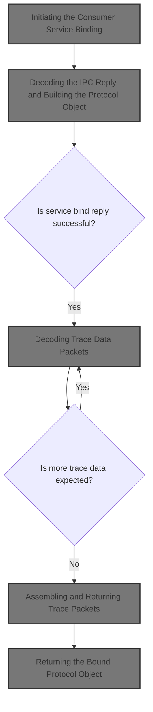
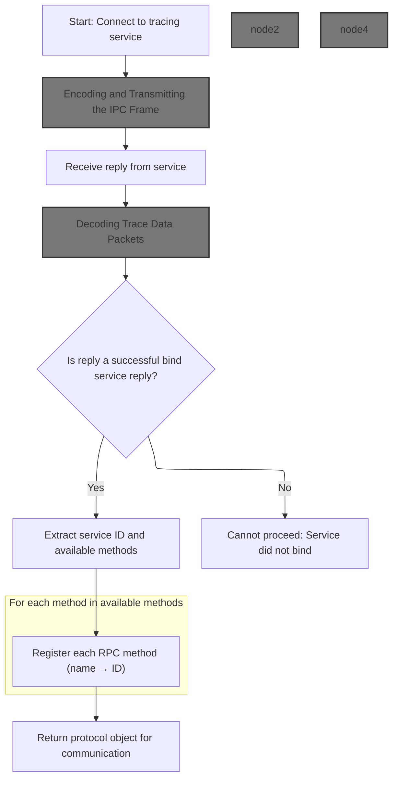
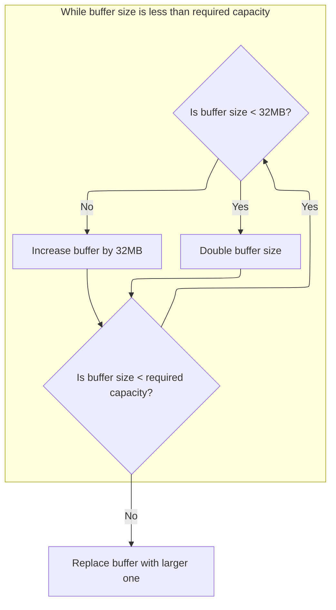
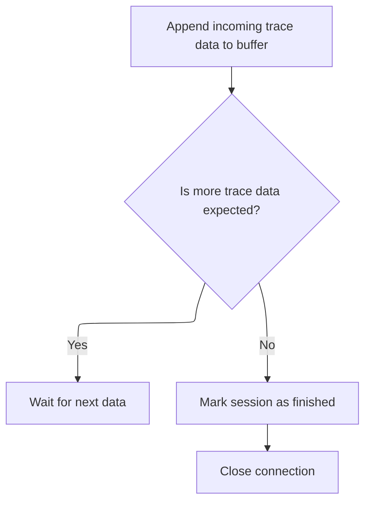
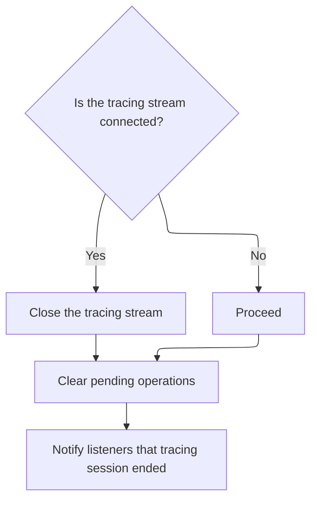
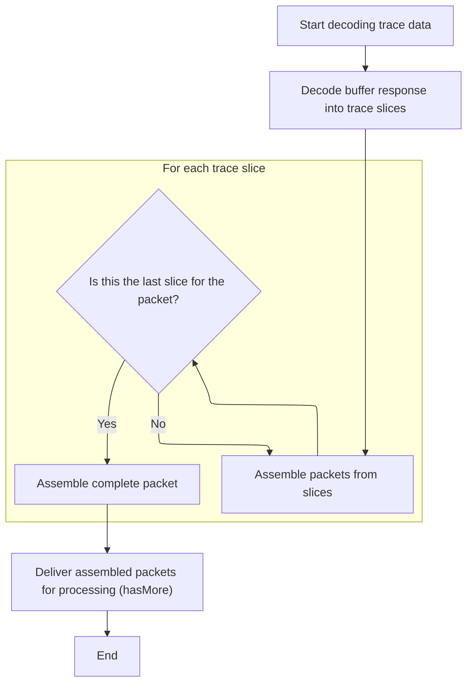

This document describes the process of establishing a communication protocol with the tracing service to enable trace data collection and analysis. The flow starts by connecting to the tracing service, decoding the reply to build a protocol object, and assembling incoming trace data into packets for further analysis.



# Where is this flow used?

This flow is used multiple times in the codebase as represented in the following diagram:

(Note - these are only some of the entry points of this flow)

```mermaid
graph TD;
      65d43f1f359e5a84dab4ece770eb52c32ce4f8a3fa420d6089d49fe5c9fa1389(ui/…/webusb/adb_webusb_target.ts::AdbWebusbTarget.runPreflightChecks) --> bc9a633e1c1f1254387e0e3f78514a93050c0c6cb823d592252e371919b665a7(ui/…/adb/adb_platform_checks.ts::checkAndroidTarget)

bc9a633e1c1f1254387e0e3f78514a93050c0c6cb823d592252e371919b665a7(ui/…/adb/adb_platform_checks.ts::checkAndroidTarget) --> b6e45155ed1808febe9938693ee06951f1e72b8d08b2403862316966e2016f25(ui/…/adb/adb_tracing_session.ts::getAdbTracingServiceState)

b6e45155ed1808febe9938693ee06951f1e72b8d08b2403862316966e2016f25(ui/…/adb/adb_tracing_session.ts::getAdbTracingServiceState) --> efa564bc8530e8440975b81ddf097994e9c3a3880198ece9d4a175b19659c650(ui/…/tracing_protocol/tracing_protocol.ts::TracingProtocol.create)

b6e45155ed1808febe9938693ee06951f1e72b8d08b2403862316966e2016f25(ui/…/adb/adb_tracing_session.ts::getAdbTracingServiceState) --> e4718e0c6199cd1c9ad89626c5df43f2a236de01d4e7f25742a5f9c907862fc5(ui/…/tracing_protocol/tracing_protocol.ts::TracingProtocol.invokeStreaming)

e4718e0c6199cd1c9ad89626c5df43f2a236de01d4e7f25742a5f9c907862fc5(ui/…/tracing_protocol/tracing_protocol.ts::TracingProtocol.invokeStreaming) --> c5a3b2fd2ac4f314235f201351b8cfae9e8b97e7c1b9fa55ad34c48954af6b5f(ui/…/tracing_protocol/tracing_protocol.ts::TracingProtocol.beginInvoke)

c5a3b2fd2ac4f314235f201351b8cfae9e8b97e7c1b9fa55ad34c48954af6b5f(ui/…/tracing_protocol/tracing_protocol.ts::TracingProtocol.beginInvoke) --> f43ef249086440cf5dbc807946eff2a30299794bc965bff207fab5cb871e81d2(ui/…/tracing_protocol/tracing_protocol.ts::TracingProtocol.sendFrame)

f43ef249086440cf5dbc807946eff2a30299794bc965bff207fab5cb871e81d2(ui/…/tracing_protocol/tracing_protocol.ts::TracingProtocol.sendFrame) --> efa564bc8530e8440975b81ddf097994e9c3a3880198ece9d4a175b19659c650(ui/…/tracing_protocol/tracing_protocol.ts::TracingProtocol.create)

91d6a7599f9757fc6a1fca909649d69cbdae2533b5d417b188e84f19dfd55240(ui/…/traced_over_websocket/target_connection_management_dialog.ts::TracedConnectioManagementDialog.view) --> 2505b8174cb568ab19dc5710f47474a79afca3ea6f73a9b256ba548f20f0a39c(ui/…/traced_over_websocket/target_connection_management_dialog.ts::TracedConnectioManagementDialog.testConnection)

2505b8174cb568ab19dc5710f47474a79afca3ea6f73a9b256ba548f20f0a39c(ui/…/traced_over_websocket/target_connection_management_dialog.ts::TracedConnectioManagementDialog.testConnection) --> 07a31ba28d5be7f6ce960276d1316c3c4fd9f5fd4de60e23fb4c5c3c1e0097d5(ui/…/traced_over_websocket/traced_websocket_target.ts::TracedWebsocketTarget.runPreflightChecks)

07a31ba28d5be7f6ce960276d1316c3c4fd9f5fd4de60e23fb4c5c3c1e0097d5(ui/…/traced_over_websocket/traced_websocket_target.ts::TracedWebsocketTarget.runPreflightChecks) --> f1bdf38db7e53d05e9d21a7425ff817eab2329a5df63817d28d7726b85bc078e(ui/…/traced_over_websocket/traced_websocket_target.ts::TracedWebsocketTarget.getServiceState)

07a31ba28d5be7f6ce960276d1316c3c4fd9f5fd4de60e23fb4c5c3c1e0097d5(ui/…/traced_over_websocket/traced_websocket_target.ts::TracedWebsocketTarget.runPreflightChecks) --> cb889bd7ac57ab91ff2ca758d9c66acd4ad176a4856e676b77ab46f96123b41b(ui/…/traced_over_websocket/traced_websocket_target.ts::TracedWebsocketTarget.connectIfNeeded)

f1bdf38db7e53d05e9d21a7425ff817eab2329a5df63817d28d7726b85bc078e(ui/…/traced_over_websocket/traced_websocket_target.ts::TracedWebsocketTarget.getServiceState) --> cb889bd7ac57ab91ff2ca758d9c66acd4ad176a4856e676b77ab46f96123b41b(ui/…/traced_over_websocket/traced_websocket_target.ts::TracedWebsocketTarget.connectIfNeeded)

f1bdf38db7e53d05e9d21a7425ff817eab2329a5df63817d28d7726b85bc078e(ui/…/traced_over_websocket/traced_websocket_target.ts::TracedWebsocketTarget.getServiceState) --> e4718e0c6199cd1c9ad89626c5df43f2a236de01d4e7f25742a5f9c907862fc5(ui/…/tracing_protocol/tracing_protocol.ts::TracingProtocol.invokeStreaming)

cb889bd7ac57ab91ff2ca758d9c66acd4ad176a4856e676b77ab46f96123b41b(ui/…/traced_over_websocket/traced_websocket_target.ts::TracedWebsocketTarget.connectIfNeeded) --> 23e394450470fba5eb84d0dd6ab7ba0b14652bd5f5177f5e6e90d707e6fae0ab(ui/…/traced_over_websocket/traced_websocket_target.ts::TracedWebsocketTarget.createConsumerIpcChannel)

23e394450470fba5eb84d0dd6ab7ba0b14652bd5f5177f5e6e90d707e6fae0ab(ui/…/traced_over_websocket/traced_websocket_target.ts::TracedWebsocketTarget.createConsumerIpcChannel) --> efa564bc8530e8440975b81ddf097994e9c3a3880198ece9d4a175b19659c650(ui/…/tracing_protocol/tracing_protocol.ts::TracingProtocol.create)

b029480a844a86c4a71a582aa362aadc2012709cb3b2786530d72ad95fb3cc8b(ui/…/traced_over_websocket/target_connection_management_dialog.ts::onchange) --> 2505b8174cb568ab19dc5710f47474a79afca3ea6f73a9b256ba548f20f0a39c(ui/…/traced_over_websocket/target_connection_management_dialog.ts::TracedConnectioManagementDialog.testConnection)

40a8c58603cb3744e989d4552be2ab743477d07b8415a624964f58b3d98e0d44(ui/…/webusb/adb_webusb_target.ts::AdbWebusbTarget.startTracing) --> f9f247519cddb7b3ccd253db8a66ae2f4802016c23c8153c3208c6e3c5e115de(ui/…/adb/adb_tracing_session.ts::createAdbTracingSession)

f9f247519cddb7b3ccd253db8a66ae2f4802016c23c8153c3208c6e3c5e115de(ui/…/adb/adb_tracing_session.ts::createAdbTracingSession) --> efa564bc8530e8440975b81ddf097994e9c3a3880198ece9d4a175b19659c650(ui/…/tracing_protocol/tracing_protocol.ts::TracingProtocol.create)

dd5d48c8da0303f0f5a336bdfb3f2d8d488626a359f23b884c35027c769f668d(ui/…/web_device_proxy/wdp_target.ts::WebDeviceProxyTarget.runPreflightChecks) --> bc9a633e1c1f1254387e0e3f78514a93050c0c6cb823d592252e371919b665a7(ui/…/adb/adb_platform_checks.ts::checkAndroidTarget)


classDef mainFlowStyle color:#000000,fill:#7CB9F4
classDef rootsStyle color:#000000,fill:#00FFF4
classDef Style1 color:#000000,fill:#00FFAA
classDef Style2 color:#000000,fill:#FFFF00
classDef Style3 color:#000000,fill:#AA7CB9

%% Swimm:
%% graph TD;
%%       65d43f1f359e5a84dab4ece770eb52c32ce4f8a3fa420d6089d49fe5c9fa1389(<SwmPath>[ui/…/webusb/adb_webusb_target.ts](ui/src/plugins/dev.perfetto.RecordTraceV2/adb/webusb/adb_webusb_target.ts)</SwmPath>::AdbWebusbTarget.runPreflightChecks) --> bc9a633e1c1f1254387e0e3f78514a93050c0c6cb823d592252e371919b665a7(<SwmPath>[ui/…/adb/adb_platform_checks.ts](ui/src/plugins/dev.perfetto.RecordTraceV2/adb/adb_platform_checks.ts)</SwmPath>::checkAndroidTarget)
%% 
%% bc9a633e1c1f1254387e0e3f78514a93050c0c6cb823d592252e371919b665a7(<SwmPath>[ui/…/adb/adb_platform_checks.ts](ui/src/plugins/dev.perfetto.RecordTraceV2/adb/adb_platform_checks.ts)</SwmPath>::checkAndroidTarget) --> b6e45155ed1808febe9938693ee06951f1e72b8d08b2403862316966e2016f25(<SwmPath>[ui/…/adb/adb_tracing_session.ts](ui/src/plugins/dev.perfetto.RecordTraceV2/adb/adb_tracing_session.ts)</SwmPath>::getAdbTracingServiceState)
%% 
%% b6e45155ed1808febe9938693ee06951f1e72b8d08b2403862316966e2016f25(<SwmPath>[ui/…/adb/adb_tracing_session.ts](ui/src/plugins/dev.perfetto.RecordTraceV2/adb/adb_tracing_session.ts)</SwmPath>::getAdbTracingServiceState) --> efa564bc8530e8440975b81ddf097994e9c3a3880198ece9d4a175b19659c650(<SwmPath>[ui/…/tracing_protocol/tracing_protocol.ts](ui/src/plugins/dev.perfetto.RecordTraceV2/tracing_protocol/tracing_protocol.ts)</SwmPath>::TracingProtocol.create)
%% 
%% b6e45155ed1808febe9938693ee06951f1e72b8d08b2403862316966e2016f25(<SwmPath>[ui/…/adb/adb_tracing_session.ts](ui/src/plugins/dev.perfetto.RecordTraceV2/adb/adb_tracing_session.ts)</SwmPath>::getAdbTracingServiceState) --> e4718e0c6199cd1c9ad89626c5df43f2a236de01d4e7f25742a5f9c907862fc5(<SwmPath>[ui/…/tracing_protocol/tracing_protocol.ts](ui/src/plugins/dev.perfetto.RecordTraceV2/tracing_protocol/tracing_protocol.ts)</SwmPath>::TracingProtocol.invokeStreaming)
%% 
%% e4718e0c6199cd1c9ad89626c5df43f2a236de01d4e7f25742a5f9c907862fc5(<SwmPath>[ui/…/tracing_protocol/tracing_protocol.ts](ui/src/plugins/dev.perfetto.RecordTraceV2/tracing_protocol/tracing_protocol.ts)</SwmPath>::TracingProtocol.invokeStreaming) --> c5a3b2fd2ac4f314235f201351b8cfae9e8b97e7c1b9fa55ad34c48954af6b5f(<SwmPath>[ui/…/tracing_protocol/tracing_protocol.ts](ui/src/plugins/dev.perfetto.RecordTraceV2/tracing_protocol/tracing_protocol.ts)</SwmPath>::TracingProtocol.beginInvoke)
%% 
%% c5a3b2fd2ac4f314235f201351b8cfae9e8b97e7c1b9fa55ad34c48954af6b5f(<SwmPath>[ui/…/tracing_protocol/tracing_protocol.ts](ui/src/plugins/dev.perfetto.RecordTraceV2/tracing_protocol/tracing_protocol.ts)</SwmPath>::TracingProtocol.beginInvoke) --> f43ef249086440cf5dbc807946eff2a30299794bc965bff207fab5cb871e81d2(<SwmPath>[ui/…/tracing_protocol/tracing_protocol.ts](ui/src/plugins/dev.perfetto.RecordTraceV2/tracing_protocol/tracing_protocol.ts)</SwmPath>::<SwmToken path="ui/src/plugins/dev.perfetto.RecordTraceV2/tracing_protocol/tracing_protocol.ts" pos="66:1:3" line-data="    TracingProtocol.sendFrame(stream, txFrame);">`TracingProtocol.sendFrame`</SwmToken>)
%% 
%% f43ef249086440cf5dbc807946eff2a30299794bc965bff207fab5cb871e81d2(<SwmPath>[ui/…/tracing_protocol/tracing_protocol.ts](ui/src/plugins/dev.perfetto.RecordTraceV2/tracing_protocol/tracing_protocol.ts)</SwmPath>::<SwmToken path="ui/src/plugins/dev.perfetto.RecordTraceV2/tracing_protocol/tracing_protocol.ts" pos="66:1:3" line-data="    TracingProtocol.sendFrame(stream, txFrame);">`TracingProtocol.sendFrame`</SwmToken>) --> efa564bc8530e8440975b81ddf097994e9c3a3880198ece9d4a175b19659c650(<SwmPath>[ui/…/tracing_protocol/tracing_protocol.ts](ui/src/plugins/dev.perfetto.RecordTraceV2/tracing_protocol/tracing_protocol.ts)</SwmPath>::TracingProtocol.create)
%% 
%% 91d6a7599f9757fc6a1fca909649d69cbdae2533b5d417b188e84f19dfd55240(<SwmPath>[ui/…/traced_over_websocket/target_connection_management_dialog.ts](ui/src/plugins/dev.perfetto.RecordTraceV2/traced_over_websocket/target_connection_management_dialog.ts)</SwmPath>::TracedConnectioManagementDialog.view) --> 2505b8174cb568ab19dc5710f47474a79afca3ea6f73a9b256ba548f20f0a39c(<SwmPath>[ui/…/traced_over_websocket/target_connection_management_dialog.ts](ui/src/plugins/dev.perfetto.RecordTraceV2/traced_over_websocket/target_connection_management_dialog.ts)</SwmPath>::TracedConnectioManagementDialog.testConnection)
%% 
%% 2505b8174cb568ab19dc5710f47474a79afca3ea6f73a9b256ba548f20f0a39c(<SwmPath>[ui/…/traced_over_websocket/target_connection_management_dialog.ts](ui/src/plugins/dev.perfetto.RecordTraceV2/traced_over_websocket/target_connection_management_dialog.ts)</SwmPath>::TracedConnectioManagementDialog.testConnection) --> 07a31ba28d5be7f6ce960276d1316c3c4fd9f5fd4de60e23fb4c5c3c1e0097d5(<SwmPath>[ui/…/traced_over_websocket/traced_websocket_target.ts](ui/src/plugins/dev.perfetto.RecordTraceV2/traced_over_websocket/traced_websocket_target.ts)</SwmPath>::TracedWebsocketTarget.runPreflightChecks)
%% 
%% 07a31ba28d5be7f6ce960276d1316c3c4fd9f5fd4de60e23fb4c5c3c1e0097d5(<SwmPath>[ui/…/traced_over_websocket/traced_websocket_target.ts](ui/src/plugins/dev.perfetto.RecordTraceV2/traced_over_websocket/traced_websocket_target.ts)</SwmPath>::TracedWebsocketTarget.runPreflightChecks) --> f1bdf38db7e53d05e9d21a7425ff817eab2329a5df63817d28d7726b85bc078e(<SwmPath>[ui/…/traced_over_websocket/traced_websocket_target.ts](ui/src/plugins/dev.perfetto.RecordTraceV2/traced_over_websocket/traced_websocket_target.ts)</SwmPath>::TracedWebsocketTarget.getServiceState)
%% 
%% 07a31ba28d5be7f6ce960276d1316c3c4fd9f5fd4de60e23fb4c5c3c1e0097d5(<SwmPath>[ui/…/traced_over_websocket/traced_websocket_target.ts](ui/src/plugins/dev.perfetto.RecordTraceV2/traced_over_websocket/traced_websocket_target.ts)</SwmPath>::TracedWebsocketTarget.runPreflightChecks) --> cb889bd7ac57ab91ff2ca758d9c66acd4ad176a4856e676b77ab46f96123b41b(<SwmPath>[ui/…/traced_over_websocket/traced_websocket_target.ts](ui/src/plugins/dev.perfetto.RecordTraceV2/traced_over_websocket/traced_websocket_target.ts)</SwmPath>::TracedWebsocketTarget.connectIfNeeded)
%% 
%% f1bdf38db7e53d05e9d21a7425ff817eab2329a5df63817d28d7726b85bc078e(<SwmPath>[ui/…/traced_over_websocket/traced_websocket_target.ts](ui/src/plugins/dev.perfetto.RecordTraceV2/traced_over_websocket/traced_websocket_target.ts)</SwmPath>::TracedWebsocketTarget.getServiceState) --> cb889bd7ac57ab91ff2ca758d9c66acd4ad176a4856e676b77ab46f96123b41b(<SwmPath>[ui/…/traced_over_websocket/traced_websocket_target.ts](ui/src/plugins/dev.perfetto.RecordTraceV2/traced_over_websocket/traced_websocket_target.ts)</SwmPath>::TracedWebsocketTarget.connectIfNeeded)
%% 
%% f1bdf38db7e53d05e9d21a7425ff817eab2329a5df63817d28d7726b85bc078e(<SwmPath>[ui/…/traced_over_websocket/traced_websocket_target.ts](ui/src/plugins/dev.perfetto.RecordTraceV2/traced_over_websocket/traced_websocket_target.ts)</SwmPath>::TracedWebsocketTarget.getServiceState) --> e4718e0c6199cd1c9ad89626c5df43f2a236de01d4e7f25742a5f9c907862fc5(<SwmPath>[ui/…/tracing_protocol/tracing_protocol.ts](ui/src/plugins/dev.perfetto.RecordTraceV2/tracing_protocol/tracing_protocol.ts)</SwmPath>::TracingProtocol.invokeStreaming)
%% 
%% cb889bd7ac57ab91ff2ca758d9c66acd4ad176a4856e676b77ab46f96123b41b(<SwmPath>[ui/…/traced_over_websocket/traced_websocket_target.ts](ui/src/plugins/dev.perfetto.RecordTraceV2/traced_over_websocket/traced_websocket_target.ts)</SwmPath>::TracedWebsocketTarget.connectIfNeeded) --> 23e394450470fba5eb84d0dd6ab7ba0b14652bd5f5177f5e6e90d707e6fae0ab(<SwmPath>[ui/…/traced_over_websocket/traced_websocket_target.ts](ui/src/plugins/dev.perfetto.RecordTraceV2/traced_over_websocket/traced_websocket_target.ts)</SwmPath>::TracedWebsocketTarget.createConsumerIpcChannel)
%% 
%% 23e394450470fba5eb84d0dd6ab7ba0b14652bd5f5177f5e6e90d707e6fae0ab(<SwmPath>[ui/…/traced_over_websocket/traced_websocket_target.ts](ui/src/plugins/dev.perfetto.RecordTraceV2/traced_over_websocket/traced_websocket_target.ts)</SwmPath>::TracedWebsocketTarget.createConsumerIpcChannel) --> efa564bc8530e8440975b81ddf097994e9c3a3880198ece9d4a175b19659c650(<SwmPath>[ui/…/tracing_protocol/tracing_protocol.ts](ui/src/plugins/dev.perfetto.RecordTraceV2/tracing_protocol/tracing_protocol.ts)</SwmPath>::TracingProtocol.create)
%% 
%% b029480a844a86c4a71a582aa362aadc2012709cb3b2786530d72ad95fb3cc8b(<SwmPath>[ui/…/traced_over_websocket/target_connection_management_dialog.ts](ui/src/plugins/dev.perfetto.RecordTraceV2/traced_over_websocket/target_connection_management_dialog.ts)</SwmPath>::onchange) --> 2505b8174cb568ab19dc5710f47474a79afca3ea6f73a9b256ba548f20f0a39c(<SwmPath>[ui/…/traced_over_websocket/target_connection_management_dialog.ts](ui/src/plugins/dev.perfetto.RecordTraceV2/traced_over_websocket/target_connection_management_dialog.ts)</SwmPath>::TracedConnectioManagementDialog.testConnection)
%% 
%% 40a8c58603cb3744e989d4552be2ab743477d07b8415a624964f58b3d98e0d44(<SwmPath>[ui/…/webusb/adb_webusb_target.ts](ui/src/plugins/dev.perfetto.RecordTraceV2/adb/webusb/adb_webusb_target.ts)</SwmPath>::AdbWebusbTarget.startTracing) --> f9f247519cddb7b3ccd253db8a66ae2f4802016c23c8153c3208c6e3c5e115de(<SwmPath>[ui/…/adb/adb_tracing_session.ts](ui/src/plugins/dev.perfetto.RecordTraceV2/adb/adb_tracing_session.ts)</SwmPath>::createAdbTracingSession)
%% 
%% f9f247519cddb7b3ccd253db8a66ae2f4802016c23c8153c3208c6e3c5e115de(<SwmPath>[ui/…/adb/adb_tracing_session.ts](ui/src/plugins/dev.perfetto.RecordTraceV2/adb/adb_tracing_session.ts)</SwmPath>::createAdbTracingSession) --> efa564bc8530e8440975b81ddf097994e9c3a3880198ece9d4a175b19659c650(<SwmPath>[ui/…/tracing_protocol/tracing_protocol.ts](ui/src/plugins/dev.perfetto.RecordTraceV2/tracing_protocol/tracing_protocol.ts)</SwmPath>::TracingProtocol.create)
%% 
%% dd5d48c8da0303f0f5a336bdfb3f2d8d488626a359f23b884c35027c769f668d(<SwmPath>[ui/…/web_device_proxy/wdp_target.ts](ui/src/plugins/dev.perfetto.RecordTraceV2/adb/web_device_proxy/wdp_target.ts)</SwmPath>::WebDeviceProxyTarget.runPreflightChecks) --> bc9a633e1c1f1254387e0e3f78514a93050c0c6cb823d592252e371919b665a7(<SwmPath>[ui/…/adb/adb_platform_checks.ts](ui/src/plugins/dev.perfetto.RecordTraceV2/adb/adb_platform_checks.ts)</SwmPath>::checkAndroidTarget)
%% 
%% 
%% classDef mainFlowStyle color:#000000,fill:#7CB9F4
%% classDef rootsStyle color:#000000,fill:#00FFF4
%% classDef Style1 color:#000000,fill:#00FFAA
%% classDef Style2 color:#000000,fill:#FFFF00
%% classDef Style3 color:#000000,fill:#AA7CB9
```



# Initiating the Consumer Service Binding



<SwmSnippet path="/ui/src/plugins/dev.perfetto.RecordTraceV2/tracing_protocol/tracing_protocol.ts" line="49">

---

In `TracingProtocol.create`, we send a <SwmToken path="ui/src/plugins/dev.perfetto.RecordTraceV2/tracing_protocol/tracing_protocol.ts" pos="50:7:7" line-data="    // Send the bindService request. This is a one-off request to connect to the">`bindService`</SwmToken> request and set up a mechanism to collect and decode the reply. We need `ResizableArrayBuffer.append` next because the ring buffer uses it to handle incoming data efficiently.

```typescript
  static async create(stream: ByteStream): Promise<TracingProtocol> {
    // Send the bindService request. This is a one-off request to connect to the
    // consumer port and list the RPC methods available.
    const requestId = 1;
    const txFrame = new protos.IPCFrame({
      requestId,
      msgBindService: new protos.IPCFrame.BindService({
        serviceName: 'ConsumerPort',
      }),
    });
    const repsponsePromise = defer<Uint8Array>();
    const rxFrameBuf = new ProtoRingBuffer('FIXED_SIZE');
    stream.onData = (data) => {
      rxFrameBuf.append(data);
```

---

</SwmSnippet>

## Appending Incoming Data to Buffer

<SwmSnippet path="/ui/src/base/resizable_array_buffer.ts" line="34">

---

In <SwmToken path="ui/src/base/resizable_array_buffer.ts" pos="34:1:1" line-data="  append(data: ArrayLike&lt;number&gt;) {">`append`</SwmToken>, we make sure there's enough space for new data and expand the buffer if needed so we can keep collecting incoming chunks.

```typescript
  append(data: ArrayLike<number>) {
    const capacityNeeded = this._size + data.length;
    if (this.capacity < capacityNeeded) {
      this.grow(capacityNeeded);
    }
```

---

</SwmSnippet>

### Expanding Buffer Capacity



<SwmSnippet path="/ui/src/base/resizable_array_buffer.ts" line="65">

---

In <SwmToken path="ui/src/base/resizable_array_buffer.ts" pos="65:3:3" line-data="  private grow(capacityNeeded: number) {">`grow`</SwmToken>, we double the buffer size until <SwmToken path="ui/src/base/resizable_array_buffer.ts" pos="21:23:23" line-data=" * Efficiently grows the buffer using an exponential strategy up to 32MB,">`32MB`</SwmToken>, then add <SwmToken path="ui/src/base/resizable_array_buffer.ts" pos="21:23:23" line-data=" * Efficiently grows the buffer using an exponential strategy up to 32MB,">`32MB`</SwmToken> at a time to avoid excessive memory jumps.

```typescript
  private grow(capacityNeeded: number) {
    let newSize = this.buf.length;
    const MB32 = 32 * 1024 * 1024;
    do {
      newSize = newSize < MB32 ? newSize * 2 : newSize + MB32;
    } while (newSize < capacityNeeded);
```

---

</SwmSnippet>

<SwmSnippet path="/ui/src/base/resizable_array_buffer.ts" line="71">

---

After calculating the new buffer size, we allocate a new <SwmToken path="ui/src/base/resizable_array_buffer.ts" pos="71:9:9" line-data="    const newBuf = new Uint8Array(newSize);">`Uint8Array`</SwmToken>, assert it's big enough, copy the old data, and swap in the new buffer. This guarantees we have enough space for future appends.

```typescript
    const newBuf = new Uint8Array(newSize);
    assertTrue(newBuf.length >= capacityNeeded);
    newBuf.set(this.buf);
    this.buf = newBuf;
  }
```

---

</SwmSnippet>

### Finalizing Data Append

<SwmSnippet path="/ui/src/base/resizable_array_buffer.ts" line="39">

---

After resizing, we copy in the new data and update the size marker.

```typescript
    this.buf.set(data, this._size);
    this._size = capacityNeeded;
  }
```

---

</SwmSnippet>

## Reading a Complete IPC Message

<SwmSnippet path="/ui/src/plugins/dev.perfetto.RecordTraceV2/tracing_protocol/tracing_protocol.ts" line="63">

---

After buffering data, we use ProtoRingBuffer.readMessage to check if a full message is ready to process.

```typescript
      const rxFrame = rxFrameBuf.readMessage();
```

---

</SwmSnippet>

## Extracting a Message from the Ring Buffer

<SwmSnippet path="/ui/src/trace_processor/proto_ring_buffer.ts" line="110">

---

In <SwmToken path="ui/src/trace_processor/proto_ring_buffer.ts" pos="110:1:1" line-data="  readMessage(): Uint8Array | undefined {">`readMessage`</SwmToken>, we first check for a fastpath message and return it if present. Otherwise, we use the read/write pointers to check if the buffer has enough data and try to extract a message slice. If successful, we advance the read pointer and return a copy of the message.

```typescript
  readMessage(): Uint8Array | undefined {
    if (this.fastpath !== undefined) {
      assertTrue(this.rd === this.wr);
      const msg = this.fastpath;
      this.fastpath = undefined;
      return msg;
    }
    assertTrue(this.rd <= this.wr);
    if (this.rd >= this.wr) {
      return undefined; // Completely empty.
    }
    const msg = this.tryReadMessage(this.buf, this.rd, this.wr);
    if (msg === undefined) return undefined;
```

---

</SwmSnippet>

### Parsing a Length-Prefixed Message

```mermaid
%%{init: {"flowchart": {"defaultRenderer": "elk"}} }%%
flowchart TD
  node1["Start: Try to read a message from buffer"]
  click node1 openCode "ui/src/trace_processor/proto_ring_buffer.ts:134:185"
  node1 --> node2{"Is there data to read?"}
  click node2 openCode "ui/src/trace_processor/proto_ring_buffer.ts:141:141"
  node2 -->|"No"| node9["Return nothing"]
  click node9 openCode "ui/src/trace_processor/proto_ring_buffer.ts:141:141"
  node2 -->|"Yes"| node3{"Which mode?"}
  click node3 openCode "ui/src/trace_processor/proto_ring_buffer.ts:144:160"
  node3 -->|PROTO_PREAMBLE| node4["Check tag"]
  click node4 openCode "ui/src/trace_processor/proto_ring_buffer.ts:145:150"
  node4 --> node14{"Is tag valid?"}
  click node14 openCode "ui/src/trace_processor/proto_ring_buffer.ts:146:150"
  node14 -->|"No"| node10["Throw error: invalid tag"]
  click node10 openCode "ui/src/trace_processor/proto_ring_buffer.ts:147:149"
  node14 -->|"Yes"| node15["Read message length as varint"]
  click node15 openCode "ui/src/trace_processor/proto_ring_buffer.ts:152:159"
  subgraph loop1["Loop: Read bytes for varint message length"]
    node15 --> node16{"Is varint complete?"}
    click node16 openCode "ui/src/trace_processor/proto_ring_buffer.ts:158:159"
    node16 -->|"No"| node15
    node16 -->|"Yes"| node17["Message length determined"]
    click node17 openCode "ui/src/trace_processor/proto_ring_buffer.ts:159:159"
  end
  node3 -->|FIXED_SIZE| node6["Read 4 bytes for message length"]
  click node6 openCode "ui/src/trace_processor/proto_ring_buffer.ts:161:167"
  subgraph loop2["Loop: Read 4 bytes"]
    node6 --> node18{"Have 4 bytes been read?"}
    click node18 openCode "ui/src/trace_processor/proto_ring_buffer.ts:161:167"
    node18 -->|"No"| node6
    node18 -->|"Yes"| node19["Message length determined"]
    click node19 openCode "ui/src/trace_processor/proto_ring_buffer.ts:167:167"
  end
  node17 --> node8{"Is message length < max allowed?"}
  node19 --> node8
  click node8 openCode "ui/src/trace_processor/proto_ring_buffer.ts:172:176"
  node8 -->|"No"| node11["Throw error: message too large"]
  click node11 openCode "ui/src/trace_processor/proto_ring_buffer.ts:173:175"
  node8 -->|"Yes"| node12{"Is there enough data for message?"}
  click node12 openCode "ui/src/trace_processor/proto_ring_buffer.ts:178:178"
  node12 -->|"No"| node9
  node12 -->|"Yes"| node13["Return message"]
  click node13 openCode "ui/src/trace_processor/proto_ring_buffer.ts:184:184"

classDef HeadingStyle fill:#777777,stroke:#333,stroke-width:2px;

%% Swimm:
%% %%{init: {"flowchart": {"defaultRenderer": "elk"}} }%%
%% flowchart TD
%%   node1["Start: Try to read a message from buffer"]
%%   click node1 openCode "<SwmPath>[ui/…/trace_processor/proto_ring_buffer.ts](ui/src/trace_processor/proto_ring_buffer.ts)</SwmPath>:134:185"
%%   node1 --> node2{"Is there data to read?"}
%%   click node2 openCode "<SwmPath>[ui/…/trace_processor/proto_ring_buffer.ts](ui/src/trace_processor/proto_ring_buffer.ts)</SwmPath>:141:141"
%%   node2 -->|"No"| node9["Return nothing"]
%%   click node9 openCode "<SwmPath>[ui/…/trace_processor/proto_ring_buffer.ts](ui/src/trace_processor/proto_ring_buffer.ts)</SwmPath>:141:141"
%%   node2 -->|"Yes"| node3{"Which mode?"}
%%   click node3 openCode "<SwmPath>[ui/…/trace_processor/proto_ring_buffer.ts](ui/src/trace_processor/proto_ring_buffer.ts)</SwmPath>:144:160"
%%   node3 -->|<SwmToken path="ui/src/trace_processor/proto_ring_buffer.ts" pos="144:11:11" line-data="    if (this.mode === &#39;PROTO_PREAMBLE&#39;) {">`PROTO_PREAMBLE`</SwmToken>| node4["Check tag"]
%%   click node4 openCode "<SwmPath>[ui/…/trace_processor/proto_ring_buffer.ts](ui/src/trace_processor/proto_ring_buffer.ts)</SwmPath>:145:150"
%%   node4 --> node14{"Is tag valid?"}
%%   click node14 openCode "<SwmPath>[ui/…/trace_processor/proto_ring_buffer.ts](ui/src/trace_processor/proto_ring_buffer.ts)</SwmPath>:146:150"
%%   node14 -->|"No"| node10["Throw error: invalid tag"]
%%   click node10 openCode "<SwmPath>[ui/…/trace_processor/proto_ring_buffer.ts](ui/src/trace_processor/proto_ring_buffer.ts)</SwmPath>:147:149"
%%   node14 -->|"Yes"| node15["Read message length as varint"]
%%   click node15 openCode "<SwmPath>[ui/…/trace_processor/proto_ring_buffer.ts](ui/src/trace_processor/proto_ring_buffer.ts)</SwmPath>:152:159"
%%   subgraph loop1["Loop: Read bytes for varint message length"]
%%     node15 --> node16{"Is varint complete?"}
%%     click node16 openCode "<SwmPath>[ui/…/trace_processor/proto_ring_buffer.ts](ui/src/trace_processor/proto_ring_buffer.ts)</SwmPath>:158:159"
%%     node16 -->|"No"| node15
%%     node16 -->|"Yes"| node17["Message length determined"]
%%     click node17 openCode "<SwmPath>[ui/…/trace_processor/proto_ring_buffer.ts](ui/src/trace_processor/proto_ring_buffer.ts)</SwmPath>:159:159"
%%   end
%%   node3 -->|<SwmToken path="ui/src/plugins/dev.perfetto.RecordTraceV2/tracing_protocol/tracing_protocol.ts" pos="60:12:12" line-data="    const rxFrameBuf = new ProtoRingBuffer(&#39;FIXED_SIZE&#39;);">`FIXED_SIZE`</SwmToken>| node6["Read 4 bytes for message length"]
%%   click node6 openCode "<SwmPath>[ui/…/trace_processor/proto_ring_buffer.ts](ui/src/trace_processor/proto_ring_buffer.ts)</SwmPath>:161:167"
%%   subgraph loop2["Loop: Read 4 bytes"]
%%     node6 --> node18{"Have 4 bytes been read?"}
%%     click node18 openCode "<SwmPath>[ui/…/trace_processor/proto_ring_buffer.ts](ui/src/trace_processor/proto_ring_buffer.ts)</SwmPath>:161:167"
%%     node18 -->|"No"| node6
%%     node18 -->|"Yes"| node19["Message length determined"]
%%     click node19 openCode "<SwmPath>[ui/…/trace_processor/proto_ring_buffer.ts](ui/src/trace_processor/proto_ring_buffer.ts)</SwmPath>:167:167"
%%   end
%%   node17 --> node8{"Is message length < max allowed?"}
%%   node19 --> node8
%%   click node8 openCode "<SwmPath>[ui/…/trace_processor/proto_ring_buffer.ts](ui/src/trace_processor/proto_ring_buffer.ts)</SwmPath>:172:176"
%%   node8 -->|"No"| node11["Throw error: message too large"]
%%   click node11 openCode "<SwmPath>[ui/…/trace_processor/proto_ring_buffer.ts](ui/src/trace_processor/proto_ring_buffer.ts)</SwmPath>:173:175"
%%   node8 -->|"Yes"| node12{"Is there enough data for message?"}
%%   click node12 openCode "<SwmPath>[ui/…/trace_processor/proto_ring_buffer.ts](ui/src/trace_processor/proto_ring_buffer.ts)</SwmPath>:178:178"
%%   node12 -->|"No"| node9
%%   node12 -->|"Yes"| node13["Return message"]
%%   click node13 openCode "<SwmPath>[ui/…/trace_processor/proto_ring_buffer.ts](ui/src/trace_processor/proto_ring_buffer.ts)</SwmPath>:184:184"
%% 
%% classDef HeadingStyle fill:#777777,stroke:#333,stroke-width:2px;
```



<SwmSnippet path="/ui/src/trace_processor/proto_ring_buffer.ts" line="134">

---

In <SwmToken path="ui/src/trace_processor/proto_ring_buffer.ts" pos="134:3:3" line-data="  private tryReadMessage(">`tryReadMessage`</SwmToken>, we parse the message length using either a proto preamble (varint) or a fixed 4-byte header, depending on the mode. We check tags and lengths, and only extract the message if enough data is present.

```typescript
  private tryReadMessage(
    data: Uint8Array,
    dataStart: number,
    dataEnd: number,
  ): Uint8Array | undefined {
    assertTrue(dataEnd <= data.length);
    let pos = dataStart;
    if (pos >= dataEnd) return undefined;
    let len = 0;

    if (this.mode === 'PROTO_PREAMBLE') {
      const tag = data[pos++]; // Assume one-byte tag.
      if (tag >= 0x80 || (tag & 0x07) !== 2 /* len delimited */) {
        throw new Error(
          `RPC framing error, unexpected tag ${tag} @ offset ${pos - 1}`,
        );
      }

      for (let shift = 0 /* no check */; ; shift += 7) {
        if (pos >= dataEnd) {
          return undefined; // Not enough data to read varint.
        }
        const val = data[pos++];
        len |= ((val & 0x7f) << shift) >>> 0;
        if (val < 0x80) break;
      }
```

---

</SwmSnippet>

<SwmSnippet path="/ui/src/trace_processor/proto_ring_buffer.ts" line="160">

---

After handling the proto preamble, if we're in fixed size mode, we read a 4-byte length header. This lets us support both framing formats for incoming messages.

```typescript
    } else if (this.mode === 'FIXED_SIZE') {
      for (let i = 0; i < 4; i++) {
        if (pos >= dataEnd) {
          return undefined; // Not enough data to read a uint32.
        }
        const val = data[pos++] & 0xff;
        len |= (val << (i * 8)) >>> 0;
      }
```

---

</SwmSnippet>

<SwmSnippet path="/ui/src/trace_processor/proto_ring_buffer.ts" line="169">

---

After parsing the length, we check against <SwmToken path="ui/src/trace_processor/proto_ring_buffer.ts" pos="172:8:8" line-data="    if (len &gt;= kMaxMsgSize) {">`kMaxMsgSize`</SwmToken> and throw if it's too big. If all is good, we return a subarray of the buffer for performance, unless we're in the slow path where a copy is made.

```typescript
      assertUnreachable(this.mode);
    }

    if (len >= kMaxMsgSize) {
      throw new Error(
        `RPC framing error, message too large (${len} > ${kMaxMsgSize}`,
      );
    }
    const end = pos + len;
    if (end > dataEnd) return undefined;

    // This is a subarray() and not a slice() because in the |fastpath| case
    // we want to just return the original buffer pushed by append().
    // In the slow-path (ring-buffer) case, the readMessage() above will create
    // a copy via slice() before returning it.
    return data.subarray(pos, end);
  }
```

---

</SwmSnippet>

### Advancing Buffer and Returning Message Copy

<SwmSnippet path="/ui/src/trace_processor/proto_ring_buffer.ts" line="123">

---

After returning from <SwmToken path="ui/src/trace_processor/proto_ring_buffer.ts" pos="121:9:9" line-data="    const msg = this.tryReadMessage(this.buf, this.rd, this.wr);">`tryReadMessage`</SwmToken> in <SwmToken path="ui/src/plugins/dev.perfetto.RecordTraceV2/tracing_protocol/tracing_protocol.ts" pos="63:9:9" line-data="      const rxFrame = rxFrameBuf.readMessage();">`readMessage`</SwmToken>, we update the read pointer and return a copy of the message slice. This avoids issues with callers holding onto buffer views that could be overwritten.

```typescript
    assertTrue(msg.buffer === this.buf.buffer);
    assertTrue(this.buf.byteOffset === 0);
    this.rd = msg.byteOffset + msg.length;

    // Deliberately returning a copy of the data with slice(). In various cases
    // (streaming query response) the caller will hold onto the returned buffer.
    // If we get to this point, |msg| is a view of the circular buffer that we
    // will overwrite on the next calls to append().
    return msg.slice();
  }
```

---

</SwmSnippet>

## Resolving the IPC Reply and Sending the Frame

<SwmSnippet path="/ui/src/plugins/dev.perfetto.RecordTraceV2/tracing_protocol/tracing_protocol.ts" line="64">

---

Once we get a full frame, we resolve the promise and send the frame out.

```typescript
      rxFrame && repsponsePromise.resolve(rxFrame);
    };
    TracingProtocol.sendFrame(stream, txFrame);

```

---

</SwmSnippet>

## Encoding and Transmitting the IPC Frame

<SwmSnippet path="/ui/src/plugins/dev.perfetto.RecordTraceV2/tracing_protocol/tracing_protocol.ts" line="214">

---

In <SwmToken path="ui/src/plugins/dev.perfetto.RecordTraceV2/tracing_protocol/tracing_protocol.ts" pos="214:5:5" line-data="  private static sendFrame(">`sendFrame`</SwmToken>, we set up a protobuf writer, reserve 4 bytes for the length header, encode the <SwmToken path="ui/src/plugins/dev.perfetto.RecordTraceV2/tracing_protocol/tracing_protocol.ts" pos="216:6:6" line-data="    frame: protos.IPCFrame,">`IPCFrame`</SwmToken>, and then write the actual frame length in little-endian format at the start. The whole buffer is then sent over the <SwmToken path="ui/src/plugins/dev.perfetto.RecordTraceV2/tracing_protocol/tracing_protocol.ts" pos="215:4:4" line-data="    stream: ByteStream,">`ByteStream`</SwmToken>.

```typescript
  private static sendFrame(
    stream: ByteStream,
    frame: protos.IPCFrame,
  ): Promise<void> {
    const writer = protobuf.Writer.create();
```

---

</SwmSnippet>

<SwmSnippet path="/ui/src/plugins/dev.perfetto.RecordTraceV2/tracing_protocol/tracing_protocol.ts" line="219">

---

We fill in the length header and send the buffer out.

```typescript
    writer.fixed32(0); // Reserve space for the 4 bytes header (frame len).
    const frameData = protos.IPCFrame.encode(frame, writer).finish().slice();
    const frameLen = frameData.length - 4;
    const dv = new DataView(frameData.buffer);
    dv.setUint32(0, frameLen, /* littleEndian */ true); // Write the header.
    return stream.write(frameData);
  }
```

---

</SwmSnippet>

## Decoding the IPC Reply and Building the Protocol Object

```mermaid
%%{init: {"flowchart": {"defaultRenderer": "elk"}} }%%
flowchart TD
  node1["Wait for reply from tracing service"]
  click node1 openCode "ui/src/plugins/dev.perfetto.RecordTraceV2/tracing_protocol/tracing_protocol.ts:68:70"
  node1 --> node2{"Is reply type msgBindServiceReply?"}
  click node2 openCode "ui/src/plugins/dev.perfetto.RecordTraceV2/tracing_protocol/tracing_protocol.ts:71:72"
  node2 -->|"Yes"| node3{"Did service bind successfully (success == true)?"}
  node2 -->|"No"| node6["Stop: Unexpected reply type"]
  click node6 openCode "ui/src/plugins/dev.perfetto.RecordTraceV2/tracing_protocol/tracing_protocol.ts:72:73"
  node3 -->|"Yes"| node4["Extract serviceId and methods"]
  click node3 openCode "ui/src/plugins/dev.perfetto.RecordTraceV2/tracing_protocol/tracing_protocol.ts:73:76"
  node3 -->|"No"| node7["Stop: Service bind failed"]
  click node7 openCode "ui/src/plugins/dev.perfetto.RecordTraceV2/tracing_protocol/tracing_protocol.ts:75:76"
  node4 --> node5["Register available service methods"]
  click node4 openCode "ui/src/plugins/dev.perfetto.RecordTraceV2/tracing_protocol/tracing_protocol.ts:76:77"
  
  subgraph loop1["For each method in methods list"]
    node5 --> node8["Register method name and id"]
    click node8 openCode "ui/src/plugins/dev.perfetto.RecordTraceV2/tracing_protocol/tracing_protocol.ts:77:79"
  end
  node8 --> node9["Done"]
  click node9 openCode "ui/src/plugins/dev.perfetto.RecordTraceV2/tracing_protocol/tracing_protocol.ts:79:79"

classDef HeadingStyle fill:#777777,stroke:#333,stroke-width:2px;

%% Swimm:
%% %%{init: {"flowchart": {"defaultRenderer": "elk"}} }%%
%% flowchart TD
%%   node1["Wait for reply from tracing service"]
%%   click node1 openCode "<SwmPath>[ui/…/tracing_protocol/tracing_protocol.ts](ui/src/plugins/dev.perfetto.RecordTraceV2/tracing_protocol/tracing_protocol.ts)</SwmPath>:68:70"
%%   node1 --> node2{"Is reply type <SwmToken path="ui/src/plugins/dev.perfetto.RecordTraceV2/tracing_protocol/tracing_protocol.ts" pos="72:10:10" line-data="    assertTrue(rxFrame.msg === &#39;msgBindServiceReply&#39;);">`msgBindServiceReply`</SwmToken>?"}
%%   click node2 openCode "<SwmPath>[ui/…/tracing_protocol/tracing_protocol.ts](ui/src/plugins/dev.perfetto.RecordTraceV2/tracing_protocol/tracing_protocol.ts)</SwmPath>:71:72"
%%   node2 -->|"Yes"| node3{"Did service bind successfully (success == true)?"}
%%   node2 -->|"No"| node6["Stop: Unexpected reply type"]
%%   click node6 openCode "<SwmPath>[ui/…/tracing_protocol/tracing_protocol.ts](ui/src/plugins/dev.perfetto.RecordTraceV2/tracing_protocol/tracing_protocol.ts)</SwmPath>:72:73"
%%   node3 -->|"Yes"| node4["Extract <SwmToken path="ui/src/plugins/dev.perfetto.RecordTraceV2/tracing_protocol/tracing_protocol.ts" pos="76:3:3" line-data="    const serviceId = assertExists(replyMsg.serviceId);">`serviceId`</SwmToken> and methods"]
%%   click node3 openCode "<SwmPath>[ui/…/tracing_protocol/tracing_protocol.ts](ui/src/plugins/dev.perfetto.RecordTraceV2/tracing_protocol/tracing_protocol.ts)</SwmPath>:73:76"
%%   node3 -->|"No"| node7["Stop: Service bind failed"]
%%   click node7 openCode "<SwmPath>[ui/…/tracing_protocol/tracing_protocol.ts](ui/src/plugins/dev.perfetto.RecordTraceV2/tracing_protocol/tracing_protocol.ts)</SwmPath>:75:76"
%%   node4 --> node5["Register available service methods"]
%%   click node4 openCode "<SwmPath>[ui/…/tracing_protocol/tracing_protocol.ts](ui/src/plugins/dev.perfetto.RecordTraceV2/tracing_protocol/tracing_protocol.ts)</SwmPath>:76:77"
%%   
%%   subgraph loop1["For each method in methods list"]
%%     node5 --> node8["Register method name and id"]
%%     click node8 openCode "<SwmPath>[ui/…/tracing_protocol/tracing_protocol.ts](ui/src/plugins/dev.perfetto.RecordTraceV2/tracing_protocol/tracing_protocol.ts)</SwmPath>:77:79"
%%   end
%%   node8 --> node9["Done"]
%%   click node9 openCode "<SwmPath>[ui/…/tracing_protocol/tracing_protocol.ts](ui/src/plugins/dev.perfetto.RecordTraceV2/tracing_protocol/tracing_protocol.ts)</SwmPath>:79:79"
%% 
%% classDef HeadingStyle fill:#777777,stroke:#333,stroke-width:2px;
```



<SwmSnippet path="/ui/src/plugins/dev.perfetto.RecordTraceV2/tracing_protocol/tracing_protocol.ts" line="68">

---

After returning from <SwmToken path="ui/src/plugins/dev.perfetto.RecordTraceV2/tracing_protocol/tracing_protocol.ts" pos="66:3:3" line-data="    TracingProtocol.sendFrame(stream, txFrame);">`sendFrame`</SwmToken>, we wait for the IPC reply, decode it, and check it's a <SwmToken path="ui/src/plugins/dev.perfetto.RecordTraceV2/tracing_protocol/tracing_protocol.ts" pos="50:7:7" line-data="    // Send the bindService request. This is a one-off request to connect to the">`bindService`</SwmToken> reply. We extract the service ID and available RPC methods, mapping names to IDs for later RPC calls. Next, we call PacketStream.decode to process trace data packets.

```typescript
    // Wait for the IPC reply. There is no state machine or queueing needed at
    // this point (not just yet) because this is 1 req -> 1 reply.
    const frameData = await repsponsePromise;
    const rxFrame = protos.IPCFrame.decode(frameData);
    assertTrue(rxFrame.msg === 'msgBindServiceReply');
    const replyMsg = assertExists(rxFrame.msgBindServiceReply);
    const boundMethods = new Map<string, number>();
    assertTrue(replyMsg.success === true);
    const serviceId = assertExists(replyMsg.serviceId);
    for (const m of assertExists(replyMsg.methods)) {
      boundMethods.set(assertExists(m.name), assertExists(m.id));
    }
```

---

</SwmSnippet>

## Decoding Trace Data Packets

<SwmSnippet path="/ui/src/plugins/dev.perfetto.RecordTraceV2/tracing_protocol/tracing_protocol.ts" line="237">

---

In <SwmToken path="ui/src/plugins/dev.perfetto.RecordTraceV2/tracing_protocol/tracing_protocol.ts" pos="237:1:1" line-data="  decode(data: Uint8Array | undefined, hasMore: boolean) {">`decode`</SwmToken>, if data is missing, we call <SwmToken path="ui/src/plugins/dev.perfetto.RecordTraceV2/tracing_protocol/tracing_protocol.ts" pos="239:3:3" line-data="      this.onTraceData(new Uint8Array(), hasMore);">`onTraceData`</SwmToken> with an empty array to signal the session. Otherwise, we process the data. Next, we call ConsumerIpcTracingSession.onTraceData to handle the received packets.

```typescript
  decode(data: Uint8Array | undefined, hasMore: boolean) {
    if (data === undefined) {
      this.onTraceData(new Uint8Array(), hasMore);
      return;
    }

```

---

</SwmSnippet>

### Appending Trace Packets and Handling Completion



<SwmSnippet path="/ui/src/plugins/dev.perfetto.RecordTraceV2/tracing_protocol/consumer_ipc_tracing_session.ts" line="116">

---

We add packets to the buffer and check if we're done or need to wait for more.

```typescript
  private onTraceData(packets: Uint8Array, hasMore: boolean) {
    this.traceBuf.append(packets);
    if (hasMore) return;

```

---

</SwmSnippet>

<SwmSnippet path="/ui/src/plugins/dev.perfetto.RecordTraceV2/tracing_protocol/consumer_ipc_tracing_session.ts" line="120">

---

After returning from `ResizableArrayBuffer.append` in <SwmToken path="ui/src/plugins/dev.perfetto.RecordTraceV2/tracing_protocol/tracing_protocol.ts" pos="239:3:3" line-data="      this.onTraceData(new Uint8Array(), hasMore);">`onTraceData`</SwmToken>, if there's no more data, we set the session state to 'FINISHED' and close the consumer IPC. This wraps up the trace session and triggers cleanup.

```typescript
    this.setState('FINISHED');
    this.consumerIpc?.close();
  }
```

---

</SwmSnippet>

### Closing the Protocol and Cleaning Up



<SwmSnippet path="/ui/src/plugins/dev.perfetto.RecordTraceV2/tracing_protocol/tracing_protocol.ts" line="137">

---

In <SwmToken path="ui/src/plugins/dev.perfetto.RecordTraceV2/tracing_protocol/tracing_protocol.ts" pos="137:1:1" line-data="  close() {">`close`</SwmToken>, we shut down the stream if it's still connected, clear any pending invokes, and then call <SwmToken path="ui/src/plugins/dev.perfetto.RecordTraceV2/tracing_protocol/tracing_protocol.ts" pos="142:3:3" line-data="    this.onClose();">`onClose`</SwmToken> for any extra cleanup. This makes sure everything is tidied up after the protocol is done.

```typescript
  close() {
    if (this.stream.connected) {
      this.stream.close();
    }
    this.pendingInvokes.clear();
    this.onClose();
  }
```

---

</SwmSnippet>

<SwmSnippet path="/ui/src/plugins/dev.perfetto.RecordTraceV2/tracing_protocol/tracing_protocol.ts" line="91">

---

In <SwmToken path="ui/src/plugins/dev.perfetto.RecordTraceV2/tracing_protocol/tracing_protocol.ts" pos="91:3:3" line-data="    stream.onClose = () =&gt; this.close();">`onClose`</SwmToken>, we set <SwmToken path="ui/src/plugins/dev.perfetto.RecordTraceV2/tracing_protocol/tracing_protocol.ts" pos="91:1:3" line-data="    stream.onClose = () =&gt; this.close();">`stream.onClose`</SwmToken> to call close, so any stream shutdown triggers protocol cleanup. This keeps resource management automatic and reliable.

```typescript
    stream.onClose = () => this.close();
```

---

</SwmSnippet>

### Assembling and Returning Trace Packets



<SwmSnippet path="/ui/src/plugins/dev.perfetto.RecordTraceV2/tracing_protocol/tracing_protocol.ts" line="243">

---

After returning from `ConsumerIpcTracingSession.onTraceData` in `PacketStream.decode`, we decode the <SwmToken path="ui/src/plugins/dev.perfetto.RecordTraceV2/tracing_protocol/tracing_protocol.ts" pos="245:9:9" line-data="    const rdresp = protos.ReadBuffersResponse.decode(data);">`ReadBuffersResponse`</SwmToken> and use <SwmToken path="ui/src/plugins/dev.perfetto.RecordTraceV2/tracing_protocol/tracing_protocol.ts" pos="23:10:10" line-data="import {PacketAssembler} from &#39;./packet_assembler&#39;;">`packet_assembler`</SwmToken> to combine slices into complete packets. This step is needed to handle fragmented trace data.

```typescript
    // ReadBuffers returns 1+ slices. They can form 1 packet (usually),
    // >1 packet, or a fraction of a packet.
    const rdresp = protos.ReadBuffersResponse.decode(data);
    const packets: Uint8Array = this.traceBuf.pushSlices(rdresp);
```

---

</SwmSnippet>

<SwmSnippet path="/ui/src/plugins/dev.perfetto.RecordTraceV2/tracing_protocol/packet_assembler.ts" line="36">

---

We gather slices, assemble packets when complete, and add the proto preamble.

```typescript
  pushSlices(rdResp: protos.IReadBuffersResponse): Uint8Array {
    const traceBuf = new ResizableArrayBuffer(4096);
    for (const slice of rdResp.slices ?? []) {
      if (!exists(slice.data)) continue;
      this.curPacketSlices.push(slice.data);
      if (!Boolean(slice.lastSliceForPacket)) {
        continue;
      }

      // We received all the slices for the current packet.
      // Below we assemble all the slices for each packet together and
      // prepend them with the proto preamble.
      const slices = this.curPacketSlices.splice(0); // ps = std::move(this.ps).

      // We receive 1+ slices per packet. The slices contain only the payload
      // of the packet, but not the packet preamble itself. We have to write
      // the packet proto preamble ourselves. In order to do so we need to first
      // compute the total packet size.
      const totLen = slices.reduce((a, buf) => a + buf.length, 0);

      // Becuase the packet size is varint-encoded, we don't know how many bytes
      // the premable is going to take. Allow for 10 bytes of preamble. We will
      // subarray() to the actual length at the end of this function.
      const preamble: number[] = [TRACE_PACKET_PROTO_TAG];
      let lenVarint = totLen;
      do {
        preamble.push((lenVarint & 0x7f) | (lenVarint > 0x7f ? 0x80 : 0));
        lenVarint >>>= 7;
      } while (lenVarint > 0);
      traceBuf.append(preamble);
      slices.forEach((slice) => traceBuf.append(slice));
    } // for(slices)
    return traceBuf.get();
  }
```

---

</SwmSnippet>

<SwmSnippet path="/ui/src/plugins/dev.perfetto.RecordTraceV2/tracing_protocol/tracing_protocol.ts" line="247">

---

After returning from <SwmToken path="ui/src/plugins/dev.perfetto.RecordTraceV2/tracing_protocol/tracing_protocol.ts" pos="246:14:14" line-data="    const packets: Uint8Array = this.traceBuf.pushSlices(rdresp);">`pushSlices`</SwmToken> in `PacketStream.decode`, we pass the assembled packets and <SwmToken path="ui/src/plugins/dev.perfetto.RecordTraceV2/tracing_protocol/tracing_protocol.ts" pos="247:8:8" line-data="    this.onTraceData(packets, hasMore);">`hasMore`</SwmToken> flag to <SwmToken path="ui/src/plugins/dev.perfetto.RecordTraceV2/tracing_protocol/tracing_protocol.ts" pos="247:3:3" line-data="    this.onTraceData(packets, hasMore);">`onTraceData`</SwmToken> for final handling. This keeps packet assembly and session management separate.

```typescript
    this.onTraceData(packets, hasMore);
  }
```

---

</SwmSnippet>

## Returning the Bound Protocol Object

<SwmSnippet path="/ui/src/plugins/dev.perfetto.RecordTraceV2/tracing_protocol/tracing_protocol.ts" line="80">

---

After returning from `PacketStream.decode`, we finish up in `TracingProtocol.create` by building and returning the <SwmToken path="ui/src/plugins/dev.perfetto.RecordTraceV2/tracing_protocol/tracing_protocol.ts" pos="81:3:3" line-data="    // TracingProtocol object, so the caller can finally make calls.">`TracingProtocol`</SwmToken> object with the bound service and method map. This makes the protocol ready for use.

```typescript
    // Now that the details of the RPC methods are known, build and return the
    // TracingProtocol object, so the caller can finally make calls.
    return new TracingProtocol(stream, serviceId, boundMethods);
  }
```

---

</SwmSnippet>

&nbsp;

*This is an auto-generated document by Swimm 🌊 and has not yet been verified by a human*

<SwmMeta version="3.0.0" repo-id="Z2l0aHViJTNBJTNBY3BsdXNwbHVzLXBlcmZldHRvJTNBJTNBcmljYXJkb2xvcGV6Zw==" repo-name="cplusplus-perfetto"><sup>Powered by [Swimm](https://app.swimm.io/)</sup></SwmMeta>
